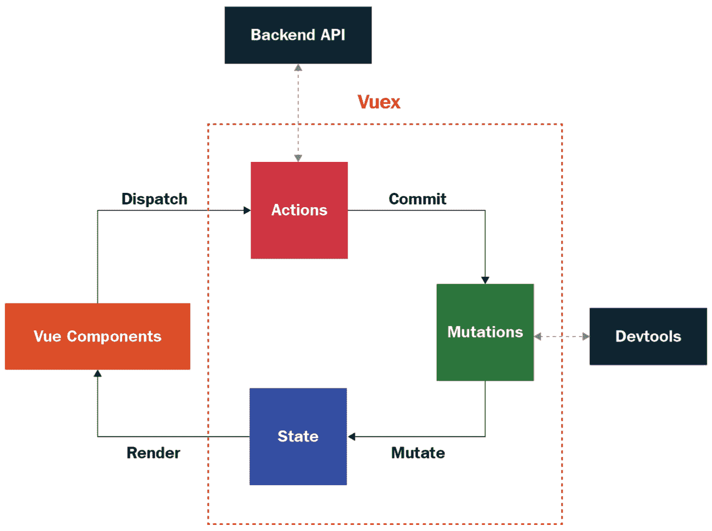
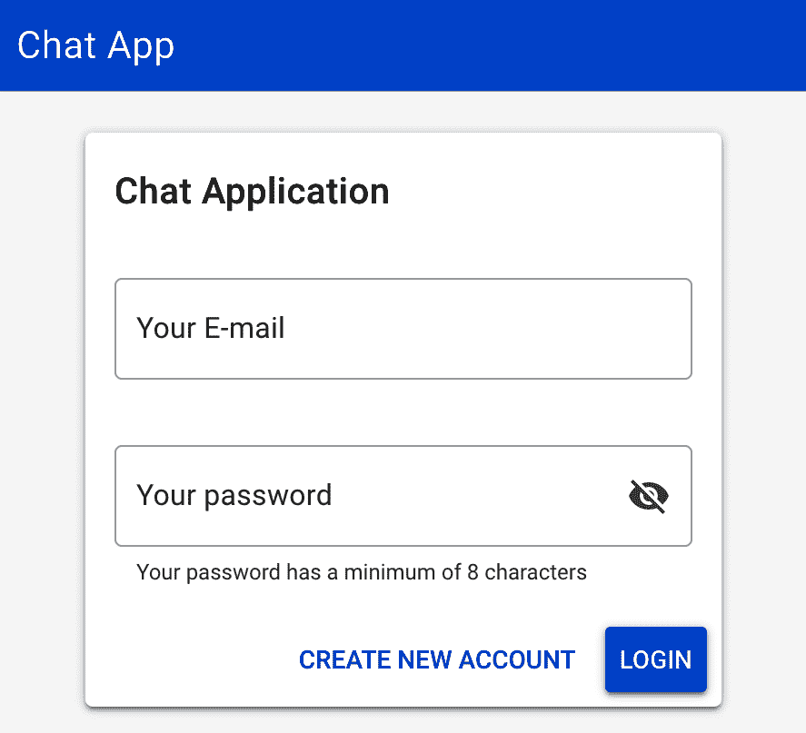
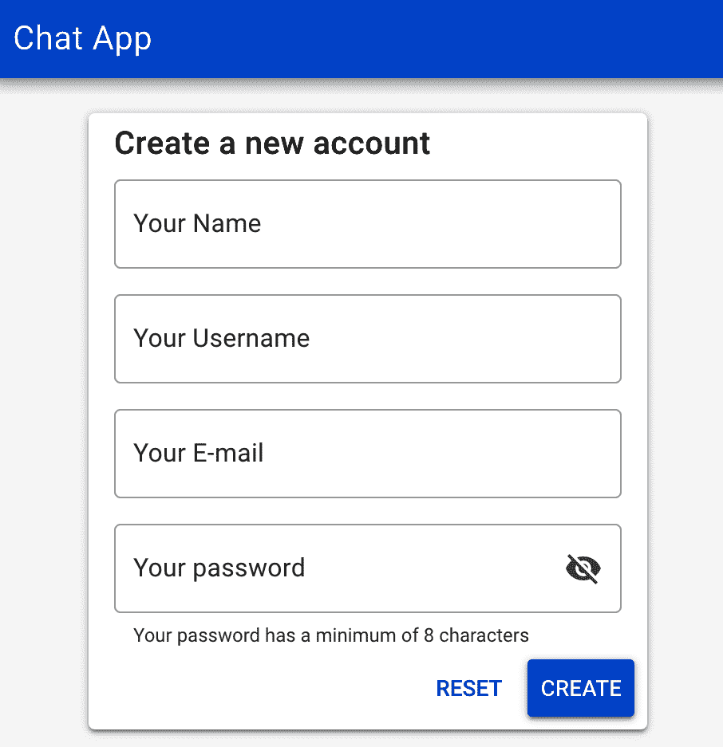
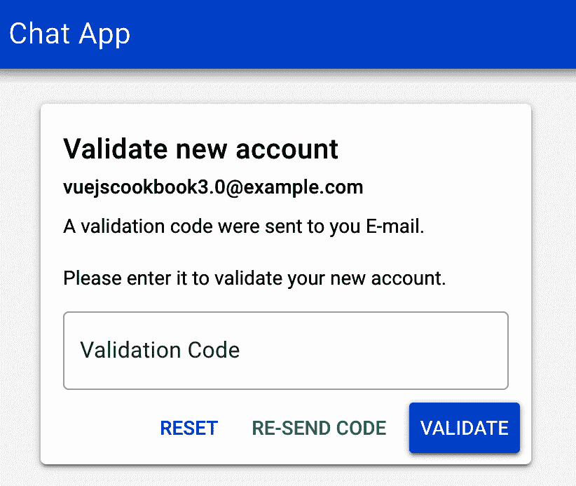
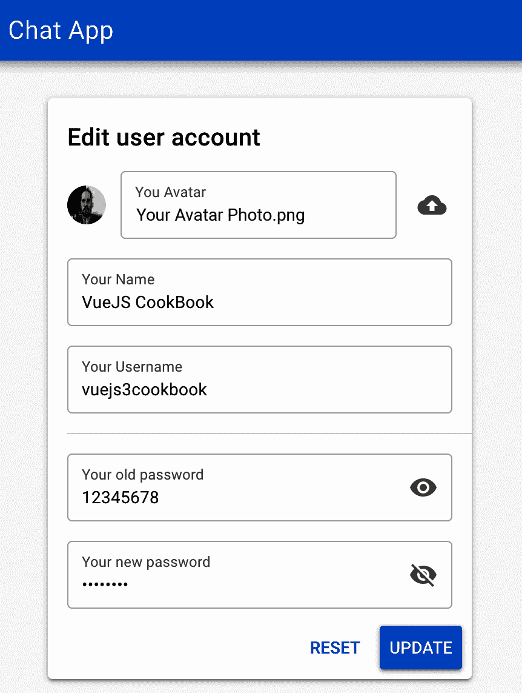

# 五、创建用户 Vuex 模块、页面和路由

现在，是时候开始给应用一个可识别的面孔了。在本章中，我们将开始开发用户和应用之间的交互。

我们将利用从前几章中收集的知识，通过使用自定义业务规则、Vuex 数据存储、特殊应用布局和用户能够交互的页面，使此应用变得栩栩如生。

在本章中，我们将学习如何创建用户 Vuex 模块，以便存储和管理与用户以及用户注册、登录、验证和编辑页面相关的所有内容。

在本章中，我们将介绍以下配方：

*   在应用中创建用户 Vuex 模块
*   为应用创建用户页面和路由

让我们开始吧！

# 技术要求

在本章中，我们将使用**Node.js**、**AWS Amplify**、**和**类星体框架**。**

****Attention, Windows users!** You need to install an `npm` package called `windows-build-tools` to be able to install the required packages. To do this, open PowerShell as administrator and execute the `> npm install -g windows-build-tools` command.

要安装**Quasar Framework****、**您需要打开终端（macOS 或 Linux）或命令提示符/PowerShell（Windows）并执行以下命令：

```js
> npm install -g @quasar/cli
```

要安装**AWS Amplify****、**您需要打开终端（macOS 或 Linux）或命令提示符/PowerShell（Windows）并执行以下命令：

```js
> npm install -g @aws-amplify/cli
```

# 在应用中创建用户 Vuex 模块

现在，是开始在我们的应用状态管理器或 Vuex 中存储数据的时候了。在应用上下文中，存储的所有数据都保存在名称空间中。

在此配方中，我们将学习如何创建用户 Vuex 模块。利用上一章的知识，我们将创建操作来创建新用户、更新其数据、验证用户、在 Amplify 上登录用户，并列出应用上的所有用户。

## 准备

此配方的先决条件是 Node.js 12+。

此配方所需的 Node.js 全局对象如下：

*   `@aws-amplify/cli`
*   `@quasar/cli`

为了启动我们的用户 Vuex 存储模块，我们将继续在[第 4 章](4.html)中创建的项目*创建自定义应用组件和布局*。

此配方将使用 GraphQL 查询和突变以及它们的驱动程序来完成，这在*创建您的第一个 GraphQL API*和*为您的应用创建 AWS Amplify 驱动程序[第 3 章](3.html)的*配方*中写入正在设置我们的聊天应用-AWS Amplify Environment 和 GraphQL*。

## 怎么做。。。

我们将用户 Vuex 模块的创建分为五个部分：创建**状态**、**突变**、**获取者**和**动作**，然后将模块添加到 Vuex 中。

### 创建用户 Vuex 状态

要在 Vuex 模块上存储数据，我们需要一个为我们存储数据的状态。按照以下步骤创建用户状态：

1.  在`store`文件夹中，创建一个名为`user`的新文件夹。在内部，创建一个名为`state.js`的新文件并打开它。
2.  创建一个名为`createState`的新函数，该函数返回一个 JavaScript 对象，该对象提供`id`、`username`、`email`、`name`、`avatar`、`password`、`loading`、`validated`和`error`属性。`id`、`username`、`email`、`name`和`password`属性将定义为空`string`，而`loading`和`validated`属性将定义为`false`。`error`将被定义为`undefined`，而`avatar`是一个具有三个属性的 JavaScript 对象—`key`、`bucket`和`region`：

```js
export function createState() {
  return {
    id: '',
    username: '',
    email: '',
    name: '',
    avatar: {
      key: '',
      bucket: '',
      region: '',
    },
    password: '',
    loading: false,
    validated: false,
    error: undefined,
  };
}
```

3.  最后，为了将状态导出为单例并使其作为 JavaScript 对象可用，我们需要`export default`执行`createState`函数：

```js
export default createState();
```

### 创建用户 Vuex

要保存状态上的任何数据，Vuex 需要进行变异。按照以下步骤创建将管理此模块的突变的用户突变：

1.  在`store/user`文件夹中创建一个名为`types.js`的新文件并打开它。
2.  在该文件中，导出一个默认 JavaScript 对象，该对象提供了`CREATE_USER`、`SET_USER_DATA`、`CLEAR_USER`、`USER_VALIDATED`、`LOADING`和`ERROR`属性。值与属性相同，但格式为字符串：

```js
export default {
  CREATE_USER: 'CREATE_USER',
  SET_USER_DATA: 'SET_USER_DATA',
  CLEAR_USER: 'CLEAR_USER',
  USER_VALIDATED: 'USER_VALIDATED',
  LOADING: 'LOADING',
  ERROR: 'ERROR',
};
```

3.  在`store/user`文件夹中创建一个名为`mutations.js`的新文件并打开它。
4.  从`state.js`导入新创建的`types.js`文件和`createState`JavaScript 对象：

```js
import MT from './types';
import { createState } from './state';
```

5.  创建一个名为`setLoading`的新函数，状态作为第一个参数。在内部，我们将`state.loading`设置为`true`：

```js
function setLoading(state) {
  state.loading = true;
}
```

6.  创建一个名为`setError`的新函数，第一个参数为`state`，第二个参数为`error`，默认值为`new Error()`。在内部，我们将`state.error`设置为`error`，将`state.loading`设置为`false`：

```js
function setError(state, error = new Error()) {
  state.error = error;
  state.loading = false;
}
```

7.  创建一个名为`createUser`的新函数，第一个参数为`state`，第二个参数为 JavaScript 对象。此 JavaScript 对象将提供`id`、`email`、`password`、`name`和`username`属性。所有属性都将是空字符串。在函数内部，我们将`state`属性定义为我们在函数参数中收到的属性：

```js
function createUser(state, {
  id = '',
  email = '',
  password = '',
  name = '',
  username = '',
}) {
  state.username = username;
  state.email = email;
  state.name = name;
  state.id = id;
  state.password = window.btoa(password);
  state.loading = false;
}
```

8.  创建一个名为`validateUser`的新函数，并将`state`作为第一个参数。在其中，我们将`state.validated`属性设置为`true`，删除`state.password`属性，并将`state.loading`属性设置为`false`：

```js
function validateUser(state) {
  state.validated = true;
  delete state.password;
  state.loading = false;
}
```

9.  创建一个名为`setUserData`的新函数，第一个参数为`state`，第二个参数为 JavaScript 对象。此对象将提供`id`、`email`、`password`、`name`和`username`属性。它们都将是空字符串。`avatar`是一个 JavaScript 对象，具有三个属性：`key`、`bucket`和`region`。在函数内部，我们将`state`属性定义为我们在函数参数中收到的属性：

```js
function setUserData(state, {
  id = '',
  email = '',
  name = '',
  username = '',
  avatar = {
    key: '',
    bucket: '',
    region: '',
  },
}) {
  state.id = id;
  state.email = email;
  state.name = name;
  state.username = username;
  state.avatar = avatar || {
    key: '',
    bucket: '',
    region: '',
  };

  delete state.password;

  state.validated = true;
  state.loading = false;
}
```

10.  创建一个名为`clearUser`的新函数，并将`state`作为第一个参数。然后，在它的函数中，我们将从`createState`函数中得到一个新的干净`state`，并迭代当前`state`，将`state`属性的值定义回默认值：

```js
function clearUser(state) {
 const newState = createState();

 Object.keys(state).forEach((key) => {
 state[key] = newState[key];
 });
}
```

11.  最后，导出一个默认 JavaScript 对象，其中键作为导入的变异类型，值作为对应于每个类型的函数：

*   将`MT.LOADING`设置为`setLoading`
*   将`MT.ERROR`设置为`setError`
*   将`MT.CREATE_USER`设置为`createUser`
*   将`MT.USER_VALIDATED`设置为`validateUser`
*   将`MT.SET_USER_DATA`设置为`setUserData`
*   将`MT.CLEAR_USER`设置为`clearUser`：

```js
export default {
  [MT.LOADING]: setLoading,
  [MT.ERROR]: setError,
  [MT.CREATE_USER]: createUser,
  [MT.USER_VALIDATED]: validateUser,
  [MT.SET_USER_DATA]: setUserData,
  [MT.CLEAR_USER]: clearUser,
};

```

### 创建用户 Vuex getter

要访问存储在状态上的数据，我们需要创建一些`getters`。按照以下步骤为用户模块创建`getters`：

In a `getter` function, the first argument that that function will receive will always be the current `state` of the Vuex `store`.

1.  在`store/user`文件夹中创建一个名为`getters.js`的新文件。
2.  创建一个名为`getUserId`的新函数，该函数返回`state.id`：

```js
const getUserId = (state) => state.id;
```

3.  创建一个名为`getUserEmail`的新函数，该函数返回`state.email`：

```js
const getUserEmail = (state) => state.email;
```

4.  创建一个名为`getUserUsername`的新函数，该函数返回`state.username`：

```js
const getUserUsername = (state) => state.username;
```

5.  创建一个名为`getUserAvatar`的新函数，该函数返回`state.avatar`：

```js
const getUserAvatar = (state) => state.avatar;
```

6.  创建一个名为`getUser`的新函数，该函数返回一个 JavaScript 对象，该对象提供`id`、`name`、`username`、`avatar`和`email`属性。这些属性的值将对应于`state`：

```js
const getUser = (state) => ({
  id: state.id,
  name: state.name,
  username: state.username,
  avatar: state.avatar,
  email: state.email,
});
```

7.  创建一个名为`isLoading`的新函数，该函数返回`state.loading`：

```js
const isLoading = (state) => state.loading;
```

8.  创建一个名为`hasError`的新函数，该函数返回`state.error`：

```js
const hasError = (state) => state.error;
```

9.  最后，以创建的函数（`getUserId`、`getUserEmail`、`getUserUsername`、`getUserAvatar`、`getUser`、`isLoading`和`hasError`作为属性导出一个`default`JavaScript 对象：

```js
export default {
  getUserId,
  getUserEmail,
  getUserUsername,
  getUserAvatar,
  getUser,
  isLoading,
  hasError,
};
```

### 创建用户 Vuex 操作

按照以下步骤创建用户 Vuex 操作：

1.  在`store/user`文件夹中创建一个名为`actions.js`的文件并打开它。
2.  首先，我们需要导入我们将在此处使用的函数、枚举和类：

*   从`aws-amplify`npm 包导入`graphqlOperation`。
*   从 GraphQL 查询中导入`getUser`和`listUsers`。
*   从 GraphQL 突变导入`createUser`和`updateUser`。
*   从`driver/auth.js`导入`signUp`、`validateUser`、`signIn`、`getCurrentAuthUser`和`changePassword`功能。
*   从`driver/appsync`导入`AuthAPI`。
*   从`./types.js`导入 Vuex 突变类型：

```js
import { graphqlOperation } from 'aws-amplify';
import { getUser } from 'src/graphql/queries';
import { listUsers } from 'src/graphql/fragments';
import { createUser, updateUser } from 'src/graphql/mutations';
import { AuthAPI } from 'src/driver/appsync';
import {
  signUp,
  validateUser,
  signIn,
  getCurrentAuthUser,
  changePassword,
} from 'driver/auth';
import MT from './types';
```

3.  创建一个名为`initialLogin`的新异步函数。此函数将接收一个 JavaScript 对象作为第一个参数。这将提供一个`commit`属性。在此函数中，我们将获取当前经过身份验证的用户，从 GraphQL API 获取他们的数据，并将用户数据提交到 Vuex 存储：

```js
async function initialLogin({ commit }) {
  try {
    commit(MT.LOADING);

    const AuthUser = await getCurrentAuthUser();

    const { data } = await AuthAPI.graphql(graphqlOperation(getUser, {
      id: AuthUser.username,
    }));

    commit(MT.SET_USER_DATA, data.getUser);

    return Promise.resolve(AuthUser);
  } catch (err) {
    commit(MT.ERROR, err);
    return Promise.reject(err);
  }
}
```

4.  创建一个名为`signUpNewUser`的新异步函数。此函数将接收一个 JavaScript 对象，该对象的第一个参数为`commit`属性。第二个参数也是一个 JavaScript 对象，但具有`email`、`name`和`password`属性。在此函数中，我们将从`auth.js`驱动程序执行`signUp`函数，在 AWS Cognito 用户池中注册并创建用户，然后将用户数据提交到 Vuex 存储：

```js
async function signUpNewUser({ commit }, {
  email = '',
  name = '',
  username = '',
  password = '',
}) {
  try {
    commit(MT.LOADING);

    const userData = await signUp(email, password);

    commit(MT.CREATE_USER, {
      id: userData.userSub,
      email,
      password,
      name,
      username,
    });

    return Promise.resolve(userData);
  } catch (err) {
    commit(MT.ERROR, err);
    return Promise.reject(err);
  }
}
```

5.  创建一个名为`createNewUser`的新异步函数。此函数将接收一个 JavaScript 对象，其第一个参数为`commit`和`state`属性。对于第二个参数，函数将接收一个`code`字符串。在这个函数中，我们将从`state`获取用户数据，并从`auth.js`驱动程序执行`validateUser`函数，以检查该用户是否是 AWS Cognito 用户池中的有效用户。然后我们将从`auth.js`执行`signIn`函数，将`email`和`password`作为参数传递`password`需要转换成加密的 base64 字符串，然后发送给函数。之后，我们将获取经过身份验证的用户数据并将其发送到 GraphQL API 以创建新用户：

```js
async function createNewUser({ commit, state }, code) {
  try {
    commit(MT.LOADING);
    const {
      email,
      name,
      username,
      password,
    } = state;
    const userData = await validateUser(email, code);

    await signIn(`${email}`, `${window.atob(password)}`);

    const { id } = await getCurrentAuthUser();

    await AuthAPI.graphql(graphqlOperation(
      createUser,
      {
        input: {
          id,
          username,
          email,
          name,
        },
      },
    ));

    commit(MT.USER_VALIDATED);

    return Promise.resolve(userData);
  } catch (err) {
    commit(MT.ERROR, err);
    return Promise.reject(err);
  }
}
```

6.  创建一个名为`signInUser`的新异步函数。此函数将接收一个 JavaScript 对象，其第一个参数为`commit`和`dispatch`属性。第二个参数也是一个 JavaScript 对象，将具有`email`和`password`属性。在这个函数中，我们将从`auth.js`驱动程序执行`signIn`函数，将`email`和`password`作为参数传递，然后调度`initialLogin`Vuex 动作：

```js
async function signInUser({ commit, dispatch }, { email = '', password = '' }) {
  try {
    commit(MT.LOADING);

    await signIn(`${email}`, `${password}`);

    await dispatch('initialLogin');

    return Promise.resolve(true);
  } catch (err) {
    commit(MT.ERROR);
    return Promise.reject(err);
  }
}
```

7.  创建一个名为`editUser`的新异步函数。此函数将接收一个 JavaScript 对象，其第一个参数为`commit`和`state`属性。第二个参数也是一个 JavaScript 对象，将具有`username`、`name`、`avatar`、`password`和`newPassword`属性。在这个函数中，我们将把`state`值与作为参数接收的新值合并。然后，我们将它们发送到 GraphQLAPI 以更新用户信息。然后，我们将检查是否同时填写了`password`和`newPasssword`属性。如果是，我们将从`auth.js`驱动程序执行`changePassword`功能，以更改 AWS Cognito 用户池中的用户密码：

```js
async function editUser({ commit, state }, {
  username = '',
  name = '',
  avatar = {
    key: '',
    bucket: '',
    region: '',
  },
  password = '',
  newPassword = '',
}) {
  try {
    commit(MT.LOADING);

    const updateObject = {
      ...{
        name: state.name,
        username: state.username,
        avatar: state.avatar,
      },
      ...{
        name,
        username,
        avatar,
      },
    };

    const { data } = await AuthAPI.graphql(graphqlOperation(updateUser,
      { input: { id: state.id, ...updateObject } }));

    if (password && newPassword) {
      await changePassword(password, newPassword);
    }

    commit(MT.SET_USER_DATA, data.updateUser);

    return Promise.resolve(data.updateUser);
  } catch (err) {
    return Promise.reject(err);
  }
}
```

8.  创建一个名为`listAllUsers`的新异步函数。此函数将获取数据库中的所有用户并返回一个列表：

```js
async function listAllUsers() {
  try {
    const {
      data: {
        listUsers: {
          items: usersList,
        },
      },
    } = await AuthAPI.graphql(graphqlOperation(
      listUsers,
    ));

    return Promise.resolve(usersList);
  } catch (e) {
    return Promise.reject(e);
  }
}
```

9.  最后，我们将导出所有默认创建的函数：

```js
export default {
 initialLogin,
 signUpNewUser,
 createNewUser,
 signInUser,
 editUser,
 listAllUsers,
};
```

### 将用户模块添加到 Vuex

按照以下步骤将创建的用户模块导入 Vuex 状态：

1.  在`store/user`文件夹中创建一个名为`index.js`的新文件。
2.  导入我们刚刚创建的`state.js`、`actions.js`、`mutation.js`和`getters.js`文件：

```js
import state from './state';
import actions from './actions';
import mutations from './mutations';
import getters from './getters';
```

3.  使用 JavaScript 对象创建一个`export default`，该对象提供`state`、`actions`、`mutations`、`getters`和`namespaced`（设置为`true`）属性：

```js
export default {
  namespaced: true,
  state,
  actions,
  mutations,
  getters,
};
```

4.  打开`store` 文件夹中的`index.js`文件。
5.  导入`store/user`文件夹中新创建的`index.js`：

```js
import Vue from 'vue';
import Vuex from 'vuex';
import user from './user';
```

6.  在新的 Vuex 类实例化中，我们需要添加一个名为`modules`的新属性，并将其定义为 JavaScript 对象。然后，我们需要添加一个新的`user`属性–该属性将自动用作值，因为它与上一步导入的用户模块具有相同的名称：

```js
export default function (/* { ssrContext } */) {
  const Store = new Vuex.Store({
    modules: {
      user,
    },
    strict: process.env.DEV,
  });

  return Store;
}
```

## 它是如何工作的。。。

声明 Vuex 存储时，需要创建三个主要属性：`state`、`mutations`和`actions`。这些属性作为单个结构，通过注入的`$store`原型或导出的`store`变量绑定到 Vue 应用。

`state`是一个集中的对象，它保存您的信息并使其可供`mutations`、`actions`或`components`使用。更改`state`始终需要通过`mutation`执行同步功能。

`mutation`是一个同步函数，可以改变`state`并可跟踪。这意味着，当您在开发时，您可以在 Vuex 商店中的所有执行的`mutations`中进行时间旅行。

`action`是一个异步函数，可以用来保存业务逻辑、API 调用、调度其他`actions`和执行`mutations`。当您需要更改 Vuex 存储时，这些函数是常用的入口点。

在下图中可以看到 Vuex 存储的简单表示：



在此配方中，我们创建了用户 Vuex 模块。该模块包括所有业务逻辑，这些逻辑将帮助我们管理应用中的用户，从创建新用户到更新用户。

在查看 Vuex 操作时，我们使用 AppSync API 客户端获取数据并将其发送到 GraphQL API。我们使用 Amplify CLI 创建的查询和突变来实现这一点。为了能够与 GraphQL API 进行通信，以便我们能够更新用户，我们从[第 3 章](3.html)中的*为您的应用创建 AWS 放大驱动程序*配方**获取了我们在 Auth 驱动程序中使用的数据，*设置了我们的聊天应用—AWS 放大环境和 GraphQL* .**

 *这些 API 请求由 Vuex 处理并存储在 Vuex 状态中，我们可以通过 Vuex getter 访问该状态。

## 另见

*   有关 Amplify 的 AppSync GraphQL 客户端的更多信息，请访问[https://aws-amplify.github.io/docs/js/api#amplify-graphql 客户端](https://aws-amplify.github.io/docs/js/api#amplify-graphql-client)。
*   有关 Vuex 的更多信息，请访问[https：/​/​vuex。​vuejs。​组织机构/​](https://vuex.vuejs.org/) 。
*   有关 Vuex 模块的更多信息，请访问[https://vuex.vuejs.org/guide/modules.html](https://vuex.vuejs.org/guide/modules.html)

# 为应用创建用户页面和路由

使用 Vue 应用时，您需要一种方法来管理用户的位置。您可以使用动态组件处理此问题，但最好的方法是通过路由管理。

在本食谱中，我们将学习如何使用每条路由所需的业务规则创建应用页面。然后，我们将使用路线管理来处理一切。

## 准备

此配方的先决条件如下：

*   我们在上一个配方中创建的项目
*   Node.js 12+

此配方所需的 Node.js 全局对象如下：

*   `@aws-amplify/cli`
*   `@quasar/cli`

为了启动我们的用户页面和路由，我们将继续我们在*中创建的项目，在您的应用*配方上创建用户 Vuex 模块。

## 怎么做。。。

在此配方中，我们将创建应用中用户所需的所有页面：登录页面、注册页面和用户编辑页面。

### 向 Quasar 添加对话框插件

要使用 Quasar 对话框插件，我们需要将其添加到配置文件中。

打开项目根文件夹中的`quasar.conf.js`文件，找到`framework`属性。然后，在`plugins`属性中，将`'Dialog'`字符串添加到数组中，以便 Quasar 在启动应用时加载`Dialog`插件：

```js
framework: {
 ...
  plugins: [
   'Dialog',
  ],
 ...
},
```

### 创建用户登录页面

对于用户登录页面，我们将使用前面创建的两个组件：`PasswordInput`和`EmailInput`。

#### 单文件组件

是时候创建用户登录页面的`<script>`部分了：

1.  在`src/pages`文件夹中，打开`Index.vue`文件。
2.  从`vuex`包中导入`mapActions`和`mapGetters`功能：

```js
import { mapActions, mapGetters } from 'vuex';
```

3.  创建一个具有五个属性的`export default`JavaScript 对象；即，`name`（定义为`'Index'`）、`components`、`data`、`computed`和`methods`：

```js
export default {
  name: 'Index',
  components: {
  },
  data: () => ({
  }),
  computed: {
  },
  methods: {
  },
};

```

4.  在`components`属性中，添加两个名为`PasswordInput`和`EmailInput`的新属性。将`PasswordInput`定义为返回值为`import('components/PasswordInput')`的匿名函数，`EmailInput`定义为返回值为`import('components/EmailInput')`的匿名函数：

```js
components: {
  PasswordInput: () => import('components/PasswordInput'),
  EmailInput: () => import('components/EmailInput'),
},
```

5.  在`data`属性中，我们将返回一个 JavaScript 对象，该对象提供两个属性`email`和`password`，这两个属性都是空字符串：

```js
data: () => ({
  email: '',
  password: '',
}),
```

6.  在`computed`属性中，我们将解构`mapGetters`函数，将所需模块的名称空间作为第一个参数传递（在本例中为`'user'`。我们将传递一个要导入的数组`getters`（本例中为`isLoading`），作为第二个参数：

```js
computed: {
  ...mapGetters('user', [
    'isLoading',
    'getUserId',
  ]),
},
```

7.  在`beforeMount`生命周期钩子上，我们将添加一条`if`语句，检查`getUserId`是否真实，然后将用户重定向到`Contacts`路由。

```js
async beforeMount() {
  if (this.getUserId) {
    await this.$router.replace({ name: 'Contacts' });
  }
},

```

8.  最后，对于`methods`属性，我们将破坏`mapActions`函数，将我们想要的模块的名称空间（在本例中为`'user'`）作为第一个参数传递。对于第二个参数，我们将使用一个要导入的数组`actions`——在本场景中，这是`signInUser`。接下来，我们需要添加异步`onSubmit`方法，它将调度`signInUser`并将用户发送到`Contacts`路由，以及`createAccount`方法，它将用户发送到`SignUp`路由：

```js
methods: {
  ...mapActions('user', [
    'signInUser',
  ]),
  async onSubmit() {
    try {
      await this.signInUser({
        email: this.email,
        password: this.password,
      });
      await this.$router.push({ name: 'Contacts' });
    } catch (e) {
      this.$q.dialog({
        message: e.message,
      });
    }
  },
  createAccount() {
    this.$router.push({ name: 'SignUp' });
  },
},
```

#### 单文件组件<template></template>

我们现在需要添加`<template>`页面：

1.  创建一个名为`QPage`的组件，其`class`属性定义为`"bg-grey-1 flex flex-center"`：

```js
<q-page padding class="bg-grey-1 flex flex-center">
</q-page>
```

2.  在`QPage`组件内部，创建一个`QCard`组件，其`style`属性定义为`"width: 350px"`：

```js
<q-card style="width: 350px">
</q-card>

```

3.  在`QCard`组件内部，创建一个`QCardSection`和一个`h6`子组件，该子组件的`class`属性定义为`no-margin`：

```js
<q-card-section>
  <h6 class="no-margin">Chat Application</h6>
</q-card-section>
```

4.  现在，创建一个具有`QForm`子组件的`QCardSection`，该子组件的 class 属性定义为`q-gutter-md`。在`QForm`组件内部，创建一个`EmailInput`组件，将`v-model`指令绑定到`data.email`，并创建一个`PasswordInput`组件，将`v-model`指令绑定到`data.password`属性：

```js
<q-card-section>
  <q-form
    class="q-gutter-md"
  >
    <email-input
      v-model.trim="email"
    />
    <password-input
      v-model.trim="password"
    />
  </q-form>
</q-card-section>
```

5.  然后，创建一个具有定义为`right`的`align`属性的`QCardActions`组件。在内部，添加一个`QBtn`，将`label`属性设置为`"Create new Account"`、`color`属性设置为`primary`、`class`属性设置为`q-ml-sm`、`flat`属性设置为`true`，并将`@click`事件侦听器绑定到`createAccount`方法。接下来，创建另一个`QBtn`组件，将`label`属性设置为`"Login"`、`type`属性设置为`"submit"`、`color`属性设置为`primary`，并将`@click`事件侦听器绑定到`onSubmit`方法：

```js
<q-card-actions align="right">
  <q-btn
    label="Create new account"
    color="primary"
    flat
    class="q-ml-sm"
    @click="createAccount"
  />
  <q-btn
    label="Login"
    type="submit"
    color="primary"
    @click="onSubmit"
  />
</q-card-actions>
```

6.  最后，创建一个具有绑定到`computed.isLoading`的`:showing`属性的`QInnerLoading`组件。这需要有一个提供`size`属性的`QSpinner`子组件。将其设置为`50px`和`color`设置为`primary`：

```js
<q-inner-loading :showing="isLoading">
  <q-spinner size="50px" color="primary"/>
</q-inner-loading>
```

要运行服务器并查看进度，您需要打开终端（macOS 或 Linux）或命令提示符/PowerShell（Windows），然后执行以下命令：

```js
> quasar dev
```

以下是页面外观的预览：



### 创建用户注册页面

对于用户注册页面，我们将使用我们已经创建的四个组件：`NameInput`、`UsernameInput`、`PasswordInput`和`EmailInput`。

#### 单文件组件

在这里，我们将创建用户注册页面的`<script>`部分：

1.  在**`src/pages`**文件夹中，创建一个名为`SignUp.vue`的新文件并打开它。
2.  从`vuex`包中导入`mapActions`和`mapGetters`功能：

```js
import { mapActions, mapGetters } from 'vuex';
```

3.  创建一个提供五个属性的`export default`JavaScript 对象：`name`（定义为`'SignUp'`）、`components`、`data`、`computed`和`methods`：

```js
export default {
  name: 'SignUp',
  components: {},
  data: () => ({
  }),
  computed: {
  },
  methods: {
  },
};
```

4.  在`components`属性中，添加四个新属性：`NameInput`、`UsernameInput`、`PasswordInput`和`EmailInput`。这样定义它们：

*   `NameInput`作为匿名函数，返回值为`import('components/NameInput')`
*   `UsernameInput`作为匿名函数，返回值为`import('components/UsernameInput')`
*   `PasswordInput`作为匿名函数，返回值为`import('components/PasswordInput')`
*   `EmailInput`作为匿名函数，返回值为`import('components/EmailInput')`

这可以在以下代码中看到：

```js
components: {
  PasswordInput: () => import('components/PasswordInput'),
  EmailInput: () => import('components/EmailInput'),
  UsernameInput: () => import('components/UsernameInput'),
  NameInput: () => import('components/NameInput'),
},

```

5.  在`data`属性中，我们将返回一个 JavaScript 对象，该对象提供四个属性—`name`、`username`、`email`和`password`——所有这些属性都将是空字符串：

```js
data: () => ({
  name: '',
  username: '',
  email: '',
  password: '',
}),
```

6.  在`computed`属性中，我们将破坏`mapGetters`函数，将我们想要的模块的名称空间（在本例中为`'user'`）作为第一个参数传递。对于第二个参数，我们将使用要导入的`getters`数组–在本场景中，这是`isLoading`：

```js
computed: {
  ...mapGetters('user', [
    'isLoading',
  ]),
},
```

7.  最后，对于`methods`属性，首先，我们将解构`mapActions`函数，将我们想要的模块的名称空间（在本例中为`'user'`）作为第一个参数传递。对于第二个参数，我们将传递一个要导入的数组`actions`——在本场景中，这是`signUpNewUser`。接下来，我们需要添加异步`onSubmit`方法，该方法将调度`signUpNewUser`然后将用户发送到`Validate`路由，以及`onReset`方法，该方法将清除数据：

```js
methods: {
  ...mapActions('user', [
    'signUpNewUser',
  ]),
  async onSubmit() {
    try {
      await this.signUpNewUser({
        name: this.name,
        username: this.username,
        email: this.email,
        password: this.password,
      });
      await this.$router.replace({ name: 'Validate' });
    } catch (e) {
      this.$q.dialog({
        message: e.message,
      });
    }
  },
  onReset() {
    this.email = '';
    this.password = '';
  },
},
```

#### 单文件组件<template></template>

为了完成页面，我们需要添加`<template>`部分：

1.  创建一个`QPage`组件，其`class`属性定义为`"bg-grey-1 flex flex-center"`：

```js
<q-page padding class="bg-grey-1 flex flex-center">
</q-page>
```

2.  在`QPage`组件内部，创建一个`QCard`组件，其`style`属性定义为`"width: 350px"`：

```js
<q-card style="width: 350px">
</q-card>
```

3.  在`QCard`组件内部，创建一个具有`h6`子组件的`QCardSection`，其中`class`属性定义为`no-margin`：

```js
<q-card-section>
  <h6 class="no-margin">Create a new Account</h6>
</q-card-section>

```

4.  之后，创建一个带有`QForm`子组件的`QCardSection`，其中`class`属性定义为`q-gutter-md`。在`QForm`组件内部，创建`v-model`指令绑定`data.name`的`NameInput`组件、`v-model`指令绑定`data.username`的`UsernameInput`组件、`EmailInput`指令绑定`v-model`指令绑定`data.email`的`EmailInput`组件和`v-model`指令绑定`data.password`的`PasswordInput`组件财产：

```js
<q-card-section>
  <q-form
    class="q-gutter-md"
  >
    <name-input
      v-model.trim="name"
    />
    <username-input
      v-model.trim="username"
    />
    <email-input
      v-model.trim="email"
    />
    <password-input
      v-model.trim="password"
    />
  </q-form>
</q-card-section>
```

5.  现在，创建一个`QCardActions`组件，将`align`属性设置为`right`。在内部，添加一个`QBtn`，将`label`属性设置为`"Reset"`、`color`属性设置为`primary`、`class`属性设置为`q-ml-sm`、`flat`属性设置为`true`，并将`@click`事件侦听器绑定到`onReset`方法。然后，创建另一个`QBtn`组件，将`label`属性设置为`"Create"`、`type`属性设置为`"submit"`、`color`属性设置为`primary`，并将`@click`事件侦听器绑定到`onSubmit`方法：

```js
<q-card-actions align="right">
  <q-btn
    label="Reset"
    type="reset"
    color="primary"
    flat
    class="q-ml-sm"
    @click="onReset"
  />
  <q-btn
    label="Create"
    type="submit"
    color="primary"
    @click="onSubmit"
  />
</q-card-actions>
```

6.  最后，创建一个具有绑定到`computed.isLoading`的`:showing`属性的`QInnerLoading`组件。这需要有一个`QSpinner`子组件。`size`属性需要设置为`50px`和`color`属性需要设置为`primary`：

```js
<q-inner-loading :showing="isLoading">
  <q-spinner size="50px" color="primary"/>
</q-inner-loading>

```

要运行服务器并查看进度，您需要打开终端（macOS 或 Linux）或命令提示符/PowerShell（Windows），然后执行以下命令：

```js
> quasar dev
```

以下是页面外观的预览：



### 创建用户验证页面

一旦用户创建了一个帐户，AWS Amplify 将发送一封带有验证 pin 码的电子邮件，我们需要将该 pin 码发回以进行验证。此页面将是验证页面。

#### 单文件组件

按照以下步骤为用户验证页面创建`<script>`部分：

1.  在`src/pages`文件夹中，创建一个名为`Validate.vue`的新文件并打开它。
2.  从`vuex`包导入`mapActions`和`mapGetters`功能，从`driver/auth`导入`resendValidationCode`功能：

```js
import { mapActions, mapGetters } from 'vuex';
import { resendValidationCode } from 'driver/auth';
```

3.  创建一个提供四个属性的`export default`JavaScript 对象：`name`（定义为`'Validate'`）、`data`、`computed`和`methods`：

```js
export default {
  name: 'Validate',
  data: () => ({
  }),
  computed: {
  },
  methods: {
  },
};
```

4.  在`data`属性中，我们将返回一个带有`code`属性的 JavaScript 对象作为空字符串：

```js
data: () => ({
  code: '',
}),
```

5.  在`computed`属性中，我们将破坏`mapGetters`函数，将我们想要的模块的名称空间（在本例中为`'user'`）作为第一个参数传递。对于第二个参数，我们将传递一个要导入的数组`getters`——在本场景中，`isLoading`和`getUserEmail`：

```js
computed: {
  ...mapGetters('user', [
    'isLoading',
    'getUserEmail',
  ]),
},

```

6.  最后，对于`methods`属性，我们将破坏`mapActions`函数，将我们想要的模块的名称空间（在本例中为`'user'`）作为第一个参数传递。对于第二个参数，我们将传递一个要导入的数组`actions`——在本场景中为`createNewUser`。接下来需要增加异步`onSubmit`方法，该方法将调度`createNewUser`并将用户发送到`Index`路由；`resendCode`方法，将向用户重新发送另一个验证码；以及将重置数据的`onReset`方法：

```js
methods: {
  ...mapActions('user', [
    'createNewUser',
  ]),
  async onSubmit() {
    try {
      await this.createNewUser(this.code);
      await this.$router.replace({ name: 'Index' });
    } catch (e) {
      console.error(e);
      this.$q.dialog({
        message: e.message,
      });
    }
  },
  async resendCode() {
    await resendValidationCode(this.getUserEmail);
  },
  onReset() {
    this.code = '';
  },
},
```

#### 单文件组件<template></template>

按照以下步骤创建用户验证页面的`<template>`部分：

1.  创建一个`QPage`组件，其`class`属性定义为`"bg-grey-1 flex flex-center"`：

```js
<q-page padding class="bg-grey-1 flex flex-center">
</q-page>
```

2.  在`QPage`组件内部，创建一个`QCard`组件，其`style`属性定义为`"width: 350px"`：

```js
<q-card style="width: 350px">
</q-card>
```

3.  在`QCard`组件内部，创建一个`QCardSection`，其中包含`h6`子组件和定义为`no-margin`的`class`属性。然后，创建一个具有定义为`text-subtitle2`的`class`属性的同级元素：

```js
<q-card-section>
  <h6 class="no-margin">Validate new account</h6>
  <div class="text-subtitle2">{{ getUserEmail }}</div>
</q-card-section>
```

4.  创建一个包含两个子组件的`QCardSection`。这些将是 HTML 元素，`P`：

```js
<q-card-section>
 <p>A validation code were sent to you E-mail.</p>
 <p>Please enter it to validate your new account.</p>
</q-card-section>
```

5.  之后，创建一个具有`QForm`子组件和`class`属性定义为`q-gutter-md`的`QCardSection`。在`QForm`组件内部，添加`QInput`组件作为子元素。然后，在`QInput`组件内部，将`v-model`指令绑定到`data.code`。在`QInput``rules`属性中，将`rules`值定义为验证数组，该数组将检查是否键入了任何代码。启用`lazy-rules`以便仅在一段时间后进行验证：

```js
<q-card-section>
  <q-form
    class="q-gutter-md"
  >
    <q-input
      v-model.trim="code"
      :rules="[ val => val && val.length > 0
      || 'Please type the validation code']"
      outlined
      label="Validation Code"
      lazy-rules
    />
  </q-form>
</q-card-section>

```

6.  现在，创建一个`QCardActions`组件，将`align`属性设置为`right`。在内部，添加一个`QBtn`，将`label`属性设置为`"Reset"`、`color`属性设置为`primary`、`class`属性设置为`q-ml-sm`、`flat`属性设置为`true`，并将`@click`事件侦听器绑定到`onReset`方法。创建另一个`QBtn`，将`label`属性设置为`"Re-send code"`、`color`设置为`secondary`、`class`设置为`q-ml-sm`、`flat`设置为`true`，并将`@click`事件侦听器绑定到`resendCode`方法。最后，创建一个`QBtn`组件，将`label`属性设置为`"Validate"`、`type`属性设置为`"submit"`、`color`属性设置为`primary`，并将`@click`事件侦听器绑定到`onSubmit`方法：

```js
<q-card-actions align="right">
  <q-btn
    label="Reset"
    type="reset"
    color="primary"
    flat
    class="q-ml-sm"
  />
  <q-btn
    flat
    label="Re-send code"
    color="secondary"
    class="q-ml-sm"
    @click="resendCode"
  />
  <q-btn
    label="Validate"
    type="submit"
    color="primary"
    @click="onSubmit"
  />
</q-card-actions>
```

7.  最后，创建一个具有绑定到`computed.isLoading`的`:showing`属性的`QInnerLoading`组件。应具有`QSpinner`子组件，且`size`设置为`50px`且`color`设置为`primary`：

```js
<q-inner-loading :showing="isLoading">
  <q-spinner size="50px" color="primary"/>
</q-inner-loading>
```

要运行服务器并查看进度，您需要打开终端（macOS 或 Linux）或命令提示符/PowerShell（Windows），然后执行以下命令：

```js
> quasar dev 
```

以下是页面外观的预览：



### 创建用户编辑页面

对于用户编辑页面，我们将使用我们已经创建的四个组件：`NameInput`、`UsernameInput`、`AvatarInput`和`PasswordInput`。

#### 单文件组件

按照以下步骤开始开发用户编辑页面的`<script>`部分：

1.  在`src/pages`文件夹中，创建一个名为`Edit.vue`的新文件并打开它。
2.  从`vuex`包中导入`mapActions`和`mapGetters`功能：

```js
import { mapActions, mapGetters } from 'vuex';
```

2.  创建一个提供四个属性的`export default`JavaScript 对象：`name`（定义为`'SignUp'`）、`data`、`computed`和`methods`：

```js
export default {
  name: 'EditUser',
  components: {},
  data: () => ({
  }),
  created() {},
  computed: {
  },
  methods: {
  },
};
```

3.  在`components`属性中，添加四个名为`NameInput`、`UsernameInput`、`PasswordInput`、`AvatarInput`的新属性。这样设置：

`NameInput`作为匿名函数，返回值为`import('components/NameInput')`

`UsernameInput`作为匿名函数，返回值为`import('components/UsernameInput')`

`PasswordInput`作为匿名函数，返回值为`import('components/PasswordInput')`

`AvatarInput`作为返回值为`import('components/AvatarInput')`的匿名函数：

```js
components: {
  AvatarInput: () => import('/components/AvatarInput'),
  PasswordInput: () => import('components/PasswordInput'),
  UsernameInput: () => import('components/UsernameInput'),
  NameInput: () => import('components/NameInput'),
},
```

4.  在`data`属性中，我们将返回一个 JavaScript 对象，该对象提供五个属性：`name`、`username`、`avatar`、`email`和`password`。所有这些都将是空字符串：

```js
data: () => ({
  name: '',
  username: '',
  avatar: '',
  password: '',
  newPassword: '',
}),

```

5.  在`created`生命周期钩子内，将`data.name`定义为`getUser.name`、`data.username`定义为`getUser.username`、`data.avatar`定义为`getUser.avatar`：

```js
created() {
  this.name = this.getUser.name;
  this.username = this.getUser.username;
  this.avatar = this.getUser.avatar;
},
```

6.  在`computed`属性中，我们将破坏`mapGetters`函数，将我们想要的模块的名称空间（在本例中为`'user'`）作为第一个参数传递。对于第二个参数，我们将传递一个要导入的数组`getters`——在本场景中，`isLoading`：

```js
computed: {
  ...mapGetters('user', [
    'getUser',
    'isLoading',
  ]),
},
```

7.  最后，对于`methods`属性，我们将破坏`mapActions`函数，将我们想要的模块的名称空间（在本例中为`'user'`）作为第一个参数传递。对于第二个参数，我们将传递一个要导入的数组`actions`——在本场景中为`editUser`。接下来我们需要增加异步`onSubmit`方法，先调度`$refs.avatar.uploadFile()`再调度`editUser`将用户发送到`Chat`路由，再添加`onReset`方法，将数据清除：

```js
methods: {
  ...mapActions('user', [
    'editUser',
  ]),
  async onSubmit() {
    try {
      await this.$refs.avatar.uploadFile();

      await this.editUser({
        name: this.name,
        avatar: this.$refs.avatar.s3file,
        username: this.username,
        password: this.password,
        newPassword: this.newPassword,
      });

      await this.$router.replace({ name: 'Contacts' });
    } catch (e) {
      this.$q.dialog({
        message: e.message,
      });
    }
  },
  onReset() {
    this.name = this.getUser.name;
    this.username = this.getUser.username;
    this.password = '';
    this.newPassword = '';
  },
},
```

#### 单文件组件<template></template>

按照以下步骤创建用户编辑页面的`<template>`部分：

1.  创建一个`QPage`组件，其`class`属性定义为`"bg-grey-1 flex flex-center"`：

```js
<q-page padding class="bg-grey-1 flex flex-center">
</q-page>
```

2.  在`QPage`组件内部，创建一个`QCard`组件，其`style`属性定义为`"width: 350px"`：

```js
<q-card style="width: 350px">
</q-card>
```

3.  在`QCard`组件内部，创建一个具有`h6`子组件且`class`属性定义为`no-margin`的`QCardSection`：

```js
<q-card-section>
  <h6 class="no-margin">Edit user account</h6>
</q-card-section>

```

4.  然后，创建一个带有`QForm`子组件的`QCardSection`，该子组件的 class 属性定义为`q-gutter-md`。在`QForm`组件内部，创建一个`AvatarInput`组件，其`reference`指令定义为`avatar`且`v-model`指令绑定到`data.avatar`，一个`NameInput`组件，其`v-model`指令绑定到`data.name`，一个`UsernameInput`组件，其`v-model`指令绑定到`data.username`，一个`EmailInput``v-model`指令绑定到`data.email`的组件和`PasswordInput`指令绑定到`data.password`属性的组件：

```js
<q-card-section>
  <q-form
    class="q-gutter-md"
  >
    <avatar-input
      v-model="avatar"
      ref="avatar"
    />
    <name-input
      v-model.trim="name"
    />
    <username-input
      v-model.trim="username"
    />
    <q-separator/>
    <password-input
      v-model.trim="password"
      label="Your old password"
    />
    <password-input
      v-model.trim="newPassword"
      label="Your new password"
    />
  </q-form>
</q-card-section>

```

5.  现在，创建一个`QCardActions`组件，将`align`属性设置为`right`。在内部，添加一个`QBtn`，将`label`属性设置为`"Reset"`、`color`属性设置为`primary`、`class`属性设置为`q-ml-sm`、`flat`属性设置为`true`，并将`@click`事件侦听器绑定到`onReset`方法。然后，创建另一个`QBtn`组件，将`label`属性设置为`"Create"`、`type`属性设置为`"submit"`、`color`属性设置为`primary`，并将`@click`事件侦听器绑定到`onSubmit`方法：

```js
<q-card-actions align="right">
  <q-btn
    label="Reset"
    type="reset"
    color="primary"
    flat
    class="q-ml-sm"
    @click="onReset"
  />
  <q-btn
    label="Update"
    type="submit"
    color="primary"
    @click="onSubmit"
  />
</q-card-actions>

```

6.  最后，创建一个具有绑定到`computed.isLoading`的`:showing`属性的`QInnerLoading`组件。它应该有一个`QSpinner`子组件，`size`设置为`50px`，`color`设置为`primary`：

```js
<q-inner-loading :showing="isLoading">
  <q-spinner size="50px" color="primary"/>
</q-inner-loading>
```

要运行服务器并查看进度，您需要打开终端（macOS 或 Linux）或命令提示符/PowerShell（Windows），然后执行以下命令：

```js
> quasar dev 
```

以下是页面外观的预览：



### 创建应用路由

现在我们已经创建了用户页面、组件和布局，我们需要将所有内容绑定在一起，以便用户可以访问。为此，我们需要创建路由并使其可用，以便用户可以在页面之间导航。请按照以下步骤执行此操作：

1.  打开`router`文件夹中的`routes.js`文件。
2.  将`routes`常量设为空数组：

```js
const routes = [];
```

3.  将具有三个属性的 JavaScript 对象`path`、`component`和`children`添加到此数组。`path`属性是一个字符串，将是一个静态 URL，`component`属性是一个匿名函数，将返回一个带有将被呈现的组件的网页`import`函数，`children`属性是将在`path`内部呈现的组件数组。每个子组件都是一个具有相同属性的 JavaScript 对象，外加一个名为`name`的新对象：

```js
{
  path: '/',
  component: () => import('layouts/Base.vue'),
  children: [
    {
      path: '',
      name: 'Index',
      meta: {
        authenticated: false,
      },
      component: () => import('pages/Index.vue'),
    },
  ],
},
```

4.  现在，对于`/chat`URL，我们需要在`pages`文件夹中创建两个新的占位符页面：`Contacts.vue`和`Messages.vue`。在这些文件中，使用以下模板创建一个空组件：

```js
<template>
  <div />
</template>
<script>
export default {
  name: 'PlaceholderPage',
};
</script>
```

5.  在`message`路线内，我们需要增加两个特殊参数：`:id`和`path`。这些参数将用于获取用户之间的特定消息：

```js
{
  path: '/chat',
  component: () => import('layouts/Chat.vue'),
  children: [
    {
      path: 'contacts',
      name: 'Contacts',
      component: () => import('pages/Contacts.vue'),
    },
    {
      path: 'messages/:id/:name',
      name: 'Messages',
      meta: {
        authenticated: true,
        goBack: {
          name: 'Contacts',
        },
      },
      component: () => import('pages/Messages.vue'),
    },
  ],
},
```

6.  对于`/user`URL，我们将只创建一个子路由`edit`路由。在这个路径中，我们使用的是`alias`属性，因为`vue-router`需要有一个`path`为空的子对象才能进行第一个子对象渲染。我们的应用中还将提供一条`/user/edit`路线：

```js
{
  path: '/user',
  component: () => import('layouts/Chat.vue'),
  children: [
    {
      path: '',
      alias: 'edit',
      name: 'Edit',
      meta: {
        authenticated: true,
        goBack: {
          name: 'Contacts',
        },
      },
      component: () => import('pages/Edit.vue'),
    },
  ],
},
```

7.  最后，为了创建新用户，我们需要添加带有两个子项的`/register`URL：`SignUp` 和`Validate`。`SignUp`路由将是注册 URL 上的主路由，当用户输入此 URL 时将直接调用。只有当用户被重定向到`/register/validate`URL 时，才会调用`Validate`路由：

```js
{
  path: '/register',
  component: () => import('layouts/Base.vue'),
  children: [
    {
      path: '',
      alias: 'sign-up',
      name: 'SignUp',
      meta: {
        authenticated: false,
      },
      component: () => import('pages/SignUp.vue'),
    },
    {
      path: 'validate',
      name: 'Validate',
      meta: {
        authenticated: false,
      },
      component: () => import('pages/Validate.vue'),
    },
  ],
},
```

### 添加身份验证保护

要在用户每次进入您的应用时验证用户身份验证令牌，如果令牌有效，或者如果用户试图在没有访问权限的情况下访问路由，我们需要为我们的应用创建身份验证防护：

1.  在`src/boot`文件夹中创建一个名为`routeGuard.js`的新文件。
2.  创建一个`default`导出异步函数。在此参数内，添加一个名为`app`的属性的 JavaScript 对象。在函数内部，创建一个对象重组为`app`的常量，该常量获取`store`属性。然后，创建一个`try/catch`块。在`try`部分，检查`'user/getUserId'`集合是否不存在，并发送`'user/initialLogin'`。最后，在`catch`块内，将用户重定向到`Index`路由：

```js
export default async ({ app }) => {
  const { store } = app;

  try {
    if (!store.getters['user/getUserId']) {
      await store.dispatch('user/initialLogin');
    }
  } catch {
    await app.router.replace({ name: 'Index' });
  }
};

```

3.  最后，打开项目根文件夹中的`quasar.conf.js`文件，找到`boot`属性。将`'routerGuard'`项添加到数组中：

```js
boot: [
  'amplify',
  'axios',
  'routeGuard',
],
```

## 它是如何工作的。。。

在本章中，我们开发了微观组件，如`NameInput`、`EmailInput`等，以简化开发宏观组件或容器（如页面）的过程。

在这个配方中，我们使用在上一个配方中开发的组件来创建一个完整的页面，例如用户登录、用户编辑和用户注册页面。

使用`vue-router`来管理使用自定义布局包装页面的父子流程，我们使用本书前面的配方中创建的布局来创建应用的路由。我们使它们可用，这样我们就可以像普通的 web 应用一样使用自定义 URL 和路由访问该应用。

最后，我们在主初始化 Vue 文件中添加了一些身份验证中间件，以便可以重定向已经通过身份验证的用户。这意味着，当他们第二次进入应用时，不需要再次进行身份验证。

## 还有更多。。。

现在，您的应用已准备好进行用户注册和登录。您可以浏览用户注册页面并从 Amazon 接收带有验证码的电子邮件，以便在服务器上验证用户。

要检查进程并查看其在本地环境中运行，请打开终端（macOS 或 Linux）或命令提示符/PowerShell（Windows），然后执行以下命令：

```js
> quasar dev
```

## 另见

*   您可以在[找到更多关于`vue-router`嵌套路由的信息 https://router.vuejs.org/guide/essentials/nested-routes.html](https://router.vuejs.org/guide/essentials/nested-routes.html) 。
*   您可以在[找到关于`vue-router`延迟加载的更多信息 https://router.vuejs.org/guide/advanced/lazy-loading.html](https://router.vuejs.org/guide/advanced/lazy-loading.html) 。
*   你可以在[找到更多关于类星体框架`QInnerLoading`成分的信息 https://quasar.dev/vue-components/inner-loading](https://quasar.dev/vue-components/inner-loading) 。***