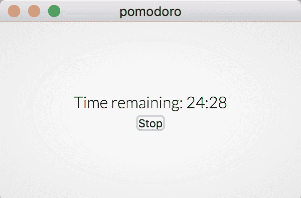
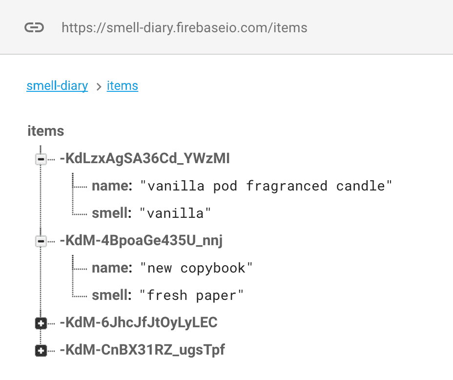
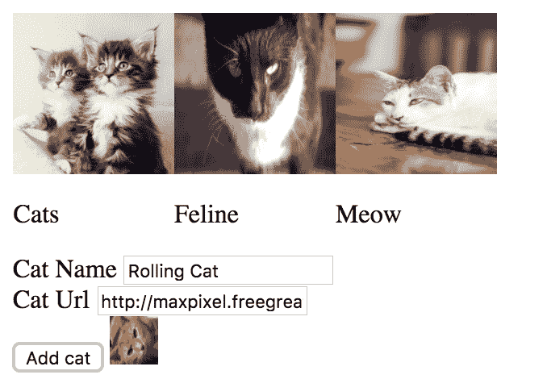
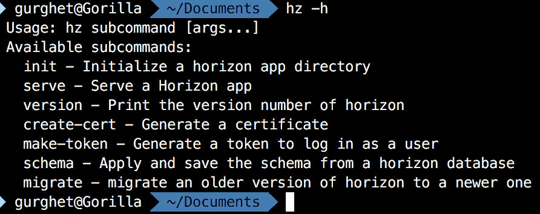
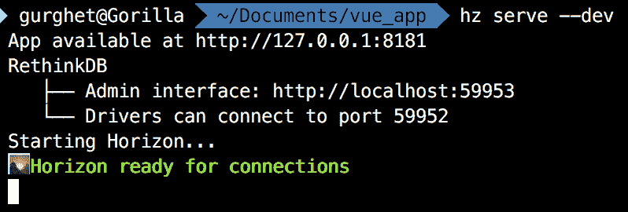
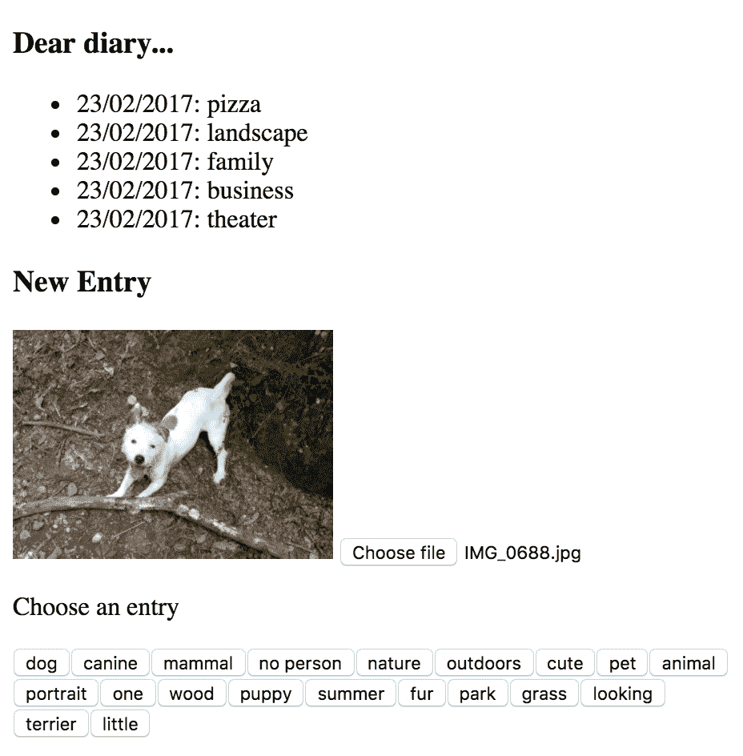

# 十九、与其他框架的集成

在本章中，我们将探讨以下主题：

*   利用电子技术构建通用应用
*   将 Vue 与 Firebase 一起使用
*   创建带有羽毛的实时应用
*   使用 Horizon 创建反应式应用

# 介绍

Vue 功能强大，但如果您需要后端，它无法单独完成很多工作；您至少需要一台服务器来部署软件。在本节中，您将实际使用流行的框架构建小型但完整且可用的应用。Electron 用于将 Vue 应用带到桌面。Firebase 是一个现代的云后端，最后，FeatherJS 是一个简约但功能齐全的 JavaScript 后端。完成这些操作后，您将拥有与它们交互并快速构建专业应用所需的所有工具。

# 利用电子技术构建通用应用

Electron 是一个用于创建在 Mac、Linux 和 Windows 上运行的通用应用的框架。它的核心是一个精简版的 web 浏览器。它已被用于创建广泛使用的应用，如 Slack 和 Visual Studio 代码等。在此配方中，您将使用 Electron 构建一个简单的应用。

# 准备

要构建此应用，我们将仅使用基本的 Vue 功能。电子不在本书的范围内，但对于本配方，不需要电子知识；事实上，这是进一步了解电子的一个很好的起点。

# 怎么做。。。

在这个配方中，我们将构建一个小型但完整的应用——pomodoro 应用。pomodoro 是一段大约 25 个单位的时间间隔，在这段时间里你应该集中精力做工作。之所以叫它是因为你通常用一个番茄形状的厨房计时器来测量它。此应用将跟踪时间，因此您不必购买昂贵的厨房计时器。

使用 Electron 启动 Vue 项目的最佳方法是使用 Electron Vue 样板文件（你没说！）。这可以通过以下命令轻松实现：

```js
vue init simulatedgreg/electron-vue pomodoro
```

您可以使用默认值进行回答，但当询问要安装哪个插件时，只需选择`vue-electron`。使用`npm intall`安装所有依赖项，如果您愿意，您可以在使用`npm run dev`进行必要修改时通过热重新加载保持应用打开。您只需点击角落中的*x*即可隐藏开发工具：


首先，我们希望我们的应用是小型的。让我们转到`app/src/main/index.js`文件；此文件控制应用的生命周期。将窗口大小更改为以下大小：

```js
mainWindow = new BrowserWindow({
  height: 200,
  width: 300
})
```

然后，我们真的不想把样板组件放在`app/src/render/components`文件夹中，所以你可以删除所有内容。相反，创建一个`Pomodoro.vue`文件并将此模板放入：

```js
<template>
  <div class="pomodoro">
    <p>Time remaining: {{formattedTime}}</p>
    <button v-if="remainingTime === 1500" @click="start">Start</button>
    <button v-else @click="stop">Stop</button>
  </div>
</template>
```

为了使其正常工作，我们还必须编写 JavaScript 部分，如下所示：

```js
<script>
export default {
  data () {
    return {
      remainingTime: 1500,
      timer: undefined
    }
  },
  methods: {
    start () {
      this.remainingTime -= 1
      this.timer = setInterval(() => {
        this.remainingTime -= 1
        if (this.remainingTime === 0) {
          clearInterval(this.timer)
        }
      }, 1000)
    },
    stop () {
      clearInterval(this.timer)
      this.remainingTime = 1500
    }
  }
}
</script>
```

这样，单击程序中的开始按钮将每秒减去 1 秒。单击停止按钮将清除计时器并将剩余时间重置为 1500 秒（25 分钟）。计时器对象基本上是`setInterval`操作的结果，`clearInterval`只是停止计时器正在执行的任何操作。

在我们的模板中，我们需要一个`formattedTime`方法，我们希望看到`mm:ss`格式的时间，这比剩下的秒数更容易让人读懂（即使这更古怪），因此我们需要添加计算函数：

```js
computed: {
  formattedTime () {
    const pad = num => ('0' + num).substr(-2)
    const minutes = Math.floor(this.remainingTime / 60)
    const seconds = this.remainingTime - minutes * 60
    return `${minutes}:${pad(seconds)}`
  }
}
```

要将此组件添加到应用，请转到`App.vue`文件并编辑以下行，替换`landingPage`占位符元素：

```js
<template>
  <div id="#app">
 <pomodoro></pomodoro>
  </div>
</template>

<script>
 import Pomodoro from 'components/Pomodoro'
  export default {
    components: {
 Pomodoro
    }
  }
</script>
```

通过`npm run dev`启动应用，您现在应该能够在工作或学习时跟踪时间：



您甚至可以使用`npm run build`命令构建应用的可分发版本。

# 它是如何工作的。。。

我们实现计时器的方式对于时间跟踪不是特别精确。让我们回顾一下代码：

```js
this.timer = setInterval(() => {
  this.remainingTime -= 1
  if (this.remainingTime === 0) {
    clearInterval(this.timer)
  }
}, 1000)
```

这意味着我们每秒钟减少剩余时间。问题在于`setInterval`函数本身并非 100%准确，可能在 1000 毫秒之前或之后触发函数，具体取决于机器的计算负载；这样，误差可以累积并变成相当大的数值。更好的方法是在每次调用函数时检查时钟，并在每个循环中调整错误，尽管这里不讨论这一点。

# 将 Vue 与 Firebase 一起使用

由于 VueFire——一个包含 Firebase 绑定的插件，将 Vue 与 Firebase 一起用作后端非常容易。在本食谱中，您将开发一个功能齐全的气味数据库。

# 准备

Firebase 不在本书的讨论范围内，但对于本食谱，我假设您已经熟悉基本概念。除此之外，您真的不需要知道太多，因为我们将在此基础上构建一个非常基本的 Vue 应用。

# 怎么做。。。

在开始编写代码之前，我们需要创建一个新的 Firebase 应用。为此，您必须在[登录 https://firebase.google.com/](https://firebase.google.com/) 并创建一个新的应用。在我们的例子中，它将被称为`smell-diary`。您还需要注意 API 密钥，该密钥位于项目设置中：


此外，您还需要禁用身份验证；转到“数据库”部分，在“规则”选项卡中，将“读取”和“写入”设置为 true：

```js
{
  "rules": {
    ".read": true,
    ".write": true
  }
}
```

我们完成了 Firebase 配置。

打开一个干净的 HTML5 样板文件或 JSFIDLE，将`Vue`作为库。我们需要在文件头中使用脚本标记表示以下依赖项：

```js
 <script src="https://unpkg.com/vue/dist/vue.js"></script>
 <script src="https://www.gstatic.com/firebasejs/3.6.9/firebase.js"></script>
 <script src="https://unpkg.com/vuefire/dist/vuefire.js"></script>
```

VueFire 将自动检测 Vue（因此顺序很重要），并将自身作为插件安装。我们将建立一个非常简单的数据库来跟踪我们周围事物的气味。以下是我们应用的 HTML 布局：

```js
<div id="app">
  <ul>
    <li v-for="item in items">
      {{item.name}}: {{item.smell}}
    <button @click="removeItem(item['.key'])">X</button>
    </li>
  </ul>
  <form @submit.prevent="addItem">
    <input v-model="newItem" />
    smells like
    <input v-model="newSmell" />
    <button>Add #{{items.length}}</button>
  </form>
</div>
```

在我们应用的 JavaScript 部分，我们需要指定 API 密钥以通过 Firebase 验证，请编写以下代码：

```js
const config = {
  databaseURL: 'https://smell-diary.firebaseio.com/'
}
```

然后，我们将配置提供给 Firebase 并获得数据库：

```js
const firebaseApp = firebase.initializeApp(config)
 const db = firebaseApp.database()
```

这可以在`Vue`实例之外完成。VueFire 插件在`Vue`实例中安装一个新选项，名为`firebase`；我们必须指定要使用`item`变量访问 Firebase 应用中的`/items`：

```js
new Vue({
  el: '#app',
  firebase: {
    items: db.ref('/items')
  }
})
```

`newItem`和`newSmell`变量将临时保存我们在输入框中输入的值；然后，`addItem`和`removeItem`方法将从我们的数据库中发布和删除数据：

```js
data: {
  newItem: '',
  newSmell: ''
},
methods: {
  addItem () {
    this.$firebaseRefs.items
      .push({
        name: this.newItem,
        smell: this.newSmell
      })
    this.newItem = ''
    this.newSmell = ''
  },
  removeItem (key) {
    this.$firebaseRefs.items
      .child(key).remove()
  }
}
```

如果您现在启动应用，您将可以添加您喜爱的气味以及嗅闻什么来查找它们：


# 它是如何工作的。。。

Firebase 用作一个简单的键值存储。在我们的例子中，我们从不存储价值，而是总是添加孩子；您可以查看在 Firebase 控制台中创建的内容：



这些键是自动创建的，它们包含空值和 32 层嵌套数据。我们使用一级嵌套来插入每个对象的名称和气味。

# 创建带有羽毛的实时应用

大多数现代应用都是实时的，不是传统意义上的，而是不需要重新加载页面就可以进行更新。实现这一点最常用的方法是通过 WebSocket。在本配方中，我们将利用 Feather 和 Socket.io 构建 cat 数据库

# 准备

此配方没有任何先决条件，但如果您想获得更多上下文，可以在启动此配方之前完成*创建 REST 客户端（和服务器！）*配方。

# 怎么做。。。

要完成这个配方，您需要 Feathers 的命令行；使用以下命令安装它：

```js
npm install -g feathers-cli
```

现在，运行`feathers generate`，它将为您创建所有样板文件。当被问及 API 时，选择 Socket.io：


所有其他问题都可以保留为默认值。仍在 Feather 控制台中时，键入`generate service`以创建新服务。您可以将其称为猫，并将其他问题保留为其默认值。

在`public`文件夹中，打开`index.html`并删除除 HTML5 样板之外的所有内容。您需要在头部设置三个依赖项：

```js
 <script src="//cdnjs.cloudflare.com/ajax/libs/vue/2.1.10/vue.js"></script>
 <script src="//cdnjs.cloudflare.com/ajax/libs/socket.io/1.7.3/socket.io.js"></script>
 <script src="//unpkg.com/feathers-client@^1.0.0/dist/feathers.js"></script>
```

在`body`标记中编写 HTML 布局，如下所示：

```js
<div id="app">
  <div v-for="cat in cats" style="display:inline-block">
    
    <p>{{cat.name}}</p>
  </div>
  <form @submit.prevent="addCat">
    <div>
      <label>Cat Name</label>
      <input v-model="newName" />
    </div>
    <div>
      <label>Cat Url</label>
      <input v-model="newUrl" />
    </div>
    <button>Add cat</button>
    
  </form>
</div>
```

第一个标签是猫的画廊。然后，构建一个表单，添加您收集的猫的新图像。

在`body`标记中，您始终可以使用以下行配置 Feathers 服务：

```js
<script>
  const socket = io('http://localhost:3030')
  const app = feathers()
    .configure(feathers.socketio(socket))
  const catService = app.service('cats')
```

这用于为将连接到 WebSocket 的浏览器配置客户端。`catService`方法是 cat 数据库的句柄。接下来，我们编写`Vue`实例：

```js
  new Vue({
    el: '#app',
    data: {
      cats: [],
      newName: '',
      newUrl: ''
    },
    methods: {
      addCat () {
        catService.create({
          name: this.newName,
          url: this.newUrl
        })
        this.newName = ''
        this.newUrl = ''
      }
    },
```

最后，我们需要在启动时请求数据库中的所有 CAT，同时安装一个侦听器，以防创建新的 CAT（甚至由其他用户创建）：

```js
    mounted () {
      catService.find()
        .then(page => {
          this.cats = page.data
        })
      catService.on('created', cat => {
        this.cats.push(cat)
      })
    }
 })
 </script>
```

如果您使用`npm start`运行应用，您可以导航到控制台中写入的 URL 以查看您的新应用。打开另一个浏览器窗口，查看它如何实时更改：



# 它是如何工作的。。。

看到实时添加的 CAT 显然是现代应用的一种方式。Feather 让您可以用一小部分代码快速创建它们，这要感谢底层的 Socket.io，它反过来使用 WebSocket。

WebSocket 其实并没有那么复杂，在本例中，Feather 所做的只是侦听通道中的消息，并将它们与向数据库添加内容等操作相关联。

当您只需交换数据库和 WebSocket 提供程序，或切换到 REST，甚至不需要触摸 Vue 代码，Feather 的强大功能就显而易见了。

# 使用 Horizon 创建反应式应用

Horizon 是一个构建反应式实时可伸缩应用的平台。它在内部使用 REJECTDB，并立即与 Vue 兼容。在这个配方中，您将构建一个自动的个人日记。

# 准备

这个配方只需要一点 Vue 基础知识，但实际上不需要太多其他。

但在开始之前，请确保安装了 RejectDB。你可以在他们的网站（[上找到更多信息 https://www.rethinkdb.com/docs/install/](https://www.rethinkdb.com/docs/install/) 。如果您有自制软件，可以使用`brew install rethinkdb`安装。

此外，您还需要一个 Clarifai 代币。要免费获得一个，请访问[https://developer.clarifai.com/](https://developer.clarifai.com/) 并注册。您将看到应该在应用中编写的代码，如下图所示：


特别是，您需要`clientId`和`clientSecret`，它们以这种方式显示：

```js
var app = new Clarifai.App(
  'your client id would be printed here',
  'your client secret would be here'
);
```

记下这段代码，或者准备好复制并粘贴到应用中。

# 怎么做。。。

写日记是一项艰巨的任务，你必须每天写很多东西。在这个食谱中，我们将建立一个自动日志，根据我们白天拍摄的照片为我们写作。

地平线将帮助我们记住一切，并在我们的设备之间同步日记。安装 RejectDB 后，使用以下命令安装 Horizon：

```js
npm install -g horizon
```

现在，您可以使用新命令`hz`。输入`hz -h`检查；您应该看到如下内容：



要创建将承载我们的新应用的目录，请键入以下内容：

```js
hz init vue_app
```

然后，进入新创建的`vue_app`目录，查看`dist`文件夹中的`index.html`。这是将作为服务器入口点的文件，请使用编辑器打开它。
您可以清除所有内容，只留下一个带有空的`<head>`和`<body>`的空 HTML5 样板文件。在 head 部分，我们需要声明对 Vue、Horizon 和 Clarifai 的依赖关系，如图所示：

```js
 <script src="https://unpkg.com/vue"></script>
 <script src="/horizon/horizon.js"></script>
 <script src="https://sdk.clarifai.com/js/clarifai-latest.js"></script>
```

请注意 Horizon 不是来自 CDN 而是来自本地依赖关系。

我们首先为我们的日志设置一个模板。我们有两部分。首先，我们将列出我们过去所做的事情。在 HTML 正文中编写以下内容：

```js
<div id="app">
  <div>
    <h3>Dear diary...</h3>
    <ul>
      <li v-for="entry in entries">
        {{ entry.datetime.toLocaleDateString() }}:
        {{ entry.text }}
      </li>
    </ul>
  </div>
...
```

在第二部分中，我们将输入新条目：

```js
  ...
  <h3>New Entry</h3>
  
  <input type="file" @change="selectFile" ref="file">
  <p v-if="tentativeEntries.length">Choose an entry</p>
  <button v-for="tentativeEntry in tentativeEntries" @click="send(tentativeEntry)">
    {{tentativeEntry}}
  </button>
</div>
```

在此之后，打开一个`<script>`标记，我们将在其中编写以下所有 JavaScript。

首先，我们需要登录到 Clarifai：

```js
var app = new Clarifai.App(
 '7CDIjv_VqEYfmFi_ygwKsKAaDe-LwEzc78CcW1sA',
 'XC0S9GHxS0iONFsAdiA2xOUuBsOhAT0jZWQTx4hl'
 )
```

显然，您想从 Clarifai 输入您的`clientId`和`clientSecret`。

然后，我们需要提升地平线，并掌握我们将创建的`entries`集合：

```js
const horizon = new Horizon()
const entries = horizon('entries')
```

现在，我们终于用三个状态变量编写了我们的`Vue`实例：

```js
new Vue({
  el: '#app',
  data: {
    tentativeEntries: [],
    data_uri: undefined,
    entries: []
  },
  ...
```

`tentativeEntries`数组将包含我们可以选择的日记的可能条目列表；`data_uri`将包含图像的（`base64`代码），作为我们今天所做工作的参考；`entries`都是过去的条目。

加载图像时，我们要求 Clarifai 提供可能的条目：

```js
...
methods: {
  selectFile(e) {
  const file = e.target.files[0]
  const reader = new FileReader()
  if (file) {
    reader.addEventListener('load', () => {
      const data_uri = reader.result
      this.data_uri = data_uri
      const base64 = data_uri.split(',')[1]
      app.models.predict(Clarifai.GENERAL_MODEL, base64)
        .then(response => {
          this.tentativeEntries =
            response.outputs[0].data.concepts
            .map(c => c.name)
        })
      })
    reader.readAsDataURL(file)
  }
},
...
```

然后，当我们按下 send 按钮时，我们告诉 Horizon 条目集合存储这个新条目：

```js
    ...
    send(concept) {
      entries.store({
        text: concept,
         datetime: new Date()
      }).subscribe(
        result => console.log(result),
        error => console.log(error)
      )
      this.tentativeEntries = []
      this.$refs.file.value = ''
      this.data_uri = undefined
    }
  }
})
```

最后，我们希望确保页面加载时屏幕上有最后十个条目，并且每次添加新条目时，它都会实时弹出。在方法之后，在 Vue 实例中添加以下钩子：

```js
created() {
  entries.order('datetime', 'descending').limit(10).watch()
    .subscribe(allEntries => {
      this.entries = [...allEntries].reverse()
  })
}
```

要运行 Horizon 服务器，请使用以下命令：

```js
hz serve --dev
```

上述代码的输出如下所示：



转到指定的地址（第一行，而不是管理界面），您将看到以下内容：



您会注意到，如果打开了其他浏览器窗口，它们将实时更新。现在你终于可以不用打字每天写日记了！

# 它是如何工作的。。。

我们的应用使用一种称为 reactive 的模式。在创建的手柄中可以清楚地看到其核心：

```js
entries.order('datetime', 'descending').limit(10).watch()
  .subscribe(allEntries => {
    this.entries = [...allEntries].reverse()
  })
```

第一行返回被称为反应中的可观测值。一个可观察的物体可以被认为是事件的来源。每次触发事件时，该源的订阅服务器都将处理该事件。我们将整个集合中的条目和修改抛出到集合中。每次我们收到这种类型的事件时，我们都会更新`entries`数组。

这里我不会对反应式编程进行深入解释，但我想强调的是，这种模式对于可伸缩性非常有帮助，因为您可以轻松地实现对数据流的控制；`limit(10)`就是一个例子。