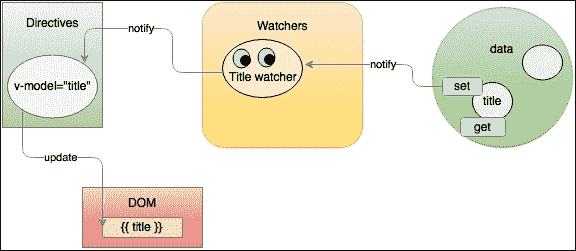
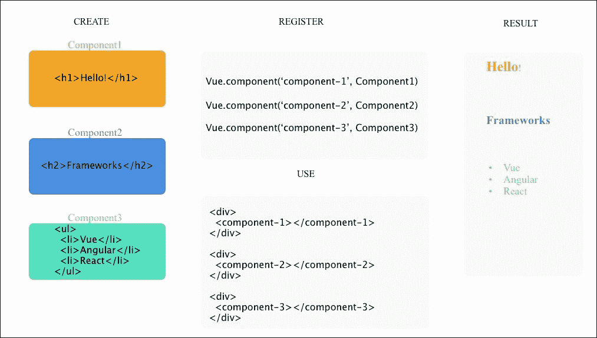
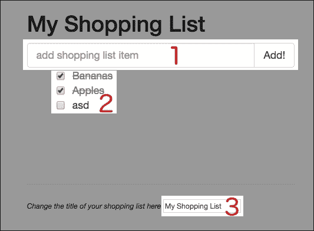
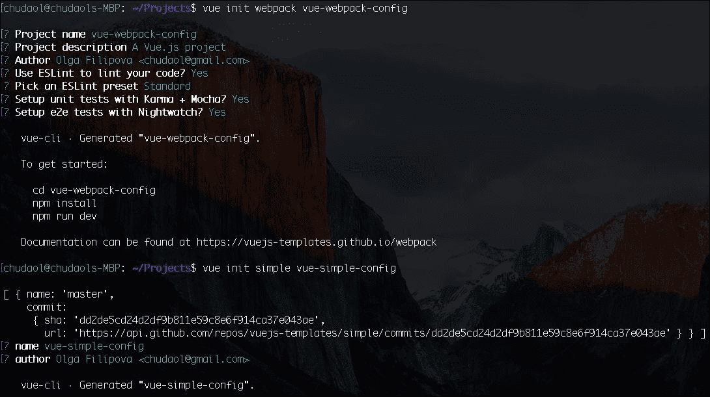
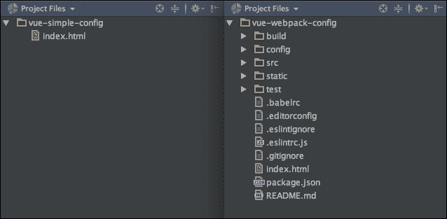
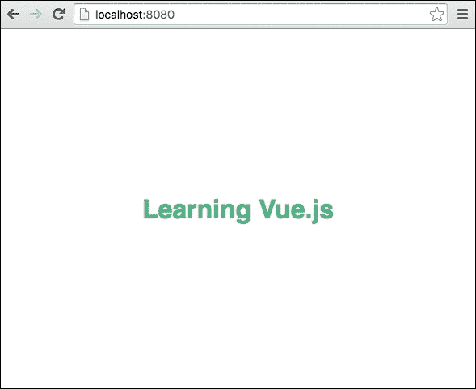
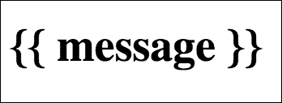
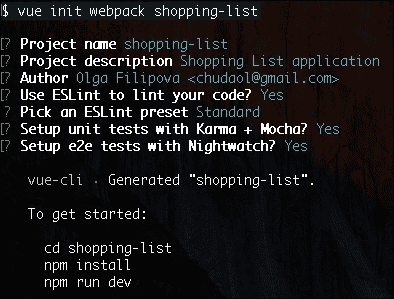

# 二、基础——安装和使用

在上一章中，我们对 Vue.js 有了一些了解。我们能够在从头创建的两个不同应用中使用它。我们学习了如何将 Vue.js 集成到现有的项目中。我们能够看到 Vue 的反应式数据绑定正在运行。

现在，你可能在问自己：它是如何工作的？当数据模型发生变化时，如何实现这种快速 UI 变化行为？您可能决定在项目中使用 Vue.js，现在想知道它是否遵循某种体系结构模式或范例，以便在项目中采用它。在本章中，我们将探讨 Vue.js 框架的关键概念，以了解其所有幕后功能。在本章中，我们还将分析安装 Vue.js 的所有可能方法。我们还将为我们的应用创建一个框架，我们将在接下来的章节中对其进行开发和增强。我们还将学习调试和测试应用的方法。

因此，在本章中，我们将学习：

*   MVVM 架构范例是什么以及它如何应用于 Vue.js
*   什么是声明性视图
*   Vue.js 如何探索已定义的属性、getter 和 setter
*   Vue.js 中反应性和数据绑定的工作原理
*   什么是脏检查、DOM 和虚拟 DOM
*   Vue.js 1.0 和 Vue.js 2.0 之间的主要区别
*   什么是可重用组件
*   插件、指令、自定义插件和自定义指令在 Vue.js 中的工作方式
*   如何安装、启动、运行和调试 Vue 应用

# MVVM 架构模式

您还记得我们在第一章中是如何创建`Vue`实例的吗？我们正在实例化它，调用`new Vue({...})`。您还记得，在选项中，我们在页面上传递了这个`Vue`实例应该绑定的元素和包含我们想要绑定到视图的属性的`data`对象。`data`对象是我们的模型，`Vue`实例绑定的 DOM 元素是我们的视图：


Vue 实例相互绑定的经典视图模型表示法

同时，我们的`Vue`实例有助于将模型绑定到视图，反之亦然。因此，我们的应用遵循**模型-视图-视图-模型**（**MVVM**模式，`Vue`实例是一个视图模型：


模型视图 ViewModel 模式的简化图

我们的**模型**包含数据和一些业务逻辑，我们的**视图**负责其表示。**视图模型**处理数据绑定，确保**模型**中更改的数据立即影响**视图**层，反之亦然。

因此，我们的观点完全由数据驱动。**ViewModel**负责控制数据流，使数据绑定对我们来说是完全声明性的。

# 定义属性、getter 和 setter

那么，一旦传递到`Vue`实例，数据会发生什么变化？`Vue`应用于它的这些转换是什么，使它自动绑定到视图层？

让我们分析一下，如果我们有一个字符串，并且每次它发生变化时，我们都希望对某个 DOM 元素应用一些转换，我们会怎么做。我们如何应用字符串更改侦听器函数？我们会把它附在什么上面？没有`var stringVar='hello';stringVar.onChange(doSomething)`这样的东西。

因此，我们可能会包装字符串的值设置，并使用某种函数来执行某些操作，例如，每次更新字符串时更新 DOM。您将如何实施它？在你考虑的时候，我会准备一些有趣的东西的快速演示。

打开购物清单应用上的开发人员工具。让我们编写一点代码。创建一个`obj`变量和另一个`text`变量：

```js
var obj = {}; 
var text = ''; 

```

让我们将 DOM 元素`h2`存储在一个变量中：

```js
var h2 = document.getElementsByTagName('h2')[0]; 

```

如果我们将`text`分配给`obj.text`属性，我们如何实现在该属性的每次更改中`h2`的`innerHTML`也会更改？

让我们使用`Object.defineProperty`方法（[https://developer.mozilla.org/en/docs/Web/JavaScript/Reference/Global_Objects/Object/defineProperty](https://developer.mozilla.org/en/docs/Web/JavaScript/Reference/Global_Objects/Object/defineProperty) 。

此方法允许创建 getter 和 setter 函数，从而指定访问或更改属性时必须执行的操作：

```js
Object.defineProperty(obj, 'text', { 
  get: function () { 
    return text; 
  }, 
  set: function (newVal) { 
    text = newVal;  
    h2.innerHTML = text; 
  } 
}); 

```

现在尝试从控制台更改`obj.text`属性。请看标题：


每次属性更改时都会调用 object.defineProperty 的 set 方法

Vue.js 使用了这个确切的机制。一旦数据被传递到`Vue`实例，它的所有属性都将通过`Object.defineProperty`方法，该方法为它们分配反应式 getter 和 setter。对于页面上存在的每个指令，将添加一个观察者，该观察者将在`set`方法中得到通知。在控制台中打开`vue.js`代码，搜索显示`set: function reactiveSetter(newVal)`的行。添加断点并尝试在输入中更改购物列表的标题。现在，请跳过此步骤，直到到达此函数中的最后一个调用，该调用显示`dep.notify()`：


setter 函数中调用 watchers notify 方法的断点

进入函数。您将看到此函数正在遍历属性的观察者并更新它们。如果您跳过这个调用，您将看到 DOM 没有被更新。这是因为在同一事件循环上执行的更新被放入定期刷新的队列中。

找到`runBatcherQueue`函数并在其中放置断点。再次尝试更改标题。如您所见，此函数遍历队列中等待的所有观察者，并对每个观察者调用`run`方法。如果使用此方法，您将看到它将新值与前一个值进行比较：

```js
if (value !== this.value ||... 

```

然后调用回调的执行：

```js
this.cb.call(this.vm, value, oldValue); 

```

如果您进入这个回调函数，您将看到它最终会更新 DOM 值：

```js
    update: function update(value) { 
      this.el[this.attr] = _toString(value); 
    } 

```

这不是很简单吗？

### 注

在此调试中，将使用 Vue 1.0 版。

因此，Vue.js 反应式数据绑定背后的机制非常简单。正在为所有指令和数据属性分配**观察者**。然后，在`Object.defineProperty`的`set`方法中，通知**观察者**，然后他们更新相应的**DOM**或**数据**：



从数据对象到 DOM 的数据流

具有指令的**DOM**元素具有附加的侦听器，侦听它们的更新并调用相应的**数据**属性设置器，该属性设置器反过来唤醒其**观察者**。

# 与其他框架相比

当您尝试一个新工具时，您想知道它与其他工具或框架的比较。您可以在 Vue.js 的官方页面[上找到这方面的深入分析 http://vuejs.org/guide/comparison.html](http://vuejs.org/guide/comparison.html) 。我将只指出一些我认为重要的关于常用框架的主题。

## 反应

React 和 Vue 非常相似。它们都使用虚拟 DOM，具有可重用的组件，并且都是关于反应式数据的。然而，值得一提的是，Vue 仅从第二个主要版本开始使用虚拟 DOM。在 VUE2.0 之前，它使用真实的 DOM。Vue 2.0 版本不仅比 Vue 1.0 更具性能，而且比 React 更具性能（[http://vuejs.org/guide/comparison.html#Performance-简介](http://vuejs.org/guide/comparison.html#Performance-Profiles)。

最显著的区别可能是在两个框架中创建组件的方式。您可能已经知道，在 React 中，一切都是 JavaScript。用 JavaScript 开发任何东西，甚至模板，实际上都是很好的，因此程序员总是在相同的范围内，呈现变得更加灵活。

然而，对于一些想要进行快速原型设计的设计师，或者编程能力不强的开发人员，或者对于那些根本不想学习 JSX 的人来说，像这样工作可能会变得非常痛苦。在 Vue 组件中，您实际上也可以使用 JSX，但您仍然可以遵循一种常见的 web 开发结构：在`<style>`标记中编写 CSS，在`<template>`标记中编写 HTML 代码，在`<script>`标记中使用 JavaScript 编写组件逻辑。例如，比较 React 中渲染函数内的模板和可以在 Vue 组件内编写的模板。在本例中，我将展示如何呈现我们之前看到的购物列表中的项目列表。因此，在 React 中，您将得到与此类似的 JSX 代码：

```js
render () { 
  return ( 
    <ul> 
    {items.map(item => 
    <li className={item.checked && 'removed'}> 
      <div className='checkbox'> 
        <input type='checkbox' checked={item.checked}>          
        { item.text } 
      </div> 
    </li> 
    )} 
    </ul> 
  ) 
}); 

```

使用 Vue，您只需在`template`标记内编写以下 HTML 代码：

```js
<template> 
<ul> 
  <li v-for="item in items" :class="{ 'removed': item.checked }"> 
    <div class="checkbox"> 
    <label> 
    <input type="checkbox" v-model="item.checked"> {{ item.text }} 
  </label> 
  </div> 
  </li> 
</ul> 
</template>
```

一、 就个人而言，我喜欢将这些东西分开，因此我觉得 Vue 提供这种可能性很好。

Vue 的另一个优点是，它允许使用附在`style`标记上的`scoped`属性在组件中定义样式：

```js
<style scoped> 
</style> 

```

在该样式中，如果使用预处理器，您仍然可以访问所有全局定义的变量，并且可以创建或重新定义仅可由该组件访问的样式。

这两个框架的学习曲线也值得一提。要开始使用 React 开发应用，您可能必须学习 JSX 和 ES2105 语法，因为官方 React 文档中的大多数示例都使用它。有了 Vue，您可以从头开始。只需像使用 jQuery 一样将其包含在页面中，就可以使用非常简单易懂的语法和任何您喜欢使用的 JavaScript 版本来使用 Vue 模型和数据绑定。之后，您可以在学习和应用风格方面进行扩展。

如果您想对这两个框架进行更深入的分析，请查看文档，尝试详细说明类似的示例，并检查哪些更适合您的需要。

## 角度

角度 1 和角度 2 之间存在巨大差异。我们都知道 Angular 的第二个版本与前一个版本完全不同。它提供了更高的性能，API 有所不同，底层实现已经重写。

这两个版本如此不同，以至于在 Vue 官方文档中，您将看到两个版本之间的比较，就像两个不同框架之间的比较一样。然而，学习曲线和每个框架迫使您构建应用的方式对于两个角度版本都是横向的。事实证明，Vue 比 Angular 1 和 Angular 2 更不固执己见。只需在[上比较 Angular 的快速入门指南和 Vue 的 hello world 应用 https://angular.io/docs/js/latest/quickstart.html](https://angular.io/docs/js/latest/quickstart.html) 和[http://vuejs.org/guide/index.html#Hello-世界](http://vuejs.org/guide/index.html#Hello-World)。

|   | *“即使没有 TypeScript，Angular 的《快速入门指南》也从一个应用开始，该应用使用 ES2015 JavaScript、NPM（具有 18 个依赖项、4 个文件和 3000 多个单词）来解释这一切——只是向世界问好。”* |   |
|   | --*http://vuejs.org/guide/comparison.html#Learning-曲线* |

如果您仍然使用 Angular 1，那么值得一提的是，此框架与 Vue 之间的最大区别在于，在此版本的 Angular 中，每次范围更改时，都会重新评估所有观察者，从而执行脏检查，从而在观察者数量相当高时降低性能。因此，在 Vue 中，当作用域中的某些内容发生更改时，只有此属性的观察程序被重新评估。所有其他人都闲坐着等待各自的电话。

## Vue

不，这不是打字错误。还值得将 Vue 与 Vue 进行比较。Vue 最近还推出了第二个版本，它比前一个版本更快、更干净。如果仍然使用 Vue 1.0，则值得升级。如果您对 Vue 版本一无所知，那么有必要检查一下它是如何演变的，以及新版本允许做些什么。查看 2016 年 4 月发布 Vue 2.0 的 Vue 博客帖子[https://vuejs.org/2016/04/27/announcing-2.0/](https://vuejs.org/2016/04/27/announcing-2.0/) 。

# Vue.js 基础

在着手编写代码并开始使用组件、插件、混音器、模板和其他东西增强应用之前，让我们先概述一下 Vue 的主要功能。让我们分析什么是可重用组件，以及如何管理应用状态，并讨论插件、过滤器和混合。在本节中，我们将对这些功能进行简要概述。我们将在接下来的章节中深入学习它们。

## 可重复使用的组件

现在，您不仅知道 Vue.js 中的数据绑定是什么以及如何使用它，还知道它是如何工作的，现在是时候介绍另一个强大的 Vue.js 功能了。使用 Vue.js 创建的组件可以在应用中作为构建房屋的砖块使用和重用。每个组件都有自己的样式和绑定范围，与其他组件完全隔离。

组件创建语法与我们已经知道的`Vue`实例创建非常相似，您应该只使用`Vue.extend`而不是`Vue`：

```js
var CustomComponent = Vue.extend({...}) 

```



Vue.js 中的自定义组件

例如，让我们尝试将购物清单代码划分为组件。正如您所记得的，我们的购物清单基本上由三部分组成：一部分包含购物清单项目，另一部分包含用于添加新项目的输入，以及允许更改购物清单标题的第三部分：



购物清单应用的三个基本部分

让我们更改应用的代码，使其使用三个组件，每个组件一个。

我们的代码如下所示：

```js
var data = { 
  items: [{ text: 'Bananas', checked: true },    
          { text: 'Apples', checked: false }], 
  title: 'My Shopping List', 
  newItem: '' 
}; 

new Vue({ 
  el: '#app', 
  data: data, 
  methods: { 
    addItem: function () { 
      var text; 

      text = this.newItem.trim(); 
      if (text) { 
        this.items.push({ 
          text: text, 
          checked: false 
        }); 
        this.newItem = ''; 
      } 
    } 
  } 
}); 

```

现在我们将创建三个组件：`ItemsComponent`、`ChangeTitleComponent`和`AddItemComponent`。他们所有人都将与`data`对象具有`data`属性。`addItem`方法将从主`Vue`实例跳转到`ChangeTitleComponent`。所有必要的 HTML 将从我们的`index.html`文件传输到每个组件。最后，我们的主要脚本如下所示：

```js
var data = { 
  items: [{ text: 'Bananas', checked: true },
          { text: 'Apples', checked: false }], 
  title: 'My Shopping List', 
  newItem: '' 
}; 

/** 
 * Declaring components 
 */ 
var ItemsComponent = Vue.extend({ 
  data: function () { 
    return data; 
  }, 
  template: '<ul>' + 
  '           <li v-for="item in items"
              :class="{ 'removed': item.checked }">' + 
  '             <div class="checkbox">' + 
  '               <label>' + 
  '                 <input type="checkbox"                       
                    v-model="item.checked"> {{ item.text }}' + 
  '               </label>' + 
  '             </div>' + 
  '           </li>' + 
  '         </ul>' 
}); 
var ChangeTitleComponent = Vue.extend({ 
  data: function () { 
    return data; 
  }, 
  template: '<input v-model="title"/>' 
}); 
var AddItemComponent = Vue.extend({ 
  data: function () { 
    return data; 
  }, 
  methods: { 
    addItem: function () { 
      var text; 

      text = this.newItem.trim(); 
      if (text) { 
        this.items.push({ 
          text: text, 
          checked: false 
        }); 
        this.newItem = ""; 
      } 
    } 
  }, 
  template: 
  '<div class="input-group">' + 
    '<input v-model="newItem" @keyup.enter="addItem"        
     placeholder="add shopping list item" type="text"       
     class="form-control">'  + 
    '<span class="input-group-btn">'  + 
    '  <button @click="addItem" class="btn btn-default"           
       type="button">Add!</button>'  + 
    '</span>'  + 
  '</div>' 
}); 

/** 
 * Registering components 
 */ 
Vue.component('items-component', ItemsComponent); 
Vue.component('change-title-component', ChangeTitleComponent); 
Vue.component('add-item-component', AddItemComponent); 
/** 
 * Instantiating a Vue instance 
 */ 
new Vue({ 
  el: '#app', 
  data: data 
}); 

```

如何在视图中使用这些组件？我们应该用注册组件的标记替换相应的标记。我们的标记如下所示：


包含已定义组件的购物列表应用标记

因此，我们将用`<add-item-component></add-item-component>`标记替换第一个突出显示的区域，用`<items-component></items-component>`标记替换第二个区域，用`<change-title-component></change-title-component>`标记替换第三个区域。因此，我们以前巨大的加价现在看起来如下所示：

```js
<div id="app" class="container"> 
  <h2>{{ title }}</h2> 
  <add-item-component></add-item-component> 
  <items-component></items-component> 
  <div class="footer"> 
    <hr/> 
    <em>Change the title of your shopping list here</em> 
    <change-title-component></change-title-component> 
  </div> 
</div> 

```

在下一章中，我们将深入讨论组件，并将学习构建组件的更好方法。敬请期待！

## Vue.js 指令

在上一章中，您已经了解了什么是指令，以及如何使用它们来增强应用的行为。

您已经使用了一些指令，它们允许以不同的方式将数据绑定到视图层（`v-model`、`v-if`、`v-show`等等）。除了这些默认指令之外，Vue.js 还允许您创建自定义指令。自定义指令提供了一种机制来启用 DOM 到数据映射的自定义行为。

注册自定义指令时，可以提供三个功能：`bind`、`update`和`unbind`。在`bind`函数中，您可以将事件侦听器附加到元素，并在那里执行任何需要执行的操作。在接收新旧值作为参数的`update`函数中，您可以定义数据更改时应该发生什么的自定义行为。`unbind`方法提供了所需的所有清理操作（例如，分离事件侦听器）。

### 提示

在 Vue 2.0 中，指令大大减少了职责范围，现在它们仅用于应用低级直接 DOM 操作。Vue 的变更指南建议使用组件而不是自定义指令（[https://github.com/vuejs/vue/issues/2873](https://github.com/vuejs/vue/issues/2873) ）。

因此，定制指令的完整版本如下所示：

```js
Vue.directive('my-directive', { 
  bind: function () { 
    // do the preparation work on element binding 
  }, 
  update: function (newValue, oldValue) { 
    // do something based on the updated value 
  }, 
  unbind: function () { 
    // do the clean-up work 
  } 
}) 

```

简化版，如果您只需要在值更新上做一些事情，则只能有`update`方法，该方法可以作为指令函数的第二个参数直接传递：

```js
Vue.directive('my-directive', function (el, binding) { 
  // do something with binding.value 
}) 

```

这个理论很好，但如果没有一个小例子，它就会变得很无聊。让我们看一个非常简单的例子，它将在每次更新数值时显示数值的平方。

我们的自定义指令如下所示：

```js
Vue.directive('square', function (el, binding) { 
  el.innerHTML = Math.pow(binding.value, 2); 
}); 

```

使用`v-`前缀在模板文件中使用此指令：

```js
<div v-square="item"></div> 

```

在`Vue`实例的数据中实例化`item`实例，并尝试更改`item`的值。您将看到，`div`元素内的值将立即显示更改值的平方数。此自定义指令的完整代码可以在 JSFIDLE 中的[中找到 https://jsfiddle.net/chudaol/we07oxbd/](https://jsfiddle.net/chudaol/we07oxbd/) 。

## Vue.js 中的插件

正如我们已经分析过的那样，Vue 的核心功能提供声明性数据绑定和组件组合。这个核心行为通过提供丰富功能集的插件得到了增强。有几种类型的插件：

*   添加一些全局属性或方法的插件（`vue-element`
*   添加一些全球资产的插件（`vue-touch`
*   添加`Vue`实例方法并将其连接到 Vue 原型的插件
*   提供一些外部功能或 API 的插件（`vue-router`

插件必须提供一个能够访问全局`Vue`对象的`install`方法，该对象可以对其进行增强和修改。为了使用该插件，Vue 提供了接收插件实例的`use`方法（`Vue.use(SomePlugin)`。

### 提示

您还可以编写自己的 Vue 插件，为您的`Vue`实例启用自定义行为。

让我们使用前面的自定义指令示例，创建一个实现数学平方和平方根指令的极简插件。创建一个名为`VueMathPlugin.js`的文件，并添加以下代码：

```js
export default { 
  install: function (Vue) { 
    Vue.directive('square', function (el, binding) { 
      el.innerHTML = Math.pow(binding.value, 2); 
    }); 
    Vue.directive('sqrt', function (el, binding) { 
      el.innerHTML = Math.sqrt(binding.value); 
    }); 
  } 
}; 

```

现在创建一个名为`script.js`的文件。让我们将主脚本添加到此文件。在这个脚本中，我们将同时导入`Vue`和`VueMathPlugin`，并调用 Vue 的`use`方法，以便告诉它使用插件并调用插件的`install`方法。然后我们将像往常一样启动一个`Vue`实例：

```js
import Vue from 'vue/dist/vue.js'; 
import VueMathPlugin from './VueMathPlugin.js'; 

Vue.use(VueMathPlugin); 

new Vue({ 
  el: '#app', 
  data: { item: 49 } 
}); 

```

现在创建一个包含`main.js`文件的`index.html`文件（我们将使用 Browserify 和 Babelify 构建它）。在这个文件中，让我们使用`v-model`指令添加一个输入，该指令将用于更改项的值。同时使用`v-square`和`v-sqrt`指令创建两个跨度：

```js
<body> 
  <div id="app"> 
    <input v-model="item"/> 
    <hr> 
    <div>Square: <span v-square="item"></span></div> 
    <div>Root: <span v-sqrt="item"></span></div> 
  </div> 
  <script src="main.js"></script> 
</body> 

```

创建一个`package.json`文件以包含构建项目所需的依赖项，并添加一个用于构建`main.js`文件的脚本：

```js
{ 
  "name": "vue-custom-plugin", 
  "scripts": { 
    "build": "browserify script.js -o main.js -t
       [ babelify --presets [ es2015 ] ]" 
  }, 
  "version": "0.0.1", 
  "devDependencies": { 
    "babel-preset-es2015": "^6.9.0", 
    "babelify": "^7.3.0", 
    "browserify": "^13.0.1", 
    "vue": "^2.0.3" 
  } 
} 

```

现在，从以下命令行安装依赖项并构建项目：

```js
npm install
npm run build

```

在浏览器中打开`index.html`。尝试更改输入框中的数字。平方和平方根值都会立即更改：


数据中的更改将立即应用于作为自定义插件一部分创建的指令

## 运动

使用三角函数（正弦、余弦和切线）增强`MathPlugin`。

在*附件*中可以找到这项工作的可能解决方案。

## 应用状态和 Vuex

当应用达到相当大的规模时，我们可能需要以某种方式管理全局应用状态。灵感来源于 Flux（[https://facebook.github.io/flux/](https://facebook.github.io/flux/) ），有一个 Vuex 模块，允许我们在 Vue 组件之间管理和共享全局应用状态。

### 提示

不要认为应用状态是复杂和难以理解的。事实上，这不仅仅是数据。每个组件都有自己的数据，“应用状态”是可以在所有组件之间轻松共享的数据！


Vuex 应用商店如何管理应用状态更新

与其他插件一样，为了能够使用和实例化 Vuex 存储，您需要指示 Vue 使用它：

```js
import Vuex from 'vuex'; 
import Vue from 'vue'; 

Vue.use(Vuex); 

var store = new Vuex.Store({ 
  state: { <...> }, 
  mutations: { <...> } 
}); 

```

然后，在初始化主组件时，将存储实例分配给它：

```js
new Vue({ 
  components: components, 
  store: store 
}); 

```

现在，主应用及其所有组件都知道存储，可以访问存储中的数据，并且能够在应用生命周期的任何时候触发对存储的操作。在接下来的章节中，我们将深入研究应用状态。

## vue cli

是的，Vue 有自己的命令行界面。它允许我们使用所需的任何配置初始化 Vue 应用。您可以使用 Webpack 样板文件、Browserify 样板文件或仅使用一个简单的样板文件对其进行初始化，该样板文件仅创建一个 HTML 文件，并为开始使用 Vue.js 做好准备。

用`npm`安装：

```js
npm install -g vue-cli

```

初始化应用的不同方式如下所示：

```js
vue init webpack
vue init webpack-simple
vue init browserify
vue init browserify-simple
vue init simple

```

要查看差异，让我们使用简单模板和 Webpack 模板运行`vue init`，并查看生成的结构中的差异。以下是两个命令的输出不同之处：



命令 vue init webpack 和 vue init simple 的输出

以下是应用结构的不同之处：



vue init simple 和 vue init webpack 构建的应用在结构上的差异

简单配置中的`index.html`文件已经包含来自 CDN 的 Vue.js，因此如果您只需要做一些非常简单的事情，例如快速原型制作，请使用此文件。

但是，如果您即将启动一个复杂的**单页应用**（**SPA**）项目，该项目需要在开发过程中进行测试和热重新加载，请使用 Webpack 或 Browserify 配置。

## IDE 的 Vue 插件

有一些主要 IDE 的 Vue 语法突出显示插件。我将为您留下最有趣的链接：

<colgroup><col> <col></colgroup> 
| **IDE** | **指向 Vue 插件的链接** |
| 崇高的 | [https://github.com/vuejs/vue-syntax-highlight](https://github.com/vuejs/vue-syntax-highlight) |
| 网络风暴 | [https://github.com/postalservice14/vuejs-plugin](https://github.com/postalservice14/vuejs-plugin) |
| 原子 | [https://github.com/hedefalk/atom-vue](https://github.com/hedefalk/atom-vue) |
| Visual Studio 代码 | [https://github.com/LiuJi-Jim/vscode-vue](https://github.com/LiuJi-Jim/vscode-vue) |
| 维姆 | [https://github.com/posva/vim-vue](https://github.com/posva/vim-vue) |
| 括号 | [https://github.com/pandao/brackets-vue](https://github.com/pandao/brackets-vue) |

# 安装、使用和调试 Vue.js 应用

在本节中，我们将分析安装 Vue.js 的所有可能方法。我们还将为我们的应用创建一个框架，我们将在接下来的章节中开发和增强该框架。我们还将学习调试和测试应用的方法。

## 安装 Vue.js

安装 Vue.js 有多种方法。从 classic 开始，使用 bower、npm 或 Vue 的命令行界面（`vue-cli`等工具，将下载的脚本包含在`<script>`标记中的 HTML 中，以引导整个应用。

让我们看看所有这些方法，然后选择我们最喜欢的方法。在所有这些例子中，我们只会在页面上显示一个标题，上面写着**`Learning Vue.js`**。

### 独立

下载`vue.js`文件。有两个版本，缩小版和开发版。开发版本位于[https://vuejs.org/js/vue.js](https://vuejs.org/js/vue.js) 。缩小版位于[https://vuejs.org/js/vue.min.js](https://vuejs.org/js/vue.min.js) 。

### 提示

如果您正在开发，请确保使用 Vue 的非小型开发版本。你会喜欢控制台上的提示和警告。

然后只需将`vue.js`包含在`<script>`标签中，如下所示：

```js
<script src="vue.js"></script> 

```

Vue 已在全局变量中注册。你已经准备好使用它了。

我们的示例将如下所示：

```js
  <div id="app"> 
    <h1>{{ message }}</h1> 
  </div> 
  <script src="vue.js"></script> 
  <script> 
     var data = { 
       message: 'Learning Vue.js' 
     }; 

     new Vue({ 
       el: '#app', 
       data: data 
     }); 
  </script> 

```

### CDN

Vue.js 在以下 CDN 中提供：

*   **JSDeliver**：[https://cdn.jsdelivr.net/vue/2.0.3/vue.js](https://cdn.jsdelivr.net/vue/2.0.3/vue.js)
*   **cdnjs**：[https://cdnjs.cloudflare.com/ajax/libs/vue/2.0.3/vue.js](https://cdnjs.cloudflare.com/ajax/libs/vue/2.0.3/vue.js)
*   **unpkg**：[https://unpkg.com/vue@2.0.3/dist/vue.js](https://unpkg.com/vue@2.0.3/dist/vue.js)（推荐）

只需将 URL 放在`script`标记的源代码中，就可以使用 Vue 了！

```js
<script src="  https://cdnjs.cloudflare.com/ajax/libs/vue/2.0.3/vue.js"></script> 

```

### 提示

请注意，CDN 版本可能无法与最新可用版本的 Vue 同步。

因此，该示例看起来与独立版本完全相同，但我们使用的不是`<script>`标记中的下载文件，而是 CDN URL。

### 凉亭

如果您已经在使用 Bower 管理应用，并且不想使用其他工具，那么还有一个 Vue 的 Bower 发行版。只需拨打`bower install`：

```js
# latest stable release
bower install vue

```

我们的示例看起来与前面两个示例完全相同，但它将包括来自`bower`文件夹的文件：

```js
<script src="bower_components/vue/dist/vue.js"></script> 

```

### 符合 CSP 要求

**内容安全策略**（**CSP**）是一种安全标准，它提供了一组应用必须遵守的规则，以防止安全攻击。如果您正在为浏览器开发应用，您可能熟悉此策略！

对于需要 CSP 兼容脚本的环境，[中有一个特殊版本的 Vue.jshttps://github.com/vuejs/vue/tree/csp/dist](https://github.com/vuejs/vue/tree/csp/dist) 。

让我们以 Chrome 应用为例，看看符合 CSP 的 Vue.js 的运行情况！

首先为我们的应用示例创建一个文件夹。Chrome 应用中最重要的是`manifest.json`文件，它描述了您的应用。让我们创建它。它应该如下所示：

```js
{ 
  "manifest_version": 2, 
  "name": "Learning Vue.js", 
  "version": "1.0", 
  "minimum_chrome_version": "23", 
  "icons": { 
    "16": "icon_16.png", 
    "128": "icon_128.png" 
  }, 
  "app": { 
    "background": { 
      "scripts": ["main.js"] 
    } 
  } 
} 

```

下一步是创建我们的`main.js`文件，它将成为 Chrome 应用的入口点。脚本应该侦听应用的启动，并打开一个具有给定大小的新窗口。让我们创建一个 500 x 300 大小的窗口，并用`index.html`打开它：

```js
chrome.app.runtime.onLaunched.addListener(function() { 
  // Center the window on the screen. 
  var screenWidth = screen.availWidth; 
  var screenHeight = screen.availHeight; 
  var width = 500; 
  var height = 300; 

  chrome.app.window.create("index.html", { 
    id: "learningVueID", 
    outerBounds: { 
      width: width, 
      height: height, 
      left: Math.round((screenWidth-width)/2), 
      top: Math.round((screenHeight-height)/2) 
    } 
  }); 
}); 

```

至此，特定于 Chrome 的应用魔术结束了，现在我们将创建我们的`index.html`文件，它将完成与前面示例中相同的事情。它将包括`vue.js`文件和我们的脚本，我们将在其中初始化 Vue 应用：

```js
<html lang="en"> 
<head> 
    <meta charset="UTF-8"> 
    <title>Vue.js - CSP-compliant</title> 
</head> 
<body> 
<div id="app"> 
    <h1>{{ message }}</h1> 
</div> 
<script src="img/vue.js"></script> 
<script src="img/app.js"></script> 
</body> 
</html> 

```

下载 Vue.js 的 CSP 兼容版本，并将其添加到`assets`文件夹中。

现在，让我们创建`app.js`文件并添加我们已经编写并添加了多次的代码：

```js
var data = { 
  message: "Learning Vue.js" 
}; 

new Vue({ 
  el: "#app", 
  data: data 
}); 

```

将其添加到`assets`文件夹中。

不要忘记创建两个 16 和 128 像素的图标，并分别称它们为`icon_16.png`和`icon_128.png`。

您的代码和结构最终应该大致如下所示：


使用 vue.js 的示例 Chrome 应用的结构和代码

现在最重要的是。让我们检查一下它是否有效！这非常非常简单：

1.  进入 Chrome 浏览器中的`chrome://extensions/url`。
2.  选中**`Developer mode`**复选框。
3.  点击**`Load unpacked extension...`**并检查我们刚刚创建的文件夹。
4.  您的应用将出现在列表中！现在只需打开一个新选项卡，单击应用，并检查您的应用是否存在。点击它！


在 Chrome 应用列表中使用 vue.js 的示例 Chrome 应用

祝贺您刚刚创建了一个 Chrome 应用！

### npm

对于大型应用，建议采用`npm`安装方法。只需按如下方式运行`npm install vue`：

```js
# latest stable release
npm install vue
# latest stable CSP-compliant release
npm install vue@csp

```

然后要求它：

```js
var Vue = require("vue");

```

或者，对于 ES2015 爱好者，运行以下程序：

```js
import Vue from "vue";

```

我们的 HTML 将与前面的示例完全相同：

```js
<html lang="en"> 
<head> 
  <meta charset="UTF-8"> 
  <title>Vue.js - NPM Installation</title> 
</head> 
<body> 
  <div id="app"> 
    <h1>{{ message }}</h1> 
  </div> 
  <script src="main.js"></script> 
</body> 
</html> 

```

现在，让我们创建一个`script.js`文件，它看起来与独立版本或 CDN 版本几乎完全相同，唯一的区别是它需要`vue.js`：

```js
var Vue = require('vue/dist/vue.js'); 

var data = { 
  message: 'Learning Vue.js' 
}; 

new Vue({ 
  el: '#app', 
  data: data 
}); 

```

让我们安装 Vue 和 Browserify，以便能够将我们的`script.js`文件编译成`main.js`文件：

```js
npm install vue --save-dev
npm install browserify --save-dev

```

在`package.json`文件中，添加一个用于构建的脚本，该脚本将在`script.js`上执行 Browserify，并将其传输到`main.js`。所以我们的`package.json`文件如下所示：

```js
{ 
  "name": "learningVue", 
  "scripts": { 
    "build": "browserify script.js -o main.js" 
  }, 
  "version": "0.0.1", 
  "devDependencies": { 
    "browserify": "^13.0.1", 
    "vue": "^2.0.3" 
  } 
} 

```

现在运行以下命令：

```js
npm run build

```

并在浏览器中打开`index.html`。

我有个朋友在这一点上会说：真的吗？这么多步骤、安装、命令、解释。。。只是为了输出一些标题？我出去了！

如果你也这么想，等等。是的，这是真的，现在我们已经用一种相当复杂的方式做了一些非常简单的事情，但是如果你和我呆久一点，你会看到如果我们使用适当的工具，复杂的事情会变得多么容易实现。另外，别忘了检查一下你的 Pomodoro 定时器，也许是时候休息一下了！

### vue cli

正如我们在上一章中已经提到的，Vue 提供了自己的命令行界面，允许使用您想要的任何工作流引导单页应用。它立即为测试驱动环境提供热重新加载和结构。安装`vue-cli`后，只需运行`vue init <desired boilerplate> <project-name>`即可安装运行：

```js
# install vue-cli
$ npm install -g vue-cli
# create a new project
$ vue init webpack learn-vue
# install and run
$ cd learn-vue
$ npm install
$ npm run dev 

```

现在在`localhost:8080`上打开浏览器。您刚刚使用`vue-cli`构建了您的应用。让我们把它改编成我们的例子。打开一个源文件夹。在`src`文件夹中，您将找到一个`App.vue`文件。还记得我们说过的 Vue 组件吗？它们就像砖块一样，可以用来构建应用？您还记得我们在主脚本文件中创建和注册它们吗？我提到过，我们将学习以更优雅的方式构建组件？祝贺您，您正在以一种奇特的方式查看构建的组件！

找到写着`import Hello from './components/Hello'`的那一行。这正是在其他组件中重用组件的方式。查看组件文件顶部的模板。在某种程度上，它包含了`<hello></hello>`标记。这正是我们的 HTML 文件中出现的`hello`组件。看看这个组件；它在`src/components`文件夹中。如您所见，它包含一个带有`{{ msg }}`的模板和一个导出带有`msg`定义的数据的脚本。这与我们在前面的示例中没有使用组件时所做的完全相同。让我们稍微修改一下代码，使其与前面的示例中的代码相同。在`Hello.vue`文件中，更改`data`对象中的`msg`：

```js
<script> 
export default { 
  data () { 
    return { 
   msg: "Learning Vue.js" 
    } 
  } 
} 
</script> 

```

在`App.vue`组件中，移除模板中除`hello`标记之外的所有内容，使模板看起来如下所示：

```js
<template> 
  <div id="app"> 
    <hello></hello> 
  </div> 
</template> 

```

现在，如果您重新运行该应用，您将看到我们的示例，其中包含了我们没有接触过的漂亮样式：



使用 Vue cli 引导 Vue 应用

### 提示

除了 Webpack 样板模板外，您还可以对您的`vue-cli`使用以下配置：

*   `webpack-simple`：一个简单的网页包+vue 加载程序设置，用于快速原型制作
*   `browserify`：功能齐全的 Browserify+Vueify 设置，具有热加载、脱毛和单元测试功能
*   `browserify-simple`：用于快速原型制作的简单 Browserify+Vueify 设置
*   `simple`：在单个 HTML 文件中进行最简单的 Vue 设置

### 开发构建

亲爱的读者，我能看到你闪亮的眼睛，也能读懂你的心思。既然您知道了如何安装和使用 Vue.js 以及它的工作原理，那么您肯定希望深入了解核心代码并做出贡献！

我理解你。为此，您需要使用 Vue.js 的开发版本，您必须从 GitHub 下载并自行编译。

让我们用这个 Vue 开发版本构建我们的示例。创建一个新文件夹，例如`dev-build`，并将 npm 示例中的所有文件复制到此文件夹。

不要忘记复制`node_modules`文件夹。您应该`cd`进入它并从 GitHub 下载文件到它，然后运行`npm install`和`npm run build`：

```js
cd <APP-PATH>/node_modules
rm -rf vue
git clone https://github.com/vuejs/vue.git
cd vue
npm install
npm run build

```

现在构建我们的示例应用：

```js
cd <APP-PATH>
npm run build

```

在浏览器中打开`index.html`；您将看到通常的**`Learning Vue.js`**标题。

现在，让我们尝试更改`vue.js`源中的某些内容！转到`node_modules/vue/src/compiler/parser`文件夹并打开`text-parser.js`文件。找到表示以下内容的行：

```js
const defaultTagRE = /\{\{((?:.|\n)+?)\}\}/g  

```

实际上，这个正则表达式定义了 HTML 模板中使用的默认分隔符。这些分隔符中的内容被识别为 Vue 数据或 JavaScript 代码。让我们改变他们！让我们用双百分号替换`{`和`}`！继续并编辑文件：

```js
const defaultTagRE = /\%\%((?:.|\n)+?)\%\%/g  

```

现在重建 Vue 源代码和我们的应用，并刷新浏览器。你看到了什么？



更改 Vue 源并替换分隔符后，{{}}分隔符不再起作用！

`{{}}`中的消息不再被识别为我们传递给 Vue 的数据。事实上，它是作为 HTML 的一部分呈现的。

现在转到`index.html`文件，用双百分比替换我们的花括号分隔符，如下所示：

```js
<div id="app"> 
  <h1>%% message %%</h1> 
</div> 

```

重建我们的应用并刷新浏览器！现在呢？您可以看到更改框架代码和尝试更改是多么容易。我相信您对如何改进 Vue.js 或向 Vue.js 添加一些功能有很多想法。所以，改变它，重建，测试，部署！快乐拉请求！

# 调试您的 Vue 应用

您可以像调试任何其他 web 应用一样调试 Vue 应用。使用开发人员工具（firebug）、断点、调试器语句等。如果您想在 Chrome T0 的内部调试中查看 Chrome 工具 https://developer.chrome.com/devtools 。

Vue 还提供了*Vue.js devtools*，因此调试 Vue 应用变得更加容易。您可以从 Chrome 网上商店[下载并安装 https://chrome.google.com/webstore/detail/vuejs-devtools/nhdogjmejiglipccpnnnanhbledajbpd](https://chrome.google.com/webstore/detail/vuejs-devtools/nhdogjmejiglipccpnnnanhbledajbpd) 。

不幸的是，它不适用于本地打开的文件，所以使用一些简单的 HTTP 服务器将我们的示例作为 web 页面（例如，[）https://www.npmjs.com/package/http-server](https://www.npmjs.com/package/http-server) ）。

安装后，打开，例如，我们的购物清单应用。开放开发工具。您会看到**`Vue`**页签自动出现：


Vue 开发工具

在我们的案例中，我们只有一个组件-**`<Root>`**。您可以想象，一旦我们开始使用组件并拥有大量组件，它们都将出现在 Vue devtools 调色板的左侧。点击**`<Root>`**组件进行检查。您将看到附加到此组件的所有数据。如果尝试更改某些内容，例如，添加购物列表项、选中或取消选中复选框、更改标题等，所有这些更改都将立即传播到 Vue devtools 中的数据。您将立即在其右侧看到更改。例如，让我们尝试添加一个购物清单项目。一旦你开始打字，你会在右边看到`newItem`是如何相应地变化的：


模型中的更改会立即传播到 Vue devtools 数据

当我们开始添加更多组件并为我们的 Vue 应用引入复杂性时，调试肯定会变得更加有趣！

# 搭建我们的应用

你还记得我们在第一章中开始研究的两个应用吗，购物清单应用和 Pomotoro 应用？在本节中，我们将使用`vue-cli`工具构建这些应用，以便它们准备好包含可重用组件、进行测试和部署。一旦我们引导了这些应用，我们将继续研究它们，直到本书的结尾。所以，让我们用心去做，充满爱！

## 搭建购物清单应用

我们将使用`vue-cli`网页包配置构建购物清单应用。

### 提示

如果您忽略了之前与`vue-cli`相关的所有实践练习，请不要忘记在继续下一步之前安装它：**npm 安装-g vue cli**

如果已经安装了`vue-cli`，请转到要引导应用的目录并运行以下操作：

```js
vue init webpack shopping-list

```

对所有问题回答“是”（只需单击“回车”），然后瞧！您已启动应用：



使用 vue cli 引导购物清单应用

切换到购物清单目录，运行`npm install`和`npm run dev`。在`localhost:8080`打开您的浏览器。您将看到新创建的 Vue 应用的**`Hello World`**页面：


新启动的应用的 Hello World 视图

让我们清理引导代码，以便应用准备好使用特定于应用的代码填充。转到`App.vue`文件并删除所有内容，只留下定义应用结构的标记：

*   `<template>`内有主管道`<div>`
*   `<script>`标签
*   `<style>`标签

最后，您的`App.vue`文件如下所示：

```js
<template>
  <div id="app">
  </div>
</template>

<script>
</script>

<style>
</style>

```

查看在浏览器中打开的页面。有趣的是，你什么都没做，但是页面现在不包含默认的**`Hello World`**。这一页是空的！它已经自动改变了！

尝试在`<template>`标记中添加一些内容。看看这一页；一旦引入更改，它将自动重新加载。这是因为`vue-hot-reload`插件可以检测 Vue 组件中的更改，并自动重建项目并重新加载浏览器页面。尝试在`<script>`标记内编写一些与 lint 标准不符的 JavaScript 代码，例如，使用`notDefinedVariable`：

```js
<script> 
  notDefinedVariable = 5; 
</script> 

```

浏览器中的页面未刷新。看看你的 shell 控制台。它显示*lint*错误并“拒绝”构建您的应用：


每次更改应用时，都会检查 lint 规则

这要归功于 ESLint 插件，它会在每次应用更改时根据 lint 规则检查代码。

这样，我们可以确保我们的代码将遵循最佳质量标准。

说到质量，我们还应该准备应用，以便能够运行单元测试。幸运的是，`vue-cli`和 Webpack 已经为我们完成了这项工作。运行`npm run unit`运行单元测试，`npm run e2e`运行端到端夜视测试。端到端测试不会与正在运行的应用并行运行，因为两者使用相同的端口。因此，如果您想在开发期间运行测试，您应该更改`config/index.js`配置文件中的端口，或者在运行测试之间简单地停止应用。运行测试后，您将看到端到端测试失败。这是因为他们正在检查我们删除的应用的特定元素。从`test/e2e/specs/`目录中打开文件`test.js`，清除我们不再需要的所有断言。现在它应该如下所示：

```js
module.exports = { 
  'default e2e tests': function (browser) { 
    browser 
    .url('http://localhost:8080') 
      .waitForElementVisible('#app', 5000) 
      .end() 
  } 
} 

```

重新运行测试。现在他们应该通过了。从现在起，当我们向应用添加代码时，我们将添加单元测试和端到端测试。

## 引导您的 Pomotoro 应用

对于 Pomodoro 应用，执行与购物清单应用相同的操作。运行`vue init webpack pomodoro`并重复所有必要的步骤，以确保该结构已准备好填充 Pomodoro 应用代码！

# 运动

将我们的 Pomodoro 应用实现为 Chrome 应用！您只需要将它与符合 CSP 的 Vue.js 版本一起使用，并添加一个`manifest.json`文件。

# 总结

在本章中，我们分析了 Vue.js 的幕后操作。您了解了如何实现数据反应性。您看到了 Vue.js 如何利用`Object.defineProperty`getter 和 setter 来传播数据中的更改。您看到了 Vue.js 关键概念的概述，例如可重用组件、插件系统和 Vuex 状态管理。我们已经引导了我们将在下一章中开发的应用。

在下一章中，我们将深入了解 Vue 的组件系统。我们将在应用中使用组件。