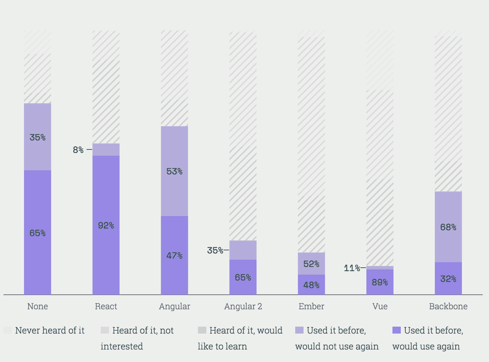

# 一、Vue.js 原理与比较

在本章中，我们将了解为什么 Vue 是一个重要的 web 开发框架，以及如何设置我们的开发环境。如果我们希望在下一个项目中使用 Vue，那么在这样做时，我们必须意识到其含义、时间投入和学习曲线。您将考虑 Vue 如何适应其他前端开发项目，以及如何使用 Vue 创建第一个应用。

总之，我们将考虑以下几点：

*   下载本书的先决条件
*   了解 Vue 在前端框架中的位置
*   为什么要考虑使用 VUE 作为下一个项目的框架
*   调查 Vue 的灵活性及其在移动开发中的作用

# 先决条件

虽然您可以在不使用 Node 的情况下开发 Vue 应用，但在本书中，我们将使用 Node.js 来管理依赖关系，并与 Vue**命令行界面**（**CLI**交互。这使我们能够更快地引导项目，并提供更好的开发体验，因为默认情况下我们可以使用 ECMAScript 2015。让我们快速复习一下如何设置开发环境。

# 窗户

安装 Windows 节点只需访问[即可 https://nodejs.org](https://nodejs.org/) 下载最新版本。确保在执行安装步骤时，选择了“添加到路径”，因为这将允许我们访问终端内的节点命令。

完成后，通过键入`node -v`和`npm -v`检查节点安装工作。如果您得到了两个版本号（即，每个版本一个），那么您就可以继续阅读本书的其余部分了！

# 雨衣

安装 Node for Mac 需要比从 Node 网站下载安装程序多一点的工作。虽然可以从[使用安装程序 https://nodejs.org](https://nodejs.org/) ，由于`sudo`的要求，不建议使用。

如果我们这样做的话，我们将不得不在所有的`npm`命令前面加上`sudo`，这会使我们的系统容易受到潜在的脚本攻击，给我们带来不便。相反，我们可以通过自制软件包管理器安装 Node，然后我们可以与`npm`交互，而不用担心必须以`sudo`的形式运行。

使用自制软件安装节点的另一个好处是，它会自动添加到我们的路径中。这意味着我们可以键入节点命令，而不必摆弄环境文件。

# 通过自制安装节点

获得自制啤酒的最快方式是访问[http://brew.sh](http://brew.sh/) 并获取安装脚本。它应该看起来有点像这样：

```js
/usr/bin/ruby -e "$(curl -fsSL https://raw.githubusercontent.com/Homebrew/install/master/install)"
```

只需将其粘贴到您的终端，它就会将自制软件包管理器下载到您的 Mac 电脑上。然后，我们可以使用 brew install node 在系统上安装 node，而无需担心。

完成后，通过键入`node -v`和`npm -v`检查节点安装工作。如果您得到了两个版本号（即，每个版本一个），那么您就可以继续阅读本书的其余部分了！

为了管理不同的节点版本，我们还可以安装**节点版本管理器**（**NVM**）。但请注意，目前只有 Mac 支持，Windows 不支持。要安装 NVM，我们可以像这样使用自制软件：

```js
--use Brew to install the NVM
brew install nvm

--File directory
mkdir ~/.nvm

--Install latest version
nvm install --lts

--Ensure latest version is used
nvm use node

--Remember details across sessions
nano ~/.bash_profile

--Execute in every session
export NVM_DIR="$HOME/.nvm"
 . "$(brew --prefix nvm)/nvm.sh"
```

# 编辑

可以使用多种编辑器，如 VisualStudio 代码、升华文本、Atom 和 WebStorm。我推荐 Visual Studio 代码（[https://code.visualstudio.com](https://code.visualstudio.com) ）因为它有一个频繁的发布周期和丰富的 Vue 扩展，我们可以使用它们来改进我们的工作流程。

# 浏览器

我们将使用 Google Chrome 来运行我们的项目，因为它有一个名为 Vue devtools 的扩展，它有助于我们的开发工作流程。如果不使用 Google Chrome，请确保浏览器具有可供使用的相同 Vue devtools 扩展。

# 安装 Vue 开发工具

前往 Google Chrome Extensions 商店，下载 Vue.js devtools（[https://goo.gl/Sc3YU1](https://goo.gl/Sc3YU1) ）。安装此工具后，您将可以访问开发人员工具中的 Vue 面板。在以下示例中，我们可以看到 Vue 实例中的数据对象：

```js
<!DOCTYPE html>
<html lang="en">
<head>
  <meta charset="UTF-8">
  <meta name="viewport" content="width=device-width, initial-     
  scale=1.0">
  <meta http-equiv="X-UA-Compatible" content="ie=edge">
  <title>Vue.js</title>
</head>
<body>
  <div id="app"></div>
  <script src="http://unpkg.com/vue"></script>
  <script>
   Vue.config.devtools = true
   new Vue({
     el: '#app',
     data: {
       name: 'Vue.js Devtools',
       browser: 'Google Chrome'
     },
     template: `
      <div>
        <h1> I'm using {{name}} with {{browser}}</h1>
      </div>
     `
   });
  </script>
</body>
</html>
```

然后，如果我们转到浏览器并打开 devtools，我们可以看到已检测到 Vue，并且我们的消息已输出到屏幕上：


我们将在整本书中使用这一点，以便对我们的应用有更多的了解。请注意，只有在本地服务器上提供 Vue 项目时，开发人员工具才会识别该项目。

# Vue CLI

为了利用 Vue 的所有功能，我们将使用 Vue CLI。这使我们能够使用具有适当捆绑/传输配置的各种初学者模板创建项目。在终端中键入以下内容，确保已安装节点：

```js
$ npm install vue-cli -g
```

这为我们以后的章节做了准备，因为使用初学者模板可以大大增强我们的工作流程。

# Vue.js 如何比较

本书旨在概述如何使用常见的开发模式、最佳实践和要避免的反模式来优化 Vue 应用的结构。

我们的旅程从了解 Vue 如何形成其他常见项目开始，如果你用 GitHub stars 衡量你的框架，Vue 显然是未来的赢家。根据[https://bestof.js.org](https://bestof.js.org) 相比 React 的 76 颗和 Angular 的 32 颗，2017 年它目前每天测量 114 颗恒星。

在讨论现代 web 开发技术时，框架讨论是一个有趣的话题。你很少能找到一个真实、公正的比较。。。但那很好！这不是关于哪个框架或库最好，而是关于什么对您的团队、项目目标、消费者和数百个其他变量最好。作为 Vue 开发人员，您可能希望使用简单易用的 API 构建反应式 web 应用。

正是这种适应性强、易于使用的 API 使 Vue 易于使用，而且 Vue 最强大的地方之一可能就是简单、集中的文档。它的进入门槛非常低：只需从 CDN 添加一个脚本文件，初始化一个新的 Vue 实例。。。你走了！诚然，Vue 的功能远不止这些，但与 Angular 等成熟的框架相比，您认为它这么简单是可以理解的。

Vue 使用模板、声明性绑定和基于组件的体系结构来分离关注点并使项目更易于维护。当考虑在企业内部使用哪个框架时，这一点变得尤为重要。通常，这是项目的亮点，因为它能够在整个项目中实施标准。

我们已经确定它易于使用，但与竞争对手相比，Vue 还相当年轻。。。我们怎么知道这不全是炒作？有人在生产中使用它吗？当然是！GitLab 最近写了一篇关于他们为什么选择 Vue.js（[的文章 https://about.gitlab.com/2016/10/20/why-we-chose-vue/](https://about.gitlab.com/2016/10/20/why-we-chose-vue/) ），他们提到的主要好处是易于使用、代码更少和假设更少。其他公司，如 Laravel、任天堂、Sainsbury's 和阿里巴巴都在遵循这一路线，甚至像 Rever Shine 这样的公司也将其 web 客户端从 Angular 2.x 重新编写为 Vue 2.x（[https://medium.com/reverdev/why-we-moved-from-angular-2-to-vue-js-and-why-we-didnt-choose-react-ef807d9f4163](https://medium.com/reverdev/why-we-moved-from-angular-2-to-vue-js-and-why-we-didnt-choose-react-ef807d9f4163) ）。

利用 Vue.js-NativeScript Sidekick（[的不仅仅是面向公众的 web 应用 https://www.nativescript.org/blog/announcing-the-nativescript-sidekick-public-preview](https://www.nativescript.org/blog/announcing-the-nativescript-sidekick-public-preview) ），一个专注于改善 NativeScript 开发体验的项目，是使用 Electron 和 Vue.js 构建的。

如果我们从 JavaScript 现状调查中获得一些见解（[http://2016.stateofjs.com/2016/frontend/ Sacha Greif 的](http://2016.stateofjs.com/2016/frontend/)（[https://twitter.com/SachaGreif](https://twitter.com/SachaGreif) 和迈克尔·兰博（[http://michaelrambeau.com/](http://michaelrambeau.com/) ），我们可以看到惊人的**89%**以前使用过 Vue 并希望再次使用它的人的百分比。React 等其他图书馆的满意度相似，为**92%**，但 Angular 2 及以后的图书馆没有看到如此多的爱，其中**65%**希望再次使用：



作为前端开发人员，我们还有哪些其他选择？它们是如何形成 Vue 的？让我们从反应开始。

# 反应

React 是一个由 Facebook 开发和维护的 JavaScript 库，在很大程度上与 Vue 最接近，因为它们的目标非常相似。与 Vue 一样，React 也是基于组件的，并利用了虚拟 DOM 概念。这允许对 DOM 节点进行性能渲染，因为使用不同的算法来确定 DOM 的哪些部分已更改，以及如何在更改时最好地渲染/更新它们。

对于模板，React 使用 JSX 在屏幕上呈现项目。它采用更详细的方法，使用`React.createElement`创建 DOM 元素，并将其简化为：

这就是没有 JSX 时的情况：

```js
React.createElement</span>( MyButton, {color: 'red', shadowSize: 5}, 'Click Me' )
```

下面是使用 JSX 时的外观。如您所见，这两种情况看起来非常不同：

```js
<MyButton color="red" shadowSize={5}>
 Click Me
</MyButton>
```

对于较新的开发人员来说，与 Vue 的简单 HTML 模板相比，这增加了一点学习开销，但这也是 React 声明能力的来源。它有一个使用`setState()`的状态管理系统，但也与第三方状态容器（如 Redux 和 MobX）兼容。Vue 还具有与`Vuex`库类似的功能，我们将在本书后面的章节中进一步详细介绍这一点。

最近使用 React 的一个常见问题是 BSD+专利许可协议，如果您是企业的一部分，请记住这一点。由于该许可证，Apache 最近宣布，任何 Apache 软件产品都不会使用 React。另一个例子是[Wordpress.com](http://Wordpress.com)宣布他们不再在古腾堡项目（[中使用 Reacthttps://ma.tt/2017/09/on-react-and-wordpress/](https://ma.tt/2017/09/on-react-and-wordpress/) ）。这并不一定意味着您不应该在项目中使用 React，但值得指出。

一些关注的开发人员选择使用 Preact 等替代方案，但最近使用的是 Vue.js，因为它满足了开发人员在开发应用时所追求的许多目标。为此，微软（[http://dev.office.com/fabric#/components](http://dev.office.com/fabric#/components) 、苹果（[https://developer.apple.com/documentation](https://developer.apple.com/documentation) ），以及无数其他公司发布了带有 React 的产品——你想怎么做就怎么做。

# 有棱角的

Angular 是由 Google 开发和维护的一个固执己见的 JavaScript 框架。在撰写本文时，它目前已接近第 5 版，并提供了一种基于结构化标准的 web 开发方法。它使用 TypeScript 强制执行类型安全和 ECMAScript 2015>支持。

与 Angular 相比，Vue 看起来实施了更小的约束集，并允许开发人员有更多的选择。Angular 的核心竞争力之一是 TypeScript everywhere。当 Angular 2 发布时，大多数来自 Angular.js 的开发人员都是第一次听说 TypeScript 的，我注意到由于需要“学习一种新的语言”而引起了相当多的反弹。问题是，JavaScript 是 TypeScript，增加的工具（自动完成、重构、类型安全等）的价值不容忽视。

当涉及到企业项目时尤其如此，因为随着项目复杂性和团队规模的增加，入职挑战变得更加困难。使用 TypeScript，我们能够更好地解释代码之间的关系。正是这种结构化的开发经验是 Angular 的主要优势。这就是 Angular 团队选择 TypeScript 作为主要开发工具的原因。TypeScript 的好处不仅限于角度；我们将在本书后面介绍如何将 Vue 与 TypeScript 集成，以获得相同的好处。

使用 Angular 作为开发框架有什么缺点吗？不一定。当我们将其与 Vue 进行比较时，其入职体验截然不同。

# 移动开发

在开发移动应用时，Angular 和 React 等项目是开发移动优先应用的最佳选择。NativeScript、React Native 和 Ionic 框架项目的成功促进了这些框架的显著普及。例如，Ionic Framework 目前在 GitHub 上拥有比 Angular 更多的星星！

Vue 通过 NativeScript Vue、Weex 和 Quasar Framework 等项目在这一领域掀起了波澜。所有列出的项目都相对较新，但只需一个项目，就可以进一步提高 Vue 在生产中的知名度。以 NativeScript Vue 为例，创建连接到 REST API 并在屏幕上显示结果的跨平台移动应用只需 43 行代码。如果您想自己遵循此步骤，请运行：

```js
# Install the NativeScript CLI
npm install nativescript -g

# New NativeScript Vue project
tns create NSVue --template nativescript-vue-template

# Change directory
cd NSVue

# Run on iOS
tns run ios
```

然后，我们可以在我们的`app/app.js`中放置以下内容：

```js
const Vue = require('nativescript-vue/dist/index');
const http = require('http');
Vue.prototype.$http = http;

new Vue({
    template: `
    <page>
        <action-bar class="action-bar" title="Posts"></action-bar>
        <stack-layout>
            <list-view :items="posts">
                <template scope="post">
                    <stack-layout class="list">
                        <label :text="post.title"></label>
                        <label :text="post.body"></label>
                    </stack-layout>
                </template>
            </list-view>
        </stack-layout>
    </page>
    `,    
    data: {
        posts: []
    },
    created(args) {
        this.getPosts();
    },
    methods: {
        getPosts() {
            this.$http
                .getJSON(`https://jsonplaceholder.typicode.com/posts`)
                .then(response => {
                    this.posts = response.map(
                        post => {
                            return {
                                title: post.title,
                                body: post.body
                            }
                        }
                    )
                });
        }
    }
}).$start();
```

如果我们运行代码，我们可以看到一个帖子列表。您会注意到，我们的 Vue 代码是声明性的，我们可以使用更少的代码使用更大的框架：


# 服务器端渲染（SSR）

服务器端呈现允许我们使用前端 JavaScript 应用，并在服务器上将其呈现为静态 HTML。这一点很重要，因为它允许我们显著加快应用的速度，因为浏览器只需解析关键的 HTML/CSS。最大限度地提高性能是现代 web 应用的一个关键组成部分，随着 AMP 等先进的 web 应用和项目的发展，人们的期望也在不断提高。React、Angular 和 Vue 都能够使用各种不同的模式进行 SSR。

让我们看看如何实现一个简单的服务器端渲染的 VUE 应用：

```js
# Create a new folder named vue-ssr:
$ mkdir vue-ssr
$ cd vue-ssr

# Create a new file named server.js
$ touch server.js

# Install dependencies
$ npm install vue vue-server-renderer express
```

在`server.js`中，我们可以创建一个新的 Vue 实例，并使用 Vue 渲染器将我们实例的内容输出为 HTML：

```js
const Vue = require("vue");
const server = require("express")();
const renderer = require("vue-server-renderer").createRenderer();

server.get("*", (req, res) => {
  const app = new Vue({
    data: {
      date: new Date()
    },
    template: `
    <div>
    The visited time: {{ date }}
    </div>`
  });

  renderer.renderToString(app, (err, html) => {
    if (err) {
      res.status(500).end("Internal Server Error");
      return;
    }
    res.end(`
      <!DOCTYPE html>
      <html lang="en">
        <head><title>Hello</title></head>
        <body>${html}</body>
      </html>
    `);
  });
});

server.listen(8080);
```

要运行应用，请在终端中键入以下内容：

```js
$ node server.js
```

然后我们可以在`http://localhost: 8080`的浏览器中打开它，我们会在屏幕上看到当前的日期和时间。这是一个简单的示例，但我们可以看到我们的应用使用`vue-server-renderer`呈现。请注意，我们没有定义目标元素来呈现 Vue 实例中的内容；这由`renderer.renderToString`函数处理。

您还将注意到，我们在 DOM 节点上有`data-server-rendered="true"`属性，这在客户端呈现的 Vue 应用中不存在。这使我们能够将客户端实例与服务器端实例结合起来，我们将在后面的 Nuxt（[章节）中详细介绍这一点 https://nuxtjs.org/](https://nuxtjs.org/) 。

# 结论

企业中 web 框架的选择始终取决于项目、团队和组织优先级的目标。没有一个框架是正确的选择，因为根据上下文，最优意味着不同的事情。每个框架或库都有其独特的优点、缺点和优先级。若您的首要任务是快速、大规模地创建 web 应用，那个么 Vue 可以和其他市场解决方案竞争。

Vue 具有丰富的功能、声明性和高度易读性。尽管它是一个过于简单的框架，但 Vue 的声明性本质允许我们以极快的速度启动和运行，而不必担心过于复杂的模式。

# 总结

在本章中，我们介绍了如何设置开发环境，以及 Vue 如何在整个行业的许多产品中使用。我们了解到 Vue 是一个简单但功能强大的前端开发框架。除此之外，我们还考虑了与其他流行项目（如 Angular 和 React）相比，Vue 是如何形成的。我们还研究了 Vue 如何与其他技术（如 NativeScript）协作，以创建跨平台的本机移动应用。最后，我们在高层次上研究了 SSR，为后面的章节做好了准备。希望到现在为止，您已经确信 Vue 值得学习，并且期待着充分利用它所提供的一切！

在下一章中，我们将介绍 Vue CLI 以及如何利用 Webpack 等工具创建 Vue 项目。除此之外，我们还将了解如何利用 Vue 中的静态类型和 TypeScript 工具以及 RxJS 的反应式可观察模式。