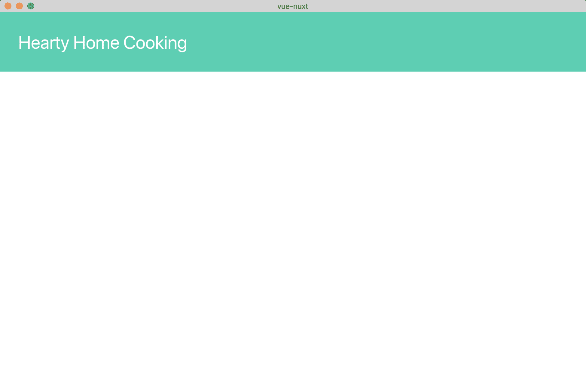
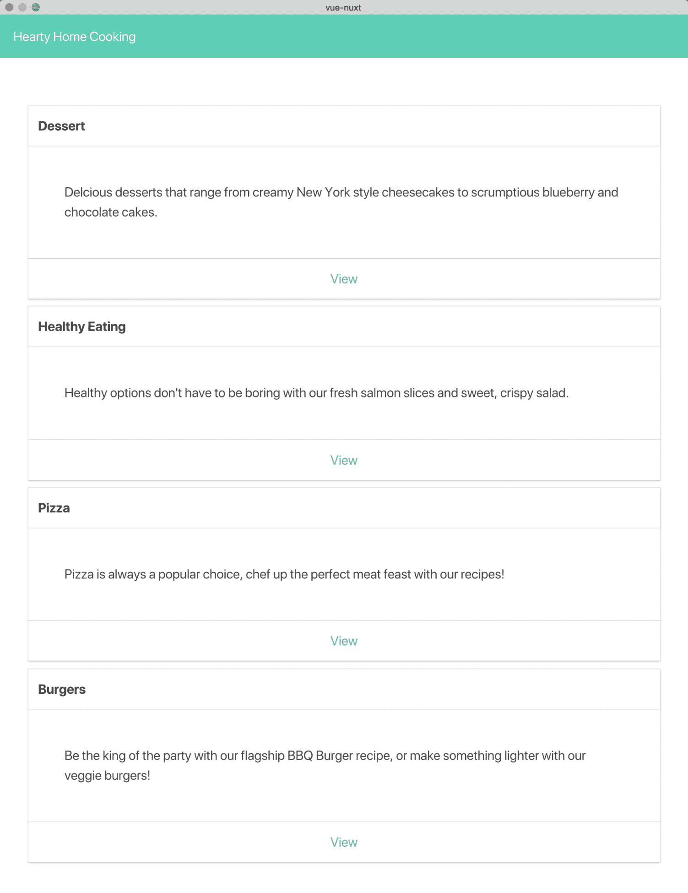
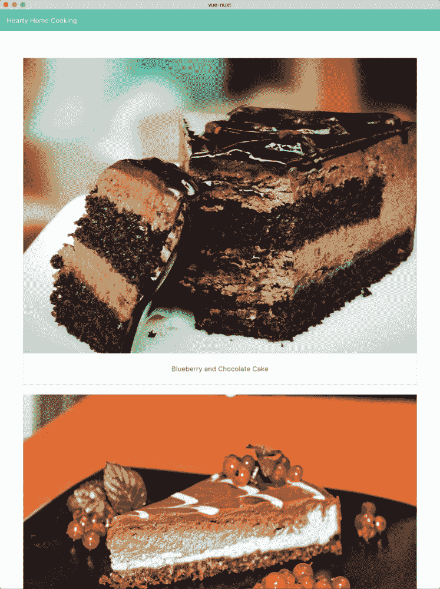
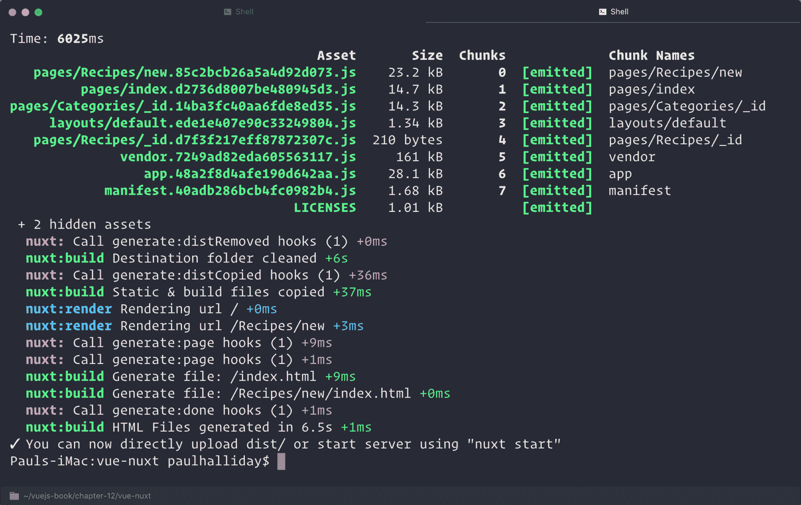

# 十二、将 Nuxt 用于服务器端渲染

Nuxt 的灵感来自 Zeit 创建的一个名为 Next.js 的流行 React 项目。这两个项目的目标都是创建应用，以便使用最新的思想、工具和技术获得更好的开发体验。Nuxt 最近进入了 1.x 版及更高版本，这意味着它应该被认为是稳定的，可以用于生产网站。

在本章中，我们将更详细地介绍 Nuxt，如果您觉得它有用，它可能会成为创建 Vue 应用的默认方式。

在本章中，我们将介绍以下主题：

*   调查 Nuxt 并了解使用它的好处
*   使用 Nuxt 创建应用
*   使用 Nuxt 中间件
*   使用布局定义内容
*   理解 Nuxt 中的路由
*   使用服务器端渲染构建 Vue 项目
*   将 Vue 项目构建为静态站点

# 努克斯

Nuxt 引入了通用 Vue 应用的概念，因为它允许我们轻松利用**服务器端渲染**（**SSR**）。同时，Nuxt 还为我们提供了生成静态站点的能力，这意味着内容被呈现为 HTML、CSS 和 JS 文件，而无需从服务器进行前后转换。

这并不是 Nuxt 处理路由生成的全部，也不会影响 Vue 的任何核心功能。让我们创建一个 Nuxt 项目。

# 创建 Nuxt 项目

我们可以使用 Vue CLI 使用 starter 模板创建新的 Nuxt 项目。这为我们提供了一个 barebones Nuxt 项目，使我们不必手动配置所有内容。我们将创建一个名为“Hearty Home Cooking”的“菜谱列表”应用，它使用 REST API 获取类别和菜谱名称。在终端中运行以下命令以创建新的 Nuxt 项目：

```js
# Create a new Nuxt project
$ vue init nuxt-community/starter-template vue-nuxt

# Change directory
$ cd vue-nuxt

# Install dependencies
$ npm install

# Run the project in the browser
$ npm run dev
```

前面的步骤与我们在创建新的 Vue 项目时所期望的非常相似，相反，我们可以简单地使用 Nuxt 存储库和初学者模板来生成项目。

如果我们看一下我们的`package.json`，您会发现我们没有生产依赖项的列表；相反，我们只有一个，`nuxt`：

```js
"dependencies": {
  "nuxt": "^1.0.0"
}
```

这一点很重要，因为这意味着我们不必管理 Vue 的版本或担心其他兼容软件包，因为我们只需要更新`nuxt`的版本。

# 目录结构

如果我们在编辑器中打开我们的项目，我们会注意到我们的文件夹比以前的 Vue 应用多得多。我编制了一个表格，概述了它们的含义：

| 文件夹 | 描述 |
| `Assets` | 用于存储项目资产，例如未编译的图像、js 和 CSS。使用网页包加载程序作为模块加载。 |
| `Components` | 用于存储应用组件。这些不会转换为路线。 |
| `Layouts` | 用于创建应用布局，例如默认布局、错误布局或其他自定义布局。 |
| `Middleware` | 用于定义自定义应用中间件。这允许我们在不同的事件上运行自定义功能，例如在页面之间导航。 |
| `Pages` | 用于创建用作应用路由的组件（`.vue`文件）。 |
| `Plugins` | 用于注册应用范围的插件（即使用`Vue.use`）。 |
| `Static` | 用于存储静态文件；此文件夹中的每个项目都映射到`/*`而不是`/static/*`。 |
| `Store` | 与 Vuex 商店一起使用。Vuex 的标准和模块实现都可以与 Nuxt 一起使用。 |

尽管这看起来可能更复杂，但请记住，这有助于我们分离关注点，并且该结构允许 Nuxt 处理自动路由生成之类的事情。

# Nuxt 配置

让我们为我们的项目添加一些自定义链接，这样我们就可以利用 CSS 库、字体等等。让我们将 Bulma 添加到我们的项目中。

Bulma 是一个 CSS 框架，允许我们使用 Flexbox 构建应用，并允许我们利用许多预制组件。我们可以通过导航到`nuxt.config.js`并在`head`对象内的`link`对象中添加一个新对象，将其（以及其他外部 CDN 文件）添加到我们的项目中，如下所示：

```js
head: {
  // Omitted
  link: [
    { rel: 'icon', type: 'img/x-icon', href: '/favicon.ico' },
    {
      rel: 'stylesheet',
      href:
    'https://cdnjs.cloudflare.com/ajax/libs/bulma/0.6.1/css/bulma.min.css',
    },
  ],
}
```

如果我们随后使用开发人员工具检查 HTML 文档的头部，您会注意到 Bulma 已经添加到我们的项目中。如果我们转向我们的开发人员工具，我们可以看到它确实在项目中使用了 Bulma：


# 航行

每次我们在 pages 目录中创建一个新的`.vue`文件时，都会为我们的应用提供一个新的路由。这意味着，每当我们想要创建一个新路由时，我们只需创建一个带有路由名称的新文件夹，其余的由 Nuxt 处理。考虑到我们在`pages`文件夹中有默认`index.vue`，路由最初看起来如下所示：

```js
routes: [
  {
    name: 'index',
    path: '/',
    component: 'pages/index.vue'
  }
]
```

如果我们随后添加一个内有一个`index.vue`的`categories`文件夹，Nuxt 将生成以下路由：

```js
routes: [
  {
    name: 'index',
    path: '/',
    component: 'pages/index.vue'
  },
  {
    name: 'categories',
    path: '/categories',
    component: 'pages/categories/index.vue'
  }
]
```

如果我们想利用动态路由参数，比如一个`id`，我们可以在`categories`文件夹中创建一个名为`_id.vue`的组件。这会自动创建带有`id`参数的路线，允许我们根据用户的选择采取行动：

```js
routes: [
  {
    name: 'index',
    path: '/',
    component: 'pages/index.vue'
  },
  {
    name: 'categories',
    path: '/categories',
    component: 'pages/categories/index.vue'
  },
  {
    name: 'categories-id',
    path: '/categories/id',
    component: 'pages/categories/_id.vue'
  }
]
```

# 在航线之间导航

我们如何使用 Nuxt 在路线之间导航？当然，我们是使用`nuxt-link`组件来实现的！

这类似于使用标准 Vue.js 应用在链接之间导航时使用的`router-link`组件（在撰写本文时，它与之相同），但它使用`nuxt-link`组件包装，以便将来利用预取等功能。

# 布局

我们可以在 Nuxt 项目中创建自定义布局。这允许我们改变页面的排列方式，也允许我们添加通用性，例如静态导航栏和页脚。让我们使用 Bulma 创建一个新的导航栏，允许我们在站点中的多个组件之间导航。

在`components`文件夹中，创建一个名为`NavigationBar.vue`的新文件，并给它以下标记：

```js
<template>
  <nav class="navbar is-primary" role="navigation" aria-label="main 
  navigation">
    <div class="navbar-brand">
      <nuxt-link class="navbar-item" to="/">Hearty Home Cooking</nuxt-
      link>
    </div>
  </nav>
</template>

<script>
export default {}
</script>
```

然后我们需要将其添加到`layouts`/`default.vue`中的默认布局中。我还附上了`nuxt`标签（即我们的主`router-view`）和适当的 Bulma 类，以集中我们的内容：

```js
<template>
  <div>
    <navigation-bar></navigation-bar>
    <section class="section">
      <nuxt class="container"/>
    </section>
  </div>
</template>

<script>
import NavigationBar from '../components/NavigationBar'

export default {
  components: {
    NavigationBar
  }
}
</script>
```

如果我们进入浏览器，我们会看到一个如下的应用，反映了我们的代码：



# 模拟 RESTAPI

在创建显示数据的组件之前，让我们先用 JSON 服务器模拟一个 RESTAPI。为此，我们需要在项目根目录中包含一个名为`db.json`的文件，如下所示：

```js
{
  "recipes": [
    { "id": 1, "title": "Blueberry and Chocolate Cake", "categoryId": 1, "image": "https://static.pexels.com/photos/291528/pexels-photo-291528.jpeg" },
    { "id": 2, "title": "Chocolate Cheesecake", "categoryId": 1, "image": "https://images.pexels.com/photos/47013/pexels-photo-47013.jpeg"},
    { "id": 3, "title": "New York and Berry Cheesecake", "categoryId": 1, "image": "https://images.pexels.com/photos/14107/pexels-photo-14107.jpeg"},
    { "id": 4, "title": "Salad with Light Dressing", "categoryId": 2, "image": "https://static.pexels.com/photos/257816/pexels-photo-257816.jpeg"},
    { "id": 5, "title": "Salmon Slices", "categoryId": 2, "image": "https://static.pexels.com/photos/629093/pexels-photo-629093.jpeg" },
    { "id": 6, "title": "Mushroom, Tomato and Sweetcorn Pizza", "categoryId": 3, "image": "https://static.pexels.com/photos/7658/food-pizza-box-chalkboard.jpg" },
    { "id": 7, "title": "Fresh Burger", "categoryId": 4, "image": "https://images.pexels.com/photos/460599/pexels-photo-460599.jpeg" }
  ],
  "categories": [
    { "id": 1, "name": "Dessert", "description": "Delcious desserts that range from creamy New York style cheesecakes to scrumptious blueberry and chocolate cakes."},
    { "id": 2, "name": "Healthy Eating", "description": "Healthy options don't have to be boring with our fresh salmon slices and sweet, crispy salad."},
    { "id": 3, "name": "Pizza", "description": "Pizza is always a popular choice, chef up the perfect meat feast with our recipes!"},
    { "id": 4, "name": "Burgers", "description": "Be the king of the party with our flagship BBQ Burger recipe, or make something lighter with our veggie burgers!"}
  ]
}
```

接下来，通过在终端中运行以下命令，确保您的计算机上安装了 JSON 服务器：

```js
$ npm install json-server -g
```

然后，我们可以通过在终端中键入以下命令，在`3001`端口（或`3000`以外的任何端口，因为这是 Nuxt 运行的端口）上运行服务器：

```js
$ json-server --watch db.json --port 3001
```

这将监视数据库的任何更改，并相应地更新 API。然后我们可以向`localhost:3000/recipes/:id`和`localhost:3000/categories/:id`发出请求。在 Nuxt 中，我们可以使用`axios`和`asyncData`来实现这一点；让我们看看下一步。

# 异步数据

我们可以使用`asyncData`方法在加载组件之前解析组件的数据，本质上是在服务器端请求数据，然后在加载时将结果与组件实例中的数据对象合并。这使它成为添加异步操作的好地方，例如从 RESTAPI 获取数据。

我们将使用`axios`库来创建 HTTP 请求，因此我们需要确保已经安装了它。从终端运行以下命令：

```js
$ npm install axios
```

然后，在`pages`/`index.vue`中，我们将获得一个类别列表，在应用启动时显示给用户。让我们在`asyncData`中这样做：

```js
import axios from 'axios'

export default {
  asyncData ({ req, params }) {
    return axios.get(`http://localhost:3001/categories`)
      .then((res) => {
        return {
          categories: res.data
        }
      })
  },
}
```

# 类别

当`asyncData`与我们的 Vue 实例的数据对象合并时，我们可以访问视图中的数据。让我们创建一个`category`组件，为 API 中的每个类别显示一个类别：

```js
<template>
  <div class="card">
    <header class="card-header">
      <p class="card-header-title">
        {{category.name}}
      </p>
    </header>
    <div class="card-content">
      <div class="content">
        {{category.description}}
      </div>
    </div>
    <footer class="card-footer">
      <nuxt-link :to="categoryLink" class="card-footer-
      item">View</nuxt-link>
    </footer>
  </div>
</template>

<script>

export default {
  props: ['category'],
  computed: {
    categoryLink () {
      return `/categories/${this.category.id}`
    }
  }
}
</script>

<style scoped>
div {
  margin: 10px;
}
</style>
```

在前面的代码中，我们使用 Bulma 获取类别信息并将其放在一张卡上。我们还使用了一个`computed`属性为`nuxt-link`组件生成道具。这允许我们将用户导航到基于类别`id`的项目列表。然后我们可以将其添加到根`pages/index.vue`文件中：

```js
<template>
  <div>
    <app-category v-for="category in categories" :key="category.id" 
    :category="category"></app-category>
  </div>
</template>

<script>
import Category from '../components/Category'
import axios from 'axios'

export default {
  asyncData ({ req, params }) {
    return axios.get(`http://localhost:3001/categories`)
      .then((res) => {
        return {
          categories: res.data
        }
      })
  },
  components: {
    'app-category': Category
  }
}
</script>
```

因此，这就是我们的头版现在的样子：



# 类别详细信息

为了将用户导航到`category`详细信息页面，我们需要在`categories`文件夹中创建一个`_id.vue`文件。这将使我们能够访问此页面中的 ID 参数。这个过程和以前类似，只是现在我们还增加了一个`validate`函数，检查`id`参数是否存在：

```js
<script>
import axios from 'axios'

export default {
  validate ({ params }) {
    return !isNaN(+params.id)
  },
  asyncData ({ req, params }) {
    return axios.get(`http://localhost:3001/recipes? 
    categoryId=${params.id}`)
      .then((res) => {
        return {
          recipes: res.data
        }
      })
  },
}
</script>
```

`validate`功能确保此路由的参数存在，如果不存在，则将用户导航到错误（`404`页面。在本章后面，我们将了解如何创建自己的错误页面。

我们现在在`data`对象中有一个`recipes`数组，其中包含基于用户选择的`categoryId`的配方。让我们在 components 文件夹中创建一个显示配方信息的`Recipe.vue`组件：

```js
<template>
  <div class="recipe">
    <div class="card">
      <div class="card-image">
        <figure class="image is-4by3">
          
        </figure>
      </div>
      <div class="card-content has-text-centered">
        <div class="content">
          {{recipe.title}}
        </div>
      </div>
    </div>
  </div>
</template>

<script>

export default {
  props: ['recipe']
}
</script>

<style>
.recipe {
  padding: 10px; 
  margin: 5px;
}
</style>
```

再一次，我们使用 Bulma 进行造型，并且能够将配方作为道具传递到该组件中。让我们重复一下`_id.vue`组件中的所有配方：

```js
<template>
  <div>
    <app-recipe v-for="recipe in recipes" :key="recipe.id" 
    :recipe="recipe"></app-recipe>
  </div>
</template>

<script>
import Recipe from '../../components/Recipe'
import axios from 'axios'

export default {
  validate ({ params }) {
    return !isNaN(+params.id)
  },
  asyncData ({ req, params }) {
    return axios.get(`http://localhost:3001/recipes?
    categoryId=${params.id}`)
      .then((res) => {
        return {
          recipes: res.data
        }
      })
  },
  components: {
    'app-recipe': Recipe
  }
}
</script>
```

无论何时选择一个类别，我们现在都会看到以下页面，其中显示了所选的配方：



# 错误页

如果用户导航到不存在的路由，或者我们的应用中出现错误，该怎么办？当然，我们可以利用 Nuxt 的默认错误页面，也可以创建自己的错误页面。

我们可以通过在`layouts`文件夹中创建`error.vue`来实现。让我们继续，如果状态代码为`404`，则显示一条错误消息；如果没有，我们将显示一条一般错误消息：

```js
<template>
  <div>
    <div class="has-text-centered" v-if="error.statusCode === 404">
      
        <h1 class="title">Page not found: 404</h1>
        <h2 class="subtitle">
          <nuxt-link to="/">Back to the home page</nuxt-link>
        </h2>
    </div>
    <div v-else class="has-text-centered">
      <h1 class="title">An error occured.</h1>
      <h2 class="subtitle">
        <nuxt-link to="/">Back to the home page</nuxt-link>
      </h2>
    </div>
  </div>
</template>

<script>

export default {
  props: ['error'],
}
</script>
```

如果我们导航到`locahost:3000/e`，您将被导航到我们的错误页面。让我们来看看错误页面：


# 插件

我们需要能够将配方添加到应用中；由于添加新配方需要一个表单和一些输入，以便正确验证表单，我们将使用`Vuelidate`。如果您还记得前面的章节，我们可以添加`Vuelidate`和其他带有`Vue.use`的插件。使用 Nuxt 的过程类似，但需要额外的步骤。让我们在终端中运行以下命令来安装`Vuelidate`：

```js
$ npm install vuelidate
```

在我们的插件文件夹中，创建一个名为`Vuelidate.js`的新文件。在这个文件中，我们可以导入`Vue`和`Vuelidate`并添加插件：

```js
import Vue from 'vue'
import Vuelidate from 'vuelidate'

Vue.use(Vuelidate)
```

然后我们可以更新`nuxt.config.js`以添加插件阵列，它指向我们的`Vuelidate`文件：

```js
plugins: ['~/plugins/Vuelidate']
```

在`build`对象中，我们还将`'vuelidate'`添加到供应商包中，以便将其添加到我们的应用中：

```js
build: {
 vendor: ['vuelidate'],
 // Omitted
}
```

# 添加配方

让我们在`pages/Recipes/new.vue`下新建一条路线；这将生成到`localhost:3000/recipes/new`的路由。我们的实施将是简单的；例如，将配方步骤设置为`string`可能不是生产的最佳想法，但它允许我们实现开发目标。

然后，我们可以使用`Vuelidate`添加适当的数据对象和验证：

```js
import { required, minLength } from 'vuelidate/lib/validators'

export default {
  data () {
    return {
      title: '',
      image: '',
      steps: '',
      categoryId: 1
    }
  },
  validations: {
    title: {
      required,
      minLength: minLength(4)
    },
    image: {
      required
    },
    steps: {
      required,
      minLength: minLength(30)
    }
  },
}
```

接下来，我们可以添加适当的模板，包括从验证消息到上下文类的所有内容，如果表单有效/无效，则启用/禁用`submit`按钮：

```js
<template>
  <form @submit.prevent="submitRecipe">
    <div class="field">
      <label class="label">Recipe Title</label>
      <input class="input" :class="{ 'is-danger': $v.title.$error}" v-
      model.trim="title" @input="$v.title.$touch()" type="text">
      <p class="help is-danger" v-if="!$v.title.required && 
      $v.title.$dirty">Title is required</p>
      <p class="help is-danger" v-if="!$v.title.minLength && 
      $v.title.$dirty">Title must be at least 4 characters.</p>
    </div>

    <div class="field">
      <label class="label">Recipe Image URL</label>
      <input class="input" :class="{ 'is-danger': $v.image.$error}" v-
      model.trim="image" @input="$v.image.$touch()" type="text">
      <p class="help is-danger" v-if="!$v.image.required && 
      $v.image.$dirty">Image URL is required</p>
    </div>

    <div class="field">
      <label class="label">Steps</label>
      <textarea class="textarea" rows="5" :class="{ 'is-danger': 
      $v.steps.$error}" v-model="steps" @input="$v.steps.$touch()" 
      type="text">
      </textarea>
      <p class="help is-danger" v-if="!$v.steps.required && 
      $v.steps.$dirty">Recipe steps are required.</p>
      <p class="help is-danger" v-if="!$v.steps.minLength && 
      $v.steps.$dirty">Steps must be at least 30 characters.</p>
    </div>

    <div class="field">
      <label class="label">Category</label>
      <div class="control">
        <div class="select">
          <select v-model="categoryId" @input="$v.categoryId.$touch()">
            <option value="1">Dessert</option>
            <option value="2">Healthy Eating</option>
          </select>
        </div>
      </div>
    </div>

    <button :disabled="$v.$invalid" class="button is-
    primary">Add</button>
  </form>
</template>
```

要提交配方，我们需要向 API 发出 POST 请求：

```js
import axios from 'axios'

export default {
  // Omitted
  methods: {
    submitRecipe () {
      const recipe = { title: this.title, image: this.image, steps: 
      this.steps, categoryId: Number(this.categoryId) }
      axios.post('http://localhost:3001/recipes', recipe)
    }
  },
}
```

与其手动导航到`http://localhost:3000/recipes/new`URL，不如在导航栏中添加一项：

```js
<template>
  <nav class="navbar is-primary" role="navigation" aria-label="main navigation">
    <div class="navbar-brand">
      <nuxt-link class="navbar-item" to="/">Hearty Home Cooking</nuxt-
      link>
    </div>
    <div class="navbar-end">
      <nuxt-link class="navbar-item" to="/recipes/new">+ Add New 
      Recipe</nuxt-
     link>
    </div>
  </nav>
</template>
```

下面是我们的页面现在的样子：


虽然我们没有在应用中使用配方步骤，但我已经将其作为您自己可能希望包含的功能包含在本示例中。

# 过渡

在页面之间导航时，Nuxt 使添加转换变得超级简单。让我们通过添加自定义 CSS 为每个导航操作添加一个`transition`。在`assets`文件夹中添加一个名为`transition.css`的文件，我们将钩住不同的页面状态：

```js
.page-enter-active, .page-leave-active {
  transition: all 0.25s;
}

.page-enter, .page-leave-active {
  opacity: 0;
  transform: scale(2);
}
```

添加文件后，我们需要告诉 Nuxt 我们希望将其用作`.css`文件。将以下代码添加到您的`nuxt.config.js`：

```js
 css: [img/transition.css']
```

现在，我们可以在任何页面之间导航，并且每次都会进行页面转换。

# 生产性建筑

Nuxt 为我们提供了多种构建生产项目的方法，例如服务器呈现（通用）、静态或**单页应用**（**SPA**模式）。所有这些都提供了不同的优点和缺点，这取决于用例。

默认情况下，我们的项目处于服务器呈现（通用）模式，可以通过在终端中运行以下命令为生产构建项目：

```js
$ npm run build
```

然后我们在项目的`.nuxt`文件夹中得到一个`dist`文件夹；这包含我们的应用的构建最终结果，可以部署到托管提供商：


# 静止的

为了在静态模式下构建我们的项目，我们可以在终端中运行以下命令：

```js
$ npm run generate
```

这将构建一个静态站点，然后可以将其部署到静态托管提供商（如 Firebase）上。以下是终端的显示方式：


# SPA 模式

为了在 SPA 模式下构建我们的项目，我们需要在`nuxt.config.js`中添加以下关键值：

```js
mode: 'spa'
```

然后，我们可以再次构建项目，但这次将使用 SPA 模式构建：

```js
$ npm run build 
```

我们的命令终端现在应该如下所示：



# 总结

在本章中，我们讨论了如何使用 Nuxt 创建服务器呈现的 Vue 应用。我们还讨论了*创建新路由有多容易*以及如何在项目中添加自定义 CSS 库。此外，我们还介绍了如何在页面中添加转换，以使在路由之间切换时变得有趣。我们还讨论了如何构建项目的不同版本，这取决于我们想要的是通用、静态还是 SPA 应用。

在最后一章中，我们将讨论 Vue.js 中常见的反模式以及如何避免它们。这对于编写能够经受时间考验的一致性软件至关重要。