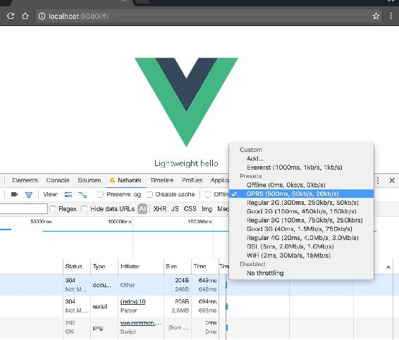
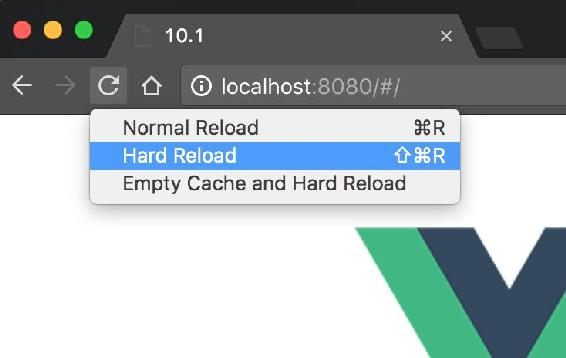
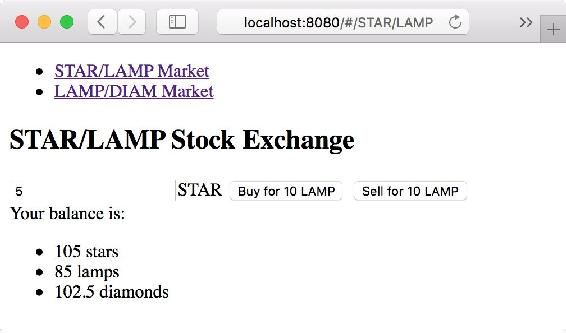
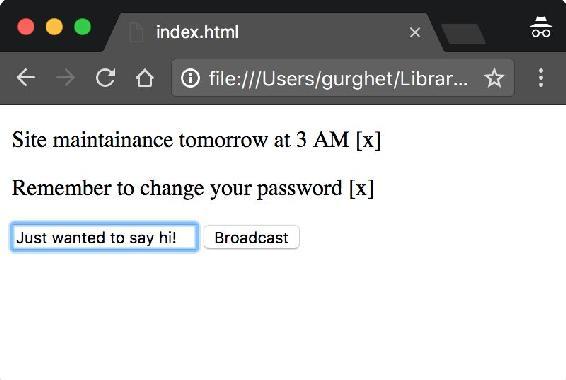
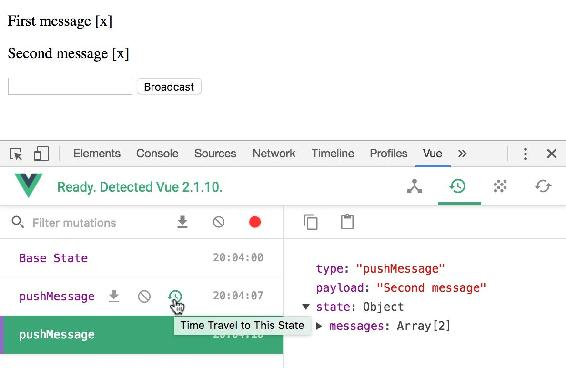
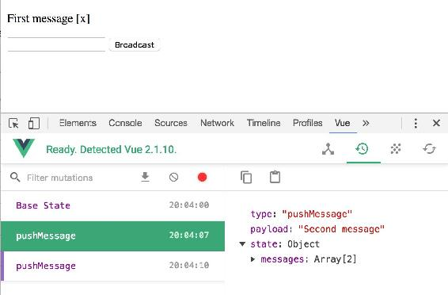

# 十、使用 Vuex 的大型应用模式

在本章中，我们将介绍以下食谱:

*   在你的 vue 路由器中动态加载页面
*   为应用状态构建简单的存储
*   了解 Vuex 突变
*   在 Vuex 中列出您的行动
*   用模块分离关注点
*   构建 getters 来帮助检索数据
*   测试你的商店


# 介绍

在本章中，您将学习 Vuex 如何工作，以及如何使用它来支持可扩展的应用。Vuex 实现了一种在前端框架中很流行的模式，包括划分不同的关注点来管理一个大的全局应用状态。突变是唯一能改变状态的东西，所以你只有一个地方去寻找。大部分逻辑以及所有异步逻辑都包含在动作中；最后，在计算派生状态和将代码分成不同的文件时，getters 和 modules 进一步帮助分散认知负荷。

除了菜谱，你还会发现我发现在开发真正的大型应用时有用的智慧；有些与命名约定有关，有些与避免 bug 的小技巧有关。

如果你完成了所有的配方，你将准备好开发大的前端应用，减少错误和无缝协作。


# 在你的 vue 路由器中动态加载页面

很快，你将会用大量的组件建立巨大的 Vue 网站。加载大量 JavaScript 可能会产生浪费和无用的前期延迟。在 *异步加载你的组件[第四章](part0195.html#5PUTM0-d58460e0eb6644049f9e99e6566f895c)、*所有关于组件*的*配方中，我们已经看到了如何远程检索组件的提示。这里，我们将对 vue-router 中的路由加载的组件应用类似的技术。


# 做好准备

这个食谱需要 vue 路由器的知识。如果你愿意，你可以在第四章 、*关于组件*的 [中查看*异步加载组件* ，以更好地了解正在发生的事情。](part0195.html#5PUTM0-d58460e0eb6644049f9e99e6566f895c)


# 怎么做...

通过创建一个新目录并运行以下命令，用`vue-cli`创建一个新项目:

```js
vue init webpack

```

你可以根据自己的喜好来回答问题，只要在被问到的时候把`vue-router`添加到模板中。

我们将创建两个组件:一个将是我们的主页，它将是小而轻，另一个组件将是非常大，加载非常慢。我们想要实现的是立即加载主页，而不必等待浏览器下载这个巨大的组件。

打开`components`文件夹中的`Hello.vue`文件。删除所有内容，只留下以下内容:

```js
<template>
  <div>
    Lightweight hello
  </div>
</template>

```

在同一个文件夹中，创建另一个名为`Massive.vue`的文件，并在其中写入以下内容:

```js
<template>
  <div>
   Massive hello
  </div>
</template>

<script>
/* eslint-disable no-unused-vars */
const a = `

```

在最后一行留下一个开放的反勾，因为我们必须用大量无用的数据来膨胀文件。保存并关闭`Massive.vue`。

在控制台中，转到存储文件的同一个目录，并使用以下文件将大量垃圾放入其中:

```js
yes "XXX" | head -n $((10**6)) >> Massive.vue

```

该命令的作用是将`XXX`行重复添加到文件中 10 ⁶ 次；这将为文件增加 400 万字节，对于快速浏览体验来说太大了。

现在我们需要关闭我们打开的反勾号。现在不要尝试打开该文件，因为您的文本编辑器可能无法打开如此大的文件；相反，请使用以下命令:

```js
echo '`</script>' >> Massive.vue

```

我们的`Massive`组件现在完成了。

打开`router`文件夹中的`index.js`,添加组件及其路径:

```js
import Massive from '@/components/Massive'
...
export default new Router({
  routes: [
    {
      path: '/',
      name: 'Hello',
      component: Hello
    },
 {
 path: '/massive',
 name: 'Massive',
 component: Massive
 }
  ]
})

```

用`npm install`安装完所有的依赖项后，我们现在准备用`npm run dev`命令启动我们非常大的应用。

该应用将加载相当快，但那是因为它是直接从您的本地存储加载；为了模拟更真实的场景，在网络选项卡中打开开发者工具，并选择网络节流。选择速度较慢的产品，比如 GPRS 或质量较好的 3G，我们大多数人可能都有:



现在右击刷新按钮，选择硬重载绕过缓存(或者按*Shift*+*Cmd*+*R*):



您会注意到页面在几分钟内无法加载。当它变成 x 时，您可以通过再次单击刷新按钮来停止加载页面。

要解决这个问题，请返回到`router`文件夹中的`index.js`文件。删除您导入`Massive`组件的下面一行:

```js
import Massive from '@/components/Massive'

```

前面一行告诉 Webpack 将包含在`Massive`组件中的所有代码包含在一个 js 包中。相反，我们想告诉 Webpack 将`Massive`组件作为一个单独的包，只在必要的时候加载它。
不用直接导入组件，用下面的代码声明`Massive`:

```js
const Massive = resolve =>
 require(['../components/Massive.vue'], resolve)

```

Webpack 将把这个特殊的语法转换成一个单独的文件，这个文件将被延迟加载。保存并执行另一次硬刷新，节流仍设置为低速(如 GPRS 到良好的 3G)。几秒钟后，您应该能够看到 hello 页面。如果您想加载`Massive`组件，只需将`massive`添加到 URL 中，但是您需要等待一段时间。


# 它是如何工作的...

现在你显然不会在一个真正的应用中有这么大的组件，但你可以很容易地看到，如果`Massive`组件代表你的应用的所有其他组件，它们可以很快达到这么大的规模。

这里的技巧是异步加载它们；Webpack 将帮助您将它们分成更小的包，以便仅在需要时加载它们。


# 还有更多...

有一种替代的语法来延迟导入组件。将来它可能会成为 ECMA 标准，所以你应该知道。打开`router`目录中的`index.js`,完全删除导入的`Massive`组件或我们在该配方中添加的`Massive`常量行。
在路线内，为`/massive`路线指定组件时，尝试以下操作:

```js
routes: [ {  path:  '/',
  name:  'Hello',
  component:  Hello
 }, {     path:  '/massive',
  name:  'Massive',
 component: import('@/components/Massive') } ] 

```

这将等同于我们之前所做的，因为 Webpack 将采用这一行，而不是直接导入大规模组件的代码，它将创建一个不同的 js 文件，延迟加载。


# 为应用状态构建简单的存储

在这份食谱中，你将了解构建大型应用时 Vuex 的基本原理。这个配方有点非正统，因为为了理解 Vuex 的商店是如何工作的，我们将直接操作它；在真实的应用中，您永远不应该这样做。


# 做好准备

在尝试这个配方之前，你应该完成 制作两个组件与第四章*中* [*的 Vuex*](part0195.html#5PUTM0-d58460e0eb6644049f9e99e6566f895c) 的所有关于组件的对话。


# 怎么做...

在新目录中运行以下命令，基于 Webpack 模板创建一个新项目:

```js
vue init webpack

```

你如何回答这个问题无关紧要。运行`npm intall`并安装带有`npm install vuex --save`或`yarn add vuex`的 Vuex，如果使用纱线的话。

打开`src`文件夹中的`main.js`文件，添加以下高亮显示的行，完成 Vuex 的安装:

```js
import Vue from 'vue'
import App from './App'
import router from './router'
import store from './store'

/* eslint-disable no-new */
new Vue({
 el: '#app',
 router,
 store,
 template: '<App/>',
 components: { App }
})

```

当然，现在还没有`store`模块，所以需要创建一个。为此，在`src`文件夹下创建一个文件夹，并将其命名为`store`。在其中，创建一个名为`index.js`的文件。在`main.js`文件中，我们没有指定使用`index.js`文件，但是当没有指定文件而只指定了文件夹时，这是默认行为。

我们将实现的是一个简化的股票市场。我们有三种资产:星星(STAR)、灯(LAMP)和钻石(DIAM)。我们将定义两条路线:一条针对星形/灯市场，另一条针对灯/直径市场。

在 store 文件夹的`index.js`文件中，编写以下内容:

```js
import Vue from 'vue'
import Vuex from 'vuex'
Vue.use(Vuex)
const store = new Vuex.Store({
  state: {
    STAR: 100,
    LAMP: 100,
    DIAM: 100,
    rate: {
      STAR: {
        LAMP: 2
      },
      LAMP: {
        DIAM: 0.5
      }
    }
  }
})
export default store

```

我们正在创建一家新的`Vuex`商店，以保持我们的平衡。最初，我们每种资产有 100 美元；在商店里，星星和灯之间以及灯和钻石之间的汇率也是固定的。

在`components`目录下创建一个新组件，命名为`Market.vue`。它将具有以下模板:

```js
<template>
  <div class="market">
    <h2>{{symbol1}}/{{symbol2}} Stock Exchange</h2>
    <div class="buy-sell">
      <input v-model.number="amount">{{symbol1}}
      <button @click="buy">
        Buy for {{rate*amount}} {{symbol2}}
      </button>
      <button @click="sell">
        Sell for {{rate*amount}} {{symbol2}}
      </button>
    </div>
  </div>
</template>

```

`symbol1`和`symbol2`代表交易的两项资产。在这个组件的 JavaScript 中，我们定义了`sell`和`buy`方法，我们直接操作全局`Vuex`商店:

```js
<script>
export default {
  name: 'market',
  data () {
    return {
      amount: 0
    }
  },
  computed: {
    rate () {
      return this.$store.state.rate[this.symbol1][this.symbol2]
    }
  },
  props: ['symbol1', 'symbol2'],
  methods: {
    buy () {
      this.$store.state[this.symbol1] += this.amount
      this.$store.state[this.symbol2] -= this.amount * this.rate
    },
    sell () {
      this.$store.state[this.symbol1] -= this.amount
      this.$store.state[this.symbol2] += this.amount * this.rate
    }
  }
}
</script>

```

You should never touch the state directly like I've done here. You should always use mutations. Here, we are skipping the middleman to keep the recipe minimalistic. There's more on mutations in the next recipe.

您必须在`router`文件夹内的`index.js`中使用该组件，如下所示:

```js
import Vue from 'vue'
import Router from 'vue-router'
import Market from '@/components/Market'
Vue.use(Router)
export default new Router({
  routes: [
    {
      path: '/',
      redirect: '/STAR/LAMP'
    },
    {
      path: '/:symbol1/:symbol2',
      component: Market,
      props: true
    }
  ]
})

```

在前面的代码中，我们将`Market`组件用于任何包含几个贸易符号的路线。作为主页，我们使用的是星星/灯市场。

为了显示不同市场和我们当前余额的导航链接，我们可以使用以下模板编辑`App.vue`组件:

```js
<template>
  <div id="app">
    <nav>
      <ul>
        <li>
          <router-link to="/STAR/LAMP">STAR/LAMP Market</router-link>
        </li><li>
          <router-link to="/LAMP/DIAM">LAMP/DIAM Market</router-link>
        </li>
      </ul>
    </nav>
    <router-view></router-view>
    <div class="balance">
      Your balance is:
      <ul>
        <li>{{$store.state.STAR}} stars</li>
        <li>{{$store.state.LAMP}} lamps</li>
        <li>{{$store.state.DIAM}} diamonds</li>
      </ul>
    </div>
  </div>
</template>

```

这个组件不需要任何 JavaScript，所以您可以删除`<script>`标签。

我们的应用现在已经准备好了；启动它并开始交易。下图是我们完成的应用，没有包含在`App.vue`中的样式:



# 它是如何工作的...

底部的平衡就像是全球状态的总结。使用 Vuex，我们能够通过访问由 Vuex 插件注入每个组件的`$store`变量来影响其他组件。当您希望基本上将变量的范围扩展到组件本身之外时，您可以很容易地想象如何在大型应用中使用这种策略。

一些状态可能是局部的，例如，如果你需要一些动画或者你需要一些变量来显示组件的模态对话框；不把这些值放在存储中是完全可以的。否则，在一个地方有一个结构化的中央集权国家会有很大帮助。在随后的食谱中，您将使用更先进的技术来更好地利用 Vuex 的能力。


# 了解 Vuex 突变

在 Vuex 应用中改变状态的正确方法是借助突变。突变是一种非常有用的抽象，可以分解原子单位中的状态变化。在本食谱中，我们将探索这一点。


# 做好准备

不需要太了解 Vuex 就可以完成这个食谱，但是建议先完成前面的食谱。


# 怎么做...

将 Vuex 作为依赖项添加到您的项目中(CDN 地址为`https://unpkg.com/vuex`)。我将假设您正在使用 JSFiddle 跟进；否则只要记得把`Vue.use(Vuex)`放在店铺代码前面就行了。

我们将构建的示例应用将向网站用户广播通知。

HTML 布局如下所示:

```js
<div id="app">
  <div v-for="(message, index) in messages"> 
    <p style="cursor:pointer">{{message}}
      <span @click="close(index)">[x]</span>
    </p>
  </div>
  <input v-model="newMessage" @keyUp.enter="broadcast">
  <button @click="broadcast">Broadcast</button>
</div>

```

这个想法是有一个文本框来写消息，广播的消息将显示在顶部，最近的出现在最前面。点击小的 x 就可以消除这些信息。

首先，让我们构建一个存储，它将保存广播消息的列表，并枚举我们可以对所述列表进行的可能的改变:

```js
const store = new Vuex.Store({
  state: {
    messages: []
  },
  mutations: {
    pushMessage (state, message) {
      state.messages.push(message)
    },
    removeMessage (state, index) {
      state.messages.splice(index, 1)
    }
  }
})

```

所以，我们有一个信息列表。我们可以将一个消息推到列表的顶部，或者通过知道它的索引来删除它。

接下来，我们需要编写应用本身的逻辑:

```js
new Vue({
  store,
  el: '#app',
  data: {
    newMessage: ''
  },
  computed: Vuex.mapState(['messages']),
  methods: {
    broadcast () {
      store.commit('pushMessage', this.newMessage)
      this.newMessage = ''
    },
    close (index) {
      store.commit('removeMessage', index)
    }
  }
})

```

您现在可以启动该应用，并开始向我们假想的用户广播消息:



# 它是如何工作的...

我认为记录突变的名称很重要。它们被称为`pushMessage`和`removeMessage`，但它们在这个应用中真正做的是在屏幕上以堆栈的形式显示消息，并(虚构地)向用户广播消息。叫他们`showMessage`，或者`broadcastMessage`、`hideMessage`会更好吗？不，那是因为在突变本身和突变的特殊效果之间，必须有一个清晰的分离。例如，当我们决定让用户能够忽略这些通知，或者在实际广播通知之前引入一个延迟时，问题就变得很明显了。然后我们会有一个`showMessage`突变，它实际上并不显示信息。

我们使用的计算语法如下所示:

```js
computed: Vuex.mapState(['messages'])

```

You don't have to explicitly use Vuex in your expression when you are importing Vuex as an ES6 module. You just need to write
`import { mapState } from 'Vuex'`.
Then, the `mapState` function will be available.

`mapState`方法将字符串数组作为参数，在存储中查找与字符串同名的`state`变量，并创建同名的计算属性。你可以用任意多的变量来做这件事。


# 还有更多...

如果您跟踪了一个本地 npm 项目，打开 Vue developer tools(不幸的是，在使用 JSFiddle 时，Vue developer tools 不可用)，您将看到每条消息都发出了一个新的变异。假设你点击了这个小时钟:



Y 你实际上可以用它来撤销突变，如下图所示:



注意当点击时间旅行选项时状态没有改变；那是因为紫丝带还在最后的状态。要检查不同的状态，只需单击突变本身的名称。

这种调试机制是可能的，因为突变总是同步的；这意味着有可能拍摄突变前后的状态快照，并在时间中导航。在下一个菜谱中，您将学习如何使用 Vuex 来执行异步操作。


# 在 Vuex 中列出您的行动

所有的变化都必须是同步的，那么如何处理等待超时或者使用 Axios 处理 AJAX 请求呢？动作是下一个抽象层次，可以帮助你做到这一点。在一个动作中，您可以提交多个变异并进行异步操作。


# 做好准备

突变是行动的组成部分，所以强烈建议您在尝试之前完成前面的配方。

我们将使用来自*的设置为应用状态*配方构建一个简单的存储；您也可以使用自己的方法，但是无论如何，这个方法是基于官方 Webpack 模板的一个微小的修改。


# 怎么做...

您将构建一个流行的 Xkcd 网站的克隆。实际上，它将是一个包装器，而不是一个真正的克隆，因为我们将重用网站上的面板。

用`vue init webpack`创建一个基于 Webpack 模板的 Vue 项目。我们要做的第一件事是将 API 连接到 Xkcd 网站的`config`文件夹内的`index.js`中。将以下几行放入`proxyTable`对象中:

```js
module.exports = {
  ...
  dev: {
    proxyTable: {
      '/comic': {
        target: 'https://xkcd.com',
        changeOrigin: true,
        pathRewrite: (path, req) => {
          const num = path.split('/')[2]
          return `/${num}/info.0.json`
        }
      }
    },
  ...

```

这将把我们对`/comic`的所有请求重定向到 Xkcd 网站。

在`src`里面，新建一个`store`目录，里面有一个`index.js`；现在，开始构建应用商店:

```js
import Vue from 'vue'
import Vuex from 'vuex'

Vue.use(Vuex)

const store = new Vuex.Store({
  state: {
    currentPanel: undefined,
    currentImg: undefined,
    errorStack: []
  },
  actions: {},
  mutations: {}
}

export default store

```

你应该像之前的食谱一样把它导入到`main.js`中。我们希望跟踪当前面板编号、面板图像的链接以及可能的错误。修改状态的唯一方法是通过突变，而动作可以执行异步工作。

当应用加载时，我们计划显示最新的漫画。为此，我们创建一个操作:

```js
actions: {
  goToLastPanel ({ commit }) {
    axios.get(endpoint)
      .then(({ data }) => {
        commit('setPanel', data.num)
        commit('setImg', data.img)
      }).catch(error => {
        commit('pushError', error)
      })
  }
 ...

```

为了让这段代码工作，我们需要声明端点并安装 Axios:

```js
...
import axios from 'axios'
...
const endpoint = '/comic/'

```

你应该很容易写出相应的突变:

```js
mutations: {
  setPanel (state, num) {
    state.currentPanel = num
  },
  setImg (state, img) {
    state.currentImg = img
  },
  pushError (state, error) {
    state.errorStack.push(error)
  }
}

```

我们将回收`Hello.vue`组件，并将以下模板放入其中:

```js
<template>
  <div class="hello">
    <h1>XKCD</h1>
    
  </div>
</template>

```

要在加载时显示最后一个面板，可以在组件中使用以下 JavaScript:

```js
<script>
import { mapState } from 'vuex'
export default {
  name: 'hello',
  computed: mapState(['currentImg']),
  created () {
    this.$store.dispatch('goToLastPanel')
  }
}
</script>

```

此外，您可以删除大部分`App.vue`模板，只留下以下内容:

```js
<template>
  <div id="app">
    <router-view></router-view>
  </div>
</template>

```


# 它是如何工作的...

`proxyTable`对象将配置`http-proxy-middleware`。每当我们开发一个更大的 web 应用的 UI，并且我们在`localhost`上启动我们的开发者服务器，但是我们的 API 响应另一个 web 服务器时，这是非常有用的。当我们想使用 CORS 而不允许其他网站使用我们的 API 时，这一点尤其重要。Xkcd API 不允许`localhost`使用 web 服务。这就是为什么，即使我们试图直接使用 Xkcd API，我们的浏览器也不允许。`changeOrigin`选项将以 Xkcd 作为主机发送请求，这样就不需要 CORS 了。

为了从一个组件调用一个动作，我们使用了`dispatch`函数。也可以传递第二个参数，第一个参数是动作本身的名称。然后，当您将动作定义为第二个参数时，会传递第二个参数。

关于命名的最后一点说明——它隐含了动作是异步的，而变异是同步的，在我看来，没有必要在动作的名称中明确异步性。


# 用模块分离关注点

当构建大型应用时，Vuex 商店可能会变得拥挤。幸运的是，可以用模块将应用的不同关注点分成单独的部分。


# 做好准备

如果你想使用模块，这个配方可以作为参考。你应该已经对 Vuex 有了足够的了解。

对于这个食谱，你必须对 Webpack 有一点熟悉。


# 怎么做...

在这份食谱中，我们将以稍微简化的方式模拟一个功能齐全的人体。每个器官都有一个独立的模块。
用`vue init webpack`和`npm install vuex`创建一个新的 Webpack 模板。用`src/store/index.js`文件创建一个新目录。在里面，写下以下内容:

```js
import Vue from 'vue'
import Vuex from 'vuex'

Vue.use(Vuex)

const store = new Vuex.Store({
  modules: {
    brain,
    heart
  }
})

export default store

```

`heart`模块是这样的；放在商店声明之前:

```js
const heart = {
  state: { loves: undefined },
  mutations: {
    love (state, target) {
      state.loves = target
    },
    unlove (state) {
      state.loves = undefined
    }
  }
}

```

请注意，在突变内部传递的状态不是根状态，而是模块的本地状态。

然后是大脑，分为左右脑叶；在商店前写下以下内容:

```js
const brain = {
  modules: {
    left: leftLobe,
    right: rightLobe
  }
}

```

你可以把它们实现为简单的布尔状态(把它们写在它们所依赖的大脑之前):

```js
const leftLobe = {
  namespaced: true,
  state: { reason: true },
  mutations: {
    toggle (state) { state.reason = !state.reason }
  }
}
const rightLobe = {
  namespaced: true,
  state: { fantasy: true },
  mutations: {
   toggle (state) { state.fantasy = !state.fantasy }
  }
}

```

将`namespaced`设置为 true 会修改调用 mutator 的方式。由于它们都被称为`toggle`，现在你可以指定哪个脑叶，例如，对于左叶，突变字符串变成了`left/toggle`，其中`left`表示它是大脑中用来指代左叶的关键字。

要查看商店的运行情况，您可以创建一个使用所有突变的组件。对于大脑，我们可以有两张脑叶的图片，像这样:

```js


```

这将创建两个红色铅笔脑叶图；请注意模块名称是以嵌套的方式使用的。下面的`off` CSS 规则将突出部分变灰:

```js
.off {
  filter: grayscale(100%)
}

```

为了调用突变，我们在正确的方法中使用前面提到的字符串:

```js
methods: {
  left () {
    this.$store.commit('left/toggle')
  },
  right () {
    this.$store.commit('right/toggle')
  }
}

```

您还可以创建一个输入框并调用其他两个变体，如下所示:

```js
...
love () {
  this.$store.commit('love', this.partner)
},
clear () {
  this.$store.commit('unlove')
  this.partner = undefined
}
...

```

这很容易，但是你如何检索这个可爱的名字呢？你可以把这些 mustachios 放到你的模板里:

```js
<p> loves: {{$store.state.heart.loves}}</p>
<input v-model="partner" @input="love">
<button @click="clear">Clear</button>

```

显然，您必须在 Vue 实例上声明`partner`变量:


# 它是如何工作的...

我们已经看到了如何使用模块将您的应用问题分成不同的单元。随着项目规模的增长，这种能力可能会变得很重要。

常见的模式是，在突变内部，您可以直接访问本地状态:

```js
const leftLobe = {
  namespaced: true,
  state: { reason: true },
  mutations: {
    toggle (state) {
      // here state is the left lobe state
      state.reason = !state.reason
    }
  }
}

```

在变异中，只访问本地状态是有意义的。例如，大脑不能改变心，反之亦然，但行动呢？如果我们在一个模块中声明一个动作，我们会得到一个名为 context 的对象，如下所示:

```js
{
  "getters":{},
  "state":{
    "reason":true
  },
  "rootGetters":{},
  "rootState":{
    "brain":{
      "left":{
        "reason":true
      },
      "right":{
        "fantasy":false
      }
    },
    "heart":{
      "loves": "Johnny Toast"
    }
  }
}

```

因此，如果我们想要在左叶中声明一个动作，并且我们想要影响心脏，我们必须像下面这样做:

```js
actions: {
  beNerd ({ rootState }) {
    rootState.heart.loves = 'Math & Physics'
  }
}

```


# 构建 getters 来帮助检索数据

您不希望在您的状态中保留太多数据。保留重复数据或衍生数据尤其危险，因为它们很容易失去同步。Getters 通过将所有逻辑放在一个地方来帮助您完成这一任务，而不会将负担转移到组件上。


# 做好准备

如果你已经有了一些 Vuex 知识，并想扩大你的视野，这个食谱适合你。


# 怎么做...

想象一下，你正在构建一个比特币钱包。你想给你的用户一个他们余额的概览，你想让他们看到它对应多少欧元。
用 `vue init webpack` 和 `npm install vuex` 创建一个新的 Webpack 模板。创建一个新的 `src/store/index.js`文件，并在其中写入以下内容:

```js
import Vue from 'vue'
import Vuex from 'vuex'

Vue.use(Vuex)

const store = new Vuex.Store({
  state: {
    bitcoin: 600,
    rate: 1000,
    euro: 600000
  }
})

export default store

```

这段代码容易出错。如果我们没有做好乘法，第一个错误可能是对欧元金额的误算。第二种错误可能是我们在交易过程中告诉用户`bitcoin`和`euro`的余额，导致两者之一的过期和错误的金额。

为了解决这些问题，我们使用`getters`:

```js
const store = new Vuex.Store({
  state: {
    bitcoin: 600,
    rate: 1000
  },
  getters: {
    euro: state => state.bitcoin * state.rate
  }
})

```

通过这种方式，`euro`金额永远不会处于状态，而是一直在计算中。而且它是集中在商店里的，所以我们不需要给我们的组件添加任何东西。

现在，很容易从模板中检索两个金额:

```js
<template>
  <div>
    <h1>Balance</h1>
    <ul>
      <li>{{$store.state.bitcoin}}฿</li>
      <li>{{$store.getters.euro}}&euro;</li>
    </ul>
  </div>
</template>

```

这里，`&#3647 ;`是比特币符号的 HTML 实体。


# 它是如何工作的...

如果我们不讨论输入数据，那么为派生数据设置一个`getter`总是一个好主意。我们尚未讨论的 getter 的一个显著特性是它们能够与其他 getter 交互并接受参数。


# 访问其他 getters

调用时传递给 getter 的第二个参数是包含另一个`getters`的对象:

```js
getters:  {
 ...
  getCatPictures: state => state.pictures.filter(pic => isCat(pic)) getKittens:  (state, getters)  =>  {
 return getters.getCatPictures().filter(cat  => !isAdult(cat))
 } } 

```

在我们的菜谱中，我们可以调用`euro` getter 来获得更多派生数据，比如在平均价格为 150，000 欧元的情况下，我们可以用我们的比特币购买大约多少栋房子:

```js
const store = new Vuex.Store({
  state: {
    bitcoin: 600,
    rate: 1000
  },
  getters: {
    euro: state => state.bitcoin * state.rate,
    houses: (state, getters) => getters.euro() / 150000
})

```


# 传递一个论点

如果 getter 返回带有参数的函数，该参数将是 getter 的参数:

```js
getters: {
  ...
  getWorldWonder: state => nth => state.worldWonders[nth]
}

```

在我们的食谱中，一个实际的例子可以在上一段的 getter 中指定一所房子的平均成本:

```js
const store = new Vuex.Store({
  state: {
    bitcoin: 600,
    rate: 1000
  },
  getters: {
    euro: state => state.bitcoin * state.rate,
    houses: (state, getters) => averageHousePrice => {
 return getters.euro() / averageHousePrice
 }
})

```


# 测试你的商店

从 [*第七章*](part0346.html#A9V2K0-d58460e0eb6644049f9e99e6566f895c)*单元测试和端到端测试*你知道，测试是专业软件最重要的部分。由于商店通常定义您的应用的业务逻辑，测试它对于您的应用可能是至关重要的。在这个菜谱中，您将为 Vuex 商店编写测试。


# 做好准备

这个菜谱需要从 [*第七章*](part0346.html#A9V2K0-d58460e0eb6644049f9e99e6566f895c)*单元测试和端到端测试*中学习知识，并熟悉 Vuex 你可以从本章前面的食谱中得到它。


# 怎么做...

首先，我将定义我们的商店必须实现的一些特性；然后，您将编写测试来证明这些特性是存在的并且正在工作。


# 软件要求

我们的商店由待办事项列表中的项目组成，如下所示:

```js
state: {
  todo: [
    { id: 43, text: 'Buy iPhone', done: false },
    ...
  ],
  archived: [
    { id: 2, text: 'Buy gramophone', done: true },
    ...
  ]
}

```

我们有两个要求:

*   我们必须有一个`MARK_ITEM_AS_DONE`突变，将`done`字段从假变为真
*   我们必须有一个`downloadNew`动作，从我们的服务器下载最新的项目，并将它们添加到列表中


# 测试突变

为了能够测试您的突变，您必须使它们对您的测试文件可用。为此，您必须从存储中提取突变对象。考虑这样的事情:

```js
import Vuex from 'vuex'
import Vue from 'vue'

Vue.use(Vuex)

const store = new Vuex.Store({
  ...
  mutations: {
    ...
    MARK_ITEM_AS_DONE (state, itemId) {
      state.todo.filter(item => {
        return item.id === itemId
      }).forEach(item => {
        item.done = true
      })
      state.archived.filter(item => {
        return item.id === itemId
      }).forEach(item => {
        item.done = true
      })
    }
  }
}) 

export default store

```

你必须把它提取出来，就像这样:

```js
export const mutations = { ... }

const store = new Vuex.Store({ ... })

export default store

```

这样，您可以在您的测试文件中用下面一行导入突变:

```js
import { mutations } from '@/store'

```

需求 1 的测试可以写成如下形式:

```js
describe('mutations', () => {
  it(`MARK_ITEM_AS_DONE mutation must change the
        done field from false to true for a todo`, () => {
    const state = {
      todo: [
        { id: 43, text: 'Buy iPhone', done: false }
      ],
      archived: [
        { id: 40, text: 'Buy cat', done: false }
      ]
    }
    mutations.MARK_ITEM_AS_DONE(state, 43)
    expect(state.todo[0].done).to.be.true
  })
})

```

If you are using the official Webpack template, you can run your tests with `npm run unit`. This uses PhantomJS by default, which doesn't implement some features. You can either use Babel polyfills or simply go into `karma.conf.js` and write `Chrome` instead of `PhantomJS` in the `browsers` array. Remember to install the Chrome launcher with `npm install karma-chrome-launcher --save-dev`.

# 测试操作

**测试动作**意味着测试动作提交了预期的突变。我们对突变本身不感兴趣(至少对单元测试不感兴趣)，因为它们已经被单独测试过了。但是，我们可能需要模拟一些依赖关系。

为了避免任何对 Vue 或 Vuex 的依赖(因为我们不需要它们，它们可能会污染测试)，我们在`store`目录中创建了一个新的`actions.js`文件。用`npm install axios`安装 Axios。`actions.js`文件可能如下所示:

```js
import axios from 'axios'

export const actions = {
  downloadNew ({ commit }) {
    axios.get('/myNewPosts')
      .then(({ data }) => {
        commit('ADD_ITEMS', data)
      })
  }
}

```

为了测试第二个需求，我们首先模拟对应该下载新待办事项的服务器的调用:

```js
describe('actions', () => {
const actionsInjector = 
  require('inject-loader!@/store/actions')
const buyHouseTodo = {
  id: 84,
  text: 'Buy house',
  done: true
}
const actions = actionsInjector({
  'axios': {
    get () {
      return new Promise(resolve => {
        resolve({
          data: [buyHouseTodo]
        })
      })
    }
  }
}).default
}

```

这将确保对`axios`的 get 方法的任何调用总是返回一个新的待办事项。

然后，我们希望确保在调度时调用`ADD_ITEMS`突变:

```js
describe('actions', () => {
  const actionsInjector = 
    require('inject-loader!@/store/actions')
    const buyHouseTodo = {
      id: 84,
      text: 'Buy house',
      done: true
    }
    const actions = actionsInjector({
      'axios': {
        get () {
          return new Promise(resolve => {
            resolve({ data: [buyHouseTodo] })
          })
        }
      }
    }).default
    it(`downloadNew should commit ADD_ITEMS
    with the 'Buy house' todo when successful`, done => {
    const commit = (type, payload) => {
      try {
        expect(type).to.equal('ADD_ITEMS')
        expect(payload).to.deep.equal([buyHouseTodo])
        done()
      } catch (error) {
        done(error)
      }
    }
  actions.downloadNew({ commit })
  })
})

```


# 它是如何工作的...

虽然突变的测试非常简单，但我认为动作的测试值得更多的解释。

由于我们不想依赖外部服务来执行操作，我们不得不模仿`axios`服务。我们使用了`inject-loader`，它采用原始库并用任意代码模仿我们指定的部分(`@`符号是`src`的简写)；在我们的例子中，我们嘲笑了`axios`库，确切地说，是`get`方法。我们必须使用 CommonJS 语法(带`require`)，因为这是告诉 Webpack 在导入中使用加载器的唯一方法。

我们在测试中所做的是，我们还模仿了`commit`函数。通常，这个函数调用一个修改状态的突变。我们只想知道是否调用了正确的突变，以及是否使用了正确的参数。此外，我们必须将所有东西包装在一个`try`块中；如果没有它，测试会因超时而失败，我们会丢失错误。相反，现在我们会立即失败，我们可以从控制台中读取是什么错误导致了测试失败。