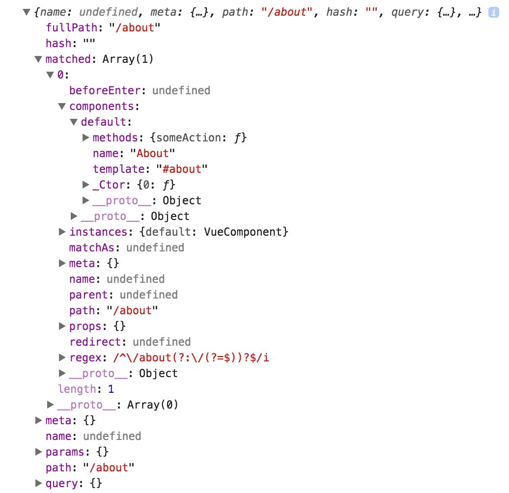
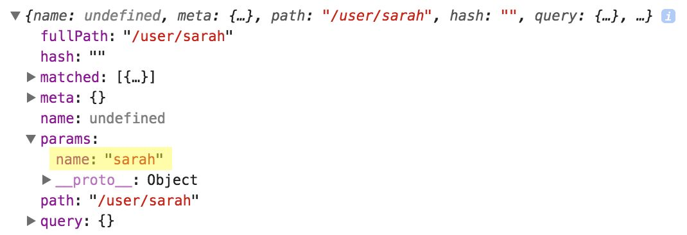
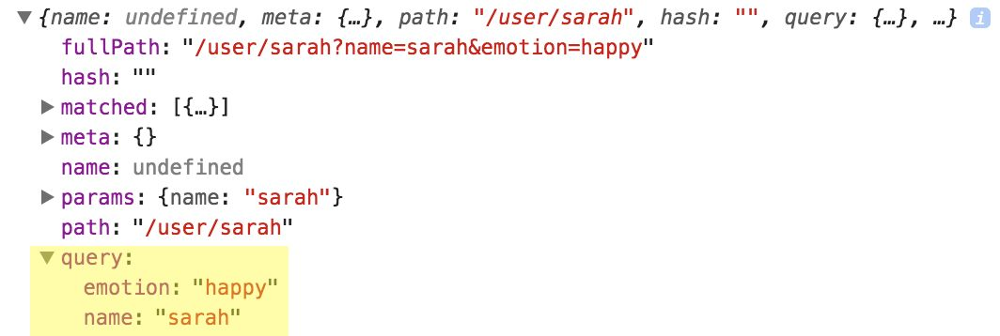

# 八、介绍 Vue 路由器并加载基于 URL 的组件

在接下来的几章和本书的最后一节，我们将创建一个商店界面。这个商店将结合我们到目前为止所学的一切，同时引入更多的技术、插件和功能。我们将从 CSV 文件中检索产品列表，显示它们及其变体，并按制造商或标签过滤产品。我们还将研究如何创建一个产品详细信息视图，并允许用户在他们的在线购物篮中添加和删除产品和产品变化，如尺寸或颜色。

所有这些都将通过使用 Vue、Vuex 和一个新的 Vue 插件 Vue-router 来实现。Vue-router 用于构建**单页面应用** ( **SPAs** )并允许你将组件映射到 URL，或者用`VueRouter`术语来说，路由和路径。这是一个非常强大的插件，可以处理 URL 处理所需的大量复杂细节。

本章将涵盖:

*   初始化 Vue 路由器及其选项
*   使用 Vue 路由器创建链接
*   基于 URL 创建动态路由以更新视图
*   在 URL 中使用 props
*   嵌套和命名路线
*   如何使用 Vue-router 以编程方式导航


# 安装和初始化 Vue 路由器

类似于我们如何将 Vue 和 Vuex 添加到我们的应用中，你可以直接从 unpkg 中包含这个库，或者到下面的 URL 为自己下载一个本地副本:[https://unpkg.com/Vue-router](https://unpkg.com/vue-router)。将 JavaScript 和 Vue 以及应用的 JavaScript 一起添加到新的 HTML 文档中。创建一个应用容器元素，也就是您的视图。在下面的例子中，我将 Vue-router JavaScript 文件保存为`router.js`:

```js
<!DOCTYPE html>
<html>
<head>
  
</head>
<body>
  <div id="app"></div>

  <script type="text/javascript" src="js/vue.js"></script>
  <script type="text/javascript" src="js/router.js"></script>
  <script type="text/javascript" src="js/app.js"></script>
</body>
</html>
```

在您的应用中初始化一个新的 Vue 实例 JavaScript:

```js
new Vue({
  el: '#app'
});
```

我们现在准备添加`VueRouter`并利用它的力量。但是，在此之前，我们需要创建一些非常简单的组件，我们可以根据 URL 加载和显示这些组件。因为我们要用路由器加载组件，所以我们不需要用`Vue.component`注册它们，而是用与 Vue 组件相同的属性创建 JavaScript 对象。

在第一个练习中，我们将创建两个页面——主页和关于页面。在大多数网站上都可以找到，这些应该可以帮助你了解什么在何时何地被加载。在您的 HTML 页面中创建两个模板供我们使用:

```js
<script type="text/x-template" id="homepage">
  <div>
    <h1>Hello &amp; Welcome</h1>
    <p>Welcome to my website. Feel free to browse around.</p>
  </div>
</script>

<script type="text/x-template" id="about">
  <div>
    <h1>About Me</h1>
    <p>Lorem ipsum dolor sit amet, consectetur adipiscing elit. Vivamus sed metus magna. Vivamus eget est nisi. Phasellus vitae nisi sagittis, ornare dui quis, pharetra leo. Nullam eget tellus velit. Sed tempor lorem augue, vitae luctus urna ultricies nec. Curabitur luctus sapien elit, non pretium ante sagittis blandit. Nulla egestas nunc sit amet tellus rhoncus, a ultrices nisl varius. Nam scelerisque lacus id justo congue maximus. Etiam rhoncus, libero at facilisis gravida, nibh nisi venenatis ante, sit amet viverra justo urna vel neque.</p>
    <p>Curabitur et arcu fermentum, viverra lorem ut, pulvinar arcu. Fusce ex massa, vehicula id eros vel, feugiat commodo leo. Etiam in sem rutrum, porttitor velit in, sollicitudin tortor. Interdum et malesuada fames ac ante ipsum primis in faucibus. Donec ac sapien efficitur, pretium massa at, vehicula ligula. Vestibulum turpis quam, feugiat sed orci id, eleifend pretium urna. Nullam faucibus arcu eget odio venenatis ornare.</p>
  </div>
</script>
```

Don't forget to encapsulate all your content in one "root" element (represented here by the wrapping `<div>` tags). You also need to ensure you declare the templates *before* your application JavaScript is loaded.

我们已经创建了一个主页模板，带有`homepage`的`id`和一个关于页面，包含一些来自 *lorem ipsum* 的占位符文本，带有`about`的`id`。在 JavaScript 中创建引用这两个模板的两个组件:

```js
const Home = {
  template: '#homepage'
};

const About = {
  template: '#about'
};
```

下一步是给路由器一个占位符来呈现视图中的组件。这是通过使用定制的`<router-view>` HTML 元素来完成的。使用该元素可以控制内容的呈现位置。它允许我们在应用视图中有一个页眉和页脚，而不需要处理混乱的模板或包含组件本身。

在你的应用中添加一个`header`、`main`和`footer`元素。页眉给自己一个 logo，页脚给自己一个演职员表；在`main` HTML 元素中，放置`router-view`占位符:

```js
<div id="app">
  <header>
    <div>LOGO</div>
  </header>

  <main>
    <router-view></router-view>
  </main>

  <footer>
    <small>© Myself</small>
  </footer>
</div>
```

除了`router-view`之外，app 视图中的所有内容都是可选的，但是它让您了解如何将路由器 HTML 元素实现到站点结构中。

下一步是初始化 Vue 路由器，并指示 Vue 使用它。创建一个新的`VueRouter`实例，并将其添加到`Vue`实例中——类似于我们在上一节中添加`Vuex`的方式:

```js
const router = new VueRouter();

new Vue({
  el: '#app',

  router
});
```

我们现在需要告诉路由器我们的路由(或路径)，以及当它遇到每条路由时应该加载什么组件。在 Vue-router 实例中创建一个对象，键为`routes`，值为数组。该数组需要为每条路线包含一个对象:

```js
const router = new VueRouter({
  routes: [
    {
 path: '/',
 component: Home
 },
 {
 path: '/about',
 component: About
 }
  ]
});
```

每个路由对象包含一个`path`和`component`键。`path`是一个你想要加载`component`的 URL 的字符串。Vue-router 基于先到先得的原则提供组件。例如，如果有多条路径相同的路由，则使用遇到的第一条。确保每个路由都有一个开始斜杠，这告诉路由器它是根页面而不是子页面，我们将在本章的后面讨论子页面。

按下保存，在浏览器中查看您的应用。您应该会看到`Home`模板组件的内容。如果您观察 URL，您会注意到在 page load 中，一个散列和正斜杠(`#/`)被附加到路径上。这是路由器创建浏览组件和利用地址栏的方法。如果您将其更改为您的第二条路线的路径，`#/about`，您将会看到`About`组件的内容。

Vue-router 还能够使用 JavaScript 历史 API 来创建更漂亮的 URL。例如，`yourdomain.com/index.html#about`会变成 `yourdomain.com/about`。这是通过将`mode: 'history'`添加到您的`VueRouter`实例:来激活的

```js
const router = new VueRouter({
  mode: 'history',

  routes: [
    {
      path: '/',
      component: Home
    },
    {
      path: '/about',
      component: About
    }
  ]
});
```

然而，它还需要一些服务器配置来捕捉所有请求并将它们重定向到您的`index.html`页面，这超出了本书的范围，但在 Vue-router 文档中有完整的概述。


# 更改 Vue 路由器的文件夹

有些情况下，您可能希望将 Vue 应用放在网站的子文件夹中。在这种情况下，您需要声明项目的基本文件夹，这样 Vue-router 就可以构建并监听正确的 URL。

例如，如果您的应用基于一个`/shop/`文件夹，您可以在 Vue-router 实例上使用`base`参数来声明它:

```js
const router = new VueRouter({
  base: '/shop/',

  routes: [
    {
      path: '/',
      component: Home
    },
    {
      path: '/about',
      component: About
    }
  ]
});
```

这个值在开头和结尾都需要斜杠。

除了`base`之外，Vue-router 还有其他几个配置选项——非常值得熟悉它们，因为它们可能会解决您以后遇到的问题。


# 链接到不同的路线

路由器按预期工作后，我们现在可以继续在应用中添加链接，允许用户浏览网站。链接可以通过两种方式实现:我们可以使用传统的`<a href="#/about">`标签，或者我们可以利用路由器`<router-link to="/about">`提供的新 HTML 元素。当使用 router-link 元素时，它的工作方式与`<a>`标签相同，事实上，当在浏览器中运行时，它会被转换成一个标签，但是允许更多的定制和与路由器的集成。

强烈建议尽可能使用`router-link`元素，因为它比标准链接有几个优点:

*   **模式变化**:第一个优势与路由器的`mode` 挂钩。使用路由器链接可以让你改变路由器的模式，比如从哈希到历史，而不必改变应用中的每个链接。
*   **CSS 类**:使用路由器链接的另一个好处是 CSS 类可以应用于“树”中的活动链接和当前正在浏览的页面。树中的链接是父页面，也包括根页面(例如，任何到“`/`”的链接将总是具有活动类)。这是使用路由器的最大好处之一，因为手动添加和删除这些类需要复杂的编码。这些类可以被定制，我们将在后面完成。
*   **URL 参数和命名路由**:使用 router 元素的另一个优点是它比使用命名路由和传递 URL 参数更强大。这进一步允许您对页面的 URL 有一个真实的来源，并使用名称和快捷方式来引用路由。这方面的更多内容将在本章后面介绍。

将链接添加到视图中的页面，以便您可以在页面之间导航。在网站的`<header>`中，创建一个包含无序列表的新的`<nav>`元素。对于每个页面，添加一个带有`router-link`元素的新列表项。给链接路径添加一个`to`属性:

```js
<nav>
  <ul>
    <li>
      <router-link to="/">Home</router-link>
    </li>
    <li>
      <router-link to="/about">About</router-link>
    </li>
  </ul>
</nav>
```

在浏览器中查看应用应该会显示您的两个链接，允许您在两个内容页面之间切换。您还会注意到，通过单击链接，URL 也会更新。

如果你用浏览器的 HTML 检查器检查链接，你会注意到 CSS 类的变化。主页链接总是有一个的类，这是因为它本身是活动的，或者它有一个活动的子链接，比如 About 页面。当您在两个页面之间导航时，会添加和删除另一个 CSS 类— `router-link-exact-active`。此 *仅* 应用于当前活动页面上的链接。

让我们定制应用于视图的类。在 JavaScript 中初始化路由器，并向对象添加两个新键- `linkActiveClass`和`linkExactActiveClass`:

```js
const router = new VueRouter({
  routes: [
    {
      path: '/',
      component: Home
    },
    {
      path: '/about',
      component: About
    }
  ],

  linkActiveClass: 'active',
 linkExactActiveClass: 'current'
});
```

这些键应该是不言自明的，但是`linkExactActiveClass`应用于当前页面，即正在查看的页面，而`linkActiveClass`是当页面或其子页面处于活动状态时应用的类。


# 链接到子路线

有时你可能想有链接到孩子的网页。比如`/about/meet-the-team`。幸运的是，不需要做太多的工作就可以完成。在`routes`数组中创建一个新对象，指向一个带有模板的新组件:

```js
const router = new VueRouter({
  routes: [
    {
      path: '/',
      component: Home
    },
    {
      path: '/about',
      component: About
    },
    {
 path: '/about/meet-the-team',
 component: MeetTheTeam
 }
  ],

  linkActiveClass: 'active',
  linkExactActiveClass: 'current'
});  
```

当导航到这个页面时，您会注意到 Home 和 About 链接都有`active`类，而我们创建的`current`类也没有。如果你要在导航中创建一个到这个页面的链接，一个`current`类将被应用到这个页面。


# 带参数的动态路线

Vue 路由器很容易让你拥有动态网址。动态 URL 允许您在使用相同模板的同时使用相同的组件来显示不同的数据。这方面的一个例子是一家商店，所有的分类页面看起来都一样，但根据 URL 显示不同的数据。另一个例子是产品详细信息页面——您不希望为每个产品都创建一个组件，而是使用一个带有 URL 参数的组件。

URL 参数可以出现在路径中的任何地方，可以有一个或多个。每个参数都分配了一个键，因此可以一致地创建和访问它。我们将在[第 9 章](part0156.html#4KONO0-985bf4ae118d4f62b18ae64204cb251c)、*中更详细地讨论动态路由和参数使用 Vue-Router 动态路由加载数据*。现在，我们将构建一个基本示例。

在我们开始创建组件之前，让我们检查一个新的可用变量— `this.$route`。与我们使用 Vuex 访问全局存储类似，这个变量允许我们访问大量关于路由、URL 和参数的信息。

在您的 Vue 实例中，作为测试，添加一个`mounted()`函数。在`console.log`内，插入`this.$route`参数:

```js
new Vue({
  el: '#app',

  router,
  mounted() {
 console.log(this.$route);
 }
});
```

如果您打开浏览器并查看开发人员工具，您应该会看到一个对象正在输出。查看这个对象会显示一些信息，比如路径和与当前路径匹配的组件。前往`/about` URL 将显示关于该对象的不同信息:



让我们创建一个使用该对象参数的组件。在路线数组中创建一个新对象:

```js
const router = new VueRouter({
  routes: [
    {
      path: '/',
      component: Home
    },
    {
      path: '/about',
      component: About
    },
    {
 path: '/user/:name',
 component: User
 }
  ],

  linkActiveClass: 'active',
  linkExactActiveClass: 'current'
}); 
```

您会注意到这个路径的不同之处在于路径中的冒号在`name`之前。这告诉 Vue-router URL 的这一部分是动态的，但是这一部分的变量名是`name`。

现在创建一个名为`User`的新组件，并为它创建一个模板。对于本例，我们的模板将是内联的，我们将使用 ES2015 模板语法。这使用反斜线，并允许将变量和新行直接传递到模板中，而无需对它们进行转义:

```js
const User = {
  template: `<h1>Hello {{ $route.params.name }}</h1>`
};
```

模板中输出的变量来自全局路由器实例，是参数对象中的`name`变量。在`routes`数组中，变量`name`引用路由路径中冒号前面的变量。在组件模板中，我们也可以从`$route`中省略`this`变量。

回到你的浏览器，在你的网址末尾输入`#/user/sarah`。你应该会在网页的主体部分看到你好，莎拉。查看 JavaScript 浏览器控制台，您应该看到`params`对象中有一个`name: sarah`的键/值对:



这个变量在组件本身中也是可用的。例如，如果我们想将用户名的第一个字母大写，我们可以创建一个计算变量，它接受 route 参数并对其进行转换:

```js
const User = {
  template: `<h1>Hello {{ name }}</h1>`,

  computed: {
 name() {
 let name = this.$route.params.name;
 return name.charAt(0).toUpperCase() + name.slice(1);
 }
 }
};
```

如果您不熟悉前面的代码是做什么的，它会将字符串的第一个字符变成大写。然后，它在第一个字符(即单词的其余部分)之后拆分字符串，并将其追加到大写字母上。

添加这个`computed`功能并刷新应用将产生你好莎拉。

如前所述，路由可以接受任意多的参数，并且可以用静态或动态变量分隔。

将路径更改为以下内容(同时保持组件名称不变):

```js
/:name/user/:emotion
```

意味着您需要转到`/sarah/user/happy`来查看用户组件。然而，你可以使用一个名为`emotion`的新参数，这意味着你可以使用下面的模板来渲染的 阿拉很开心！:

```js
const User = {
  template: `<h1>{{ name }} is {{ $route.params.emotion }}</h1>`,

  computed: {
    name() {
      let name = this.$route.params.name;
      return name.charAt(0).toUpperCase() + name.slice(1);
    }
  }
};

const router = new VueRouter({
  routes: [
    {
      path: '/',
      component: Home
    },
    {
      path: '/about',
      component: About
    },
    {
 path: '/:name/user/:emotion',
      component: User
    }
  ],

  linkActiveClass: 'active',
  linkExactActiveClass: 'current'
});
```

在接下来的几章中，当我们建立我们的商店时，动态路线将会派上用场，因为我们将在产品和类别中使用它。


# 获取参数

除了动态路由，Vue-router 还以非常简单的方式处理获取参数。GET 参数是额外的 URL 参数，可以作为键/值对传递给网页。对于 GET 参数，第一个参数前面有一个`?`——这告诉浏览器需要参数。任何进一步的参数由一个&符号分隔。一个例子是:

```js
example.com/?name=sarah&amp;emotion=happy
```

这个 URL 将产生作为 T1 值的 T0 和作为 T3 值的 T2。它们通常用于过滤或搜索——下次你在谷歌上搜索时，看看网址，你会在地址栏中注意到`?q=Your+search+query`。

Vue router 在`this.$route`变量的`query`对象中为开发人员提供这些参数。试着在你的 URL 末尾添加`?name=sarah`,然后打开 JavaScript 开发工具。检查查询对象会显示一个以`name`为关键字、 `sarah` 为值的对象:



当我们在商店类别中构建过滤时，我们将使用查询对象。


# 使用道具

虽然在组件中直接使用路由器参数非常好，但这不是一个好的做法，因为它将组件直接绑定到路由。相反，应该使用`props`——以同样的方式，我们在本书前面的 HTML 组件中使用了它们。启用并声明后，通过 URL 传递的参数就可以使用了，就像是通过 HTML 属性传递的一样。

为您的 route 组件使用 props 是将选项和参数传递到您的 route 中的一种更好的方式，因为它有许多好处。首先，它将组件从特定的 URL 结构中分离出来——正如您将看到的，我们可以将属性直接传递给组件本身。这也有助于使您的路由组件更加清晰；传入的参数在组件本身中被清楚地布局，整个组件中的代码也更加清晰。

Props 仅适用于动态路由——GET 参数仍然可以使用前面的技术进行访问。

使用前面的例子，为`name`和`emotion`参数声明`props`。当使用带有基于 URL 的变量的 props 时，您将希望使用`String`数据类型:

```js
const User = {
  template: `<h1>{{ name }} is {{ $route.params.emotion }}</h1>`,
  props: {
 name: String,
 emotion: String
 },
  computed: {
    name() {
      let name = this.$route.params.name;
      return name.charAt(0).toUpperCase() + name.slice(1);
    }
  }
};
```

我们现在有两个可用的`this.name`——一个是通过`props`,另一个是通过计算值。然而，由于我们通过`props`获得了`this.name`和`this.emotion`，我们可以更新我们的组件来使用这些变量，而不是`$route`参数。

为了避免与属性冲突，更新要调用的计算函数`formattedName()`。我们还可以从函数中删除变量声明，因为新变量可读性更好:

```js
const User = {
  template: `<h1>{{ formattedName }} is {{ this.emotion }}</h1>`,
  props: {
    name: String,
    emotion: String
  },
  computed: {
    formattedName() {
      return this.name.charAt(0).toUpperCase() + this.name.slice(1);
    }
  }
};
```

在`props`工作之前，Vue-router 需要被告知使用特定的路由。这是在`routes`阵列中逐路由启用的，最初设置为`props: true`值:

```js
const router = new VueRouter({
  routes: [
    {
      path: '/',
      component: Home
    },
    {
      path: '/about',
      component: About
    },
    {
      path: '/:name/user/:emotion',
      component: User,
      props: true
    }
  ],

  linkActiveClass: 'active',
  linkExactActiveClass: 'current'
});
```


# 设置属性默认值

有了现在可用的路由参数`props`，我们就可以灵活地轻松创建一个缺省值。如果我们想让一个参数可选，我们需要添加几个`if()`语句来检查变量的存在。

然而，使用 props，我们可以像前面一样声明默认值。为情绪变量添加默认值:

```js
const User = {
  template: `<h1>{{ formattedName }} is {{ this.emotion }}</h1>`,
  props: {
    name: String,
    emotion: {
 type: String,
 default: 'happy'
 }
  },
  computed: {
    formattedName() {
      return this.name.charAt(0).toUpperCase() + this.name.slice(1);
    }
  }
};
```

现在，我们可以在路由器中创建一条新路由，它使用相同的组件，但没有最终变量。不要忘记启用新路线的`props`:

```js
const router = new VueRouter({
  routes: [
    {
      path: '/',
      component: Home
    },
    {
      path: '/about',
      component: About
    },
    {
 path: '/:name/user',
 component: User,
 props: true
 }, 
    {
      path: '/:name/user/:emotion',
      component: User,
      props: true
    }
  ],

  linkActiveClass: 'active',
  linkExactActiveClass: 'current'
});
```

现在，通过访问`/sarah/user`，我们应该看到声明莎拉很幸福的文本。


# 使用静态道具

除了布尔值之外，route 中的 props 参数还可以接受一个带有要传递的 props 列表的对象。这允许您利用相同的组件并根据 URL 改变其状态，而不需要通过路径传递变量例如，如果您想要激活或停用模板的一部分。

When passing the props object in via the URL, it overwrites the whole props object, meaning you either have to declare none or all of them. The props variables will also take priority over the dynamic, URL-based variables.

更新新的`/:name/user`路径，将`props`包含在路径中——从路径中删除`:name`变量，这样它就变成了`/user`:

```js
const router = new VueRouter({
  routes: [
    {
      path: '/',
      component: Home
    },
    {
      path: '/about',
      component: About
    },
    {
      path: '/user',
      component: User,
      props: {
 name: 'Sarah',
 emotion: 'happy'
 }
    }, 
    {
      path: '/:name/user/:emotion',
      component: User,
      props: true
    }
  ],

  linkActiveClass: 'active',
  linkExactActiveClass: 'current'
});
```

导航到`/user`应该会显示与我们之前看到的相同的句子。传递`props`“幕后”(不使用 URL)在某些情况下是理想的，在这些情况下，您可能不希望用户共享特定的 URL 或基于容易改变的参数改变应用的状态。


# 嵌套路由

嵌套路由不同于子路由，因为它们存在于已经匹配路由开始部分的组件中的*。这允许您在现有视图中显示不同的内容。*

Twitter 就是一个很好的例子。如果你访问一个 Twitter 用户的个人资料页面，你可以看到他们在关注谁，谁在关注他们，以及他们创建了什么列表。如果您在浏览页面时观察 URL，您会注意到一个重复出现的模式:用户名后跟不同的页面。嵌套路由和子路由的区别在于，嵌套路由允许您在不同的子页面中保持相同的组件(例如，标题和侧栏)。

这样做的好处是用户可以收藏和分享链接，这使得页面更容易访问，并且有利于搜索引擎优化。使用简单的切换框或标签框在视图中显示不同的内容，这些优势都不容易实现。

要将 Twitter 模式复制到 Vue 路由中，应该如下所示:

```js
https://twitter.com/:user/:page
```

如果我们使用前面的 route 方法创建它，我们将不得不为每个页面构建组件，这些组件在其模板的侧边栏中包含标题和用户信息——如果您需要更新代码，这将是一件痛苦的事情！

让我们为 About 页面创建一些嵌套路线。我们不会在商店应用中使用嵌套路线，但了解 Vue 路由器的功能很重要。

创建两个新组件— `AboutContact`，它将显示联系信息，和`AboutFood`，一个组件将详细描述您喜欢吃的食物！虽然不是必需的，但是在组件名称中保留对父组件(在本例中是 About)的引用是一个好主意——这将在您以后查看这些组件时将它们联系在一起！给每个组件一个带有固定内容的模板:

```js
const AboutContact = {
  template: `<div>
    <h2>This is some contact information about me</h2>
    <p>Find me online, in person or on the phone</p>
  </div>`
};

const AboutFood = {
  template: `<div>
    <h2>Food</h2>
    <p>I really like chocolate, sweets and apples.</p>
  </div>`
};
```

下一步是在您的`#about`模板中为要渲染的嵌套路线创建占位符。该元素与我们之前见过的一个元素完全相同——`<router-view>`元素。为了证明它可以放在任何地方，请将它添加到模板中的两个段落之间:

```js
<script type="text/x-template" id="about">
  <div>
    <h1>About Me</h1>
    <p>Lorem ipsum dolor sit amet, consectetur adipiscing elit. Vivamus sed metus magna. Vivamus eget est nisi. Phasellus vitae nisi sagittis, ornare dui quis, pharetra leo. Nullam eget tellus velit. Sed tempor lorem augue, vitae luctus urna ultricies nec. Curabitur luctus sapien elit, non pretium ante sagittis blandit. Nulla egestas nunc sit amet tellus rhoncus, a ultrices nisl varius. Nam scelerisque lacus id justo congue maximus. Etiam rhoncus, libero at facilisis gravida, nibh nisi venenatis ante, sit amet viverra justo urna vel neque.</p>

    <router-view></router-view>

    <p>Curabitur et arcu fermentum, viverra lorem ut, pulvinar arcu. Fusce ex massa, vehicula id eros vel, feugiat commodo leo. Etiam in sem rutrum, porttitor velit in, sollicitudin tortor. Interdum et malesuada fames ac ante ipsum primis in faucibus. Donec ac sapien efficitur, pretium massa at, vehicula ligula. Vestibulum turpis quam, feugiat sed orci id, eleifend pretium urna. Nullam faucibus arcu eget odio venenatis ornare.</p>
  </div>
</script>
```

在浏览器中查看“关于”页面不会呈现任何内容，也不会破坏应用。下一步是将这些组件的嵌套路由添加到路由器中。我们没有将它们添加到顶层的`routes`数组中，而是在`/about`路线中创建了一个数组——关键字为`children`。该数组的语法是主数组的精确副本，即 route 对象的数组。

为包含`path`和`component`键的每个`routes`添加一个对象。关于路径需要注意的是，如果您希望将路径添加到父路径的末尾，它不应该以`/`开头。

例如，如果您希望 URL 为`/about/contact`来呈现`AboutContact`组件，那么您应该使 route 组件如下所示:

```js
const router = new VueRouter({
  routes: [
    {
      path: '/',
      component: Home
    },
    {
      path: '/about',
      component: About,
      children: [
 {
 path: 'contact', 
 component: AboutContact
 }, 
 {
 path: 'food', 
 component: AboutFood
 }
 ]
    }
  ],

  linkActiveClass: 'active',
  linkExactActiveClass: 'current'
});
```

但是，如果您希望 URL 只是简单的`/contact`，但是仍然在`About`组件中呈现`AboutContact`组件，您可以添加前面的斜杠。尝试查看不带斜线的应用，然后添加斜线，看看有什么不同。如果你想在没有 URL 第二部分的情况下显示父路径，你可以使用一个空路径— `path: ''`。

现在，让它没有斜线，并添加前面的`children`数组。打开浏览器，导航到“关于”页面。将`/contact`或`/food`添加到 URL 的末尾，注意新的内容出现在您之前添加到模板的`<router-link>`元素的位置。

可以从任何地方创建到这些组件的链接，与链接主页和关于页面的方式相同。你可以将它们添加到`about`模板中，这样它们只在导航到该页面时才会出现，或者将它们添加到应用视图的主导航中。


# 创建 404 页面

当建立一个应用或网站时，尽管所有的意图都是好的，但问题、争论和错误还是会发生。出于这个原因，在适当的位置放置错误页面是一个好主意。最常见的页面是 404 页面——当链接不正确或页面移动时显示的消息。404 是未找到页面的官方 HTTP 代码。

如前所述，Vue-router 将根据先来先服务的原则匹配路由。我们可以通过使用通配符(`*`)作为最后一条路径来利用这一点。由于通配符匹配每条路由的*，因此只有那些与之前的路由不匹配的 URL 才会被这条路由捕获。*

用一个简单的模板创建一个名为`PageNotFound`的新组件，并添加一个使用通配符作为路径的新路由:

```js
const PageNotFound = {
 template: `<h1>404: Page Not Found</h1>`
};

const router = new VueRouter({
  routes: [
    {
      path: '/',
      component: Home
    },
    {
      path: '/about',
      component: About,
      children: [
        {
          path: 'contact', 
          component: AboutContact
        }, 
        {
          path: 'food', 
          component: AboutFood
        }
      ]
    },
 {
 path: '*', 
 component: PageNotFound
 }
  ],

  linkActiveClass: 'active',
  linkExactActiveClass: 'current'
});
```

在浏览器中打开应用，在 URL 的末尾键入任何内容(除了`about`)，然后按*回车*——你应该会看到 404 标题。

Although this is simulating a page not found request, it is not actually sending the correct HTTP code to the browser. If you are using a Vue web app in production it is a good idea to set up server-side error checking, so in the instance of an incorrect URL the browser can be correctly notified.

# 命名零部件、管线和视图

使用`Vue-router`时，并不要求为路线和组件添加名称，但这样做是一个好习惯。


# 命名组件

带有名称的组件允许您更容易地调试错误。在 Vue 中，当组件抛出 JavaScript 错误时，它会给出该组件的名称，而不是将`Anonymous`列为组件。

例如，如果您试图在 food 组件中输出一个变量`{{ test }}`,而这个变量是不可用的。默认情况下，JavaScript 控制台错误如下所示:


注意堆栈中的两个`<Anonymous>`组件。

通过给我们的组件添加名称，我们可以很容易地识别出问题所在。以下示例中的 `About` 和 `AboutFood` 组件都添加了名称:


您可以很容易地看到错误出现在`<AboutFood>`组件中。

向组件添加名称就像向对象添加名称键一样简单，名称就是值。这些名称遵循与创建 HTML 元素组件时相同的规则:没有空格，但允许使用连字符和字母。为了让我快速识别代码，我选择将组件命名为与定义它的变量相同的名称:

```js
const About = {
  name: 'About',
  template: '#about'
};

const AboutFood = {
  name: 'AboutFood',
  template: `<div>
    <h2>Food</h2>
    <p>I really like chocolate, sweets and apples.</p>
  </div>`
}
```


# 命名路线

使用`VueRouter`时，您可以命名的另一个对象是路线本身。这使您能够简化路线的位置和更新路径，而无需在应用中查找和替换所有实例。

将`name`键添加到您的`routes`中，如下例所示:

```js
const router = new VueRouter({
  routes: [
    {
      path: '/',
      component: Home
    },
    {
      path: '/about',
      component: About,
      children: [
        {
          name: 'contact',
          path: 'contact', 
          component: AboutContact
        }, 
        {
          name: 'food',
          path: 'food', 
          component: AboutFood
        }
      ]
    },
    {
      path: '*', 
      component: PageNotFound
    }
  ],

  linkActiveClass: 'active',
  linkExactActiveClass: 'current'
});
```

现在，您可以在创建您的`router-link`组件时使用该名称，如下所示:

```js
<router-link :to="{name: 'food'}">Food</router-link>
```

注意`to`属性前的冒号。这确保了内容被解析为对象，而不是文字字符串。使用命名路由的另一个优点是能够将特定的属性传递给我们的动态路径。使用本章前面的例子，我们可以用编程的方式构建 URL，从路径构造中抽象出数据。这就是所谓的`routes`真正发挥作用的地方。假设我们有以下路径:

```js
{ name: 'user', path: '/:name/user/:emotion', component: User }
```

我们需要向 URL 传递一个名称和情感变量，以便组件呈现。我们可以像以前一样直接传入 URL，或者使用带有命名路由的`to`对象符号:

```js
<router-link :to="{name: 'user', params: { name: 'sarah', emotion: 'happy' }}">
  Sarah is Happy
</router-link>
```

在浏览器中查看将显示锚链接已正确生成:

```js
/sarah/user/happy
```

这给了我们使用变量重新排列 URL 的灵活性，而不需要更新应用的其余部分。如果您想在 URL 的末尾传递参数(例如，`?name=sarah`)，可以将`params`键改为`query`，因为它遵循相同的格式:

```js
<router-link :to="{name: 'user', query: { name: 'sarah', emotion: 'happy' }}">
  Sarah is Happy
</router-link>
```

由于路径被重新配置为不接受参数，它将生成以下链接:

```js
/user?name=sarah&amp;emotion=happy
```

Be careful when interchanging `params` and `query` - as they can affect whether you use `path` or `name`. When using `path`, the `params` object will be ignored, whereas the `query` one will not. To use the `params` object, you need to use a named route. Alternatively, pass the parameters into the `path` with the `$` variable.

# 命名视图

Vue router 还允许您命名视图，让您将不同的组件传递到应用的不同部分。这方面的一个例子可能是一个商店，那里有一个侧栏和主要内容区。不同的页面可能以不同的方式利用这些区域。

“关于”页面可以使用主要内容来显示“关于”内容，而使用侧边栏来显示联系人详细信息。然而，商店页面将使用主要内容来列出产品，并使用侧栏来显示过滤器。

为此，创建第二个`router-view`元素作为原始元素的兄弟元素。保留原来的属性，但是为第二个属性添加一个`name`属性，并带有适当的标题:

```js
<main>
  <router-view></router-view>
</main>

<aside>
    <router-view name="sidebar"></router-view>
</aside>
```

当在路由器实例中声明您的路由时，我们现在将使用一个新的键`components`，并删除之前的单数`component`键。它接受一个对象，该对象包含视图名和组件名的键值对。

It's advisable to leave your main route unnamed, so you don't need to update every route. If you decide to name your main route, you would be required to do this next step for every route in your app.

更新`About`路线以使用这个新的关键点，并使其成为一个对象。下一步是告诉代码每个组件的位置。

使用 default 作为键，将`About`组件设置为值。这将来自 About 组件的内容放入未命名的主组件`router-view`中。这也是使用单数`component`键的简写:

```js
const router = new VueRouter({
  routes: [
    {
      path: '/',
      component: Home
    },
    {
      path: '/about',
      components: {
 default: About
 }
    },
    {
      path: '*', 
      component: PageNotFound
    }
  ],

  linkActiveClass: 'active',
  linkExactActiveClass: 'current'
});
```

接下来，添加第二个键值，指定第二个路由器视图的名称`sidebar`。当导航到`/about` URL 时，命名您想要填充该区域的组件。为此，我们将使用 `AboutContact` 组件:

```js
const router = new VueRouter({
  routes: [
    {
      path: '/',
      component: Home
    },
    {
      path: '/about',
      components: {
        default: About,
        sidebar: AboutContact
      }
    },
    {
      path: '*', 
      component: PageNotFound
    }
  ],

  linkActiveClass: 'active',
  linkExactActiveClass: 'current'
});
```

在您的浏览器中运行应用将呈现这两个组件，联系人组件的内容出现在侧栏中。


# 以编程方式导航、重定向和添加别名

构建应用时，可能会出现需要一些不同导航技术的情况。这些可能是以编程方式导航，例如在组件或主 Vue 实例中，当用户点击特定 URL 时重定向用户，或者用不同的 URL 加载相同的组件。


# 以编程方式导航

您可能希望从代码、组件或操作中改变路径、URL 或用户流。这方面的一个例子可能是在用户添加了一个项目后将用户发送到购物篮。

为此，您可以在路由器实例上使用一个`push()`函数。push 的值可以是直接 URL 的字符串，也可以接受一个对象来传递命名路由或路由参数。`push`函数允许的内容与`router-link`元素上的`to=""`属性完全相同。例如:

```js
const About = {
  name: 'About',
  template: '#about',
  methods: {
    someAction() {
      /* Some code here */

      // direct user to contact page
      this.$router.push('/contact');
    }
  }
};
```

或者，您可以使用参数指向命名的路线:

```js
this.$router.push({name: 'user', params: { name: 'sarah', emotion: 'happy' }});
```


# 改变方向

使用`VueRouter`重定向相当简单。重定向的一个例子可能是，如果你把你的`/about`页面移动到`/about-us` URL。如果有人共享或收藏了你的链接，或者搜索引擎缓存了该 URL，你可能会希望将第一个 URL 重定向到第二个。

您可能想创建一个基本的组件，当它被创建时，使用`router.push()`函数将用户发送到新的 URL。

相反，您可以添加一个路由并在其中指定重定向:

```js
const router = new VueRouter({
  routes: [
    {
      path: '/',
      component: Home
    },
    {
 path: '/about',
 redirect: '/about-us'
 },
    {
      path: '/about-us',
      component: About
    },
    {
      path: '*', 
      component: PageNotFound
    }
  ],

  linkActiveClass: 'active',
  linkExactActiveClass: 'current'
});
```

同样，重定向键的内容可以是一个字符串或一个对象——很像`push()`函数。如上所述，如果用户访问`/about`，他们将立即被重定向到`/about-us`和显示的`About`组件。


# 别名路线

有些情况下，您可能希望在两个 URL 下显示同一个组件。虽然不建议作为标准实践，但在一些边缘情况下需要这样做。

别名关键字被添加到现有的路由中，并且只接受一个路径字符串。使用前面的例子，下面将显示`About`组件，无论用户访问的是`/about`还是`/about-us`:

```js
const router = new VueRouter({
  routes: [
    {
      path: '/',
      component: Home
    },
    {
      path: '/about',
 alias: '/about-us',
      component: About,
    },
    {
      path: '*', 
      component: PageNotFound
    }
  ],

  linkActiveClass: 'active',
  linkExactActiveClass: 'current'
});
```


# 摘要

现在，您应该熟悉 Vue-router，如何初始化它，有哪些可用选项，以及如何创建新的静态和动态路由。在接下来的几章中，我们将开始创建我们的商店，首先加载一些商店数据并创建一个产品页面。