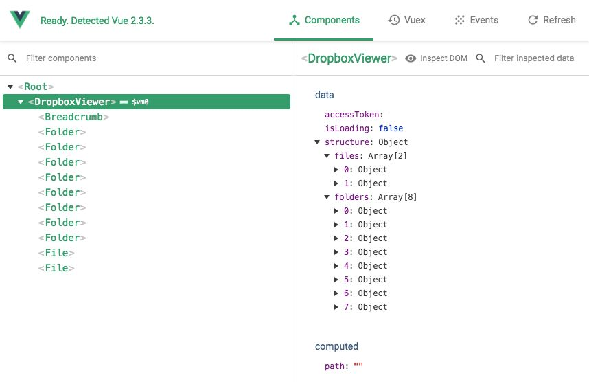
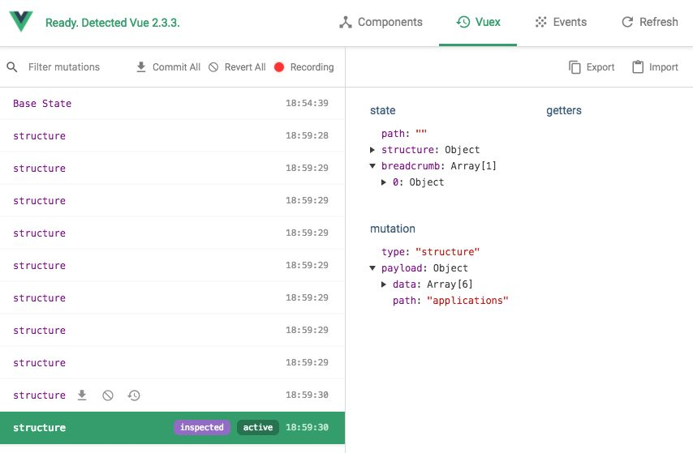

# 十二、使用 Vue 开发工具和测试您的 SPA

在过去的 11 章中，我们已经使用`Vue.js`开发了几个**单页面应用**(**spa**)。虽然开发是创建 SPA 的一大块，但是测试也是创建任何 JavaScript web 应用的重要部分。

在 Chrome 和 Firefox 中提供的 Vue 开发人员工具，提供了对在特定视图中使用的组件或 Vuex 商店的当前状态的深刻见解，以及从 JavaScript 发出的任何事件。这些工具允许您在开发时检查和验证应用中的数据，以确保一切正常。

SPA 测试的另一面是自动化测试。您为应用中的自动化任务编写的条件、规则和路线，允许您指定输出应该是什么，测试运行这些条件以验证结果是否匹配。

在本章中，我们将:

*   涵盖我们开发的应用中 Vue 开发人员工具的使用
*   概述测试工具和应用


# 使用 Vue.js 开发人员工具

Vue 开发者工具可用于 Chrome 和 Firefox，也可以从 GitHub([https://github.com/vuejs/vue-devtools](https://github.com/vuejs/vue-devtools))下载。一旦安装，它们就成为浏览器开发者工具的扩展。例如，在 Chrome 中，它们出现在审计标签之后。


只有在开发模式下使用 Vue 时，Vue 开发人员工具才有效。默认情况下，Vue 的非统一版本启用了开发模式。但是，如果您正在使用代码的生产版本，可以通过将代码中的`devtools`变量设置为`true`来启用开发工具:

```js
Vue.config.devtools = true
```

在整本书中，我们一直使用 Vue 的开发版本，所以开发工具应该可以与我们开发的所有三个 spa 一起工作。打开 Dropbox 示例并打开 Vue 开发人员工具。


# 检查 Vue 组件数据和计算值

Vue 开发人员工具对页面上使用的组件进行了很好的概述。您还可以深入组件并预览该特定实例上使用的数据。这非常适合在任何给定时间检查页面上每个组件的属性。

例如，如果我们检查 Dropbox 应用并导航到 C 组件选项卡，我们可以看到 <根> Vue 实例，并且我们可以看到 < DropboxViewer > 组件。单击此按钮将显示组件的所有数据属性，以及任何计算的属性。这让我们可以验证结构的构造是否正确，以及计算的路径属性:



深入每个组件，我们可以访问单独的数据对象和计算属性。

使用 Vue 开发人员工具来检查您的应用是在创建应用时验证数据的一种更有效的方式，因为它省去了放置几个`console.log()`语句的麻烦。


# 观察 Vuex 突变和时间旅行

导航到下一个选项卡， Vuex ，允许我们实时观察商店发生的变化。每次触发一个突变，都会在左侧面板中创建一个新行。这个元素允许我们查看正在发送的数据，以及 Vuex 存储在数据提交前后的样子。

它还为您提供了几个恢复、提交和时间旅行到任意点的选项。加载 Dropbox 应用，几个结构突变立即出现在左侧面板中，列出了突变名称和发生的时间。这是预缓存文件夹的代码。点击每一个都会显示 Vuex 存储状态，以及包含已发送有效载荷的突变。在之后，状态显示为*,有效载荷已发送且突变已提交。要预览发生*突变前*的状态，请选择前面的选项:*



在每个条目上，在突变名称旁边，您会注意到三个符号，它们允许您执行几个操作，并在浏览器中直接对商店进行突变:

*   **提交该突变**:这允许您提交到该点为止的所有数据。这将*从开发工具中移除*所有的突变，并将基础状态更新至此。如果您希望跟踪发生的几个突变，这是很方便的。
*   **恢复该突变**:这将撤销该突变以及该点之后的所有突变。这允许您一次又一次地执行相同的操作，而不用按刷新或丢失当前位置。例如，在我们的商店应用中将产品添加到购物篮时，会发生突变。使用此功能，您可以从购物篮中移除产品，并撤销任何后续的变更，而无需离开产品页面。
*   **时间旅行到这个状态**:这允许你预览特定突变处的应用和状态，而不恢复在所选点之后发生的任何突变。

“突变”选项卡还允许您提交或还原左侧面板顶部的所有突变。在右侧面板中，您还可以导入和导出存储状态的 JSON 编码版本。当您想要重新测试几个环境和实例而不必重复几个步骤时，这尤其方便。


# 预览事件数据

Vue 开发者工具的 E 通风口标签的工作方式与 Vuex 标签类似，允许你检查整个应用发出的任何事件。我们的 Dropbox 应用不使用事件，所以打开我们在本书的[第 2 章](part0031.html#TI1E0-985bf4ae118d4f62b18ae64204cb251c)、*显示、循环、搜索和过滤数据*和[第 3 章](part0051.html#1GKCM0-985bf4ae118d4f62b18ae64204cb251c)、*优化我们的应用和使用组件显示数据*中创建的人员过滤应用。

每次更新过滤器类型时，更改此应用中的过滤器都会发出一个事件，以及过滤器查询:


左侧面板再次列出了事件的名称和发生时间。右侧面板包含关于事件的信息，包括其组件来源和有效负载。这些数据允许您确保事件数据符合您的预期，如果不符合，则帮助您定位事件的触发位置。

Vue 开发工具是非常宝贵的，尤其是当您的 JavaScript 应用变得更大更复杂时。打开我们开发的 shop SPA，检查各种组件和 Vuex 数据，了解这个工具如何帮助您创建应用，只提交它们需要的突变并发出它们必须的事件。


# 测试您的水疗中心

大多数 Vue 测试套件都围绕着掌握命令行知识和使用 **CLI** ( **命令行界面**)创建 Vue 应用。除了用前端兼容的 JavaScript 创建应用，Vue 还有一个 CLI，允许您使用基于组件的文件创建应用。这些是扩展名为`.vue`的文件，包含模板 HTML 以及组件所需的 JavaScript。它们还允许您创建只适用于该组件的 CSS 样式。如果您选择使用 CLI 创建应用，那么您在本书中学到的所有理论和大量实践知识都可以轻松移植。


# 命令行单元测试

除了组件文件，Vue CLI 还允许您更轻松地集成命令行单元测试，如 Jest、Mocha、Chai 和 test cafe([https://testcafe.devexpress.com/](https://testcafe.devexpress.com/))。例如，TestCafe 允许您指定几种不同的测试，包括检查内容是否存在，以及单击按钮来测试功能。TestCafe 测试检查我们的第一个应用中的过滤组件是否包含工作*字段*的一个例子是:

```js
test('The filtering contains the word "filter"', async testController => {
  const filterSelector = await new Selector('body > #app > form > label:nth-child(1)');

  await testController.expect(paragraphSelector.innerText).eql('Filter');
});
```

该测试将等同于`true`或`false`。单元测试通常与组件本身一起编写，允许组件被重用和隔离测试。这允许您检查外部因素对您的测试输出没有影响。

大多数命令行 JavaScript 测试库都会集成 vue . js；在令人敬畏的 Vue GitHub 资源库([https://github.com/vuejs/awesome-vue#test](https://github.com/vuejs/awesome-vue#test))中有一个很棒的列表。


# 浏览器自动化

使用命令行单元测试的替代方法是用测试套件自动化浏览器。这种测试仍然是通过命令行触发的，但它不是直接与您的 Vue 应用集成，而是在浏览器中打开页面，像用户一样与之交互。做这件事的一个流行工具是`Nightwatch.js`([http://nightwatchjs.org/](http://nightwatchjs.org/))。

您可以使用该套件打开您的商店，与过滤组件或产品列表进行交互，并比较结果。测试是用非常口语化的英语编写的，并且不限于与被测试的站点在同一个域名或文件网络上。该库也是语言不可知的——适用于任何网站，不管它是用什么构建的。

`Nightwatch.js`在他们的网站上给出的例子是为了打开谷歌，确保谷歌搜索`rembrandt van rijn` 的第一个结果是维基百科条目:

```js
module.exports = {
  'Demo test Google' : function (client) {
    client
      .url('http://www.google.com')
      .waitForElementVisible('body', 1000)
      .assert.title('Google')
      .assert.visible('input[type=text]')
      .setValue('input[type=text]', 'rembrandt van rijn')
      .waitForElementVisible('button[name=btnG]', 1000)
      .click('button[name=btnG]')
      .pause(1000)
      .assert.containsText('ol#rso li:first-child',
        'Rembrandt - Wikipedia')
      .end();
  }
};
```

夜视仪的替代品是硒([http://www.seleniumhq.org/](http://www.seleniumhq.org/))。Selenium 的优势在于它有一个 Firefox 扩展，允许您可视化地创建测试和命令。

测试，尤其是对于大型应用，是至关重要的——尤其是在将应用部署到开发环境时。无论您选择单元测试还是浏览器自动化，都有大量关于这个主题的文章和书籍。


# 摘要

在这本书里，我们介绍了几种技术，并学习了如何使用 Vue 和官方的 Vue 插件。我们讨论了如何构建三个单页面应用，同时讨论了不同的方法和途径。

在本书的第一部分，我们介绍了如何初始化 Vue 实例。我们探讨了数据循环以及如何创建用户界面来过滤显示的数据。我们还研究了如何有条件地在每行上呈现 CSS 类。

然后，我们继续将 Vuex 集成到我们的应用中，并与 API 进行通信，Dropbox 就是一个例子。我们研究了访问数据并将其存储在本地。这有助于提高应用的性能和速度，改善用户体验。

最后，我们创建了一个模拟商店。使用来自 Shopify CSV 文件的真实数据，我们创建了一个允许单独查看产品的应用。我们还创建了一个可以过滤和排序的类别列表页面，允许用户明确找到他们想要的产品。为了完成体验，我们构建了一个可编辑的购物篮、结账和订单确认屏幕。

在这一章中，我们讲述了 Vue 开发工具的使用，以及如何构建测试。这就完成了用`Vue.js`构建单页面应用的过程。