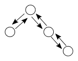
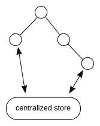
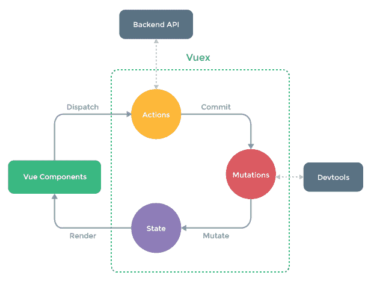
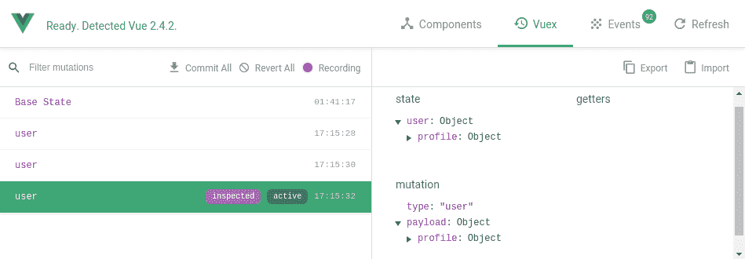
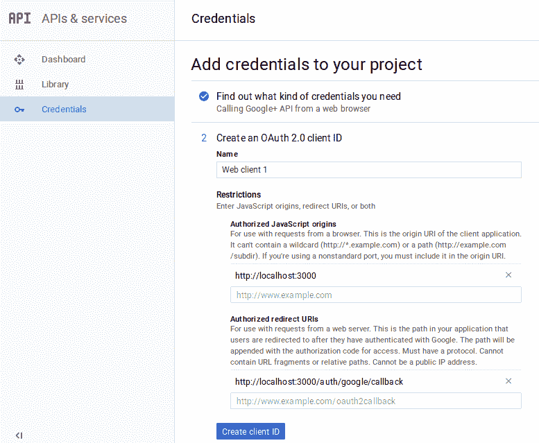
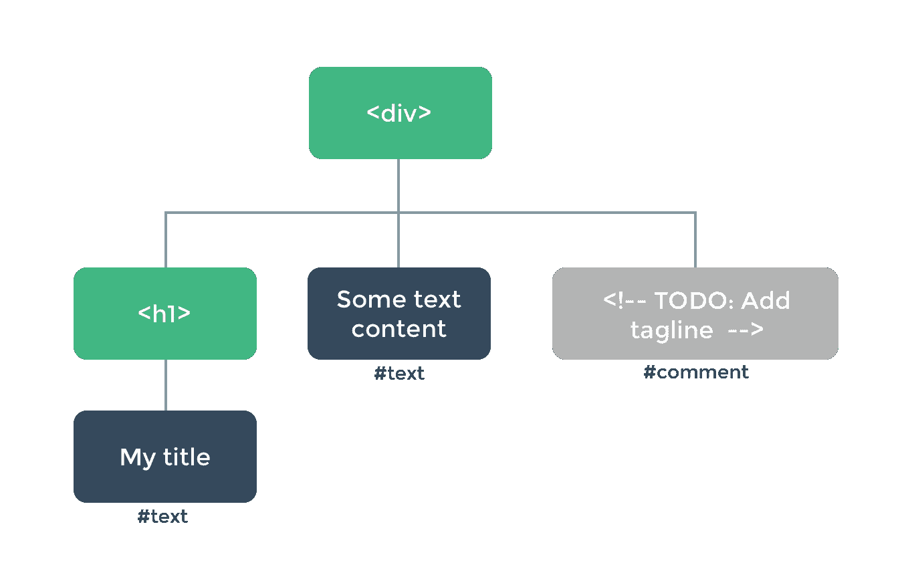
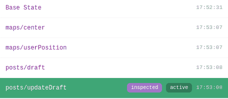
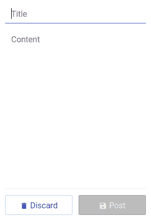
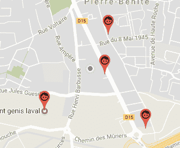

# 六、项目 4——地理定位博客

在本章中，我们将构建第四个应用程序。我们将介绍新的主题，例如：

*   使用官方 Vuex 库在集中存储中管理应用程序的状态
*   使用 Google OAuth API 将用户连接到应用程序
*   将谷歌地图集成到我们的应用程序和`vue-googlemaps`第三方库
*   渲染函数和 JSX
*   功能组件——制造更轻更快的组件

该应用程序将是一个地理定位博客，主要显示一个大地图，用户将在其中添加博客帖子。以下是该应用程序的主要功能：

*   登录页面将要求用户使用其 Google 帐户进行身份验证
*   主视图将是嵌入应用程序中的谷歌地图，每个帖子都有一个标记
*   单击标记将在右侧的侧面板中显示内容，包括位置描述、帖子、类似计数器和注释列表
*   单击地图上的任何其他位置将在侧面板中显示一个表单，以便用户可以在此位置创建新帖子
*   应用程序的顶部栏将显示当前用户的头像和姓名，其中一个按钮用于将地图置于其位置的中心，另一个按钮用于注销

最终申请如下所示：


# googleauth 与状态管理

在第一节中，我们将创建第一个 Vuex 存储，以帮助我们管理应用程序的状态。我们将使用它来存储通过 Google OAuth API 登录的当前用户，该 API 允许他们使用其 Google 帐户连接到我们的应用程序。

# 项目设置

首先，让我们建立新项目的基本结构。我们将继续使用路由和[第 5 章](5.html)、*项目 3-支持中心*的几个部分。

# 创建应用程序

在本节中，我们将为地理定位博客设置基本应用程序结构。

1.  就像我们在[第 5 章](5.html)、*项目 3-支持中心*中所做的那样，我们将用`vue-init`初始化一个 Vue 项目，并安装巴别塔、路由和触控笔包：

```js
 vue init webpack-simple geoblog</strong>
 **cd geoblog**
 **npm install**
 **npm install --save vue-router babel-polyfill**
 **npm install --save-dev stylus stylus-loader babel-preset-vue**
```

Don't forget to add the `"vue"` preset in the `.babelrc` file.

2.  然后删除`src`目录的内容。
3.  我们将重用我们在[第 5 章](5.html)、*项目 3-支持中心*中制作的`$fetch`插件，所以在新项目中也复制`src/plugins/fetch.js`文件。
4.  在`src`文件夹中，添加启动我们应用程序的`main.js`文件，就像我们在[第 5 章](5.html)、*项目 3-支持中心*中所做的那样：

```js
      import 'babel-polyfill'
      import Vue from 'vue'
      import VueFetch, { $fetch } from './plugins/fetch'
      import App from './components/App.vue'
      import router from './router'
      import * as filters from './filters'

      // Filters
      for (const key in filters) {
        Vue.filter(key, filters[key])
      }

      Vue.use(VueFetch, {
        baseUrl: 'http://localhost:3000/',
      })

      function main () {
        new Vue({
          ...App,
          el: '#app',
          router,
        })
      }

      main()
```

5.  我们仍将使用`moment.js`显示日期，因此您可以使用以下命令安装：

```js
 npm i -S moment
```

This shorter notation is equivalent to `npm install --save`. For development dependencies, you can use `npm i -D` instead of `npm install --save-dev`.

6.  在新的`src/filters.js`文件中创建与之前相同的简单日期筛选器：

```js
      import moment from 'moment'

      export function date (value) {
        return moment(value).format('L')
      }
```

7.  在`$fetch`插件中，您可以删除对`state.js`文件的引用，因为这次我们没有引用：

```js
      // Remove this line
      import state from '../state'
```

8.  此外，如果请求收到`403`HTTP 代码，我们注销用户的方式也会有所不同，因此您也可以删除相关代码：

```js
      } else if (response.status === 403) {
        // If the session is no longer valid
        // We logout
        // TODO
      } else {
```

9.  最后下载（[https://github.com/Akryum/packt-vue-project-guide/tree/master/chapter6-full/client/src/styles [T2]），并将它们放在一个[T0]目录中。](https://github.com/Akryum/packt-vue-project-guide/tree/master/chapter6-download/styles)

# 一些路由

该应用程序将有三个页面：

*   带有“使用谷歌登录”按钮的登录页面
*   主地理定位博客页面与地图
*   “未找到”页面

现在，我们将创建主组件，并使用裸组件设置这些页面：

1.  创建一个新的`src/components`文件夹，并从[第 5 章](5.html)、*项目 3-支持中心*复制`NotFound.vue`组件。
2.  然后添加带有`router-view`组件的`App.vue`文件和主触控笔文件：

```js
      <template>
        <div class="app">
          <router-view />
        </div>
      </template>

      <style lang="stylus">
      @import '../styles/main';
      </style>
```

3.  添加`GeoBlog.vue`文件，该文件目前将非常裸露：

```js
      <template>
        <div class="geo-blog">
          <!-- More to come -->
        </div>
      </template>
```

4.  使用谷歌登录按钮添加`Login.vue`文件。该按钮调用一个`openGoogleSignin`方法：

```js
      <template>
        <div class="welcome">
          <h1>Welcome</h1>

          <div class="actions">
            <button @click="openGoogleSignin">
              Sign in with Google
            </button>
          </div>
        </div>
      </template>

      <script>
      export default {
        methods: {
          openGoogleSignin () {
            // TODO
          },
        },
      }
      </script>
```

5.  创建一个类似于我们在[第 5 章](5.html)、*项目 3-支持中心*中所做的`router.js`文件。它将包含三条路线：

```js
      import Vue from 'vue'
      import VueRouter from 'vue-router'

      import Login from './components/Login.vue'
      import GeoBlog from './components/GeoBlog.vue'
      import NotFound from './components/NotFound.vue'

      Vue.use(VueRouter)

      const routes = [
        { path: '/', name: 'home', component: GeoBlog,
          meta: { private: true } },
        { path: '/login', name: 'login', component: Login },
        { path: '*', component: NotFound },
      ]

      const router = new VueRouter({
        routes,
        mode: 'history',
        scrollBehavior (to, from, savedPosition) {
          if (savedPosition) {
            return savedPosition
          }
          if (to.hash) {
            return { selector: to.hash }
          }
          return { x: 0, y: 0 }
        },
      })

      // TODO Navigation guards
      // We will get to that soon

      export default router
```

路由应该已经导入主文件并注入应用程序。我们现在准备继续！

# 使用 Vuex 进行状态管理

这是本章激动人心的部分，我们将使用第二个非常重要的 Vue 官方库——Vuex！

Vuex 允许我们使用集中存储来管理应用程序的全局状态。

# 为什么我需要这个？

最大的问题是为什么我们首先需要一个集中的状态管理解决方案。您可能已经注意到，在以前的项目中，我们已经使用了一个非常简单的`state.js`文件，其中包含我们在组件中所需的全局数据。Vuex 是这方面的下一步。它引入了一些新概念，帮助我们以一种正式而高效的方式管理和调试应用程序的状态。

当您的应用程序增长时，您或您的团队将添加更多的功能和组件（可能超过 100 个）。他们中的许多人将共享数据。随着组件之间互连的复杂性不断增加，您将陷入混乱，需要保持数据同步的组件太多。在这一点上，你的应用程序的状态将不再是可预测和可理解的，你的应用程序将变得非常难以发展或维护。例如，假设组件树中埋在四个或五个组件中的按钮需要打开位于对面的侧面板——您可能需要使用许多事件和道具来通过许多组件上下传递信息。实际上，你有两个真实来源，这意味着这两个组件共享数据，数据必须以某种方式同步，否则你的应用程序会中断，因为你不再知道哪个组件是正确的。



建议使用 Veu 的 Vuex 解决此问题。它的灵感来自 Facebook 开发的流量概念，它催生了 Redux 库（React 社区中众所周知）。Flux 是一组指导原则，强调通过具有集中存储的组件使用单向信息流。这样做的好处是，您的应用程序逻辑和流程将更易于推理，因此极大地提高了可维护性。缺点是您可能需要理解一些新概念，顺便说一句，还要编写更多的代码。Vuex 有效地实现了其中一些原则，以帮助您改进应用程序的体系结构。

一个真实的例子是 Facebook 通知系统——聊天系统非常复杂，很难确定你看到了什么消息。有时候，你可能会收到一条你已经阅读的新消息的通知，所以 Facebook 致力于这个流量概念，通过改变应用程序架构来解决这个问题。

对于第一个示例，按钮和侧面板组件不需要在整个应用程序中同步它们的状态。相反，他们使用集中存储来获取数据和分派操作——这意味着他们不需要相互了解，也不需要依赖祖先或子组件来同步数据。这意味着现在只有一个真相来源，那就是集中存储——您不再需要在组件之间保持数据同步。

>

现在，我们将围绕 Vuex 库及其原则构建我们的应用程序。

Vuex is recommended for most applications, but you don't have to use it if it's not necessary, in very small projects such as prototypes or simple widgets.

# Vuex 商店

Vuex 的核心元素是商店。它是一个特殊的对象，允许您将应用程序的数据集中到一个遵循良好设计模式的模型中，并有助于防止错误，就像我们在上一节中看到的那样。它将是我们数据的主要架构以及我们如何处理它。

该商店包含以下内容：

*   状态，它是保存应用程序状态的被动数据对象
*   getter，它相当于存储的计算属性
*   突变，是用于修改应用程序状态的函数
*   操作，这些函数通常调用异步 API，然后

所以商店应该是这样的：



这有很多新词汇需要理解，所以让我们在浏览这些新概念的同时创建一个商店。你会发现这并不像看上去那么难：

1.  使用“npm i-S vuex”命令下载 vuex。创建一个新的[T0]文件夹并添加一个安装 vuex 插件的[T1]文件：

```js
      import Vue from 'vue'
      import Vuex from 'vuex'

      Vue.use(Vuex)
```

2.  使用`Vuex.Store`构造函数创建存储：

```js
      const store = new Vuex.Store({
        // TODO Options
      })
```

3.  将其导出为默认值，就像我们对路由所做的那样：

```js
      export default store
```

4.  在`main.js`主文件中，导入存储：

```js
      import store from './store'
```

Webpack will detect that `store` is a folder and will automatically import the `index.js` file inside it.

5.  要在应用程序中启用存储，我们需要像路由一样注入存储：

```js
      new Vue({
        ...App,
        el: '#app',
        router,
        // Injected store
        store,
      })
```

6.  所有组件现在都可以访问具有`$store`特殊属性的存储，类似于`vue-router`特殊对象，如`$router`和`$route`。例如，您可以将其写入组件中：

```js
    this.$store
```

# 国家是真理的源泉

商店的主要部分是它的状态。它表示应用程序组件之间共享的数据。第一个原则是——这是共享数据的**唯一真实来源**。因为组件都会从中读取数据，而且总是正确的。

目前，状态将只有一个`user`属性，该属性将包含记录的用户数据：

1.  在存储选项中，向状态添加一个返回对象的函数：

```js
      const store = new Vuex.Store({
        state () {
          return {
            user: null,
          }
        },
      })
```

另外，下一个非常重要的原则是——状态是**只读**。您不应该直接修改状态，否则您将失去使用 Vuex 的好处（这将使共享状态更易于推理）。如果有很多组件在应用程序中任意位置修改状态，那么很难跟踪数据流并使用开发工具进行调试。改变状态的唯一有效方法是通过突变，我们马上就会看到。

2.  为了尝试读取状态，让我们在`components`文件夹中创建`AppMenu.vue`组件。将显示用户信息、`center-on-user`按钮和`logout`按钮：

```js
      <template>
        <div class="app-menu">
          <div class="header">
            <i class="material-icons">place</i>
            GeoBlog
          </div>

          <div class="user">
            <div class="info" v-if="user">
              <span class="picture" v-if="userPicture">
                
              </span>
              <span class="username">{{ user.profile.displayName }}
              </span>
            </div>
            <a @click="centerOnUser"><i class="material-
            icons">my_location</i>                  
            </a>
            <a @click="logout"><i class="material-
            icons">power_settings_new</i>              
            </a>
          </div>
        </div>
      </template>

      <script>
      export default {
        computed: {
          user () {
            return this.$store.state.user
          },
          userPicture () {
            return null // TODO
          },
        },
        methods: {
          centerOnUser () {
            // TODO
          },
          logout () {
            // TODO
          },
        },
      }
      </script>
```

The `user` object will have a profile property from Google, with the display name and the photo of the user.

3.  在`GeoBlog.vue`中添加此新的`AppMenu`组件：

```js
      <template>
        <div class="geo-blog">
          <AppMenu />
          <!-- Map & content here -->
        </div>
      </template>

      <script>
      import AppMenu from './AppMenu.vue'

      export default {
        components: {
          AppMenu,
        },
      }
      </script>
```

目前，我们的用户尚未登录，因此不会显示任何内容。

# 突变更新状态

当我们认为该状态为只读时，唯一的修改方法是通过突变。变异是一个同步函数，它将状态作为第一个参数和可选的有效负载参数，然后更新状态。这意味着您不允许在以下情况下执行异步操作（如对服务器的请求）：

1.  让我们添加第一个突变，类型为`'user'`，它将更新处于以下状态的用户：

```js
      const store = new Vuex.Store({
        state () { /* ... */ },

        mutations: {
          user: (state, user) => {
            state.user = user
          },
        },
      })
```

Mutations are very similar to events--they have a type (here it's `'user'`) and a handler function.

用来表示我们正在调用突变的单词是**提交**。我们不能直接调用它们——就像事件一样，我们要求存储触发对应于特定类型的突变。

要调用我们的变异处理程序，我们需要使用`commit`存储方法：

```js
store.commit('user', userData)
```

2.  在`AppMenu`测试中，我们可以尝试一下`logout`的功能：

```js
      logout () {
        // TODO
        if (!this.user) {
          const userData = {
            profile: {
              displayName: 'Mr Cat',
            },
          }
          this.$store.commit('user', userData)
        } else {
          this.$store.commit('user', null)
        }
      },
```

现在，如果你点击注销按钮，你会看到用户信息被切换。

# 严格模式

出于调试原因，突变是同步的。处理状态的方式使跟踪它和调试应用程序中的错误行为变得容易，因为开发工具可以对其进行快照。但是，如果您的变异进行异步调用，那么调试器无法判断变异前后的状态，从而使其无法跟踪：

1.  为了帮助您避免修改同步突变之外的状态，您可以启用如下严格模式：

```js
      const store = new Vuex.Store({
        strict: true,
        // ...
      })
```

当在同步变异之外修改状态时，这将引发错误，从而阻止调试工具正常工作。

You shouldn't enable strict mode in production, since it will have an impact on performance. Use this expression to do that--`strict: process.env.NODE_ENV !== 'production'`, which will ensure the `NODE_ENV` standard environment variable tells you in which development mode you are (usually development, testing, or production).

2.  我们试着在`logout`测试方法中直接改变状态：

```js
      logout () {
        if (!this.user) {
          // ...
          this.$store.state.user = userData
        } else {
          this.$store.state.user = null
        }
      },
```

然后再次单击“注销”按钮并打开浏览器控制台--您应该看到 Vuex 抛出了错误，因为您正在修改超出正常范围的状态：


# 时间旅行调试

使用 Vuex 方法的好处之一是调试体验。在更复杂的应用程序中，这对于逐个变异跟踪应用程序的状态非常有用。

返回到`logout`方法中的突变调用。在注销按钮上单击几次，然后打开 Vue 开发工具并打开 Vuex 选项卡。您应该看到已提交到存储区的突变列表：



在右边，您可以看到为所选突变及其有效负载（传递给它的参数）记录的状态。

您可以通过将鼠标悬停在某个位置并单击时间旅行图标按钮返回到任何状态快照：


你的应用程序将恢复到原来的状态！现在，您可以一步一步地重播应用程序状态的演变，因为突变已经提交。

# getter 计算并返回数据

getter 的工作方式类似于存储的计算属性。它们是将状态和 getter 作为参数并返回一些状态数据的函数：

1.  让我们创建一个`user`getter，它返回由状态持有的用户：

```js
      const store = new Vuex.Store({
        // ...
        getters: {
          user: state => state.user,
        },
      })
```

2.  在我们的`AppMenu`组件中，我们可以使用这个 getter 而不是直接访问状态：

```js
      user () {
        return this.$store.getters.user
      },
```

这似乎和以前没有什么不同。但是不建议直接访问状态——您应该始终使用 getter，因为它允许您修改获取数据的方式，而无需更改使用它的组件。例如，您可以更改状态的结构并调整相应的 getter，而不会对组件产生影响。

3.  我们还将添加一个`userPicture`getter，稍后当我们拥有真正的 Google 配置文件时，我们将实现它：

```js
      userPicture: () => null,
```

4.  在`AppMenu`组件中，我们已经可以使用它了：

```js
      userPicture () {
        return this.$store.getters.userPicture
      },
```

# 门店运营的行动

构成存储的最后一个元素是操作。它们不同于突变，因为它们不直接修改状态，但它们既可以**提交突变**也可以进行**异步操作**。与突变类似，动作是用类型和处理程序声明的。无法直接调用处理程序，您需要分派如下操作类型：

```js
store.dispatch('action-type', payloadObject)
```

操作处理程序接受两个参数：

*   `context`，提供链接到商店的`commit`、`dispatch`、`state`和`getters`实用程序
*   `payload`，这是提供给`dispatch`调用的参数

1.  让我们添加我们的第一个动作，类型为`'login'`和`'logout'`，它们不需要有效载荷：

```js
      const store = new Vuex.Store({
        // ...
        actions: {
          login ({ commit }) {
            const userData = {
             profile: {
                displayName: 'Mr Cat',
              },
            }
            commit('user', userData)
          },

          logout ({ commit }) {
            commit('user', null)
          },
        }
      })
```

2.  在`AppMenu`组件中，我们可以通过替换两个按钮对应的方法代码进行测试：

```js
      methods: {
        centerOnUser () {
          // TODO
          // Testing login action
          this.$store.dispatch('login')
        },
        logout () {
          this.$store.dispatch('logout')
        },
      },
```

现在，如果您单击菜单中的按钮，您应该会看到用户配置文件出现和消失。

Similarly to getters, you should always use actions instead of mutations inside your components. There is a good chance that the features of your app will evolve, so it's a good idea to be able to change the action code rather than the component code (for example, if you need to call a new additional mutation). Look at actions as abstraction for your general application logic.

# 映射助手

Vuex 提供了一些辅助函数来添加状态、getter、突变和操作。由于我们应该只在组件中使用 getter 和 action 来帮助将状态和相关逻辑从组件中分离出来，因此我们将只使用`mapGetters`和`mapActions`。

这些函数为依赖于存储中相应的 getter 和操作的组件生成适当的计算属性和方法，因此您不必每次都键入`this.$store.getters`和`this.$store.dispatch`。论点是：

*   使用与相同名称映射的类型数组？组件
*   对象，其关键帧是组件上的别名，值是类型

例如，以下代码使用数组语法：

```js
mapGetters(['a', 'b'])
```

在组件中与此等效：

```js
{
  a () { return this.$store.getters.a },
  b () { return this.$store.getters.b },
}
```

以及以下使用对象语法的代码：

```js
mapGetters({ x: 'a', y: 'b' })
```

相当于：

```js
{
  x () { return this.$store.getters.a },
  y () { return this.$store.getters.b },
}
```

让我们重构`AppMenu`组件以使用这些帮助程序：

1.  首先导入组件中的组件：

```js
      import { mapGetters, mapActions } from 'vuex'
```

2.  然后，我们可以像这样重写组件：

```js
      export default {
        computed: mapGetters([
          'user',
          'userPicture',
        ]),
        methods: mapActions({
          centerOnUser: 'login',
          logout: 'logout',
        }),
      }
```

现在，组件将具有两个返回相应存储 getter 的计算属性，以及两个分派`'login'`和`'logout'`操作类型的方法。

# 用户状态

在本节中，我们将添加用户系统，以允许用户使用其 Google 帐户登录。

# 建立 googleoauth

在使用 Google API 之前，我们必须在 Google 开发者控制台中配置一个新项目：

1.  进入开发者控制台[Console.developers.google.com。](https://accounts.google.com/ServiceLogin/signinchooser?service=cloudconsole&passive=1209600&osid=1&continue=https%3A%2F%2Fconsole.developers.google.com%2F%3Fref%3Dhttps%3A%2F%2Fcdp.packtpub.com%2Fvue_js_2_project_guide%2Fwp-admin%2Fpost.php%3Fpost%253D366%2526post_type%253Dchapter%2526action%253Dedit&followup=https%3A%2F%2Fconsole.developers.google.com%2F%3Fref%3Dhttps%3A%2F%2Fcdp.packtpub.com%2Fvue_js_2_project_guide%2Fwp-admin%2Fpost.php%3Fpost%253D366%2526post_type%253Dchapter%2526action%253Dedit&flowName=GlifWebSignIn&flowEntry=ServiceLogin)
2.  使用页面顶部的“项目”下拉列表创建一个新项目，并为其命名。项目创建完成后，选择它。
3.  要检索用户配置文件，我们需要启用 Google+API。转到 API&services |库并单击社交 API 部分下的 Google+API。在 Google+API 页面上，单击启用按钮。然后，您将看到一个带有一些空图的使用情况仪表板。
4.  接下来，我们需要创建应用程序凭据以向 Google 验证我们的服务器。转到 API&services |凭据并选择 OAuth 同意屏幕选项卡。确保您选择了一个电子邮件地址并输入一个显示给用户的*产品名称*。

5.  选择凭据选项卡，单击创建凭据下拉列表，然后选择 OAuth 客户端 ID。选择 Web 应用程序作为应用程序类型，然后在授权 JavaScript 源字段中输入服务器将在其中运行的 URL。现在，它将是`http://localhost:3000`。按*输入*键将其添加到列表中。然后将 Google 登录屏幕后将用户重定向到的 URL 添加到授权重定向 URI 中--`http://localhost:3000/auth/google/callback`并按*回车*键。此 URL 对应于服务器上的特殊路由。完成后，单击 CreateClientID 按钮。



6.  然后复制或下载包含客户端 ID 和不应与团队外任何人共享的秘密的凭据。这两个键将允许 Google API 验证您的应用程序，并在用户通过 Google 登录页面登录时显示其名称。
7.  下载本项目的 API 服务器（[https://github.com/Akryum/packt-vue-project-guide/tree/master/chapter6-full/server](https://github.com/Akryum/packt-vue-project-guide/tree/master/chapter6-full/server) ），并将其解压缩到`Vue app`目录之外。打开此新文件夹中的新终端，并使用常用命令安装服务器依赖项：

```js
 npm install
```

8.  接下来，您需要将两个`GOOGLE_CLIENT_ID`和`GOOGLE_CLIENT_SECRET`环境变量与从 Google 开发者控制台下载的凭证文件中的相应值一起导出。例如，在 Linux 上：

```js
      export GOOGLE_CLIENT_ID=xxx
      export GOOGLE_CLIENT_SECRET=xxx
```

或在 Windows 上：

```js
      set GOOGLE_CLIENT_ID=xxx
      set GOOGLE_CLIENT_SECRET=xxx
```

You need to do that each time you want to start the server in a new Terminal session.

9.  您可以使用`start`脚本启动服务器：

```js
 npm run start
```

# 登录按钮

`Login`组件包含一个按钮，该按钮将打开一个弹出窗口，显示 Google 登录页面。弹出窗口将首先在 Node.js 服务器上加载一条路由，该路由将重定向到 Google OAuth 页面。当用户登录并授权我们的应用程序时，弹出窗口将再次重定向到我们的 nodejs 服务器，并在关闭前向主页发送消息：

1.  编辑`openGoogleSignin`方法，在服务器上打开`/auth/google`路由弹出窗口，将用户重定向到 Google：

```js
 openGoogleSignin () {
        const url = 'http://localhost:3000/auth/google'
        const name = 'google_login'
        const specs = 'width=500,height=500'
        window.open(url, name, specs)
      },
```

通过 Google 成功验证用户后，服务器上的回调页面将使用标准 postMessage API 向 Vue 应用程序窗口发送消息。

当我们收到消息时，我们需要检查它是否来自正确的域（`localhost:3000`用于我们的服务器）。

2.  使用已解构的消息参数创建新的`handleMessage`方法：

```js
 handleMessage ({data, origin}) {
        if (origin !== 'http://localhost:3000') {
          return
        }

        if (data === 'success') {
          this.login()
        }
      },
```

3.  我们会将`'login'`动作类型发送到商店，商店会很快获取用户数据。将其映射到组件：

```js
      import { mapActions } from 'vuex'

      export default {
        methods: {
          ...mapActions([
            'login',
          ]),

          // ...
        },
      }
```

4.  然后我们使用`mounted`生命周期钩子（在方法之外）将事件侦听器添加到窗口：

```js
 mounted () {
        window.addEventListener('message', this.handleMessage)
      },
```

5.  最后，当组件被销毁时，我们不会忘记删除此侦听器：

```js
 beforeDestroy () {
        window.removeEventListener('message', this.handleMessage)
      },
```

# 商店中的用户

商店将有两个与用户相关的操作--`login`和`logout`。我们已经有了他们，我们现在需要实施他们将要做的事情。我们还将在本节中添加一些与用户相关的功能，例如在应用程序启动时加载用户会话，并在顶部栏中显示其配置文件图片：

1.  让我们在商店里执行`login`操作。它将获取用户数据，就像我们在[第 5 章](5.html)、*项目 3-支持中心*中所做的那样，然后`commit`将数据导入状态（不要忘记导入“$fetch”）：

```js
      async login ({ commit }) {
        try {
          const user = await $fetch('user')
          commit('user', user)

          if (user) {
            // Redirect to the wanted route if any or else to home
            router.replace(router.currentRoute.params.wantedRoute ||
              { name: 'home' })
          }
        } catch (e) {
          console.warn(e)
        }
      },
```

如您所见，操作可以执行异步操作，例如，在这里向服务器请求数据。如果用户已连接，我们会将他们重定向到他们想要的页面或主页，就像我们在[第 5 章](5.html)、*项目 3-支持中心*中所做的那样。

2.  如果当前路由是私有的，`'logout'`操作需要将`/logout`请求发送到服务器，并将用户重定向回登录屏幕：

```js
      logout ({ commit }) {
        commit('user', null)

        $fetch('logout')

        // If the route is private
        // We go to the login screen
        if (router.currentRoute.matched.some(r => r.meta.private)) {
          router.replace({ name: 'login', params: {
            wantedRoute: router.currentRoute.fullPath,
          }})
        }
      },
```

根据我们在`router.js`文件中输入的信息，如果用户在`'home'`路径上，它将被重定向到登录页面。

# 调整路由

我们现在必须将导航防护恢复到路由上，如[第 5 章](5.html)、*项目 3-支持中心*中所述——这样，如果用户未连接，则无法进入专用路径：

在`router.js`文件中，使用`user`存储 getter 恢复`beforeEach`导航卫士，检查用户是否连接。它应该与我们已经实施的非常类似：

```js
      import store from './store'

      router.beforeEach((to, from, next) => {
        console.log('to', to.name)
        const user = store.getters.user
        if (to.matched.some(r => r.meta.private) && !user) {
          next({
            name: 'login',
            params: {
              wantedRoute: to.fullPath,
            },
          })
          return
        }
        if (to.matched.some(r => r.meta.guest) && user) {
          next({ name: 'home' })
          return
        }
        next()
      })
```

# 调整 fetch 插件

`$fetch`插件也需要一些更改，因为如果用户的会话已过期，我们需要注销用户：

1.  在这种情况下，我们只需要发送`'logout'`动作：

```js
      } else if (response.status === 403) {
        // If the session is no longer valid
        // We logout
        store.dispatch('logout')
      } else {
```

2.  不要忘记导入存储：

```js
      import store from '../store'
```

您现在可以尝试通过谷歌登录到您的应用程序！

# 启动时检查用户会话

当应用程序启动时，我们想检查用户是否有一个活动会话，就像我们在[第 5 章](5.html)、*项目 3-支持中心：*中所做的那样

1.  为此，我们将在商店中创建一个新的通用`'init'`操作；这将发送`'login'`操作，但最终可能会发送更多操作：

```js
      actions: {
        async init ({ dispatch }) {
          await dispatch('login')
        },

        // ...
      },
```

2.  在`main.js`文件中，我们现在可以调度并等待此操作：

```js
      async function main () {
        await store.dispatch('init')

        new Vue({
          ...App,
          el: '#app',
          router,
          store,
        })
      }

      main()
```

现在，您可以通过谷歌登录并刷新页面，而无需返回登录页面。

# 个人资料图片

最后，我们可以实现`userPicture`getter 来返回 Google profile 的`photos`数组中包含的第一个值：

```js
userPicture: (state, getters) => {
  const user = getters.user
  if (user) {
    const photos = user.profile.photos
    if (photos.length !== 0) {
      return photos[0].value
    }
  }
},
```

如您所见，我们可以使用第二个参数在其他 getter 中重用现有 getter！

现在，当您连接时，应用程序中应显示完整的工具栏：


# 同步存储和路由

我们可以将路由与官方`vuex-router-sync`包集成到商店中。它将暴露处于状态（`state.route`的当前路由，并在每次路由更改时提交一个突变：

1.  使用通常的命令安装它：

```js
 npm i -S vuex-router-sync
```

2.  要使用它，我们需要主`main.js`文件中的`sync`方法：

```js
      import { sync } from 'vuex-router-sync'

      sync(store, router)
```

现在，您可以访问`state.route`对象，时间旅行调试也将应用于路由。

# 嵌入谷歌地图

在第二部分中，我们将向主页添加一个地图，并通过 Vuex 应用商店对其进行控制。

# 安装

要集成谷歌地图，我们需要一个 API 和一个名为`vue-googlemaps`的第三方软件包。

# 获取 API 密钥

要在我们的应用程序中使用谷歌地图，我们需要启用相应的 API 并生成 API 密钥：

1.  在 Google 开发者控制台中，返回 API 和服务*库，单击 Google Maps API 部分下的 Google Maps JavaScript API。在 API 页面上，单击启用按钮。*
**   然后转到凭据并创建新的 API 密钥。*

 *# 安装库

我们现在将安装`vue-googlemaps`库，这将帮助我们将谷歌地图集成到我们的应用程序中。

1.  在应用程序中，使用以下命令安装`vue-googlemaps`包：

```js
 npm i -S vue-googlemaps
```

2.  在主`main.js`文件中，您可以使用谷歌的 API 密钥在应用程序中启用它：

```js
      import VueGoogleMaps from 'vue-googlemaps'

      Vue.use(VueGoogleMaps, {
        load: {
          apiKey: '*your_api_key_here*',
          libraries: ['places'],
        },
      })
```

We also specify we want to load the Google Maps Places library, useful for showing info on a location.

我们现在可以访问库的组件了！

3.  在`App.vue`组件中，添加库的样式：

```js
      <style lang="stylus">
      @import '~vue-googlemaps/dist/vue-googlemaps.css'
      @import '../styles/main'
      </style>
```

We use the `~` character because Stylus doesn't support absolute paths. Here we want to access a npm module, so we add this to tell the `stylus-loader` that this is an absolute path.

# 添加地图

地图将是应用程序的主要组件，它将包含：

*   用户位置指示器
*   每根柱子上都有一个记号笔
*   正在创建的帖子的最终“鬼”标记

现在，我们将设置一个简单的地图，该地图将填充主页：

1.  创建具有`center`和`zoom`属性的新`BlogMap.vue`组件：

```js
      <template>
        <div class="blog-map">
          <googlemaps-map
            :center="center"
            :zoom="zoom"
            :options="mapOptions"
            @update:center="setCenter"
            @update:zoom="setZoom"
          />
        </div>
      </template>

      <script>
      export default {
        data () {
          return {
            center: {
              lat: 48.8538302,
              lng: 2.2982161,
            },
            zoom: 15,
          }
        },

        computed: {
          mapOptions () {
            return {
              fullscreenControl: false,
            }
          },
        },

        methods: {
         setCenter (value) {
            this.center = value
          },
          setZoom (value) {
            this.zoom = value
          },
        },
      }
      </script>
```

2.  然后，您需要将其添加到`GeoBlog.vue`组件中：

```js
      <template>
        <div class="geo-blog">
          <AppMenu />
          <div class="panes">
            <BlogMap />
            <!-- Content here -->
          </div>
        </div>
      </template>
```

别忘了导入它并将其放入`components`选项中！

# 连接 BlogMap 和商店

现在，与地图相关的状态是`BlogMap`组件的本地状态——让我们将其移动到商店！

# Vuex 模块

在 Vuex 应用商店中，我们可以将状态划分为模块，以实现更好的组织。一个模块包含一个状态、getter、mutations 和 actions，就像主存储一样。存储区和每个模块可以包含任意数量的模块，因此存储区可以在其他模块中包含嵌套的模块——这取决于您如何找到最适合您的项目的结构。

在此应用程序中，我们将创建两个模块：

*   `maps`与地图相关
*   `posts`与博客帖子和评论相关

现在，我们将重点关注`maps`模块。最好至少在不同的文件或目录中分隔每个模块：

1.  在`store`文件夹中创建一个新的`maps.js`文件，默认导出模块定义和映射状态：

```js
      export default {
        namespaced: true,

        state () {
          return {
            center: {
              lat: 48.8538302,
              lng: 2.2982161,
            },
            zoom: 15,
          }
        },
      }
```

2.  然后，要将模块添加到存储中，请将其放入`store/index.js`文件中的新`modules`选项中：

```js
      import maps from './maps'

      const store = new Vuex.Store({
        // ...
        modules: {
          maps,
        },
      })
```

默认情况下，模块的 getter、mutations 和 actions 中的状态将是该模块的状态。这里就是`store.state.maps`。

# 名称空间模块

`namespaced`选项告诉 Vuex 在模块的所有 getter、mutation 和 action 类型之前添加`'maps/'`名称空间。它还将它们添加到名称空间模块内的`commit`和`dispatch`调用中。

让我们添加几个将由`BlogMap`组件使用的 getter：

```js
getters: {
  center: state => state.center,
  zoom: state => state.zoom,
},
```

[T0]和[T1]吸气剂将添加到存储中。要阅读它们，您可以执行以下操作：

```js
this.$store.getters['maps/center']
```

使用 getter 助手：

```js
mapGetters({
  center: 'maps/center',
  zoom: 'maps/zoom',
})
```

还可以指定命名空间参数：

```js
...mapGetters('maps', [
  'center',
  'zoom',
]),
...mapGetters('some/nested/module', [
  // ...
]),
```

最后一种方法是使用`createNamespacedHelpers`方法基于特定名称空间生成帮助程序：

```js
import { createNamespacedHelpers } from vuex
const { mapGetters } = createNamespacedHelpers('maps')

export default {
  computed: mapGetters([
    'center',
    'zoom',
  ]),
}
```

# 访问全局元素

在名称空间模块 getter 中，您可以访问根状态和根 getter（表示任何 getter），如下所示：

```js
someGetter: (state, getters, rootState, rootGetters) => { /* ... */ }
```

在操作中，您可以访问上下文中的`rootGetters`，并且您可以对`commit`和`dispatch`调用使用`{ root: true }`选项：

```js
myAction ({ dispatch, commit, getters, rootGetters }) {
  getters.a // store.getters['maps/a']
  rootGetters.a // store.getters['a']
  commit('someMutation') // 'maps/someMutation'
  commit('someMutation', null, { root: true }) // 'someMutation'
  dispatch('someAction') // 'maps/someAction'
  dispatch('someAction', null, { root: true }) // 'someAction'
}
```

# BlogMap 模块和组件

在本节中，我们将把`BlogMap`组件连接到`maps`命名空间模块。

# 突变

让我们在`maps`模块中添加`center`和`zoom`突变：

```js
mutations: {
  center (state, value) {
    state.center = value
  },
  zoom (state, value) {
    state.zoom = value
  },
},
```

# 行动

然后，我们设置执行这些突变的操作：

```js
actions: {
  setCenter ({ commit }, value) {
    commit('center', value)
  },

  setZoom ({ commit }, value) {
    commit('zoom', value)
  },
},
```

# 组件中的映射

回到我们的`BlogMap`组件；我们可以使用 helpers 映射 getter 和操作：

```js
import { createNamespacedHelpers } from 'vuex'

const {
  mapGetters,
  mapActions,
} = createNamespacedHelpers('maps')

export default {
  computed: {
    ...mapGetters([
      'center',
      'zoom',
    ]),

    mapOptions () {
      // ...
    },
  },

  methods: mapActions([
    'setCenter',
    'setZoom',
  ]),
}
```

现在，地图的状态在 Vuex 商店中管理！

# 用户位置

现在，我们将添加用户位置指示器，它将为我们提供位置，以便我们可以将其存储在存储中：

1.  在地图中添加`googlemaps-user-position`组件：

```js
      <googlemaps-map
        ...
      >
        <!-- User Position -->
        <googlemaps-user-position
          @update:position="setUserPosition"
        />
      </googlemaps-map>
```

2.  现在我们需要在`maps`模块中添加此`userPosition`信息：

```js
      state () {
        return {
          // ...
          userPosition: null,
        }
      },
      getters: {
        // ...
        userPosition: state => state.userPosition,
      },
      mutations: {
        // ...
        userPosition (state, value) {
          state.userPosition = value
        },
      },
      actions: {
        // ...
        setUserPosition ({ commit }, value) {
          commit('userPosition', value)
        },
      }
```

3.  然后使用适当的辅助对象映射`BlogMap`组件中的`setUserPosition`操作。

现在，我们应该在商店中提交用户位置（假设您已授予浏览器访问您位置的权限）。

# 以用户为中心

此用户位置对于将地图置于用户中心非常有用：

1.  让我们在`maps`模块中创建一个新的`centerOnUser`动作：

```js
      async centerOnUser ({ dispatch, getters }) {
        const position = getters.userPosition
        if (position) {
          dispatch('setCenter', position)
        }
      },
```

有了这个，我们还可以更改`setUserPosition`动作——如果这是我们第一次获得用户位置（这意味着它处于`null`状态），我们应该将地图放在用户的中心。

2.  [T0]操作现在应该如下所示：

```js
      setUserPosition ({ dispatch, commit, getters }, value) {
        const position = getters.userPosition
        commit('userPosition', value)
        // Initial center on user position
        if (!position) {
          dispatch('centerOnUser')
        }
      },
```

你现在可以试试，让地图以你为中心，加上一个小蓝点。

By default, the user indicator is disabled if the accuracy of your position is more than 1,000 meters, so it's possible that this won't work depending on your hardware. You can use a higher value with the `minmumAccuracy` prop of the `googlemaps-user-position` component.

3.  我们在工具栏中还有一个`'center on user'`按钮，所以我们需要替换`AppMenu`组件中的`centerOnUser`动作映射：

```js
      methods: mapActions({
        logout: 'logout',
        centerOnUser: 'maps/centerOnUser',
      }),
```

# 博客帖子和评论

在最后一部分中，我们将向应用程序添加博客内容。每个博客帖子都会有一个位置和一个来自谷歌地图的可选地点 ID（因此该地点可以被描述为“餐厅 a”）。我们将加载符合地图可见边界的帖子，每个帖子将显示为带有自定义图标的标记。单击标记时，右侧面板将显示帖子内容和评论列表。单击地图上的任何其他位置将在 Vuex 商店中的该位置创建一个草稿帖子，并显示一个表单以写入其内容并将其保存在右侧面板中。

# 邮政存储模块

让我们首先创建一个新的`posts`名称空间 Vuex 模块来管理与博客帖子相关的共享数据：

1.  使用以下状态属性创建一个新的`store/posts.js`文件：

```js
      export default {
        namespaced: true,

        state () {
          return {
            // New post being created
            draft: null,
            // Bounds of the last fetching
            // To prevent refetching
            mapBounds: null,
            // Posts fetched in those map bounds
            posts: [],
            // ID of the selected post
            selectedPostId: null,
          }
        },
      }
```

2.  接下来，我们需要一些 getter：

```js
 getters: {
        draft: state => state.draft,
        posts: state => state.posts,
        // The id field on posts is '_id' (MongoDB style)
        selectedPost: state => state.posts.find(p => p._id ===                  
        state.selectedPostId),
        // The draft has more priority than the selected post
        currentPost: (state, getters) => state.draft || 
        getters.selectedPost,
      },
```

3.  还有一些突变（请注意，我们将`posts`和`mapBounds`一起突变，以便它们保持一致）：

```js
 mutations: {
        addPost (state, value) {
          state.posts.push(value)
        },

        draft (state, value) {
          state.draft = value
        },

        posts (state, { posts, mapBounds }) {
          state.posts = posts
          state.mapBounds = mapBounds
        },

        selectedPostId (state, value) {
          state.selectedPostId = value
        },

        updateDraft (state, value) {
          Object.assign(state.draft, value)
        },
      },
```

4.  最后，将其添加到商店，就像我们为`maps`模块所做的那样：

```js
      import posts from './posts'

      const store = new Vuex.Store({
        // ...
        modules: {
          maps,
          posts,
        },
      })
```

# 渲染函数和 JSX

在[第 4 章](4.html)*高级项目设置*中，我已经写过渲染函数和 JSX，它们是不同于模板的方式来编写组件视图。在继续之前，我们将更详细地讨论这些问题，然后将它们付诸实践。

# 使用带有呈现函数的 JavaScript 编写视图

Vue 将我们的模板编译成`render`函数。这意味着所有组件视图最终都是 JavaScript 代码。这些呈现函数将组成元素的虚拟 DOM 树，这些元素将显示在页面真实 DOM 中。

大多数情况下，模板都很好，但您可能会遇到需要 JavaScript 的全部编程功能来创建组件视图的情况。您不需要指定模板，而是为组件编写一个`render`函数。例如：

```js
export default {
  props: ['message'],
  render (createElement) {
    return createElement(
      // Element or Component
      'p',
      // Data Object
      { class: 'content' },
      // Children or Text content
      this.message
    )
  },
}
```

第一个参数是`createElement`，您需要调用该函数来创建元素（可以是 DOM 元素或 Vue 组件）。它最多包含三个参数：

*   `element`（必选），可以是 HTML 标记的名称、注册组件的 ID，也可以直接是组件定义对象。它可以是一个返回其中一个的函数。
*   `data`（可选）是数据对象，指定 CSS 类、道具、事件等。
*   `children`（可选）是文本字符串或由`createElement`构造的子级数组。

We will use `h` as an alias of `createElement`, the argument of the `render` function, since it's the common name used by everyone (and it's required by JSX as we will see in a bit). `h` comes from the hyperscript term describing "writing HTML using JavaScript".

第一个示例相当于此模板：

```js
<template>
  <p class="content">{{ message }}</p>
</template>
```

# 动态模板

直接编写呈现函数的主要优点是，它们更接近编译器，并且您拥有 JavaScript 的全部功能来操作模板。明显的缺点是它看起来不再像 HTML 了，但是 JSX 可以缓解这一问题，我们将在[T0]什么是 JSX[T1]一节中看到。

例如，您可以创建一个组件，该组件以我们想要的任何级别呈现标题：

```js
Vue.component('my-title', {
  props: ['level'],
  render (h) {
    return h(
      // Tag name
      `h${this.level}`,
      // Default slot content
      this.$slots.default,
    )
  }
})
```

Here we skipped the data object argument since it is optional. We only passed the tag name and the content.

然后，例如，我们将在模板中使用它来呈现`<h2>`标题元素：

```js
<my-title level="2">Hello</my-title>
```

模板中的等效项编写起来相当乏味：

```js
<template>
  <h1 v-if="level === 1">
    <slot></slot>
  </h1>
  <h2 v-else-if="level === 2">
    <slot></slot>
  </h2>
  <h3 v-else-if="level === 3">
    <slot></slot>
  </h3>
  <h4 v-else-if="level === 4">
    <slot></slot>
  </h4>
  <h5 v-else-if="level === 5">
    <slot></slot>
  </h5>
  <h6 v-else-if="level === 6">
    <slot></slot>
  </h6>
</template>
```

# 数据对象

第二个可选参数是数据对象，它允许您将有关元素的附加信息传递给`createElement`（或`h`。例如，您可以使用与我们在经典模板中使用[T2]指令相同的方式指定 CSS 类，或者我们可以添加事件侦听器。

以下是涵盖大多数功能的数据对象示例：

```js
{
  // Same API as `v-bind:class`
  'class': {
    foo: true,
    bar: false
  },
  // Same API as `v-bind:style`
  style: {
    color: 'red',
    fontSize: '14px'
  },
  // Normal HTML attributes
  attrs: {
    id: 'foo'
  },
  // Component props
  props: {
    myProp: 'bar'
  },
  // DOM properties
  domProps: {
    innerHTML: 'baz'
  },
  // Event handlers are nested under "on", though
  // modifiers such as in v-on:keyup.enter are not
  // supported. You'll have to manually check the
  // keyCode in the handler instead.
  on: {
    click: this.clickHandler
  },
  // For components only. Allows you to listen to
  // native events, rather than events emitted from
  // the component using vm.$emit.
  nativeOn: {
    click: this.nativeClickHandler
  },
  // Custom directives. Note that the binding's
  // oldValue cannot be set, as Vue keeps track
  // of it for you.
  directives: [
    {
      name: 'my-custom-directive',
      value: '2'
      expression: '1 + 1',
      arg: 'foo',
      modifiers: {
        bar: true
      }
    }
  ],
  // The name of the slot, if this component is the
  // child of another component
  slot: 'name-of-slot'
  // Other special top-level properties
  key: 'myKey',
  ref: 'myRef'
}
```

例如，如果标题级别低于特定数字，我们可以应用一个特殊的 CSS 类：

```js
Vue.component('my-title', {
  props: ['level'],
  render (h) {
    return h(
      // Tag name
      `h${this.level}`,
      // Data object
      {
        'class': {
          'important-title': this.level <= 3,
        },
      },
      // Default slot content
      this.$slots.default,
    )
  }
})
```

我们还可以放置一个调用组件方法的单击事件侦听器：

```js
Vue.component('my-title', {
  props: ['level'],
  render (h) {
    return h(
      // Tag name
      `h${this.level}`,
      // Data object
      {
        on: {
          click: this.clickHandler,
        },
      },
      // Default slot content
      this.$slots.default,
    )
  },
  methods: {
    clickHandler (event) {
      console.log('You clicked')
    },
  },
})
```

您可以在官方文件（[中找到该对象的完整描述 https://vuejs.org/v2/guide/render-function.html#The-深度数据对象](https://vuejs.org/v2/guide/render-function.html#The-Data-Object-In-Depth)。

正如我们所看到的，Vue 在我们的模板下使用纯 JavaScript 中的呈现函数！我们甚至可以编写自己的渲染函数，使用`createElement`（或`h`函数来构造要添加到虚拟 DOM 中的元素。

这种编写视图的方式比模板更灵活、更强大，但更复杂、更冗长。当你觉得舒服的时候就使用它！

# 虚拟 DOM

`render`函数的结果是通过`createElement`（或`h`函数）创建的节点树；这些在 Vue 中称为**VNode**。它表示 Vue 持有的虚拟 DOM 中的组件视图。DOM 中的每个元素都是节点——HTML 元素、文本甚至注释都是节点：



Vue 不会直接用新的虚拟 DOM 树替换真实的 DOM 树，因为它可能会产生大量代价高昂的 DOM 操作（添加或删除节点）。为了提高性能，Vue 将在两个树之间创建一个差异，并且它只执行更新真实 DOM 以匹配虚拟 DOM 所需的 DOM 操作。

所有这些都是自动发生的，因此当应用程序中的数据发生更改时，Vue 可以使真正的 DOM 保持最新。

# 什么是 JSX？

JSX 是一种语言，用于编写在[T0]函数的 JavaScript 代码中看起来更像 HTML 的代码。它实际上是 JavaScript 的一个类似 XML 的扩展。我们前面的第一个示例在 JSX 中如下所示：

```js
export default {
  props: ['message'],
  render (h) {
    return <p class="content">
      {this.message}
    </p>
  },
}
```

这要归功于 Babel，该库负责将我们的 ES2015 JavaScript（或更近期的）代码编译成旧的 ES5 JavaScript，运行在旧浏览器（如 Internet Explorer）中。Babel 还可以用于在 JavaScript 语言中实现新的特性（例如可能出现在更高版本中的拟议特性草案）或全新的扩展，例如 JSX。

`babel-preset-vue`中包含的`babel-plugin-transform-vue-jsx`负责将 JSX 代码转换为使用`h`函数的真实 JavaScript 代码。因此，前面的 JSX 示例将转换回：

```js
export default {
  props: ['message'],
  render (h) {
    return h('p', { class: 'content' }, this.message)
  },
}
```

That's why we need to use `h` instead of `createElement` when using JSX.

谢天谢地，vue cli 已经启用了此功能，因此我们可以在[T0]文件中编写 JSX 代码！

# 博客内容结构（在 JSX 中！）

让我们创建一个新的`src/components/content`文件夹，并在其中创建一个新的`BlogContent.vue`文件。此组件表示右侧面板，并负责显示右侧组件：

*   一个`LocationInfo.vue`组件，如果在地图上选择，可能会显示位置地址和名称
*   在下面，它将显示以下内容之一：
    *   一个`NoContent.vue`组件，如果未选择位置，则单击地图提示
    *   一个`CreatePost.vue`组件，如果有一个草稿栏，带有一个表格
    *   一个`PostContent.vue`组件，如果选择了真实的帖子，则包含内容和评论列表

1.  让我们在`content`目录中使用空模板创建这些组件：

```js
      <template></template>
```

回到我们的`BlogContent.vue`组件！我们将用 JSX 编写这个新组件来实践它。

2.  首先创建带名称空间的帮助器：

```js
      <script>
      import { createNamespacedHelpers } from 'vuex'

      // posts module
      const {
        mapGetters: postsGetters,
        mapActions: postsActions,
      } = createNamespacedHelpers('posts')

      </script>
```

It is good practice to rename the namespaced helpers because you may add helpers for another module in the future. For example, if you don't, you may end up with two `mapGetters`, which is impossible. Here we rename `mapGetters` to `postsGetters` and `mapActions` to `postsActions`.

3.  然后，让我们编写组件定义：

```js
      export default {
        computed: {
          ...postsGetters([
            'draft',
            'currentPost',
          ]),

          cssClass () {
            return [
              'blog-content',
              {
                'has-content': this.currentPost,
              },
            ]
          },
        },
      }
```

当未选择帖子或未编辑草稿（将全屏显示）时，`has-content`CSS 类将在智能手机上用于隐藏窗格。

4.  接下来，我们需要使用 JSX 编写渲染函数：

```js
 render (h) {
        let Content
        if (!this.currentPost) {
          Content = NoContent
        } else if (this.draft) {
          Content = CreatePost
        } else {
          Content = PostContent
        }

        return <div class={this.cssClass}>
          <LocationInfo />
          <Content />
        </div>
      },
```

Don't forget to import the four other components as well!

在 JSX 中，标记的第一个字母的大小写很重要！如果以小写字母开头，它将被视为`createElement`函数的字符串参数，并将解析为 HTML 元素或注册组件（例如，`<div>`。另一方面，如果第一个字母是大写，它将被视为一个变量！在我们前面的代码中，`LocationInfo`是从进口直接使用的。例如：

```js
import LocationInfo from './LocationInfo.vue'

export default {
  render (h) {
    return <LocationInfo />
  }
}
```

由于[T0]局部变量（请注意大写的[T1]），我们还使用它动态选择要显示的组件。如果变量名的第一个字母是小写，则它将不起作用。

5.  让我们在 JSX 中重写我们的`GeoBlog.vue`组件，同时添加`BlogContent`组件：

```js
      <script>
      import AppMenu from './AppMenu.vue'
      import BlogMap from './BlogMap.vue'
      import BlogContent from './content/BlogContent.vue'

      export default {
        render (h) {
          return <div class="geo-blog">
            <AppMenu />
            <div class="panes">
              <BlogMap />
              <BlogContent />
            </div>
          </div>
        }
      }
      </script>
```

Don't forget to remove the `<template>` part in the file! You can't have both a render function and a template.

# 没有内容

在继续之前，让我们快速添加`NoContent.vue`组件的模板，当没有选择 post 时，它只显示一个提示：

```js
<template>
  <div class="no-content">
    <i class="material-icons">explore</i>
    <div class="hint">Click on the map to add a post</div>
  </div>
</template>
```

# 创建帖子

当用户单击地图上没有标记的位置时，我们创建一个草稿帖子；然后，右侧面板中的表单将编辑其内容。当用户单击 Create 按钮时，我们将草稿发送到服务器，并将结果（新的帖子数据）添加到帖子列表中。

# 商店行动草案

在`posts`名称空间存储模块中，我们需要一些新操作来创建、更新和清除草稿帖子：

添加`clearDraft`、`createDraft`、`setDraftLocation`和`updateDraft`动作：

```js
 actions: {
        clearDraft ({ commit }) {
          commit('draft', null)
        },

        createDraft ({ commit }) {
          // Default values
          commit('draft', {
            title: '',
            content: '',
            position: null,
            placeId: null,
          })
        },

        setDraftLocation ({ dispatch, getters }, { position, placeId }) {
          if (!getters.draft) {
            dispatch('createDraft')
          }
          dispatch('updateDraft', {
            position,
            placeId,
          })
        },

        updateDraft ({ dispatch, commit, getters }, draft) {
          commit('updateDraft', draft)
        },
      },
```

当用户单击地图时，我们调用的操作是`setDraftLocation`，它将自动创建新草图（如果没有），并更新其位置。

# 博客地图更改

我们需要对`BlogMap`组件进行一些更改，以集成我们的 Vuex 商店。

1.  在`BlogMap.vue`组件中，我们可以为`posts`命名空间模块添加 Vuex 帮助程序，同时重命名我们已经为`maps`模块提供的帮助程序：

```js
      // Vuex mappers
      // maps module
      const {
        mapGetters: mapsGetters,
        mapActions: mapsActions,
      } = createNamespacedHelpers('maps')
      // posts module
      const {
        mapGetters: postsGetters,
        mapActions: postsActions,
      } = createNamespacedHelpers('posts')
```

2.  添加`draft`getter：

```js
 computed: {
        ...mapsGetters([
          'center',
          'zoom',
        ]),
        ...postsGetters([
          'draft',
        ]),
        // ...
      },
```

3.  同时添加`setDraftLocation`动作：

```js
 methods: {
        ...mapsActions([
          'setCenter',
          'setUserPosition',
          'setZoom',
        ]),

        ...postsActions([
          'setDraftLocation',
        ]),
      },
```

# 单击处理程序

我们还需要处理地图上的点击来创建新的博客文章。

1.  将`click`处理程序添加到映射中：

```js
      <googlemaps-map
        :center="center"
        :zoom="zoom"
        :options="mapOptions"
        @update:center="setCenter"
        @update:zoom="setZoom"
        @click="onMapClick"
      >
```

2.  添加相应的方法，从 Google Maps 发送带有最终`latLng`（位置）和`placeId`的`setDraftLocation`动作：

```js
 onMapClick (event) {
        this.setDraftLocation({
          position: event.latLng,
          placeId: event.placeId,
        })
      },
```

您现在可以尝试单击地图——两个突变（一个用于创建草稿，另一个用于更新其位置）应该记录在开发工具中。



# 鬼影标记

我们希望在草稿的位置上显示一个透明的标记。要使用的组件为`googlemaps-marker`：

在`googlemaps-map`组件中添加一个新标记，该标记使用`draft`getter 中的信息：

```js
      <!-- New post marker -->
      <googlemaps-marker
        v-if="draft"
        :clickable="false"
        :label="{
          color: 'white',
          fontFamily: 'Material Icons',
          text: 'add_circle',
        }"
        :opacity=".75"
        :position="draft.position"
        :z-index="6"
      />
```

If you don't see the new marker, refresh the page.

尝试单击地图以查看正在运行的重影标记：


# 邮政表格

前进到`CreatePost.vue`组件！此组件将显示一个表单，以输入新帖子的详细信息，如标题和内容。

1.  让我们首先用一个简单的表单创建它的模板：

```js
      <template>
        <form
          class="create-post"
          @submit.prevent="handleSubmit">
    <input
            name="title"
            v-model="title"
            placeholder="Title"
            required />

          <textarea
            name="content"
            v-model="content"
            placeholder="Content"
            required />

          <div class="actions">
            <button
              type="button"
              class="secondary"
              @click="clearDraft">
              <i class="material-icons">delete</i>
              Discard
            </button>
            <button
              type="submit"
              :disabled="!formValid">
              <i class="material-icons">save</i>
              Post
            </button>
          </div>
        </form>
      </template>
```

2.  然后从`posts`模块映射 Vuex 帮助程序：

```js
      <script>
      import { createNamespacedHelpers } from 'vuex'

      // posts module
      const {
        mapGetters: postsGetters,
        mapActions: postsActions,
      } = createNamespacedHelpers('posts')
      </script>
```

3.  添加必要的 getter 和方法：

```js
      export default {
        computed: {
          ...postsGetters([
            'draft',
          ]),
        },
        methods: {
          ...postsActions([
            'clearDraft',
            'createPost', // We will create this one very soon
            'updateDraft',
          ]),
        },
      }
```

4.  然后，我们将使用[T0]指令添加一些绑定到表单输入元素的计算属性：

```js
 title: {
        get () {
          return this.draft.title
        },
        set (value) {
          this.updateDraft({
            ...this.draft,
            title: value,
          })
        },
      },

      content: {
        get () {
          return this.draft.content
        },
        set (value) {
          this.updateDraft({
            ...this.draft,
            content: value,
          })
        },
      },

      formValid () {
        return this.title && this.content
      },
```

如您所见，我们可以通过两种方式使用这个对象表示法的计算属性：使用 getter 和 setter！这样，我们可以使用它们读取值，也可以轻松更改值：

*   在第一次读取计算属性或需要重新计算时，像以前一样调用`get()`
*   当属性被赋值时调用`set(value)`，例如`this.a = 'new value'`

这在使用 Vuex 和表单时非常有用，因为它允许我们对`get`部分使用 Vuex getter，对`set`部分使用 Vuex 操作！

5.  我们还需要一个`handleSubmit`方法来调度我们将很快创建的`createPost`操作：

```js
      handleSubmit () {
        if (this.formValid) {
          this.createPost(this.draft)
        }
      },
```

# 提出请求

现在，我们将实现一个操作，将新的地理定位博客文章发送到服务器。

1.  让我们在`posts`Vuex 模块中创建新的`createPost`操作（别忘了导入“$fetch”）：

```js
      async createPost ({ commit, dispatch }, draft) {
        const data = {
          ...draft,
          // We need to get the object form
          position: draft.position.toJSON(),
        }

        // Request
        const result = await $fetch('posts/new', {
          method: 'POST',
          body: JSON.stringify(data),
        })
        dispatch('clearDraft')

        // Update the posts list
        commit('addPost', result)
        dispatch('selectPost', result._id)
      },
```

这是我们迄今为止最复杂的行动！它准备数据（注意我们是如何将 GoogleMaps`position`对象序列化为与 JSON 兼容的普通对象的）。然后我们向服务器上的`/posts/new`路径发送 POST 请求，并检索结果，即新的真实 POST 对象（其`_id`字段集）。最后，草稿被清除，新的帖子被添加到存储并被选中。

2.  我们还需要一个新的`selectPost`操作，以便自动选择新职位：

```js
      async selectPost ({ commit }, id) {
        commit('selectedPostId', id)
        // TOTO fetch the post details (comments, etc.)
      },
```

你现在可以通过点击地图来创建帖子了！



# 回帖

在本节中，我们将从服务器获取帖子并将其显示在地图上。

# 存储操作

我们将在每次由于用户平移或缩放地图而改变地图边界时获取帖子。

# 获取帖子操作

让我们创建帖子获取操作，但是我们需要首先解决一个问题。发生以下情况：

1.  用户移动地图。
2.  向服务器发出请求。
3.  用户再次移动地图。
4.  发送请求 B。
5.  出于某种原因，我们在请求 A 之前收到请求 B 响应。
6.  我们设置了请求 B 中的帖子列表。
7.  接收到请求 A 的响应。
8.  员额清单由不再是最新的请求取代。

这就是为什么我们需要在发出新请求时中止以前的请求。为此，我们将为每个请求使用唯一标识符：

1.  在`posts.js`文件顶部声明唯一标识符：

```js
      let fetchPostsUid = 0
```

2.  现在我们可以添加新的`fetchPosts`操作，该操作仅在与上次不同的情况下获取地图边界中的帖子（有效负载中有一个额外的`force`参数）：

```js
      async fetchPosts ({ commit, state }, { mapBounds, force }) {
        let oldBounds = state.mapBounds
        if (force || !oldBounds || !oldBounds.equals(mapBounds)) {
          const requestId = ++fetchPostsUid

          // Request
          const ne = mapBounds.getNorthEast()
          const sw = mapBounds.getSouthWest()
          const query = `posts?ne=${
            encodeURIComponent(ne.toUrlValue())
          }&sw=${
            encodeURIComponent(sw.toUrlValue())
          }`
          const posts = await $fetch(query)

          // We abort if we started another query
          if (requestId === fetchPostsUid) {
            commit('posts', {
              posts,
              mapBounds,
            })
          }
        }
      },
```

The `++fetchPostsUid` expression add 1 to `fetchPostsUid` and then returns the new value. We encode the map bounds as two points: North-East and South-West.

我们中止查询的方法是比较发出请求之前存储的唯一 ID（`requestId`和当前 ID 计数器（`fetchPostsUid`）。如果它们不同，我们不会提交结果，因为这意味着发出了另一个请求（因为我们每次都递增计数器）。

# 动作调度

在`maps`存储中，让我们创建一个`setBounds`操作，当地图在平移或缩放后处于空闲状态时，该操作将被调度。此操作将从`posts`模块发送`fetchPosts`：

1.  使用`{ root: true }`选项以非名称空间的方式分派操作，以便您可以访问`posts`模块一：

```js
 setBounds ({ dispatch }, value) {
        dispatch('posts/fetchPosts', {
          mapBounds: value,
        }, {
          root: true,
        })
      },
```

We have created another action in the `maps` module because it is related to the map and it could do more in the future than just dispatching another action.

2.  在`BlogMap.vue`组件中，将新的`setBounds`动作映射到右侧助手上，并在映射中添加`'map'`ref 和`'idle'`事件侦听器：

```js
      <googlemaps-map
        ref="map"
        :center="center"
        :zoom="zoom"
        :options="mapOptions"
        @update:center="setCenter"
        @update:zoom="setZoom"
        @click="onMapClick"
        @idle="onIdle"
      >
```

3.  并添加相应的`onIdle`方法来调度`setBounds`动作并通过地图边界：

```js
 onIdle () {
        this.setBounds(this.$refs.map.getBounds())
      },
```

刷新应用程序并在平移或缩放地图时在开发工具中查找[T0]突变。

# 显示标记

仍然在`BlogMap`组件中，我们将再次使用`googlemaps-marker`循环遍历帖子，并为每个帖子显示一个标记。将`posts`和`currentPost`getter 以及`selectPost`动作映射到右侧辅助对象上，并在`googlemaps-map`组件内添加标记循环：

```js
<googlemaps-marker
  v-for="post of posts"
  :key="post._id"
  :label="{
    color: post === currentPost ? 'white' : 'black',
    fontFamily: 'Material Icons',
    fontSize: '20px',
    text: 'face',
  }"
  :position="post.position"
  :z-index="5"
  @click="selectPost(post._id)"
/>
```

您现在可以刷新应用程序，并看到您先前添加的帖子出现在地图上！如果你点击一个帖子标记，它的图标也会变成白色。



# 登录和注销

我们还没有完成后期抓取——我们需要对用户登录或注销做出反应：

*   当用户注销时，我们将清除 posts 列表和上次注册的映射边界，以便再次获取 posts
*   当用户登录时，我们将再次获取帖子，并最终重新选择先前选择的帖子

# 注销

首先，我们将执行注销操作。

1.  让我们在`posts`Vuex 模块中添加一个`logout`操作，用于清除获取数据的 POST：

```js
 logout ({ commit }) {
        commit('posts', {
          posts: [],
          mapBounds: null,
        })
      },
```

2.  我们可以从主存储中的`logout`操作（在`store/index.js`文件中）调用此操作：

```js
      logout ({ commit, dispatch }) {
        commit('user', null)
        $fetch('logout')
        // ...
        dispatch('posts/logout')
      },
```

这是可行的，但我们可以改进代码——我们可以将`posts`命名空间子模块的`logout`操作定义为根操作。这样，当我们发送`'logout'`动作时，`logout`和`posts/logout`都会被调用！

3.  在`posts`模块中为`logout`操作使用此对象符号：

```js
      logout: {
        handler ({ commit }) {
          commit('posts', {
            posts: [],
            mapBounds: null,
          })
        },
        root: true,
      },
```

`handler`属性是此操作调用的函数，`root`60；布尔属性指示这是否是根操作。现在关于动作调度系统，`logout`动作不再有名称空间，如果调度了一个无名称空间的`'logout'`动作，将调用该动作。

The state, getters, commit, and dispatch made inside this `logout` action are still namespaced to the module. Only its invocation is no longer namespaced!

4.  您可以从主存的`logout`操作中删除`dispatch('posts/logout')`行。

# 登录

当用户成功登录时，我们将发送一个无名称空间的`'logged-in'`操作。

1.  回到`posts`模块，使用新的对象表示法添加`logged-in`操作：

```js
 'logged-in': {
        handler ({ dispatch, state }) {
          if (state.mapBounds) {
            dispatch('fetchPosts', {
              mapBounds: state.mapBounds,
              force: true,
            })
          }
          if (state.selectedPostId) {
            dispatch('selectPost', state.selectedPostId)
          }
        },
        root: true,
      },
```

2.  在主存`login`动作中，如果用户成功通过身份验证，则发送此新`logged-in`动作：

```js
      if (user) {
        // ...
        dispatch('logged-in')
      }
```

# 选任

这是本章的最后一节！现在我们将创建帖子内容组件，该组件将显示标题、内容、位置信息和评论列表。post details 对象与 post 对象加上作者数据、注释列表和每个注释的作者相同。

# 发布详细信息

让我们首先修改我们的`posts`Vuex 模块，以准备发布详细信息。

# 存储更改以进行后期选择和发送

1.  在状态中添加一个`selectedPostDetails`数据属性，并添加相应的 getter 和 mutation：

```js
      state () {
        return {
          // ...
          // Fetched details for the selected post
          selectedPostDetails: null,
        }
      },

      getters: {
        // ...
        selectedPostDetails: state => state.selectedPostDetails,
      },

      mutations: {
        // ...
        selectedPostDetails (state, value) {
          state.selectedPostDetails = value
        },
      },
```

2.  在`selectPost`中，通过对服务器上`/post/<id>`路由的请求获取详细信息：

```js
      async selectPost ({ commit }, id) {
        commit('selectedPostDetails', null)
        commit('selectedPostId', id)
        const details = await $fetch(`posts/${id}`)
        commit('selectedPostDetails', details)
      },
```

3.  还添加了一个新的`unselectPost`操作：

```js
 unselectPost ({ commit }) {
        commit('selectedPostId', null)
      },
```

# 后内容组件

如果用户单击地图上的博客标记，我们需要在侧窗格中显示其内容。我们将在一个专用的`PostContent`组件中完成此操作。

1.  让我们通过启动初始模板来实现`content/PostContent.vue`组件：

```js
      <template>
        <div class="post-content">
          <template v-if="details">
            <div class="title">
              
              <span>
                <span>{{ details.title }}</span>
                <span class="info">
                  <span class="name">
                    {{ details.author.profile.displayName }}</span>
                  <span class="date">{{ details.date | date }}</span>
                </span>
              </span>
            </div>
            <div class="content">{{ details.content }}</div>
            <!-- TODO Comments -->
            <div class="actions">
              <button
                type="button"
                class="icon-button secondary"
                @click="unselectPost">
                <i class="material-icons">close</i>
              </button>
              <!-- TODO Comment input -->
            </div>
          </template>
          <div class="loading-animation" v-else>
            <div></div>
          </div>
        </div>
      </template>
```

第一部分是带有作者头像、标题、作者姓名和创建日期的标题。然后我们显示帖子内容，后面是评论列表，底部是操作工具栏。在我们从服务器收到 post details 响应之前，它还将显示一个加载动画。

2.  然后我们需要一个包含`details`getter 和`posts`模块的`unselectPost`动作的脚本部分：

```js
      <script>
      import { createNamespacedHelpers } from 'vuex'

      // posts module
      const {
        mapGetters: postsGetters,
        mapActions: postsActions,
      } = createNamespacedHelpers('posts')

      export default {
        computed: {
          ...postsGetters({
            details: 'selectedPostDetails',
          }),
        },

        methods: {
          ...postsActions([
            'unselectPost',
          ]),
        },
      }
      </script>
```

现在，您可以尝试选择帖子标记，并在右侧面板中查看其内容：


# 位置信息和作用域插槽

我们将在右侧边栏的顶部显示关于当前帖子位置的信息，以及姓名和地址。我们将要使用的来自`vue-googlemaps`的组件利用了称为“作用域插槽”的 Vue 功能

# 将数据传递给父级的作用域插槽

您应该已经知道插槽是什么——它们允许我们将元素或组件放在其他组件中。使用作用域插槽，声明了`<slot>`部分的组件可以将数据传递给嵌入插槽中的视图。

例如，我们可以让这个组件具有一个默认插槽，该插槽在`results`属性中有一个结果列表：

```js
<template>
  <div class="search">
    <slot />
  </div>
</template>

<script>
export default {
  computed: {
    results () {
      return /* ... */
    },
  },
}
</script>
```

我们可以通过插槽将此属性传递给包含部分模板的外部视图，如下所示：

```js
<slot :results="results" />
```

使用此组件时，可以通过使用带有`slot-scope`属性的模板包装代码来检索范围数据。此属性对象中将提供所有作用域数据：

```js
<Search>
  <template slot-scope="props">
    <div>{{props.results.length}} results</div>
  </template>
</Search>
```

The `<template>` tag is not necessary if it has only one child.

这就是我们即将使用的`vue-googlemaps`库的组件将如何从谷歌地图返回数据。

当与循环组合时，作用域插槽也非常有用：

```js
<slot v-for="r of results" :result="r" />
```

使用时，插槽的内容将重复，并向下传递当前项目：

```js
<Search>
  <div slot-scope="props" class="result">{{props.result.label}}</div>
</Search>
```

在本例中，如果`results`computed 属性返回三项，我们将有三个`<div>`显示结果标签。

# 组件的实现

现在，我们将使用这个新的作用域插槽概念来显示与博客文章关联的位置的信息。

1.  让我们在`components/content`文件夹中创建一个名为`PlaceDetails.vue`的小组件，显示位置的名称和地址：

```js
      <script>
      export default {
        props: {
          name: String,
          address: String,
        },

        render (h) {
          return <div class="details">
            <div class="name"><i class="material-icons">place</i>   
             {this.name}</div>
            <div class="address"> {this.address}</div>
          </div>
        },
      }
      </script>
```

然后我们将实现`LocationInfo.vue`组件。

2.  首先是模板，我们使用`googlemaps-place-details`组件，如果我们在帖子上存储了谷歌地图`placeId`，或者使用`googlemaps-geocoder`组件，从帖子的位置找到最相关的对应地址，所有这些都是通过检索带有范围槽的结果：

```js
      <template>
        <div class="location-info" v-if="currentPost">
          <!-- Place -->
          <googlemaps-place-details
            v-if="currentPost.placeId"
            :request="{
              placeId: currentPost.placeId
            }">
            <PlaceDetails
              slot-scope="props"
              v-if="props.results"
              :name="props.results.name"
              :address="props.results.formatted_address" />
          </googlemaps-place-details>

          <!-- Position only -->
          <googlemaps-geocoder
            v-else
            :request="{
              location: currentPost.position,
            }">
            <PlaceDetails
              slot-scope="props"
              v-if="props.results"
              :name="props.results[1].placeDetails.name"
              :address="props.results[0].formatted_address" />
          </googlemaps-geocoder>
        </div>
        <div v-else></div>
      </template>
```

3.  在脚本部分，映射来自`posts`模块的`currentPost`getter 并导入我们刚刚创建的`PlaceDetails`组件：

```js
      <script>
      import PlaceDetails from './PlaceDetails.vue'
      import { createNamespacedHelpers } from 'vuex'

      // posts module
      const {
        mapGetters: postsGetters,
      } = createNamespacedHelpers('posts')

      export default {
        components: {
          PlaceDetails,
        },

        computed: postsGetters([
    'currentPost',
      ]),
      }
      </script>
```

现在，如果您选择或起草一篇文章，您应该会看到右侧面板顶部显示的位置信息：


# 注释-功能组件

这是本章的最后一部分，我们将在这里实现 post 组件，并了解更多有关更快的功能组件的信息。

# 存储更改以供评论

在讨论功能组件之前，我们需要在 Vue 中打好基础

1.  在`posts`Vuex 模块中，我们需要一个新的变异，它将直接向帖子添加注释：

```js
 addComment (state, { post, comment }) {
        post.comments.push(comment)
      },
```

2.  添加新的`sendComment`操作，将查询发送到`/posts/<id>/comment`路由的服务器，并将其添加到所选帖子：

```js
      async sendComment({ commit, rootGetters }, { post, comment }) {
        const user = rootGetters.user
        commit('addComment', {
          post,
          comment: {
            ...comment,
            date: new Date(),
            user_id: user._id,
            author: user,
          },
        })

        await $fetch(`posts/${post._id}/comment`, {
          method: 'POST',
          body: JSON.stringify(comment),
        })
      },
```

We use `rootGetters` from the action context to retrieve the user data, because it is not in this namespaced module.

# 功能部件

Vue 中的每个组件实例在创建时都必须设置一些内容，例如数据反应系统、组件生命周期等等。有一种更轻的组件变体称为功能组件。它们没有自己的任何状态（您不能使用[T0]关键字），也不能在开发工具中显示，但在某些情况下它们有一个非常好的优势——它们速度更快，占用的内存更少！

我们博客帖子上的评论很适合发挥功能，因为我们可能需要展示很多。

要创建功能组件，请在其定义对象中添加`functional: true`选项：

```js
export default {
  functional: true,
  render (h, { props, children }) {
    return h(`h${props.level}`, children)
  },
}
```

由于组件没有状态，并且我们没有访问`this`的权限，`render`函数获得一个新的`context`参数，其中包含道具、事件侦听器、子内容、插槽和其他数据。您可以在官方文件（[中找到完整的列表 https://vuejs.org/v2/guide/render-function.html#Functional-组件](https://vuejs.org/v2/guide/render-function.html#Functional-Components)）。

When writing functional components, you don't always need to declare props. You get everything as props, but they also get passed down in `context.data`.

并不是说您也可以使用具有`functional`属性的模板而不是`functional: true`选项：

```js
<template functional>
  <div class="my-component">{{ props.message }}</div>
</template>
```

1.  现在在`PostContent.vue`组件旁边创建一个新的`Comment.vue`组件：

```js
      <script>
      import { date } from '../../filters'

      export default {
        functional: true,

        render (h, { props }) {
          const { comment } = props
          return <div class="comment">
            
              <div class="info">
              <span class="name">{comment.author.profile.displayName}
              </span>
                <span class="date">{date(comment.date)}</span>
              </div>
              <div class="content">{comment.content}</div>
            </div>
          </div>
        },
      }
      </script>
```

2.  回到我们的`PostContent`组件；让我们将注释列表添加到窗格中央，并将注释表单添加到窗格底部：

```js
      <div class="comments">
        <Comment
          v-for="(comment, index) of details.comments"
          :key="index"
          :comment="comment" />
      </div>
      <div class="actions">
        <!-- ... -->
        <input
          v-model="commentContent"
          placeholder="Type a comment"
          @keyup.enter="submitComment" />
        <button
          type="button"
          class="icon-button"
          @click="submitComment"
          :disabled="!commentFormValid">
          <i class="material-icons">send</i>
        </button>
      </div>
```

3.  然后在脚本部分添加`Comment`组件、`commentContent`数据属性、`commentFormValid`计算属性、`sendComment`Vuex 动作和`submitComment`方法：

```js
      import Comment from './Comment.vue'

      export default {
        components: {
          Comment,
        },
        data () {
          return {
            commentContent: '',
          }
        },
        computed: {
          ...postsGetters({
            details: 'selectedPostDetails',
          }),
          commentFormValid () {
            return this.commentContent
          },
        },
        methods: {
          ...postsActions([
            'sendComment',
            'unselectPost',
          ]),
          async submitComment () {
            if (this.commentFormValid) {
              this.sendComment({
                post: this.details,
                comment: {
                  content: this.commentContent,
                },
              })
              this.commentContent = ''
            }
          },
        },
      }
```

您现在可以向所选帖子添加评论：


# 总结

在本章中，我们通过使用官方 Vuex 库介绍了非常重要的状态管理概念。这将帮助您构建更复杂的应用程序，并大大提高其可维护性。我们使用 GoogleOAuthAPI 来验证我们的用户，嵌入 GoogleMaps 和一个完整的地理定位博客！所有这些都是通过使用集成到我们的应用程序中的 Vuex 存储来实现的，这使得我们的组件更简单，代码更易于演化。

如果您想进一步改进应用程序，以下是一些想法：

*   在 post 标记上显示竖起的拇指数
*   允许编辑或删除注释
*   使用 web 套接字添加实时更新

在下一章中，我们将进一步了解服务器端呈现、国际化、测试和部署。*