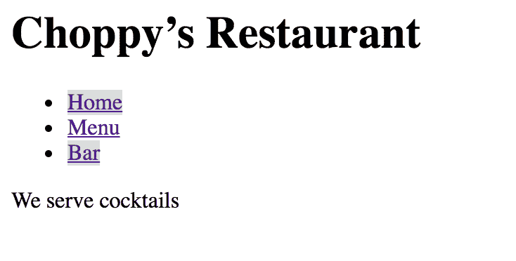
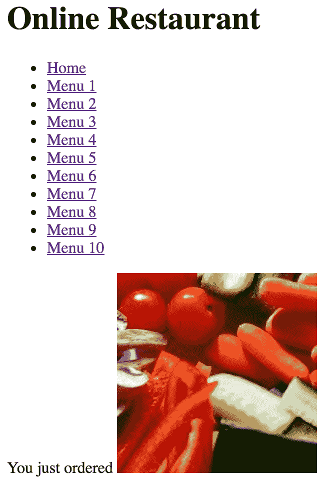
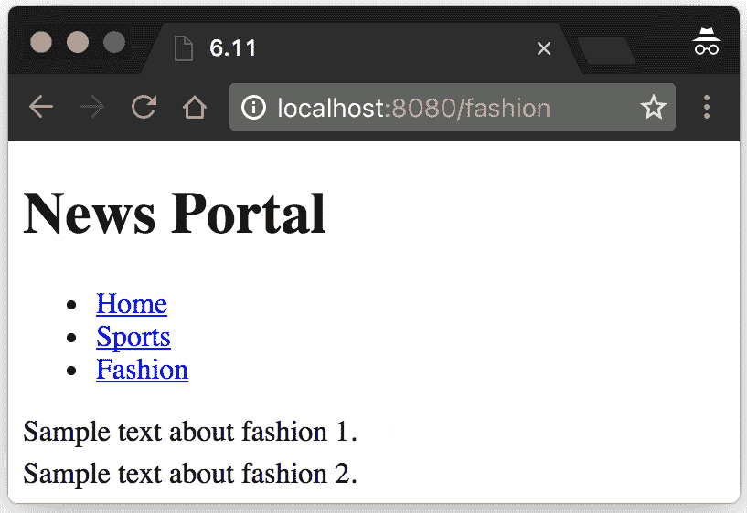

# 单页应用程序

本章将介绍以下配方：

*   使用 vue 路由器创建 SPA
*   在切换路由之前获取数据
*   使用命名的动态路由
*   页面中有多个路由器视图
*   按层次组合路线
*   使用管线别名
*   在路线之间添加过渡
*   管理路由的错误
*   添加进度条以加载页面
*   如何重定向到另一个路由
*   回击时保存滚动位置

# 介绍

许多现代应用程序都基于**SPA**或**单页应用程序**模型。从用户的角度来看，这意味着整个网站看起来类似于单个页面中的应用程序。

这很好，因为如果操作正确，它会增强用户体验，主要是减少等待时间，因为没有新页面可加载——整个网站都在一个页面上。这就是 Facebook、Medium、Google 和许多其他网站的工作方式。

URL 不再指向 HTML 页面，而是指向应用程序的特定状态（通常看起来像不同的页面）。实际上，在服务器上，假设您的应用程序位于`index.html`页面内，这是通过将请求（比如）关于我的用户重定向到`index.html`来实现的。

后一个页面将使用 URL 的后缀，并将其解释为**路由**，这反过来将创建一个带有传记信息的类似页面的组件。

# 使用 vue 路由器创建 SPA

js 通过其核心插件 Vue router 实现 SPA 模式。对于 vue 路由器，每个路由 URL 对应一个组件。这意味着我们将告诉 vue 路由器，当用户访问特定 URL 时，如何根据其组件进行操作。换句话说，这个新系统中的每个组件都是旧系统中的一个页面。

# 准备

对于这个方法，您只需要安装 vue 路由器并了解一些 vue 组件。

要安装 vue 路由器，请按照[中的说明进行操作 https://router.vuejs.org/en/installation.html](https://router.vuejs.org/en/installation.html) 。

如果您使用 JSFIDLE 进行后续操作，则可以添加类似于[的链接 https://unpkg.com/vue-router/dist/vue-router.js](https://unpkg.com/vue-router/dist/vue-router.js) 。

# 怎么做…

我们正在为一家餐厅准备一个现代化的网站，我们将使用 SPA 模式。

该网站将由三个页面组成：主页、餐厅菜单和酒吧菜单。

整个 HTML 代码如下所示：

```js
<div id="app">
  <h1>Choppy's Restaurant</h1>
  <ul>
    <li>Home</li>
    <li>Menu</li>
    <li>Bar</li>
  </ul>
  <router-view></router-view>
</div>
```

`<router-view>`组件是 vue 路由器的入口点。它是组件显示为页面的地方。

列表元素将成为链接。目前，它们只是列表元素；要将它们转换为链接，我们可以使用两种不同的语法。将第一个链接换行，如下所示：

```js
<li><router-link to="/">Home</router-link></li>
```

另一个例子如下：

```js
<li><router-link to="/menu">Menu</router-link></li>
```

我们可以使用的另一种语法如下（对于条形链接）：

```js
<li>
  <router-link
    tag="li" to="/bar"
      :event="['mousedown', 'touchstart']"
    >
    <a>Bar</a>
  </router-link>
</li>
```

这种更详细但更明确的语法可用于将自定义事件绑定到特定路由。

要指示 Vue 使用 Vue 路由器插件，请在 JavaScript 中编写以下内容：

```js
Vue.use(VueRouter)
```

我们在开头列出的三个页面的一部分将由以下三个虚拟组件（将它们添加到 JavaScript 中）扮演：

```js
const Home = { template: '<div>Welcome to Choppy's</div>' }
const Menu = { template: '<div>Today we have cookies</div>' }
const Bar = { template: '<div>We serve cocktails</div>' }
```

现在，您终于可以创建路由器了。其代码如下：

```js
const router = new VueRouter({})
```

这个路由器没什么用；我们必须添加路由（对应于 URL）及其相关组件：

```js
const router = new VueRouter({
 routes: [ { path: '/', component: Home }, { path: '/menu', component: Menu }, { path: '/bar', component: Bar } ] })
```

现在我们的申请几乎完成了；我们只需要声明一个简单的`Vue`实例：

```js
new Vue({
  router,
  el: '#app'
})
```

我们的应用程序现在可以工作了；在启动之前，添加此 CSS 规则以获得更好的反馈：

```js
a.router-link-active, li.router-link-active>a {
  background-color: gainsboro;
}
```

当您打开应用程序并单击工具栏链接时，您应该会看到类似于以下屏幕截图的内容：



# 它是如何工作的…

程序要做的第一件事是将 vue 路由器注册为插件。vue 路由器依次注册路由（URL 的一部分）并将组件连接到每个路由。

当我们第一次访问应用程序时，浏览器上的 URL（您将无法看到它在 JSFIDLE 中发生变化，因为它位于 iframe 中）将以`index.html/#/`结尾。哈希符号之后的所有内容都是 vue 路由器的路由。在本例中，它只是一条斜线（`/`，因此它与第一条回家路线匹配。

当我们点击链接时，`<router-view>`的内容会根据我们与该路由关联的组件而变化。

# 还有更多…

精明的读者肯定会发现可以解释为 bug 的东西——在运行应用程序之前，我们添加了两种 CSS 样式。只要页面与实际指向的链接相对应，`.router-link-active`类就会自动注入`<router-link>`组件。

当我们点击菜单和工具栏时，背景颜色会发生变化，但它似乎仍然停留在为主页链接选择的位置。这是因为`<router-link>`组件执行的匹配不是**精确的**。换句话说，`/bar`和`/menu`包含`/`字符串，因此，`/`总是匹配的。

快速修复方法是添加与第一个`<router-link>`完全相同的属性：

```js
<li><router-link to="/" exact>Home</router-link></li>
```

现在，只有当路由与主页链接完全匹配时，`Home`链接才会突出显示。

另一件需要注意的事情是规则本身：

```js
a.router-link-active, li.router-link-active>a {
  background-color: gainsboro;
}
```

为什么我们要匹配两个不同的东西？这取决于您如何编写路由器链接。

```js
<li><router-link to="/" exact>Home</router-link></li>
```

前面的代码将在以下 DOM 部分中翻译：

```js
<li><a href="#/" class="router-link-active">Home</a></li>
```

而：

```js
<router-link tag="li" to="/" exact>Home</router-link>
```

变成：

```js
<li class="router-link-active">Home</li>
```

注意在第一种情况下，类是如何应用于子锚点元素的；在第二种情况下，它应用于父元素。

# 在切换路由之前获取数据

在 Vue 的前一个版本中，我们有一个专门的方法在更改路由之前从 Internet 获取数据。对于 Vue 2，我们有一个更通用的方法，可以在切换路由之前处理这个问题，也可能处理其他问题。

# 准备

要完成此步骤，您需要了解 vue 路由器的基础知识以及如何发出 AJAX 请求（上一章将对此进行详细介绍）。

# 怎么做…

我们将编写一个由两个页面组成的简单 web 公文包：一个主页和一个关于我的页面。

对于这个配方，我们需要添加 Axios 作为依赖项。

从以下 HTML 代码中可以清楚地看到基本布局：

```js
<div id="app">
  <h1>My Portfolio</h1>
  <ul>
    <li><router-link to="/" exact>Home</router-link></li>
    <li><router-link to="/aboutme">About Me</router-link></li>
  </ul>
  <router-view></router-view>
</div>
```

在 JavaScript 中，您可以开始构建`AboutMe`组件：

```js
const AboutMe = {
  template: `<div>Name:{{name}}<br>Phone:{{phone}}</div>`
}
```

它将只显示姓名和电话号码。让我们在组件的`data`选项中声明两个变量，如下所示：

```js
data () {
  return {
    name: undefined,
    phone: undefined  
  } 
}
```

在将组件实际加载到场景之前，vue 路由器将在我们的对象中查找一个名为`beforeRouteEnter`的选项；我们将使用它从服务器加载姓名和电话。我们使用的服务器将提供虚假数据，仅用于显示某些内容，如下所示：

```js
beforeRouteEnter (to, from, next) {
  axios.post('https://schematic-ipsum.herokuapp.com/', {
    "type": "object",
    "properties": {
      "name": {
        "type": "string",
        "ipsum": "name"
      },
      "phone": {
        type": "string",
        "format": "phone"
      }
    }
  }).then(response => {
    next(vm => {
      vm.name = response.data.name
      vm.phone = response.data.phone 
    })
  })
}
```

对于另一个组件，主页，我们将只编写一个小组件作为占位符：

```js
const Home = { template: '<div>This is my home page</div>' }
```

接下来，您必须注册`router`及其`paths`：

```js
Vue.use(VueRouter)
const router = new VueRouter({
  routes: [
    { path: '/', component: Home },
    { path: '/aboutme', component: AboutMe },  
  ] 
})
```

当然，您还需要注册一个`Vue`根实例，如下所示：

```js
new Vue({
  router,
  el: '#app'
})
```

当您启动应用程序并单击“关于我”链接时，您应该会看到类似的内容：


您会注意到，当您单击链接时，不会重新加载页面，但显示 bio 仍然需要相当长的时间。这是因为它从互联网上获取数据。

# 它是如何工作的…

`beforeRouteEnter`吊钩有三个参数：

*   `to`：表示用户请求的路由的`Route`对象。
*   表示当前路由的路由：该路由也是来自。这是用户在发生错误时将保留的路线。
*   `next`：当我们准备好进行路线切换时，可以使用此功能。使用 false 调用此函数将防止更改路由，并且在出现错误时非常有用。

调用上述函数时，我们使用 Axios 调用了一个 web 服务，该服务提供了一个名称字符串和一个电话号码字符串。

当我们在这个钩子里的时候，重要的是要记住，我们无法访问这个钩子。因为这个钩子是在组件实际实例化之前运行的，所以没有`this`可供参考。

正如我们所说的，当服务器返回到【名称】时，我们不想将其分配给服务器。下一个函数接收对组件的引用作为参数。我们使用它将变量设置为接收值：

```js
...
}).then(response => {
  next(vm => {
    vm.name = response.data.name
    vm.phone = response.data.phone
  })
})
```

# 使用命名的动态路由

手工登记所有路线可能非常耗时，而且，如果事先不知道路线，则不可能。vue router 允许您使用参数注册路由，这样您就可以拥有数据库中所有对象的链接，并涵盖用户选择路由的其他使用情形，遵循某些模式会导致手动注册过多路由。

# 准备

除了有关 vue 路由器的基本知识（请参阅*使用 vue 路由器创建 SPA*配方），完成此配方不需要任何其他信息。

# 怎么做…

我们将开设一家在线餐厅，提供十种不同的菜肴。我们将为每道菜创建一条路线。

我们网站的 HTML 布局如下：

```js
<div id="app">
  <h1>Online Restaurant</h1>
  <ul>
    <li>
      <router-link :to="{ name: 'home' }" exact>
        Home
      </router-link>
    </li>
    <li v-for="i in 10">
      <router-link :to="{ name: 'menu', params: { id: i } }">
        Menu {{i}}
      </router-link>
    </li>
    </ul>
  <router-view class="view"></router-view>
</div>
```

这将创建 11 个链接，一个用于主页，十个用于菜肴。

在 JavaScript 部分注册`VueRouter`后，代码如下：

```js
Vue.use(VueRouter)
```

创建两个组件；其中一个将作为主页的占位符：

```js
const Home = { template: `
  <div>
    Welcome to Online Restaurant
  </div>
` }
```

其他路由将连接到一个`Menu`组件：

```js
const Menu = { template: `
  <div>
    You just ordered
    
  </div>
` }
```

在前面的组件中，我们使用`$route`引用全局路由器对象，并从 URL 获取`id`参数。`Lorempixel.com`是一个提供样本图片的网站。我们正在为每个`id`连接不同的图像。

最后，使用以下代码创建路由器本身：

```js
const router = new VueRouter({
  routes: [
    { path: '/', name:'home', component: Home }, 
    { path: '/menu/:id', name: 'menu', component: Menu },
  ]
})
```

您可以看到菜单的路径包含`/:id`，它是将出现在 URL 中的`id`参数的占位符。

最后，编写一个根`Vue`实例：

```js
new Vue({
  router,
  el: '#app'
})
```

您现在可以启动应用程序，并且应该能够看到所有菜单项。点击其中任何一个，应点一道不同的菜：



# 它是如何工作的…

代码的两个主要部分有助于为不同的菜肴创建路线。

首先，我们使用冒号语法注册了一个通用路由，并为其指定了一个名称，代码如下：

```js
{ path: '/menu/:id', name: 'menu', component: Menu }
```

这意味着我们可以有一个以`/menu/82`结尾的 URL，`Menu`组件将显示，`$route.params.id`变量设置为`82`。因此，应根据以下内容更改以下行：

```js

```

在渲染的 DOM 中，前一行将替换为下一行：

```js

```

不要介意现实生活中没有这样的形象。

请注意，我们还为该路由指定了一个名称。这不是严格必要的，但它使我们能够编写代码的第二个主要部分，如图所示：

```js
<router-link :to="{ name: 'menu', params: { id: i } }">
  Menu {{i}}
</router-link>
```

我们可以将对象传递给`to`属性并指定`params`，而不是写入字符串。在我们的例子中，`param`由`v-for`包装给出。这意味着，例如，在`v-for`的第四个周期：

```js
<router-link :to="{ name: 'menu', params: { id: 4} }">
  Menu 4
</router-link>
```

这将导致 DOM 如下所示：

```js
<a href="#/menu/4" class="">Menu 4</a>
```

# 页面中有多个路由器视图

拥有多个`<router-view>`可以让您拥有可以用更复杂的布局组织的页面。例如，您可以有一个侧栏和主视图。这个食谱就是关于这个的。

# 准备

这个食谱没有使用任何先进的概念。不过，建议您熟悉 vue 路由器并学习如何安装它。请参阅本章中的第一个食谱以了解更多信息。

# 怎么做…

此配方将使用大量代码来实现这一点。不过，不要气馁，机制非常简单。

我们将建一家二手五金店。我们将有一个主视图和一个侧栏；这些将是我们的路由器视图。侧边栏将包含我们的购物清单，以便我们始终知道我们要买什么，不会分心。

整个 HTML 代码非常简短，因为它只包含一个标题和两个`router-view`组件：

```js
<div id="app">
  <h1>Second-Hand Hardware</h1>
    <router-view name="list"></router-view>
    <router-view></router-view>
</div>
```

在这种情况下，列表名为`router-view`。第二个没有名字；因此，它默认命名为`Vue`。

在 JavaScript 中注册`vue-router`：

```js
Vue.use(VueRouter)
```

然后，登记路线：

```js
const router = new VueRouter({
  routes: [
    { path: '/',
      components: {
        default: Parts,
        list: List
      }
    },
    { path: '/computer',
      components: {
        default: ComputerDetail,
        list: List
      }
    }
  ]
})
```

组件不再是单个对象；它变成了一个包含两个组件的对象：一个用于`list`，另一个用于默认`router-view`。

如图所示，在路由器代码前写入`list`组件：

```js
const List = { template: `
  <div>
    <h2>Shopping List</h2>
      <ul>
        <li>Computer</li>
      </ul>
  </div>
` }
```

这将显示计算机作为我们应该记住购买的物品。

零件组件如下所示；在`router`代码前写：

```js
const Parts = { template: `
  <div>
    <h2>Computer Parts</h2>
    <ul>
      <li><router-link to="/computer">Computer</router-link></li>
      <li>CD-ROM</li>
    </ul>
  </div>
` }
```

这包含了一个链接，可以查看更多有关销售中的计算机的信息；下一个组件绑定到该页面，所以在`router`代码之前写入：

```js
const ComputerDetail = { template: `
  <div>
    <h2>Computer Detail</h2>
    <p>Pentium 120Mhz, CDs sold separately</p>
  </div>
` }
```

当然，不要忘记添加`Vue`实例：

```js
new Vue({
  router,
  el: '#app'
})
```

当你启动应用程序时，你应该看到两个路由器视图，一个在另一个上面。如果希望它们并排出现，可以添加一些 CSS 样式：


# 它是如何工作的…

将`<router-view>`组件添加到页面时，您只需记住添加一个名称，以便稍后在路线注册时引用：

```js
<router-view name="view1"></router-view>
<router-view name="view2"></router-view>
<router-view></router-view>
```

如果未指定名称，则路由将被称为默认路由：

```js
routes: [
  { path: '/',
    components: {  
      default: DefaultComponent,
      view1: Component1,
      view2: Component2
    }
  }
]
```

这样，组件将显示在各自的`router-view`元素中。

If you don't specify one or more components for a named view, the `router-view` associated with that name will be empty.

# 按层次排列您的路线

在许多情况下，网站的组织树可能很复杂。在某些情况下，您可以遵循清晰的层次结构组织，通过嵌套路由，vue 路由可以帮助您保持一切有序。最好的情况是，URL 的组织方式和组件的嵌套方式是否完全一致。

# 准备

在此配方中，您将使用 Vue 的组件和其他基本功能。您还将使用动态路由。前往*使用命名的动态路线*配方，了解更多有关它们的信息。

# 怎么做。。。

在这个食谱中，你将为一个虚构的世界建立一个在线会计网站。我们将有两个用户--`Stark`和`Lannister`--我们将能够看到这两个用户拥有多少黄金和多少士兵。

我们网站的 HTML 布局如下：

```js
<div id="app">
  <h1>Kindoms Encyclopedia</h1>
  <router-link to="/user/Stark/">Stark</router-link>
  <router-link to="/user/Lannister/">Lannister</router-link>
  <router-view></router-view>
</div>
```

我们有一个标题和两个链接——一个用于`Stark`，一个用于`Lannister`——最后还有`router-view`元素。

我们将`VueRouter`添加到插件中：

```js
Vue.use(VueRouter)
```

然后，我们注册`routes`：

```js
const router = new VueRouter({
  routes: [
    { path: '/user/:id', component: User,
      children: [ 
        {
          path: 'soldiers',
          component: Soldiers
        },
        {
          path: 'gold',
          component: Gold
        }
      ]
    }
  ]
})
```

我们所说的是注册一个动态路由，`/user/:id`，在`User`组件中，将有另一个路由器视图，其中包含黄金和士兵的嵌套路径。

刚才提到的三个组成部分如图所示；将它们添加到路由代码之前：

```js
const User = { template: `
  <div class="user">
    <h1>Kindoms Encyclopedia</h1>
    User {{$route.params.id}}
    <router-link to="gold">Gold</router-link>
    <router-link to="soldiers">Soldiers</router-link>
    <router-view></router-view>
  </div>
`}
```

正如预期的那样，`User`组件内还有另一个路由器视图入口点，它将包含嵌套的`routes`组件。

然后，始终在路由代码之前写入`Soldiers`和`Gold`组件：

```js
const Soldiers = { template: `
  <div class="soldiers">
    <span v-for="soldier in $root[$route.params.id].soldiers"> 

    </span>
  </div>
`}
const Gold = { template: `
   div class="gold">
    <span v-for="coin in $root[$route.params.id].gold">

    </span>
  </div>
`}
```

这些组件将只显示与 Vue 根实例数据选项中的 gold 或 dardiers 变量一样多的 emojis。

这就是`Vue`根实例的样子：

```js
new Vue({
  router,
  el: '#app',
  data: {
    Stark: {
      soldiers: 100,
      gold: 50  
    },
    Lannister: {
      soldiers: 50,
      gold: 100
    }
  }
})
```

启动该应用程序将使您能够直观地显示黄金和两个用户的士兵人数：


# 它是如何工作的…

要更好地了解嵌套管线的工作原理，请查看下图：


我们的食谱只有两个等级。第一层是顶层，由对应于`/user/:id`路由的大包装矩形表示，这意味着每个潜在匹配 ID 将位于同一层。

而内部矩形是嵌套管线和嵌套构件。它对应于黄金路线和黄金成分。

当嵌套`routes`对应嵌套组件时，这是正确的选择。还有另外两个案例需要考虑。

当我们有嵌套组件但没有嵌套管线时，我们可以在嵌套管线前面加一个斜杠，`/`。这将使其行为类似于顶级路线。

例如，考虑我们将代码更改为以下内容：

```js
const router = new VueRouter({
  routes: [
    { path: '/user/:id', component: User,
      children: [
        {
          path: 'soldiers',
          component: Soldiers
        },
        {
          path: '/gold',
          component: Gold
        }
      ] 
    }
  ]
})
```

当我们将浏览器指向`/gold`URL 而不是`/user/Lannister/gold`时，在`/gold`路由前面加前缀将使`Gold`组件出现（在这种情况下，由于未指定用户，这将导致错误和空页）。

另一种相反的情况是嵌套了`routes`但没有相同级别的组件。在这种情况下，只需使用常规语法来注册路由。

# 使用管线别名

有时需要有多个指向同一页面的 URL。这可能是因为该页面的名称已更改，或者是因为该页面在站点的不同部分被不同地引用。

特别是，当页面更改其名称时，在许多设置中保留以前的名称非常重要。链接可能中断，网页的某些部分可能无法访问。在这个配方中，您将完全避免这种情况。

# 准备

对于这个配方，您只需要了解一些 vue 路由器组件的知识（如何安装和基本操作）。关于 vue 路由器的更多信息将从*使用 vue 路由器创建 SPA*配方开始。

# 怎么做…

让我们想象一下，我们有一个时尚网站，负责给衣服命名的员工 Lisa 为两件衣服创建了两个新链接：

```js
<router-link to="/green-dress-01/">Valentino</router-link>
<router-link to="/green-purse-A2/">Prada</router-link>
```

开发人员在 vue 路由器中创建相应的路由：

```js
const router = new VueRouter({
  routes: [
    {
      path: '/green-dress-01',
      component: Valentino01
    },
    {
      path: '/green-purse-A2',
      component: PradaA2
    }
  ]
})
```

后来，人们发现这两件东西不是绿色的，而是红色的。丽莎是色盲，不该受责备。

您现在负责更改所有链接以反映列表的真实颜色。您要做的第一件事是更改链接本身。以下是编辑 HTML 布局后的外观：

```js
<div id="app">
  <h1>Clothes Shop</h1>
  <router-link to="/red-dress-01/">Valentino</router-link>
  <router-link to="/red-purse-A2/">Prada</router-link>
  <router-view></router-view>
</div>
```

您将`VueRouter`插件添加到`Vue`：

```js
Vue.use(VueRouter)
```

然后，注册新的`routes`以及旧的别名：

```js
const router = new VueRouter({
  routes: [
    {
      path: '/red-dress-01',
      component: Valentino01,
      alias: '/green-dress-01'
    },
    {
      path: '/red-purse-A2',
      component: PradaA2,
      alias: '/green-purse-A2'
    }
  ]
})
```

以下是上述组件的外观：

```js
const Valentino01 = { template: '<div class="emoji"></div>' }
const PradaA2 = { template: '<div class="emoji"></div>' }
```

在启动应用程序之前，请记住实例化一个`Vue`实例：

```js
new Vue({
  router,
  el: '#app'
})
```

您可以添加 CSS 规则，使表情看起来像图像，如以下屏幕截图所示：

```js
.emoji {
  font-size: 3em;
}
```


# 它是如何工作的…

即使我们更改了所有链接，我们也无法控制其他实体如何链接到我们的页面。对于像谷歌这样的搜索引擎来说，没有办法告诉他们删除旧页面的链接并使用新页面。这意味着，如果我们不使用别名，我们可能会有很多坏的宣传形式的断开链接和 404 页；在某些情况下，甚至从广告商那里，我们付费链接到一个不存在的页面。

# 在路线之间添加过渡

我们在*过渡和动画中详细探讨了过渡。*在这里，我们将在更改路由时使用它们，而不是更改元素或组件。同样的观察结果也适用于这里。

# 准备

在尝试此配方之前，我强烈建议您完成*过渡和动画*中的一些配方，以及此配方。这个配方是迄今为止所学概念的混合。

# 怎么做…

在这个食谱中，我们将为鬼魂餐厅建立一个网站。它与普通餐厅的网站没有太大区别，只是要求页面必须褪色，而不是立即出现。

让我们写下一些 HTML 布局，好吗：

```js
<div id="app">
  <h1>Ghost's Restaurant</h1>
  <ul>
    <li><router-link to="/">Home</router-link></li>
    <li><router-link to="/menu">Menu</router-link></li>  
  </ul>
  <transition mode="out-in">
  <router-view></router-view>
  </transition>
</div>
```

注意我们是如何用`transition`标签包装主路由器显示端口的。设置模式`out-in`是因为我们希望消失组件的动画在其他组件出现之前完成。如果我们没有设置，两个衰减分量将在短时间内叠加。关于更详细的讨论，您可以参考配方中的*让元素在进入阶段之前离开。*

让我们创建两个页面/组件：

```js
const Home = { template: '<div>Welcome to Ghost's</div>' }
const Menu = { template: '<div>Today: invisible cookies</div>' }
```

现在，让我们注册`routes`：

```js
Vue.use(VueRouter)
const router = new VueRouter({
  routes: [
    { path: '/', component: Home },
    { path: '/menu', component: Menu }
  ]
})
```

在启动应用程序之前，实例化一个`Vue`对象：

```js
new Vue({
  router,
  el: '#app'
})
```

要使转换正常工作，您必须添加一些 CSS 规则：

```js
.v-enter-active, .v-leave-active {
  transition: opacity .5s;
}
.v-enter, .v-leave-active {
  opacity: 0
}
```

立即启动您的应用程序。您已成功添加页面更改之间的淡入淡出过渡。

# 它是如何工作的…

将整个`<router-view>`包装在一个转换标签内，将对所有组件执行相同的转换。

如果我们希望每个组件都有一个不同的转换，我们有另一个选择：我们必须将各个组件包装在转换本身中。

比如说，我们有两个转变：怪异和美味。我们希望在`Home`组件出现时应用第一个，在`Menu`组件出现时应用第二个。

我们需要修改我们的组件，如下所示：

```js
const Home = { template: `
  <transition name="spooky">
    <div>Welcome to Ghost's</div>
  </transition>
` }
const Menu = { template: `
  <transition name="delicious">
    <div>Today: insisible cookies!</div>
  </transition>
` }
```

# 管理路由的错误

如果我们要访问的页面未找到或无法工作，则转到链接没有多大意义。传统上，当这种情况发生时，我们会看到一个错误页面。在 SPA 中，我们的功能更强大，我们可以阻止用户完全进入 SPA，并显示一条礼貌信息，说明页面不可用。这大大增强了用户体验，因为用户可以立即执行另一个操作，而无需返回。

# 准备

为了跟进，您应该在切换路由配方之前完成*取数。*

这个配方将建立在它之上，我假设您已经准备好了所有相关的代码。

# 怎么做…

如上所述，我们将编辑*在切换路由*之前获取数据的配方中产生的代码，以管理错误。请记住，当我们进入`/aboutme`页面时，我们正在从互联网加载信息。如果信息不可用，我们希望避免进入该页面。

对于此配方，添加 Axios 作为依赖项，与前面的配方一样。

首先，用突出显示的代码丰富 HTML 布局：

```js
<div id="app">
  <h1>My Portfolio</h1>
  <ul>
    <li><router-link to="/" exact>Home</router-link></li>
    <li><router-link to="/aboutme">About Me</router-link></li>
  </ul>
  <router-view></router-view>
 <div class="toast" v-show="showError"> There was an error </div> </div>
```

这是一条 toast 消息，每当出现错误时，该消息将显示在屏幕上。使用此 CSS 规则为其添加一些样式：

```js
div.toast {
  width: 15em;
  height: 1em;
  position: fixed;
  bottom: 1em;
  background-color: red;
  color: white;
  padding: 1em;
  text-align: center;
}
```

接下来你要做的是建立一个全局机制，将`showError`设置为`true`。在 JavaScript 代码的顶部，声明`vm`变量：

```js
let vm
```

然后，将我们的`Vue`根实例分配给它：

```js
vm = new Vue({
  router,
  el: '#app',
 data: { showError: false } })
```

我们还将`showError`变量添加到数据选项中。

最后一件事是在显示生物信息之前，实际管理数据检索错误。

将突出显示的代码添加到`beforeRouteEnter`挂钩：

```js
beforeRouteEnter (to, from, next) {
  axios.post('http://example.com/', {
    "type": "object",
    "properties": {
      "name": {
        "type": "string",
        "ipsum": "name"
      },
      "phone": {
        "type": "string",
        "format": "phone"
      }
    }
  }).then(response => {
  next(vm => {
    vm.name = response.data.name
    vm.phone = response.data.phone
  })
}).catch(error => {
 vm.showError = true next(false) }) }
```

下一个（false）命令将让用户留在原地，我们还将端点编辑为`example.com`，这将在`POST`请求中返回错误代码：


# 它是如何工作的…

Axios 将收到来自`example.com`的错误，这将导致拒绝我们在调用 post 时创建的承诺。拒绝承诺反过来会触发在 catch 中传递的函数。

值得注意的是，在代码的这一点上，`vm`指的是根`Vue`实例；这是因为代码总是在`Vue`实例初始化并分配给`vm`之后执行。

# 添加进度条以加载页面

的确，使用 SPA，用户不必等待加载新页面，但他仍然需要等待加载数据。在*切换路由前取数*配方中，点击`/aboutme`页面按钮后，我们不得不再等待一段时间。没有任何迹象表明数据正在加载，然后页面突然出现。如果用户至少有一些关于页面正在加载的反馈，那不是很好吗？

# 准备

为了跟进，您应该在切换路由配方之前完成*取数。*

这个配方将建立在它之上，我假设您已经准备好了所有相关的代码。

# 怎么做…

如前所述，我将假设您在切换路由配方并开始工作之前，拥有*获取数据产生的所有代码。*

对于这个配方，我们将使用一个额外的依赖项--`NProgress`，这是一个小实用程序，用于在屏幕顶部显示加载条。

在页面标题或 JSFIDLE 中的依赖项列表中添加以下两行（还有一个 npm 包）：

```js
<link rel="stylesheet" href="https://cdn.bootcss.com/nprogress/X/nprogress.css">
<script src="https://cdn.bootcss.com/nprogress/X/nprogress.js"></script>
```

这里，`X`是`NProgress`的版本。在编写时，它是 0.2.0，但您可以在网上查找它。

完成此操作后，下一步是从进度栏定义所需的行为。

首先，我们希望在单击链接时立即显示进度条。为此，我们可以在点击事件中添加一个事件监听器，但是如果我们有 100 个链接，那么它的设计将很糟糕。一种更可持续、更干净的方法是为路由器创建一个新的挂钩，并将进度条的外观与路由的切换连接起来。这还具有在整个应用程序中提供一致体验的优势：

```js
router.beforeEach((to, from, next) => {
  NProgress.start()
  next()
})
```

以类似的方式，我们希望加载成功后该条消失。这意味着我们希望在回调中执行此操作：

```js
beforeRouteEnter (to, from, next) {
  axios.post('http://schematic-ipsum.herokuapp.com/', {
    "type": "object",
    "properties": {
      "name": {
        "type": "string",
        "ipsum": "name"
      },
      "phone": {
        "type": "string",
        "format": "phone"
      }
    }
  }).then(response => {
 NProgress.done()    next(vm => {
      vm.name = response.data.name
      vm.phone = response.data.phone
    })
  })
}
```

您现在可以启动应用程序，并且您的进度条应该已经可以工作了：


# 它是如何工作的…

这个方法还表明，如果外部库易于安装，那么利用它们一点也不困难。

由于`NProgress`组件非常简单和有用，我在这里报告它的 API 作为参考：

*   `NProgress.start()`：显示进度条
*   `NProgress.set(0.4)`：设置进度条的百分比
*   `NProgress.inc()`：将进度条增加一点
*   `NProgress.done()`：完成进度

我们使用了前面的两个函数。

作为预防措施，我还建议不要依赖单个组件调用的`done()`函数。我们在`then`函数中调用它，但是如果下一个开发人员忘记了呢？毕竟，我们在*路线中的任何*切换之前启动进度条。

最好在`router`中添加一个新的钩子：

```js
router.afterEach((to, from) => {
  NProgress.done()
})
```

由于`done`函数是幂等函数，我们可以根据需要多次调用它。因此，这将不会修改我们应用程序的行为，并将确保即使未来的开发人员忘记关闭进度条，一旦路径发生变化，它也会自动消失。

# 如何重定向到另一个路由

您可能希望重定向用户的原因很多。您可能希望用户在访问页面之前登录，或者页面已移动，您希望用户注意新链接。在此配方中，您将用户重定向到新主页，以快速修改网站。

# 准备

此配方仅使用有关 vue 路由器的基本知识。如果您已经完成了使用 vue 路由器创建 SPA 的*配方，您就可以开始了。*

# 怎么做…

假设我们有一家在线服装店。

这将是网站的 HTML 布局：

```js
<div id="app">
  <h1>Clothes for Humans</h1>
  <ul>
    <li><router-link to="/">Home</router-link></li>
    <li><router-link to="/clothes">Clothes</router-link></li>
  </ul>
  <router-view></router-view>
</div>
```

这只是一个链接到衣服清单的页面。

让我们注册`VueRouter`：

```js
Vue.use(VueRouter)
```

我们的网站中有三个页面，由以下组件表示：

```js
const Home = { template: '<div>Welcome to Clothes for Humans</div>' }
const Clothes = { template: '<div>Today we have shoes</div>' }
const Sales = { template: '<div>Up to 50% discounts! Buy!</div>' }
```

它们代表了主页、服装清单，以及我们去年使用的带有一些折扣的页面。

让我们注册一些`routes`：

```js
const router = new VueRouter({
  routes: [
    { path: '/', component: Home }
    { path: '/clothes', component: Clothes },
    { path: '/last-year-sales', component: Sales }
  ]
})
```

最后，我们添加一个根`Vue`实例：

```js
new Vue({
  router,
  el: '#app'
})
```

您可以启动应用程序，它应该可以正常工作。

黑色星期五就是明天，我们忘了它是世界上最大的时尚盛会。我们没有时间重写主页，但去年的销售页面可以做到这一点。我们要做的是将访问我们主页的用户重定向到该页面。

为了实现这一点，我们需要修改我们注册`routes`的方式：

```js
const router = new VueRouter({
  routes: [
    { path: '/', component: Home, redirect: '/last-year-sales' },
    { path: '/clothes', component: Clothes },
    { path: '/last-year-sales', component: Sales }
  ]
})
```

只有通过添加重定向，我们才挽救了这一天。现在，无论何时访问主页，您都会看到销售页面。

# 它是如何工作的…

当根路由匹配时，`Home`组件不会被加载。`/last-year-sales`的路径将被匹配。我们也可以完全忽略该组件，因为它永远不会被加载：

```js
{ path: '/', redirect: '/last-year-sales' }
```

# 还有更多…

vue 路由器中的重定向功能比我们刚才看到的功能更强大。在这里，我将尝试使用重定向的更多功能来丰富我们刚刚创建的应用程序。

# 重定向到 404s

重定向未找到的页面是通过添加一个全包作为最后一个路由来完成的。它将匹配所有其他路由不匹配的内容：

```js
...
{ path: '/404', component: NotFound },
{ path: '*', redirect: '/404' }
```

# 命名重定向

重定向可以与命名路由相结合（请参阅使用命名动态路由的*配方）。我们可以按名称指定目的地：*

```js
...
{ path: '/clothes', name: 'listing', component: Clothes },
{ path: '/shoes', redirect: { name: 'listing' }}
```

# 使用参数重定向

您还可以在重定向时保留参数：

```js
...
{ path: '/de/Schuh/:size', redirect: '/en/shoe/:size' },
{ path: '/en/shoe/:size', component: Shoe }
```

# 动态重定向

这是最终的重定向。您可以访问用户试图访问的路由，并决定将其重定向到何处（但不能取消重定向）：

```js
...
{ path: '/air', component: Air },
{ path: '/bags', name: 'bags', component: Bags },
{ path: '/super-shirt/:size', component: SuperShirt },
{ path: '/shirt/:size?', component: Shirt},
{ path: '/shirts/:size?',
  redirect: to => {
    const { hash, params, query } = to
    if (query.colour === 'transparent') {
      return { path: '/air', query: null }
    }
    if (hash === '#prada') {
      return { name: 'bags', hash: '' }
    }
    if (params.size > 10) {
      return '/super-shirt/:size'
    } else {
      return '/shirt/:size?'
    }
  }
}
```

# 回击时保存滚动位置

在 vue 路由器中，有两种导航模式：`hash`和`history`。默认模式和之前食谱中使用的模式是`previouslye.`，传统上，当你访问网站时，向下滚动一点，然后单击指向另一个页面的链接；新页面将从顶部显示。当您单击浏览器的“后退”按钮时，页面将显示上一个滚动高度，并且您刚才单击的链接可见。

当你在水疗中心时，这不是真的，或者至少不是自动的。vue 路由器历史记录模式允许您模拟这种情况，或者更好地，对滚动进行细粒度控制。

# 准备

要完成这个配方，我们需要切换到历史模式。只有当应用程序在正确配置的服务器上运行时，历史记录模式才起作用。如何为 SPA 配置服务器超出了本书的范围（但原则是每个路由都从服务器端重定向到`index.html`。

我们将使用 npm 程序来启动一个小型服务器；您需要安装 npm。

# 怎么做…

首先，您将为 SPA 安装一个小型服务器，这样历史模式就可以工作了。

在您最喜欢的命令行中，进入将包含应用程序的目录。然后，键入以下命令：

```js
    npm install -g history-server
    history-server .
```

服务器运行后，您必须将浏览器指向`http://localhost:8080`，如果您的目录中有一个名为`index.html`的文件，则会显示该文件；否则，你不会看到太多。

创建一个名为`index.html`的文件，并填写一些样板文件，如*选择开发环境*配方。我们想要一个只有`Vue`和`vue-router`作为依赖项的空页面。我们的空画布应该如下所示：

```js
<!DOCTYPE html>
<html>
<head>
  <script src="https://unpkg.com/vue/dist/vue.js"></script>
  <script src="https://unpkg.com/vue-router/dist/vue-router.js"></script>
</head>
<body>
  <div id="app">
  </div>
  <script>
    new Vue({
      router,
      el: '#app'
    })
  </script>
</body>
</html>
```

作为 HTML 布局，将以下内容放在正文中：

```js
<div id="app">
  <h1>News Portal</h1>
    <ul>
      <li><router-link to="/">Home</router-link></li>
      <li><router-link to="/sports">Sports</router-link></li>
      <li><router-link to="/fashion">Fashion</router-link></li>
    </ul>
  <router-view></router-view>
</div>
```

我们有一个带有三个链接的标题和一个路由器视图入口点。我们将为体育和时尚页面创建两个长页面：

```js
const Sports = { template: `
  <div>
    <p v-for="i in 30">
      Sample text about sports {{i}}.
    </p>
    <router-link to="/fashion">Go to Fashion</router-link>
    <p v-for="i in 30">
      Sample text about sports {{i + 30}}.
    </p>
  </div>
` }
const Fashion = { template: `
  <div>
    <p v-for="i in 30">
      Sample text about fashion {{i}}.
    </p>
    <router-link to="/sports">Go to Sports</router-link>
    <p v-for="i in 30">
      Sample text about fashion {{i + 30}}.
    </p>
  </div>
` }
```

我们只需要主页组件的存根：

```js
const Home = { template: '<div>Welcome to BBCCN</div>' }
```

为此新闻网站编写合理的路由器：

```js
Vue.use(VueRouter)
const router = new VueRouter({
  routes: [
    { path: '/', component: Home },
    { path: '/sports', component: Sports },
    { path: '/fashion', component: Fashion } 
  ]
})
```

如果您现在使用浏览器访问前面指定的地址，您应该可以看到该站点处于活动状态。

转到运动页面，向下滚动直到看到链接，然后单击它。

请注意，您正在访问的页面如何从一开始就不显示。传统网站不会出现这种情况，这是不可取的。

点击后退按钮，注意我们上次离开页面的位置；我们希望保留这种行为。

最后，请注意页面的 URL 看起来并不自然，但里面有哈希符号；我们希望 URL 看起来更好：


为了实现这一点，我们将路由器代码修改为：

```js
const router = new VueRouter({
 mode: 'history',  routes: [
    { path: '/', component: Home },
    { path: '/sports', component: Sports },
    { path: '/fashion', component: Fashion }
  ],
 scrollBehavior (to, from, savedPosition) { if (savedPosition) { return savedPosition } else { return { x: 0, y: 0 } } } })
```

我们添加了一行，指定新模式为历史（链接中没有散列），并定义了`scrollBehavior`函数返回到最后一个位置（如果存在）；如果是新页面，则应滚动至左上角。

您可以通过刷新浏览器并返回主页来尝试此操作。

打开运动页面并单击页面中间的链接。新页面现在从头开始显示。

点击后退`savedPosition`即可恢复。

请注意，URL 现在看起来更好了：



# 它是如何工作的…

当您在浏览器中使用包含哈希符号的 URL 时，浏览器将发送对该 URL 的请求，但哈希后不带后缀，也就是说，当您的页面中有一个事件指向同一页面但具有不同的哈希后缀时：

```js
http://example.com#/page1 on  http://example.com#/page2
```

浏览器不会重新加载页面；这就是为什么 vue router 可以在用户单击仅修改哈希的链接时修改页面内容，而不重新加载页面。

当您将模式从`hash`更改为`history`时，vue 路由器将删除哈希符号并利用`history.pushState()`函数。

此函数用于添加另一个虚拟页面并将 URL 更改为其他内容：

```js
http://example.com/page1 =pushState=> http://example.com/page2
```

但浏览器不会发送`GET`请求来查找`page2`；事实上，它不会做任何事情。

按“上一步”按钮时，浏览器将还原 URL，vue 路由器将收到一个事件。然后，它将读取 URL（现在是`page1)`，并匹配相关的路由。

我们的 compact history 服务器的作用是将每个 GET 请求重定向到`index.html`页面。这就是为什么当我们试图直接转到`http://localhost:8080/fashion`时，我们没有得到*404*错误。