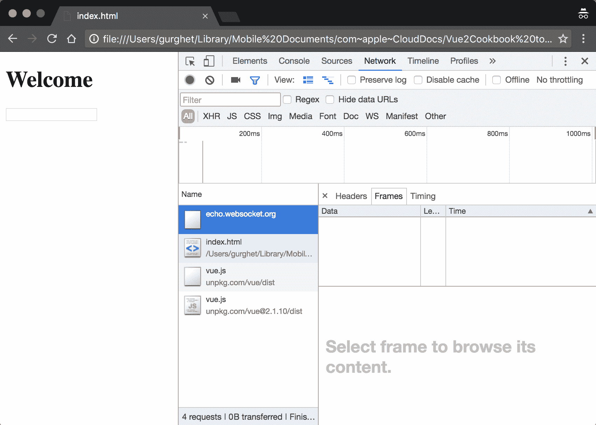
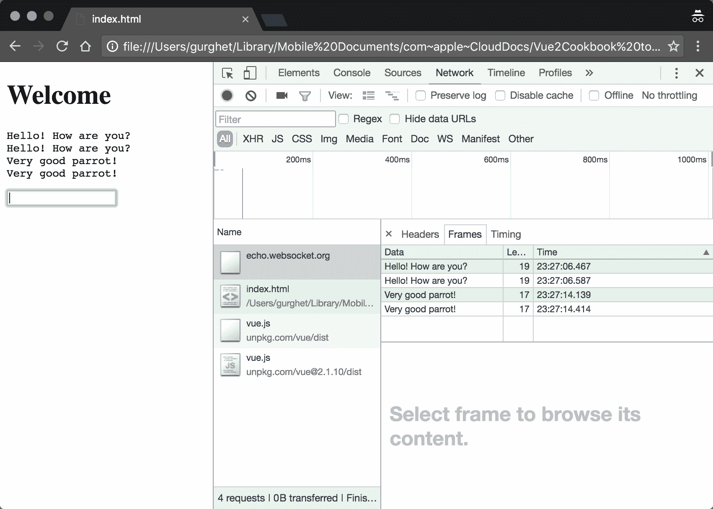
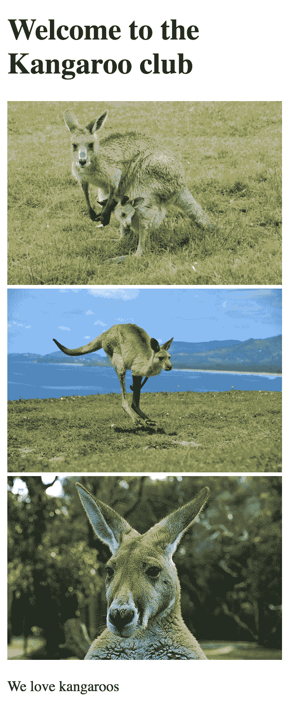
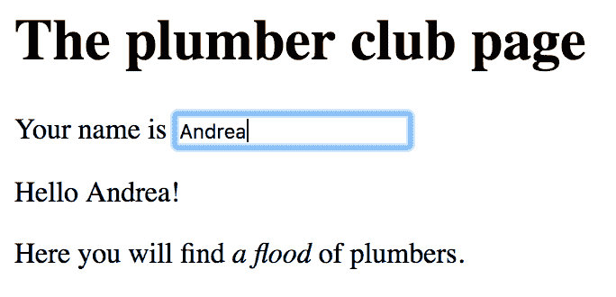
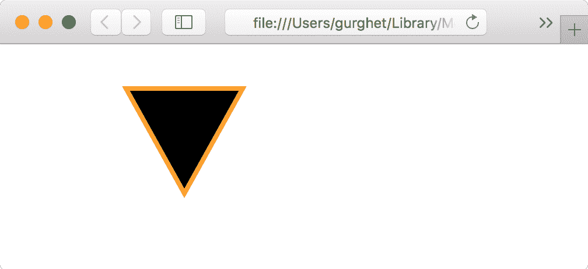

# 高级 Vue.js-指令、插件和渲染函数

在本章中，我们将讨论以下主题：

*   创建新指令
*   在 Vue 中使用 WebSocket
*   为 Vue 编写插件
*   手动渲染简单组件
*   渲染具有子级的组件
*   使用 JSX 呈现组件
*   创建功能组件
*   使用高阶组件构建响应表

# 介绍

指令和插件是以可重用的方式打包功能的方法，也使其易于在应用程序和团队之间共享；在本章中，您将构建其中的一些。渲染函数是 Vue 如何真正在幕后将模板转换为 Vue 语言，然后再转换为 HTML 和 JavaScript；如果您需要优化应用程序的性能并在某些情况下工作，它们将非常有用。

一般来说，您应该尽可能避免使用这些高级函数，因为它们在过去有点被过度使用。通常，许多问题可以通过编写一个好的组件并分发组件本身来解决；您应该只在不正确的情况下查看高级功能。

这一章是为稍有经验的人准备的，你可能找不到在其他食谱中找到的一步一步的细节，但我还是努力使它们完整。

# 创建新指令

指令就像迷你函数，可以用来快速插入代码，主要是为了改善用户体验，并向图形界面添加新的低级功能。

# 准备

这个食谱，虽然可以在高级章节找到，但确实很容易完成。指令是*高级*的主要原因是，您通常应该更喜欢组合，以便为应用程序添加功能和风格。当组件无法剪切它时，请使用指令。

# 怎么做。。。

我们将构建一个`v-pony`指令，将任何元素转换为小马元素。“小马”元素是以粉红色背景创建的，单击它时颜色会发生变化。

pony 元素的 HTML 代码如下所示：

```js
<div id="app">
  <p v-pony>I'm a pony paragraph!</p>
  <code v-pony>Pony code</code>
  <blockquote>Normal quote</blockquote>
  <blockquote v-pony>I'm a pony quote</blockquote>
</div>
```

为了显示差异，我加入了一个正常的`blockquote`元素。在我们的 JavaScript 部分中，编写以下内容：

```js
Vue.directive('pony', {
  bind (el) {
    el.style.backgroundColor = 'hotpink'
  }
})
```

这是您声明新指令的方式。当指令绑定到元素时，`bind`钩子被调用。我们现在唯一要做的就是设置背景色。我们还想让它在每次点击后改变颜色。为此，您必须添加以下代码：

```js
Vue.directive('pony', {
  bind (el) {
    el.style.backgroundColor = 'hotpink'
    el.onclick = () => {
 const colGen = () => 
 Math.round(Math.random()*255 + 25)
 const cols =
 [colGen() + 100, colGen(), colGen()]
 const randRGB =
 `rgb(${cols[0]}, ${cols[1]}, ${cols[2]})`
 el.style.backgroundColor = randRGB
 }
  }
})
```

在这里，我们正在创建一个`onclick`侦听器，它将生成一个偏向红色的随机颜色，并将其指定为新的背景色。

在 JavaScript 结束时，请记住创建一个`Vue`实例：

```js
new Vue({
  el: '#app'
})
```

您可以启动应用程序以查看指令的执行情况：


别忘了点击文本来改变背景颜色！

# 它是如何工作的…

声明新指令的语法如下所示：

```js
Vue.directive(<name: String>, {
  // hooks
})
```

这将注册一个新的全局指令。在 hooks 对象内部，您可以定义两个重要的函数：`bind`，您在本配方中使用了它；以及`update`，它在每次更新包含在其中的组件时都会触发。

每个钩子函数至少使用三个参数调用：

*   `el`：HTML 元素
*   `binding`：指令可以接收参数；绑定是一个包含参数值的对象
*   `vnode`：该元素的 Vue 内部表示

我们使用`el`参数编辑元素的外观，并直接对其进行操作

# 在 Vue 中使用 WebSocket

WebSockets 是一项新技术，它支持用户和应用程序所在服务器之间的双向通信。在这项技术出现之前，只有浏览器才能启动请求，从而建立连接。如果需要对页面进行某些更新，浏览器必须持续轮询服务器。对于 WebSocket，这不再是必需的；建立连接后，服务器只能在需要时发送更新。

# 准备

你不需要为这个食谱做任何准备，只需要 Vue 的基础知识。如果你不知道 WebSocket 是什么，你其实不需要知道，只要把它们看作是服务器和浏览器之间持续双向通信的一个渠道就行了。

# 怎么做。。。

对于这个配方，我们需要一个服务器和一个浏览器来充当客户端。我们不会建立一个服务器；相反，我们将使用一个已经存在的服务器，它只回显您通过 WebSocket 发送给它的任何内容。因此，如果我们发送`Hello`消息，服务器将以`Hello`响应。

您将构建一个与此服务器对话的聊天应用程序。编写以下 HTML 代码：

```js
<div id="app">
  <h1>Welcome</h1>
  <pre>{{chat}}</pre>
  <input v-model="message" @keyup.enter="send">
</div>
```

`<pre>`标签将帮助我们进行聊天。因为我们不需要`<br/>`元素来断线，所以我们可以使用`n`特殊字符来表示新线。

为了使聊天正常工作，我们首先必须在 JavaScript 中声明 WebSocket：

```js
 const ws = new WebSocket('ws://echo.websocket.org')
```

之后，我们声明我们的`Vue`实例，该实例将包含一个`chat`字符串（包含到目前为止的聊天记录）和一个`message`字符串（包含我们当前正在编写的消息）：

```js
new Vue({
  el: '#app',
  data: {
    chat: '',
    message: ''
  }
})
```

我们还需要定义`send`方法，在文本框中按*Enter*键调用该方法：

```js
new Vue({
  el: '#app',
  data: {
    chat: '',
    message: ''
  },
  methods: {
 send () {
 this.appendToChat(this.message)
 ws.send(this.message)
 this.message = ''
 },
 appendToChat (text) {
 this.chat += text + 'n'
 }
 }
}
```

我们考虑了`appendToChat`方法，因为我们将使用它附加我们将收到的所有消息。为此，我们必须等待组件被实例化。`created`挂钩是一个安全的地方：

```js
...
created () {
  ws.onmessage = event => {
    this.appendToChat(event.data)
  }
}
...
```

现在启动应用程序与您的个人回音室聊天：


# 它是如何工作的。。。

要查看所构建内容的内部结构，请打开 Chrome 开发者工具（|更多工具|开发者工具或*Opt*+*Cmd*+*I*：



转到网络选项卡并重新加载页面；您应该看到`echo.websocket.orl`WebSocket，如屏幕截图所示。写一些东西，消息将出现在框架选项卡中，如下所示：



绿色消息是您发送的，而白色消息是您收到的。您还可以检查消息长度（以字节为单位）以及发送或接收消息的确切时间。

# 为 Vue 编写插件

插件是我们希望在应用程序中使用的实用程序或全局新行为的集合。Vuex 和 vue 路由器是 vue 插件的两个著名示例。插件实际上可以是任何东西，因为编写插件意味着在非常低的级别上运行。你可以编写不同种类的插件。对于这个配方，我们将集中精力构建一个具有全局属性的指令。

# 准备

此配方将基于*创建新指令*，除了我们将添加一些用于全局协调的功能。

# 怎么做。。。

对于这个食谱，我们将为袋鼠欣赏俱乐部建立一个网站。主页 HTML 的布局如下所示：

```js
<div id="app">
  <h1>Welcome to the Kangaroo club</h1>
  
  
  
  <p>We love kangaroos</p>
</div>
```

您可以将袋鼠图像的链接更改为您喜欢的链接。

在 JavaScript 部分，我们现在实例化一个空的`Vue`实例：

```js
new Vue({
  el: '#app'
})
```

如果我们现在打开页面，我们会看到：



现在我们想给我们的网站添加一个有趣的便条。我们希望页面的元素（标题除外）以随机间隔跳转。

要做到这一点，您将实施的策略是在数组中注册所有需要跳转的元素，然后定期获取一个随机元素并使其跳转。

我们首先需要定义 CSS 中的跳跃动画：

```js
@keyframes generateJump {
  20%{transform: translateY(0);}
  40%{transform: translateY(-30px);}
  50%{transform: translateY(0);}
  60%{transform: translateY(-15px);}
  80%{transform: translateY(0);}
}
.kangaroo {
  animation: generateJump 1.5s ease 0s 2 normal;
}
```

这样做的目的是创建一个名为`kangaroo`的类，当该类应用于元素时，通过沿 y 轴平移元素使其跳跃两次。

接下来，编写一个函数，将此类添加到 JavaScript 中的指定元素：

```js
const jump = el => {
  el.classList.add('kangaroo')
  el.addEventListener('animationend', () => {
    el.classList.remove('kangaroo')
  })
}
```

`jump`函数添加`kangaroo`类，然后在动画完成后将其删除。

我们希望对从注册的元素中随机选取的元素执行此操作：

```js
const doOnRandomElement = (action, collection) => {
  if (collection.length === 0) {
    return
  }
  const el = 
    collection[Math.floor(Math.random()*collection.length)]
  action(el)
}
```

`doOnRandomElement`函数执行一个动作和一个集合，并将该动作应用于绘制的元素。然后，我们需要按随机间隔安排：

```js
const atRandomIntervals = action => {
  setTimeout(() => {
    action()
    atRandomIntervals(action)
  }, Math.round(Math.random() * 6000))
}
```

`atRandomIntervals`函数接受指定的函数，并以小于 6 秒的随机间隔调用它。

现在，我们拥有了实际构建插件所需的所有功能，该插件将使我们的元素跳跃：

```js
const Kangaroo = {
  install (vueInstance) {
    vueInstance.kangaroos = []
    vueInstance.directive('kangaroo', {
      bind (el) {
       vueInstance.kangaroos.push(el)
      }
    })
    atRandomIntervals(() => 
      doOnRandomElement(jump, vueInstance.kangaroos))
  }
}
```

Kangaroo 插件安装后会创建一个空数组；它声明了一个新的指令`kangaroo`，该指令将在数组中用它注册所有元素。

然后以随机间隔，从数组中抽取一个随机元素，并对其调用跳转函数。

要激活插件，在声明`Vue`实例之前（但在声明`Kangaroo`之后），我们需要一行代码：

```js
Vue.use(Kangaroo)
new Vue({
  el: '#app'
})
```

我们必须选择跳跃的元素，即除了标题以外的所有元素：

```js
 <div id="app">
   <h1>Welcome to the Kangaroo club</h1>
   
   
   
   <p v-kangaroo>We love kangaroos</p>
 </div>
```

如果你现在运行你的应用程序，你会看到图像或文本每隔几秒钟就会像袋鼠一样跳跃。

# 它是如何工作的。。。

从本质上讲，Vue 插件只是对某些功能进行分组的一种方式。没有太多限制，创建插件只需声明安装函数。执行此操作的一般语法如下所示：

```js
MyPlugin.install = (vueInstance, option) => {
  // ...
}
```

要使用您刚刚制作的插件，请编写以下内容：

```js
Vue.use(MyPlugin, { /* any option you need */ })

```

这里，第二个参数是传递给`install`函数的可选对象。

因为插件是全球性的实体，所以你应该少用它们，并且只用于你预见到会影响你的应用程序的功能。

# 手动渲染简单组件

Vue 将 HTML 模板转换为呈现函数。通常，您应该坚持使用模板，因为它们更简单。有两种情况下渲染函数变得很方便。这里，我们展示了一个简单的示例，其中渲染函数非常有用。

# 准备

这是渲染函数的第一个配方。如果您已经了解了 Vue 的基础知识，那么您将了解一切。

# 怎么做。。。

渲染函数的第一个用例是，只要您想要一个显示另一个组件的`Vue`实例。

编写一个空的 HTML 布局，如下所示：

```js
 <div id="app"></div>
```

我们在某个地方有一个 Greeter 组件，我们想将其显示为主`Vue`实例。在 JavaScript 部分，添加以下代码：

```js
const Greeter = {
  template: '<p>Hello World</p>'
}
```

在这里，我们必须假设我们从其他地方获取`Greeter`组件，并且由于该组件打包得很好，我们不想修改它。相反，我们将把它传递给`Vue`主实例：

```js
const Greeter = {
  template: '<p>Hello World</p>'
}
new Vue({
 el: '#app',
 render: h => h(Greeter)
})
```

如果我们现在启动应用程序，我们将只看到`Greeter`组件。主`Vue`实例将仅充当包装器。

# 它是如何工作的。。。

render 函数替换`Vue`实例中的模板。调用 render 时，传递的参数是所谓的`createElement`函数。为了简洁起见，我们把它命名为`h`。这个函数接受三个参数，但是现在，请注意我们传递的第一个参数（我们传递的唯一一个）是`Greeter`组件。

In theory, you can write the component inline, inside the `h` function. In a real project, this is not always possible depending on the presence of the Vue template compiler at runtime. When you use the official Webpack template, one of the questions you are asked is whether you want to include the Vue template compiler when distributing your software.

`createElement`函数的参数如下所示：

1.  作为第一个参数（唯一必需的参数），您可以选择传递三个不同的内容：
    *   Vue 组件的选项，如我们的配方中所示
    *   表示 HTML 标记的字符串（例如`div`、`h1`和`p`）
    *   返回 Vue 组件的选项对象或表示 HTML 标记的字符串的函数
2.  第二个参数必须是名为**数据对象**的对象。此对象将在下一个配方中解释。
3.  第三个参数是数组或字符串：
    *   数组表示要放入组件中的元素、文本或组件的列表
    *   您可以编写将呈现为文本的字符串

# 渲染具有子级的组件

在这个配方中，您将完全使用呈现函数构建一个包含一些元素和组件的简单网页。这将为您提供 Vue 如何编译模板和组件的特写视图。如果您想要构建一个高级组件，并且想要一个完整的示例来启动，那么它可能很有用。

# 准备

这是一个关于如何通过渲染函数构建组件的完整配方。通常，你不需要在实践中这样做；仅建议高级读者使用。

# 怎么做。。。

您将为水管工俱乐部创建一个页面。该页面将如下所示：



每当我们在名称文本框中写入名称时，它将完全按照`v-model`指令写入问候语中。

对于这个配方，我们从末尾开始，而不是从开头开始，因为通常当你不得不求助于`render`函数时，你对你想要得到的东西有一个非常清楚的想法。

在应用程序的 HTML 端，让我们从一个空标记开始：

```js
<div id="app"></div>
```

在 JavaScript 中，在`render`函数中写入一个空的`<div>`元素：

```js
new Vue({
  el: '#app',
  render: h => h('div')
})
```

我们要放进去的第一件事是标题，就像这样：

```js
new Vue({
  el: '#app',
  render: h => h(
    'div',
    [
 h('h1', 'The plumber club page')
 ]
  )
})
```

所有其他元素和组件都将放入我们刚刚为标题创建的数组中。

我们需要一个`<input>`元素，它将接受值并显示问候语。为此，我们可以构建一个`Vue`组件。

在下面的代码中，我们使用的是常规 JavaScript 函数，而不是箭头函数；这是因为我们希望引用组件本身。箭头函数不允许您修改`this`的范围，而`this`取决于函数的调用方式，可以选择绑定到常规函数中的任何变量。在我们的例子中，它将绑定到实例组件。

在页面标题之后，我们在同一数组中添加以下组件：

```js
h(
  {
    render: function (h) {
      const self = this
      return h('div', [
        'Your name is ',
        h('input', {
          domProps: {
            value: self.name
          },
          on: {
            input (event) {
              self.name = event.target.value
            }
          }
        }),
        h(
          'p',
          'Hello ' + self.name + 
            (self.exclamation ? '!' : ''))
      ])
    },
    data () { return { name: '' } },
    props: ['exclamation']
  },
  {
    props: {
      exclamation: true
    }
  }
)
```

该组件有三个选项：`render`、`data`和`props`功能。

`createElement`函数的第二个参数是为我们的道具实际赋值：

```js
{
  props: {
    exclamation: true
  }
}
```

这相当于在声明组件时写入`:exclamation="true"`。

您可以轻松理解组件的`data`和`props`选项。让我们看看我们在`render`函数中写了什么。

在函数的第一行中，我们将`self = this`设置为一种方便的方法，用于在添加任何嵌套函数时引用组件。然后，我们返回一个`createElement`函数（`h`函数）的结果，该函数在 div 标记内，将三个东西放置在 DOM 中。首先是原始文本`Your name is`，然后是两个元素：输入和段落。

在使用渲染函数时，我们没有与`v-model`指令直接等效的指令。相反，我们手动实现它。我们将值绑定到名称，然后向输入事件添加一个监听器，该监听器将状态变量`name`的值设置为文本框中的任何内容。

然后，我们插入一个段落元素来组成问候语，并根据`exclamation`属性的值添加一个感叹号。

在组件之后，如图所示，我们可以在同一数组中添加以下内容：

```js
 'Here you will find ', h('i', 'a flood '), 'of plumbers.'
```

如果您做得对，您应该能够运行应用程序并查看整个页面。

# 它是如何工作的。。。

在本例中，我们看到了 Vue 编译模板时幕后发生的情况；同样，不建议您对常规组件执行此操作。大多数情况下，结果将更加冗长，几乎没有或根本没有收获。另一方面，在一些情况下，编写渲染函数实际上可能会产生更好或更健壮的代码，并涵盖一些难以用模板表达的功能。

# 使用 JSX 呈现组件

JSX 在 React 社区非常流行。在 Vue 中，您不必使用 JSX 为组件构建模板；但是，如果您被迫编写大量渲染函数，那么可以使用更为熟悉的 HTML.JSX，这是下一个最好的选择。

# 准备

在尝试使用此方法之前，最好先使用渲染功能。前面的食谱提供了一些练习。

# 怎么做。。。

JSX 需要一个 Babel 插件才能工作。对于这个配方，我将假设您在 webpack 模板中工作。

要安装 babel 插件，可以运行以下命令：

```js
npm install
 babel-plugin-syntax-jsx
 babel-plugin-transform-vue-jsx
 babel-helper-vue-jsx-merge-props
 --save-dev
```

在`.babelrc`文件中，在`plugins`数组中添加以下内容：

```js
"plugins": [
  ...
  "transform-vue-jsx"
]
```

像往常一样运行`npm install`，以实际安装所有依赖项。

现在，打开`main.js`并删除里面的所有内容。将其替换为以下代码：

```js
import Vue from 'vue'

/* eslint-disable no-new */
new Vue({
  el: '#app',
  render (h) {
    return <div>{this.msg}</div>
  },
  data: {
    msg: 'Hello World'
  }
})
```

如果您从未见过 JSX，那么突出显示的这一行就有点奇怪了。请注意，在前面的代码中，我们没有在`render`选项中使用箭头函数。这是因为我们在内部使用`this`，我们希望它绑定到组件。

您已经可以看到您的页面正在使用`npm run dev`命令工作。

# 它是如何工作的。。。

babel 插件将 JSX 代码转换为 JavaScript`render`函数。

我不建议在 Vue 中使用 JSX。我唯一能看到它有用的时候是当你需要将`render`函数与 JavaScript 混合，并且你需要一种快速易读的方式来定义模板时。除此之外，使用 JSX 没有太多优势。

# 还有更多。。。

让我们将代码复杂化一点，至少了解一下 JSX 如何使用道具。

在主`Vue`实例之前定义一个新组件：

```js
const myComp = {
  render (h) {
    return <p>{this.myProp}</p>
  },
  props: ['myProp']
}
```

让我们在`Vue`实例中使用此组件，并通过 props 传递`msg`变量：

```js
new Vue({
  el: '#app',
  render (h) {
    return <div>
      <myComp myProp={this.msg}/>
    </div>
  },
  data: {
    msg: 'Hello World'
  },
  components: {
    myComp
  }
})
```

语法与 HTML 模板略有不同。特别要注意如何传递道具，以及如何使用 camelCase 和 self-closing 标记。

# 创建功能组件

组件的较轻版本是功能组件。功能组件没有实例变量（因此没有`this`，也没有状态。在这个配方中，我们将编写一个简单的功能组件，它通过 HTML 接受一些指令，并将它们转换为图形。

# 准备

在尝试此方法之前，您至少应该熟悉 Vue 中的渲染功能。你可以使用前面的食谱来做到这一点。

# 怎么做。。。

当你写一个`<svg>`元素时，你通常必须把数据放在元素的属性中，才能真正画出形状。例如，如果要绘制三角形，必须编写以下内容：

```js
<svg>
  <path d="M 100 30 L 200 30 L 150 120 z"/>
</svg>
```

`d`属性内的文本是一系列指令，使虚拟光标移动以绘制：`M`将光标移动到`<svg>`内的（100,30）坐标，然后`L`沿直线移动直到（200,30），然后再移动到（150,120）坐标。最后，`z`关闭我们正在绘制的路径，结果总是一个三角形。

我们想用一个组件来写一个三角形，但我们不喜欢属性，我们想用我们自己的语言来写，所以我们会写以下内容来得到相同的结果：

```js
<orange-line>
  moveTo 100 30 traceLine 200 30 traceLine 150 120 closePath
</orange-line>
```

对于功能组件来说，这是一项完美的工作，因为没有要管理的状态，只有从一个组件到一个元素的转换。

您的 HTML 布局将如下所示：

```js
<div id="app">
  <orange-line>
    moveTo 100 30 traceLine 200 30 traceLine 150 120 closePath
  </orange-line>
</div>
```

然后，在 JavaScript 中布局您的功能组件：

```js
const OrangeLine = {
  functional: true,
  render (h, context) {
    return h('svg',
      []
    )
  }
}
```

您必须指定组件将与`functional: true`一起工作；然后，渲染功能与通常略有不同。第一个参数仍然是`createElement`函数，但第二个参数是我们组件的上下文。

我们可以通过`context.children`访问我们组件的 HTML 中写入的文本（要绘制的命令）。

您可以看到，我已经添加了一个空的`<svg>`元素。在这里面，有一个空的子数组；我们将只在那里放置`<path>`元素，如下所示：

```js
render (h, context) {
  return h('svg',
    [
      h('path', {
 attrs: {
 d: context.children.map(c => {
 return c.text
 .replace(/moveTo/g, 'M')
 .replace(/traceLine/g, 'L')
 .replace(/closePath/g, 'z')
 }).join(' ').trim(),
 fill: 'black',
 stroke: 'orange',
 'stroke-width': '4'
 }
 })
    ]
  )
}
```

突出显示的代码创建一个 path 元素，然后设置一些属性，例如`fill`和`stroke`。`d`属性从组件内部获取文本，进行一些替换，然后返回它。

我们只需要在 JavaScript 中创建`Vue`实例：

```js
new Vue({
  el: '#app',
  components: {
    OrangeLine
  }
})
```

现在，加载应用程序时，我们应该看到一个三角形，如以下屏幕截图所示：



# 它是如何工作的。。。

Vue 允许您创建非常轻量级的组件，因为它们没有任何内部状态。这带来了一些限制，例如，我们可以在渲染函数中放置一些逻辑来处理用户输入（以元素或道具的子元素的形式）。

我们传递的上下文包含以下属性：

*   `props`：由用户传递。
*   `children`：这实际上是一个虚拟节点数组，是模板中我们组件的子节点。这里没有实际的 HTML 元素，只有 Vue 对它的表示。
*   `slots`：这是一个返回插槽的函数（在某些情况下可以代替子项使用）。
*   `data`：这是传递给组件的整个数据对象。
*   `parent`：这是对父组件的引用。

在我们的代码中，我们通过执行以下操作提取组件内部的文本：

```js
context.children.map(c => {
  return c.text
    .replace(/moveTo/g, 'M')
    .replace(/traceLine/g, 'L')
    .replace(/closePath/g, 'z')
}).join(' ').trim()
```

我们获取子节点中包含的虚拟节点数组，并将每个节点映射到其文本。因为我们在 HTML 中只放了一些文本，所以节点数组将是一个单节点，只有一个节点：我们输入的文本。因此，在这种特殊情况下，执行`var a = children.map(c => someFunction(c))`相当于执行`var a = [someFunction(children[0])]`。

我们不仅提取了文本，还用真实的命令替换了我为描述`svg`命令而发明的一些术语。`join`函数将把数组中的所有字符串缝合在一起（在我们的例子中只有一个字符串），`trim`将删除所有空格和换行符。

# 使用高阶组件构建响应表

当我们必须决定实际包装哪个组件时，功能组件是非常好的包装器。在此配方中，您将编写一个响应表，根据浏览器宽度显示不同的列。

# 准备

这个食谱是关于功能部件的。如果你想热身，你可以试着完成前面的食谱。

# 怎么做。。。

对于这个配方，我们将使用优秀的语义 UI CSS 框架。要使用它，您必须将 CSS 库作为依赖项或`<link>`标记包含在内。例如，您可以将以下代码放在 HTML 的`<head>`中：

```js
<link rel="stylesheet" href="https://cdnjs.cloudflare.com/ajax/libs/semantic-ui/2.2.7/semantic.css" />
```

如果您使用的是 JSFIDLE，那么里面的链接就足够了。

您必须添加到页面的另一个标签是：

```js
<meta name="viewport" content="width=device-width">
```

这会告诉移动浏览器页面的宽度等于设备的宽度。如果你不这样做，手机可能会认为页面比手机大得多，并试图显示所有页面，显示你的应用程序的小型化版本。

我们将设计一个猫品种表。您可以看到 Vue 实例状态中的所有数据。用 JavaScript 编写：

```js
new Vue({
  el: '#app',
  data: {
    width: document.body.clientWidth,
  breeds: [
    { name: 'Persian', colour: 'orange', affection: 3, shedding: 5 },
    { name: 'Siberian', colour: 'blue', affection: 5, shedding: 4 },
    { name: 'Bombay', colour: 'black', affection: 4, shedding: 2 }
  ]
  },
  created() {
    window.onresize = event => {
      this.width = document.body.clientWidth
    }
  },
  components: {
    BreedTable
  }
})
```

我们正在声明`width`变量以更改页面的布局，由于页面的宽度本质上不是被动的，因此我们还在`window.onresize`上安装一个侦听器。对于一个真正的项目，你可能会想要一些更复杂的东西，但是对于这个配方，这就足够了。

另外，请注意我们是如何使用`BreedTable`组件的，我们这样写的：

```js
const BreedTable = {
  functional: true,
  render(h, context) {
    if (context.parent.width > 400) {
      return h(DesktopTable, context.data, context.children)
    } else {
      return h(MobileTable, context.data, context.children)
    }
  }
}
```

我们的组件所做的只是将所有的`context.data`和`context.children`传递给另一个组件，这将是`DesktopTable`或`MobileTable`，取决于分辨率。

我们的 HTML 布局如下所示：

```js
<div id="app">
  <h1>Breeds</h1>
  <breed-table :breeds="breeds"></breed-table>
</div>
```

`breeds`道具将传递到`context.data`中选定的组件。

对于一张桌子，我们的桌面桌子看起来很普通：

```js
const DesktopTable = {
  template: `
    <table class="ui celled table unstackable">
      <thead>
        <tr>
          <th>Breed</th>
          <th>Coat Colour</th>
          <th>Level of Affection</th>
          <th>Level of Shedding</th>
        </tr>
      </thead>
      <tbody>
        <tr v-for="breed in breeds">
          <td>{{breed.name}}</td>
          <td>{{breed.colour}}</td>
          <td>{{breed.affection}}</td>
          <td>{{breed.shedding}}</td>
        </tr>
      </tbody>
    </table>
  `,
  props: ['breeds']
}
```

顶部的类是语义 UI 的一部分，它们将使我们的表看起来更好。特别是，`unstackable`类禁用 CSS 执行的自动堆叠。我们将在下一节中对此进行更多介绍。

对于移动表，我们不仅要编辑样式，还要对列本身进行分组。品种会随着颜色和情感而脱落。此外，我们希望以紧凑的风格表达它们。桌面将如下所示：

```js
const MobileTable = {
  template: `
    <table class="ui celled table unstackable">
      <thead>
       <tr>
         <th>Breed</th>
         <th>Affection & Shedding</th>
       </tr>
     </thead>
   ...
```

我们不只是拼写外套颜色，而是画一个颜色的小圆圈：

```js
...
<tbody>
  <tr v-for="breed in breeds">
    <td>{{breed.name}}
      <div 
        class="ui mini circular image"
        :style="'height:35px;background-color:'+breed.colour"
      ></div>
    </td>
  ...
```

此外，我们没有使用桌面表格中的数字来表示情感和蜕皮程度，而是采用了心脏和明星评级：

```js
      ...
      <td>
        <div class="ui heart rating">
          <i 
            v-for="n in 5"
            class="icon"
            :class="{ active: n <= breed.affection }"
          ></i>
        </div>
        <div class="ui star rating">
          <i 
            v-for="n in 5"
            class="icon"
            :class="{ active: n <= breed.shedding }"
          ></i>
        </div>
      </td>
    </tr>
  </tbody>
</table>
```

另外，不要忘记在`DesktopTable`组件中声明类似于`breeds`的道具。

现在在浏览器中启动应用程序。您可以看到当挤压足够大时，表格如何对列进行分组：


以下屏幕截图显示，数字已被红心和星级取代：


# 它是如何工作的。。。

响应页面会根据浏览器的宽度改变其布局，这在用户使用平板电脑或智能手机浏览网站时非常重要。

对于响应页面，大多数组件只需开发一次，并且根据不同的大小，只需多次进行样式设置。这可以节省大量的开发时间，如果有一个单独的网站优化移动。

通常，在响应页面表中，从柱状到堆叠，如下图所示：


我从来都不喜欢这种方法，但客观上的缺点是，如果你让你的桌子一边看起来不错，另一边看起来就不太好。这是因为你必须以同样的方式设计细胞，而反应性的作用是将细胞堆叠起来。

我们的`BreedTable`组件所做的是在两个组件之间动态切换，而不是简单地依赖 CSS。因为它是一个功能组件，所以与成熟的组件相比，它具有非常轻量级的优势。

在实际应用程序中，使用`onresize`事件是有问题的，主要是因为性能受到影响。在生产系统中，通过 JavaScript 实现响应的解决方案需要更加结构化。例如，考虑使用计时器或使用 OutT1。

最后，请注意 Vue 实例如何从不注册这两个子组件；这是因为它们从未出现在模板中，而是作为对象直接在代码中引用。