# 第一章与 Vue.js 一起购物

> *“Vue.js 是一个用于构建惊人 web 应用程序的 JavaScript 框架。Vue.js 是一个用于创建 web 界面的 JavaScript 库。Vue.js 是一个利用 MVVM 架构的工具。”*

简化的 JavaScript 行话表明 Vue.js 是一个 JavaScript 库，用于基于底层数据模型创建用户界面（视图）（[http://jargon.js.org/_glossary/VUEJS.md](http://jargon.js.org/_glossary/VUEJS.md) ）。

Vue.js 官方网站（[https://vuejs.org/](https://vuejs.org/) ）就在几个月前，Vue.js 还是现代 web 界面的反应组件。

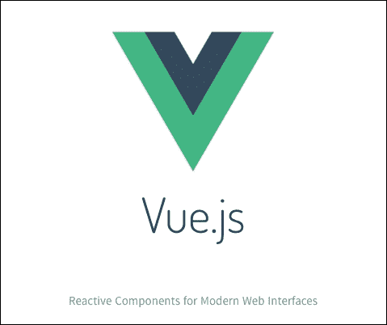

现在它声明 Vue.js 是一个渐进式 JavaScript 框架：


那么 Vue.js 到底是什么呢？框架工具图书馆它应该用于构建全栈 web 应用程序还是仅仅用于添加一些特殊功能？我应该从我最喜欢的框架切换到它吗？若有，原因为何？我可以在项目中与其他工具一起使用它吗？它可能带来什么好处？

在本章中，我们将试图找到所有这些问题的答案。我们将稍微接触一下 Vue.js，并在一些小而简单的示例中使用它。

更具体地说，我们将做以下工作：

*   了解什么是 Vue.js、它的重要部分以及它的历史
*   了解哪些项目使用 Vue.js
*   使用 Vue.js 构建一个简单的购物列表，并将实现与同一应用程序的 jQuery 实现进行比较
*   使用 Vue.js 构建一个简单的 Pomodoro 计时器
*   享受一个小而简单的运动

# 流行语

这本书里会有很多流行语、缩写和其他时髦的字母组合。请不要害怕他们。我可以告诉你更多，但是，对于使用 Vue.js 或任何其他框架所需要做的大部分事情，你不需要把它们全部背下来！但是，在任何情况下，让我们把同义词留在这里，这样你就会对本书中的任何术语感到困惑，你可以回到这里来看看：

*   **应用状态**：应用的全局集中状态。此状态下的数据在应用程序启动时初始化。任何应用程序的组件都可以访问这些数据；然而，他们无法轻易改变这一点。状态的每个项都有一个附加的变异，可以在应用程序组件内部发生特殊事件时进行调度。

*   **Bootstrap**：这是一个项目，它提供了一套样式和 JavaScript 工具，用于开发一个响应速度快、效果好的应用程序，而无需考虑 CSS。
*   **内容分发网络**（**CDN**）：这是一个特殊的服务器，其目的是以高可用性和高性能向用户传送数据。开发框架的人和公司喜欢通过 CDN 分发框架，因为它们只允许他们在安装说明中指出 CDN 的 URL。Vue.js 托管在 npmcdn 中（[https://npmcdn.com/](https://npmcdn.com/) ），这是一个可靠的全球网络，用于发布到 npm 的内容。
*   **组件**：这些是应用程序的各个部分，它们有自己的数据和视图，可以通过应用程序重用，充当建造房屋的砖块。
*   **层叠样式表**（**CSS**）：这是一组应用于 HTML 文档以使其美观的样式。
*   **声明性视图**：这些视图提供了普通 JavaScript 数据模型和表示之间直接数据绑定的方式。
*   **指令**：这些是 Vue.js 中的特殊 HTML 元素属性，允许以不同方式绑定数据。
*   **文档对象模型**（**DOM**）：这是用 HTML、XML 和 XHTML 等标记语言表示节点的约定。文档的节点被组织成一个 DOM 树。当有人说与 DOM 交互时，这只是他们说与 HTML 元素交互的奇特方式。
*   **npm**：这是一个 JavaScript 包管理器，允许搜索、安装和管理 JavaScript 包。
*   **标记**：这是一种人性化的语法，允许网络作者编写文本，而无需担心样式和 HTML 标记。降价文件有一个`.md`扩展名。
*   **模型-视图-视图-模型**（**MVVM**）：这是一种架构模式，其中心点是视图模型，充当视图和数据模型之间的桥梁，允许它们之间的数据流。
*   **模型视图控制器****MVC**：这是一种架构模式。它允许从模型中分离视图，以及信息从视图流向模型的方式，反之亦然。
*   **单向数据绑定**：这是一种数据绑定类型，其中数据模型中的更改会自动传播到视图层，而不是相反。
*   **快速原型制作**：在 Web 中，这是一种轻松快速地构建用户界面模型的技术，包括一些基本的用户交互。

*   **反应性**：在 Web 中，这实际上是将数据的任何更改立即传播到视图层。
*   **双向数据绑定**：这是一种数据绑定类型，数据模型中的更改会自动传播到视图层，视图层中发生的更改会立即反映在数据模型中。
*   **用户界面**（**UI**）：这是一组允许用户与应用程序通信的可视组件。
*   **Vuex**：这是一种针对 Vue 应用程序的架构，允许对应用程序状态进行简单管理。

# Vue.js 历史记录

何时，Evan You，Vue.js 创建者（[http://evanyou.me/](http://evanyou.me/) ），当时正在谷歌创意实验室从事其中一个项目，他们需要快速制作一个相当大的 UI 界面原型。编写大量重复的 HTML 显然耗费时间和资源，这就是为什么 Evan 开始为此目的寻找一些已经存在的工具。令他惊讶的是，他发现没有任何工具、库或框架能够完全符合快速原型的目的！当时，Angular 得到了广泛的应用，React.js 才刚刚起步，主干网等框架用于 MVC 架构的大规模应用。对于那种仅仅为了快速 UI 原型而需要一些真正灵活和轻量级的东西的项目，这些复杂的框架都不够。

当你意识到一些很酷的东西不存在并且你能够创造它时-*就去做*！

### 注

Vue.js 是作为快速原型制作工具诞生的。现在，它可以用来构建复杂的可伸缩的反应式 web 应用程序。

埃文就是这么做的。这就是他如何产生创建一个库的想法，该库通过提供一种简单灵活的反应式数据绑定和可重用组件的方式来帮助快速原型设计。

与所有优秀的库一样，Vue.js 也在不断增长和发展，因此提供了比一开始所承诺的更多的功能。目前，它提供了一种附加和创建插件、编写和使用混合插件以及总体添加自定义行为的简单方法。Vue 可以以如此灵活的方式使用，并且对应用程序的结构非常不固执己见，因此它绝对可以被视为一个能够支持复杂 web 应用程序的端到端构建的框架。

# Vue.js 最重要的一点

Vue.js 允许您简单地将数据模型绑定到表示层。它还允许您在整个应用程序中轻松重用组件。

您不需要创建特殊的模型或集合，也不需要在其中注册 events 对象。你不需要遵循一些特殊的语法。您不需要安装任何永无止境的依赖项。

您的模型是普通的 JavaScript 对象。它们被绑定到视图中您想要的任何内容（文本、输入文本、类、属性等等），并且它可以正常工作。

您可以简单地将`vue.js`文件添加到项目中并使用它。或者，您可以将`vue-cli`与 Webpack 和 Browserify 系列一起使用，这不仅可以引导整个项目，还可以支持热重新加载，并提供开发人员工具。

您可以将视图层与样式和 JavaScript 逻辑分离，也可以将它们放在同一个 Vue 文件中，并在同一位置构建组件的结构和逻辑。所有现代和常用的 IDE 都有插件支持。

您可以使用任何您想要的预处理器，也可以使用 ES2015。您可以将它与您最喜欢的开发框架一起使用，也可以使用它本身。您可以使用它来添加一个小功能，也可以使用整个 Vue 生态系统来构建复杂的应用程序。

如果您想查看它与其他框架（如 Angular 或 React）的比较，请访问[http://vuejs.org/guide/comparison.html](http://vuejs.org/guide/comparison.html) 。

如果您想了解 Vue.js 的所有精彩之处，欢迎您访问[https://github.com/vuejs/awesome-vue](https://github.com/vuejs/awesome-vue) 。

# 我们去购物吧！

我不知道怎么办，但我能感觉到你的周末快到了，你开始考虑去购物，为下周购买所需的食品杂货。除非你是一个天才，能够在头脑中保持完整的购物清单，或者你是一个谦虚的人，不需要那么多，否则你可能会在去购物之前列一张购物清单。也许你甚至可以使用一些应用程序。现在，我问你：为什么不使用你自己的应用程序？你觉得如何创建和设计它？让我们这样做吧！让我们创建自己的购物清单应用程序。让我们先为它创建一个快速原型。为购物清单构建一个交互式原型是一项非常简单的任务。

它应该显示列表，并允许我们添加和删除项目。实际上，它非常类似于待办事项列表。让我们开始使用经典的 HTML+CSS+JS+jQuery 方法。我们还将使用引导框架（[http://getbootstrap.com/](http://getbootstrap.com/) ）在不编写大量 CSS 代码的情况下，让事情变得更加美好。（是的，因为我们的书不是关于 CSS 的，而且使用引导程序制作东西非常简单！）

## 使用 jQuery 实现购物清单

很可能，您的代码最终会显示如下所示：

以下是 HTML 代码：

```js
<div class="container"> 
  <h2>My Shopping List</h2> 
  <div class="input-group"> 
    <input placeholder="add shopping list item"        
      type="text" class="js-new-item form-control"> 
    <span class="input-group-btn"> 
      <button @click="addItem" class="js-add btn btn-default"          
        type="button">Add!</button> 
    </span> 
  </div> 
  <ul> 
    <li> 
      <div class="checkbox"> 
        <label> 
          <input class="js-item" name="list"              
            type="checkbox"> Carrot 
        </label> 
      </div> 
    </li> 
    <li> 
      <div class="checkbox"> 
        <label> 
          <input class="js-item" name="list" type="checkbox"> Book 
        </label> 
      </div> 
    </li> 
    <li class="removed"> 
      <div class="checkbox"> 
        <label> 
          <input class="js-item" name="list" type="checkbox"              
            checked> Gift for aunt's birthday 
        </label> 
      </div> 
    </li> 
  </ul> 
</div> 

```

以下是 CSS 代码：

```js
.container { 
  width: 40%; 
  margin: 20px auto 0px auto; 
} 

.removed { 
  color: gray; 
} 

.removed label { 
  text-decoration: line-through; 
} 

ul li { 
  list-style-type: none; 
} 

```

以下是 JavaScript/jQuery 代码：

```js
$(document).ready(function () { 
  /** 
   * Add button click handler 
   */ 
  function onAdd() { 
    var $ul, li, $li, $label, $div, value; 

    value = $('.js-new-item').val(); 
    //validate against empty values 
    if (value === '') { 
      return; 
    } 
    $ul = $('ul'); 
    $li = $('<li>').appendTo($ul); 
    $div = $('<div>') 
        .addClass('checkbox') 
        .appendTo($li); 
    $label = $('<label>').appendTo($div); 
    $('<input>') 
        .attr('type', 'checkbox') 
        .addClass('item') 
        .attr('name', 'list') 
        .click(toggleRemoved) 
        .appendTo($label); 
    $label 
        .append(value); 
    $('.js-new-item').val(''); 
  } 

  /** 
   * Checkbox click handler - 
   * toggles class removed on li parent element 
   * @param ev 
   */ 
  function toggleRemoved(ev) { 
    var $el; 

    $el = $(ev.currentTarget); 
    $el.closest('li').toggleClass('removed'); 
  } 

  $('.js-add').click(onAdd); 
  $('.js-item').click(toggleRemoved); 
}); 

```

### 提示

**`Downloading the example code`**下载代码包的详细步骤见本书[前言](00.html#aid-9H5K1 "Preface")。该书的代码包也托管在 GitHub 上的[https://github.com/PacktPublishing/Learning-Vue.js-2](https://github.com/PacktPublishing/Learning-Vue.js-2) 。我们的丰富书籍和视频目录中还有其他代码包，请访问[https://github.com/PacktPublishing/](https://github.com/PacktPublishing/) 。看看他们！

如果在浏览器中打开页面，您可能会看到以下内容：

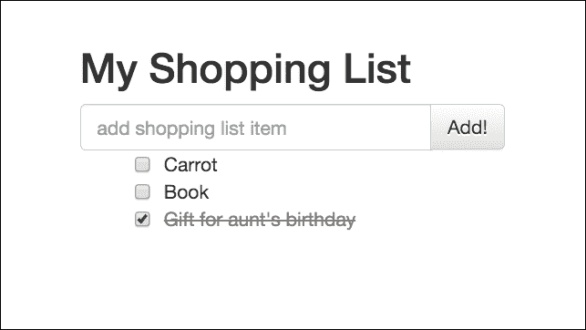

使用 HTML+CSS+jQuery 方法实现购物清单

请查看位于[的 JSFIDLEhttps://jsfiddle.net/chudaol/u5pcnLw9/2/](https://jsfiddle.net/chudaol/u5pcnLw9/2/) 。

如您所见，这是一段非常基本的 HTML 代码，包含无序的元素列表，其中每个元素都显示有一个复选框和一个文本，用户文本和**`Add!`**按钮的输入。每次点击**`Add!`**按钮时，文本输入的内容将转换为列表条目并附加到列表中。单击任何项目的复选框时，条目的状态从**`to buy`**（未选中）切换到**`bought`**（选中）。

让我们还添加一个功能，允许我们更改列表的标题（如果我们最终在应用程序中实现多个购物列表，它可能会很有用）。

因此，我们将得到一些额外的标记和更多的 jQuery 事件侦听器和处理程序：

```js
<div class="container"> 
  <h2>My Shopping List</h2> 
  <!-- ... --> 
  <div class="footer"> 
    <hr/> 
    <em>Change the title of your shopping list here</em> 
    <input class="js-change-title" type="text"
      value="My Shopping List"/> 
  </div> 
</div> 

//And javascript code: 
function onChangeTitle() { 
  $('h2').text($('.js-change-title').val()); 
} 
$('.js-change-title').keyup(onChangeTitle); 

```

在[处检查 JSFIDLEhttps://jsfiddle.net/chudaol/47u38fvh/3/](https://jsfiddle.net/chudaol/47u38fvh/3/) 。

## 使用 Vue.js 实现购物清单

这是一个非常简单的例子。让我们尝试使用 Vue.js 一步一步地实现它。有很多方法可以将`vue.js`包含到您的项目中，但在本章中，我们将通过添加**CDN**中的 JavaScript Vue 文件来包含它：

```js
<script  src="https://cdnjs.cloudflare.com/ajax/libs/vue/2.0.3/vue.js">  </script> 

```

那么，让我们从呈现元素列表开始。

创建 HTML 文件并添加以下标记：

```js
<div id="app" class="container"> 
  <h2>{{ title }}</h2> 
  <ul> 
    <li>{{ items[0] }}</li> 
    <li>{{ items[1] }}</li> 
  </ul> 
</div> 

```

现在添加以下 JavaScript 代码：

```js
var data = { 
  items: ['Bananas', 'Apples'], 
  title: 'My Shopping List' 
}; 

new Vue({ 
  el: '#app', 
  data: data 
}); 

```

在浏览器中打开它。您将看到列表呈现为：


使用 Vue.js 实现的购物清单

让我们分析一下这个例子。Vue 应用程序代码以新的`Vue`关键字开始。如何将标记绑定到应用程序数据？我们将必须绑定的 DOM 元素传递给`Vue`实例。页面中的任何其他标记都不会受到影响，也不会识别 Vue 的魔力。

如您所见，我们的标记被包装到`#app`元素中，并作为`Vue`选项映射中的第一个参数传递。`data`参数包含使用双花括号（`{{}}`在标记内部使用的对象。如果您熟悉模板预处理器（例如，把手；有关更多信息，请访问[，您可能会发现此注释非常容易理解 http://handlebarsjs.com/](http://handlebarsjs.com/) ）。

那又怎样？-你可能在惊呼。你打算教我什么？如何使用模板预处理器？非常感谢，不过我最好喝点啤酒，看足球赛。

停下来，亲爱的读者，别走，拿起你的啤酒，让我们继续我们的例子。你会发现这会很有趣！

## 使用开发工具分析数据绑定

让我们看看数据绑定在起作用。打开浏览器的开发工具，查找 JavaScript 代码，并在脚本开头添加断点。现在分析 Vue 应用程序初始化前后数据对象的外观。你看，它改变了很多。现在`data`对象已准备好进行被动数据绑定：

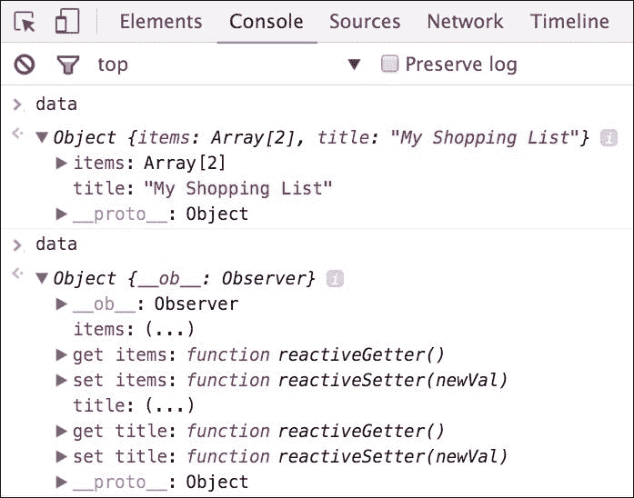

Vue 对象初始化前后的数据对象

现在，如果我们从开发者工具控制台更改`data`对象的`title`属性（我们可以这样做，因为我们的`data`是一个全局对象），它将自动反映在页面的标题中：

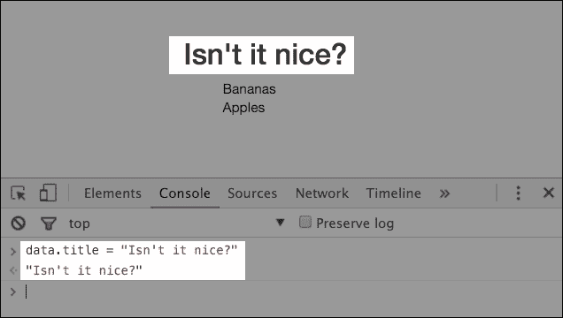

数据绑定：更改对象属性会立即影响视图

## 通过双向绑定将用户输入带入数据

因此，在我们的示例中，我们能够将普通 JavaScript 数据模型中的数据带到页面中。我们为它提供了一种从应用程序代码到页面的飞行。你不觉得如果我们能提供数据的双向飞行会很好吗？

现在让我们看看如何实现双向数据绑定，以及如何从页面更改`data`属性的值。

复制标题的 HTML 标记，更改第一个 jQuery 示例的输入，并将属性`v-model="title"`添加到`input`元素。

### 提示

您是否已经听说过 Vue.js 中的指令？恭喜你，你刚刚用了一个！实际上，`v-model`属性是 Vue.js 提供双向数据绑定的指令。您可以在 Vue 官方页面[上了解更多信息 http://vuejs.org/api/#v-型号](http://vuejs.org/api/#v-model)。

现在，购物清单应用程序代码的 HTML 代码如下所示：

```js
<div id="app" class="container"> 
  <h2>{{ title }}</h2> 
  <ul> 
    <li>{{ items[0] }}</li> 
    <li>{{ items[1] }}</li> 
  </ul> 
  <div class="footer"> 
    <hr/> 
    <em>Change the title of your shopping list here</em> 
    <input v-model="title"/> 
  </div> 
</div> 

```

就这样！

现在刷新页面并修改输入。键入时，您将看到标题自动更新：


数据绑定：更改绑定到模型属性的文本会立即影响绑定到同一属性的文本

所以，一切都很好；但是，本例仅获取两个 item 元素并将它们呈现为列表项。我们希望它独立于列表大小来呈现项目列表。

## 使用 v-for 指令呈现项目列表

因此，我们需要某种机制来迭代`items`数组，并呈现`<ul>`元素中的每个项。

幸运的是，Vue.js 为我们提供了一个很好的指令，用于迭代 JavaScript 数据结构。它被称为`v-for`。我们将在列表项`<li>`元素中使用它。修改列表的标记，使其如下所示：

```js
  <ul> 
    <li v-for="item in items">{{ item }}</li> 
  </ul> 

```

### 注

在本书中，您将学习到其他一些不错的指令，如`v-if`、`v-else`、`v-show`、`v-on`、`v-bind`等等，所以请继续阅读。

刷新页面并进行查看。页面保持不变。现在，试着从开发者工具控制台将一个项目推送到`items`数组中。试着把它们也打开。您不会惊讶地看到，`items`数组操作立即反映在页面上：

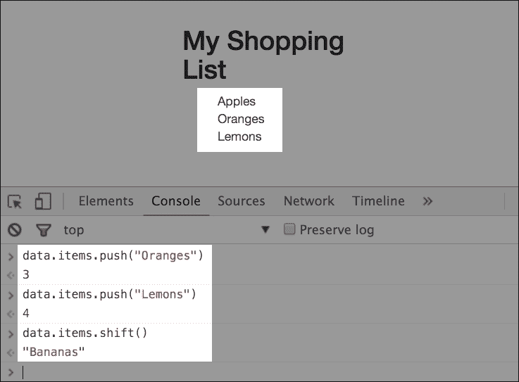

数据绑定：更改数组会立即影响基于它的列表

所以，现在我们有了一个项目列表，这些项目只在一行标记的页面上呈现。但是，我们仍然需要这些项目有一个复选框，允许我们检查已经购买的项目，或在需要时取消选中它们。

## 勾选和取消勾选购物清单项目

为了实现这种行为，让我们通过更改字符串项并将它们转换为具有两个属性`text`和`checked`（以反映状态）的对象来稍微修改`items`数组，并修改标记，为每个项添加一个复选框。

因此，数据声明的 JavaScript 代码如下所示：

```js
var data = { 
  items: [{ text: 'Bananas', checked: true },    
          { text: 'Apples',  checked: false }], 
  title: 'My Shopping List', 
  newItem: '' 
}; 

```

我们的列表标记如下所示：

```js
<ul> 
  <li v-for="item in items" v-bind:class="{ 'removed':      
    item.checked }"> 
    <div class="checkbox"> 
      <label> 
        <input type="checkbox" v-model="item.checked"> {{            
          item.text }} 
      </label> 
    </div> 
  </li> 
</ul>  

```

刷新页面并检查`items`复选框的`checked`属性以及每个列表项的删除类`<li>`是否绑定到项的`checked`布尔状态。玩游戏并尝试单击复选框以查看发生了什么。仅仅使用两个指令，我们就可以传播项的状态并更改相应的`<li>`HTML 元素的类，这不是很好吗？

## 使用 v-on 指令添加新的购物清单项目

所以现在我们只需要在代码中添加一小部分，就可以实际添加购物列表项。为了实现这一点，我们将向数据中添加一个对象，并将其命名为`newItem`。我们还将添加一个将新项推送到`items`数组的小方法。我们将在标记页面中使用`v:on`指令调用此方法，该指令用于 HTML 输入元素，该元素将用于新项目，并在用于单击添加新项目的按钮上使用。

因此，我们的 JavaScript 代码如下所示：

```js
var data = { 
  items: [{ text: 'Bananas', checked: true },    
          { text: 'Apples', checked: false }], 
  title: 'My Shopping List', 
  newItem: '' 
}; 
new Vue({ 
  el: '#app', 
  data: data, 
  methods: { 
    addItem: function () { 
      var text; 

      text = this.newItem.trim(); 
      if (text) { 
        this.items.push({ 
          text: text, 
          checked: false 
        }); 
        this.newItem = ''; 
      } 
    } 
  } 
}); 

```

我们在`data`对象中添加了一个名为`newItem`的新属性。然后，我们在 Vue 初始化`options`对象中添加了一个名为`methods`的新部分，并在该部分中添加了`addItem`方法。所有数据属性都可以通过`this`关键字在`methods`部分访问。因此，在这种方法中，我们只需获取`this.newItem`并将其推入`this.items`数组。现在，我们必须将对该方法的调用绑定到某个用户操作。如前所述，我们将使用`v-on`指令，并将其应用于新项目输入的`enter`按键和**`Add!`**按钮点击。

因此，在项目列表之前添加以下标记：

```js
<div class="input-group"> 
  <input v-model="newItem" v-on:keyup.enter="addItem"      
    placeholder="add shopping list item" type="text" class="form-      
    control"> 
  <span class="input-group-btn"> 
    <button v-on:click="addItem" class="btn btn-default"            
      type="button">Add!</button> 
  </span> 
</div> 

```

### 注

`v-on`指令将事件侦听器附加到元素。快捷方式是`@`标志。所以，你可以写`@keyup="addItem"`，而不是写`v-on:keyup="addItem"`。您可以在官方文档网站[上阅读有关`v-on`指令的更多信息 http://vuejs.org/api/#v-在](http://vuejs.org/api/#v-on)上。

让我们最后确定。现在，整个代码如下所示：

以下是 HTML 代码：

```js
<div id="app" class="container"> 
  <h2>{{ title }}</h2> 
  <div class="input-group"> 
    <input v-model="newItem" @keyup.enter="addItem"        
      placeholder="add shopping list item" type="text" 
      class="form-control"> 
  <span class="input-group-btn"> 
    <button @click="addItem" class="btn btn-default"        
      type="button">Add!</button> 
  </span> 
  </div> 
  <ul> 
    <li v-for="item in items" :class="{ 'removed': item.checked      
      }"> 
      <div class="checkbox"> 
        <label> 
          <input type="checkbox" v-model="item.checked"> {{              
            item.text }} 
        </label> 
      </div>     
    </li> 
  </ul> 
  <div class="footer hidden"> 
    <hr/> 
    <em>Change the title of your shopping list here</em> 
    <input v-model="title"/> 
  </div> 
</div> 

```

以下是 JavaScript 代码：

```js
var data = { 
  items: [{ text: 'Bananas', checked: true },    
          { text: 'Apples', checked: false }], 
  title: 'My Shopping List', 
  newItem: '' 
}; 

new Vue({ 
  el: '#app', 
  data: data, 
  methods: { 
    addItem: function () { 
      var text; 

      text = this.newItem.trim(); 
      if (text) { 
        this.items.push({ 
          text: text, 
          checked: false 
        }); 
        this.newItem = ''; 
      } 
    } 
  } 
}); 

```

这里有一个指向 JSFIDLE 的链接：[https://jsfiddle.net/chudaol/vxfkxjzk/3/](https://jsfiddle.net/chudaol/vxfkxjzk/3/) 。

# 在现有项目中使用 Vue.js

现在我可以感觉到，您已经看到将模型的属性绑定到表示层是多么容易，并且您已经开始考虑如何在现有项目中使用它。但是你会想：该死，不，我需要安装一些东西，运行`npm install`，更改项目的结构，添加指令，并更改代码。

在这里我可以告诉你：不！无需安装，无需 NPM，只需抓取`vue.js`文件，将其插入 HTML 页面并使用即可。仅此而已，没有结构更改，没有架构决策，没有讨论。就用它吧。我将向您展示我们如何在 EdEra（[中使用它 https://www.ed-era.com](https://www.ed-era.com) ）在 GitBook 章节的末尾添加一个小的“检查你自己”功能。

EdEra 是一个基于乌克兰的在线教育项目，其目标是将整个教育系统转变为现代、在线、互动和有趣的东西。事实上，我是这个年轻的 nice 项目的联合创始人和首席技术官，负责整个项目的技术部分。因此，在 EdEra，我们在开放式 EdX 平台（[上建立了一些在线课程 https://open.edx.org/](https://open.edx.org/) 和一些基于伟大的 GitBook 框架（[的交互式教育书籍 http://www.gitbook.org](http://www.gitbook.org) ）。基本上是基于 GitJS 平台的栈顶技术。它允许具备 markdown 语言和基本 Git 命令基本知识的人编写书籍并将其托管在 GitBook 服务器中。埃德拉的书可以在[上找到 http://ed-era.com/books](http://ed-era.com/books) （注意，它们都是乌克兰语）。

让我们看看我们在书中使用 Vue.js 做了什么。

在某个时候，我决定在教英语的书中关于人称代词的一章末尾加入一个小测验。因此，我包含了`vue.js`JavaScript 文件，编辑了相应的`.md`文件，并包含了以下 HTML 代码：

```js
<div id="pronouns"> 
    <p><strong>Check yourself :)</strong></p> 
    <textarea class="textarea" v-model="text" v-      
      on:keyup="checkText"> 
        {{ text }} 
    </textarea><i  v-bind:class="{ 'correct': correct,      
      'incorrect': !correct }"></i> 
</div> 

```

然后，我添加了一个自定义 JavaScript 文件，其中包括以下代码：

```js
$(document).ready(function() { 
  var initialText, correctText; 

  initialText = 'Me is sad because he is more clever than I.'; 
  correctText = 'I am sad because he is more clever than me.'; 

  new Vue({ 
    el: '#pronouns', 
    data: { 
      text: initialText, 
      correct: false 
    }, 
    methods: { 
      checkText: function () { 
        var text; 
        text = this.text.trim(); 
        this.correct = text === correctText; 
      } 
    } 
  }); 
}); 

```

### 注

您可以在此 GitHub 页面查看此代码：[https://github.com/chudaol/ed-era-book-english](https://github.com/chudaol/ed-era-book-english) 。这是一个用标记写的页面代码，插入了 HTML:[https://github.com/chudaol/ed-era-book-english/blob/master/2/osobovi_zaimenniki.md](https://github.com/chudaol/ed-era-book-english/blob/master/2/osobovi_zaimenniki.md) 。这里有一个 JavaScript 代码：[https://github.com/chudaol/ed-era-book-english/blob/master/custom/js/quiz-vue.js](https://github.com/chudaol/ed-era-book-english/blob/master/custom/js/quiz-vue.js) 。您甚至可以克隆存储库并使用`gitbook-cli`（[在本地进行尝试 https://github.com/GitbookIO/gitbook/blob/master/docs/setup.md](https://github.com/GitbookIO/gitbook/blob/master/docs/setup.md) 。

让我们看看这段代码。您可能已经检测到您已经看到甚至尝试过的部件：

*   `data`对象包含两个属性：
    *   `string`属性文本
    *   `Boolean`属性是正确的
*   `checkText`方法只是获取`text`属性，将其与正确的文本进行比较，然后将值赋给正确的值
*   `v-on`指令在 keyup 上调用`checkText`方法
*   `v-bind`指令将类`correct`绑定到`correct`属性

以下是代码在我的 IDE 中的外观：

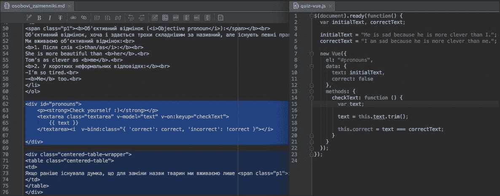

在降价驱动的项目中使用 Vue

接下来是它在浏览器中的外观：


Vue.js 在 GitBook 页面中运行


Vue.js 在 GitBook 页面中运行

在[查看 http://english.ed-era.com/2/osobovi_zaimenniki.html](http://english.ed-era.com/2/osobovi_zaimenniki.html) 。

太棒了，对吧？非常简单，非常被动！

# Vue.js 2.0！

在撰写本文时，Vue.js 2.0 已经发布（[https://vuejs.org/2016/04/27/announcing-2.0/](https://vuejs.org/2016/04/27/announcing-2.0/) ）。在这方面，请查看以下链接：

*   [http://www.infoworld.com/article/3063615/javascript/vuejs-lead-our-javascript-framework-is-faster-than-react.html](http://www.infoworld.com/article/3063615/javascript/vuejs-lead-our-javascript-framework-is-faster-than-react.html)
*   [https://www.reddit.com/r/vuejs/comments/4gq2r1/announcing_vuejs_20/](https://www.reddit.com/r/vuejs/comments/4gq2r1/announcing_vuejs_20/)

Vue.js 的第二个版本与前一个版本相比有很大的不同，从处理数据绑定的方式开始，到它的 API。它使用轻量级虚拟 DOM 实现进行渲染，支持服务器端渲染，并且速度更快、更精简。

在撰写本文时，Vue 2.0 处于早期的 alpha 阶段。不过，别担心。本书中我们将介绍的所有示例都基于 Vue 2.0 的最新稳定版本，并且完全兼容这两个版本。

# 使用 Vue.js 的项目

此时，您可能想知道有哪些项目构建在 Vue.js 之上，或者将其作为其代码库的一部分。有很多不错的开源、实验性和企业项目都在使用它。这些项目的完整且不断更新的清单可在[中找到 https://github.com/vuejs/awesome-vue#projects-使用 vuejs](https://github.com/vuejs/awesome-vue#projects-using-vuejs)。

让我们看看其中的一些。

## 语法学

语法（[https://www.grammarly.com/](https://www.grammarly.com/) 是一项帮助您正确书写英语的服务。它有几个应用程序，其中一个是一个简单的 Chrome 扩展，它只检查您填写的任何文本输入。另一个是在线编辑器，您可以使用它检查大块文本。此编辑器是使用 Vue.js 构建的！以下是在 Grammary 在线编辑器中编辑的此文本的屏幕截图：


语法：一个建立在 Vue.js 之上的项目

## 优化

优化（[https://www.optimizely.com/](https://www.optimizely.com/) 是一项帮助您测试、优化和个性化网站的服务。我使用 Packt 站点创建了一个优化实验，并在此资源中查看了 Vue.js。如下所示：

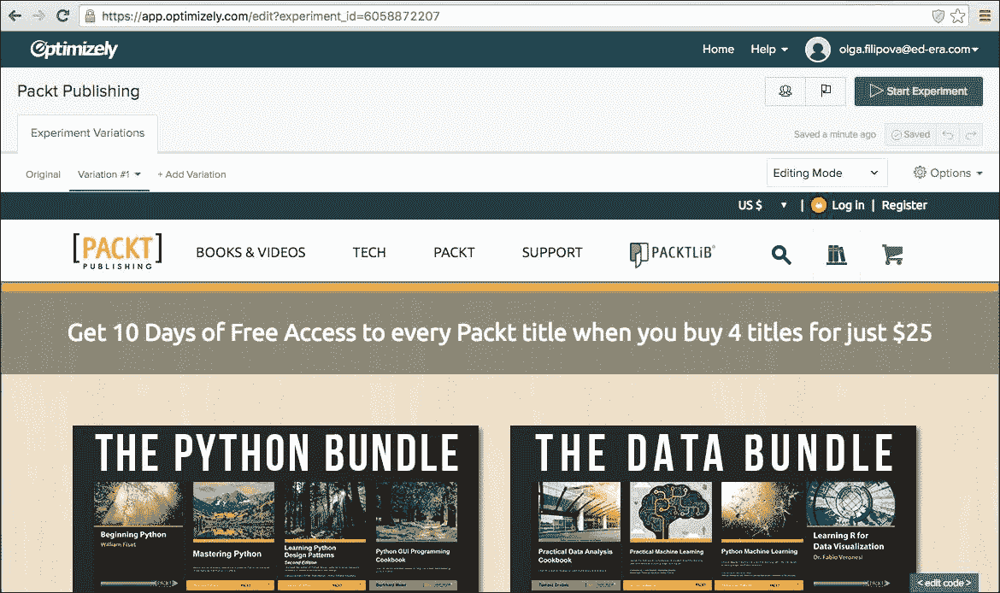

Optimizely：构建在 Vue.js 之上的项目

鼠标悬停可以打开上下文菜单，允许对页面数据进行不同的操作，包括最简单的文本编辑。让我们试试这个：


优化使用并观察 Vue.js 的运行情况

文本框将打开。当我输入时，标题中的文本会发生反应性更改。我们使用 Vue.js 看到并实现了它：


优化使用并观察 Vue.js 的运行情况

## 过滤器

FilterBlend（[https://github.com/ilyashubin/FilterBlend](https://github.com/ilyashubin/FilterBlend) 是 CSS 背景混合模式和过滤器属性的开源平台。

您可以加载图像并将混合与过滤器相结合。

如果要尝试 FilterBlend，可以在本地安装：

1.  克隆存储库：

    ```js
    git clone https://github.com/ilyashubin/FilterBlend.git

    ```

2.  进入`FilterBlend`目录：

    ```js
    cd FilterBlend

    ```

3.  安装依赖项：

    ```js
    npm install

    ```

4.  运行项目：

    ```js
    gulp

    ```

在`localhost:8000`上打开您的浏览器并四处玩。您可以看到，一旦更改右侧菜单中的某些内容，它将立即传播到左侧的图像。所有这些功能都是使用 Vue.js 实现的。检查 GitHub 上的代码。

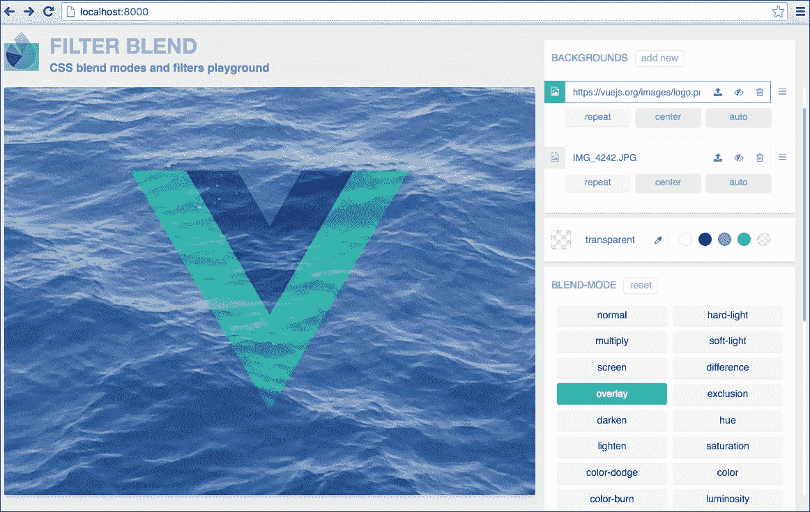

FilterBlend：构建在 Vue.js 之上的项目

## 银牌

PushSilver（[https://pushsilver.com](https://pushsilver.com) 是一项很好且简单的服务，可以让忙碌的人们创建简单的发票。它允许创建发票，发送和重新发送给客户，并保持跟踪。它是由一名从事自由职业咨询的开发人员创建的，他厌倦了每次都要为每个小项目创建发票。此工具运行良好，它是使用 Vue.js 构建的：


PushSilver：构建在 Vue.js 之上的发票管理应用程序

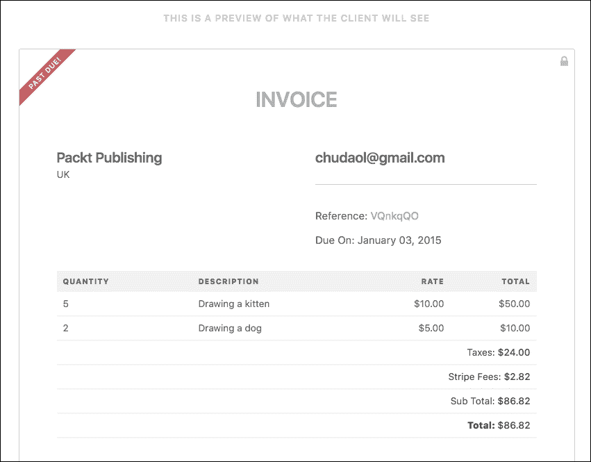

PushSilver：构建在 Vue.js 之上的发票管理应用程序

# 图书路线图

这本书，就像大部分技术书籍一样，是以一种你不需要从头到尾阅读的方式组织的。你可以选择你最感兴趣的部分，跳过其余部分。

本书的结构如下：

*   如果你正在读这篇文章，没有必要在第一章中详细说明发生了什么。
*   [第 2 章](02.html#aid-PNV61 "Chapter 2. Fundamentals – Installing and Using")、*基础知识—安装和使用*非常理论化，将解释 Vue.js 及其主要部件的幕后情况。因此，如果您不太懂理论，并且想着手编写代码，您可以跳过这一部分。在这一部分中，我们还将介绍安装和设置过程。

*   从第三章到第八章，我们将在构建应用程序时探索 Vue.js 的主要功能：
    *   在[第 3 章](03.html#aid-12AK81 "Chapter 3. Components – Understanding and Using")*组件-理解和使用*中，我们将介绍 Vue 组件，并将这些知识应用到我们的应用中。
    *   在[第 4 章](04.html#aid-1BRPS1 "Chapter 4. Reactivity – Binding Data to Your Application")*反应性-将数据绑定到您的应用程序*中，我们将使用 Vue 提供的所有数据绑定机制。
    *   在[第 5 章](05.html#aid-1HIT82 "Chapter 5. Vuex – Managing State in Your Application")中*Vuex-在您的应用程序*中管理状态，我们将介绍 Vuex 状态管理系统，并解释如何在我们的应用程序中使用它。
    *   在[第 6 章](06.html#aid-1Q5IA1 "Chapter 6. Plugins – Building Your House with Your Own Bricks")*插件-用自己的砖块建造房子*中，我们将学习如何为 Vue 应用程序创建和使用插件，以丰富其功能。
    *   在[第 7 章](07.html#aid-1TVKI1 "Chapter 7. Testing – Time to Test What We Have Done So Far!")中*测试——是时候测试我们目前所做的了！*，我们将介绍和探索 Vue.js 的定制指令，并在我们的应用程序中创建一些。
    *   在[第 8 章](08.html#aid-25JP21 "Chapter 8. Deploying – Time to Go Live!")中*部署-该上线了！*，我们将学习如何测试和部署用 Vue.js 编写的 JavaScript 应用程序。
*   在[第 9 章](09.html#aid-2ACBS1 "Chapter 9. What Is Next?")中*下一步是什么？*，我们将总结我们学到的知识，看看下一步可以做什么。

# 让我们管理时间吧！

在这个时候，我已经知道你对这本书是如此，如此，如此的热情，以至于你想不停地读到最后。但这是不对的。我们应该管理好我们的时间，给我们一些时间工作和休息。让我们创建一个小应用程序，它实现一个 Pomodoro 技术计时器，以便帮助我们管理工作时间。

### 注

**Pomodoro**技术是一种时间管理技术，以厨房番茄定时器命名（实际上，Pomodoro 在意大利语中的意思是番茄）。这项技术包括将工作时间分解为由短时间间隔分隔的小时间间隔。在官方网站[上阅读更多关于 Pomodoro 技术的信息 http://pomodorotechnique.com/](http://pomodorotechnique.com/) 。

因此，我们的目标非常简单。我们只需要创建一个非常简单的时间计数器，它将递减到工作间隔结束，然后重新启动并递减到休息时间结束，依此类推。

让我们这样做吧！

我们将介绍两个 Vue 数据变量，`minute`和`second`，它们将显示在我们的页面上。每秒钟的主方法将递减`second`；当`second`变为`0`时，将递减`minute`；当`minute`和`second`变量都达到`0`时，应用程序应在工作和休息间隔之间切换：

我们的 JavaScript 代码如下所示：

```js
const POMODORO_STATES = { 
  WORK: 'work', 
  REST: 'rest' 
}; 
const WORKING_TIME_LENGTH_IN_MINUTES = 25; 
const RESTING_TIME_LENGTH_IN_MINUTES = 5; 

new Vue({ 
  el: '#app', 
  data: { 
    minute: WORKING_TIME_LENGTH_IN_MINUTES, 
    second: 0, 
    pomodoroState: POMODORO_STATES.WORK, 
    timestamp: 0 
  }, 
  methods: { 
    start: function () { 
      this._tick(); 
      this.interval = setInterval(this._tick, 1000); 
    }, 
    _tick: function () { 
      //if second is not 0, just decrement second 
      if (this.second !== 0) { 
        this.second--; 
        return; 
      } 
      //if second is 0 and minute is not 0,        
      //decrement minute and set second to 59 
      if (this.minute !== 0) { 
        this.minute--; 
        this.second = 59; 
        return; 
      } 
      //if second is 0 and minute is 0,        
      //toggle working/resting intervals 
      this.pomodoroState = this.pomodoroState ===        
      POMODORO_STATES.WORK ? POMODORO_STATES.REST :        
      POMODORO_STATES.WORK; 
      if (this.pomodoroState === POMODORO_STATES.WORK) { 
        this.minute = WORKING_TIME_LENGTH_IN_MINUTES; 
      } else { 
        this.minute = RESTING_TIME_LENGTH_IN_MINUTES; 
      } 
    } 
  } 
}); 

```

在我们的 HTML 代码中，让我们为`minute`和`second`创建两个占位符，并为 Pomodoro 计时器创建一个开始按钮：

```js
<div id="app" class="container"> 
  <h2> 
    <span>Pomodoro</span> 
    <button  @click="start()"> 
      <i class="glyphicon glyphicon-play"></i> 
    </button> 
  </h2> 
  <div class="well"> 
    <div class="pomodoro-timer"> 
      <span>{{ minute }}</span>:<span>{{ second }}</span> 
    </div> 
  </div> 
</div> 

```

同样，我们正在使用引导程序进行样式设置，因此我们的 Pomodoro 计时器如下所示：


使用 Vue.js 构建的倒计时计时器

我们的 Pomotoro 不错，但也有一些问题：

*   首先，我们不知道正在切换哪个状态。我们不知道该工作还是休息。让我们介绍一个标题，该标题将在每次 Pomotoro 状态更改时更改。
*   另一个问题是分钟和秒数的显示不一致。例如，对于 24 分 5 秒，我们希望看到 24:05 而不是 24:5。让我们在应用程序数据中引入计算值并显示它们而不是正常值来修复它。
*   另一个问题是，我们的开始按钮可以一次又一次地点击，这会在每次点击时创建一个计时器。试着点击几次，看看你的计时器有多疯狂。让我们通过引入开始、暂停和停止按钮来修复它，将应用程序状态应用于它们，并相应地禁用状态按钮。

## 使用计算属性切换标题

让我们首先通过创建计算属性标题并在标记中使用它来解决第一个问题。

### 注

**计算属性**是`data`对象内部的属性，它允许我们避免使用一些额外的逻辑破坏模板。您可以在官方文档网站[上找到有关计算属性的更多信息 http://vuejs.org/guide/computed.html](http://vuejs.org/guide/computed.html) 。

在 Vue`options`对象中添加`computed`部分，并在其中添加属性`title`：

```js
data: { 
  //... 
}, 
computed: { 
  title: function () { 
    return this.pomodoroState === POMODORO_STATES.WORK ? 'Work!' :      
    'Rest!' 
  } 
}, 
methods: { 
//... 

```

现在只需使用以下属性，因为它是标记中的普通 Vue`data`属性：

```js
  <h2> 
    <span>Pomodoro</span> 
    <!--!> 
  </h2> 
  <h3>{{ title }}</h3> 
  <div class="well"> 

```

瞧！现在，我们有了一个标题，它在每次切换 Pomodoro 状态时都会发生变化：

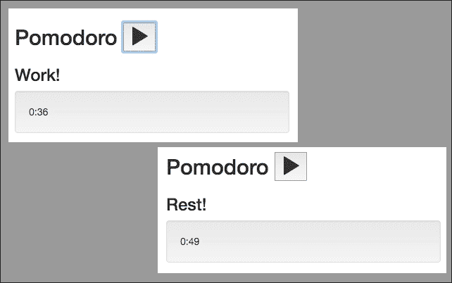

根据计时器的状态自动更改标题

很好，不是吗？

## 使用计算属性的左焊盘时间值

现在，让我们将相同的逻辑应用于左填充`minute`和`second`数字。让我们在`data`选项的`computed`部分中添加两个计算属性`min`和`sec`，并应用简单算法将数字填充到左侧的`0`。当然，我们可以使用著名的左 pad 项目（[https://github.com/stevemao/left-pad](https://github.com/stevemao/left-pad) ），但要保持简单，不要破坏整个互联网（[http://www.theregister.co.uk/2016/03/23/npm_left_pad_chaos/](http://www.theregister.co.uk/2016/03/23/npm_left_pad_chaos/) ），让我们应用我们自己的一个简单逻辑：

```js
computed: { 
  title: function () { 
    return this.pomodoroState === POMODORO_STATES.WORK ? 'Work!' :      
    'Rest!' 
  }, 
  min: function () { 
    if (this.minute < 10) { 
      return '0' + this.minute; 
    } 

    return this.minute; 
  }, 
  sec: function () { 
    if (this.second < 10) { 
      return '0' + this.second; 
    } 

    return this.second; 
  } 
} 

```

让我们使用这些属性，而不是 HTML 代码中的`minute`和`second`：

```js
   <div class="pomodoro-timer"> 
    <span>{{ min }}</span>:<span>{{ sec }}</span> 
   </div> 

```

刷新页面，查看我们的数字现在有多漂亮：


在 Vue.js 中使用计算属性进行左填充

## 通过启动、暂停和停止按钮保持状态

所以，为了解决第三个问题，让我们介绍三种应用程序状态，`started`、`paused`和`stopped`，并且让我们有三种方法可以让我们对这些状态进行置换。我们已经有了启动应用程序的方法，所以我们只需在那里添加逻辑即可将状态更改为`started`。我们还添加了两个额外的方法，`pause`和`stop`，它们将暂停计时器并更改为相应的应用程序状态：

```js
const POMODORO_STATES = { 
  WORK: 'work', 
  REST: 'rest' 
}; 
const STATES = { 
  STARTED: 'started', 
  STOPPED: 'stopped', 
  PAUSED: 'paused' 
}; 
//<...> 
new Vue({ 
  el: '#app', 
  data: { 
    state: STATES.STOPPED, 
    //<...> 
  }, 
  //<...> 
  methods: { 
    start: function () { 
      this.state = STATES.STARTED; 
      this._tick(); 
      this.interval = setInterval(this._tick, 1000); 
    }, 
    pause: function () { 
      this.state = STATES.PAUSED; 
      clearInterval(this.interval); 
    }, 
    stop: function () { 
      this.state = STATES.STOPPED; 
      clearInterval(this.interval);  
      this.pomodoroState = POMODORO_STATES.WORK; 
      this.minute = WORKING_TIME_LENGTH_IN_MINUTES; 
      this.second = 0; 
    }, 
    //<...> 
  } 
}); 

```

我们在 HTML 代码中添加两个按钮，并添加调用相应方法的`click`侦听器：

```js
    <button :disabled="state==='started'"
@click="start()"> 
      <i class="glyphicon glyphicon-play"></i> 
    </button> 
    <button :disabled="state!=='started'"       
      @click="pause()"> 
      <i class="glyphicon glyphicon-pause"></i> 
    </button> 
    <button :disabled="state!=='started' && state !== 'paused'"      
       @click="stop()"> 
      <i class="glyphicon glyphicon-stop"></i> 
    </button> 

```

现在，我们的应用程序看起来不错，允许我们启动、暂停和停止计时器：

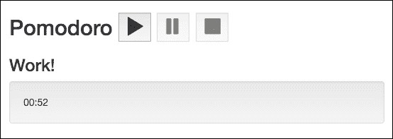

根据应用程序状态切换开始、停止和暂停按钮

在[处检查 JSFIDLE 中的整个代码 https://jsfiddle.net/chudaol/b6vmtzq1/1/](https://jsfiddle.net/chudaol/b6vmtzq1/1/) 。

经过这么多的工作和这么多的新术语和知识，你当然应该得到一只小猫！我也喜欢小猫，所以这里有一只来自很棒网站[的随机小猫 http://thecatapi.com/](http://thecatapi.com/) ：


# 运动

在本章末尾，我想提出一个小练习。毫无疑问，我们在前面的章节中构建的 Pomodoro 计时器非常棒，但是它仍然缺少一些好的特性。它能提供的一件非常好的事情是展示[中的随机小猫 http://thecatapi.com/](http://thecatapi.com/) 休息时间。你能实现这个吗？你当然可以！但请不要混淆休息和工作时间！我几乎可以肯定，如果你盯着小猫而不是工作，你的项目经理会不太喜欢的。

此练习的解决方案可在[附录](10.html#aid-2F4UM1 "Chapter 10. Solutions to Exercises")、*练习解决方案*中找到。

# 总结

我很高兴您已经达到了这一点，这意味着您已经知道什么是 Vue.js，如果有人问您它是工具、库还是框架，您肯定会找到答案。您还知道如何使用 Vue.js 启动应用程序，以及如何在现有项目中使用 Vue 的功能。您玩了一些用 Vue.js 编写的非常好的项目，并开始开发自己的一些项目！现在，您不仅可以购物，还可以使用 Vue.js 创建的购物列表购物！现在，你不需要从厨房偷你的西红柿定时器来在工作时把它用作 Pomodoro 定时器；您可以使用自己用 Vue.js 制作的数字 Pomotoro 计时器。最后但并非最不重要的一点是，现在还可以使用 Vue.js 在 JavaScript 应用程序中插入随机小猫。

在下一章中，我们将介绍 Vue 的幕后，它是如何工作的，为什么工作的，以及它使用的架构模式。每一个概念都将用一个例子加以说明。然后，我们将准备将我们的手深入到代码中，并改进我们的应用程序，使它们达到令人惊叹的状态。