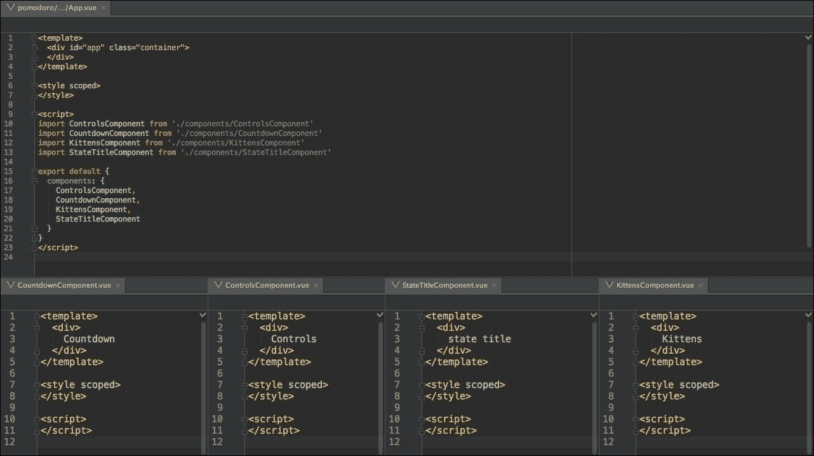
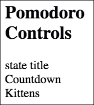

# 三、组件——理解和使用

在上一章中，您了解了 Vue.js 的工作原理。您看到了幕后情况，甚至对核心 Vue.js 代码进行了轻微调试。您学习了 Vue 的一些关键概念。您还学习并尝试了安装 Vue.js 的不同方法。我们已经启动了应用；我们将从本章开始发展和提高。我们还了解了如何调试和测试我们的应用。

在第一章中，我们讨论了组件，甚至创建了一些组件。在本章中，我们将在应用中使用组件，并看到一些有趣的指令。尽管如此，在本章中，我们将做以下工作：

*   重新访问组件主题并查看组件是什么
*   为我们的应用创建组件
*   了解什么是单文件组件
*   了解如何使用特殊属性实现反应式 CSS 转换

# 重访组件

正如您在前几章中肯定记得的那样，组件是 Vue 应用的特殊部分，具有自己的数据和方法范围。组件可以在整个应用中使用和重用。在上一章中，您了解到组件是使用`Vue.extend({...})`方法创建的，并使用`Vue.component()`语法注册的。因此，为了创建和使用组件，我们将编写以下 JavaScript 代码：

```js
//creating component 
var HelloComponent = Vue.extend({ 
  template: '<h1>Hello</h1>' 
}); 
//registering component 
Vue.component('hello-component', HelloComponent); 

//initializing the Vue application 
new Vue({ 
  el: '#app' 
}); 

```

然后，我们将在 HTML 中使用`hello-component`：

```js
<div id='app'> 
  <hello-component></hello-component> 
</div> 

```

### 提示

初始化和注册都可以编写为一个带有相应选项的`Vue.component`调用：

`Vue.component('hello-component', { template: '<h1>Hello</h1>' });`

# 使用组件的好处

在深入研究组件并使用它们重写应用之前，我们需要了解一些事情。在本节中，我们将介绍组件内的处理`data`和`el`属性、组件模板、范围和预处理器。

## 在 HTML 中声明模板

在上一个示例中，我们创建了一个 Vue 组件，其模板以字符串形式编写。这其实很简单，也很好，因为我们的组件中有我们所需要的一切。现在想象一下我们的组件具有更复杂的 HTML 结构。编写复杂的 HTML 字符串模板容易出错、难看，而且不符合最佳实践。

### 提示

所谓最佳实践，我指的是干净且可维护的代码。以字符串形式编写的复杂 HTML 是不可维护的。

Vue 允许在一个特殊的`<template>`标记内的 HTML 文件中声明模板！

因此，为了重写我们的示例，我们将声明一个 HTML 标记模板，其中包含相应的标记：

```js
<template id="hello"> 
  <h1>Hello</h1> 
</template> 

```

然后，在我们的组件中，我们将只使用模板的 ID，而不是 HTML 字符串：

```js
Vue.component('hello-component', { 
  template: '#hello' 
}); 

```

我们的整个代码如下所示：

```js
<body> 
  <template id="hello"> 
    <h1>Hello</h1> 
  </template> 

  <div id="app"> 
    <hello-component></hello-component> 
  </div> 

  <script src="vue.js"></script> 
  <script> 
    Vue.component('hello-component', { 
      template: '#hello' 
    }); 

    new Vue({ 
      el: '#app' 
    }); 
  </script> 
</body> 

```

在前面的示例中，我们只对组件使用了`template`属性。让我们继续看一看组件内部应该如何处理`data`和`el`属性。

## 处理组件内部的数据和 el 属性

如前所述，该组件的语法与 Vue 实例的语法相同，但它必须扩展 Vue，而不是直接调用它。在这个前提下，创建如下组件似乎是正确的：

```js
var HelloComponent = Vue.extend({ 
  el: '#hello', 
  data: { msg: 'Hello' } 
}); 

```

但这将导致范围泄漏。`HelloComponent`的每个实例都将共享相同的`data`和`el`。这并不是我们想要的。这就是 Vue 明确要求将这些属性声明为函数的原因：

```js
var HelloComponent = Vue.component('hello-component', { 
  el: function () { 
    return '#hello'; 
  }, 
  data: function () { 
    return { 
      msg: 'Hello' 
    } 
  } 
}); 

```

即使您犯了错误并将`data`或`el`属性声明为对象或元素，Vue 也会善意地警告您：


将数据用作对象而不是 Vue 组件内部的函数时，Vue 的警告

## 组件的范围

如前所述，所有组件都有自己的作用域，其他组件无法访问。尽管如此，所有注册组件都可以访问全局应用范围。您可以将组件的作用域视为本地作用域，将应用的作用域视为全局作用域。都一样。但是，在组件中使用父级数据并不简单。您必须在组件内部明确指出应该使用`prop`属性访问哪些父级的数据属性，并使用`v-bind`语法将它们绑定到组件实例。让我们看看它在我们的`HelloComponent`示例中是如何工作的。

让我们先用包含属性`msg`的数据声明`HelloComponent`：

```js
Vue.component('hello-component', { 
  data: function () { 
    return { 
      msg: 'Hello' 
    } 
  } 
}); 

```

现在，让我们创建一个`Vue`实例，其中包含一些数据：

```js
new Vue({ 
  el: '#app', 
  data: { 
    user: 'hero' 
  } 
});  

```

在 HTML 中，让我们创建一个模板，并使用模板的 ID 将其应用于组件：

```js
//template declaration 
<template id="hello"> 
  <h1>{{msg}} {{user}}</h1> 
</template> 

//using template in component 
Vue.component('hello-component', { 
  template: '#hello', 
  data: function () { 
    return { 
      msg: 'Hello' 
    } 
  } 
}); 

```

为了查看页面上的组件，我们应该在`app`容器的 HTML 中调用它：

```js
<div id="app"> 
  <hello-component></hello-component> 
</div> 

```

如果在浏览器中打开页面，只会看到**`Hello`**；`user`数据属性仍未绑定到组件：


父级的数据属性尚未绑定到我们的 Vue 组件

为了绑定来自父 Vue 应用的数据，我们必须执行以下两项操作：

*   在组件的`prop`属性中指示此属性
*   将其绑定到`hello-component`调用：

```js
//calling parent's data attributes in the component 
Vue.component('hello-component', { 
  template: '#hello', 
  data: function () { 
    return { 
      msg: 'Hello' 
    } 
  }, 
  props: ['user'] 
}); 

//binding a user data property to the component 
<div id="app"> 
  <hello-component v-bind:user="user"></hello-component> 
</div> 

```

刷新页面，您将看到它现在如何向您表示问候：


将父级的`data`属性正确绑定到组件后，一切都按预期工作。

### 提示

实际上，`v-bind:user`语法只需使用以下命令即可实现：

`:user<hello-component **:user="user"**></hello-component>`

## 其他部件内部的部件

组件的美妙之处在于，它们可以在其他组件中作为乐高积木和积木使用和重复使用！让我们构建另一个组件；我们称之为**问候语，**将由两个子组件组成：询问用户名的表单和我们的`hello`组件。

为了做到这一点，让我们声明表单的模板和我们已经熟悉的`hello`模板：

```js
<!--template for the form--> 
<template id="form"> 
  <div> 
    <label for="name">What's your name?</label> 
    <input v-model="user" type="text" id="name"> 
  </div> 
</template> 

//template for saying hello 
<template id="hello"> 
  <h1>{{msg}} {{user}}</h1> 
</template> 

```

现在，我们将基于这些模板注册两个 Vue 组件：

```js
//register form component 
Vue.component('form-component', { 
  template: '#form', 
  props: ['user'] 
}); 
//register hello component 
Vue.component('hello-component', { 
  template: '#hello', 
  data: function () { 
    return { 
      msg: 'Hello' 
    } 
  }, 
  props: ['user'] 
}); 

```

最后，我们将创建同时使用`form`和`hello`组件的问候语模板。不要忘记，我们必须在组件调用上绑定`user`属性：

```js
<template id="greetings"> 
  <div> 
    <form-component :user="user"></form-component> 
    <hello-component :user="user"></hello-component> 
  </div> 
</template> 

```

此时，我们可以创建问候语组件并在其中使用问候语模板。让我们初始化一个`data`函数，该函数使用该组件中的用户名：

```js
//create greetings component based on the greetings template 
Vue.component('greetings-component', { 
  template: '#greetings', 
  data: function () { 
    return { 
      user: 'hero' 
    } 
  } 
}); 

```

在主应用容器中，我们现在将调用问候语组件：

```js
<div id="app"> 
  <greetings-component></greetings-component> 
</div> 

```

不要忘记初始化 Vue 应用：

```js
new Vue({ 
  el: '#app' 
}); 

```

在浏览器中打开页面。您应该看到如下内容：


该页面由各种 Vue 组件构建

尝试更改输入中的名称。您希望它在问候语标题中也会更改，因为我们已将其绑定到它。但奇怪的是，它没有改变。这其实是正常的行为。默认情况下，所有道具都遵循单向数据绑定。这意味着，如果数据在父级范围内发生更改，这些更改将传播到子组件，但反之亦然。这样做是为了防止子组件意外改变父状态。但是，可以通过调用事件强制子组件与其父组件通信。检查位于[的 Vue 文档 https://vuejs.org/guide/components.html#Custom-事件](https://vuejs.org/guide/components.html#Custom-Events)。

在我们的例子中，我们可以将一个用户模型绑定到表单`input`组件，并在用户每次在输入框中输入时发出`input`事件。我们通过使用`v-on:input`修饰符来实现它，就像本节在[中描述的那样 https://vuejs.org/guide/components.html#Form-使用自定义事件](https://vuejs.org/guide/components.html#Form-Input-Components-using-Custom-Events)输入组件。

因此，我们必须将`v-model:user`传递给`form-component`：

```js
<form-component v-model="user"></form-component> 

```

然后，`form-component`应该接受`value`道具并发出`input`事件：

```js
Vue.component('form-component', { 
  template: '#form', 
  props: ['value'], 
  methods: { 
    onInput: function (event) { 
      this.$emit('input', event.target.value) 
    } 
  } 
}); 

```

`form-component`模板内的输入框应将`v-on:input`和`onInput`方法绑定到`v-on:input`修饰符：

```js
<input v-bind:value="value" type="text" id="name" v-on:input="onInput"> 

```

### 提示

实际上，在 Vue 2.0 之前，通过使用`.sync`修饰符明确告知绑定到**sync**的属性：`<form-component :user.sync="user"></form-component>`就可以实现组件与其父级之间的这种双向同步

刷新页面。现在，您可以更改输入中的名称，它将立即传播到父级的范围，从而传播到依赖此属性的其他子组件：


使用.sync 修饰符绑定属性允许在父组件和子组件之间进行双向数据绑定

您可以在[的 JSFIDLE 中找到此示例的完整代码 https://jsfiddle.net/chudaol/1mzzo8yn/](https://jsfiddle.net/chudaol/1mzzo8yn/) 。

### 提示

在 Vue 2.0 发布之前，还有一个数据绑定修改器`.once`。使用此修改器，数据将仅绑定一次，任何其他更改都不会影响组件的状态。比较以下各项：

`<form-component **:user="user"**></form-component>`

`<form-component **:user.sync="user"**></form-component>`

`<form-component **:user.once="user"**></form-component>`

# 用简单组件重写购物清单

现在我们已经了解了很多组件，让我们使用它们重写我们的购物清单应用。

### 提示

对于应用的重写，我们将使用此版本的购物清单应用作为基础：[https://jsfiddle.net/chudaol/vxfkxjzk/3/](https://jsfiddle.net/chudaol/vxfkxjzk/3/) 。

当我们开始讨论组件时，我们已经做过了。但当时，我们在组件的选项中使用了字符串模板。现在让我们使用模板来完成这项工作，就像我们刚刚学会的那样。让我们看一下界面，然后再次确定组件：


我们的购物清单应用将有四个组件

因此，我建议我们的购物清单应用由以下四个组件组成：

*   `AddItemComponent`：负责向购物清单中添加新项目的组件
*   `ItemComponent`：负责在购物清单中呈现新项目的组件
*   `ItemsComponent`：负责呈现和管理`ItemComponent`列表的组件
*   `ChangeTitleComponent`：负责更改列表标题的组件

## 定义所有组件的模板

假设组件本身已经定义和注册，那么让我们为这些组件创建模板。

### 注

**`CamelCase VS kebab-case`**您可能已经注意到，当我们在 CamelCase（`var HelloComponent=Vue.extend({...})`中声明描述组件的变量时，我们在 kebab case 中将它们命名为：`Vue.component('hello-component', {...})`。我们之所以这样做，是因为 HTML 属性不区分大小写。因此，购物清单应用的组件将被调用如下：

`add-item-component`

`item-component`

`items-component`

`change-title-component`

看看我们的标记以前是怎样的（[https://jsfiddle.net/chudaol/vxfkxjzk/3/](https://jsfiddle.net/chudaol/vxfkxjzk/3/) ）。

让我们使用模板和组件的名称重写它。在这一部分中，我们将只关心表示层，将数据绑定和操作处理留给将来的实现。我们只是复制和粘贴应用的 HTML 部分，并将其分发到我们的组件上。我们的四个模板如下所示：

```js
<!--add new item template--> 
<template id="add-item-template"> 
  <div class="input-group"> 
    <input @keyup.enter="addItem" v-model="newItem" 
      placeholder="add shopping list item" type="text" 
      class="form-control"> 
    <span class="input-group-btn"> 
      <button @click="addItem" class="btn btn-default" 
        type="button">Add!</button> 
    </span> 
  </div> 
</template> 

<!--list item template--> 
<template id="item-template"> 
  <li :class="{ 'removed': item.checked }"> 
    <div class="checkbox"> 
      <label> 
        <input type="checkbox" v-model="item.checked"> {{ item.text }} 
      </label> 
    </div> 
  </li> 
</template> 

<!--items list template--> 
<template id="items-template"> 
  <ul> 
    <item-component v-for="item in items" :item="item">
    </item-component> 
  </ul> 
</template> 

<!--change title template--> 
<template id="change-title-template"> 
  <div> 
    <em>Change the title of your shopping list here</em> 
    <input v-bind:value="value" v-on:input="onInput"/> 
  </div> 
</template> 

```

因此，我们的主要组件的标记将由一些组件组成：

```js
<div id="app" class="container"> 
  <h2>{{ title }}</h2> 
  <add-item-component></add-item-component> 
  <items-component :items="items"></items-component> 
  <div class="footer"> 
    <hr/> 
    <change-title-component v-model="title"</change-title-component> 
  </div> 
</div> 

```

如您所见，每个模板的大部分都是相应 HTML 代码的简单复制和粘贴。

然而，也存在一些显著的差异。例如，列表项模板略有更改。您之前已经学习并使用了`v-for`指令。在前面的示例中，我们将此指令用于 HTML 元素，如`<li>`。现在您可以看到，它还可以与 Vue 自定义组件一起使用。

您可能还注意到更改标题模板中的一个小差异。现在它绑定了一个值，并发出绑定到`v-on:input`修饰符的`onInput`方法。正如您在上一节中了解到的，子组件不能直接影响父组件的数据，这就是我们必须使用事件系统的原因。

## 定义并注册所有组件

请看一下我们之前的购物清单应用中的 JavaScript 代码：[https://jsfiddle.net/chudaol/c8LjyenL/](https://jsfiddle.net/chudaol/c8LjyenL/) 。让我们添加创建 Vue 组件的代码。我们将使用已定义模板的 ID 作为其`template`属性。另外，不要忘记从父应用传递属性的`props`属性。因此，我们添加了以下代码：

```js
//add item component 
Vue.component('add-item-component', { 
  template: '#add-item-template', 
  data: function () { 
    return { 
      newItem: '' 
    } 
  } 
}); 
//item component 
Vue.component('item-component', { 
  template: '#item-template', 
  props: ['item'] 
}); 
//items component 
Vue.component('items-component', { 
  template: '#items-template', 
  props: ['items'] 
}); 
//change title component 
Vue.component('change-title-component', { 
  template: '#change-title-template', 
  props: ['value'], 
  methods: { 
    onInput: function (event) { 
      this.$emit('input', event.target.value) 
    } 
  } 
}); 

```

如您所见，在每个组件的`props`中，我们只传递了与组件相关的不同数据属性。我们还将`newItem`属性移到了`add-item-component`的`data`属性。在`change-title-component`中，我们添加了发出输入事件的`onInput`方法，因此父组件中的标题受用户在输入框中键入的任何内容的影响。

在浏览器中打开 HTML 文件。界面与之前完全相同！我们在本节中所做工作的完整代码可以在 JSFIDLE 中的[中找到 https://jsfiddle.net/chudaol/xkhum2ck/1/](https://jsfiddle.net/chudaol/xkhum2ck/1/) 。

# 运动

虽然我们的应用看起来与之前完全一样，但它的功能丢失了。它不仅没有添加项，而且还显示了 devtools 控制台中的丑陋错误。

请使用事件发送系统恢复添加项目功能。

本练习的可能解决方案可在附录*练习解决方案中找到。*

# 单文件组件

我们从旧的最佳实践中知道，将 HTML 与 CSS 和 JavaScript 文件分开总是好的。一些现代框架，如 React，正在放松并逐渐消除这一规则。现在，看到小文件或其中包含自己的标记、样式和应用代码的组件，您不会感到震惊。实际上，对于小组件，我们甚至发现拥有这样的体系结构更方便。Vue 还允许在同一文件中定义与同一组件相关的所有内容。这种组件称为单文件组件。

### 注

单个文件 Vue 组件是具有`.vue`扩展名的文件。包含这些组件的应用可以使用`webpack vue`配置构建。要构建具有这种配置的应用，最简单的方法是使用`vue-cli`（[https://github.com/vuejs-templates/webpack](https://github.com/vuejs-templates/webpack) ）。

Vue 组件最多可以包含三个部分：

*   `<script>`
*   `<template>`
*   `<style>`

每一部分都对你的想法负责。将 HTML 模板应该负责的内容放入`<template>`标记中，将负责 Vue 组件、方法、数据、道具等的 JavaScript 代码放入`<script>`标记中。`<style>`标签应包含给定组件的 CSS 样式。

你还记得我们的`hello-component`吗？请在[的 JSFIDLE 中查看它 https://jsfiddle.net/chudaol/mf82ts9a/2/](https://jsfiddle.net/chudaol/mf82ts9a/2/) 。

首先，使用带有`vue-cli`的`webpack-simple`配置搭建应用：

```js
npm install -g vue-cli vue init webpack-simple hello

```

为了将其重写为 Vue 组件，我们创建了`HelloComponent.vue`文件并添加了以下代码：

```js
<template> 
  <h1>{{ msg }}</h1> 
</template> 

<script> 
export default { 
  data () { 
    return { 
      msg: 'Hello!' 
    } 
  } 
} 
</script> 

```

注意，我们不需要在 JavaScript 组件定义中指定模板。作为单个文件组件，应该使用的模板是该文件中定义的模板。您可能还注意到，我们在这里使用 ES6 样式。另外，不要忘记，`data`属性应该是函数而不是对象。

在我们的主脚本中，我们必须创建 Vue 应用并指示其使用`HelloComponent`：

```js
import Vue from 'vue' 
import HelloComponent from './HelloComponent.vue' 

new Vue({ 
  el: '#app', 
  components: { HelloComponent } 
}); 

```

我们的`index.html`加价不会改变。它仍将调用`hello-component`：

```js
<body> 
  <div id="app"> 
    <hello-component></hello-component> 
  </div> 
  <script src="./dist/build.js"></script> 
</body> 

```

现在我们只需要安装`npm`依赖项（如果您还没有安装）并构建应用：

```js
npm install 
npm run dev

```

一旦您这样做，您的浏览器将自动打开`localhost:8080`页面！

检查[第 3 章/你好](https://github.com/PacktPublishing/Learning-Vue.js-2/tree/master/chapter3/hello)文件夹中的完整代码。

您还可以测试、修改、重新测试和检查位于[的 WebPackageBin 中的`hello`组件 http://www.webpackbin.com/N1LbBIsLb](http://www.webpackbin.com/N1LbBIsLb) 。

### 提示

Webpackbin 是一个很好的服务，可以运行和测试用 Webpack 构建的应用。这是一个非常好的工具，尽管它仍处于测试阶段。由于它还很年轻，它还有一些小问题。例如，如果您尝试下载整个项目的包，它将不会生成。

## IDE 插件

Vue 的创建者和贡献者考虑了开发人员，并为大量现代 IDE 开发了插件。您可以在[找到它们 https://github.com/vuejs/awesome-vue#syntax-突出显示](https://github.com/vuejs/awesome-vue#syntax-highlighting)。如果您像我一样使用 IntelliJ 提供的 WebStorm IDE，请按照以下说明安装 Vue 支持插件：

1.  进入**`Preferences`****`P`****`lugins`**。
2.  点击**`Browse repositories`**。
3.  在搜索框中键入`vue`。
4.  选择**`Vue.js`**点击**`Install`**按钮：


安装 webstorm IDE 的 Vue 插件

## 风格与范围

很明显，组件的模板和脚本只属于它。但是，这一点不适用于样式。例如，尝试向我们的`hello`组件添加`style`标记，并为`<h1>`标记添加红色 CSS 规则：

```js
<style> 
  h1 { 
    color: red; 
  } 
</style> 

```

现在，当页面刷新时，**`Hello!`**标题的颜色很可能会变为红色。现在尝试将`<h1>`标记添加到主`index.html`文件中。您可能会感到惊讶，但它也会是红色的：

```js
<div id="app"> 
  <h1>This is a single file component demo</h1> 
  <hello-component></hello-component> 
</div> 

```


所有的

# 标记都具有我们在组件中定义的样式

要使样式仅附加到组件的范围，我们需要将属性`scoped`指示给`<style>`标记：

```js
<style scoped> 
  h1 { 
    color: red; 
  } 
</style> 

```

查看页面，您将看到只有**`Hello!`**文本是红色的，另一个`h1`有其默认样式。

## 热装

您可能已经注意到，现在我不再要求您刷新页面，而是要求您查看页面。这是因为当应用使用`vue-cli`Webpack 脚手架方法引导时，每次更改都会自动刷新页面。由于`vue-hot-reload`API 可以监视应用的文件，并告诉浏览器在每次发生更改时自动重新加载，所以这种神奇的效果得以实现！耶！

## 预处理器

如果您喜欢预处理器，那么非常欢迎您在`.vue`组件中使用它们。这是可能的，因为`vue-loader`允许使用网页包加载器。

### 注

您可以在教程[中找到更多关于`vue-loaders`和预处理器的信息 http://vue-loader.vuejs.org/en/](http://vue-loader.vuejs.org/en/) 。

### HTML 预处理器

为了能够在单个文件 Vue 组件中使用预处理器，只需将`lang`属性添加到`<template>`标记中！不要忘记安装相应的节点模块：

```js
npm install jade --save-dev 

```

例如，在我们的`hello`组件模板中使用`jade`将非常简单，如下所示：

```js
<template lang="jade"> 
  h1 {{ msg }} 
</template> 

```

### CSS 预处理器

同样的逻辑也适用于 CSS 预处理器。例如，让我们看看如何使用 sass 预处理器：

```js
<style lang="sass" scoped> 
  $red: red; 
  h1 { 
    color: $red; 
  } 
</style> 

```

### 提示

与上一个示例一样，不要忘记安装相应的加载程序以使其工作：`npm install sass-loader node-sass --save-dev`

### JavaScript 预处理器

也可以使用任何 JavaScript 预处理器。与前面两个示例一样，只需使用`lang`属性指定要使用的预处理器。别忘了通过`npm`安装！

```js
> npm install coffee-loader coffee-script --save-dev 
<script lang="coffee"> 
  exports.default = data: -> 
  { msg: 'Hello!' } 
</script> 

```

# 使用单文件组件重写我们的购物清单应用

既然我们已经了解了很多组件以及如何使用它们，也知道了一些使代码更容易编写的好技术，那么让我们回到我们的购物清单，并将其重写为单文件组件的 Vue 应用。为了便于设置，我们可以将`vue-cli`与网页包配置一起使用。事实上，我们已经在[第 2 章](02.html#aid-PNV61 "Chapter 2. Fundamentals – Installing and Using")、*基础-安装和使用*中做过。所以，只要找到这个应用并准备好开始使用它。如果找不到，可以轻松创建：

```js
#install vue-cli if you still hadn't installed it 
$ npm install vue-cli -g 
#bootstrap the application 
$ vue init webpack shopping-list 
$ cd shopping-list 
$ npm install 
$ npm run dev 

```

确保您的`index.html`文件如下所示：

```js
<!DOCTYPE html> 
<html> 
  <head> 
    <meta charset="utf-8"> 
    <title>shopping-list</title> 
    <link rel="stylesheet" 
      href="https://maxcdn.bootstrapcdn.com/bootstrap/
      3.3.6/css/bootstrap.min.css"> 
  </head> 
  <body> 
    <app></app> 
  </body> 
</html> 

```

您的`main.js`文件应该如下所示：

```js
import Vue from 'vue' 
import App from './App' 

new Vue({ 
  el: 'app', 
  components: { App } 
}) 

```

我们现在已经准备好创建组件并用它们填充应用。当然，您还记得我们的购物清单基本上有四个组成部分：

*   `AddItemComponent`：负责向购物清单中添加新项目的组件
*   `ItemComponent`：负责在购物清单中呈现新项目的组件
*   `ItemsComponent`：负责呈现和管理`ItemComponent`列表的组件
*   `ChangeTitleComponent`：负责更改列表标题的组件

让我们在`components`文件夹中创建它们。首先，只需在每个部分中包含三个空部分`(<template>`、`<script>`和`<style>`，并在主`App.vue`组件中的正确位置调用它们。请在模板中添加一些内容，使我们能够明显识别页面上的不同组件。因此，我们所有四个组件的代码如下所示：


购物清单应用的所有四个组件的代码

现在打开`App.vue`组件。这是我们将所有组件组装在一起的主要组件。

移除`<template>`、`<script>`和`<style>`标签上的所有内容。我们现在将开始构建我们的应用。

首先，我们必须导入`App.vue`将使用的组件（在本例中为所有组件）。

### 提示

不要忘记，由于我们在此应用中使用 ES2015，我们可以使用导入/导出和所有其他漂亮的 ES2015。

在`<script>`标记中，我们导入组件并导出包含导入组件的对象和返回购物清单项目的数据函数：

```js
<script> 
  import AddItemComponent from './components/AddItemComponent' 
  import ItemsComponent from './components/ItemsComponent' 
  import ChangeTitleComponent from './components/ChangeTitleComponent' 

  export default { 
    components: { 
      AddItemComponent, 
      ItemsComponent, 
      ChangeTitleComponent 
    }, 
    data () { 
      return { 
        items: [{ text: 'Bananas', checked: true }, 
                { text: 'Apples', checked: false }] 
      } 
    }, 
    methods: { 
      addItem (text) { 
        this.items.push({ 
          text: text, 
          checked: false 
        }) 
      } 
    } 
  } 
</script> 

```

我们的模板基本上可以与使用简单组件在购物清单应用中构建的模板相同。现在让我们删除所有关于模型和数据绑定的内容。首先，插入负责添加项目的组件，然后插入包含所有项目的组件，然后在页脚中插入负责更改标题的组件。

我们的模板将如下所示：

```js
<template> 
  <div id="app" class="container"> 
    <h2>{{ title }}</h2> 
    <add-item-component></add-item-component> 
    <items-component></items-component> 
    <div class="footer"> 
      <hr/> 
      <change-title-component></change-title-component> 
    </div> 
  </div> 
</template> 

```

您还记得组件变量的名称是 CamelCased 的，当它们在模板中使用时，应该使用 kebab case 调用它们，对吗？很好，让我们看看它在浏览器中的外观：


由单个文件组件构建的购物清单应用

看起来没那么漂亮吧？让我们用它们的模板填充每个组件。

### 提示

我们将继续为此应用使用 Bootstrap 的 CSS 样式。将其全局包含在`index.html`文件中：`<link rel="stylesheet" href=" https://maxcdn.bootstrapcdn.com/bootstrap/3.3.6/css/bootstrap.min.css">`

## 附加组件

【开放】。让我们填写它的`<template>`。它将如下所示：

```js
<template> 
  <div> 
    <div class="input-group"> 
      <input type="text" class="input form-control" 
        placeholder="add shopping list item"> 
      <span class="input-group-btn"> 
        <button class="btn btn-default" type="button">Add!</button> 
      </span> 
    </div> 
  </div> 
</template> 

```

如果您在浏览器中查看该页面，您已经可以看到它发生了变化，并且作为我们的购物清单应用变得更容易识别。

## 配置 ItemComponent 和 ItemsComponent

现在让我们转到`ItemComponent`。我们将仅复制并粘贴简单组件示例中的 HTML：

```js
//ItemComponent.vue 
<template> 
  <li :class="{ 'removed': item.checked }"> 
    <div class="checkbox"> 
      <label> 
        <input type="checkbox" v-model="item.checked"> {{ item.text }} 
      </label> 
    </div> 
  </li> 
</template> 

```

让我们也为这个组件添加一些`scoped`样式。该组件的特定样式是与`<li>`、`<span>`和`.removed`类相关的样式。让我们将它们复制并粘贴到此组件中：

```js
//ItemComponent.vue 
<style scoped> 
  .removed { 
    color: gray; 
  } 
  .removed span { 
    text-decoration: line-through; 
  } 
  li { 
    list-style-type: none; 
  } 
  li span { 
    margin-left: 5px; 
  } 
</style> 

```

现在打开`ItemsComponents`。正如您所记得的，它是一个`ItemComponent` 元素的列表。即使你不记得了，我猜这个组件名称的复数特征表明了这一点。为了能够使用`ItemComponent`，它必须导入并在`components`属性中注册。因此，让我们先修改脚本：

```js
//ItemsComponent.vue 
<script> 
  import ItemComponent from './ItemComponent' 

  export default { 
    components: { 
      ItemComponent 
    } 
  } 
</script> 

```

现在您可以在`<template>`中使用`item-component`！您还记得如何使用`vue.js`进行迭代吗？你当然知道！这就是您现在打开`<template>`标记并编写以下代码的原因：

```js
//temsComponent.vue 
<template> 
  <div> 
    <item-component v-for="item in items" :item="item">
    </item-component> 
  </div> 
</template> 

```

如果你现在查看页面，你会惊讶地发现事情实际上不起作用。web 控制台充满了错误。你能找出原因吗？

您还记得当子组件想要访问父组件的数据时，它们必须在组件初始化时声明“props”吗？这正是我们在`ItemsComponent`和`ItemComponent`声明中忘记的。

首先，在`App.vue`中，将项绑定到`items-component`调用：

```js
//App.vue  
<items-component :items="items"></items-component> 

```

然后将`props`属性添加到`ItemsComponent`：

```js
//ItemsComponent.vue 
<script> 
  import ItemComponent from './ItemComponent' 

  export default { 
    components: { 
      ItemComponent 
    }, 
    props: ['items'] 
  } 
</script> 

```

现在回到`ItemComponent`并添加`props`属性：

```js
//temComponent.vue 
<script> 
  export default { 
    props: ['item'] 
  } 
</script>  

```

现在检查页面。现在它确实包含了项目列表，外观和感觉与我们第一次创建它时几乎相同。在[第 3 章/购物清单](https://github.com/PacktPublishing/Learning-Vue.js-2/tree/master/chapter3/shopping-list)文件夹中检查此部分的完整代码。

# 运动

完成购物清单应用，使其具有与以前相同的功能。

剩下的不多了，我相信你不到半个小时就能把它干完。此练习的可能解决方案可在[附录](10.html#aid-2F4UM1 "Chapter 10. Solutions to Exercises")*练习解决方案中找到。*

# 使用单文件组件重写 Pomotoro 应用

我希望您仍然记得，甚至可能使用我们在本书第一章中开发的 Pomodoro 应用。

现在我想重温一下它，并做与上一节相同的练习，定义应用的组件并使用这些组件重写它。

让我们看看我们的 Pomodoro 应用。现在我要宠坏你了：我将包括一个屏幕截图，其中已经包含了在休息时间使用[显示的小猫 http://thecatapi.com/api](http://thecatapi.com/api) ：


Pomotoro 应用的其余部分！状态

有一些易于识别的组件：

*   控件的组件（开始、暂停、结束），我们将其命名为 `**ControlsComponent**`
*   时间倒数的组成部分 `**CowntdownComponent**`
*   当前状态的标题组件（**`Work!`**/**`Rest!`**、 `**StateTitleComponent**`
*   小猫渲染的组件取决于状态（工作或休息）， `**KittensComponent**` （这是我最喜欢的！）

现在，请不要再盯着小猫看了，让我们开始使用单文件组件实现我们的 Pomodoro 应用吧！构建应用的一些初步步骤如下：

1.  首先打开上一章中搭建的 Pomotoro 应用，或者基于 Webpack 模板创建一个新的应用。
2.  在`application`文件夹中运行`npm install`和`npm run dev`。
3.  确保您的`index.html`如下所示：

    ```js
          <!DOCTYPE html> 
          <html> 
            <head> 
              <meta charset="utf-8"> 
              <title>pomodoro</title> 
            </head> 
            <body> 
              <app></app> 
            </body> 
          </html> 

    ```

4.  确保您的`main.js`文件如下所示：

    ```js
          import Vue from 'vue' 
          import App from './App' 

          /* eslint-disable no-new */ 
          new Vue({ 
            el: 'app', 
            components: { App } 
          }) 

    ```

5.  打开浏览器进入`localhost:8080`页面。
6.  然后，像前面的例子一样，转到`components`文件夹并创建所有必要的`.vue`组件。
7.  进入`App.vue`，导入并注册所有创建的组件。
8.  在每个组件的`<template>`部分，放置一些唯一标识它的内容，以便我们在查看页面时能够轻松识别它。

您几乎肯定会看到结构和初始代码，它看起来如下所示：



使用单个文件组件实现的 pomodoo 应用的初始状态

现在，让我们假设我们的组件已经准备好使用，并相应地将它们放置在应用布局中它们所属的位置。

我只想稍微提醒您整个应用的标记在前面是什么样子的：

```js
<div id="app" class="container"> 
  <h2> 
    <span>Pomodoro</span> 
    // Looks like our ControlsComponent 
    <button > 
      <i class="glyphicon glyphicon-play"></i> 
    </button> 
    <button > 
      <i class="glyphicon glyphicon-pause"></i> 
    </button> 
    <button > 
      <i class="glyphicon glyphicon-stop"></i> 
    </button> 
  </h2> 
  // Looks like our StateTitleComponent 
  <h3>{{ title }}</h3> 
  // Looks like our CountdownComponent 
  <div class="well"> 
    <div class="pomodoro-timer"> 
      <span>{{ min }}</span>:<span>{{ sec }}</span> 
    </div> 
  </div> 
  // Looks like our KittensComponent 
  <div class="well"> 
     
  </div> 
</div> 

```

您可能已经注意到，我删除了一些负责类绑定或操作处理程序的部分。别担心。还记得《飘》中的斯佳丽·奥哈拉吗？她常说，

> *“我现在不能考虑，我明天再考虑。”*

（[http://goo.gl/InYm8e](http://goo.gl/InYm8e) ）。斯佳丽·奥哈拉是个聪明的女人。像斯佳丽·奥哈拉那样。现在，我们将只关注我们的`App.vue`的`<template>`标签。其他的一切都会在晚些时候来，到时候我们会考虑的。现在，我们基本上可以复制和粘贴这个 HTML 片段，并替换我们识别的部分，例如组件及其烤肉串案例名称。因此，`App.vue`中的模板如下所示：

```js
//App.vue 
<template> 
  <div id="app" class="container"> 
    <h2> 
      <span>Pomodoro</span> 
      <controls-component></controls-component> 
    </h2> 
    <state-title-component></state-title-component> 
    <countdown-component></countdown-component> 
    <kittens-component></kittens-component> 
  </div> 
</template> 

```

小一点，嗯？打开应用后检查浏览器。不是很漂亮，当然与我们的 Pomotoro 应用无关，但是。。。它起作用了！



Pomotoro 应用引导为单个文件组件应用

我们现在该怎么办？将相应的标记复制到组件的`<template>`部分。请自己做这个小的复制和粘贴，让它成为一个小的家庭练习。但是，如果您想检查自己，请查看[第 3 章/Pomotoro](https://github.com/PacktPublishing/Learning-Vue.js-2/tree/master/chapter3/pomodoro)文件夹。现在就这样！所有的数据绑定和有趣的东西将在下一章中介绍。所以不要合上书。但是，别忘了稍作停顿。

# CSS 转变的反应性结合

在*过渡*到下一章之前，我们将讨论很多不同类型的数据绑定，我想给大家介绍一些可以绑定的有趣内容。亲爱的读者，我知道你非常注意这些文字。到目前为止，您已经发现了两次单词 transition，您可能已经猜到，我们实际上可以将 CSS 转换绑定到数据更改。

因此，假设您有一个元素，该元素只有在`data`属性`show`为`true`时才会显示。这很容易，对吧？您已经知道`v-if`指令：

```js
<div v-if="show">hello</div> 

```

因此，每当`show`属性发生变化时，该`<div>`就会相应地发生变化。想象一下，在隐藏/显示时，您希望应用一些 CSS 转换。使用 Vue，您可以使用特殊的`transition`包装组件来指定要在数据更改时使用的转换：

```js
<transition name="fade">  
  <div v-if="show" transition="my">hello</div> 
</transition> 

```

之后，您只需为`fade-enter`、`fade-leave`、`fade-enter-active`和`fade-leave-active`类定义 CSS 规则。在[查看有关这些课程的 Vue 官方文档页面 https://vuejs.org/v2/guide/transitions.html#Transition-类别](https://vuejs.org/v2/guide/transitions.html#Transition-Classes)。

让我们在`kittens`组件示例中看看它是如何工作的。让我们首先在`App.vue`内部的`kittens-component`中添加`v-if`指令：

```js
<template> 
  <...> 
  <kittens-component v-if="kittens"></kittens-component> 
  <...> 
</template> 

```

另外，我们应该在`App.vue`的`<script>`标记中添加`data`函数（我们也将其设置为全局，以便我们可以从 devtools 控制台对其进行修改）：

```js
<script> 
// ... // 
window.data = { 
  kittens: true 
}; 

export default { 
  //.....// 
  data () { 
    return window.data 
  } 
} 
</script> 

```

看看浏览器：一切似乎都没有改变。打开 devtools 控制台并键入以下内容：

```js
data.kittens = false 

```

您将看到，`kittens`组件将从页面中消失。如果键入以下内容，它将再次出现：

```js
data.kittens = true 

```

### 提示

我希望您没有忘记在主`index.html`文件中包含 Bootstrap 的 CSS。没有它，您将看不到任何出现/消失，因为我们的`<div>`标记没有信息，也没有应用于它的任何类：`<link rel="stylesheet" href="https://maxcdn.bootstrapcdn.com/bootstrap/3.3.6/css/bootstrap.min.css">`

然而，我们谈论的是*CSS*tr*ANSIONS*，而不是简单地隐藏/显示内容。现在，让我们将 CSS`fade`转换应用到我们的`kittens`组件。只需添加一个名称属性为`fade`的包装器组件`transition`：

```js
<template> 
  <...> 
  <transition name="fade"> 
    <kittens-component v-if="kittens"></kittens-component> 
  </transition> 
  <...> 
</template> 

```

现在，如果我们为正确的类定义好的规则，我们将看到一个好的 CSS 转换。让我们做吧。在`<style>`标记中添加以下 CSS 规则：

```js
<style scoped> 
  .fade-enter-active, .fade-leave-active { 
    transition: opacity .5s 
  } 
  .fade-enter, .fade-leave-active { 
    opacity: 0 
  } 
</style> 

```

再看一遍这一页。打开控制台，再次输入`data.kittens = false`和`data.kittens = true`。现在，您可以看到每次数据更改都会发生一个漂亮的`fade`转换。在下一章中，我们将更多地讨论 Vue.js 中的转换，并将它们应用到我们的应用中。

# 总结

在本章中，您了解了 Vue 组件以及如何使用它们。您看到了如何使用经典方法（使用 HTML、CSS 和 JavaScript 的应用）创建和注册它们，还看到了使用单个文件组件方法创建和操作它们是多么容易。保留事项：

*   当使用 CamelCased 格式创建变量时，为了能够使用模板内的组件，必须应用相应的烤肉串外壳格式，例如，`MyBeautifulComponent`->`my-beautiful-component`
*   组件内部的属性`data`和`el`必须是函数而不是对象： `{data: function () {}}`
*   如果希望组件的样式不泄漏到全局范围，请为其添加一个`scoped`属性： `<style scoped></style>`

我们还使用单文件组件重写了我们的应用，并略微提到了与 CSS 转换的数据绑定。

在下一章中，我们将深入研究所有类型的数据绑定，包括 CSS 和 JavaScript 转换。我们将使用数据绑定使我们的应用恢复活力。最后但并非最不重要的是，我们将看到更多的猫！