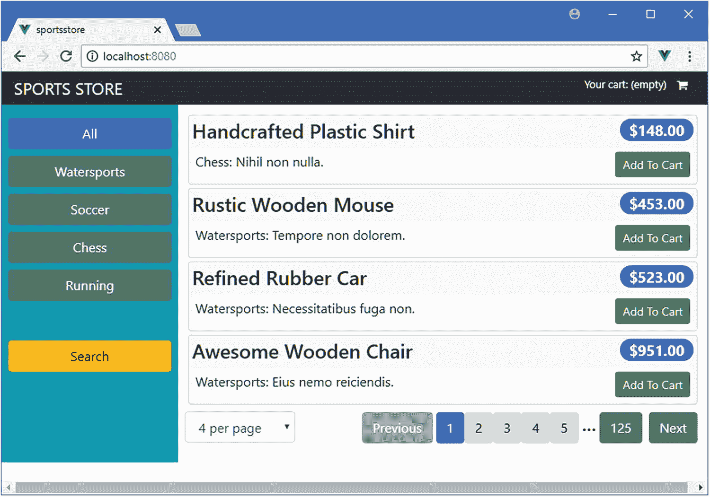
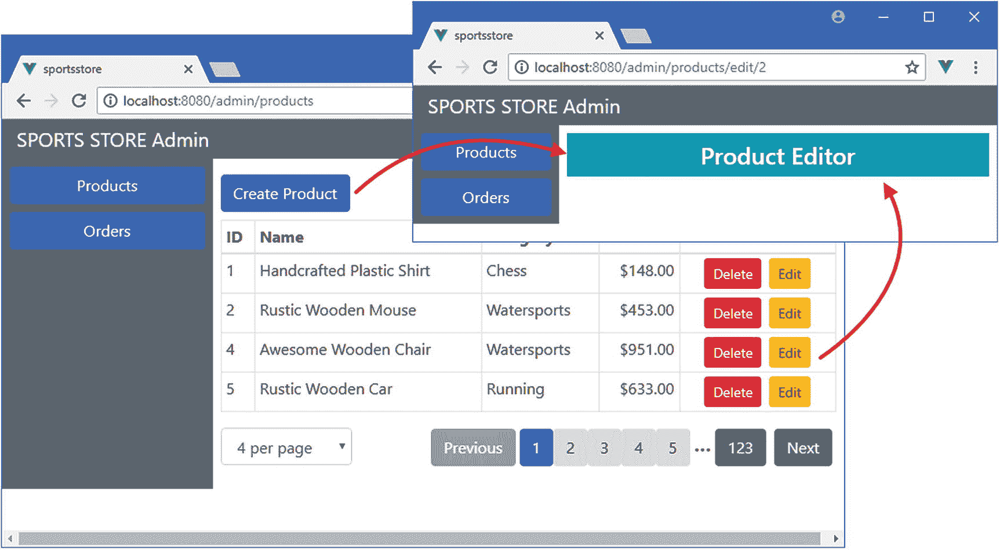
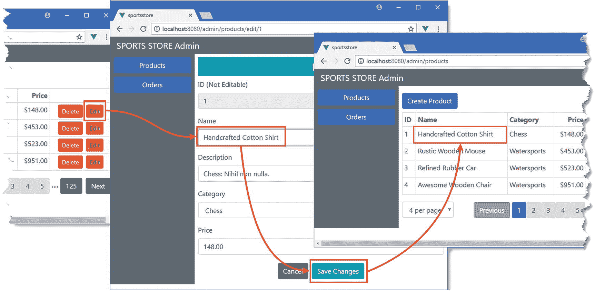
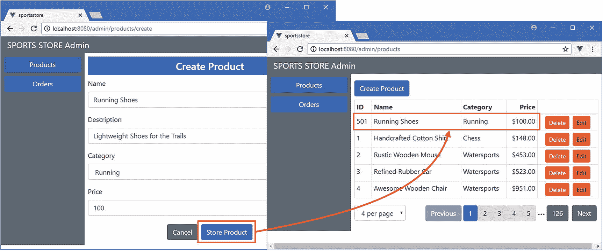
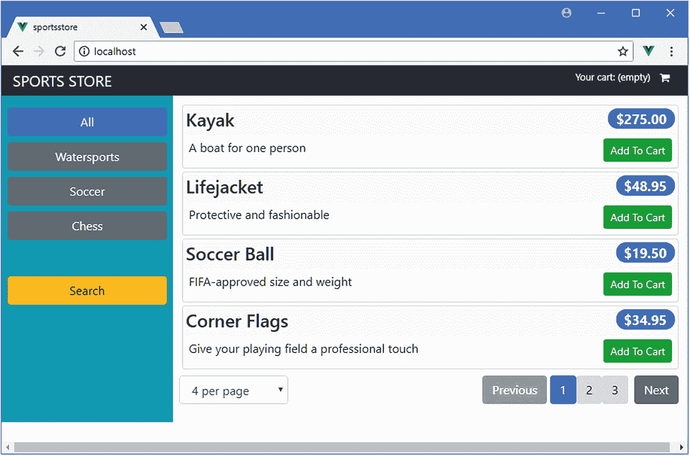

# 8.SportsStore:管理和部署

在本章中，我将通过添加剩余的管理功能来完成 SportsStore 应用程序，并向您展示如何准备和部署项目。正如您将看到的，从开发到生产的转换相对简单且易于执行。

## 为本章做准备

本章使用第 [7](07.html) 章中的 SportsStore 项目，在准备本章时不需要做任何更改。

### 小费

你可以从 [`https://github.com/Apress/pro-vue-js-2`](https://github.com/Apress/pro-vue-js-2) 下载本章以及本书所有其他章节的示例项目。

要启动 RESTful web 服务，请打开命令提示符并在`sportsstore`文件夹中运行以下命令:

```js
npm run json

```

打开第二个命令提示符，在`sportsstore`文件夹中运行以下命令，启动开发工具和 HTTP 服务器:

```js
npm run serve

```

一旦初始构建过程完成，打开一个新的浏览器窗口并导航到`http://localhost:8080`以查看图 [8-1](#Fig1) 中显示的内容。



图 8-1

运行体育商店应用程序

## 添加产品管理功能

为了完成管理功能，我需要让 SportsStore 应用程序能够创建、编辑和删除产品对象。首先，我将扩展数据存储，通过向 web 服务发送 HTTP 请求并更新产品数据来提供支持这些操作的操作，如清单 [8-1](#PC3) 所示。

```js
import Vue from "vue";
import Vuex from "vuex";
import Axios from "axios";
import CartModule from "./cart";
import OrdersModule from "./orders";
import AuthModule from "./auth";

Vue.use(Vuex);

const baseUrl = "http://localhost:3500";
const productsUrl = `${baseUrl}/products`;
const categoriesUrl = `${baseUrl}/categories`;

export default new Vuex.Store({
    strict: true,
    modules:  { cart: CartModule, orders: OrdersModule, auth: AuthModule },
    state: {

        // ...state properties omitted for brevity...

    },
    getters: {
        processedProducts: (state) => {
            return state.pages[state.currentPage];
        },
        pageCount: (state) => state.serverPageCount,
        categories: state => ["All", ...state.categoriesData],
        productById:(state) => (id) => {

            return state.pages[state.currentPage].find(p => p.id == id);

        }

    },
    mutations: {
        _setCurrentPage(state, page) {
            state.currentPage = page;
        },

        // ...other mutations omitted for brevity...

        setSearchTerm(state, term) {
            state.searchTerm = term;
            state.currentPage = 1;
        },
        _addProduct(state, product) {

            state.pages[state.currentPage].unshift(product);

        },

        _updateProduct(state, product) {

            let page = state.pages[state.currentPage];

            let index = page.findIndex(p => p.id == product.id);

            Vue.set(page, index, product);

        }

    },
    actions: {
        async getData(context) {
            await context.dispatch("getPage", 2);
            context.commit("setCategories", (await Axios.get(categoriesUrl)).data);
        },

        // ...other actions omitted for brevity...

        async addProduct(context, product) {

            let data = (await context.getters.authenticatedAxios.post(productsUrl,

                product)).data;

            product.id = data.id;

            this.commit("_addProduct", product);

        },

        async removeProduct(context, product) {

            await context.getters.authenticatedAxios

                .delete(`${productsUrl}/${product.id}`);

            context.commit("clearPages");

            context.dispatch("getPage", 1);

        },

        async updateProduct(context, product) {

            await context.getters.authenticatedAxios

                .put(`${productsUrl}/${product.id}`, product);

            this.commit("_updateProduct", product);

        }

    }
})

Listing 8-1Adding Administration Features in the index.js File in the src/store Folder

```

组件将调用这些操作来存储、删除或更改产品，这需要向 web 服务发出 HTTP 请求，并对本地数据进行相应的更改。当一个产品被改变时，我定位现有的对象并替换它，但是对于其他的操作，我采取轻微的快捷方式。当添加一个产品时，我将它插入到产品的当前页面的开头，即使这意味着页面大小不正确，这样我就不必确定新对象应该显示在哪个页面上，也不必从服务器获取数据。当删除一个对象时，我会刷新数据，这样我就不必手动重新分页来填补空白。这些快捷方式是通过使用`_addProduct`和`_updateProduct`突变实现的，我在它们的名字前加了下划线，以表明它们不会被广泛使用。我还在清单 [8-1](#PC3) 中添加了一个 getter，这样我就可以通过产品的`id`在当前页面中定位产品。这种类型的 getter 有一个参数，它像方法一样使用，这意味着我可以定义在数据存储中定位产品的逻辑，而不必获取页面中的所有对象并在组件中执行搜索。

### 展示产品列表

为了向用户展示产品，并提供创建、编辑和删除它们的方法，我从第 [7 章](07.html)中创建的`ProductAdmin`组件中移除了占位符内容，并用清单 [8-2](#PC4) 中所示的 HTML 元素和代码替换了它。

```js
<template>
    <div>
        <router-link to="/admin/products/create" class="btn btn-primary my-2">
            Create Product
        </router-link>
        <table class="table table-sm table-bordered">
            <thead>
                <th>ID</th><th>Name</th><th>Category</th>
                <th class="text-right">Price</th><th></th>
            </thead>
            <tbody>
                <tr v-for="p in products" v-bind:key="p.id">
                    <td>{{ p.id }}</td>
                    <td>{{ p.name }}</td>
                    <td>{{ p.category }}</td>
                    <td class="text-right">{{ p.price | currency }}</td>
                    <td class="text-center">
                        <button class="btn btn-sm btn-danger mx-1"
                            v-on:click="removeProduct(p)">Delete</button>
                        <button class="btn btn-sm btn-warning mx-1"
                            v-on:click="handleEdit(p)">Edit</button>
                    </td>
                </tr>
            </tbody>
        </table>
        <page-controls />
    </div>
</template>

<script>

import PageControls from "../PageControls";
import { mapGetters, mapActions } from "vuex";

export default {
    components: { PageControls },
    computed: {
        ...mapGetters({
                products: "processedProducts"
            })
    },
    methods: {
        ...mapActions(["removeProduct"]),
        handleEdit(product) {
            this.$router.push(`/admin/products/edit/${product.id}`);
        }
    }
}

</script>

Listing 8-2Adding Features in the ProductAdmin.vue File in the src/components/admin Folder

```

该组件向用户呈现一个产品表，使用`v-for`指令从数据模型中填充。表格中的每一行都有删除和编辑按钮。单击一个删除按钮会调度添加到清单 [8-1](#PC3) 中的数据存储中的`removeProduct`动作。单击“编辑”按钮或“创建产品”按钮会将浏览器重定向到一个 URL，我将使用该 URL 来显示可用于修改或创建产品的编辑器。

### 小费

注意，我能够使用前面章节中的`PageControls`组件来处理产品的分页。管理功能建立在前面章节中面向客户的功能所使用的相同数据存储功能的基础上，这意味着分页等常见功能可以很容易地重用。

### 添加编辑器占位符和 URL 路由

按照前几章中使用的模式，我将为编辑器创建一个占位符组件，并在它集成到应用程序中后返回添加它的特性。我在`src/components/admin`文件夹中添加了一个名为`ProductEditor.vue`的文件，内容如清单 [8-3](#PC5) 所示。

```js
<template>
    <div class="bg-info text-white text-center h4 p-2">
        Product Editor
    </div>
</template>

Listing 8-3The Contents of the ProductEditor.vue File in the src/components/admin Folder

```

为了将编辑器组件集成到应用程序中，我添加了清单 [8-4](#PC6) 中所示的路径，当用户单击编辑或创建产品按钮时，该路径将匹配我在`ProductAdmin`组件中使用的 URL。

```js
import Vue from "vue";
import VueRouter  from "vue-router";
import Store from "../components/Store";
import ShoppingCart from "../components/ShoppingCart";
import Checkout from "../components/Checkout";
import OrderThanks from "../components/OrderThanks";
import Authentication from "../components/admin/Authentication";
import Admin from "../components/admin/Admin";
import ProductAdmin from "../components/admin/ProductAdmin";
import OrderAdmin from "../components/admin/OrderAdmin";

import ProductEditor from "../components/admin/ProductEditor";

import dataStore from "../store";

Vue.use(VueRouter);

export default new VueRouter({
    mode: "history",
    routes: [
        { path: "/", component: Store },
        { path: "/cart", component: ShoppingCart },
        { path: "/checkout", component: Checkout},
        { path: "/thanks/:id", component: OrderThanks},
        { path: "/login", component: Authentication },
        { path: "/admin", component: Admin,
            beforeEnter(to, from, next) {
                if (dataStore.state.auth.authenticated) {
                    next();
                } else {
                    next("/login");
                }
            },
            children: [
                { path: "products/:op(create|edit)/:id(\\d+)?",

                  component: ProductEditor },

                { path: "products", component: ProductAdmin },
                { path: "orders", component: OrderAdmin },
                { path: "", redirect: "/admin/products"}
            ]
        },
        { path: "*", redirect: "/"}
    ]
})

Listing 8-4Adding a Route in the index.js File in the src/router Folder

```

正如我在第 22 章中解释的，当 Vue 路由器包匹配 URL 并支持正则表达式时，它能够处理复杂的模式。我在清单 [8-4](#PC6) 中添加的路由将匹配`/admin/products/create` URL 和`/admin/products/edit/id` URL，前者表明用户想要添加一个新产品，后者的最后一段是一个数值，对应于用户想要编辑的产品的`id`属性。

要查看产品管理功能，请导航至`http://localhost:8080/login`并完成认证过程。一旦通过认证，您将看到如图 [8-2](#Fig2) 所示的产品列表。如果您单击其中一个删除按钮，您选择的产品将从 web 服务中删除。如果您单击“创建产品”按钮或其中一个编辑按钮，您将看到占位符内容。

### 小费

请记住，您可以通过使用本章开头的命令重新启动`json-server`过程来重新创建所有的测试数据。这将重置数据并放弃您所做的任何更改、添加或删除。



图 8-2

产品管理功能

### 实现编辑器功能

编辑器组件将用于创建和编辑产品，并根据与当前 URL 匹配的路线确定用户需要的活动。在清单 [8-5](#PC7) 中，我已经删除了占位符内容，并添加了创建和修改产品所需的内容和代码。

```js
<template>
    <div>
        <h4 class="text-center text-white p-2" v-bind:class="themeClass">
            {{ editMode ? "Edit" : "Create Product" }}
        </h4>
        <h4 v-if="$v.$invalid && $v.$dirty"
                class="bg-danger text-white text-center p-2">
            Values Required for All Fields
        </h4>
        <div class="form-group" v-if="editMode">
            <label>ID (Not Editable)</label>
            <input class="form-control" disabled v-model="product.id" />
        </div>
        <div class="form-group">
            <label>Name</label>
            <input class="form-control" v-model="product.name" />
        </div>
        <div class="form-group">
            <label>Description</label>
            <input class="form-control" v-model="product.description" />
        </div>
        <div class="form-group">
            <label>Category</label>
            <select v-model="product.category" class="form-control">
                <option v-for="c in categories" v-bind:key="c">
                    {{ c }}
                </option>
            </select>
        </div>
        <div class="form-group">
            <label>Price</label>
            <input class="form-control" v-model="product.price" />
        </div>
        <div class="text-center">
            <router-link to="/admin/products"
                class="btn btn-secondary m-1">Cancel
            </router-link>
            <button class="btn m-1" v-bind:class="themeClassButton"
                    v-on:click="handleSave">
                {{ editMode ? "Save Changes" : "Store Product"}}
            </button>
        </div>
    </div>
</template>

<script>

import { mapState, mapActions } from "vuex";
import { required } from "vuelidate/lib/validators";

export default {
    data: function() {
        return {
            product: {}
        }
    },
    computed: {
        ...mapState({
            pages: state => state.pages,
            currentPage: state => state.currentPage,
            categories: state => state.categoriesData
        }),
        editMode() {
            return this.$route.params["op"] == "edit";
        },
        themeClass() {
            return this.editMode ? "bg-info" : "bg-primary";
        },
        themeClassButton() {
            return this.editMode ? "btn-info" : "btn-primary";
        }
    },
    validations: {
        product: {
            name: { required },
            description: { required },
            category: { required },
            price: { required }
        }
    },
    methods: {
        ...mapActions(["addProduct", "updateProduct"]),
        async handleSave() {
            this.$v.$touch();
            if (!this.$v.$invalid) {
                if (this.editMode) {
                    await this.updateProduct(this.product);
                } else {
                    await this.addProduct(this.product);
                }
                this.$router.push("/admin/products");
            }
        }
    },
    created() {
        if (this.editMode) {
            Object.assign(this.product,
                this.$store.getters.productById(this.$route.params["id"]))
        }
    }
}
</script>

Listing 8-5Adding Features in the ProductEditor.vue File in the src/components/admin Folder

```

该组件为用户提供一个 HTML 表单，其中包含创建或编辑产品所需的字段。创建组件的目的是通过获取活动路线的详细信息来确定的，当用户执行编辑操作时，会在数据存储中查询产品，这是使用`created`方法完成的，我在第 [17 章](17.html)中对此进行了描述。如第 4 章[中所述，我使用`Object.assign`从数据存储对象中复制属性，这样就可以在不更新数据存储的情况下进行更改，允许用户点击取消按钮并放弃更改。该表单具有基本的验证功能，并调用数据存储中的操作来存储或更新产品。](04.html)

要编辑产品，导航至`http://localhost:8080/admin`，执行验证，并点击其中一个编辑按钮。使用表单进行更改，然后单击保存更改按钮，查看产品表中反映的更改，如图 [8-3](#Fig3) 所示。



图 8-3

编辑产品

要创建产品，请单击“创建产品”按钮，填充表单，然后单击“存储产品”按钮。你会在页面顶部看到新产品，如图 [8-4](#Fig4) 所示。



图 8-4

创造产品

## 部署体育商店

在接下来的小节中，我将介绍部署 SportsStore 应用程序的过程。我首先对配置进行更改，无论应用程序部署到哪个平台，这些更改都是必需的，并使 SportsStore 为生产使用做好准备。然后，我使用 Docker 创建一个容器，其中包含 SportsStore 及其所需的服务，以替换开发过程中用于运行应用程序的开发工具。

### 码头工人的替代品

我在本章中使用 Docker 是因为它简单且一致，并且您可以在一台功能相当强大的开发机器上遵循这个示例，而不需要单独的生产硬件。对于您自己的项目来说，有很多 Docker 的替代品可以考虑，Vue.js 可以以无数不同的方式部署，以满足不同应用程序的需求。您不必使用 Docker，但是不管您选择如何部署您的应用程序，请记住进行下一节中显示的配置更改。

### 为部署准备应用程序

为了准备部署应用程序，需要做一些小的更改。这些变化不会改变应用程序的行为，但它们很重要，因为它们禁用了对开发人员有用但对生产有影响的功能。

#### 准备数据存储

第一个变化是在 Vuex 数据存储中禁用严格模式，如清单 [8-6](#PC8) 所示。这在开发过程中是一个有用的特性，因为当您直接修改状态属性而不是通过突变修改时，它会向您发出警告，但是在生产过程中却没有用，并且会影响性能，尤其是在复杂的应用程序中。

```js
import Vue from "vue";
import Vuex from "vuex";
import Axios from "axios";
import CartModule from "./cart";
import OrdersModule from "./orders";
import AuthModule from "./auth";

Vue.use(Vuex);

const baseUrl = "/api";

const productsUrl = `${baseUrl}/products`;
const categoriesUrl = `${baseUrl}/categories`;

export default new Vuex.Store({
    strict: false,

    modules:  { cart: CartModule, orders: OrdersModule, auth: AuthModule },

    // ... data store features omitted for brevity...

})

Listing 8-6Preparing for Deployment in the index.js File in the src/store Folder

```

在开发过程中，我使用了一个单独的流程来处理 web 服务请求。对于已部署的应用程序，我将把应用程序及其数据的 HTTP 请求合并到一个服务器中，这需要更改数据存储用来获取数据的 URL，这就是为什么我更改了`baseUrl`值。在清单 [8-7](#PC9) 中，我更改了认证模块使用的 URL。

```js
import Axios from "axios";

const loginUrl = "/api/login";

export default {
    state: {
        authenticated: false,
        jwt: null
    },

    // ... data store features omitted for brevity...

}

Listing 8-7Changing the URL in the auth.js File in the src/store Folder

```

用于管理订单的 URL 也必须更改，如清单 [8-8](#PC10) 所示。

```js
import Axios from "axios";
import Vue from "vue";

const ORDERS_URL = "/api/orders";

export default {
    state: {
        orders:[]
    },

    // ... data store features omitted for brevity...

}

Listing 8-8Changing the URL in the orders.js File in the src/store Folder

```

#### 准备身份验证组件

下一个变化是从组件中移除用于管理认证的凭证，如清单 [8-9](#PC11) 所示，这在开发期间很有用，但是不应该包含在生产中。

```js
...
<script>

import { required } from "vuelidate/lib/validators";
import { mapActions, mapState } from "vuex";
import ValidationError  from "../ValidationError";

export default {
    components: { ValidationError },
    data: function() {
        return {
            username: null,

            password: null,

            showFailureMessage: false,
        }
    },
    computed: {
        ...mapState({authenticated: state => state.auth.authenticated })
    },
    validations: {
        username: { required },
        password: { required }
    },
    methods: {
        ...mapActions(["authenticate"]),
        async handleAuth() {
            this.$v.$touch();
            if (!this.$v.$invalid) {
                await this.authenticate({ name: this.username,
                    password: this.password });
                if (this.authenticated) {
                    this.$router.push("/admin");
                } else {
                    this.showFailureMessage = true;
                }
            }
        }
    }
}

</script>
...

Listing 8-9Removing Credentials in the Authentication.vue file in the src/components/admin Folder

```

#### 按需加载管理功能

SportsStore 应用程序的每个功能都包含在由 Vue.js 构建工具创建的 JavaScript 包中，尽管管理功能可能会被一小部分用户使用。Vue.js 使得将应用程序分解成单独的包变得很容易，这些包只能在第一次需要时加载。为了将管理特性分离到它们自己的包中，我在`src/components/admin`文件夹中添加了一个名为`index.js`的文件，代码如清单 [8-10](#PC12) 所示。

```js
import Vue from "vue";
import VueRouter  from "vue-router";
import Store from "../components/Store";
import ShoppingCart from "../components/ShoppingCart";
import Checkout from "../components/Checkout";
import OrderThanks from "../components/OrderThanks";

const Authentication = () =>

    import(/* webpackChunkName: "admin" */ "../components/admin/Authentication");

const Admin = () =>

    import(/* webpackChunkName: "admin" */ "../components/admin/Admin");

const ProductAdmin = () =>

    import(/* webpackChunkName: "admin" */ "../components/admin/ProductAdmin");

const OrderAdmin = () =>

    import(/* webpackChunkName: "admin" */ "../components/admin/OrderAdmin");

const ProductEditor = () =>

    import(/* webpackChunkName: "admin" */ "../components/admin/ProductEditor");

import dataStore from "../store";

Vue.use(VueRouter);

export default new VueRouter({
    mode: "history",
    routes: [
        { path: "/", component: Store },
        { path: "/cart", component: ShoppingCart },
        { path: "/checkout", component: Checkout},
        { path: "/thanks/:id", component: OrderThanks},
        { path: "/login", component: Authentication },
        { path: "/admin", component: Admin,
            beforeEnter(to, from, next) {
                if (dataStore.state.auth.authenticated) {
                    next();
                } else {
                    next("/login");
                }
            },
            children: [
                { path: "products/:op(create|edit)/:id(\\d+)?",
                      component: ProductEditor },
                { path: "products", component: ProductAdmin },
                { path: "orders", component: OrderAdmin },
                { path: "", redirect: "/admin/products"}
            ]
        },
        { path: "*", redirect: "/"}
    ]
})

Listing 8-10The Contents of the index.js File in the src/components/admin Folder

```

普通的`import`语句在一个模块上创建了一个静态依赖，其效果是导入一个组件确保它包含在发送给浏览器的 JavaScript 文件中。正如我在第 [21](21.html) 章中解释的，我在清单 [8-10](#PC12) 中使用的`import`语句类型是动态的，这意味着管理特性所需的组件将被放入一个单独的 JavaScript 文件中，该文件在第一次需要这些组件时被加载。这确保了这些特性只对少数需要它们的用户可用，而不会被其他用户下载。

### 注意

您可能会发现，作为清单 [8-10](#PC12) 的结果而创建的独立模块无论如何都会被加载，即使没有使用管理特性。这是因为 Vue.js 项目被配置为向浏览器提供预取提示，这些提示表明将来可能需要某些内容。浏览器可以忽略这些提示，但是仍然可以选择请求该模块。在第 21 章[中，我演示了如何改变项目的配置，这样预取提示就不会发送到浏览器。](21.html)

我在`import`语句中加入的笨拙的注释确保了组件被打包到一个单独的文件中。如果没有这些注释，每个组件将会以一个单独的文件结束，服务器会在第一次需要它的时候请求这个文件。因为这些组件提供了相关的特性，所以我将它们组合在一起。这是一个特定于 Vue.js 工具用来生成 JavaScript 代码束的工具的特性——被称为*web pack*——除非你已经像我在第 [5 章](05.html)中所做的那样使用 Vue.js 命令行工具创建了你的项目，否则它可能无法工作。

#### 创建数据文件

我一直在处理 RESTful web 服务启动时以编程方式生成的测试数据，这在开发过程中非常有用，因为每次都会重新生成数据，丢弃任何修改。对于部署，我将切换到将被持久化的数据，确保更改得到保留。我在`sportsstore`文件夹中添加了一个名为`data.json`的文件，内容如清单 [8-11](#PC13) 所示。

```js
{
    "products": [
        { "id": 1, "name": "Kayak", "category": "Watersports",
            "description": "A boat for one person", "price": 275 },
        { "id": 2, "name": "Lifejacket", "category": "Watersports",
            "description": "Protective and fashionable", "price": 48.95 },
        { "id": 3, "name": "Soccer Ball", "category": "Soccer",
            "description": "FIFA-approved size and weight", "price": 19.50 },
        { "id": 4, "name": "Corner Flags", "category": "Soccer",
            "description": "Give your playing field a professional touch",
            "price": 34.95 },
        { "id": 5, "name": "Stadium", "category": "Soccer",
            "description": "Flat-packed 35,000-seat stadium", "price": 79500 },
        { "id": 6, "name": "Thinking Cap", "category": "Chess",
            "description": "Improve brain efficiency by 75%", "price": 16 },
        { "id": 7, "name": "Unsteady Chair", "category": "Chess",
            "description": "Secretly give your opponent a disadvantage",
            "price": 29.95 },
        { "id": 8, "name": "Human Chess Board", "category": "Chess",
            "description": "A fun game for the family", "price": 75 },
        { "id": 9, "name": "Bling Bling King", "category": "Chess",
            "description": "Gold-plated, diamond-studded King", "price": 1200 }
    ],
    "categories": ["Watersports", "Soccer", "Chess"],
    "orders": []
}

Listing 8-11The Contents of the data.json File in the sportsstore Folder

```

### 构建用于部署的应用程序

要构建可以部署的 SportsStore 应用程序，运行清单`sportsstore`文件夹中的 [8-12](#PC14) 所示的命令。

```js
npm run build

Listing 8-12Building the Project

```

构建过程会生成 JavaScript 文件，这些文件针对交付给浏览器进行了优化，并且排除了开发功能，例如当其中一个源文件发生更改时自动重新加载浏览器。构建过程可能需要一段时间，完成后，您会看到该过程的摘要，如下所示:

```js
WARNING  Compiled with 2 warnings

 warning

asset size limit: The following asset(s) exceed the recommended size limit (244 KiB).
This can impact web performance.
Assets:
  img/fontawesome-webfont.912ec66d.svg (434 KiB)

 warning

entrypoint size limit: The following entrypoint(s) combined asset size exceeds the recommended limit (244 KiB). This can impact web performance.

Entrypoints:
  app (346 KiB)
      css/chunk-vendors.291cfd91.css
      js/chunk-vendors.56adf36a.js
      js/app.846b07bf.js

  File                                   Size              Gzipped

  dist\js\chunk-vendors.56adf36a.js      160.98 kb         54.10 kb
  dist\js\app.846b07bf.js                25.08 kb          6.57 kb
  dist\js\admin.b43c91ef.js              11.62 kb          3.13 kb
  dist\css\chunk-vendors.291cfd91.css    159.97 kb         26.60 kb

  Images and other types of assets omitted.

 DONE  Build complete. The dist directory is ready to be deployed.

```

关于大小的警告可以忽略，构建过程的输出是一组 JavaScript 和 CSS 文件，包含应用程序需要的内容、代码和样式，所有这些都在`dist`文件夹中。(您可能会看到不同的警告，因为构建过程中使用的工具经常更新。)

### 测试部署就绪的应用程序

在打包应用程序进行部署之前，有必要进行一次快速测试，以确保一切正常。在开发过程中，对 HTML、JavaScript 和 CSS 文件的 HTTP 请求是由 Vue.js 开发工具处理的，不能在生产中使用。作为适合生产的替代方案，我将安装流行的`Express`包，这是一个广泛使用的运行在 Node.js 上的 web 服务器。运行清单 [8-13](#PC16) 中所示的命令来安装 Express 包和支持 URL 路由所需的相关包。

```js
npm install --save-dev express@4.16.3
npm install --save-dev connect-history-api-fallback@1.5.0

Listing 8-13Adding Packages

```

我在`sportsstore`项目文件夹中添加了一个名为`server.js`的文件，并添加了清单 [8-14](#PC17) 中所示的语句，这些语句配置了清单 [8-13](#PC16) 中安装的包，因此它们将服务于 SportsStore 应用程序。

```js
const express = require("express");
const history = require("connect-history-api-fallback");
const jsonServer = require("json-server");
const bodyParser = require('body-parser');
const auth = require("./authMiddleware");
const router = jsonServer.router("data.json");

const app = express();
app.use(bodyParser.json());
app.use(auth);
app.use("/api", router);
app.use(history());
app.use("/", express.static("./dist"));

app.listen(80, function () {
    console.log("HTTP Server running on port 80");
});

Listing 8-14The Contents of the server.js File in the sportsstore Folder

```

运行`sportstore`文件夹中清单 [8-15](#PC18) 所示的命令来测试应用程序。

```js
node server.js

Listing 8-15Testing the Deployment Build

```

这个命令执行清单 [8-14](#PC17) 中 JavaScript 文件中的语句，这些语句在端口 80 上设置一个 web 服务器并监听请求。要测试应用程序，导航到`http://localhost:80`，您将看到应用程序正在运行，如图 [8-5](#Fig5) 所示。


图 8-5

测试应用程序

### 部署应用程序

第一步是在你的开发机器上下载并安装 Docker 工具，可以从 [`www.docker.com/products/docker`](https://www.docker.com/products/docker) 获得。有适用于 macOS、Windows 和 Linux 的版本，也有一些适用于 Amazon 和 Microsoft 云平台的专门版本。对于这一章，免费的社区版已经足够了。

### 警告

生产 Docker 软件的公司因做出突破性的改变而闻名。这意味着后面的示例可能无法在更高版本中正常工作。如果你有问题，检查这本书的更新( [`https://github.com/Apress/pro-vue-js-2`](https://github.com/Apress/pro-vue-js-2) )。

#### 创建包文件

为了将应用程序部署到 Docker，我需要创建一个版本的`package.js`文件，它将安装运行应用程序所需的包。我在`sportsstore`文件夹中添加了一个名为`deploy-package.json`的文件，内容如清单 [8-16](#PC19) 所示。

```js
{
    "name": "sportsstore",
    "version": "1.0.0",
    "private": true,

    "dependencies": {
        "faker": "^4.1.0",
        "json-server": "^0.12.1",
        "jsonwebtoken": "^8.1.1",
        "express": "4.16.3",
        "connect-history-api-fallback": "1.5.0"
    }
}

Listing 8-16The Contents of the deploy-package.json File in the sportsstore Folder

```

#### 创建 Docker 容器

为了定义容器，我在`sportsstore`文件夹中添加了一个名为`Dockerfile`(没有扩展名)的文件，并添加了清单 [8-17](#PC20) 中所示的内容。

```js
FROM node:8.11.2

RUN mkdir -p /usr/src/sportsstore

COPY dist /usr/src/sportsstore/dist

COPY authMiddleware.js /usr/src/sportsstore/
COPY data.json /usr/src/sportsstore/
COPY server.js /usr/src/sportsstore/server.js
COPY deploy-package.json /usr/src/sportsstore/package.json

WORKDIR /usr/src/sportsstore

RUN npm install

EXPOSE 80

CMD ["node", "server.js"]

Listing 8-17The Contents of the Dockerfile File in the sportsstore Folder

```

`Dockerfile`的内容使用一个用 Node.js 配置的基本映像，它复制运行应用程序所需的文件，包括包含应用程序的包文件和将用于安装在部署中运行应用程序所需的包的`package.json`文件。

运行`sportsstore`文件夹中清单 [8-18](#PC21) 中的命令，创建一个包含 SportsStore 应用程序的映像，以及它需要的所有工具和包。

```js
docker build . -t sportsstore  -f  Dockerfile

Listing 8-18Building the Docker Image

```

图像是容器的模板。当 Docker 处理 Docker 文件中的指令时，将下载并安装 NPM 包，并将配置和代码文件复制到映像中。

#### 运行应用程序

一旦创建了映像，使用清单 [8-19](#PC22) 中的命令创建并启动一个新的容器。

```js
docker run -p 80:80 sportsstore

Listing 8-19Creating a Docker Container

```

您可以通过在浏览器中打开`http://localhost`来测试应用程序，这将显示运行在容器中的 web 服务器提供的响应，如图 [8-6](#Fig6) 所示。

### 小费

如果因为端口 80 不可用而收到错误，可以通过更改`-p`参数的第一部分来尝试不同的端口。例如，如果您想监听端口 500，那么参数应该是`-p 500:80`。



图 8-6

运行容器化 SportsStore 应用程序

要停止容器，运行清单 [8-20](#PC23) 中所示的命令。

```js
docker ps

Listing 8-20Stopping the Docker Container

```

您将看到一个正在运行的容器列表，如下所示(为简洁起见，我省略了一些字段):

```js
CONTAINER ID        IMAGE               COMMAND             CREATED
ecc84f7245d6        sportsstore         "node server.js"    33 seconds ago

```

使用容器 ID 列中的值，运行清单 [8-21](#PC25) 中所示的命令。

```js
docker stop ecc84f7245d6

Listing 8-21Stopping the Docker Container

```

## 摘要

在本章中，我通过添加对管理产品目录和准备部署的支持来完成 SportsStore 应用程序，这说明了将 Vue.js 项目从开发转移到生产是多么容易。

这部分书到此结束。在第 2 部分中，我开始深入研究细节，并向您展示我用来创建 SportsStore 应用程序的特性是如何深入工作的。