# 15.使用表单元素

在这一章中，我描述了`v-model`，它是用于 HTML 表单元素的内置指令。`v-model`指令在表单元素和数据值之间创建了一个双向数据绑定，并确保应用程序保持一致，不管数据如何变化。我还将向您展示如何将`v-model`指令与前面章节中描述的一些内置指令结合起来，以验证用户输入到表单中的数据。表 [15-1](#Tab1) 将`v-model`指令置于上下文中。

表 15-1

将 v-model 指令放在上下文中

<colgroup><col class="tcol1 align-left"> <col class="tcol2 align-left"></colgroup> 
| 

问题

 | 

回答

 |
| --- | --- |
| 这是什么？ | v-model 指令在 HTML 表单元素和数据属性之间创建双向绑定，确保两者保持一致。 |
| 为什么有用？ | 使用表单元素是大多数 web 应用程序的重要组成部分，`v-model`指令负责创建数据绑定，而无需担心不同表单元素工作方式的差异。 |
| 如何使用？ | `v-model`指令应用于`input`、`select`和`textarea`元素，其表达式是绑定应该创建到的数据属性的名称。 |
| 有什么陷阱或限制吗？ | 指令不能和 Vuex 数据存储一起使用，我在第 20 章中描述过。 |
| 还有其他选择吗？ | 如果愿意，您可以手动创建所需的绑定，如本章的“创建双向模型绑定”一节所述。 |

表 [15-2](#Tab2) 总结了本章内容。

表 15-2

章节总结

<colgroup><col class="tcol1 align-left"> <col class="tcol2 align-left"> <col class="tcol3 align-left"></colgroup> 
| 

问题

 | 

解决办法

 | 

列表

 |
| --- | --- | --- |
| 在数据属性和表单元素之间创建双向数据绑定 | 使用`v-model`指令 | 1–9 |
| 将输入值格式化为数字 | 使用`number`修改器 | 10, 11 |
| 延迟绑定更新 | 使用`lazy`修改器 | Twelve |
| 修剪输入值中的空白 | 使用`trim`修改器 | Thirteen |
| 用用户选择的表单填充数组 | 使用`v-model`指令绑定到一个数组 | Fourteen |
| 间接绑定到值 | 使用带有`v-model`指令的自定义值 | 15–17 |
| 确保用户提供了应用程序可以使用的值 | 使用`v-model`指令验证收集的表单数据 | 18–21 |

## 为本章做准备

在这一章中，我继续使用第 [14 章](14.html)中的`templatesanddata`项目。为了准备本章，我简化了应用程序的根组件，如清单 [15-1](#PC1) 所示。

### 小费

你可以从 [`https://github.com/Apress/pro-vue-js-2`](https://github.com/Apress/pro-vue-js-2) 下载本章以及本书其他章节的示例项目。

```js
<template>
    <div class="container-fluid">

        <div class="bg-info m-2 p-2 text-white">
            Value: {{ dataValue }}
        </div>

        <div class="bg-primary m-2 p-2 text-white">
            <div class="form-check">
                <label class="form-check-label">
                    <input class="form-check-input" type="checkbox"
                           v-on:change="handleChange" />
                    Data Value
                </label>
            </div>
        </div>

        <div class="text-center m-2">
            <button class="btn btn-secondary" v-on:click="reset">
                Reset
            </button>
        </div>
    </div>
</template>

<script>
    export default {
        name: "MyComponent",
        data: function () {
            return {
                dataValue: false
            }
        },
        methods: {
            reset() {
                this.dataValue= false;
            },
            handleChange($event) {
                this.dataValue = $event.target.checked;
            }
        }
    }
</script>

Listing 15-1Simplifying the Content of the App.vue File in the src Folder

```

保存对`App.vue`文件的修改，运行`templatesanddata`文件夹中清单 [15-2](#PC2) 所示的命令，启动 Vue.js 开发工具。

```js
npm run serve

Listing 15-2Starting the Development Tools

```

打开一个新的浏览器窗口并导航至`http://localhost:8080`以查看图 [15-1](#Fig1) 所示的内容。

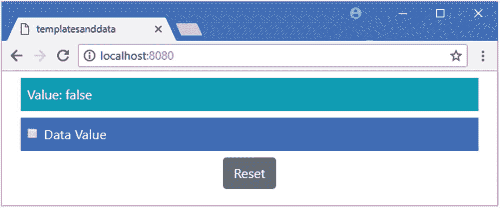

图 15-1

运行示例应用程序

## 创建双向模型绑定

到目前为止，我在本书的这一部分中创建的所有数据绑定都是单向的，这意味着数据从组件的`script`元素流向`template`元素，以便显示给用户。

示例应用程序展示了数据的单向流动。当复选框的状态改变时，`v-on`指令调用`handleChange`方法，设置`dataValue`属性。该数据变化触发更新，通过文本插值数据绑定显示，如图 [15-2](#Fig2) 所示。

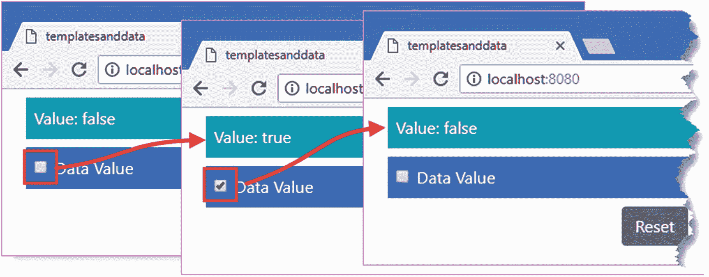

图 15-2

使用单向数据绑定

当表单元素是应用程序中唯一的更改源时，单向数据绑定工作得很好。当用户有其他方式进行更改时，它们就不那么有效了，比如例子中的 Reset 按钮，它的`v-on`指令调用`reset`方法，将`dataValue`设置为`false`。文本插值绑定正确地反映了新值，但是`input`元素不知道这个变化，并且失去同步，如图 [15-3](#Fig3) 所示。

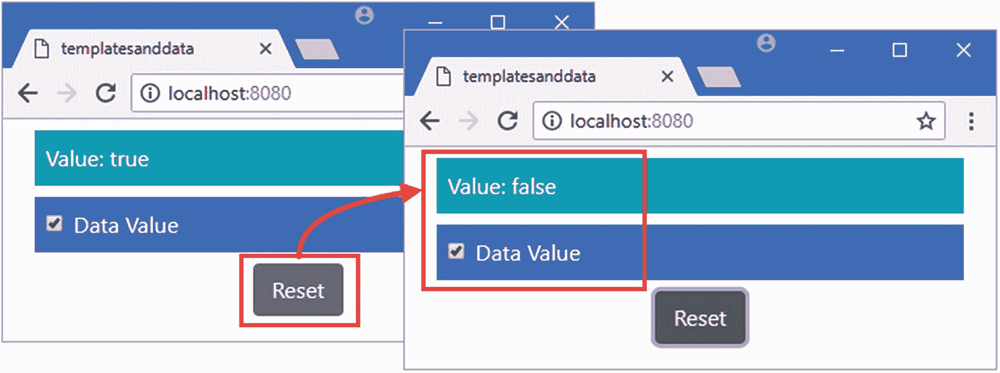

图 15-3

单向数据绑定的局限性

### 添加双向绑定

表单元素需要数据双向流动。当用户操作元素时，数据必须从表单流向数据模型，比如在字段中键入内容或选中复选框。当通过其他方式修改数据模型时，数据也必须向另一个方向流动，例如示例中的 Reset 按钮，以确保始终向用户呈现一致的数据。在清单 [15-3](#PC3) 中，我在复选框和`data`属性之间创建了一个绑定。

```js
...
<template>
    <div class="container-fluid">

        <div class="bg-info m-2 p-2 text-white">
            Value: {{ dataValue }}
        </div>

        <div class="bg-primary m-2 p-2 text-white">
            <div class="form-check">
                <label class="form-check-label">
                    <input class="form-check-input" type="checkbox"

                           v-on:change="handleChange"

                           v-bind:checked="dataValue" />

                    Data Value
                </label>
            </div>
        </div>

        <div class="text-center m-2">
            <button class="btn btn-secondary" v-on:click="reset">
                Reset
            </button>
        </div>
    </div>
</template>
...

Listing 15-3Creating a Binding in the App.vue File in the src Folder

```

我使用了`v-bind`指令来设置元素的`checked`属性，这确保了点击重置按钮具有取消选中复选框的效果，如图 [15-4](#Fig4) 所示。

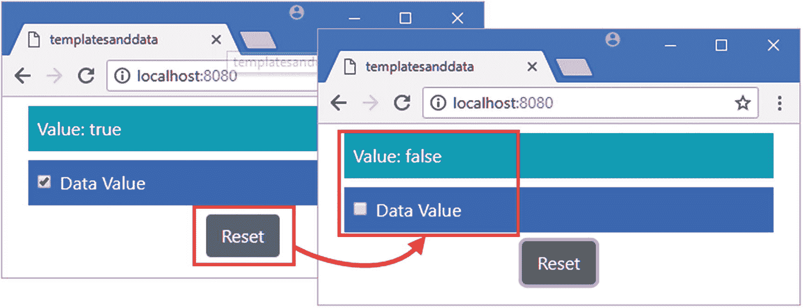

图 15-4

附加数据绑定的效果

现在在`dataValue`属性和复选框之间有了一个双向绑定。当复选框被选中和取消选中时，`input`元素发送`change`事件，这导致`v-on`指令调用`handleChange`方法，该方法设置`dataValue`值。在另一个方向，当`dataValue`由于点击 Reset 按钮而改变时，`v-bind`指令设置`input`元素的`checked`属性，该属性选中或取消选中复选框。

双向数据绑定是有效使用 HTML 表单的基础。在 Vue.js 应用程序中，数据模型是权威的，对数据模型的更改可以以不同的方式产生，所有这些都必须准确地反映在用户看到的表单元素中。

### 添加另一个输入元素

表单元素的 HTML 和 DOM 规范并不一致，不同元素类型的工作方式也有差异，这必须反映在用于创建双向数据绑定的`v-on`和`v-bind`指令中。在清单 [15-4](#PC4) 中，我添加了一个文本`input`元素，它展示了两个不同表单元素之间的区别。

```js
<template>
    <div class="container-fluid">

        <div class="bg-info m-2 p-2 text-white">
            <div>Data Value: {{ dataValue }}</div>
            <div>Other Value: {{ otherValue || "(Empty)" }}</div>
        </div>

        <div class="bg-primary m-2 p-2 text-white">
            <div class="form-check">
                <label class="form-check-label">
                    <input class="form-check-input" type="checkbox"
                        v-on:change="handleChange"
                        v-bind:checked="dataValue" />
                    Data Value
                </label>
            </div>
        </div>

        <div class="bg-primary m-2 p-2">

            <input type="text" class="form-control"

                v-on:input="handleChange"

                v-bind:value="otherValue" />

        </div>

        <div class="text-center m-2">
            <button class="btn btn-secondary" v-on:click="reset">
                Reset
            </button>
        </div>
    </div>
</template>

<script>
    export default {
        name: "MyComponent",
        data: function () {
            return {
                dataValue: false,
                otherValue: ""

            }
        },
        methods: {
            reset() {
                this.dataValue = false;
                this.otherValue = "";

            },
            handleChange($event) {
                if ($event.target.type == "checkbox") {

                    this.dataValue = $event.target.checked;

                } else {

                    this.otherValue = $event.target.value;

                }

            }
        }
    }
</script>

Listing 15-4Expanding the Form Elements in the App.vue File in the src Folder

```

此示例显示了为不同类型的元素创建双向绑定所需的差异。在处理复选框时，我必须监听`change`事件并绑定到`checked`属性，但对于文本输入，我监听`input`事件并绑定到`value`属性。我必须在`handleChange`事件中做类似的修改，为复选框设置`checked`属性，为文本输入设置`value`属性。结果是现在有两个表单元素，每个都有一个带有`data`属性的双向绑定，如图 [15-5](#Fig5) 所示。

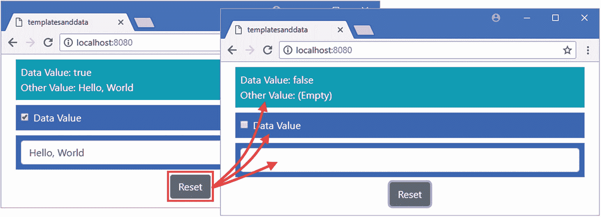

图 15-5

添加另一个输入元素

### 简化双向绑定

创建绑定所需的差异使设置绑定的过程变得复杂，并且很容易混淆不同元素类型的需求，最终使用错误的事件、属性或特性。

Vue.js 提供了`v-model`指令；它简化了双向绑定，自动处理元素类型之间的差异，可以用在`input`、`select`和`textarea`元素上。在清单 [15-5](#PC5) 中，我使用`v-model`指令简化了绑定。

```js
<template>
    <div class="container-fluid">

        <div class="bg-info m-2 p-2 text-white">
            <div>Data Value: {{ dataValue }}</div>
            <div>Other Value: {{ otherValue || "(Empty)" }}</div>
        </div>

        <div class="bg-primary m-2 p-2 text-white">
            <div class="form-check">
                <label class="form-check-label">
                    <input class="form-check-input" type="checkbox"

                        v-model="dataValue" />

                    Data Value
                </label>
            </div>
        </div>

        <div class="bg-primary m-2 p-2">
            <input type="text" class="form-control" v-model="otherValue" />

        </div>

        <div class="text-center m-2">
            <button class="btn btn-secondary" v-on:click="reset">
                Reset
            </button>
        </div>
    </div>
</template>

<script>
    export default {
        name: "MyComponent",
        data: function () {
            return {
                dataValue: false,
                otherValue: ""
            }
        },
        methods: {
            reset() {
                this.dataValue = false;
                this.otherValue = "";
            }
            //handleChange($event) {

            //    if ($event.target.type == "checkbox") {

            //        this.dataValue = $event.target.checked;

            //    } else {

            //        this.otherValue = $event.target.value;

            //    }

            //}

        }
    }
</script>

Listing 15-5Simplifying Two-Way Bindings in the App.vue File in the src Folder

```

`v-model`指令的表达式是为其创建双向绑定的属性。不需要在方法中接收事件，这允许我移除`handleChange`方法，效果是将组件重新聚焦于其数据和内容，而不是连接它们的管道。

## 绑定到表单元素

在继续之前，我将演示如何使用`v-model`指令为不同类型的表单元素创建绑定。元素之间的大部分差异由`v-model`指令处理，但是一个简单的绑定目录意味着您可以复制并粘贴到您自己的项目中，而不必找出每个项目所需的确切方法。

### 绑定到文本字段

最简单的绑定是创建到配置为允许用户输入文本的`input`元素。在清单 [15-6](#PC6) 中，我使用了为纯文本和密码设置的`input`元素，以及使用`v-model`指令的双向绑定。

```js
<template>
    <div class="container-fluid">
        <div class="bg-info m-2 p-2 text-white">
            <div>Name: {{ name }} </div>

            <div>Password: {{ password }}</div>

            <div>Details: {{ details }}</div>

        </div>
        <div class="bg-primary m-2 p-2 text-white">
            <div class="form-group">

                <label>Name</label>

                <input class="form-control" v-model="name" />

            </div>

            <div class="form-group">

                <label>Password</label>

                <input type="password" class="form-control" v-model="password" />

            </div>

            <div class="form-group">

                <label>Details</label>

                <textarea  class="form-control" v-model="details" />

            </div>

        </div>
    </div>
</template>

<script>
    export default {
        name: "MyComponent",
        data: function () {
            return {
                name: "Bob",

                password: "secret",

                details: "Has admin access"

            }
        }
    }
</script>

Listing 15-6Binding to Text Fields in the App.vue File in the src Folder

```

我创建了两个`input`元素，其中一个默认为常规文本字段，另一个配置为密码字段，还有一个`textarea`元素。这三个元素都使用`v-model`指令来创建一个双向数据绑定，绑定到由组件定义的数据属性，产生如图 [15-6](#Fig6) 所示的结果。


图 15-6

绑定到文本字段

### 绑定到单选按钮和复选框

在清单 [15-7](#PC7) 中，我用复选框和单选按钮替换了前一个例子中的元素，为用户提供了一组受限的选项。和前面的例子一样，每个元素都使用`v-model`指令创建一个带有数据属性的双向数据绑定。

```js
<template>
    <div class="container-fluid">

        <div class="bg-info m-2 p-2 text-white">
            <div>Name: {{ name }} </div>

            <div>Has Admin Access: {{ hasAdminAccess }}</div>

        </div>
        <div class="bg-primary m-2 p-2 text-white">
            <div class="form-check">

                <input class="form-check-input" type="radio"

                    v-model="name" value="Bob" />

                <label class="form-check-label">Bob</label>

            </div>

            <div class="form-check">

                <input class="form-check-input" type="radio"

                    v-model="name" value="Alice" />

                <label class="form-check-label">Alice</label>

            </div>

            <div class="form-check">

                <input class="form-check-input" type="checkbox"

                    v-model="hasAdminAccess" />

                <label class="form-check-label">Has Admin Access?</label>

            </div>

        </div>
    </div>
</template>

<script>
    export default {
        name: "MyComponent",
        data: function () {
            return {
                name: "Bob",

                hasAdminAccess: true

            }
        }
    }
</script>

Listing 15-7Binding to Checkboxes and Radio Buttons in the App.vue File in the src Folder

```

本例中的关键区别在于，当使用单选按钮时，每个元素都必须配置一个`value`属性，以便`v-model`指令知道如何更新数据属性的值。清单 [15-7](#PC7) 中的元素产生如图 [15-7](#Fig7) 所示的结果。

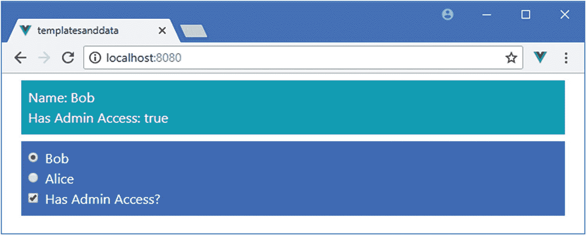

图 15-7

绑定到单选按钮和复选框

可以将`v-model`指令与`v-for`和`v-bind`指令结合起来，从一组值中生成表单元素，如清单 [15-8](#PC8) 所示，当呈现给用户的选项只有在运行时才知道时，这很有用。

```js
<template>
    <div class="container-fluid">
        <div class="bg-info m-2 p-2 text-white">
            <div>Name: {{ name }} </div>

        </div>
        <div class="bg-primary m-2 p-2 text-white">
            <div class="form-check" v-for="n in allNames" v-bind:key="n">

                <input class="form-check-input" type="radio"

                    v-model="name" v-bind:value="n" />

                <label class="form-check-label">{{ n }}</label>

            </div>

        </div>
    </div>
</template>

<script>
    export default {
        name: "MyComponent",
        data: function () {
            return {
                allNames: ["Bob", "Alice", "Joe"],

                name: "Bob"
            }
        }
    }
</script>

Listing 15-8Generating Radio Buttons in the App.vue File in the src Folder

```

必须使用`v-bind`指令来设置`input`元素的`value`属性；否则，Vue.js 不会将属性值作为表达式进行计算。图 [15-8](#Fig8) 显示了列表 [15-8](#PC8) 的结果。


图 15-8

从数据值生成表单元素

### 绑定到选择元素

选择元素允许以紧凑的方式向用户呈现有限数量的选择，如清单 [15-9](#PC9) 所示。定义用户可用选项的`option`元素可以静态定义，或者使用`v-for`指令定义，或者如清单所示，混合使用两者。

```js
<template>
    <div class="container-fluid">
        <div class="bg-info m-2 p-2 text-white">
            <div>Name: {{ name }} </div>
        </div>
        <div class="bg-primary m-2 p-2 text-white">
            <div class="form-group">

                <label>Selected Names</label>

                <select class="form-control" v-model="name">

                    <option value="all">Everyone</option>

                    <option v-for="n in allNames" v-bind:key="n"

                        v-bind:value="n">Just {{ n}}</option>

                </select>

            </div>

        </div>
    </div>
</template>

<script>
    export default {
        name: "MyComponent",
        data: function () {
            return {
                allNames: ["Bob", "Alice", "Joe"],
                name: "Bob"
            }
        }
    }
</script>

Listing 15-9Binding to a Select Element in the App.vue File in the src Folder

```

与单选按钮一样，`v-bind`指令必须用于设置`value`属性。图 [15-9](#Fig9) 显示了列表 [15-9](#PC9) 的结果。

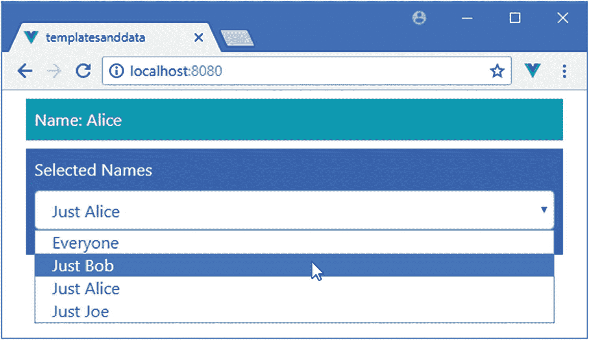

图 15-9

绑定到选择的元素

## 使用垂直模型修改器

`v-model`指令提供了三个绑定来改变它创建的双向绑定。这些修改器在表 [15-3](#Tab3) 中描述，并在以下章节中演示。

表 15-3

v-model 指令的修饰符

<colgroup><col class="tcol1 align-left"> <col class="tcol2 align-left"></colgroup> 
| 

修饰语

 | 

描述

 |
| --- | --- |
| `number` | 这个修饰符将输入的值解析成一个数字，然后将它赋给数据属性。 |
| `trim` | 这个修饰符在将输入赋给 data 属性之前，从输入中删除任何前导和尾随空白。 |
| `lazy` | 此修饰符更改 v-model 指令侦听的事件，以便仅当用户离开 input 元素时更新 data 属性。 |

### 将值格式化为数字

`number`修饰符解决了当类型属性被设置为`number`时`input`元素工作方式的奇怪之处，并在清单 [15-10](#PC10) 中演示。

```js
<template>
    <div class="container-fluid">
        <div class="bg-info m-2 p-2 text-white">
            <div>Amount: {{ amount }}, Amount + 10 = {{ amount + 10 }}</div>

        </div>
        <div class="form-group">

            <label>Amount</label>

            <input type="number" class="form-control" v-model="amount" />

        </div>

    </div>
</template>

<script>
    export default {
        name: "MyComponent",
        data: function () {
            return {
                amount: 100

            }
        }
    }
</script>

Listing 15-10Using a Numeric Input Element in the App.vue File in the src Folder

```

HTML5 规范为`type`属性添加了一系列值，而`number`值告诉浏览器只接受数字和小数点的击键。但是用户输入的值被浏览器显示为字符串。这与动态 JavaScript 输入系统结合起来产生了一个问题，通过将 Amount 字段中的值更改为任意数字，比如 101，就可以看到这个问题。当值改变时，`v-model`指令响应由`input`元素生成的事件，并使用它接收的字符串值更新名为`amount`的`data`属性，产生如图 [15-10](#Fig10) 左侧所示的效果。

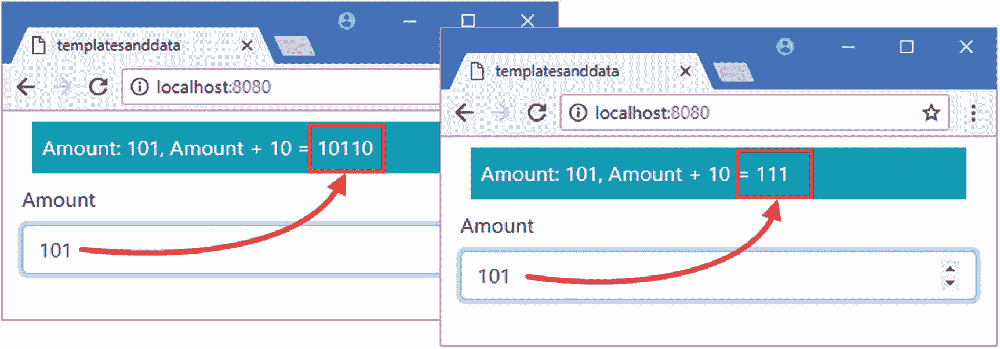

图 15-10

数字修饰符的效果

这个问题出现在文本插值绑定中，它给`amount`值加 10。由于`v-model`指令已经用一个字符串更新了 amount，JavaScript 将数据绑定的表达式解释为字符串连接，而不是加法，这意味着`101 + 10`产生一个结果`10110`。在清单 [15-11](#PC11) 中，我在`v-model`指令中添加了`number`修饰符，避免了这个问题。

```js
...
<template>
    <div class="container-fluid">
        <div class="bg-info m-2 p-2 text-white">
            <div>Amount: {{ amount }}, Amount + 10 = {{ amount + 10 }}</div>
        </div>
        <div class="form-group">
            <label>Amount</label>
            <input type="number" class="form-control" v-model.number="amount" />

        </div>
    </div>
</template>
...

Listing 15-11Applying a Modifier in the App.vue File in the src Folder

```

`number`修饰符告诉`v-model`指令将用户输入的值转换成一个数字，然后用它来更新应用程序。

### 警告

`number`修饰符不对`input`元素允许的字符施加任何限制，如果用户输入的值包含非数字字符，它将允许指令用字符串更新数据模型。当使用这个修饰符时，您必须通过将`input`元素的`type`属性设置为`number`来确保用户只能输入数字。

### 延迟更新

默认情况下，`v-model`指令会在每次按键后更新数据模型，并生成`input`或`textarea`元素。`lazy`修饰符改变了`v-model`指令监听的事件，因此只有当导航到另一个组件时才执行更新。在清单 [15-12](#PC12) 中，我将修饰符应用于组件模板中的`input`元素。

```js
...
<template>
    <div class="container-fluid">
        <div class="bg-info m-2 p-2 text-white">
            <div>Amount: {{ amount }}, Amount + 10 = {{ amount + 10 }}</div>
        </div>
        <div class="form-group">
            <label>Amount</label>
            <input type="number" class="form-control" v-model.number.lazy="amount" />

        </div>
    </div>
</template>
...

Listing 15-12Applying a Modifier in the App.vue File in the src Folder

```

在`input`元素失去焦点之前，`lazy`修饰符将阻止`amount`属性被更新，通常是当用户切换到另一个表单元素或者在元素外单击鼠标按钮时。

### 删除空白字符

`trim`修饰符从用户输入的文本中删除开头和结尾的空白字符，有助于避免用户很难看到的验证错误。在清单 [15-13](#PC13) 中，我向组件添加了一个文本`input`元素，并在其`v-model`指令上使用了`trim`修饰符。

### 注意

`trim`修饰符只影响用户输入到元素中的值。如果应用程序的另一部分将`data`属性设置为有前导或尾随空格的字符串，这些字符将通过`input`元素显示给用户。

```js
<template>
    <div class="container-fluid">
        <div class="bg-info m-2 p-2 text-white">
            <div>Name: **{{name}}** </div>

        </div>
        <div class="form-group">
            <label>Name</label>

            <input type="text" class="form-control" v-model.trim="name" />

        </div>
    </div>
</template>

<script>
    export default {
        name: "MyComponent",
        data: function () {
            return {
                name: "Bob"

            }
        }
    }
</script>

Listing 15-13Trimming Whitespace in the App.vue File in the src Folder

```

我用星号包围了显示值的文本插值绑定，以帮助强调任何前导或尾随空白。要测试修饰符，请保存对组件的更改，并输入以空格开头或结尾的字符串。这些字符将从分配给`data`属性的字符串中删除，产生如图 [15-11](#Fig11) 所示的结果。

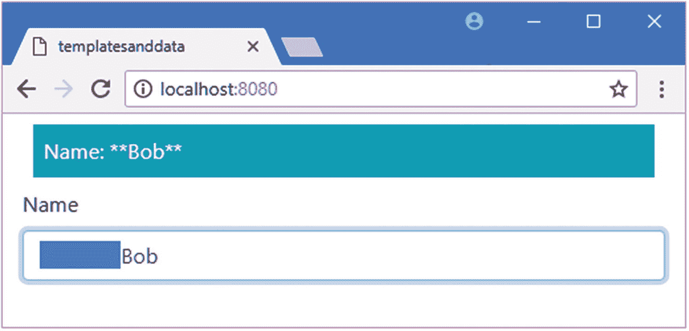

图 15-11

修剪空白字符

## 绑定到不同的数据类型

`v-model`指令能够调整它绑定到数据模型的方式，这使得以通常对 web 应用程序开发有用的方式使用表单元素成为可能，如以下部分所述。

### 选择一组项目

如果将`v-model`指令应用于复选框并绑定到作为数组的数据属性，那么选中和取消选中该框将在数组中添加和删除一个值。这比解释更容易演示，在清单 [15-14](#PC14) 中，我使用了`v-for`指令来生成一组复选框，并使用`v-model`指令将它们绑定到一个数组。

```js
<template>
    <div class="container-fluid">
        <div class="bg-info m-2 p-2 text-white">
            <div>Selected Cities: {{ cities }}</div>

        </div>

        <div class="form-check m-2" v-for="city in cityNames" v-bind:key="city">

            <label class="form-check-label">

                <input type="checkbox" class="form-check-input"

                       v-model="cities" v-bind:value="city" />

                {{city}}

            </label>

        </div>

        <div class="text-center">

            <button v-on:click="reset" class="btn btn-info">Reset</button>

        </div>

    </div>
</template>

<script>
    export default {
        name: "MyComponent",
        data: function () {
            return {
                cityNames: ["London", "New York", "Paris", "Berlin"],
                cities: []
            }
        },
        methods: {

            reset() {

                this.cities = [];

            }

        }

    }
</script>

Listing 15-14Creating a Binding to an Array in the App.vue File in the src Folder

```

`v-for`指令为`cityName`数组中的每个值创建一个 checkbox 元素，它提供了一组值，用户可以从中进行选择。每个`input`元素都配置了一个`value`属性，该属性指定了城市名，当它被选中时将被添加到`cities`数组中，当它被取消选中时将被删除。`v-model`指令被配置为创建一个到`cities`数组的双向数据绑定，该数组将由所选的值填充。双向绑定意味着，如果应用程序的另一部分——比如本例中的`reset`方法——从数组中删除值，那么`v-model`指令将自动取消选中该框。我使用了一个文本插值绑定来显示选中的值，如图 [15-12](#Fig12) 所示。

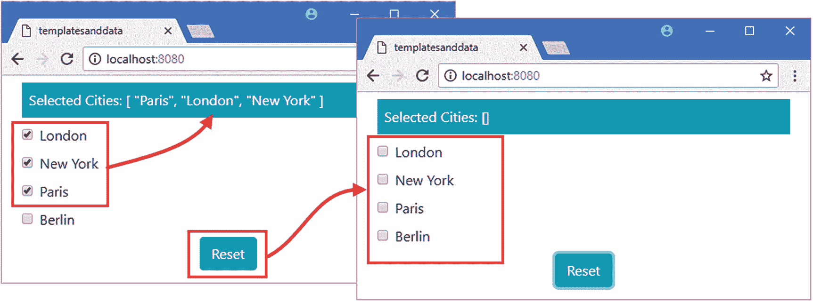

图 15-12

创建到数组的数据绑定

### 使用 SELECT 元素绑定到数组

使用配置为允许多重选择的 select 元素可以实现类似的效果，如下所示:

```js
...
<div class="form-control">
    <label>City</label>
    <select multiple class="form-control" v-model="cities">

        <option v-for="city in cityNames" v-bind:key="city">

            {{city}}

        </option>

    </select>

</div>
...

```

`v-for`指令应用于`option`元素，并用将呈现给用户的选项填充`select`元素。`v-model`指令被配置为绑定到一个数组，其工作方式与清单 [15-14](#PC14) 中展示的复选框组相同。

我更喜欢复选框，因为大多数用户并不知道需要按住修饰键——比如 Windows 上的 Shift 或 Control 键来进行连续和非连续的选择。向用户呈现一组复选框是一种更明显的方法，我更喜欢在`select`元素旁边显示解释性文本。

### 为表单元素使用自定义值

复选框的一个常见模式是间接切换一个值，以便由`input`元素及其`v-model`绑定提供的真/假值被计算属性或数据绑定表达式转换为不同的值。在清单 [15-15](#PC16) 中，我通过使用`v-bind`指令将一个元素分配给对应于引导 CSS 类的类，演示了这种模式。

```js
<template>
    <div class="container-fluid">
        <div class="m-2 p-2 text-white" v-bind:class="elemClass">

            <div>Value: {{ elemClass }}</div>

        </div>

        <div class="form-check m-2">

            <label class="form-check-label">

                <input type="checkbox" class="form-check-input"

                       v-model="dataValue" />

                Dark Color

            </label>

        </div>

    </div>
</template>

<script>
    export default {
        name: "MyComponent",
        data: function () {
            return {
                dataValue: false,

            }
        },
        computed: {

            elemClass() {

                return this.dataValue ? "bg-primary" : "bg-info";

            }

        }

    }
</script>

Listing 15-15Indirect Values in the App.vue File in the src Folder

```

复选框上的`v-model`指令设置名为`dataValue`的数据属性，该属性仅由`elemClass`计算属性使用，`div`元素上的`v-bind`指令使用该属性设置类成员。切换复选框的效果是在`bg-primary`和`bg-info`类之间移动`div`元素，Bootstrap 使用它来设置背景颜色，如图 [15-13](#Fig13) 所示。


图 15-13

使用复选框设置的间接值

当复选框设置的`data`属性以这种方式使用时，转换`true` / `false`值的计算属性可以通过应用`true-value`和`false-value`属性来消除，如清单 [15-16](#PC17) 所示。

```js
<template>
    <div class="container-fluid">
        <div class="m-2 p-2 text-white" v-bind:class="dataValue">

            <div>Value: {{ dataValue }}</div>

        </div>
        <div class="form-check m-2">
            <label class="form-check-label">
                <input type="checkbox" class="form-check-input"

                   v-model="dataValue" true-value="bg-primary"

                   false-value="bg-info" />

                Dark Color
            </label>
        </div>
    </div>
</template>

<script>
    export default {
        name: "MyComponent",
        data: function () {
            return {
                dataValue: "bg-info"

            }
        }
    }
</script>

Listing 15-16Simplifying Bindings in the App.vue File in the src Folder

```

`true-value`和`false-value`属性被`v-model`指令用来设置`dataValue`，这意味着不需要一个计算属性来将用户的选择转换成可以被`v-bind`指令使用的类名。结果是一样的——切换复选框改变了`div`元素的类成员资格——但是代码更简单、更干净。

#### 为单选按钮和选择元素使用自定义值

`v-model`指令可以与`v-bind`指令结合使用，以支持也可用于单选按钮和选择元素的值。在清单 [15-17](#PC18) 中，我添加了这两种类型的元素，并对它们进行了配置，使它们使用上一节中介绍的类名。

```js
<template>
    <div class="container-fluid">
        <div class="m-2 p-2 text-white" v-bind:class="dataValue">
            <div>Value: {{ dataValue }}</div>
        </div>
        <div class="form-check m-2">
            <label class="form-check-label">
                <input type="checkbox" class="form-check-input"

                       v-model="dataValue" v-bind:true-value="darkColor"

                       v-bind:false-value="lightColor" />

                Dark Color
            </label>
        </div>

        <div class="form-group m-2 p-2 bg-secondary">

            <label>Color</label>

            <select v-model="dataValue" class="form-control">

                <option v-bind:value="darkColor">Dark Color</option>

                <option v-bind:value="lightColor">Light Color</option>

            </select>

        </div>

        <div class="form-check-inline m-2">

            <label class="form-check-label">

                <input type="radio" class="form-check-input"

                        v-model="dataValue" v-bind:value="darkColor" />

                Dark Color

            </label>

        </div>

        <div class="form-check-inline m-2">

            <label class="form-check-label">

                <input type="radio" class="form-check-input"

                        v-model="dataValue" v-bind:value="lightColor" />

                Light Color

            </label>

        </div>

    </div>
</template>

<script>
    export default {
        name: "MyComponent",
        data: function () {
            return {
                darkColor: "bg-primary",

                lightColor: "bg-info",

                dataValue: "bg-info"

            }
        }
    }
</script>

Listing 15-17Using Custom Values for Other Elements in the App.vue File in the src Folder

```

为了避免在每个元素上重复类名，我使用了`v-bind`指令，通过名为`darkColor`和`lightColor`的数据属性为`input`和`option`元素设置`value`属性。结果是一组管理`div`元素的类成员资格的表单元素，而不需要计算属性来转换`true` / `false`值，如图 [15-14](#Fig14) 所示。

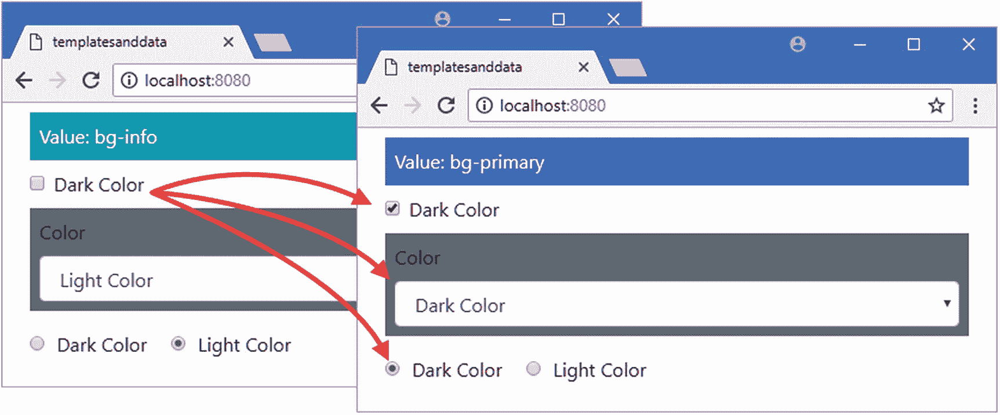

图 15-14

对其他元素使用自定义值

## 验证表单数据

一旦开始使用表单元素，就需要开始考虑数据验证。用户将在文本字段中输入任何内容，确保您的应用程序接收到运行所需的数据非常重要。在接下来的部分中，我将解释如何验证表单数据，为了做好准备，我已经更新了组件，使其包含一个简单的表单，如清单 [15-18](#PC19) 所示。

### 注意

在这一节中，我将向您展示如何编写您自己的验证代码，因为这很有趣，并且它演示了如何将本章和前面章节中描述的一些功能组合起来，以产生有用的功能。在实际项目中，我建议你依靠一个优秀的、广泛使用的开源包来进行 Vue.js 表单验证，比如`vuelidate` ( [`https://github.com/monterail/vuelidate`](https://github.com/monterail/vuelidate) )，我在第 1 部分中用于 SportsStore 项目的，或者`VeeValidate` ( [`http://vee-validate.logaretm.com`](http://vee-validate.logaretm.com) )。

```js
<template>
    <div class="container-fluid">

        <div class="btn-primary text-white my-2 p-2">
            Name: {{ name }}, Category: {{ category }}, Price: {{ price }}
        </div>

        <form v-on:submit.prevent="handleSubmit">
            <div class="form-group">
                <label>Name</label>
                <input v-model="name" class="form-control" />
            </div>
            <div class="form-group">
                <label>Category</label>
                <input v-model="category" class="form-control" />
            </div>
            <div class="form-group">
                <label>Price</label>
                <input type="number" v-model.number="price" class="form-control" />
            </div>

            <div class="text-center">
                <button class="btn btn-primary" type="submit">Submit</button>
            </div>

        </form>
    </div>

</template>

<script>
    export default {
        name: "MyComponent",
        data: function () {
            return {
                name: "",
                category: "",
                price: 0
            }
        },
        methods: {
            handleSubmit() {
                console.log(`FORM SUBMITTED: ${this.name} ${this.category} `
                    + ` ${this.price}`);
            }
        }
    }
</script>

Listing 15-18Creating a Form in the App.Vue File in the src Folder

```

该组件定义了名为`name`、`category`和`price`的`data`属性，这些属性通过`input`元素呈现给用户，这些元素已经应用了`v-model`指令。输入值的详细信息显示在表单元素上方，如图 [15-15](#Fig15) 所示。

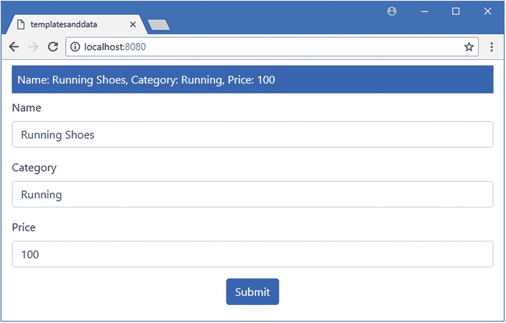

图 15-15

向用户呈现表单

`input`元素包含在一个`form`元素中，该元素应用了`v-on`指令，如下所示:

```js
...
<form v-on:submit.prevent="handleSubmit">
...

```

当用户点击类型被设置为`submit`的`button`元素时，触发`submit`事件。需要使用 prevent 修饰符来阻止浏览器向 HTTP 服务器提交表单，这是该事件的默认操作。该指令的表达式调用了一个名为`handleSubmit`的方法，该方法会将数据发送到实际应用程序中的 web 服务，但在本例中只是将一条消息写到浏览器的 JavaScript 控制台。单击 Submit 按钮，您将在 JavaScript 控制台中看到如下消息:

```js
...
FORM SUBMITTED: Running Shoes Running  100
...

```

我在第 19 章中解释了如何使用 web 服务，但是对于这一章，重点是验证用户输入的数据。本章这一部分的目标是控制由`handleSubmit`方法显示的消息，以便它只在用户为所有表单域输入有效数据时才显示。当执行验证时，有一套清晰的要求是很重要的，对于这个例子，每个属性的验证要求在表 [15-4](#Tab4) 中描述。

表 15-4

验证要求

<colgroup><col class="tcol1 align-left"> <col class="tcol2 align-left"></colgroup> 
| 

名字

 | 

描述

 |
| --- | --- |
| `name` | 用户必须提供至少包含三个字符的值。 |
| `category` | 用户必须提供一个仅包含字母的值。 |
| `price` | 用户必须提供一个仅包含数字且介于 1 和 1，000 之间的值。 |

### 定义验证规则

当您验证数据时，您会发现同一组规则被重复应用于用户提供的不同数据值。为了减少代码重复，定义一次验证规则并重用它们是一个好主意。为了定义表 [15-4](#Tab4) 中所需的验证规则，我在`src`文件夹中添加了一个名为`validationRules.js`的 JavaScript 文件，并添加了清单 [15-19](#PC22) 中所示的代码。

### 理解用户输入错误数据的原因

用户在应用程序中输入错误数据需要数据验证有几个原因。第一种类型的坏数据发生在用户不理解所需的数据或数据必须以何种格式表达时。我遇到的一个常见例子是要求信用卡在数字组之间有或没有空格。如果您需要用特定的格式来表示公共数据值，您应该让用户清楚。更好的是，完全避免这个问题，接受所有的通用格式，并自动将它们转换成您喜欢的格式。

第二类坏数据发生在用户不关心过程，只想得到结果的时候。如果你让用户忍受冗长而复杂的表单，或者一遍又一遍地重复一个过程，那么你会看到很多毫无意义的结果。为了最大限度地减少这种问题，请只向用户询问您真正需要的数据，尽可能提供合理的默认值，并且请记住，很少有用户会像您希望的那样关心您的产品和服务。

对于坏数据的最终原因，你无能为力，这是用户试图颠覆应用程序的地方。总会有恶意用户，你的产品和服务越有价值，吸引的恶意用户就越多。数据验证本身不足以避免这类问题，您必须付出适当的努力来进行端到端的安全审查、监控和补救。

```js
function required(name) {
    return {
        validator: (value) => value != "" && value !== undefined && value !== null,
        message: `A value is required for ${name}`
    }
}

function minLength(name, minlength) {
    return {
        validator: (value) => String(value).length >= minlength,
        message: `At least ${minlength} characters are required for ${name}`
    }
}

function alpha(name) {
    return {
        validator: (value) => /^[a-zA-Z]*$/.test(value),
        message: `${name} can only contain letters`
    }
}

function numeric(name) {
    return {
        validator: (value) => /^[0-9]*$/.test(value),
        message: `${name} can only contain digits`
    }
}

function range(name, min, max) {
    return {
        validator: (value) => value >= min && value <= max,
        message: `${name} must be between ${min} and ${max}`
    }
}

export default {
    name: [minLength("Name", 3)],
    category: [required("Category"), alpha("Category")],
    price: [numeric("Price"), range("Price", 1, 1000)]
}

Listing 15-19The Contents of the validationRules.js File in the src Folder

```

这个 JavaScript 文件定义了验证函数，我将使用这些函数来检查用户输入的值以及这些函数的组合，以验证每个属性。

### 执行验证

下一步是添加将执行验证的代码。在清单 [15-20](#PC23) 中，我添加了使用下一节定义的验证规则所需的方法和属性。

```js
<template>
    <div class="container-fluid">

        <div class="bg-danger text-white my-2 p-2" v-if="errors">

            <h5>The following problems have been found:</h5>

            <ul>

                <template v-for="(errors) in validationErrors">

                    <li v-for="error in errors" v-bind:key="error">{{error}}</li>

                </template>

            </ul>

        </div>

        <form v-on:submit.prevent="handleSubmit">
            <div class="form-group">
                <label>Name</label>
                <input v-model="name" class="form-control" />
            </div>
            <div class="form-group">
                <label>Category</label>
                <input v-model="category" class="form-control" />
            </div>
            <div class="form-group">
                <label>Price</label>
                <input type="number" v-model.number="price" class="form-control" />
            </div>

            <div class="text-center">
                <button class="btn btn-primary" type="submit">
                    Submit
                </button>
            </div>
        </form>
    </div>
</template>

<script>

    import validation from "./validationRules";

    import Vue from "vue";

    export default {
        name: "MyComponent",
        data: function () {
            return {
                name: "",
                category: "",
                price: 0,
                validationErrors: {},

            }
        },
        computed: {

            errors() {

                return Object.values(this.validationErrors).length > 0;

            }

        },

        methods: {
            validate(propertyName, value) {

                let errors = [];

                Object(validation)[propertyName].forEach(v => {

                    if (!v.validator(value)) {

                        errors.push(v.message);

                    }

                });

                if (errors.length > 0) {

                    Vue.set(this.validationErrors, propertyName, errors);

                } else {

                    Vue.delete(this.validationErrors, propertyName);

                }

            },

            validateAll() {

                this.validate("name", this.name);

                this.validate("category", this.category);

                this.validate("price", this.price);

                return this.errors;

            },

            handleSubmit() {
                if (this.validateAll()) {

                    console.log(`FORM SUBMITTED: ${this.name} ${this.category} `
                        + ` ${this.price}`);
                }
            }
        }
    }
</script>

Listing 15-20Performing Validation in the App.vue File in the src Folder

```

使用清单 [15-20](#PC23) 中定义的规则，`validate`方法用于验证单个`data`属性，这些规则通过`import`语句访问。验证错误的详细信息存储在名为`validationErrors`的`data`属性中，每个`input`字段都有一个属性设置为需要呈现给用户的验证消息数组。

### 小费

我在清单 [15-20](#PC23) 中使用的`Vue.delete`方法是在第 [13 章](13.html)中描述的`Vue.set`方法的对应物，用于从对象中移除一个属性，这样 Vue.js 就能意识到变化。

当用户点击提交按钮时，`handleSubmit`方法调用`validateAll`方法，后者调用每个`data`属性的`validate`方法，并执行动作——在本例中记录一条消息——只有在没有验证问题的情况下。

在组件的模板中，我使用`v-if`指令来控制`div`元素的可见性，然后依赖`v-for`指令来枚举`validationErrors`对象的属性，然后再次为每条消息创建`li`元素。

结果是，当点击提交按钮时，用户已经输入到表单中的值被检查，如图 [15-16](#Fig16) 所示，该图显示了在没有改变任何输入字段的情况下点击按钮时显示的错误。

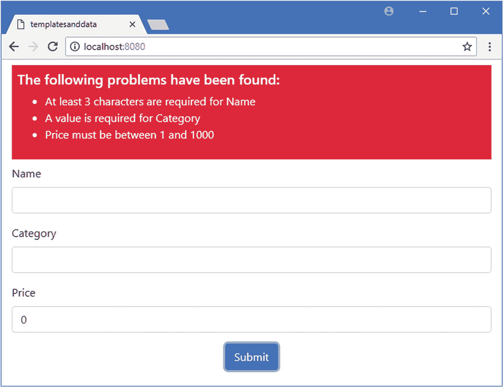

图 15-16

验证表单数据

### 响应实时变化

基本的验证工作正常，但是只有当用户单击提交按钮时才执行检查。更平滑的方法是在用户向`input`元素中输入数据时验证数据，提供更直接的反馈。我不想立即开始显示错误，所以我会等到用户点击一次提交后再响应更改，如清单 [15-21](#PC24) 所示。

```js
...
<script>

    import validation from "./validationRules";
    import Vue from "vue";

    export default {
        name: "MyComponent",
        data: function () {
            return {
                name: "",
                category: "",
                price: 0,
                validationErrors: {},
                hasSubmitted: false

            }
        },
        watch: {

            name(value) { this.validateWatch("name", value) },

            category(value) { this.validateWatch("category", value) },

            price(value) { this. validateWatch("price", value) }

        },

        computed: {
            errors() {
                return Object.values(this.validationErrors).length > 0;
            }
        },
        methods: {
            validateWatch(propertyName, value) {

                if (this.hasSubmitted) {

                    this.validate(propertyName, value);

                }

            },

            validate(propertyName, value) {
                let errors = [];
                Object(validation)[propertyName].forEach(v => {
                    if (!v.validator(value)) {
                        errors.push(v.message);
                    }
                });
                if (errors.length > 0) {
                    Vue.set(this.validationErrors, propertyName, errors);
                } else {
                    Vue.delete(this.validationErrors, propertyName);
                }
            },
            validateAll() {
                this.validate("name", this.name);
                this.validate("category", this.category);
                this.validate("price", this.price);
                return this.errors;
            },
            handleSubmit() {
                this.hasSubmitted = true;

                if (this.validateAll()) {
                    console.log(`FORM SUBMITTED: ${this.name} ${this.category} `
                        + ` ${this.price}`);
                }
            }
        }
    }
</script>
...

Listing 15-21Responding to Changes in the App.vue File in the src Folder

```

我在`script`元素中添加了一个`watch`部分，用于定义观察者。我在第 [17](17.html) 章解释了观察器，但是这个特性允许一个组件在它的一个数据值改变时接收通知。在这个例子中，我已经向`watch`部分添加了函数，这样当`name`、`category`和`price`属性发生变化时，我将收到通知，并使用这个通知来调用一个名为`validateWatch`的方法，该方法仅在提交按钮至少被单击一次后才验证属性值，这通过一个名为`hasSubmitted`的新`data`属性来管理。其结果是，一旦点击提交按钮，显示给用户的错误信息会在编辑时立即更新，如图 [15-17](#Fig17) 所示。

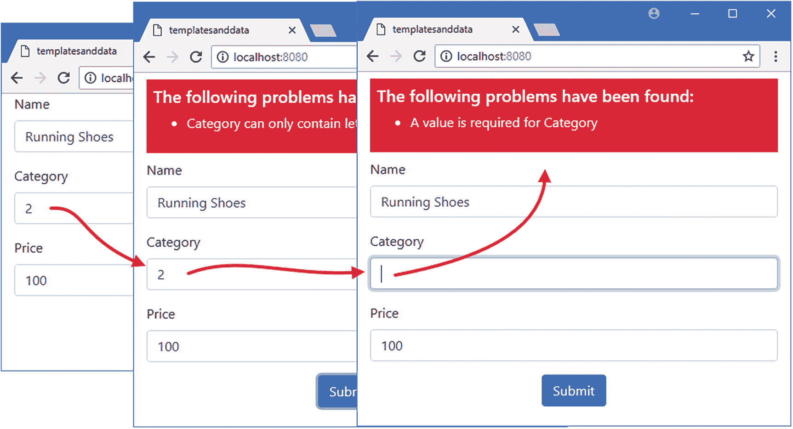

图 15-17

验证错误的即时反馈

## 摘要

在本章中，我解释了双向数据绑定的使用，并描述了如何使用`v-model`指令创建它们。我还演示了如何使用 v-model 指令和 Vue.js 的其他关键特性来验证用户输入到 HTML 表单中的数据。在下一章，我将描述如何使用组件来给应用程序添加结构。