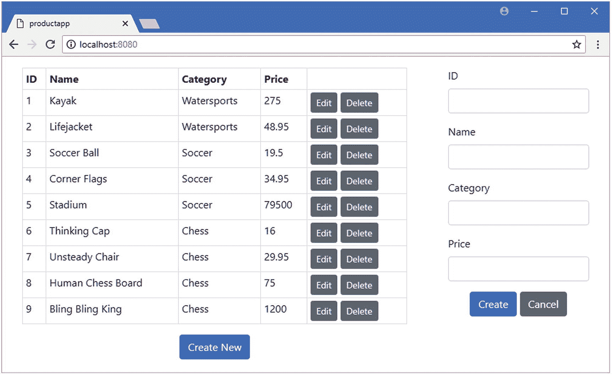
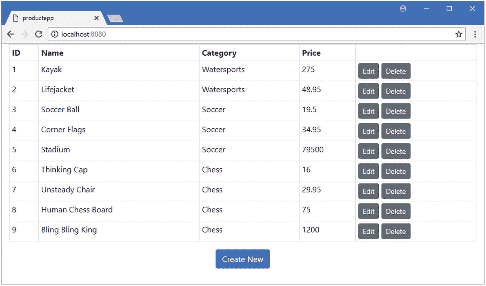
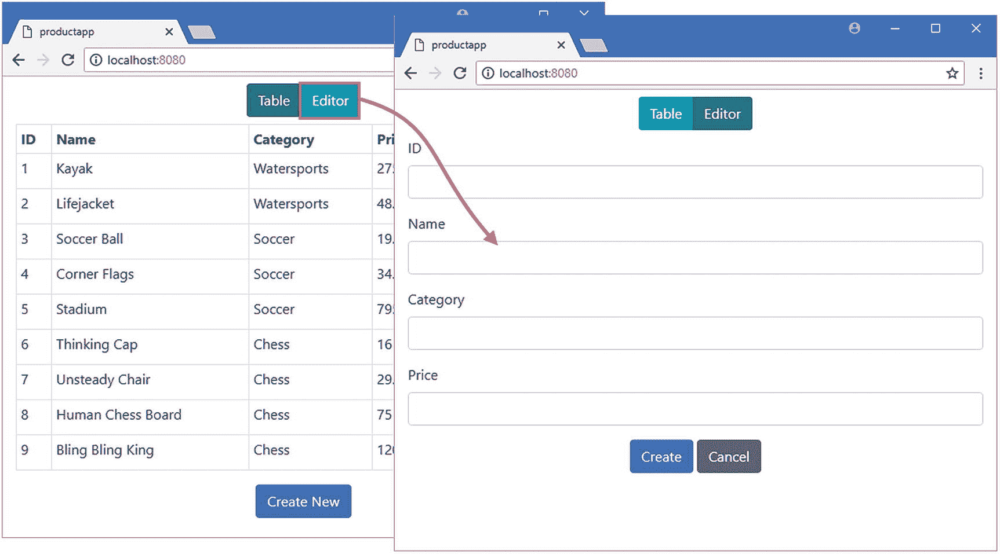
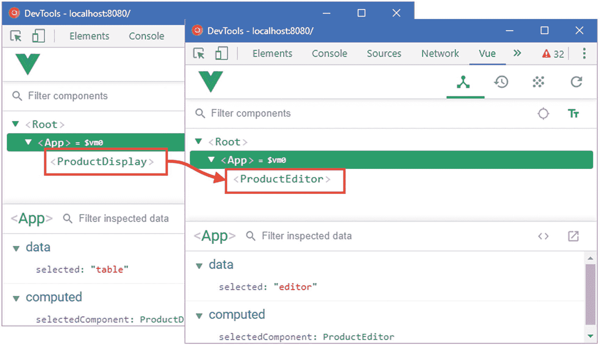
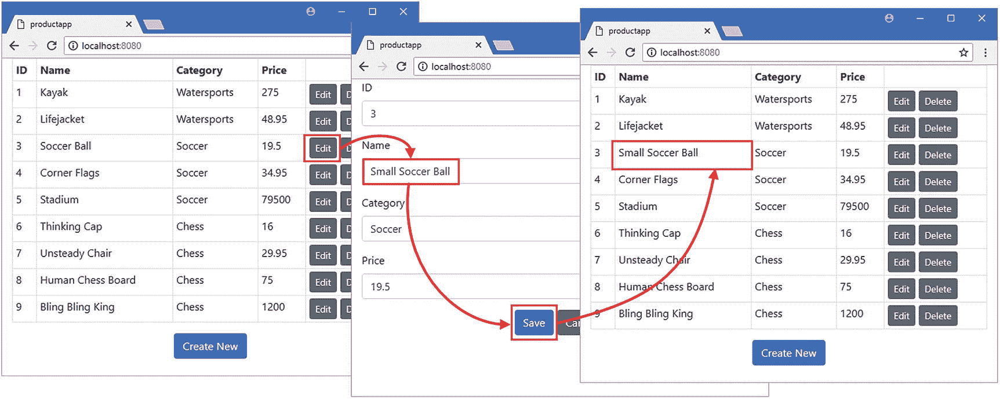
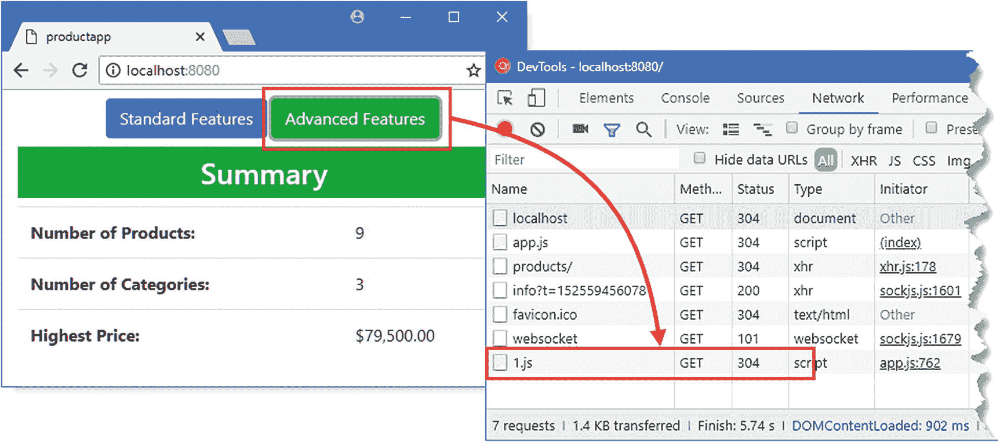

# 21.动态组件

简单的应用程序可以一次向用户呈现所有的内容，但是更复杂的项目需要更有选择性，在不同的时间向用户显示不同的组件。在这一章中，我解释了内置的 Vue.js 特性，这些特性允许组件基于用户交互动态显示，并仅在需要时加载组件，这有助于减少用户消耗的数据量。表 [21-1](#Tab1) 将动态组件放在上下文中。

### 小费

本章中描述的特性经常与 URL 路由一起使用，我在第 [22](22.html) 章中对此进行了描述。

表 21-1

将动态组件放在上下文中

<colgroup><col class="tcol1 align-left"> <col class="tcol2 align-left"></colgroup> 
| 

问题

 | 

回答

 |
| --- | --- |
| 它们是什么？ | 动态组件仅在需要时向用户显示。 |
| 它们为什么有用？ | 复杂的应用程序有太多的功能，无法一次呈现给用户。能够改变显示给用户的组件允许应用程序呈现复杂的内容而不会让用户不知所措。 |
| 它们是如何使用的？ | Vue.js `is`指令可用于动态选择组件。 |
| 有什么陷阱或限制吗？ | 必须注意确保动态组件不会对其生命周期做出假设，这在将动态组件引入现有项目时可能是一个问题。有关详细信息，请参见“为动态生命周期准备组件”一节。 |
| 有其他选择吗？ | 应用程序不必动态显示它们的组件。简单的应用程序可以一次显示所有的内容，如前面章节中的示例应用程序所示。 |

表 [21-2](#Tab2) 总结了本章内容。

表 21-2

章节总结

<colgroup><col class="tcol1 align-left"> <col class="tcol2 align-left"> <col class="tcol3 align-left"></colgroup> 
| 

问题

 | 

解决办法

 | 

列表

 |
| --- | --- | --- |
| 动态选择一个组件 | 使用`is`属性和`v-bind`指令 | 6–12 |
| 仅在需要时加载组件 | 定义异步组件 | 13–14 |
| 禁用预取提示 | 更改应用程序配置 | Fifteen |
| 微调异步组件 | 使用延迟加载配置选项 | 16, 17 |

## 为本章做准备

我继续使用第 21 章中的 productapp 例子。要启动 RESTful web 服务，打开命令提示符并运行清单 [21-1](#PC1) 中的命令。

```js
npm run json

Listing 21-1Starting the Web Service

```

打开第二个命令提示符，导航到`productapp`目录，运行清单 [21-2](#PC2) 中所示的命令来启动 Vue.js 开发工具。

```js
npm run serve

Listing 21-2Starting the Development Tools

```

一旦初始捆绑过程完成，打开一个新的浏览器窗口并导航到`http://localhost:8080`，在那里你将看到示例应用程序，如图 [21-1](#Fig1) 所示。

### 小费

你可以从 [`https://github.com/Apress/pro-vue-js-2`](https://github.com/Apress/pro-vue-js-2) 下载本章以及本书其他章节的示例项目。



图 21-1

运行示例应用程序

## 为动态生命周期准备组件

编写`ProductDisplay`和`ProductEditor`组件时，假设它们将在应用程序初始化时创建，并一直存在到应用程序终止。当动态显示组件时，这可能是一个问题，因为 Vue.js 不会在需要时创建组件，一旦用户看不到它们，就会销毁它们。结果是，观察器和事件处理程序可能会错过重要的通知，并且每次创建组件时，即使应用程序已经收到了所需的数据，也要重复执行代价高昂的任务，例如从 web 服务获取数据。

### 获取应用程序数据

在清单 [21-3](#PC3) 中，我删除了从 web 服务获取初始数据的`ProductDisplay`组件的`created`方法中的语句。当我开始向用户动态显示组件时，每当用户想要查看产品表时，Vue.js 将创建该组件的一个新实例，并且创建的实例将有自己的生命周期，包括调用它的`created`方法。

```js
...
<script>

    import { mapState, mapMutations, mapActions, mapGetters } from "vuex";

    export default {
        computed: {
            ...mapState(["products"]),
            ...mapState({
                useStripedTable: state => state.prefs.stripedTable
            }),
            ...mapGetters({
                tableClass: "prefs/tableClass",
                editClass: "prefs/editClass",
                deleteClass: "prefs/deleteClass"
            })
        },
        methods: {
            ...mapMutations({
                editProduct: "selectProduct",
                createNew: "selectProduct",
                setEditButtonColor: "prefs/setEditButtonColor",
                setDeleteButtonColor: "prefs/setDeleteButtonColor"
            }),
            ...mapActions({
                //getProducts: "getProductsAction",

                deleteProduct: "deleteProductAction"
            })
        },
        created() {
            //this.getProducts();

            this.setEditButtonColor(false);
            this.setDeleteButtonColor(false);
        }
    }
</script>
...

Listing 21-3Avoiding Duplicate Requests in the ProductDisplay.vue File in the src/components Folder

```

应该只执行一次的任务必须由不会动态显示的组件来处理。在大多数 Vue.js 项目中，顶层组件用于协调应用程序其他组件的可见性，并且对用户始终可见。在清单 [21-4](#PC4) 中，我让`App`组件负责从 web 服务获取初始数据。

```js
<template>
    <div class="container-fluid">
        <div class="row">
            <div class="col"><error-display /></div>
        </div>
        <div class="row">
            <div class="col-8 m-3"><product-display /></div>
            <div class="col m-3"><product-editor /></div>
        </div>
    </div>
</template>

<script>
    import ProductDisplay from "./components/ProductDisplay";
    import ProductEditor from "./components/ProductEditor";
    import ErrorDisplay from "./components/ErrorDisplay";

    export default {
        name: 'App',
        components: { ProductDisplay, ProductEditor, ErrorDisplay },
        created() {

            this.$store.dispatch("getProductsAction");

        }

    }
</script>

Listing 21-4Getting Data in the App.vue File in the src Folder

```

我使用了 Vuex `dispatch`方法来调用名为`getProductsAction`的动作，我在第 [20 章](20.html)中定义了这个动作。由于我不会动态显示`App`组件，我可以相信这个任务只被执行一次。

### 管理观察事件

`ProductEditor`组件使用数据存储观察器来确定用户何时单击新建或编辑按钮。当动态创建组件时，可能很难确保在 Vue.js 创建它需要的组件之前处理应用程序状态的更改，结果是组件可能会错过配置它以供使用的事件。在清单 [21-5](#PC5) 中，我修改了`ProductEditor`组件，在它的`created`方法中使用现有的数据存储值。

```js
...
<script>

    let unwatcher;

    export default {
        data: function () {
            return {
                editing: false,
                product: {}
            }
        },
        methods: {
            save() {
                this.$store.dispatch("saveProductAction", this.product);
                this.product = {};
            },
            cancel() {
                this.$store.commit("selectProduct");
            },
            selectProduct(selectedProduct) {

                if (selectedProduct == null) {

                    this.editing = false;

                    this.product = {};

                } else {

                    this.editing = true;

                    this.product = {};

                    Object.assign(this.product, selectedProduct);

                }

            }

        },
        created() {
            unwatcher = this.$store.watch(state =>

                state.selectedProduct, this.selectProduct);

            this.selectProduct(this.$store.state.selectedProduct);

        },
        beforeDestroy() {

           unwatcher();

        }

    }
</script>
...

Listing 21-5Preparing for Dynamic Display in the ProductEditor.vue File in the src/components Folder

```

`created`方法处理数据存储中的当前数据值，并使用`watch`方法创建一个观察器来观察未来的变化。`watch`方法的结果是一个可以用来停止接收通知的函数，我在`beforeDestroy`生命周期方法中使用了这个函数，以确保当 Vue.js 销毁组件时，观察器不会逗留。

## 动态显示组件

现在组件已经更新了，所以它们可以被创建和销毁而不会引起任何问题，我可以改变应用程序显示其内容的方式。在这一节中，我将演示如何直接使用 Vue.js 支持来动态选择组件，这将为解释如何使用流行的`Vue-Router`包提供基础。

### 在 HTML 元素中呈现不同的组件

Vue.js 支持 HTML 元素上的一个特殊属性来指定组件，当应用程序运行时，该组件的内容将用于替换该元素。这个特殊属性叫做`is`，它可以用在任何元素上，尽管惯例是使用`component`元素，如清单 [21-6](#PC6) 所示。

### 小费

当您保存清单 [21-6](#PC6) 中的更改时，您将会看到一个 linter 警告。这将在下一节中解决。

```js
<template>
    <div class="container-fluid">
        <div class="row">
            <div class="col"><error-display /></div>
        </div>
        <div class="row">
            <div class="col">

                <component is="ProductDisplay"></component>

            </div>

        </div>
    </div>
</template>

<script>
    import ProductDisplay from "./components/ProductDisplay";
    import ProductEditor from "./components/ProductEditor";
    import ErrorDisplay from "./components/ErrorDisplay";

    export default {
        name: 'App',
        components: { ProductDisplay, ProductEditor, ErrorDisplay },
        created() {
            this.$store.dispatch("getProductsAction");
        }
    }
</script>

Listing 21-6Using the is Attribute in the App.vue File in the src Folder

```

在运行时，Vue.js 将遇到`component`元素上的`is`属性，并评估该属性的值以确定应该显示哪个组件。在清单中，`is`属性被设置为`ProductDisplay`，这是由`script`元素中的`import`语句分配的名称，并且已经与 components `configuration`属性一起使用，结果是向用户呈现产品表，如图 [21-2](#Fig2) 所示。



图 21-2

显示组件

### 使用数据绑定选择组件

当与数据绑定一起使用时,`is`属性变得很有趣，它允许在应用程序运行时改变呈现给用户的组件。在清单 [21-7](#PC7) 中，我添加了一个数据绑定到`App`组件的模板，它根据用户的选择设置`is`属性的值。

```js
<template>
    <div class="container-fluid">
        <div class="row">
            <div class="col text-center m-2">
                <div class="btn-group btn-group-toggle">

                    <label class="btn btn-info"

                           v-bind:class="{active: (selected == 'table') }">

                        <input type="radio" v-model="selected" value="table" />

                        Table

                    </label>

                    <label class="btn btn-info"

                           v-bind:class="{active: (selected == 'editor') }">

                        <input type="radio" v-model="selected" value="editor" />

                        Editor

                    </label>

                </div>

            </div>
        </div>
        <div class="row">
            <div class="col">
                <component v-bind:is="selectedComponent"></component>

            </div>
        </div>
    </div>
</template>

<script>
    import ProductDisplay from "./components/ProductDisplay";
    import ProductEditor from "./components/ProductEditor";
    import ErrorDisplay from "./components/ErrorDisplay";

    export default {
        name: 'App',
        components: { ProductDisplay, ProductEditor, ErrorDisplay },
        created() {
            this.$store.dispatch("getProductsAction");
        },
        data: function() {

            return {

                selected: "table"

            }

        },

        computed: {

            selectedComponent() {

                return this.selected == "table" ? ProductDisplay : ProductEditor;

            }

        }

    }
</script>

Listing 21-7Using a Data Binding in the App.vue File in the src Folder

```

本例中的`input`元素允许用户通过使用`v-model`指令更改名为`selected`的数据属性来选择显示哪个组件。`component`元素上的`is`属性的值反映了使用`v-bind`指令选择的值，该指令读取一个`computed`属性的值，该属性使用`selected`值来标识用户需要的组件，产生如图 [21-3](#Fig3) 所示的结果。



图 21-3

使用数据绑定选择组件

向用户呈现一个按钮组，允许选择应用程序显示的组件:单击 Table 按钮显示`ProductDisplay`组件，单击 Editor 按钮显示`ProductEditor`按钮。

#### 了解组件生命周期

值得花点时间检查一下应用程序的状态，看看 Vue.js 是如何处理动态变化的。在使用 Vue Devtools 查看应用程序的组件时，点击表格和编辑器按钮，你会看到组件在需要时被创建和销毁，结果是`App`组件在任何给定时刻都只有一个子组件，如图 [21-4](#Fig4) 所示。



图 21-4

创建和销毁组件

### 重用动态组件

Vue.js 提供了另一种管理动态组件的方法，不需要在每次需要时创建它们，不需要时销毁它们。如果用一个`keep-alive`元素包围显示组件的元素(具有`is`属性的元素), Vue.js 会在不需要组件时使它们不活动，而不是销毁它们。下面是一个应用`keep-alive`元素的例子:

```js
...
<div class="row">
    <div class="col">
        <keep-alive>

            <component v-bind:is="selectedComponent"></component>
        </keep-alive>

    </div>
</div>
...

```

这个特性的优点是您不必担心更新组件，以避免重复一次性任务或错过重要事件。缺点是资源被不活动的并且可能不再需要的组件消耗。

我的建议是让 Vue.js 在需要的时候创建和销毁组件，但是如果你确实使用了`keep-alive`元素，那么你可以通过实现`activated`和`deactivated`生命周期方法在组件激活和非激活时接收通知(关于组件生命周期的细节，请参见第 [17 章](17.html))。

### 在应用程序中自动导航

让用户选择组件使我能够演示组件是如何动态显示的，但这不是大多数应用程序需要的工作方式。我希望应用程序能够根据用户的操作自动向用户呈现适当的组件，这意味着应用程序中的所有组件都能够更改向用户显示的组件，例如，单击编辑按钮将自动选择编辑器组件。

我首先用清单 [21-8](#PC9) 中所示的代码向`src/store`文件夹添加一个名为`navigation.js`的文件。

```js
export default {
    namespaced: true,
    state: {
        selected: "table"
    }
    ,
    mutations: {
        selectComponent(currentState, selection) {
            currentState.selected = selection;
        }
     }
}

Listing 21-8The Contents of the navigation.js File in the src/store Folder

```

这个 Vuex 模块将扩展数据存储，以便我可以在应用程序中导航。我将使用`selected`状态属性作为`is`属性的值，并使用`selectComponent`变异来改变它的值。在清单 [21-9](#PC10) 中，我已经将模块导入到主数据存储中。

```js
import Vue from "vue";
import Vuex from "vuex";
import Axios from "axios";

import PrefsModule from "./preferences";

import NavModule from "./navigation";

Vue.use(Vuex);

const baseUrl = "http://localhost:3500/products/";

export default new Vuex.Store({
    modules: {
        prefs: PrefsModule,
        nav: NavModule

    },
    state: {
        products: [],
        selectedProduct: null
    },

    // ...other data store features omitted for brevity...

})

Listing 21-9Adding a Module in the index.js File in the src/store Folder

```

下一步是使用新的数据存储状态属性作为`App`组件模板中`is`属性的值，如清单 [21-10](#PC11) 所示。除了使用数据存储，我还删除了允许用户显式选择要显示的组件的按钮元素。

```js
<template>
    <div class="container-fluid">
        <!-- <div class="row">

            <div class="col text-center m-2">

                <div class="btn-group btn-group-toggle">

                    <label class="btn btn-info"

                           v-bind:class="{active: (selected == 'table') }">

                        <input type="radio" v-model="selected" value="table" />

                        Table

                    </label>

                    <label class="btn btn-info"

                           v-bind:class="{active: (selected == 'editor') }">

                        <input type="radio" v-model="selected" value="editor" />

                        Editor

                    </label>

                </div>

            </div>

        </div> -->

        <div class="row">
            <div class="col">
                <component v-bind:is="selectedComponent"></component>
            </div>
        </div>
    </div>
</template>

<script>
    import ProductDisplay from "./components/ProductDisplay";
    import ProductEditor from "./components/ProductEditor";
    import ErrorDisplay from "./components/ErrorDisplay";

    import { mapState } from "vuex";

    export default {
        name: 'App',
        components: { ProductDisplay, ProductEditor, ErrorDisplay },
        created() {
            this.$store.dispatch("getProductsAction");
        },
        // data: function() {

        //     return {

        //         selected: "table"

        //     }

        // },

        computed: {
            ...mapState({

                selected: state => state.nav.selected

            }),

            selectedComponent() {
                return this.selected == "table" ? ProductDisplay : ProductEditor;
            }
        }
    }
</script>

Listing 21-10Using the Data Store in the App.vue File in the src Folder

```

剩下的工作就是调用数据存储突变来改变向用户显示的组件。在清单 [21-11](#PC12) 中，我已经更新了`ProductDisplay`组件，这样当用户点击一个新建或编辑按钮时，就会看到编辑器。

```js
...
<script>
    import { mapState, mapMutations, mapActions, mapGetters } from "vuex";

    export default {
        computed: {
            ...mapState(["products"]),
            ...mapState({
                useStripedTable: state => state.prefs.stripedTable
            }),
            ...mapGetters({
                tableClass: "prefs/tableClass",
                editClass: "prefs/editClass",
                deleteClass: "prefs/deleteClass"
            })
        },
        methods: {
            editProduct(product) {

                this.selectProduct(product);

                this.selectComponent("editor");

            },

            createNew() {

                this.selectProduct();

                this.selectComponent("editor");

            },

            ...mapMutations({
                selectProduct: "selectProduct",

                selectComponent: "nav/selectComponent",

                //editProduct: "selectProduct",

                //createNew: "selectProduct",

                setEditButtonColor: "prefs/setEditButtonColor",
                setDeleteButtonColor: "prefs/setDeleteButtonColor"
            }),
            ...mapActions({
                deleteProduct: "deleteProductAction"
            })
        },
        created() {
            this.setEditButtonColor(false);
            this.setDeleteButtonColor(false);
        }
    }
</script>
...

Listing 21-11Adding Navigation in the ProductDisplay.vue File in the src/components Folder

```

我已经重新定义了`editProduct`和`createNew`方法，因此它们不再直接映射到`selectProduct`数据存储变异。相反，我创建了本地方法，调用`selectProduct`和`selectComponent`突变来识别将要编辑的对象，然后显示编辑器组件。在清单 [21-12](#PC13) 中，我已经更新了`ProductEditor`组件，这样一旦用户完成或取消了编辑任务，它就会导航到表格显示。

### 将导航与其他操作分开

请注意，我在示例应用程序的组件中处理了导航，而不是将其直接合并到数据存储变异中，如`selectProduct`。将导航作为其他状态变化的一部分来执行可能很诱人，但是这是假设当执行给定的突变或动作时，组件将总是显示。当您开始动态显示组件时可能是这种情况，但随着项目变得更加复杂，用户会看到应用程序功能的不同路径，这种情况经常会发生变化。在每个组件中执行导航可能看起来更复杂，但它会使应用程序更容易适应新功能。

```js
...
<script>

    let unwatcher;

    export default {
        data: function () {
            return {
                editing: false,
                product: {}
            }
        },
        methods: {
            async save() {

                await this.$store.dispatch("saveProductAction", this.product);

                this.$store.commit("nav/selectComponent", "table");

                this.product = {};
            },
            cancel() {
                this.$store.commit("selectProduct");
                this.$store.commit("nav/selectComponent", "table");

            },
            selectProduct(selectedProduct) {
                if (selectedProduct == null) {
                    this.editing = false;
                    this.product = {};
                } else {
                    this.editing = true;
                    this.product = {};
                    Object.assign(this.product, selectedProduct);
                }
            }
        },
        created() {
            unwatcher = this.$store.watch(state =>
                state.selectedProduct, this.selectProduct);
            this.selectProduct(this.$store.state.selectedProduct);
        },
        beforeDestroy() {
           unwatcher();
        }
    }
</script>
...

Listing 21-12Adding Navigation in the ProductEditor.vue File in the src/components Folder

```

该组件直接使用数据存储功能，而不使用 Vuex 映射功能。我在`save`方法中添加了`async`关键字，这允许我在保存产品时使用`await`关键字，这样在 HTTP 操作完成之前不会执行导航。

结果是用户的动作自动选择将要显示的组件，自动在表格和编辑器之间切换，如图 [21-5](#Fig5) 所示。



图 21-5

在组件之间导航

## 使用异步组件

在较大的应用程序中，通常有些功能不是所有用户都需要的，或者只是偶尔需要，例如高级设置或管理工具。默认情况下，这些未使用的组件包含在发送给浏览器的 JavaScript 包中，这会浪费带宽并增加应用程序启动的时间。为了避免这个问题，Vue.js 提供了异步组件特性，用于将组件的加载推迟到需要的时候——这个特性也被称为*延迟加载*。为了演示异步组件特性，我在`src/components`文件夹中添加了一个名为`DataSummary.vue`的文件，其内容如清单 [21-13](#PC14) 所示。

```js
<template>
    <div>
        <h3 class="bg-success text-center text-white p-2">
            Summary
        </h3>
        <table class="table">
            <tr><th>Number of Products:</th><td> {{ products.length}} </td></tr>
            <tr><th>Number of Categories:</th><td> {{ categoryCount }} </td></tr>
            <tr>
                <th>Highest Price:</th><td> {{ highestPrice | currency }} </td>
            </tr></table>
    </div>
</template>

<script>

    import { mapState,  } from "vuex";

    export default {
        computed: {
            ...mapState(["products"]),
            categoryCount() {
                if (this.products.length > 0) {
                    return this.products.map(p => p.category)
                        .filter((cat, index, arr) => arr.indexOf(cat)
                            == index).length;
                } else {
                    return 0;
                }
            },
            highestPrice() {
                if (this.products.length == 0) {
                    return 0;
                } else {
                    return Math.max(...this.products.map(p => p.price));
                }
            }
        },
        filters: {
            currency(value) {
                return new Intl.NumberFormat("en-US",
                    { style: "currency", currency: "USD" }).format(value);
            }
        }
    }
</script>

Listing 21-13The Contents of the DataSummary.vue File in the src/components Folder

```

该组件显示商店中数据的摘要，对于本章来说，这是一个我不希望浏览器在需要时才加载的特性。在清单 [21-14](#PC15) 中，我已经注册了新的组件，因此它将被延迟加载。

### 了解延迟加载的成本

术语 *lazy* 指的是组件直到被需要时才会从 HTTP 服务器加载。这与默认的急切加载策略形成对比，在默认策略中，组件作为主应用程序包的一部分被加载，即使它们可能并不需要。

这两种方法都代表了一种妥协。急切加载需要更大的初始下载量，并以带宽和启动速度换取更流畅的用户体验，因为用户可能需要的所有代码和内容总是可用的。延迟加载减少了初始下载的大小，但是如果需要的话，需要对组件进行额外的 HTTP 请求。

您可以根据您对应用程序使用方式的预期来初步评估哪些组件应该延迟加载，但是一旦您部署了应用程序，验证您的预期是非常重要的。如果您发现大多数用户都在执行延迟加载组件的操作，那么您应该更改应用程序的配置，因为这两种方法都有不利的一面，这样就不会节省带宽，并且用户必须等待延迟加载的执行。

```js
<template>
    <div class="container-fluid">
        <div class="col">

            <div class="col text-center m-2">

                <button class="btn btn-primary"

                        v-on:click="selectComponent('table')">

                    Standard Features

                </button>

                <button class="btn btn-success"

                        v-on:click="selectComponent('summary')">

                    Advanced Features

                </button>

            </div>

        </div>

        <div class="row">
            <div class="col">
                <component v-bind:is="selectedComponent"></component>
            </div>
        </div>
    </div>
</template>

<script>
    import ProductDisplay from "./components/ProductDisplay";
    import ProductEditor from "./components/ProductEditor";
    import ErrorDisplay from "./components/ErrorDisplay";

    const DataSummary = () => import("./components/DataSummary");

    import { mapState, mapMutations } from "vuex";

    export default {
        name: 'App',
        components: { ProductDisplay, ProductEditor, ErrorDisplay, DataSummary },

        created() {
            this.$store.dispatch("getProductsAction");
        },
        methods: {

            ...mapMutations({

                selectComponent: "nav/selectComponent"

            })

        },

        computed: {
            ...mapState({
                selected: state => state.nav.selected
            }),
            selectedComponent() {

                switch (this.selected) {

                    case "table":

                        return ProductDisplay;

                    case "editor":

                        return ProductEditor;

                    case "summary":

                        return  DataSummary;

                }

            }

        }
    }
</script>

Listing 21-14Lazily Loading a Component in the App.vue File in the src/components Folder

```

清单中有许多变化，但这一变化告诉 Vue.js，这是一个应该只在需要时才加载的组件:

```js
...
const DataSummary = () => import("./components/DataSummary");
...

```

关键字`import`的标准用法创建了一个静态依赖，webpack 通过将组件包含在它创建的 JavaScript 包中来处理这个静态依赖。但是这种形式的`import`，其中它被用作一个函数，组件被指定为参数，创建了一个动态依赖，webpack 通过将组件放入它自己的包中来处理它。`import`函数的结果是一个 JavaScript `Promise`，当组件被加载时，这个 JavaScript 就会被执行。一旦调用了`import`函数，加载过程就开始了，所以分配组件引用是很重要的，在这个例子中是`DataSummary`，这个函数又调用了`import`。

```js
...

const DataSummary = () => import("./components/DataSummary");
...

```

当选择`DataSummary`与`is`属性一起使用时，Vue.js 检测该函数，这表示一个异步组件。调用该函数来启动加载过程，一旦完成就显示组件。

### 禁用预取提示

默认情况下，项目被配置为向浏览器提供预取提示，指示将来可能需要有应用程序内容。这个特性的目的是让浏览器决定在需要之前获取内容是否有意义。这往往会破坏 Vue.js 模块的惰性加载的想法，因为 JavaScript 文件将被下载，然后在不使用的情况下被丢弃，而这可能是少数用户所需要的。为了禁用预取提示特性，我在`productapp`文件夹中添加了一个名为`vue.config.js`的文件，并添加了清单 [21-15](#PC18) 中所示的语句。

```js
module.exports = {
    chainWebpack: config => {
        config.plugins.delete('prefetch');
    }
}

Listing 21-15Disabling Prefetch Hints in the vue.config.js File in the productapp Folder

```

要应用配置更改，请停止开发工具，并通过运行`productapp`文件夹中清单 [21-16](#PC19) 中所示的命令来重新启动它们。

```js
npm run serve

Listing 21-16Starting the Vue.js Development Tools

```

为了测试异步组件，导航到`http://localhost:8080`并点击高级功能按钮，这将显示清单 [21-13](#PC14) 中定义的组件，如图 [21-6](#Fig6) 所示。



图 21-6

延迟加载组件

您不太可能在加载组件时看到任何延迟，因为浏览器和 HTTP 服务器运行在同一个工作站上。但是如果你打开浏览器的 F12 开发工具，切换到网络选项卡，当你点击高级功能按钮时，你会看到有一个对 JavaScript 文件的 HTTP 请求。这是包含`DataSummary`组件的文件，对我来说它叫做`1.js`，尽管你可能会看到一个不同的名字。

### 配置延迟加载

Vue.js 提供了一组配置选项，可用于微调异步组件的加载过程，如表 [21-3](#Tab3) 所述。

表 21-3

惰性加载配置选项

<colgroup><col class="tcol1 align-left"> <col class="tcol2 align-left"></colgroup> 
| 

名字

 | 

描述

 |
| --- | --- |
| `component` | 该属性用于定义将加载异步组件的`import`函数。 |
| `loading` | 此属性用于指定在加载过程中向用户显示的组件。 |
| `delay` | 该属性用于指定在向用户显示`loading`组件之前的延迟，以毫秒表示。默认值为 200。 |
| `error` | 此属性用于指定在加载操作失败或超时时向用户显示的组件。 |
| `timeout` | 此属性用于指定加载操作的超时时间，以毫秒为单位。默认值永远等待。 |

这些配置选项中最有用的是`loading`属性，它指定在加载异步组件时应该向用户显示的组件，以及`delay`选项，它指定在向用户显示加载组件之前的延迟，并确保用户不会看到快速完成的操作的加载消息。

### 警告

您不应该使用`loading`属性来指定延迟加载的组件，因为它可能在需要的时候还没有被加载。

为了准备演示表 [21-3](#Tab3) 中描述的属性，我需要一个可以在加载过程中显示的组件，所以我在`src/components`文件夹中添加了一个名为`LoadingMessage.vue`的文件，其内容如清单 [21-17](#PC20) 所示。

```js
<template>
    <h3 class="bg-info text-white text-center m-2 p-2">
        Lazily Loading Component...
    </h3>
</template>

Listing 21-17The Contents of the LoadingMessage.vue File in the src/components Folder

```

该组件只包含一个向用户显示消息的模板。在清单 [21-18](#PC21) 中，我已经使用这个组件来配置`DataSummary`组件的延迟加载。

```js
...
<script>
    import ProductDisplay from "./components/ProductDisplay";
    import ProductEditor from "./components/ProductEditor";
    import ErrorDisplay from "./components/ErrorDisplay";
    import LoadingMessage from "./components/LoadingMessage";

    const DataSummary = () => ({

        component: import("./components/DataSummary"),

        loading: LoadingMessage,

        delay: 100

    });

    import { mapState, mapMutations } from "vuex";

    export default {
        name: 'App',
        components: { ProductDisplay, ProductEditor, ErrorDisplay, DataSummary },
        created() {
            this.$store.dispatch("getProductsAction");
        },
        methods: {
            ...mapMutations({
                selectComponent: "nav/selectComponent"
            })
        },
        computed: {
            ...mapState({
                selected: state => state.nav.selected
            }),
            selectedComponent() {
                switch (this.selected) {
                    case "table":
                        return ProductDisplay;
                    case "editor":
                        return ProductEditor;
                    case "summary":
                        return  DataSummary;
                }
            }
        }
    }
</script>
...

Listing 21-18Configuring Lazy Loading in the App.vue File in the src Folder

```

`component`属性被赋予了加载组件的`import`函数，我已经指定如果加载操作超过 100 毫秒，用户将看到`LoadingMessage`组件。要查看效果，导航到`http://localhost:8080`并点击高级功能按钮，这将产生如图 [21-7](#Fig7) 所示的加载序列。

### 注意

在开发过程中很难测试配置特性，因为异步组件加载得太快，以至于看不到由`component`属性指定的组件。我的方法是使用 Google Chrome 开发工具创建一个网络配置文件，这会给 HTTP 请求增加几秒钟的延迟，并在触发延迟加载之前启用这个配置文件。


图 21-7

配置延迟加载过程

### 将组件组合成一个共享包

默认情况下，每个异步组件都将被放入自己的文件中，只有在需要时才加载。另一种方法是对相关组件进行分组，以便在第一次需要它们中的任何一个时，它们都被加载。这是通过添加 webpack 在构建过程中检测到的注释来实现的，如下所示:

```js
...
const DataSummary = () => ({
    component:
        import(/* webpackChunkName: "advanced" */ "./components/DataSummary"),
    loading: LoadingMessage,
    delay: 100
});
...

```

该注释设置了一个名为`webpackChunkName`的属性的值，webpack 会将所有具有相同`webpackChunkName`值的异步组件打包成一个包。您指定的名称不会用作包文件的名称，包文件是在构建过程中动态选择的。

## 摘要

在这一章中，我演示了如何动态显示组件。我向您展示了如何使用`is`属性来选择一个组件，这对于更简单的项目来说是一个很好的方法。我还向您展示了如何按需加载组件，这是处理并非所有用户都需要的组件的好方法。在下一章，我将介绍 URL 路由，它建立在本章描述的特性之上。