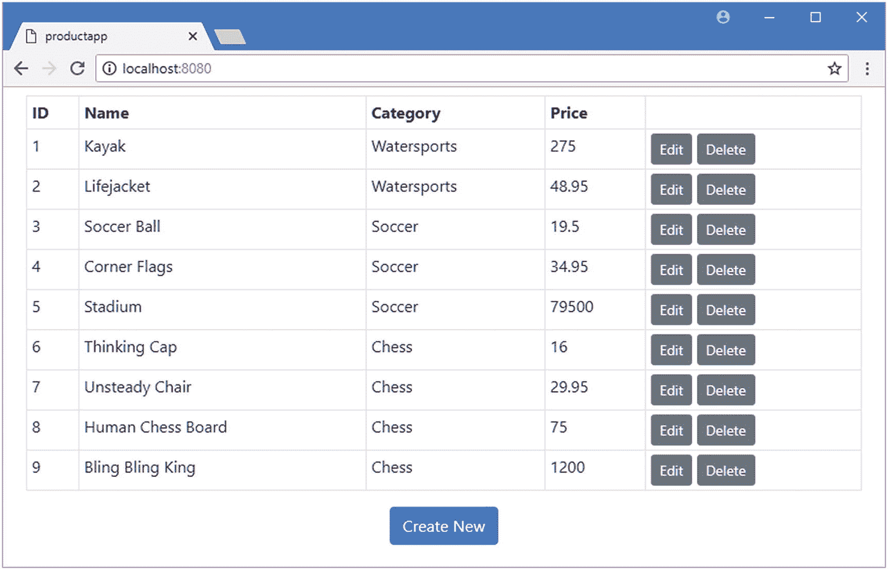
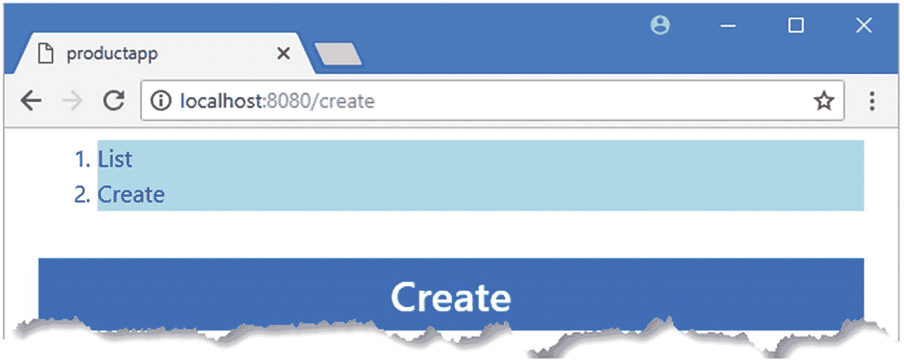
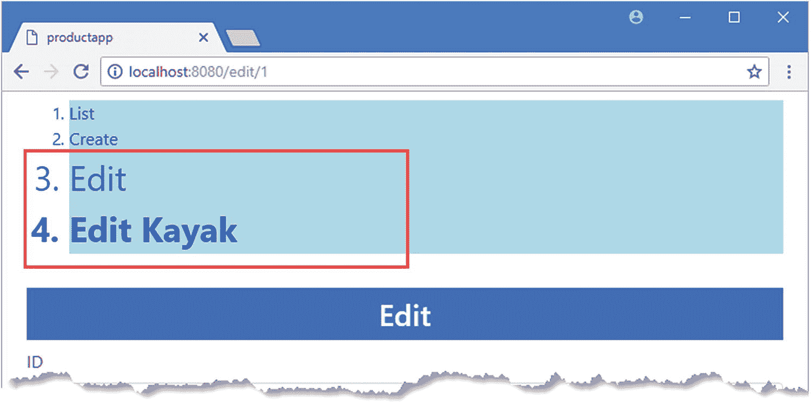
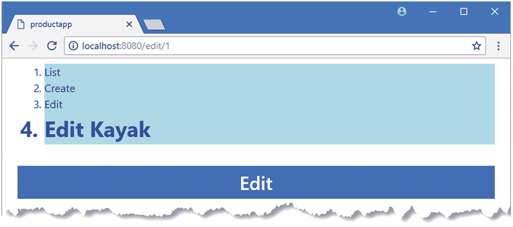
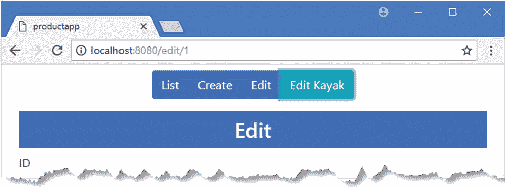
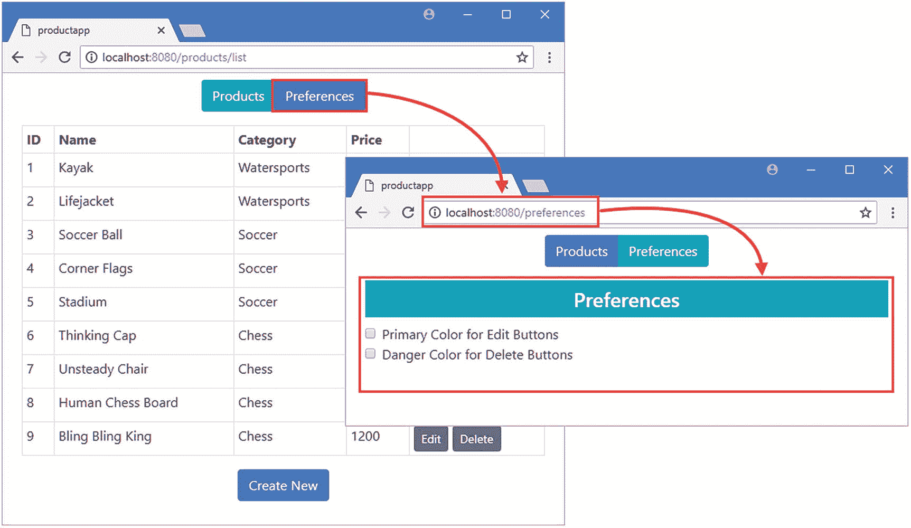
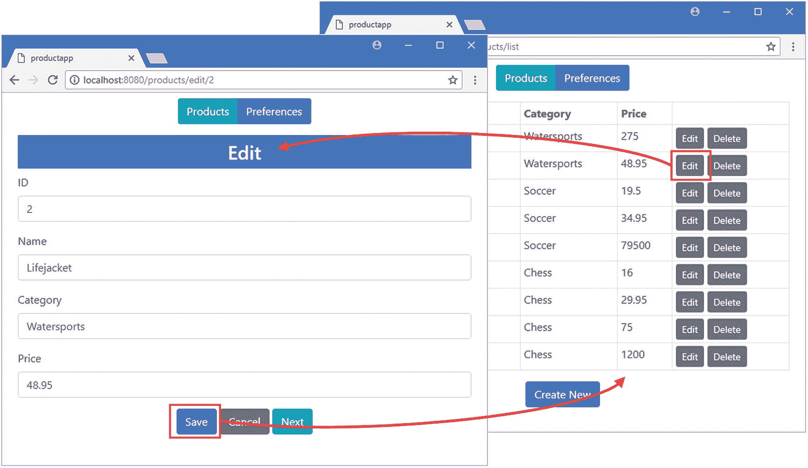
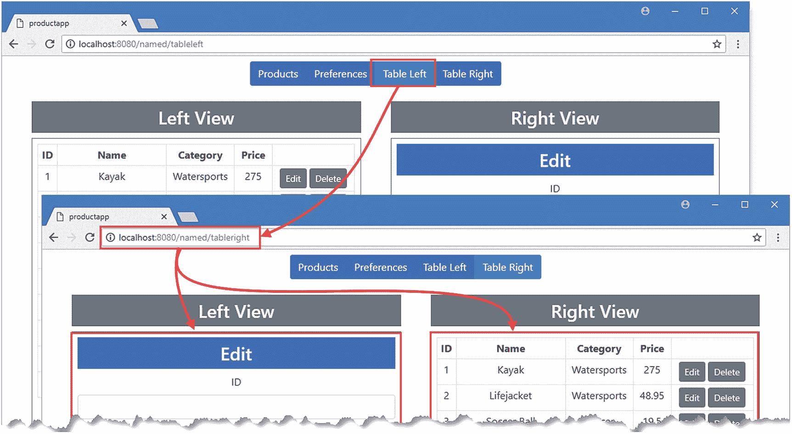

# 23.URL 路由元素功能

在这一章中，我描述了由`router-link`和`router-view`元素提供的一些特性。我将向您展示如何更改处理`router-link`元素的方式，如何使用不同的导航事件，以及如何通过更改应用于导航元素的样式来响应路由激活。我还将向您展示如何在一个应用程序中使用多个`router-view`元素，以及当两个或多个`router-view`元素出现在同一个模板中时，如何管理它们。表 [23-1](#Tab1) 将本章放入上下文中。

表 23-1

将路由元素功能放在上下文中

<colgroup><col class="tcol1 align-left"> <col class="tcol2 align-left"></colgroup> 
| 

问题

 | 

回答

 |
| --- | --- |
| 它们是什么？ | `router-link`元素提供了一些特性，这些特性控制生成的 HTML、触发导航的事件以及元素将被添加到的类，以指示活动路线。`router-view`元素提供了允许多个元素存在于单个组件模板中的特性。 |
| 它们为什么有用？ | 当您需要通过非标准元素呈现导航，或者想要使用 CSS 框架中的样式提供反馈时,`router-link`特性非常有用。`router-view`特性在复杂的应用程序中很有用，因为它们允许创建更高级的内容组合。 |
| 它们是如何使用的？ | 使用`router-link`和`router-view`元素上的属性来应用这些特性，并在应用程序的路由中提供相应的支持。 |
| 有什么陷阱或限制吗？ | 必须注意确保定义了合适的总括路线和重定向，以确保应用程序不会向用户显示空窗口或通过导航元素提供令人困惑的反馈。 |
| 还有其他选择吗？ | 这些特性是可选的，你不必使用它们。 |

表 [23-2](#Tab2) 总结了本章内容。

表 23-2

章节总结

<colgroup><col class="tcol1 align-left"> <col class="tcol2 align-left"> <col class="tcol3 align-left"></colgroup> 
| 

问题

 | 

解决办法

 | 

列表

 |
| --- | --- | --- |
| 配置用于导航的元素 | 使用由`router-link`元素提供的属性 | 4–7 |
| 当元素与活动 URL 匹配时设置元素样式 | 定义选择`router-link-active`和`router-link-exact-active`类的样式 | eight |
| 确保仅当元素与活动路线完全匹配时，才设计元素的样式 | 应用`exact`属性 | nine |
| 更改用于指示活动航路的类别 | 使用`exact-active-class`和`active-class`属性 | Ten |
| 创建嵌套路线 | 在应用程序中应用多个`router-view`元素，并用使用`children`属性定义的路由来定位它们 | 11–17 |

## 为本章做准备

在本章中，我继续使用第 23 章中的 productapp 项目。为了准备本章，我已经注释掉了`ProductDisplay`组件中的`create`方法，如清单 [23-1](#PC1) 所示。该方法中的语句用于演示第 [20](20.html) 章中数据存储的使用，本章并不需要这些语句，因为每次创建`ProductDisplay`组件的新实例时，这些语句都会导致数据存储值重置。

```js
...
<script>
    import { mapState, mapMutations, mapActions, mapGetters } from "vuex";

    export default {
        computed: {
            ...mapState(["products"]),
            ...mapState({
                useStripedTable: state => state.prefs.stripedTable
            }),
            ...mapGetters({
                tableClass: "prefs/tableClass",
                editClass: "prefs/editClass",
                deleteClass: "prefs/deleteClass"
            })
        },
        methods: {
            editProduct(product) {
                this.selectProduct(product);
                this.$router.push("/edit");
            },
            createNew() {
                this.selectProduct();
                this.$router.push("/edit");
            },
            ...mapMutations({
                selectProduct: "selectProduct",
                setEditButtonColor: "prefs/setEditButtonColor",
                setDeleteButtonColor: "prefs/setDeleteButtonColor"
            }),
            ...mapActions({
                deleteProduct: "deleteProductAction"
            })
        },
        //created() {

        //    this.setEditButtonColor(false);

        //    this.setDeleteButtonColor(false);

        //}

    }
</script>
...

Listing 23-1Disabling a Method in the ProductDisplay.vue File in the src/components Folder

```

要启动 RESTful web 服务，打开命令提示符并运行清单 [23-2](#PC2) 中的命令。

```js
npm run json

Listing 23-2Starting the Web Service

```

打开第二个命令提示符，导航到`productapp`目录，运行清单 [23-3](#PC3) 中所示的命令来启动 Vue.js 开发工具。

```js
npm run serve

Listing 23-3Starting the Development Tools

```

一旦初始捆绑过程完成，打开一个新的浏览器窗口并导航到`http://localhost:8080`，在那里你将看到示例应用程序，如图 [23-1](#Fig1) 所示。

### 小费

你可以从 [`https://github.com/Apress/pro-vue-js-2`](https://github.com/Apress/pro-vue-js-2) 下载本章以及本书其他章节的示例项目。



图 23-1

运行示例应用程序

## 使用路由器链接元素

`router-link`元素比它第一次出现时更加灵活，并且支持一些有用的选项来定制它生成的 HTML 元素，并向用户提供有用的反馈。为了准备接下来的部分，我在`App`组件的模板中添加了`router-link`元素，如清单 [23-4](#PC4) 所示。

```js
<template>
    <div class="container-fluid">
        <div class="row">

            <div class="col text-center m-2">

                <router-link to="/list" class="m-1">List</router-link>

                <router-link to="/create" class="m-1">Create</router-link>

            </div>

        </div>

        <div class="row">
            <div class="col m-2">
                <router-view></router-view>
            </div>
        </div>
    </div>
</template>

<script>

    export default {
        name: 'App',
        created() {
            this.$store.dispatch("getProductsAction");
        }
    }
</script>

Listing 23-4Adding Navigation Elements in the App.vue File in the src Folder

```

这些`router-link`元素作为组件模板的一部分被处理，并被转换成锚元素，如图 [23-2](#Fig2) 所示。


图 23-2

使用路由器链接元素导航

通过应用表 [23-3](#Tab3) 中描述的属性来配置`router-link`元素，其中最有用的我将在接下来的章节中演示。

表 23-3

路由器链路属性

<colgroup><col class="tcol1 align-left"> <col class="tcol2 align-left"></colgroup> 
| 

名字

 | 

描述

 |
| --- | --- |
| `tag` | 该属性指定了转换`router-link`元素时将生成的 HTML 元素的标记类型，如“选择元素类型”一节所述。 |
| `event` | 该属性指定将触发导航的事件，如“选择导航事件”一节中所述。 |
| `exact` | 此属性指定在标识对应于活动路由的元素时是否使用部分 URL 匹配，如“设计路由器链接元素”一节中所述。 |
| `active-class` | 该属性指定当活动 URL 以元素的导航目标开始时，元素将被添加到的类，如“设计路由器链接元素”一节中所述。 |
| `exact-active-class` | 该属性指定当活动 URL 匹配元素的导航目标时，元素将被添加到的类，如“设计路由器链接元素”一节中所述。 |
| `to` | 该属性指定了导航位置，并将向浏览器的历史记录中添加一个条目，相当于第 [22 章](22.html)中描述的`push`导航方法。 |
| `replace` | 该属性指定导航位置，但不会向浏览器的历史记录中添加条目，相当于第 [22 章](22.html)中描述的`replace`导航方法。 |
| `append` | 此属性指定一个相对 URL，当您使用用户提供的数据进行导航，并希望确保导航包含在应用程序的特定部分时，此属性会很有用。 |

### 选择元素类型

默认情况下，`router-link`元素被转换成锚点，也就是带有`a`标签的元素。如果您使用浏览器的 F12 工具来检查文档对象模型，您可以看到我在清单 [23-4](#PC4) 中添加的`router-link`元素是如何被转换的。

```js
...
<div class="col text-center m-2">
    <a href="/list" class="m-1">List</a>

    <a href="/create" class="m-1">Create</a>

</div>
...

```

### 小费

如果你点击了其中一个`a`元素，你会看到它已经被添加到了`router-link-active`和`router-link-exact-active`类中。我将在“设计路由器链接元素”一节中解释这些元素的含义。

`tag`属性可用于选择不同的元素类型，当`router-link`元素被转换时，该元素类型将代替锚点使用。当您想要以不能使用`a`元素的方式呈现一系列导航元素时，或者当您想要在选择器不能匹配锚元素的情况下应用 CSS 样式时，这是非常有用的。在清单 [23-5](#PC6) 中，我使用了`tag`属性来填充一个包含导航元素的列表。

```js
<template>
    <div class="container-fluid">
        <div class="row">
            <div class="col text-center m-2">
                <ol>

                    <router-link tag="li" to="/list">List</router-link>

                    <router-link tag="li" to="/create">Create</router-link>

                </ol>

            </div>
        </div>
        <div class="row">
            <div class="col m-2">
                <router-view></router-view>
            </div>
        </div>
    </div>
</template>

<script>

    export default {
        name: 'App',
        created() {
            this.$store.dispatch("getProductsAction");
        }
    }
</script>

Listing 23-5Specifying Tag Type in the App.vue File in the src Folder

```

`tag`属性指定当组件的模板被处理时，`router-link`元素应该被替换为`li`元素。如果保存更改并使用浏览器的 F12 开发工具来检查文档对象模型，您将看到以下元素:

```js
...
<ol>
    <li class="">List</li>

    <li class="">Create</li>

</ol>
...

```

当你点击其中一个`li`元素时，导航发生，如图 [23-3](#Fig3) 所示。


图 23-3

更改导航元素类型

### 选择导航事件

默认的导航事件是`click`，这意味着当用户点击由`router-link`元素创建的元素时，导航被执行。`event`属性用于指定一个可选事件，它允许以不同的方式进行导航。在清单 [23-6](#PC8) 中，我使用了`event`属性，这样当用户将鼠标指针移动到导航元素上时就会执行导航。

### 警告

用户希望当他们点击一个元素时会出现导航，因为这是大多数 web 应用程序的工作方式。小心使用`event`属性，因为您很容易混淆您的用户并产生意想不到的结果。

```js
<template>
    <div class="container-fluid">
        <div class="row">
            <div class="col text-center m-2">
                <ol>
                    <router-link tag="li" event="mouseenter" to="/list">

                        List

                    </router-link>

                    <router-link tag="li" event="mouseenter" to="/create">

                        Create

                    </router-link>

                </ol>
            </div>
        </div>
        <div class="row">
            <div class="col m-2">
                <router-view></router-view>
            </div>
        </div>
    </div>
</template>

<script>

    export default {
        name: 'App',
        created() {
            this.$store.dispatch("getProductsAction");
        }
    }
</script>

Listing 23-6Specifying the Navigation Event in the App.vue File in the src Folder

```

当鼠标指针进入由 HTML 元素占据的浏览器窗口区域时，触发`mouseenter`事件，这意味着无需用户点击鼠标按钮就可以进行导航。

### 设计路由器链接元素的样式

当你对`router-link`元素应用样式时，重要的是要记住你是在对`router-link`被转换成的元素进行样式化，而不是对`router-link`元素本身。在清单 [23-7](#PC9) 中，我为`App`组件添加了一个`style`属性，用于定义导航元素的样式。

```js
<template>
    <div class="container-fluid">
        <div class="row">
            <div class="col text-center m-2">
                <ol>
                    <router-link tag="li" event="mouseenter" to="/list">
                        List
                    </router-link>
                    <router-link tag="li" event="mouseenter" to="/create">
                        Create
                     </router-link>
                </ol>
            </div>
        </div>
        <div class="row">
            <div class="col m-2">
                <router-view></router-view>
            </div>
        </div>
    </div>
</template>

<script>

    export default {
        name: 'App',
        created() {
            this.$store.dispatch("getProductsAction");
        }
    }
</script>

<style scoped>

    router-link { text-align: right; color: yellow; background-color: red; }

    li { text-align: left; color:blue; background-color: lightblue; }

</style>

Listing 23-7Styling Navigation Elements in the App.vue File in the src Folder

```

重要的是要记住，是浏览器在将`router-link`元素转换成由`tag`属性指定的元素类型之后评估样式选择器。出于这个原因，清单 [23-7](#PC9) 中定义的第一个样式将不匹配任何元素，因为在组件的模板被处理后没有`router-link`元素可供选择。这是混淆的一个常见原因，尤其是在使用自动管理 CSS 样式的工具时。第二种样式的选择器匹配转换后的元素，并将应用于组件的内容，如图 [23-4](#Fig4) 所示。

### 小费

您可能需要重新加载浏览器才能看到如图 [23-4](#Fig4) 所示的新样式。



图 23-4

样式导航元素

#### 响应活动路由

当当前 URL 匹配导航元素的目标时，Vue Router 包将该元素添加到`router-link-active`和`router-link-exact-active`类中，这两个类可用于应用向用户提供反馈的样式。在清单 [23-8](#PC10) 中，我定义了在选择器中使用这些类的样式。我还删除了事件属性，这样当用户点击时就会出现导航，我还添加了新的`router-link`元素，导航到`/edit`和`/edit/1`URL。

```js
<template>
    <div class="container-fluid">
        <div class="row">
            <div class="col text-center m-2">
                <ol>
                    <router-link tag="li" to="/list">List</router-link>

                    <router-link tag="li" to="/create">Create</router-link>

                    <router-link tag="li" to="/edit">Edit</router-link>

                    <router-link tag="li" to="/edit/1">Edit Kayak</router-link>

                </ol>
            </div>
        </div>
        <div class="row">
            <div class="col m-2">
                <router-view></router-view>
            </div>
        </div>
    </div>
</template>

<script>

    export default {
        name: 'App',
        created() {
            this.$store.dispatch("getProductsAction");
        }
    }
</script>

<style scoped>
    li { text-align: left; color:blue; background-color: lightblue; }
    .router-link-active { font-size: xx-large; }

    .router-link-exact-active { font-weight: bolder; }

</style>

Listing 23-8Styling the Active Navigation Element in the App.vue File in the src Folder

```

当路线发生变化时，导航元素会自动添加到类中或从类中移除。如果由`to`属性指定的目标与当前 URL 完全匹配，那么元素将被添加到`router-link-exact-active`类中，该类应用使元素文本加粗的样式。如果当前 URL 以由`to`属性指定的目标开始，则元素被添加到`router-link-active`类中。你可以通过点击编辑 Kayak 链接看到不同之处，这将导航到`/edit/1`网址。目标为`/edit`的编辑元素被添加到`router-link-active`类中，因为当前 URL 以其目标开始:`/edit/1`以`/edit`开始。Edit Kayak 链接被添加到这两个类中，因为当前 URL 以其目标开始，并且与其目标完全匹配。结果是编辑元素以更大的文本显示，而编辑 Kayak 链接以同样加粗的更大文本显示，如图 [23-5](#Fig5) 所示。



图 23-5

响应活动的路由类别

使用`router-link-active`类进行部分 URL 匹配并不总是有用的，可以通过向`router-link`元素添加`exact`属性来禁用，如清单 [23-9](#PC11) 所示。

```js
...
<template>
    <div class="container-fluid">
        <div class="row">
            <div class="col text-center m-2">
                <ol>
                    <router-link tag="li" to="/list">List</router-link>
                    <router-link tag="li" to="/create">Create</router-link>
                    <router-link tag="li" to="/edit" exact>Edit</router-link>

                    <router-link tag="li" to="/edit/1">Edit Kayak</router-link>
                </ol>
            </div>
        </div>
        <div class="row">
            <div class="col m-2">
                <router-view></router-view>
            </div>
        </div>
    </div>
</template>
...

Listing 23-9Disabling Partial URL Matching in the App.vue File in the src Folder

```

无论分配给它的值是什么，`exact`属性都将生效，并且禁用部分匹配特性的是属性的存在，而不是它的值。当用户导航到`/edit/1` URL 时，清单中应用的属性阻止编辑元素被添加到`router-link-active`类，如图 [23-6](#Fig6) 所示。



图 23-6

禁用部分 URL 映射

#### 更改活动路线类别

当你使用一个 CSS 框架时，比如我在本书中使用的 Bootstrap 框架，你会发现经常有一些类被用来指示一个元素何时是活动的，这些类并不对应于 Vue 路由器使用的类的名称。`active-class`和`exact-active-class`属性可以用来指定类的名称，当元素的目标与当前 URL 匹配时，应该将元素添加到这些类中。在清单 [23-10](#PC12) 中，我用一组更传统的按钮元素替换了导航元素列表，并使用了`active-class-exact`属性来指定用于指示活动按钮的引导类的名称。我还删除了`style`元素，因为我不再需要定制的 CSS 样式。

### 小费

您可以通过使用路由配置对象中的`linkActiveClass`和`linkExactActiveClass`属性来更改用于全局指示路由的类，这意味着您不必在每个元素上指定这些类。

```js
<template>
    <div class="container-fluid">
        <div class="row">
            <div class="col text-center m-2">
                <div class="btn-group">

                    <router-link tag="button" to="/list"

                                 exact-active-class="btn-info"

                                 class="btn btn-primary">

                        List

                    </router-link>

                    <router-link tag="button" to="/create"

                                 exact-active-class="btn-info"

                                 class="btn btn-primary">

                        Create

                    </router-link>

                    <router-link tag="button" to="/edit"

                                 exact-active-class="btn-info"

                                 class="btn btn-primary">

                        Edit

                    </router-link>

                    <router-link tag="button" to="/edit/1"

                                 exact-active-class="btn-info"

                                 class="btn btn-primary">

                        Edit Kayak

                    </router-link>

                </div>

            </div>
        </div>
        <div class="row">
            <div class="col m-2">
                <router-view></router-view>
            </div>
        </div>
    </div>
</template>

<script>

    export default {
        name: 'App',
        created() {
            this.$store.dispatch("getProductsAction");
        }
    }
</script>

Listing 23-10Specifying Active Class Names in the App.vue File in the src Folder

```

新的`router-link`元素都被赋给了`btn`和`btn-primary`类，这两个类是样式按钮的引导类，当它们表示活动路线时将被赋给`btn-info`类，效果如图 [23-7](#Fig7) 所示。



图 23-7

更改活动路线类别

## 创建嵌套路线

到目前为止，路由示例都假设应用程序只有一组要显示的组件，并且当选择其中一个组件时，它将总是显示相同的内容。在复杂的应用中，一个顶级组件可能需要显示不同的子组件，为了支持这一需求，Vue Router 包支持嵌套路由，也称为*子路由*。

### 规划应用程序布局

使用嵌套路由时，理解您的目标很重要。对于示例应用程序，我将为用户提供顶级导航元素，允许用户在产品相关功能和设置应用程序首选项的组件之间进行选择。图 [23-8](#Fig8) 显示了我打算创建的应用程序结构。


图 23-8

应用程序的结构

决定应用程序将支持的 URL 集使得创建路由更加简单。我将在示例应用程序中使用的 URL 在表 [23-4](#Tab4) 中描述，并遵循我在早期示例中使用的相同基本方法。

表 23-4

示例应用程序的 URL

<colgroup><col class="tcol1 align-left"> <col class="tcol2 align-left"></colgroup> 
| 

统一资源定位器

 | 

描述

 |
| --- | --- |
| `/products/table` | 该 URL 将显示产品列表。 |
| `/products/create` | 该 URL 将显示用于创建新产品的编辑器。 |
| `/products/edit/10` | 此 URL 将显示用于修改指定产品的编辑器。 |
| `/preferences` | 此 URL 将显示首选项设置。 |

### 向项目中添加组件

为了创建我需要的结构，我需要向项目添加一个组件。首先，我在`src/components`文件夹中添加了一个名为`Preferences.vue`的文件，其内容如清单 [23-11](#PC13) 所示。

```js
<template>
    <div>
        <h4 class="bg-info text-white text-center p-2">Preferences</h4>
        <div class="form-check">
            <input class="form-check-input" type="checkbox"
                   v-bind:checked="primaryEdit" v-on:input="setPrimaryEdit">
            <label class="form-check-label">Primary Color for Edit Buttons</label>
        </div>
        <div class="form-check">
            <input class="form-check-input" type="checkbox"
                   v-bind:checked="dangerDelete" v-on:input="setDangerDelete">
            <label class="form-check-label">Danger Color for Delete Buttons</label>
        </div>
    </div>
</template>

<script>

    import { mapState } from "vuex";

    export default {
        computed: {
            ...mapState({
                primaryEdit: state => state.prefs.primaryEditButton,
                dangerDelete: state => state.prefs.dangerDeleteButton
            })
        },
        methods: {
            setPrimaryEdit() {
                this.$store.commit("prefs/setEditButtonColor", !this.primaryEdit);
            },
            setDangerDelete() {
                this.$store.commit("prefs/setDeleteButtonColor", !this.dangerDelete);
            }
        }
    }
</script>

Listing 23-11The Contents of the Preferences.vue File in the src/components Folder

```

这是将向用户显示首选项的组件。它使用复选框显示数据存储中两个状态属性的值，并在用户切换控件时更新这些值。这些是相同的数据存储状态属性，用于设置由`ProductDisplay`组件显示的编辑和删除按钮的颜色。

接下来，我在`src/components`文件夹中添加了一个名为`Products.vue`的文件，其内容如清单 [23-12](#PC14) 所示。

```js
<template>
    <router-view></router-view>
</template>

Listing 23-12The Contents of the Products.vue file in the src/component Folder

```

这个组件只包含一个`template`元素，而这个元素又只包含一个`router-view`元素。这个组件将允许我显示产品列表或编辑器。

### 定义路线

组件就绪后，我可以定义应用程序的路由配置来实现表 [23-4](#Tab4) 中描述的 URL 集，如清单 [23-13](#PC15) 所示。

```js
import Vue from "vue";
import VueRouter from "vue-router";

import ProductDisplay from "../components/ProductDisplay";
import ProductEditor from "../components/ProductEditor";

import Preferences from "../components/Preferences";

import Products from "../components/Products";

Vue.use(VueRouter);

export default new VueRouter({
    mode: "history",
    routes: [
        { path: "/preferences", component: Preferences},

        { path: "/products", component: Products,

            children: [

                { name: "table", path: "list", component: ProductDisplay},

                { name: "editor", path: ":op(create|edit)/:id(\\d+)?",

                      component: ProductEditor},

                { path: "", redirect: "list" }

            ]

        },

        { path: "/edit/:id", redirect: to => `/products/edit/${to.params.id}`},

        { path: "*", redirect: "/products/list" }

    ]
})

Listing 23-13Defining Routes in the index.js File in the src/router Folder

```

这些路由包含大量信息，因此我将逐一展开，并解释它们如何构成我在本节开始时描述的结构。第一条路线遵循您在前面的示例中看到的格式，如下所示:

```js
...
{ path: "/preferences", component: Preferences},
...

```

这个路由告诉 Vue Router 在 URL 为`/preferences`时显示`Preferences`组件。该路线中没有使用动态段、名称、重定向或其他特殊功能，所选组件将显示在`App`组件模板中定义的`router-view`元素中。

下一条路线更复杂，最好是逐步接近。第一部分很简单。

```js
...
{ path: "/products", component: Products,
...

```

`path`和`component`属性告诉 Vue Router 当 URL 为`/products`时应该显示`Products`组件。与前面的路线一样，`Products`组件将显示在`App`组件模板的`router-view`元素中。但是`Product`组件的模板还包含一个`router-view`元素，必须为其选择一个组件，这就是该路由定义的`children`属性的用途:

```js
...
{ path: "/products", component: Products,
    children: [

        { name: "table", path: "list", component: ProductDisplay},

        { name: "editor", path: ":op(create|edit)/:id(\\d+)?",

            component: ProductEditor},

        { path: "", redirect: "list" }

    ]

},
...

```

`children`属性用于定义一组路由，这些路由将应用于`Products`组件模板中的`router-view`元素。每个子路由的`path`属性的值与其父路由的`path`相结合，以匹配一个 URL 并选择一个组件，以便为`/products/list` URL 选择`ProductDisplay`组件。子路由可以包括动态段和正则表达式，这可以在为`/create`和`/edit/id`URL 选择`ProductEditor`组件的路由中看到。

`children`部分中的最后一个路由是一个将执行重定向的总括路由，这样任何以`/products`开头但与前两个路由不匹配的 URL 都将被重定向到`/products/list`。注意，这个路由的路径是一个空字符串，而不是一个星号，因为我想匹配没有这个段的值的 URL。

#### 处理旧的 URL

当现有应用程序支持的 URL 集发生变化时，一定要确保更新组件中使用的 URL，或者在新旧 URL 之间创建重定向或别名。编辑功能以前通过`/edit/:id`路径访问，但现在通过`/products/edit/:id`访问。为了确保旧的 URL 仍然有效，我在清单 [23-13](#PC15) 中定义了重定向路由。

```js
...
{ path: "/edit/:id", redirect: to => `/products/edit/${to.params.id}`},
...

```

在第 22 章[中，我使用一个固定的 URL 创建了一个重定向。这在这种情况下是行不通的，因为我需要将动态`id`段的值传递给新路线。如清单所示，重定向也可以表示为一个函数，它接收匹配的路由并返回重定向 URL。在这个例子中，重定向函数接收路由并组成重定向 URL，以便它包含`id`值。](22.html)

### 创建导航元素

在清单 [23-14](#PC20) 中，我用针对表 [23-4](#Tab4) 中描述的 URL 的按钮替换了`App`组件模板中的导航按钮。

```js
<template>
    <div class="container-fluid">
        <div class="row">
            <div class="col text-center m-2">
                <div class="btn-group">
                    <router-link tag="button" to="/products" active-class="btn-info"

                            class="btn btn-primary">

                        Products

                    </router-link>

                    <router-link tag="button" to="/preferences"

                             active-class="btn-info" class="btn btn-primary">

                        Preferences

                    </router-link>

                </div>
            </div>
        </div>
        <div class="row">
            <div class="col m-2">
                <router-view></router-view>
            </div>
        </div>
    </div>
</template>

<script>

    export default {
        name: 'App',
        created() {
            this.$store.dispatch("getProductsAction");
        }
    }
</script>

Listing 23-14Navigating to the New URLs in the App.vue File in the src Folder

```

这些`router-link`元素将被转换成`button`元素，这些元素导航到`/products`和`/preferences`URL，并使用 Bootstrap `btn`和`btn-primary`类进行样式化，这些类在 Bootstrap 配色方案的原色中应用基本的按钮样式。

为了表明什么时候`button`代表活动路线，我将元素添加到了`btn-info`类，该类使用`active-class`属性为按钮应用了不同的引导颜色。

### 测试嵌套路由

支持嵌套的`router-view`元素所需的所有更改都已就绪。您可以通过导航到`http://localhost:8080`并使用`Products`和`Preferences`按钮来更改`App`组件的模板中的`router-view`元素的内容，这将产生如图 [23-9](#Fig9) 所示的结果。



图 23-9

为顶级路由器视图元素选择组件

要查看嵌套的`router-view`元素，单击 Products 按钮，然后单击表格中显示的编辑按钮之一。`Products`组件中的`router-view`元素所显示的组件将变为显示编辑器，点击保存或取消按钮可以返回到表格视图，如图 [23-10](#Fig10) 所示。



图 23-10

为嵌套路由器视图元素选择组件

请注意，使用命名路由的`router-link`元素和代码会自动将使用新路由的 URL 作为目标。当我在清单 [23-13](#PC15) 中定义路由时，我将在第 [22 章](22.html)中定义的名称应用于新配置中的相应路由。

```js
...
{ path: "/products", component: Products,
    children: [
        { name: "table", path: "list", component: ProductDisplay},
        { name: "editor", path: ":op(create|edit)/:id(\\d+)?",
            component: ProductEditor},
        { path: "", redirect: "list" }
    ]
},
...

```

当使用命名路由的`router-link`元素被处理时，结果是一个指向指定路由的 URL，这意味着名称保持有效，即使它们所涉及的路由发生了变化。您可以在表格视图中显示的编辑按钮中看到这一点，这些按钮是用这个`router-link`元素创建的:

```js
...
<router-link v-bind:to="{name: 'editor', params: { op: 'edit', id: p.id}}"

        v-bind:class="editClass" class="btn btn-sm">
    Edit
</router-link>
...

```

使用名称设置`to`属性，该名称指定编辑器路径。处理此元素时，结果是一个锚元素，其目标对应于命名的路由，如下所示:

```js
...
<a href="/products/edit/1" class="btn btn-sm btn-secondary">
    Edit
</a>
...

```

使用命名路由可能需要笨拙的代码和 HTML，但结果可以是更灵活和更健壮的应用程序，该应用程序适应其路由配置的变化，而不需要其组件的相应变化。

## 使用命名路由器视图元素

一些组件需要在同一个模板中有多个`router-view`元素，这样就可以动态地选择两个或更多的子组件。当`router-view`元素在同一个模板中时，`name`属性用于区分它们，然后在路由中使用这些名称来选择将要显示的组件。

为了帮助演示这个特性，我通过在`src/components`文件夹中添加一个名为`SideBySide.vue`的文件来创建一个新组件，其内容如清单 [23-15](#PC24) 所示。

```js
<template>
    <div class="container-fluid">
        <div class="row">
            <div class="col text-center m-2">
                <h3 class="bg-secondary text-white text-center p-2">Left View</h3>
                <router-view name="left" class="border border-secondary p-2" />
            </div>
            <div class="col text-center m-2">
                <h3 class="bg-secondary text-white text-center p-2">Right View</h3>
                <router-view name="right" class="border border-secondary p-2" />
            </div>
        </div>
    </div>
</template>

Listing 23-15The Contents of the SideBySide.vue File in the src/components Folder

```

这个组件有一个包含两个`router-view`元素的模板元素，使用`name`属性区分这两个元素，一个命名为`left`，另一个命名为`right`。引导类和结构元素将向用户并排展示`router-view`元素的内容。为了瞄准新的`router-view`元素，我将添加对表 [23-5](#Tab5) 中描述的 URL 的支持。

表 23-5

命名路由器视图元素的 URL

<colgroup><col class="tcol1 align-left"> <col class="tcol2 align-left"></colgroup> 
| 

统一资源定位器

 | 

描述

 |
| --- | --- |
| `/named/tableleft` | 这个 URL 将在`left`元素中显示产品表，在`right`元素中显示编辑器。 |
| `/named/tableright` | 这个 URL 将在`right`元素中显示产品表，在 lef `t`元素中显示编辑器。 |

为了定位这些 URL，我将清单 [23-16](#PC25) 中所示的导航元素添加到顶级`App`组件的模板中。

```js
<template>
    <div class="container-fluid">
        <div class="row">
            <div class="col text-center m-2">
                <div class="btn-group">
                    <router-link tag="button" to="/products"
                        active-class="btn-info" class="btn btn-primary">
                            Products
                    </router-link>
                    <router-link tag="button" to="/preferences"
                        active-class="btn-info" class="btn btn-primary">
                            Preferences
                    </router-link>
                    <router-link to="/named/tableleft" class="btn btn-primary"

                            active-class="btn-info">

                        Table Left

                    </router-link>

                    <router-link to="/named/tableright" class="btn btn-primary"

                            active-class="btn-info">

                        Table Right

                    </router-link>

                </div>
            </div>
        </div>
        <div class="row">
            <div class="col m-2">
                <router-view></router-view>
            </div>
        </div>
    </div>
</template>

<script>

    export default {
        name: 'App',
        created() {
            this.$store.dispatch("getProductsAction");
        }
    }
</script>

Listing 23-16Adding Navigation Elements in the App.vue File in the src Folder

```

为了完成对新 URL 的支持并以命名的`router-view`元素为目标，我创建了清单 [23-17](#PC26) 中所示的路由。

```js
import Vue from "vue";
import VueRouter from "vue-router";

import ProductDisplay from "../components/ProductDisplay";
import ProductEditor from "../components/ProductEditor";
import Preferences from "../components/Preferences";
import Products from "../components/Products";

import SideBySide from "../components/SideBySide";

Vue.use(VueRouter);

export default new VueRouter({
    mode: "history",
    routes: [
        { path: "/preferences", component: Preferences},
        { path: "/products", component: Products,
            children: [
                { name: "table", path: "list", component: ProductDisplay},
                { name: "editor", path: ":op(create|edit)/:id(\\d+)?",
                      component: ProductEditor},
                { path: "", redirect: "list" }
            ]
        },
        { path: "/edit/:id", redirect: to => `/products/edit/${to.params.id}`},

        { path: "/named", component: SideBySide,

            children:[

                {   path: "tableleft",

                    components: {

                        left: ProductDisplay,

                        right: ProductEditor

                    }

                },

                {   path: "tableright",

                        components: {

                        left: ProductEditor,

                        right: ProductDisplay

                    }

                }

            ]

        },

        { path: "*", redirect: "/products" }
    ]
})

Listing 23-17Adding Routes in the index.js File in the src/router Folder

```

当定义以命名的`router-view`元素为目标的路由时，使用`components`属性。该属性被赋予一个对象，其属性是`router-view`元素的名称，其值是应该显示的组件，如下所示:

```js
...
{ path: "tableleft",
  components: {

      left: ProductDisplay,

      right: ProductEditor

  }

},
...

```

`components`属性告诉 Vue 路由器包在名为`left`的`router-view`元素中显示`ProductComponent`，在名为`right`的`router-view`元素中显示`ProductEditor`组件。

### 注意

以命名元素为目标的属性是`components`(复数)，而不是在清单 [23-17](#PC26) 中的其他路径中使用的`component`(单数)属性。

要查看结果，导航到`http://localhost:8080`并点击左侧表格和右侧表格按钮，这两个按钮指向清单 [23-17](#PC26) 中定义的路线的 URL，产生如图 [23-11](#Fig11) 所示的结果。



图 23-11

使用命名路由器视图元素

## 摘要

在本章中，我描述了在 Vue.js 应用程序中使用 URL 路由时可用的一些高级功能。我解释了如何配置`router-link`元素以产生不同的 HTML 元素并响应不同的事件，以及如何设计导航元素的样式以向用户提供反馈。对于`router-view`元素，我向您展示了如何使用嵌套路由，以便应用程序可以包含多个元素，以及当这些元素在同一个模板中定义时如何命名它们。在下一章，我将描述高级 URL 路由特性。