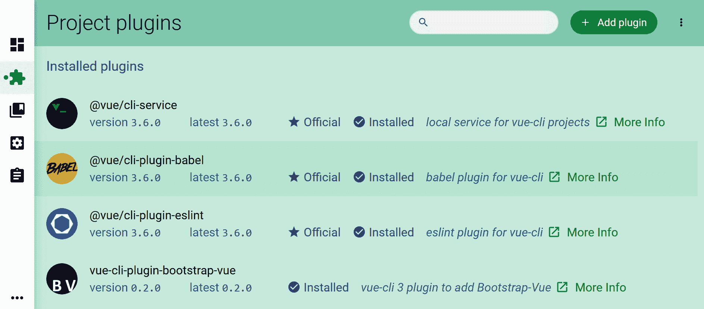
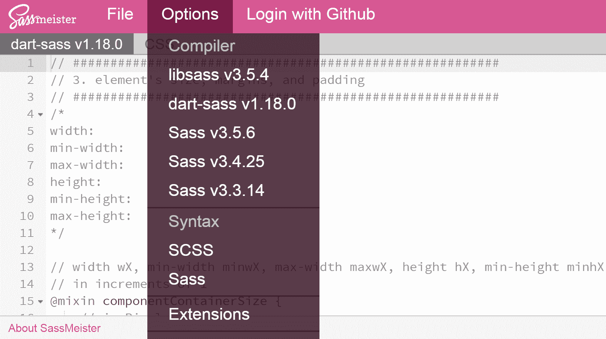
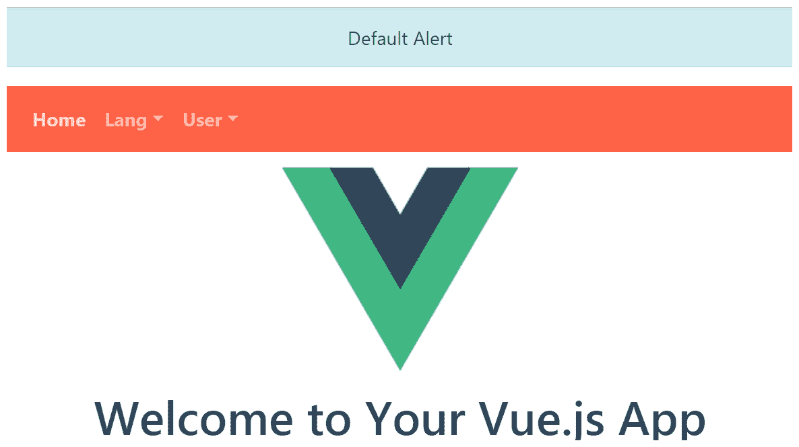
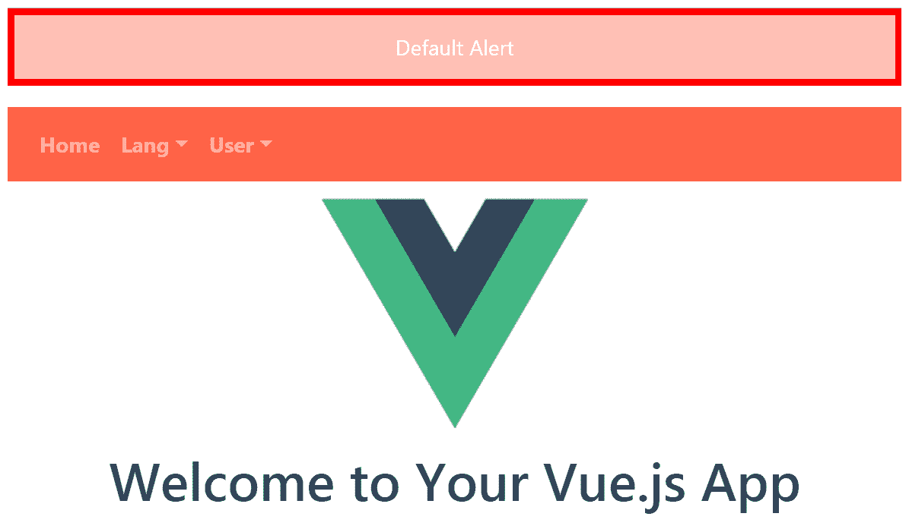

# 七、使用 SCSS 改进 CSS

在本章中，我们将讨论 SCS 的基础知识及其解决的问题。我们还将讨论 CSS 中引入的改进，这些改进使其更接近 SCS

我们还将使用我们在[第 5 章](5.html)*中制作的应用、Vue CLI 3 和路由*。本章的目标是使用 CSS、SCS，我们将使用 Bootstrap+Vue 插件来实现这一点。

本章将涵盖以下主题：

*   安装引导+Vue
*   使用 bootstrap vue 插件向我们的项目添加样式
*   在我们的项目中使用 SCSS

# 安装引导+Vue

在使用 Vue 时，为什么不使用官方网站上的引导？当然，我们确实可以做到这一点，但是 Bootstrap 依赖于 jQuery，而且因为我们想让所有与 JavaScript 相关的东西都通过 Vue 运行，所以我们必须使用一个专门为此目的而构建的项目：BootstrapVue。

让我们首先访问项目网站[https://bootstrap-vue.js.org/](https://bootstrap-vue.js.org/) 。在这里，我们可以大致了解该项目。具体而言，阅读[处的文档将非常有用 https://bootstrap-vue.js.org/docs#vue-cli-3](https://bootstrap-vue.js.org/docs#vue-cli-3)，其中讨论了在 Vue cli 3 项目中使用 BootstrapVue。

# 将 BootstrapVue 添加为插件

在 Vue CLI 3 UI 的帮助下，您可以轻松创建新的 Vue 项目。这本书已经讨论过几次了，你应该可以自己做这件事。

将您的新项目命名为`Chapter7`，并按照[第 5 章](5.html)*、Vue CLI 3 和路由*中的相同安装步骤运行它。

在控制台中，转到项目的根目录并运行以下命令：

```js
vue add bootstrap-vue
```

您将在控制台内看到以下提示：

```js
Successfully installed plugin: vue-cli-plugin-bootstrap-vue
```

随后将提出以下问题：

```js
? Use babel/polyfill? (Y/n)
```

只需按*回车*键即可接受默认答案（是）。

无论您是如何安装插件的，您的插件列表现在应该如下所示：



现在我们已经安装了它，我们可以开始使用它了。

# 使用 bootstrap vue 插件向我们的项目添加样式

一旦`bootstrap-vue`插件安装完成，让我们在我们的项目中使用它！首先，我们将从官方文档中添加一个`navbar`，该文档可在[上找到 https://bootstrap-vue.js.org/docs/components/navbar#b-导航项目下拉列表](https://bootstrap-vue.js.org/docs/components/navbar#b-nav-item-dropdown)，如下所示：

```js
  <b-navbar type="dark" variant="dark">
    <b-navbar-nav>
      <b-nav-item href="#">Home</b-nav-item>

      <!-- Navbar dropdowns -->
      <b-nav-item-dropdown text="Lang" right>
        <b-dropdown-item href="#">EN</b-dropdown-item>
        <b-dropdown-item href="#">ES</b-dropdown-item>
        <b-dropdown-item href="#">RU</b-dropdown-item>
        <b-dropdown-item href="#">FA</b-dropdown-item>
      </b-nav-item-dropdown>

      <b-nav-item-dropdown text="User" right>
        <b-dropdown-item href="#">Account</b-dropdown-item>
        <b-dropdown-item href="#">Settings</b-dropdown-item>
      </b-nav-item-dropdown>
    </b-navbar-nav>
  </b-navbar>
```

我们将在模板部分的`App.vue`中添加此`navbar`。更新后的`template`元素现在如下所示：

```js
<template>
  <div id="app">
    <div id="nav">

      <b-navbar type="dark" variant="secondary">
        <b-navbar-nav>
          <b-nav-item href="#">Home</b-nav-item>
          <!-- Navbar dropdowns -->
          <b-nav-item-dropdown text="Lang" right>
            <b-dropdown-item href="#">EN</b-dropdown-item>
            <b-dropdown-item href="#">ES</b-dropdown-item>
            <b-dropdown-item href="#">RU</b-dropdown-item>
            <b-dropdown-item href="#">FA</b-dropdown-item>
          </b-nav-item-dropdown>

          <b-nav-item-dropdown text="User" right>
            <b-dropdown-item href="#">Account</b-dropdown-item>
            <b-dropdown-item href="#">Settings</b-dropdown-item>
          </b-nav-item-dropdown>
        </b-navbar-nav>
      </b-navbar>
      <!--
      <router-link to="/">Home</router-link> |
      <router-link to="/about">About</router-link>
      -->
    </div>
    <router-view />
  </div>
</template>
```

我们还需要更新样式，使其如下所示：

```js
<style>
#app {
  text-align: center;
  color: #2c3e50;
}

#nav a {
  font-weight: bold;
  color: #2c3e50;
}

#nav a.router-link-exact-active {
  color: #42b983;
}
</style>
```

保存更改后，我们的主页将更新为以下屏幕截图：


要快速更改`bootstrap-vue navbar`上的背景颜色，只需向`variant`自定义 HTML 属性添加上下文引导颜色即可。接受值为`primary`、`secondary`、`success`、`danger`、`info`、`warning`、`light`和`dark`。

在前面的示例中，我们使用的是值为`secondary`的`variant`，这为我们提供了一个灰色背景，悬停的是白色的`nav`项。

# 在我们的项目中使用 SCSS

类似于 TypeScript 被称为 JavaScript 的*超集*，SCSS 通常被称为 CSS 的*超集*。但这*超集*到底是什么？

一种语言的**超集**只是它周围的一层，具有*常规*实现中不存在的附加功能。还可能有其他最佳实践、方法等。

在核心部分，SCSS 文件可能只包含简单的旧 CSS 语法。这是因为所有的 SCS 最终都会编译成 CSS，因此，它会提供给我们的浏览器。这使得它非常平易近人。对于一个 SCSS 新手来说，**知道**他们可以继续写 CSS，并且它只会在他们的 SCSS 中工作，这是令人放心的！

让我们也以此为出发点。首先，让我们更新`bootstrap-vue`插件设置，以便使用 SCS 而不是 CSS。

导航到我们应用的文件夹结构并找到以下文件：`src/plugins/bootstrap-vue.js`。接下来，更新代码，使其如下所示：

```js
import Vue from 'vue'

import BootstrapVue from 'bootstrap-vue'
import 'bootstrap/scss/bootstrap.scss'
import 'bootstrap-vue/dist/bootstrap-vue.css'

Vue.use(BootstrapVue)
```

# 处理错误

您可能会遇到`cannot find sass-loader`错误。您可以通过运行以下命令来解决此问题：

```js
npm install -D sass-loader sass
```

此时，如果您不确定加载程序是什么，可能需要重新阅读 Vue CLI 3 中的Webpack[第 2 章](2.html)*，了解Webpack加载程序的更新。*

另一个可能出现的错误是：

```js
Module build failed (from ./node_modules/sass-loader/lib/loader.js): Error: Cannot find module 'node-sass'
```

您可以通过运行以下命令来解决此错误：

```js
npm install node-sass
```

最后，在安装了一个新的包之后，您将看到一条消息，内容为`found 1 high severity vulnerability`（或类似于此的内容）。您可以也应该按照控制台的提示，运行`npm audit fix`来修复此类漏洞

# 在我们的项目中编写一些 SCS

既然我们已经导入了`bootstrap.scss`，我们就可以开始使用它了

让我们打开`App.vue`，并将`style`标记更新为以下内容：

```js
<style lang="scss">
#app {
  text-align: center;
  color: #2c3e50;
}

#nav {
  a {
    font-weight: bold;
  }
  a.router-link-exact-active {
    color: #42b983;
  }
}
</style>
```

我们在前面的代码中看到的是嵌套示例，这是 SCSS 的一个功能，允许我们在 SCSS 规则中模拟应用的 HTML 结构。

如果您在这个阶段查看 web 浏览器中提供的项目，您会注意到它仍然在运行，并且没有改变。那太好了！这意味着一切都在运转，一切都得到了应有的服务。

现在，让我们向 SCS 添加一些变量、混合和插值。

# 覆盖引导 vue 样式

我们将首先添加一个自定义 SCSS 文件。我们将其命名为`custom.scss`，并将其放入项目的`assets`文件夹中。

现在我们将此代码添加到`custom.scss`：

```js
$secondary: tomato;
```

我们刚刚重写了引导变量。现在让我们通过导入`custom.scss`文件在`App.vue`文件中使用它。我们还将重写`#nav`元素中的`.bg-secondary`类。更新后的`script`标签如下所示：

```js
<style lang="scss">
@import img/custom.scss';
#app {
  text-align: center;
  color: #2c3e50;
}

#nav {
  a {
    font-weight: bold;
  }
  a.router-link-exact-active {
    color: #42b983;
  }
  .bg-secondary {
    background-color: $secondary;
  }
}
</style>
```

保存所有更改后，我们的项目将更新为：


接下来，我们将在`App.vue`文件中使用一些更高级的 SCSS 特性。

# 使用变量、混合和插值

在本节中，我们将在 SCS 中使用更多的变量、混合和插值语法。在我们开始这一章之前，最好先提到一个网站，在那里你可以练习编写 SCS，并看到它将产生的 CSS 输出。该网站名为 Sassmeister，网址为：[https://www.sassmeister.com/](https://www.sassmeister.com/) 。

# 用 Sassmeister 练习 SCSS

访问该网站后，您可以通过将鼠标悬停在选项项上，选择您想要使用的 Sass 或 SCSS 风格，如下所示：



Sassmeister 网站是练习使用该语言各种功能的绝佳场所。例如，我们可以导航到项目的`node_modules`文件夹，并找到`bootstrap`文件夹。

If you can't find the bootstrap folder inside `node_modules`, you can install it with `npm i bootstrap`.

接下来，打开`scss/mixins`文件夹，找到`_alert.scss`，语法如下：

```js
@mixin alert-variant($background, $border, $color) {
  color: $color;
  @include gradient-bg($background);
  border-color: $border;

  hr {
    border-top-color: darken($border, 5%);
  }

  .alert-link {
    color: darken($color, 10%);
  }
}
```

正如我们所看到的，这是一个混音。让我们复制并粘贴到 sassmiter 中，看看我们得到了什么输出。

实际上，我们不会得到任何输出。为什么？

原因很简单：Sass 或 SCSS 中的 mixin 实际上就像另一种语言中的函数，例如 JavaScript。所以，要在 SCS 中使用 mixin，我们需要调用它，并传递几个参数。以下是一个例子：

```js
@include alert-variant(tomato, purple, white);
```

Note that the `@include` syntax is necessary to run a mixin.

前面的代码应该可以工作，但在我们的 mixin 定义中，我们调用另一个 mixin，如下所示：

```js
@include gradient-bg($background);
```

这意味着，为了让我们的代码在 SassMister 中编译，我们需要用其他内容替换前一行，例如，以下内容：

```js
background: $background;
```

最后，我们的`alert-custom`的`@include`需要应用于 CSS 规则。这意味着我们需要用 CSS 声明来包装对`alert-custom`的调用，如下例所示：

```js
.alert-custom {
  @include alert-variant(tomato, purple, white);
}
```

综合所有这些，这是我们的 SCSS 代码：

```js
@mixin alert-variant($background, $border, $color) {
  color: $color;
  background: $background;
  border-color: $border;

  hr {
    border-top-color: darken($border, 5%);
  }

  .alert-link {
    color: darken($color, 10%);
  }
}
.alert-custom {
  @include alert-variant(tomato, purple, white);
}
```

SassMister 将把前面的代码编译为以下代码：

```js
.alert-custom {
  color: white;
  background: tomato;
  border-color: purple;
}

.alert-custom hr {
  border-top-color: #670067;
}

.alert-custom .alert-link {
  color: #e6e6e6;
}
```

既然我们知道了如何使用 SCSS 混合，我们就可以在项目中使用它们了。

# 在我们的 Vue 项目中使用 SCSS 混合和插值

我们将首先在`App.vue`中添加一个警报，如下所示：

```js
<b-alert show>Default Alert</b-alert>
```

此简单添加将更新我们的应用外观：



现在我们将添加一些 mixin 来更新样式。

我们将从添加自定义 mixin 开始，为添加的警报添加颜色。以下是`custom.scss`的代码：

```js
$secondary: tomato!important;
$border: darken(#ff0000, 10%);

@mixin alert-variant($background, $border, $color) {
    color: $color;
    background: $background;
    border-color: $border;
    border-radius: 0;
    border-width: 5px;

    .alert-link {
      color: darken($color, 10%);
    }
  }
  .alert-info {
    @include alert-variant(rgb(255, 192, 181), #ff0000, white);
  }
```

保存前面的文件后，我们的警报将如下所示：



至此，我们结束本章。

# 总结

SCSS 是一个大话题。在 VDOM 框架（如 Vue）中使用 SCS 可能会变得复杂，这是因为涉及到许多不同的概念。本章向您简要介绍了可用的内容以及如何开始。

在本章中，我们讨论了在项目中使用 SCS。我们已经了解了如何在 Vue 应用中使用 CSS 和 SCS。我们还了解了 SCS 的一些主要功能，如变量、混合和插值，还了解了如何在 Vue 应用中实现 Bootstrap 4。接下来，我们学习了如何在 vue 中编辑引导 vue 插件的内置组件，以及如何使用自定义 SCSS 代码更新它们

在下一章中，我们将使用到目前为止学到的所有知识构建一个简单的项目，并将其发布在 GitHub 页面上。