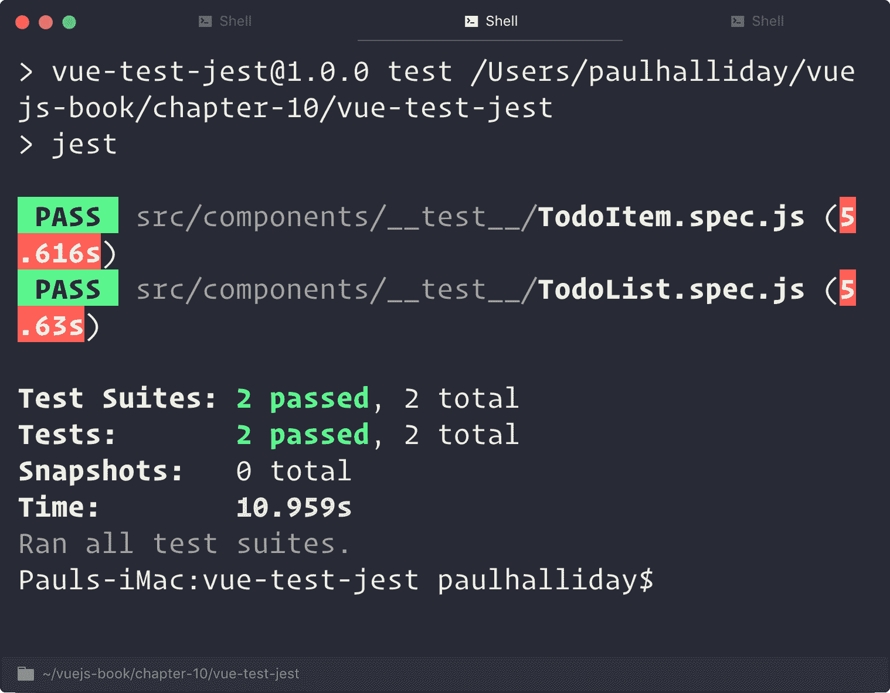
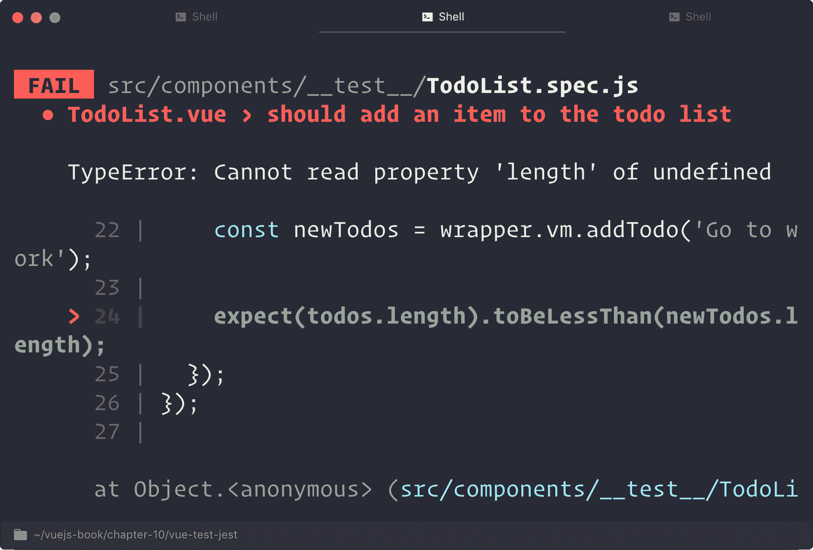
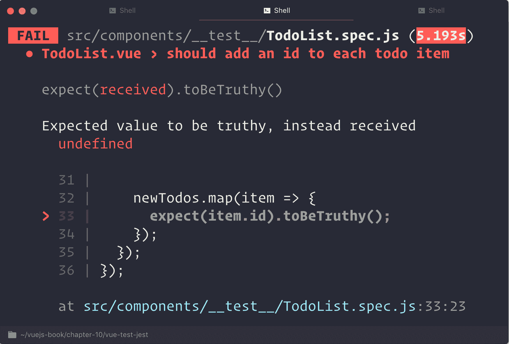
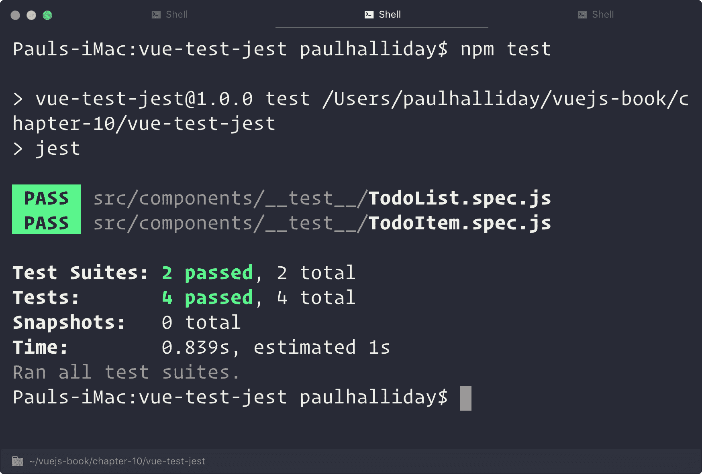
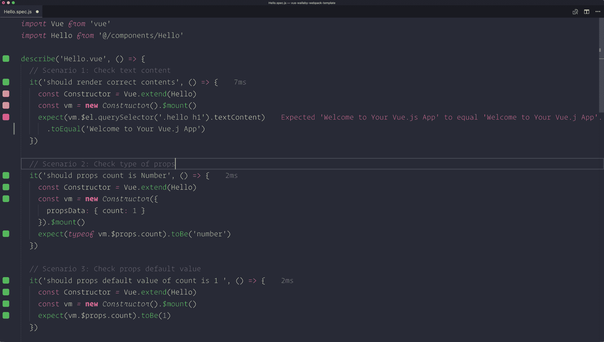

# 十、测试 Vue.js 应用

在一个死气沉沉、需求加速的世界里，为我们的应用创建自动化测试变得比以往任何时候都重要。大多数开发人员忽视的一个重要因素是，测试是一种技能，仅仅因为您可能会舒适地编码解决方案，这并不意味着您可以编写好的单元测试。当你在这方面获得更多的经验时，你会发现自己编写测试的频率会更高，并且想知道没有它们你会做什么！

在本章末尾，我们将介绍以下内容：

*   了解为什么应该考虑使用自动化测试工具和技术
*   为 Vue 组件编写第一个单元测试
*   编写模拟特定函数的测试
*   编写依赖于 Vue.js 事件的测试
*   使用 Wallaby.js 实时查看测试结果

当我们谈论测试我们的 Vue 项目时，根据上下文的不同，我们可以指不同的事情。

# 为什么要测试？

自动化测试工具的存在是有原因的。当涉及到测试我们手动创建的工作时，您将从经验中了解到，这是一个漫长（有时复杂）的过程，不允许获得一致的结果。我们不仅需要手动记住某个特定组件是否工作（或者将结果写在某个地方！），而且它对更改没有弹性。

以下是我多年来在提出测试时听到的一些短语：

*“但是 Paul，如果我为我的应用编写测试，它将花费三倍的时间！”*

*“我不知道如何编写测试…”*

*“那不是我的工作！”*

…还有其他各种各样的。

关键是，测试是一种技能，就如同开发是一种技能一样。您可能不会立即在某一方面表现出色，但随着时间的推移、实践和毅力的增强，您应该会发现自己处于这样一个位置：测试感觉很自然，是软件开发的一个正常部分。

# 单元测试

自动化测试工具承担了我们每次想要验证我们的功能是否按预期工作时所要做的手动工作，并为我们提供了一种方法来运行一个命令，逐个测试我们的断言。然后在报告中（或在我们的编辑器中实时显示，我们将在后面看到），这使我们能够重构未按预期工作的代码。

通过使用自动化测试工具，与手动测试相比，我们节省了大量的工作。

单元测试可以定义为一种一次只测试一个“单元”（功能的最小可测试部分）的测试类型。然后，随着应用变得越来越大，我们可以自动化这个过程，以不断测试我们的功能。此时，您可能希望遵循测试驱动开发/行为驱动开发实践。

在现代 JavaScript 测试生态系统中，有多种测试套件可用。这些测试套件可以被视为应用，它使我们能够编写断言、运行测试、向我们提供覆盖率报告等等。我们将在项目中使用 Jest，因为这是一个由 Facebook 创建和维护的快速灵活的套件。

让我们创建一个新的游乐场项目，以便熟悉单元测试。我们将使用`webpack`模板而不是`webpack-simple`模板，因为这允许我们在默认情况下配置测试：

```js
# Create a new Vue project
$ vue init webpack vue-testing

? Project name vue-testing
? Project description Various examples of testing Vue.js applications
? Author Paul Halliday <hello@paulhalliday.io>
? Vue build runtime
? Install vue-router? Yes
? Use ESLint to lint your code? Yes
? Pick an ESLint preset Airbnb
? Set up unit tests Yes
? Pick a test runner jest
? Setup e2e tests with Nightwatch? No
? Should we run `npm install` for you after the project has been create
d? (recommended) npm

# Navigate to directory
$ cd vue-testing

# Run application
$ npm run dev
```

让我们从调查`test/unit/specs`目录开始。在测试 Vue 组件时，我们将在这里进行所有单元/集成测试。打开`HelloWorld.spec.js`，我们一行一行地看：

```js
// Importing Vue and the HelloWorld component
import Vue from 'vue';
import HelloWorld from '@/components/HelloWorld';

// 'describe' is a function used to define the 'suite' of tests (i.e.overall context).
describe('HelloWorld.vue', () => {

  //'it' is a function that allows us to make assertions (i.e. test 
  true/false)
  it('should render correct contents', () => {
    // Create a sub class of Vue based on our HelloWorld component
    const Constructor = Vue.extend(HelloWorld);

    // Mount the component onto a Vue instance
    const vm = new Constructor().$mount();

    // The h1 with the 'hello' class' text should equal 'Welcome to 
   Your Vue.js App'
    expect(vm.$el.querySelector('.hello h1').textContent).toEqual(
      'Welcome to Your Vue.js App',
    );
  });
});
```

然后，我们可以通过在终端内部运行`npm run unit`来运行这些测试（确保您位于项目目录中）。这将告诉我们有多少测试已经通过，以及测试代码的总体覆盖率。该指标可用于确定应用在 60 分钟内的健壮性；大多数情况下；然而，它不应该被用作福音。在下面的屏幕截图中，我们可以清楚地看到有多少测试通过了：


# 设置 vue 测试 utils

为了获得更好的测试体验，建议使用`vue-test-utils`模块，因为这为我们提供了许多专门用于 Vue 框架的帮助程序和模式。让我们基于`webpack-simple`模板创建一个新项目，并将 Jest 和`vue-test-utils`集成在一起。在终端中运行以下命令：

```js
# Create a new Vue project
$ vue init webpack-simple vue-test-jest

# Navigate to directory
$ cd vue-test-jest

# Install dependencies
$ npm install

# Install Jest and vue-test-utils
$ npm install jest vue-test-utils --save-dev

# Run application
$ npm run dev
```

然后，我们必须向我们的项目添加一些额外的配置，以便我们可以运行 Jest，我们的测试套件。这可以在我们项目的`package.json`中配置。添加以下内容：

```js
{
  "scripts": {
    "test": "jest"
  }
}
```

这意味着，任何时候我们想要运行测试，我们只需在终端内部运行`npm run test`。这将在与`*.spec.js`名称匹配的任何文件上运行 Jest 的本地（项目安装）版本。

接下来，我们需要告诉 Jest 如何处理项目中的单个文件组件（即，`*.vue`文件）。这需要`vue-jest`预处理器。我们还希望在测试中使用 ES2015+语法，因此我们还需要`babel-jest`预处理器。让我们通过在终端中运行以下命令来安装这两个组件：

```js
npm install --save-dev babel-jest vue-jest
```

然后我们可以在`package.json`中定义以下对象：

```js
"jest": {
  "moduleNameMapper": {
    "^@/(.*)$": "<rootDir>/src/$1"
  },
  "moduleFileExtensions": [
    "js",
    "vue"
  ],
  "transform": {
    "^.+\\.js$": "<rootDir>/node_modules/babel-jest",
    ".*\\.(vue)$": "<rootDir>/node_modules/vue-jest"
  }
}
```

这本质上是告诉 Jest 如何处理 JavaScript 和 Vue 文件，根据上下文知道要使用哪个预处理器（即`babel-jest`或`vue-jest`）。

如果我们告诉 Babel 只为当前加载的节点版本提供 Transfile 功能，我们还可以让测试运行得更快。让我们在`.babelrc`文件中添加一个单独的测试环境：

```js
{
  "presets": [["env", { "modules": false }], "stage-3"],
  "env": {
    "test": {
      "presets": [["env", { "targets": { "node": "current" } }]]
    }
  }
}
```

现在我们已经添加了适当的配置，让我们开始测试吧！

# 创建托德主义者

现在让我们在`src/components`文件夹中创建一个`TodoList.vue`组件。这是我们将要测试的组件，我们将慢慢向其添加更多功能：

```js
<template>
  <div>
    <h1>Todo List</h1>
    <ul>
      <li v-for="todo in todos" v-bind:key="todo.id">
        {{todo.id}}. {{todo.name}}</li>
    </ul>
  </div>
</template>

<script>
export default {
  data() {
    return {
      todos: [
        { id: 1, name: 'Wash the dishes' },
        { id: 2, name: 'Clean the car' },
        { id: 3, name: 'Learn about Vue.js' },
      ],
    };
  },
};
</script>

<style>
ul,
li {
  list-style: none;
  margin-left: 0;
  padding-left: 0;
}
</style>
```

如您所见，我们只有一个简单的应用，它返回一个包含不同项的待办事项数组。让我们在`src/router/index.js`内部创建一个路由，以匹配新的`TodoList`组件，并将其显示为根：

```js
import Vue from 'vue';
import Router from 'vue-router';
import TodoList from '../components/TodoList';

Vue.use(Router);

export default new Router({
  routes: [
    {
      path: '/',
      name: 'TodoList',
      component: TodoList,
    },
  ],
});
```

当我们使用`vue-router`时，我们还需要安装它。在终端中运行以下命令：

```js
$ npm install vue-router --save-dev
```

然后我们可以将路由添加到`main.js`：

```js
import Vue from 'vue'
import App from './App.vue'
import router from './router';

new Vue({
  el: '#app',
  router,
  render: h => h(App)
})
```

我现在添加了`router-view`并选择从`App.vue`中删除 Vue 徽标，因此我们有了更干净的用户界面。以下是`App.vue`的模板：

```js
<template>
  <div id="app">
    <router-view/>
  </div>
</template>
```

正如我们在浏览器中看到的，它显示了我们的模板，其中包含 TodoList 的名称以及我们创建的`todo`项：


Let's write some tests for this component

# 写作测试

在`src/components`文件夹中，创建一个名为`__tests__`的新文件夹，然后创建一个名为`TodoList.spec.js`的文件。Jest 将自动查找此文件夹和后续测试。

让我们首先从测试实用程序导入我们的组件和`mount`方法：

```js
import { mount } from 'vue-test-utils';
import TodoList from '../TodoList';
```

`mount`方法允许我们单独测试`TodoList`组件，并使我们能够模拟任何输入道具、事件甚至输出。接下来，让我们创建一个描述块，用于包含测试套件：

```js
describe('TodoList.vue', () => {

});
```

现在，让我们装载该组件并获得对 Vue 实例的访问权：

```js
describe('TodoList.vue', () => {
 // Vue instance can be accessed at wrapper.vm
 const wrapper = mount(TodoList);
});
```

接下来，我们需要定义`it`块来断言测试用例的结果。让我们首先期待它会呈现一个待办事项列表：

```js
describe('TodoList.vue', () => {
  const todos = [{ id: 1, name: 'Wash the dishes' }];
  const wrapper = mount(TodoList);

  it('should contain a list of Todo items', () => {
    expect(wrapper.vm.todos).toContainEqual(todos[0]);
  });
});
```

我们可以通过在终端中运行`$ npm run test -- --watchAll`来观察测试的变化。或者，我们可以在`package.json`中创建一个新脚本，为我们实现这一点：

```js
"scripts": {
 "test:watch": "jest --watchAll"
}
```

现在，如果我们在终端内部运行`npm run test:watch`，它将监视文件系统的任何更改。

以下是我们的结果：


那很有趣。我们考试及格了！然而，在这一点上，我们必须思考自己，这个测试是脆弱的吗？在实际应用中，默认情况下，在运行时，`TodoList`中可能没有项目。

我们需要一种在隔离测试上设置属性的方法。这就是我们设置自己的 Vue 选项的便利之处！

# Vue 选项

我们可以在 Vue 实例上设置自己的选项。让我们使用`vue-test-utils`在实例上设置我们自己的数据，看看这些数据是否正在屏幕上呈现：

```js
describe('TodoList.vue', () => {
  it('should contain a list of Todo items', () => {
    const todos = [{ id: 1, name: 'Wash the dishes' }];
    const wrapper = mount(TodoList, {
      data: { todos },
    });

    // Find the list items on the page
    const liWrapper = wrapper.find('li').text();

    // List items should match the todos item in data
    expect(liWrapper).toBe(todos[0].name);
  });
});
```

如我们所见，我们现在正在根据组件中的数据选项对屏幕上呈现的项目进行测试。

让我们添加一个`TodoItem`组件，这样我们就可以使用`todo`道具动态渲染组件。然后，我们可以根据我们的道具测试该组件的输出：

```js
<template>
  <li>{{todo.name}}</li>
</template>

<script>
export default {
  props: ['todo'],
};
</script>
```

然后我们可以将其添加到`TodoList`组件中：

```js
<template>
  <div>
    <h1>TodoList</h1>
    <ul>
      <TodoItem v-for="todo in todos" v-bind:key="todo.id" 
      :todo="todo">{{todo.name}}</TodoItem>
    </ul>
  </div>
</template>

<script>
import TodoItem from './TodoItem';

export default {
  components: {
    TodoItem,
  },
  // Omitted
}
```

我们的测试仍然如预期的那样通过，因为组件在运行时被呈现到`li`中。更改此选项以查找组件本身可能是一个更好的主意，不过：

```js
import { mount } from 'vue-test-utils';
import TodoList from '../TodoList';
import TodoItem from '../TodoItem';

describe('TodoList.vue', () => {
  it('should contain a list of Todo items', () => {
    const todos = [{ id: 1, name: 'Wash the dishes' }];
    const wrapper = mount(TodoList, {
      data: { todos },
    });

    // Find the list items on the page
    const liWrapper = wrapper.find(TodoItem).text();

    // List items should match the todos item in data
    expect(liWrapper).toBe(todos[0].name);
  });
});
```

让我们为我们的`TodoItem`编写一些测试，并在`components/__tests__`内部创建一个`TodoItem.spec.js`：

```js
import { mount } from 'vue-test-utils';
import TodoItem from '../TodoItem';

describe('TodoItem.vue', () => {
  it('should display name of the todo item', () => {
    const todo = { id: 1, name: 'Wash the dishes' };
    const wrapper = mount(TodoItem, { propsData: { todo } });

    // Find the list items on the page
    const liWrapper = wrapper.find('li').text();

    // List items should match the todos item in data
    expect(liWrapper).toBe(todo.name);
  });
});
```

因为我们基本上使用相同的逻辑，所以我们的测试是相似的。主要区别在于我们没有`todos`的列表，而是只有一个`todo`对象。我们用`propsData`而不是数据来模拟道具，本质上说我们可以向这个组件添加属性，它会呈现正确的数据。让我们来看看我们的测试是通过还是失败了：



# 添加新功能

让我们采用一个测试驱动的方法来为我们的应用添加新的特性。我们需要一种方法将新项目添加到`todo`列表中，所以让我们首先编写测试。在`TodoList.spec.js`中，我们将添加另一个`it`断言，该断言应将一项添加到我们的`todo`列表中：

```js
it('should add an item to the todo list', () => {
  const wrapper = mount(TodoList);
  const todos = wrapper.vm.todos;
  const newTodos = wrapper.vm.addTodo('Go to work');
  expect(todos.length).toBeLessThan(newTodos.length);
});
```

如果我们现在运行测试，我们将得到一个失败的测试，这是预期的！：


让我们尽可能少地修正我们的错误。我们可以在我们的 Vue 实例中添加一个名为`addTodo`的方法：

```js
export default {
  methods: {
    addTodo(name) {},
  },
  // Omitted
}
```

现在我们得到一个新的错误；这一次，它声明它无法读取未定义的属性'length'，本质上说我们没有`newTodos`数组：



让我们让我们的`addTodo`函数返回一个数组，该数组将当前的`todos`与新的 todo 相结合：

```js
addTodo(name) {
  return [...this.todos, { name }]
},
```

我们在运行`npm test`后得到这个输出：


塔达！通过测试。

嗯。我确实记得我们所有的`todo`项目都有一个合适的`id`，但看起来情况已经不是这样了。

理想情况下，我们的服务器端数据库应该为我们处理`id`编号，但目前，我们可以使用`uuid`包处理客户端生成的`uuid`。让我们通过在终端中运行以下命令来安装它：

```js
$ npm install uuid
```

然后，我们可以编写测试用例来断言添加到列表中的每个项都有一个`id`属性：

```js
it('should add an id to each todo item', () => {
  const wrapper = mount(TodoList);
  const todos = wrapper.vm.todos;
  const newTodos = wrapper.vm.addTodo('Go to work');

  newTodos.map(item => {
    expect(item.id).toBeTruthy();
  });
});
```

如您所见，终端输出我们有问题，这是因为我们显然没有`id`属性：



让我们使用前面安装的`uuid`包来实现这个目标：

```js
import uuid from 'uuid/v4';

export default {
  methods: {
    addTodo(name) {
      return [...this.todos, { id: uuid(), name }];
    },
  },
  // Omitted
};
```

然后我们得到一个合格测试：



从失败的测试开始是有益的，原因有很多：

*   它确保了我们的测试实际上正在运行，并且我们没有花时间调试任何东西！
*   我们知道接下来需要实现什么，因为我们受到当前错误消息的驱动

然后，我们可以编写获得绿色测试所需的最少代码，并继续重构代码，直到我们对解决方案感到满意为止。在之前的测试中，我们可以编写更少的代码来获得绿色结果，但为了简单起见，我选择了更小的示例。

# 点击事件

伟大的我们的方法是有效的，但这不是我们的用户与应用交互的方式。让我们看看是否可以让我们的测试考虑用户输入表单和后续按钮：

```js
<form @submit.prevent="addTodo(todoName)">
  <input type="text" v-model="todoName">
  <button type="submit">Submit</button>
</form>
```

我们还可以对我们的`addTodo`函数进行一个小的更改，确保`this.todos`被赋予新`todo`项的值：

```js
addTodo(name) {
 this.todos = [...this.todos, { id: uuid(), name }];
 return this.todos;
},
```

伟大的事情是，通过进行此更改，我们可以对照所有以前的用例进行检查，并看到没有任何失败！自动化测试万岁！

接下来，让我们制作一个`it`块，我们可以使用它来断言，每当单击提交按钮时，就会添加一个项目：

```js
  it('should add an item to the todo list when the button is clicked', () => {
    const wrapper = mount(TodoList);
  })
```

接下来，我们可以使用 find 从包装器中获取 form 元素，这允许我们触发一个事件。在提交表单时，我们将触发 submit 事件，并将一个参数传递给`submit`函数。然后我们可以断言我们的`todo`列表应该是`1`：

```js
it('should add an item to the todo list when the button is clicked', () => {
 const wrapper = mount(TodoList);
 wrapper.find('form').trigger('submit', 'Clean the car');

 const todos = wrapper.vm.todos;

 expect(todos.length).toBe(1);
})
```

我们还可以检查表单提交时是否调用了相应的方法。让我们使用`jest`来实现这一点：

```js
it('should call addTodo when form is submitted', () => {
  const wrapper = mount(TodoList);
  const spy = jest.spyOn(wrapper.vm, 'addTodo');

  wrapper.find('form').trigger('submit', 'Clean the car');

  expect(wrapper.vm.addTodo).toHaveBeenCalled();
});
```

# 测试事件

我们已经取得了很大的进展，但是如果我们能够测试组件之间触发的事件，那不是很好吗？让我们来看看这个，通过创建一个 Tyt T0T，组件，并将我们的表单抽象成 AuthT1 组件：

```js
<template>
  <form @submit.prevent="addTodo(todoName)">
    <input type="text" v-model="todoName">
    <button type="submit">Submit</button>
  </form>
</template>

<script>
export default {
  data() {
    return {
      todoName: ''
    } 
  },
  methods: {
    addTodo(name) {
      this.$emit('addTodo', name);
    }
  }
}
</script>
```

现在，`this`组件中的`addTodo`方法触发一个事件。让我们在`TodoInput.spec.js`文件中测试该事件：

```js
import { mount } from 'vue-test-utils';
import TodoInput from '../TodoInput';

describe('TodoInput.vue', () => {
  it('should fire an event named addTodo with todo name', () => {
    const mock = jest.fn()
    const wrapper = mount(TodoInput);

    wrapper.vm.$on('addTodo', mock)
    wrapper.vm.addTodo('Clean the car');

    expect(mock).toBeCalledWith('Clean the car')
  })
});
```

我们在这个方法中引入了一个新概念--`mock`。这允许我们定义自己的行为，并随后确定事件的名称。

无论何时触发`addTodo`事件，都会调用`mock`函数。这允许我们查看是否正在调用我们的事件，并确保该事件可以获取有效负载。

我们还可以确保`TodoList`处理`this`事件，但首先，确保您已更新`TodoList`以包含`TodoInput`表单：

```js
<template>
  <div>
    <h1>TodoList</h1>

    <TodoInput @addTodo="addTodo($event)"></TodoInput>

    <ul>
      <TodoItem v-for="todo in todos" v-bind:key="todo.id" :todo="todo">{{todo.name}}</TodoItem>
    </ul>
  </div>
</template>

<script>
import uuid from 'uuid/v4';

import TodoItem from './TodoItem';
import TodoInput from './TodoInput';

export default {
  components: {
    TodoItem,
    TodoInput
  },
  data() {
    return {
      todos: [],
      todoName: ''
    };
  },
  methods: {
    addTodo(name) {
      this.todos = [...this.todos, { id: uuid(), name }];
      return this.todos;
    },
  },
};
</script>
<style>
ul,
li {
  list-style: none;
  margin-left: 0;
  padding-left: 0;
}
</style>
```

然后，在我们的`TodoList.spec.js`中，我们可以从导入`TodoInput`开始，然后添加以下内容：

```js
import TodoInput from '../TodoInput';
it('should call addTodo when the addTodo event happens', () => {
  const wrapper = mount(TodoList);

  wrapper.vm.addTodo = jest.fn();
  wrapper.find(TodoInput).vm.$emit('addTodo', 'Clean the car');

  expect(wrapper.vm.addTodo).toBeCalledWith('Clean the car');
})
```

除此之外，我们还可以确保活动做到它应该做的事情；因此，当我们触发事件`it`时，会向数组中添加一个项目，并测试数组长度：

```js
it('adds an item to the todolist when the addTodo event happens', () => {
 const wrapper = mount(TodoList);
 wrapper.find(TodoInput).vm.$emit('addTodo', 'Clean the car');
 const todos = wrapper.vm.todos;
 expect(todos.length).toBe(1);
});
```

# 使用 Wallaby.js 获得更好的测试体验

我们还可以使用 Wallaby.js 在编辑器中实时查看单元测试的结果。它不是一个免费的工具，但在创建测试驱动的 Vue 应用时，您可能会发现它很有用。让我们从克隆/下载一个已经设置了 Wallaby 的项目开始。在终端中运行以下命令：

```js
# Clone the repository
$ git clone https://github.com/ChangJoo-Park/vue-wallaby-webpack-template

# Change directory
$ cd vue-wallaby-webpack-template

# Install dependencies
$ npm install

# At the time of writing this package is missing eslint-plugin-node
$ npm install eslint-plugin-node

# Run in browser
$ npm run dev
```

然后我们可以在编辑器中打开它，并在编辑器中安装 Wallaby.js 扩展。您可以在[找到支持的编辑器和说明列表 https://wallabyjs.com/download/](https://wallabyjs.com/download/) 。

我将在 Visual Studio 代码中安装它，首先在 extensions marketplace 中搜索 Wallaby：


然后，我们可以通过在 Mac 上按*CMD*+*SHIFT+=*或在 Windows 上按*CTRL*+*SHIFT+=*来告知 Wallaby 项目的配置文件（`wallaby.js`。从下拉列表中，单击选择配置文件，然后键入`wallaby.js`。这将允许 Wallaby 和 Vue 一起工作。

要启动 Wallaby，我们可以再次打开配置菜单并选择开始。然后我们可以导航到`tests/unit/specs/Hello.spec.js`文件，我们应该可以在编辑器的行边距中看到不同的块：


因为一切都是绿色的，我们知道它已经过去了！如果我们更改测试的实现细节呢？让我们故意让一个或多个测试失败：



除了“应该呈现正确内容”块（可以在左侧看到）外，所有内容都保持绿色。这是因为我们现在有一个失败的断言，但更重要的是，我们不必重新运行测试，它们会立即显示在我们的编辑器中。不再需要在不同窗口之间使用 Alt 选项卡来查看我们的测试输出！

# 总结

本章介绍了如何正确测试 Vue 组件。我们学习了如何遵循失败优先的方法来编写驱动开发决策的测试，以及如何利用 Wallaby.js 在编辑器中查看测试结果！

在下一章中，我们将学习如何将 Vue.js 应用与现代渐进式 Web 应用技术（如服务工作者、应用清单等）结合起来！