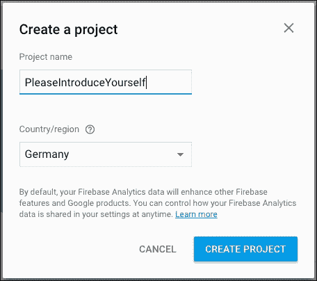
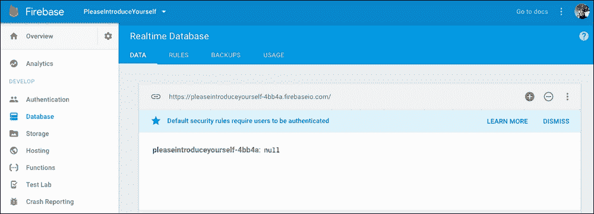
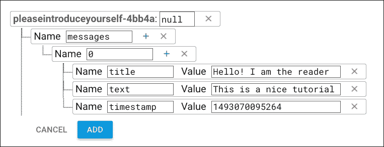
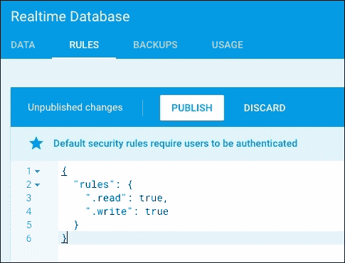
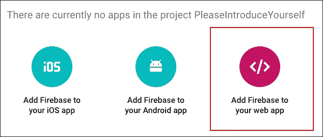
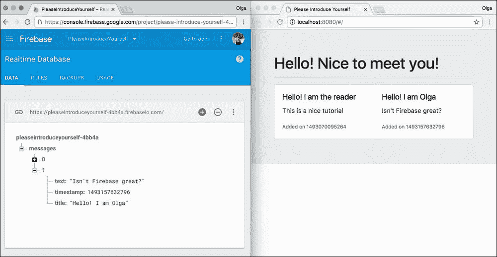
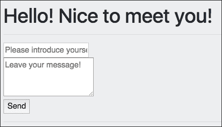
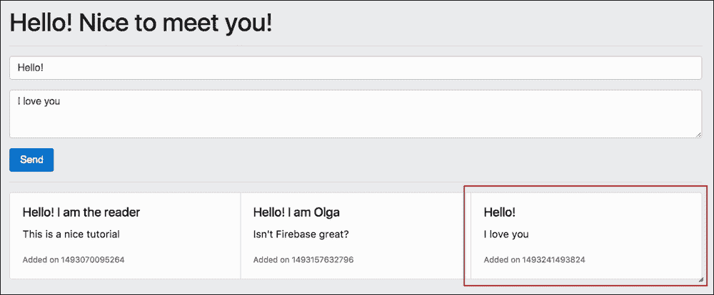
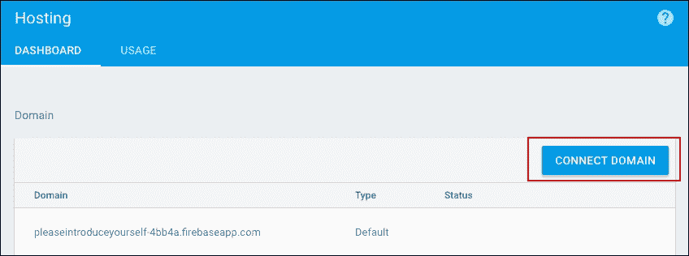

# 一、请自我介绍——教程

# 用户好

亲爱的读者您好，我的名字是奥尔加。[T0]你也来自我介绍一下好吗？打开[https://pleaseintroduceyourself.xyz/](https://pleaseintroduceyourself.xyz/) 并给我和其他读者留言。

页面本身看起来没有什么特别之处。它只是一个允许用户编写消息的网页，然后，该消息将立即与其他用户的消息一起按相反的时间顺序显示：


请自我介绍页面

你想知道我花了多长时间创建这个页面吗？我花了大约半个小时的时间，我不仅在谈论编写 HTML 标记或颠倒消息的顺序，还讨论了数据库设置、部署和托管。

你可能注意到，第一条信息永远不会改变，事实上，这是我写的信息，我喜欢学习和教学。确实如此。这就是为什么我将用这一章来教你如何在 15 分钟内创建完全相同的页面。你准备好了吗？走吧！

# 在 Firebase 控制台中创建项目

如果你仍然没有谷歌账户，但你真的想继续本教程，那么，我真的很抱歉，但这次你必须创建一个。Firebase 是由谷歌提供的一项服务，因此谷歌账户的需求量远远大于此。

如果您已经拥有您的帐户，请登录[T0]Firebase 控制台：

‘T0’。https://console.firebase.google.com/ “T1”。

让我们从创建新的 Firebase 项目开始。点击**添加项目**按钮。给它一个有意义的名字，然后从列表中选择你的国家。完成后，点击**创建项目**：



使用 Firebase 控制台创建项目

你完了！现在，您可以为应用程序使用 Firebase 供电的后端，包括实时数据库、身份验证机制、托管和分析。

## 向 Firebase 应用程序数据库添加第一个条目

让我们添加第一个数据库条目。点击左侧的**数据库**选项卡。您应该会看到与此类似的仪表板：



Firebase 项目仪表板上的实时数据库

让我们通过点击加号添加一个名为`messages`的条目和第一条消息，作为包含`title`、`text`和`timestamp`的键值对象：



将第一个值添加到 Firebase 实时数据库

点击**添加**按钮，您的数据库将保存添加的条目。添加尽可能多的消息条目，或者保持这样。现在，为了简单起见，让我们更改数据库的规则，使其可读写。当心决不要为生产中供公众使用的东西这样做。在本例中，我们只想测试 Firebase 的一些功能，但您未来的应用程序必须是智能和安全的。点击**规则**选项卡，在打开的文本区域中键入以下规则：

```js
{
  "rules": {
    ".read": true,
    ".write": true
  }
}
```

因此，您的**规则**选项卡现在看起来如下所示：



更改规则后的“规则”选项卡

点击**发布**按钮，您就完成了！现在，在我们的应用程序中开始使用这个数据会很有趣。然而，首先我们必须创建此应用程序并将其连接到我们的项目。

# 搭建 Vue.js 应用程序

在本节中，我们将创建一个*Vue.js*应用程序，并将其连接到我们在上一步中创建的 Firebase 项目。确保您的系统上安装了*Node.js*。

您还必须安装 Vue.js。查看 Vue 官方文档中的说明页面[https://vuejs.org/v2/guide/installation.html](https://vuejs.org/v2/guide/installation.html) 。或者，只需运行`npm install`命令：

```js
$ npm install -g vue-cli

```

现在，一切都准备好开始构建我们的应用程序了。转到希望应用程序驻留的文件夹并键入以下代码行：

```js
vue init webpack please-introduce-yourself

```

它会问你几个问题。只需选择默认答案并点击*输入*即可。初始化后，即可安装并运行应用程序：

```js
cd please-introduce-yourself
npm install
npm run dev

```

如果一切正常，以下页面将在默认浏览器中自动打开：


安装并运行后的默认 Vue.js 应用程序

如果没有，请再次检查 Vue.js 官方安装页面。

## 将 Vue.js 应用程序连接到 Firebase 项目

为了能够将您的应用程序连接到Firebase 项目，您必须安装*Firebase*和*VueFire*。在新应用程序的根目录中运行[T0]命令：

```js
cd please-introduce-yourself
npm install firebase vuefire --save

```

现在，您可以在应用程序中使用 Firebase 的强大功能。让我们检查一下它是否有效！我们只需做到以下几点：

*   进口Firebase
*   创建一个`config`对象，其中包含 Firebase 应用程序 ID、项目域、数据库域以及将其连接到我们的项目所需的其他内容
*   编写将使用 Firebase API 和创建的`config`文件连接到 Firebase 项目的代码。
*   使用它

我们从哪里获得配置 Firebase 实例所需的信息？进入 Firebase 控制台，点击**概览**页签右侧的 cog，选择**项目设置**。现在，点击**将 Firebase 添加到您的 web 应用程序**按钮：



单击将 Firebase 添加到 web 应用程序按钮

将打开一个包含我们需要的所有信息的弹出窗口：


config 对象所需的所有信息都在这里

好的，现在，只需打开此弹出窗口，转到您的Vue 应用程序，并打开驻留在应用程序的`src`目录中的`main.js`文件。在这里，我们需要告诉我们的 Vue 应用程序它将使用 VueFire。通过这种方式，我们将能够在应用程序中使用 Firebase 提供的所有功能。将以下行添加到`main.js`文件的导入部分：

```js
//main.js
import VueFire from 'vuefire'
Vue.use(VueFire)

```

伟大的现在，打开`App.vue`文件。在这里，我们将导入 Firebase 并在 Vue 应用程序中初始化 Firebase 应用程序。在`<script>`标记内添加以下代码行：

```js
//App.vue
<script>
  import Firebase from 'firebase'

  let config = {
    apiKey: 'YOUR_API_KEY',
    authDomain: 'YOUR_AUTH_DOMAIN',
    databaseURL: 'YOUR_DATABASE_URL',
    projectId: 'YOUR_PROJECT_ID',
    storageBucket: 'YOUR_STORAGE_BUCKET',
    messagingSenderId: 'YOUR_MESSAGING_SENDER_ID'
  }

  let app = Firebase.initializeApp(config)
</script>
```

从上一步打开的弹出窗口中复制`config`对象信息所需的内容。

现在，我们将获得对 messages 数据库对象的引用。使用 Firebase API 非常简单：

```js
//App.vue
<script>
  <...>
 let db = app.database()
 let messagesRef = db.ref('messages')
</script>
```

我们差不多完成了。现在，我们只需导出 Vue 数据对象中的`messages`对象，以便我们能够在模板部分中使用它。因此，在`export`部分中，向`messagesRef`添加一个带有`firebase`键和`messages`点的条目：

```js
export default {
  firebase: {
    messages: messagesRef
  },
}
```

现在，在`<template>`标记中，我们将使用`v-for`指令遍历`messages`数组并打印关于每条消息的所有信息。请记住，每条消息都由`title`、 `text`和 `timestamp`组成。因此，将以下`<div>`添加到模板中：

```js
//App.vue
<div v-for="message in messages">
  <h4>{{ message.title }}</h4>
  <p>{{ message.text }}</p>
  <p>{{ message.timestamp }}</p>
</div>
```

最后，您的`App.vue`组件将如下所示：

```js
//App.vue
<template>
  <div id="app">
    <div v-for="message in messages">
      <h4>{{ message.title }}</h4>
      <p>{{ message.text }}</p>
      <p>{{ message.timestamp }}</p>
    </div>
  </div>
</template>

<script>
  import Firebase from 'firebase'

  let config = {
    apiKey: 'YOUR_API_KEY',
    authDomain: 'YOUR_AUTH_DOMAIN',
    databaseURL: 'YOUR_DATABASE_URL',
    projectId: 'YOUR_PROJECT_ID',
    storageBucket: 'YOUR_STORAGE_BUCKET',
    messagingSenderId: 'YOUR_MESSAGING_SENDER_ID'
  }

  let app = Firebase.initializeApp(config)
  let db = app.database()
  let messagesRef = db.ref('messages')
  export default {
    name: 'app',
    firebase: {
      messages: messagesRef
    }
  }
</script>
```

如果您在应用程序初始化中选择了默认的 linter 设置，那么您将从 Firebase 复制并粘贴到应用程序中的代码将不会通过 linter。这是因为 Vue cli 初始化的默认 linter 设置需要使用单引号，并且在行尾不使用分号。顺便说一句，*Evan You*特别为这个无分号规则感到自豪。所以，给他带来这快乐；从复制的代码中删除所有分号，并用单引号替换双引号。

你不想看看这一页吗？如果尚未运行应用程序，请在应用程序文件夹内切换并运行：

```js
cd please-introduce-yourself
npm run dev

```

我很确定您看到了以下屏幕截图：


显示 Firebase 数据库信息的 Vue.js web 应用程序

祝贺您已成功完成本教程的第一部分，将 Vue.js 应用程序连接到 Firebase 实时数据库。

# 添加引导式标记

让我们通过添加引导并使用其类来为应用程序添加基本样式。

首先，让我们包括 Bootstrap 的`CSS`和来自 Bootstrap 的`CDN`的`JS`文件。我们将使用即将发布的版本 4，它仍然是 alpha 版本。打开`index.html`文件，在`<head>`部分添加必要的`link`和`script`标签：

```js
//index.html
<link
rel="stylesheet"
href="https://maxcdn.bootstrapcdn.com/bootstrap/4.0.0-alpha.6/css/bootstrap.min.css"crossorigin="anonymous">
<script src="https://code.jquery.com/jquery-3.2.1.min.js"crossorigin="anonymous"></script>
<script src="https://npmcdn.com/tether@1.2.4/dist/js/tether.min.js">
</script>
<script src="https://maxcdn.bootstrapcdn.com/bootstrap/4.0.0-alpha.6/js/bootstrap.min.js"crossorigin="anonymous">
</script>
```

您可能已经注意到，我还添加了*jQuery*和*Tether*依赖项；这是因为引导依赖于它们。

现在，我们可以在应用程序中使用引导类和组件。让我们从使用引导类添加一些样式开始。

我将把整个 app`div`标签包装到`jumbotron`类中，然后将其内容包装到`container`类中。因此，模板看起来会有点不同：

```js
//App.vue
<template>
  <div id="app" class="jumbotron">
    <div class="container">
      <h1>Hello! Nice to meet you!</h1>
    <hr />
    <div v-for="message in messages">
    <...>
    </div>
  </div>
</div>
</template>
```

查看页面；看起来不一样吗？现在，我想将每条消息的内容打包到`card`类中。卡片似乎是这种东西的合适容器。在[查看有关卡片的官方引导文档https://v4-alpha.getbootstrap.com/components/card/](https://v4-alpha.getbootstrap.com/components/card/) 。我将添加带有`card-group`类的`div`标记，并将所有包含消息的卡片放在这个容器中。因此，我不需要担心定位和布局。每样东西都会自动响应！因此，消息的标记将如下所示：

```js
//App.vue
<template>
<...>
  <div class="card-group">
    <div class="card" v-for="message in messages">
      <div class="card-block">
        <h5 class="card-title">{{ message.title }}</h5>
        <p class="card-text">{{ message.text }}</p>
        <p class="card-text"><small class="text-muted">Added on {{ message.timestamp }}</small></p>
      </div>
    </div>
  </div>
</template>
```

查看页面。它看起来很漂亮！通过几个步骤，我们能够很好地显示存储在 Firebase 数据库中的消息。尝试使用 Firebase 实时数据库仪表板添加另一条消息。保持网页打开！填写 Firebase 数据库字段：


向 Firebase 数据库添加条目

现在，点击**添加**按钮。新消息将自动显示在您的网页上：



一旦我们点击添加按钮，新的消息立即出现在我们的网页上

这不是很棒吗？现在，我们可以添加任意数量的消息。我们还可以删除和操作它们，所有更改都将自动传播到我们的网页。这很好，但是我们真的想继续使用我们的后端数据库来查看网页上的变化吗？当然不是！我们希望我们页面的用户能够使用我们的页面而不是数据库仪表板添加他们的消息。让我们回到我们的 Vue.js 应用程序，添加一个允许我们添加新消息的表单。

## 使用 Bootstrap 添加表单

让我们在应用程序中添加一个简单的表单，使我们能够在留言板中添加新的消息。查看有关表格的引导文档[https://v4-alpha.getbootstrap.com/components/forms/](https://v4-alpha.getbootstrap.com/components/forms/) 。

让我们在消息列表的前面添加一个表单。此表单将包含标题输入、消息文本区域和提交按钮。它将如下所示：

```js
//App.vue
<template>
  <div id="app" class="jumbotron">
    <div class="container">
      <h1>Hello! Nice to meet you!</h1>
      <hr />
      <form>
        <div>
 <input maxlength="40" autofocus placeholder="Please introduce yourself :)" />
        </div>
        <div>
 <textarea placeholder="Leave your message!"  rows="3">
 </textarea>
        </div>
 <button type="submit">Send</button>
      </form>
      <hr />
      <...>
    </div>
  </div>
</template>
```

看这一页。看起来不是很美吗？



我们的身体看起来不太漂亮

事实上，老实说，它看起来很难看！然而，使用引导类，修复它非常容易。如果我们将`form-control`类添加到`input`和`textarea`元素中，将`form-group`类添加到围绕这些元素的每个`div`标记中，并且可能将`btn btn-primary`类添加到`submit`按钮中……那么，我们将拥有更好的东西！


使用引导类，表单看起来非常好

好的，现在我们有一张漂亮的表格，但是如果我们尝试填写它，什么都不会发生。我们必须使其功能化，为此，我们将使用 Vue.js 的强大功能。

# 使用 Vue.js 实现功能

那么，我们想要通过我们的形式实现什么呢？我们希望创建新消息。此消息必须由标题、文本和时间戳组成。我们还希望将此消息添加到消息引用数组中。

我们将此新消息称为`newMessage`并将其添加到`App.vue`的`data`属性中：

```js
//App.vue
<script>
  <...>
  export default {
    data () {
      return {
 newMessage: {
 title: '',
 text: '',
 timestamp: null
 }
      }
    },
  <...>
  }
</script>
```

现在，让我们将这个`newMessage`对象的标题和文本绑定到表单的`input`和`textarea`。我们还将一个名为`addMessage`的方法绑定到表单的提交处理程序，以便整个表单的标记如下所示：

```js
<template>
<...>
  <form @submit="addMessage">
    <div class="form-group">
      <input class="form-control"v-model="newMessage.title"maxlength="40"autofocus  placeholder="Please introduce yourself :)" />
    </div>
    <div class="form-group">
      <textarea class="form-control"v-model="newMessage.text" placeholder="Leave your message!"  rows="3"></textarea>
    </div>
    <button class="btnbtn-primary" type="submit">Send</button>
  </form>
  <...>
</template>
```

好的，我们已经将`"addMessage"`方法绑定到表单的`submit`回调，但是我们还没有定义这个方法！那么，让我们来定义它。将`methods`对象添加到我们的`App.vue`导出部分，并在其中定义`addMessage`方法。这个方法将从我们的表单接收事件属性，只需抓取`newMessage`对象并将其推入`messagesRef`数组。听起来不容易吗？

```js
//App.vue
<script>
  export default {
  <...>
 methods: {
 addMessage (e) {
 e.preventDefault()
 this.newMessage.timestamp = Date.now()
 messagesRef.push(this.newMessage)
 }
 }
  }
</script>
```

现在，打开页面，填写表格，点击**发送**按钮。您将立即在邮件列表中看到您的邮件：



我们在表单中引入的消息会立即传播到消息列表

我们还需要解决一些问题。我们不希望在将消息添加到消息列表后，表单中填充的值仍保留在那里。所以，我们需要在`addMessage`方法中清除它。也许，一些基本的检查，至少是标题，也会很好。因此，请按如下方式重写该方法：

```js
//App.vue
addMessage (e) {
  e.preventDefault()
 if (this.newMessage.title === '') {
 return
 }
  this.newMessage.timestamp = Date.now()
  messagesRef.push(this.newMessage)
 this.newMessage.text = ''
 this.newMessage.title = ''
 this.newMessage.timestamp = null
}
```

现在，如果你开始添加更多的消息，事情看起来有点奇怪。对于我们的案例，我们显示消息的方式可能不是最好的方式。你还记得我们在`card-group`课上把留言卡打包成`div`吗？让我们尝试用`card-columns`类替换它，并检查它是否看起来更好。事实上，确实如此。就这样吧。

## 增加实用功能，让事情看起来更美好

我们已经有了一个功能齐全的单页应用程序，但它仍然缺乏一些惊人之处。例如，时间以时间戳的形式出现并不是很美。让我们编写一个实用函数，将时间戳转换为一些漂亮的东西。

我们将使用这个*Moment.js*库（[https://momentjs.com/](https://momentjs.com/) ）。将其安装在应用程序文件夹中：

```js
npm install moment --save

```

创建一个文件夹并将其命名为`utils`。将名为`utils.js`的文件添加到此文件夹。导入`moment`并编写以下函数：

```js
//utils.js
import moment from 'moment'

function dateToString (date) {
  if (date) {
 return moment(date).format('MMMM Do YYYY, h:mm:ss a')
  }
  return''
}
```

将其导出到文件末尾：

```js
//utils.js
<...>
export { dateToString }
```

让我们将此函数导入`App.vue`并使用它格式化时间戳。打开`App.vue`文件，在`script`部分开头添加`import`语句：

```js
//App.vue
<script>
  import Firebase from 'firebase'
 import { dateToString } from './utils/utils'
  <...>
</script>
```

为了能够在 Vue 模板中使用此功能，我们必须在`methods` 部分中导出它。只需在`methods`对象中添加一个新条目：

```js
//App.vue
<script>
  export default {
    <...>
    methods: {
 dateToString: dateToString,
      <...>
    }
</script>
```

由于我们使用 ES6，我们只需编写以下代码行：

```js
methods: {
 dateToString
}
```

现在，我们可以在模板部分中使用此方法。只需将`message.timestamp`绑定对象包装在`dataToString`方法中：

```js
<p class="card-text"><small class="text-muted">Added on {{ dateToString(message.timestamp) }}</small></p>
```

查看页面！现在，您可以看到漂亮的日期而不是 Unix 时间戳。

### 运动

我有一个小练习给你。您看到了添加一个实用函数将时间戳转换为格式良好的日期是多么容易。现在，创建另一个实用程序函数并将其命名为`reverse`。此函数用于按相反顺序显示消息数组，因此最新消息应首先显示。如果您有疑问，请检查本章的代码。

## 将信息卡提取到自己的组件中

您可能注意到演示应用程序的第一条消息始终存在。它不会被其他新消息项移动。所以，这似乎是一种特殊的信息，它被以一种特殊的方式对待。事实上是这样。如果你想让一张卡片变粘，只需将它添加到遍历其他消息的[T0]元素之前。你也可以在这张卡片上添加一些类来表示它真的很特别。在我的例子中，我添加了 Bootstrap 的`card-outline-success`类，它以漂亮的绿色勾勒出元素：

```js
//App.vue
<div class="card-columns">
 <div class="card card-outline-success">
 <div class="card-block">
 <h5 class="card-title">Hello!</h5>
 <p class="card-text">This is our fixed card!</p>
 <p class="card-text"><small class="text-muted">Added on {{ dateToString(Date.now()) }}</small></p>
 </div>
 </div>
  <div class="card" v-for="message in messages">
    <div class="card-block">
      <h5 class="card-title">{{ message.title }}</h5>
      <p class="card-text">{{ message.text }}</p>
      <p class="card-text"><small class="text-muted">Added on {{ dateToString(message.timestamp) }}</small></p>
    </div>
  </div>
</div>
```

现在，你有了一张很好的粘性卡片，它的颜色与其他卡片的颜色不同。但是…你不觉得有什么问题吗？我们在模板中重复了两次相同的代码。我很确定你知道任何开发者的经验法则：不要重复你自己！

让我们将卡提取到单个组件。这真的很容易。将名为`Card.vue`的组件添加到`components`文件夹中。此组件的代码非常简单：

```js
//Card.vue
<template>
  <div class="card">
    <div class="card-block">
      <h5 class="card-title">{{ title }}</h5>
      <p class="card-text">{{ text }}</p>
      <p class="card-text"><small class="text-muted">{{ footer }}</small></p>
    </div>
  </div>
</template>

<script>
  export default {
    props: ['title', 'text', 'footer']
  }
</script>
```

现在，让我们使用不同的标题、文本和页脚值从`App.vue` 调用这个组件。首先在 Vue`components`对象中导入导出：

```js
//App.vue
<script>
<...>
 import Card from './components/Card'
  <...>
  export default {
  <...>
 components: {
 Card
 }
  }
</script>
```

现在，我们可以在模板中使用[T0]元素。我们需要绑定标题、文本和页脚。页脚实际上是在…上添加的表示**的文本。因此，第一张卡的标记如下所示：**

```js
//App.vue
<template>
  <div class="card-columns">
    <card class="card-outline-success":title="'Hello!'":text="'This is our fixed card!'":footer="'Added on ' + dateToString(Date.now())"></card>
  </div>
</div>
</template>
```

其他消息的列表将遵循相同的逻辑。对于来自`messages`数组的每个消息，我们将绑定相应消息的条目（标题、文本和时间戳）。因此，消息卡列表的标记如下所示：

```js
<div class="card-columns">
<...>
  <card v-for="message in messages":title="message.title":text="message.text":footer="'Added on ' + dateToString(message.timestamp)"></card>
</div>
</div>
```

正如您所看到的，我们用两行代码替换了十四行代码！当然，我们的组件也包含一些代码行，但是现在，我们可以一次又一次地重用它。

### 运动

毫无疑问，我们将卡片代码提取到其单个组件中的方式非常好，但是我们为第一条消息绑定属性的方式有点难看。如果在某个时候我们需要更改消息的文本怎么办？首先，在标记中查找文本并不容易。此外，管理标记属性中的文本也非常困难，因为我们必须非常小心，不要弄乱双引号/单引号。而且，承认吧，这很难看。本练习的任务是将第一条消息的标题、文本和日期提取为更好的内容（例如，将其导出到数据对象中），并以与绑定其他消息相同的方式进行绑定。如果您对此练习有疑问，请查看本章的代码。

### 注

不要被提供的代码中的[T0]指令所迷惑。我们已经在使用它了，只是它的缩写版本——在分号后面写的绑定属性的名称。因此，例如，`v-bind:messages`与`:messages`相同。

# 部署您的应用程序

好吧，现在我们手中有一个完全可以工作的应用程序，是时候公开了。为了做到这一点，我们将把它部署到 Firebase。

首先安装 Firebase 工具：

```js
npm install -g firebase-tools

```

现在，您必须告诉您的 Firebase 工具，您实际上是一个拥有帐户的 Firebase 用户。为此，您必须使用 Firebase 工具登录。运行以下命令：

```js
firebase login

```

按照说明登录。

现在，您必须在应用程序中初始化 Firebase。从应用程序根目录调用以下命令：

```js
firebaseinit

```

你会被问到一些问题。为第一个问题选择第三个选项：


选择第一个问题的托管选项

从要关联到应用程序的项目列表中选择`PleaseIntroduceYourself`项目。

初始化已经结束。检查名为`firebase.json` 的文件是否已在项目文件夹中创建。此文件可以包含无数个配置。请在[查阅 Firebase 官方文档 https://firebase.google.com/docs/hosting/full-config](https://firebase.google.com/docs/hosting/full-config) 。对我们来说，对要部署的公共目录的最基本指示就足够了。`vue-cli`构建生产就绪资产的目录称为`dist`；因此，我们希望部署此目录的内容。因此，将以下代码行添加到您的`firebase.json`文件中：

```js
{
  "hosting": {
    "public": "dist",
    "ignore": [
      "firebase.json",
      "**/.*",
      "**/node_modules/**"
    ]
  }
}
```

别忘了保存你的文件。现在让我们构建和部署我们的应用程序。听起来像是 devops 的大任务，对吧？它不是很大。运行`npm build`然后运行`firebase deploy`：

```js
npm run build
firebase deploy

```

有多困难？成功部署后，Firebase 将输出项目的 URL。现在，您可以开始玩它并将其发送给您的朋友。这可能不是世界上最漂亮的网址，对吧？也许你想把它连接到你的域名？当然，这是可能的！

# 额外里程–将 Firebase 项目连接到自定义域

将Firebase 项目连接到自定义域相当容易。首先，当然，你需要购买这个域名。对于这个应用，我用最便宜的顶级域名`.xyz`购买了*PleaseIntroductYourself*域名。在 GoDaddy（[上，我每年花费](https://godaddy.com)一美元多一点 https://godaddy.com [T7]。在你拥有你的域名后，这真的很容易。转到项目的 Firebase web 控制台。点击左侧的**托管**选项卡。然后点击**连接域**按钮：



单击“连接域”按钮

在弹出窗口中输入您的域名：


输入你的域名

它将建议您在域中添加一个 TXT DNS 记录。只需打开您的 DNS 提供商页面，选择您的域，了解如何添加 DNS 记录，并添加具有`TXT`类型的记录。在中，对于 GoDaddy，记录添加部分如下所示：


将 DNS TXT 记录添加到我们的域

建立握手后（请注意，这可能需要一些时间），Firebase 将向您建议最后一步，将**A**记录添加到您的域中。按照与上一步完全相同的程序进行操作；只需添加**A**类型的记录，而不是`TXT`类型的记录。

在完全传播更改之前需要一些时间。就我而言，大约花了一个小时。过一段时间，您将能够打开带有`https://<your domain>.<your top level domain>`地址的新页面。就我而言，正如你已经知道的，它是[https://pleaseintroduceyourself.xyz/](https://pleaseintroduceyourself.xyz/) 。

# 总结

在本章中，我们学习了一个教程，其中我们从头开发了一个单页应用程序。我们使用 Vue.js 框架来构建应用程序，使用引导框架来应用样式，使用 Firebase 平台来管理应用程序的持久层和宿主。

尽管我们能够取得相当大的成果（一个功能齐全的部署应用程序），但我们做的每件事都没有深入了解幕后的情况。本教程没有解释什么是 Vue.js、Bootstrap 或 Firebase。我们只是认为这是理所当然的。

在下一章中，我们将详细了解底层技术。我们将做以下工作：

*   进一步了解 Vue.js 框架，从基本理解开始，然后介绍指令、数据绑定、组件、路由等主题
*   深入了解引导框架，并检查使用它可以实现什么以及如何实现
*   更好地了解 Firebase 平台；我们将对它有一些基本的了解，并将讨论更复杂的主题，如数据存储或函数
*   查看不同的技术，使用这三个不同的项目为我们的应用程序添加简单性、功能和灵活性