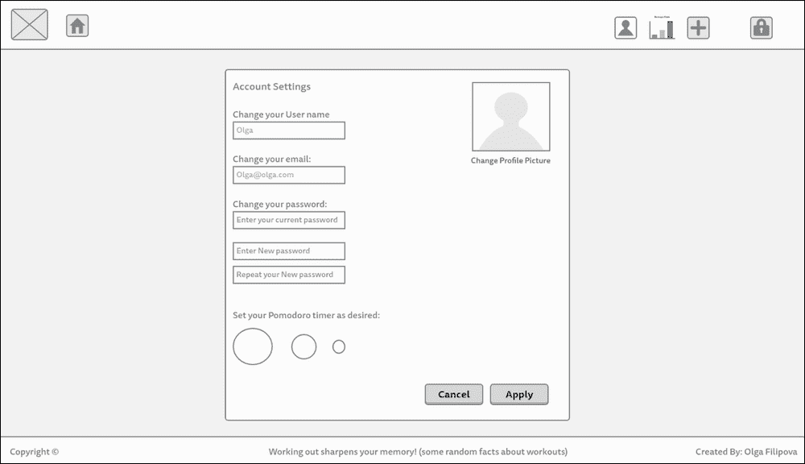
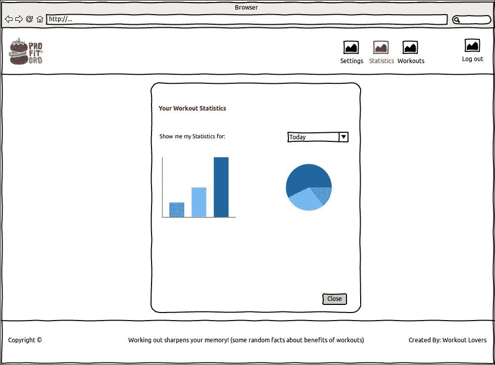
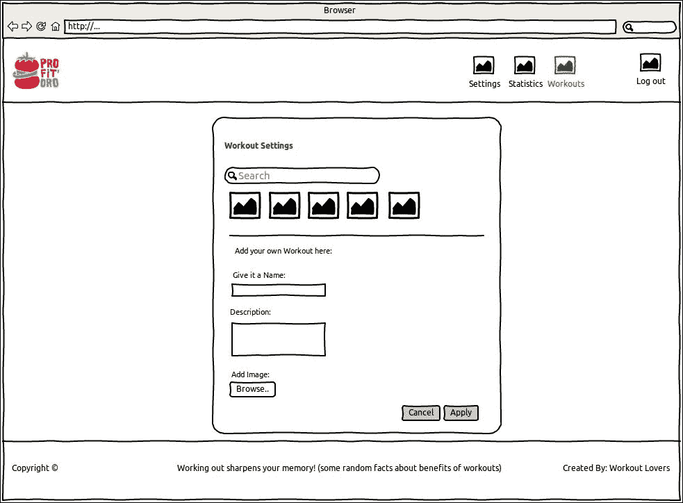

# 三、让我们开始吧

在上一章中，我们讨论了在本书中构建应用程序时将使用的三种主要技术。我们探索了很多关于 Vue.js 的知识；我们介绍了 Bootstrap 的一些功能，并检查了使用 googlefirebase 控制台可以实现的功能。我们知道如何使用 Vue.js 从头开始启动应用程序。我们知道如何借助 Bootstrap 使其变得美观，我们知道如何使用 googlefirebase 将其部署到 live 中！这是什么意思？这意味着我们已经 100%准备好开始开发我们的应用程序了！

编写应用程序是一个有趣、富有挑战性和令人兴奋的过程。。。除非我们知道我们要编码什么，对吗？为了知道我们将编写什么代码，我们必须定义应用程序的概念、需求和目标用户。在这本书中，我们将不涉及建筑设计的整个过程，因为这是一门大科学。

在本书中，特别是在本章中，在深入研究实现之前，我们将至少定义一组角色和用户故事。因此，在本章中，我们将做以下工作：

*   说明我们将通过应用程序解决的问题
*   定义一些人物角色和用户故事
*   从用户故事中检索名词和动词
*   绘制将定义应用程序主屏幕和区域的实体模型

# 说明问题

世界上有许多时间管理技术。几位大师和专业人士就如何有效地管理您的时间进行了大量的讨论，从而使您的工作效率更高，并且您的所有 KPI 值都高于任何可能的生产力基准。有些谈话真的很精彩。说到时间管理演讲，我总是建议兰迪·波许在[上演讲 https://youtu.be/oTugjssqOT0](https://youtu.be/oTugjssqOT0) 。

说到时间管理技巧，有一种我特别喜欢的流行技巧，我发现它使用起来非常简单。它叫Pomodoro（[https://en.wikipedia.org/wiki/Pomodoro_Technique](https://en.wikipedia.org/wiki/Pomodoro_Technique) ）。该技术包括以下原则：

*   你在一段时间内不受任何干扰地工作。这段时间可以是 20 到 25 分钟，叫做Pomodoro
*   在Pomodoro工作之后，你有 5 分钟的休息时间。在这段休息时间，你可以做任何你想做的事情——查看电子邮件、社交网络等等
*   在完成四次短暂休息后，你有权获得更长的休息时间，可以持续 10 到 15 分钟

Pomodoro 定时器有很多种实现方式。其中一些允许您配置 Pomodoros 的工作时间以及短时间和长时间的休息时间。他们中的一些人在工作期间屏蔽社交网络页面；有些会发出噪音。在*Learning Vue.js 2*一书中，我们还构建了一个简单的 Pomodoro 计时器，在工作期间产生棕色噪音，并在短暂休息期间随机显示小猫。

如果你正在读这本书，那么你很可能是一名开发人员，你一天中的大部分时间都是坐着或者站着，因为现在站立办公桌非常流行。您在工作日（或夜间）更换职位的频率是多少？你的背部有问题吗？你去健身房吗？你喜欢慢跑吗？你多久在家锻炼一次？作为一名开发人员需要高度的专注，我们常常会忘记一些关于自己的事情。

在本书中，我们将再次构建 Pomodoro 计时器。这一次，它不仅要解决时间管理问题，还要解决健身管理问题。它会告诉你做一个简单的锻炼，而不是让你在休息时做任何你想做的事情，或者随意展示一些小猫。这些训练包括非常简单的头部旋转练习、俯卧撑和 burpees。用户可以根据他们工作的办公室类型选择一组他们最喜欢的锻炼。用户还可以添加新的训练。也可以对训练进行评分。

因此，我们将实施的 Pomodoro 定时器的主要原理如下：

*   不间断地工作。专注于你正在做的事情。
*   休息时锻炼身体。
*   协作并添加新的激动人心的练习，这些练习可供您和应用程序的其他用户使用。

# 采集要求

既然我们知道了要构建什么，那么让我们为应用程序定义一个需求列表。该应用程序的全部功能是显示计时器和显示训练。那么，让我们来定义它必须能够做什么。以下是我的功能需求列表：

*   应用程序应该显示一个倒计时计时器。
*   倒计时计时器可以是 25 到 0 分钟、5 到 0 分钟或 10 到 0 分钟。
*   应能够在应用程序执行的任何时刻启动、暂停和停止计时器。
*   当时间达到 0 时，应用程序应发出一些声音，并在下一个休息时间或开始工作时发出声音。
*   应用程序应在短时间和长时间休息期间显示训练。可以跳过当前训练并切换到下一个训练。也可以在休息时完全跳过训练，只盯着小猫看。还可以将给定的训练标记为完成。
*   应用程序必须提供身份验证机制。经过身份验证的用户可以配置 Pomotoro 计时器，向系统添加新的训练，并可视化他们的统计数据。
*   已验证用户的统计信息显示每天、每周和每月执行的训练次数。
*   经过身份验证的用户可以按如下方式配置 Pomotoro 计时器：
    *   为长时间工作的 Pomodoro 定时器选择一个介于 15 和 30 之间的值
    *   为短时中断计时器选择一个介于 5 和 10 之间的值
    *   为长中断计时器选择一个介于 10 和 15 之间的值
*   经过身份验证的用户可以配置他们最喜爱的训练集以显示。
*   通过身份验证的用户可以创建新的训练并将其添加到系统中。
*   每项训练包括四个部分：标题、描述、图片和评分。

我还有一个非常基本的列表，包括两项非功能性需求：

*   在本例中，应用程序应该使用持久性存储来存储其数据 Firebase 的实时数据库
*   应用程序应具有响应性，并在多个平台和设备上运行

我想这已经足够我们的 Pomodoro 的功能了。或者，因为这是关于健身的，也许我们可以叫它波菲托罗？或者，也许，因为我们的身体得到了一些不错的利润，让我们称之为*ProFitOro*。

# 人物角色

通常，在开发应用程序之前，我们必须定义其目标用户。为此，对应用程序的潜在用户进行了多份问卷调查。调查问卷通常包括有关用户个人数据的问题，如年龄、性别等。还应该有关于用户使用操作系统、桌面或移动设备等模式的问题。当然，应用程序本身也有问题。例如，对于 ProFitOro 应用程序，我们可以问以下问题：

*   你每天在办公室花多少小时？
*   你工作期间在办公室里坐多久？
*   你多久做一次运动，如慢跑、健身运动等？
*   你是在办公室工作还是在家工作？
*   你工作的地方有没有可以做俯卧撑的地方？
*   你的背部有问题吗？

收集完所有问卷后，根据相似的模式和个人数据将用户分为不同的类别。之后，每个用户的类别形成一个单独的角色。我将在这里为 ProFitOro 应用程序留下四个角色。

让我们从一个虚构的角色 Alex Bright 开始：

*亚历克斯·布莱特*

**年龄**：32 岁。

**性别**男

**教育**：理学硕士

**职业**：软件工程师，全职

**使用模式**：在办公室工作，使用运行 Ubuntu 的笔记本电脑和 iPhone。

**最喜欢的浏览器**：谷歌 Chrome

**健康健身**：每月慢跑 5 公里一次。我经常感到背痛

让我们继续看下一个虚构的人物安娜·库兹涅佐娃。

*安娜·库兹涅佐娃*

**年龄**：22 岁。

**性别**：女性

**教育**理学学士

**职业**学生

**使用模式**：主要在家里使用运行 Windows 的桌面和 Android 手机工作。

\12304；T0]最喜欢的浏览器：Mozilla Firefox

**健康与健身**：每周去健身室三次。没有任何健康问题

在写这本书的时候，我的一个朋友刚刚进入我们的公寓参观。他叫杜阿尔特，但我们取笑他叫矮人。在他出现后，以下角色立即诞生（请注意，我们的朋友杜阿尔特离 45 岁还差得很远）：

\12304；T0】矮人阿泽维多

**年龄**：45 岁

**性别**男

**教育**博士

**职业**：副总工程师，专职

**使用模式**：在办公室工作，通常在共同工作空间，有时在家。使用 MacBook Pro 和 iPhone，工作时花很多时间坐着。

**健康与健身**：定期在家锻炼。有时他感到背部疼痛。

我丈夫芮在一家名为 Gymondo 的在线健身公司工作。在那里，他们有一位很棒的健身教练，名叫史蒂夫。他把你逼到了极限。每次我和这个家伙一起锻炼，我都不能走路。以下角色就是这样诞生的：

*史蒂夫·威尔逊*

**年龄**：35 岁

**性别**男

**职业**：健身教练，专职

**使用模式**：Windows 桌面在家

**健康与健身**：从不感到疼痛，每天每小时都在训练

我们可以看到，对于我们的用户来说，一个共同的现象是，他们都会花一些时间在同一个位置（坐着），他们的工作需要一些注意力和可能的时间管理技巧，他们有时需要改变他们的位置，以防止背部出现问题。

# 用户故事

在我们定义了用户之后，让我们写一些用户故事。说到写用户故事，我只是闭上眼睛想象我就是这个人。让我们从矮人阿泽维多开始试试这个思维练习：

\12304；T0】矮人阿泽维多

Dwart 的工作日包括会议、电话、视频会议和文书工作。今天，他忙于采访和会议。最后，他有了几个小时的时间来完成等待了整整一周的文书工作。矮人想以最有成效的方式度过这些时间。他打开 ProFitOro 应用程序，单击开始，然后开始工作。文书工作完成后，他点击 stop，在 ProFitOro 中查看统计数据，并感到高兴。尽管他的工作时间只有两个小时，但他能够完成他计划完成的所有事情。

因此，我们可以提出这样一个正式的用户故事：

*作为一名认证用户，我想在 ProFitOro 查看我的统计页面，以了解我工作日*的完整性。

让我们转到我们的健身教练史蒂夫·威尔逊。

*史蒂夫·威尔逊*

史蒂夫是一名健身教练。他对人体、营养知识以及如何正确进行锻炼了如指掌。他有很多使用 ProFitOro 应用程序的程序员朋友。他在工作日结束后回家，登录并打开 ProFitOro 应用程序，单击“训练”部分，并为背部添加新的练习。

因此，新的正式用户故事听起来可能是这样的：

*作为一名健身教练，我希望轻松添加新的练习，以通过更多的训练丰富 ProFitOro 应用程序。*

让我们转到我们的学生安娜·库兹涅佐娃。

*安娜·库兹涅佐娃*

安娜是一名学生。目前，她正在经历考试期。她需要每天为考试而学习。当夏天来临，你所有的朋友都出去玩的时候，专心读书可不是件容易的事。有人告诉她关于 ProFitOro 应用程序的事，所以她开始使用它而没有注册。过了一会儿，她意识到这实际上有助于她集中精力。在使用了几个小时后，她想检查一下自己工作了多少，做了多少运动。但是，非注册用户无法获得此信息。因此，她点击应用程序第一页的**注册**按钮，用她的电子邮件注册，现在，她可以访问她的统计数据。

因此，出现了另一个用户故事：

*作为未注册用户，我希望能够注册自己，以便能够登录应用程序并访问我的统计数据*。

# 检索名词和动词

从用户故事中检索名词和动词是一项非常有趣的任务，它可以帮助您了解应用程序由哪些部分组成。对于那些喜欢**统一建模语言**（**UML**）的用户，从用户故事中检索名词和动词后，就可以完成类和实体关系图了！不要低估要检索的名词和动词的数量。把它们都写下来！之后你可以删除没有意义的单词。那么，让我们开始吧。

## 名词

我能够从我的用户故事中检索到的名词如下：

*   工作日
*   会议
*   呼叫
*   采访
*   小时
*   白天
*   周
*   应用
*   统计数字
*   工作时间
*   计划
*   健身
*   教练
*   人体
*   营养
*   训练
*   部分
*   运动
*   电子邮件
*   数据
*   页
*   登记

## 动词

我能够从用户故事中检索到的动词如下：

*   包括
*   忙
*   打开
*   花时间
*   开始
*   暂停
*   停止
*   检查
*   完成
*   计划
*   添加
*   创造
*   登记
*   证明…是真实的
*   登录
*   集中

事实上，我们有动词，如**注册**、**登录、**和**认证**和名词，如**电子邮件、**和**注册**意味着应用程序可能会在注册和未注册的情况下使用。这意味着第一个页面可能会包含*登录*和*注册*区域，并且不知何故，它还应该包含一个指向应用程序的链接，该应用程序可以在没有任何事先验证的情况下使用。

然后，我们有一些动词，比如**开始**、**暂停、**和**停止**。这些是适用于我们的 Pomodoro 定时器的主要动作。我们可以启动应用程序，我们可以暂停它，当然，我们可以在工作日的任何时候停止它。顺便说一下，**工作日**是我们检索到的名词之一。因此，这意味着应用程序的主页面将包含倒计时计时器，该计时器可能会被启动、暂停和停止。

我们有很多与健身相关的名词-**健身**本身、**人体**、**运动**、**锻炼**等等。这实际上是我们试图通过这个应用程序来实现的，在我们休息的时候训练我们的*身体*。所以，在下班休息的时候做一个练习。注意，还有一些动词，如**check**和**finish**。因此，练习可以*完成*并且可以*检查*，表示用户已经*完成*练习。这就是为什么这个 Pomodoro 区间表示应该包含一个*复选框*。它还应该包含一个链接，引导你进行下一个练习，以防你花更少的时间在当前练习上。它也可能有一个跳过按钮，以防你在这段时间内完全不参与练习。

查看名词**统计**。这并不意味着我们必须谈论平均数、抽样、人口和其他你几年前在学校学到的东西。在我们的上下文中，名词**statistics**意味着用户应该能够访问他们在*天*、*周、*或*月*期间进行的*统计数据*（请检查是否确实存在**天**和**周）**名词列表中的名词）。因此，将有另一个屏幕显示用户的*统计数据*。

**计划**和**工作时间**。有些东西可以计划，也可以配置。一些用户可能会觉得工作时间应该是 30 分钟而不是 25 分钟，这是有道理的。有些可能需要较小的工作间隔，例如 15 或 20 分钟。这些值应为*可配置*。因此，我们来到另一个屏幕-*配置*。在该屏幕中，用户将能够重置其密码，并为工作时间、短时间和长时间休息配置 Pomodoro 定时器。

查看动词**create**和**add**与名词**workout**相连。我们已经讨论过，Pomodoro 休息期间出现的训练是应用程序用户协作工作的结果。因此，应该有一个*部分*（检查**部分**这个词也出现在我们的名词列表中），它允许*可视化*现有的训练和*创建*新的训练。

因此，根据前面的分析，我们将探讨 ProFitOro 应用程序的六个重要领域：

*   用户可以注册或登录的第一页。此页面还允许用户在未经身份验证的情况下开始使用应用程序。
*   Pomodoro 计时器所在的主页面。
*   带有 Pomodoro 休息计时器的主页，显示休息期间要执行的训练。
*   可以更改用户设置（如用户名和配置文件图片）以及配置 Pomodoro 定时器的区域。
*   可以观察一天、一周或一个月内所进行训练的统计数据的部分。
*   显示所有现有训练并允许用户添加新训练的部分。

既然我们已经对如何概述我们的应用程序有了概念，我们可以开始考虑创建一些模型，以便对它有更好的感觉，并尽早预测可能出现的问题。

# “T0”：实体模型

现在我们有了所有的名词和动词，我们可以开始在应用程序的所有部分之间建立连接。我们可以开始准备一些模型。与某人坐下来，讨论、解释你的想法，并收集反馈。提出问题。回答问题。使用白板，使用帖子。使用纸张：再次绘制、丢弃和重画。

我有一个好朋友叫 Safura。她是一名在职学生，目前在柏林学习计算机科学，我们在同一个团队中一起工作。她对 UI/UX 主题感兴趣。实际上，她将在**人机交互**（**人机交互**领域撰写硕士论文。于是，我们坐在一起，我向她解释了 ProFitOro 的想法。你无法想象她问了多少问题。然后，我们开始画画。并重新绘制。“如果……”又重新画了一遍。

这是第一个纸面模型的外观：

ProFitOro 应用程序的第一个纸质模型

经过所有的头脑风暴、绘画和重画，Safura 为我准备了一些很好的模型。她使用*线框素描器*来这个目的（[http://wireframesketcher.com/](http://wireframesketcher.com/) ）。

## 第一页-登录注册

用户看到的第一个页面是允许他们在没有任何注册的情况下登录、注册或开始使用 ProFitOro 的页面。这就是它的样子：

ProFitOro 应用程序的登录页面

文字、颜色和数字尚未最终确定。实体模型最重要的部分是元素的定位。您仍然需要与设计人员合作，并且仍然需要使用您最喜欢的编程语言（对我们来说是 JavaScript/HTML/CSS）来实现这一点。实体模型帮助您记住应用程序的重要细节。

## 显示 Pomodoro 定时器的主页面

应用程序的下一个实体模型显示 Pomodoro 定时器何时启动：

启动应用程序工作计时器的主屏幕

正如你所看到的，我们的目标是拥有一个简单而干净的界面。标题区域中有四个链接。详情如下:

*   **链接至**设置页面：为用户打开个人设置。用户可以更改个人数据，如密码、个人资料照片和 Pomodoro 计时器设置。
*   **链接到统计页面**：打开包含统计用户数据的弹出窗口。
*   **训练链接**：这将打开包含所有可用训练的页面。本页还提供了添加新训练的可能性。
*   **注销链接**

这些链接仅对已注册和已验证的用户启用。对于匿名用户，这些链接将被禁用。

## 休息期间的训练

当工作的Pomodoro结束时，五分钟的小休息开始了。在此休息期间，用户可以进行简单的小运动：

在短暂休息期间，用户可以进行一次小运动

如您所见，训练区提供以下功能：

*   首先，你可以完成你的练习并点击**完成！**。此操作将把训练存储到统计数据中。
*   如果出于某种原因，您不想做建议的练习，但仍然想做一些事情，那么您可以单击**下一步**。这将为您提供一个随机选择的新训练。
*   如果出于某种原因，你感到疲劳，根本不想运动，那么你可以点击**向我展示小猫！**按钮，该按钮将呈现随机小猫的区域，您可以一直盯着该区域直到休息结束。

## 设置

如果用户想要更改其个人设置的配置或 Pomodoro 间隔时间，用户必须进入**设置**区域。这个区域看起来像这样：

ProFitOro 的设置区域

如您所见，**设置**区域允许我们更改用户的个人数据并配置 Pomotoro 的计时。

## 统计

如果用户想要查看其统计数据并点击**统计数据**菜单按钮，将打开一个弹出窗口，其中一些图表显示了用户每天、每周和每月完成的训练：

统计数据弹出窗口

## 运动

最后，如果您觉得您可能对应用程序中不存在的训练有想法，您可以随时打开**训练**部分并添加新的训练：

训练组

如您所见，在**训练**部分，用户可以可视化整个训练列表，搜索它们，然后编辑自己的训练列表。默认情况下，应用程序中列出的所有训练将构成您的日常训练。但是，在此区域中，可以切换其选择。将为每个用户存储配置。

也可以创建新的训练。添加新训练包括提供标题、说明和图像。

这些实体模型并没有决定应用程序的最终外观。它们只是帮助我们定义首先要做什么以及如何放置元素。在这个过程中，最终的定位和外观可能会发生很大的变化。然而，我们有严格的指导方针，这是项目管理和开发阶段最重要的成果。

## 标志

你可能已经注意到所有的屏幕都有一个漂亮的标志。这个标志是由我的一个非常好的朋友设计的，他是一位伟大的平面设计师，名叫 Carina。我已经在*Learning Vue.js 2*一书中提到过这个徽标，但我想再次提及。这是：

我的朋友 Carina 设计的 ProFitOro 标识

这不是很好吗？这难道不反映出我们的应用程序将允许我们使用 Pomodoro 技术结合小运动做什么吗？我们甚至定义了 ProFitOro 的座右铭：

> 工作期间休息。休息时锻炼身体。

# 总结

在本章中，我们应用了设计应用程序用户界面的基本原则。我们集思广益，定义我们的角色，编写用户故事，从这些故事中检索名词和动词，最后为我们的应用程序制作了一些漂亮的模型。

在下一章中，我们将开始实现 ProFitOro。我们将使用 Vue.js 构建应用程序并将其拆分为重要组件。因此，在下一章中，我们将做以下工作：

*   使用带有`webpack`模板的 vue cli 构建 ProFitOro 应用程序
*   将应用程序拆分为组件，并为应用程序创建所有必要的组件
*   使用 Vue.js 和引导实现一个基本的 Pomodoro 计时器