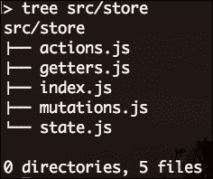
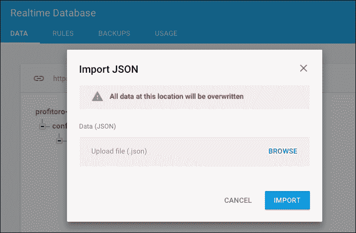

# 五、配置您的 Pomodoro

在上一章中，我们实现了 ProFitOro 应用程序的主要功能–Pomodoro 定时器。我们甚至添加了一个硬编码的训练，这样我们可以在休息时进行锻炼。事实上，我已经开始使用 ProFitOro 了。当我写这些话的时候，Pomodoro钟倒计时–*滴答*。

在本章中，我们将探讨*Firebase 实时数据库的*可能性及其 API。我们将管理应用程序的存储、检索和更新使用统计信息和配置。我们将使用 Vuex 存储将应用程序的数据从数据库传送到前端应用程序。

为了给 UI 带来这种可能性，我们将使用 Vue 的反应能力和引导功能。因此，在本章中，我们将使用以下工具实现统计和设置 ProFitOro 组件：

*   Firebase 实时数据库
*   Vue.js 反应式数据绑定和 Vuex 状态管理
*   引导的力量，使事情的反应

# 建立 Vuex 商店

在从数据库中的真实数据开始之前，让我们为 ProFitOro 设置 Vuex 存储。我们将使用它来管理 Pomotoro 计时器配置、用户设置（如用户名）和配置文件图片 URL。我们还将使用它来存储和检索应用程序的使用统计信息。

从[第 2 章](02.html#MSDG2-449ee41b57ea4c048225480b41c8dbe3 "Chapter 2. Under the Hood – Tutorial Explained")开始*你好用户解释*，您已经知道 Vuex 商店是如何运作的。我们必须定义表示应用程序状态的数据，然后必须提供获取数据所需的所有 getter 和更新数据所需的所有变体。一旦所有这些都设置好，我们将能够从组件访问这些数据。

在应用程序的存储区准备好并设置好之后，我们可以将其连接到实时数据库，并稍微调整 getter 和 transformation 以操作真实数据。

首先，我们需要告诉我们的应用程序它将使用 Vuex 存储。为此，让我们为`vuex`添加`npm`依赖项：

```js
npm install vuex --save

```

现在，我们需要定义我们商店的基本结构。我们的 Vuex 商店将包含以下内容：

*   **状态**：应用程序数据的初始状态。
*   **Getters**：检索状态属性的方法。
*   **突变**：提供一种改变状态的方法。
*   **动作**：可调度调用突变的方法。动作和突变之间的唯一区别是动作可以是异步的，我们的应用程序可能需要它们。

听起来很简单，对吧？只需创建一个名为`store`的文件夹，并为我们刚才指出的所有内容创建 JavaScript 文件。同时创建`index.js`文件，该文件将用所有这些东西实例化 Vuex 存储。以下是您的结构：



存储文件夹的结构

当我们在[第 2 章](02.html#MSDG2-449ee41b57ea4c048225480b41c8dbe3 "Chapter 2. Under the Hood – Tutorial Explained")中首次提到 Vuex 商店时，*Hello User 解释了*，我们简化了结构，并在同一个文件中介绍了所有商店的组件。现在，我们将遵循良好的模块化结构，让一切都位于自己的位置。我们甚至可以更进一步，将状态分离到模块中（一个用于配置，另一个用于设置，等等），但对于 ProFitOro 的复杂程度来说，这可能是过分的。但是，如果您想查看如何将存储区划分为逻辑模块，请查看关于 Vuex 的文档中关于模块的部分：[https://vuex.vuejs.org/en/](https://vuex.vuejs.org/en/) 。

不过，让我们继续我们的店。创建结构后，将商店的所有组件导入到 `index.js`中，并创建一个 Vuex 实例，将所有组件作为参数传递。不要忘记导入 Vuex 并告诉 Vue 使用它！因此，我们商店的入口点如下所示：

```js
//store/index.js
import Vue from 'vue'
import Vuex from 'vuex'
import state from './state'
import getters from './getters'
import mutations from './mutations'
import actions from './actions'

Vue.use(Vuex)

export default new Vuex.Store({
  state,
 getters,
 mutations,
 actions
})
```

现在唯一重要的是，我们的设置已经完全完成，让我们的应用程序知道它正在使用这个存储。通过这种方式，存储将在所有组件中可用。要使之成为可能，您只需在应用程序的入口点（`main.js`中导入我们的存储并将其传递给 Vue 实例：

```js
//main.js
import Vue from 'vue'
import App from './App'
import store from './store'

new Vue({
  el: '#app',
  template: '<App/>',
  components: { App },
  store
})
```

现在，我们已经完全准备好开始我们的魔术与商店。你错过编码了吗？好了，给你！首先，我们将创建的`config`文件替换为存储区的状态和 getter，该文件是 Pomodoro 计时属性的容器。只需将`config`文件的所有配置元素复制到我们的状态，并为其创建一个 getter：

```js
//store/state.js
const config = {
  workingPomodoro: 25,
  shortBreak: 5,
  longBreak: 10,
  pomodorosTillLongBreak: 3
}

export default {
  config
}
```

现在让我们转到getters。getter 不仅仅是常规函数。在幕后，它们将状态作为参数接收，因此您可以访问应用程序状态的数据，而无需任何依赖项注入，因为 Vuex 已经为您管理了该数据。因此，只需创建一个函数，将状态作为参数接收并返回任何状态数据！如果需要，可以在 getter 中对数据执行任何操作。因此，`config`文件的 getter 可以如下所示：

```js
//store/getters.js
function getConfig (state) {
  return state.config
}
```

由于我们使用的是 ES6，因此可以用更简洁优雅的方式重写：

```js
//store/getters.js
var getConfig = (state) => state.config
```

然后，可以将其导出：

```js
//store/getters.js
export default {
  getConfig: getConfig
}
```

或者，我们可以简单地使用：

```js
//store/getter.js
export default {
  getConfig
}
```

整个过程实际上可以写成：

```js
//store/getters.js
export default {
  getConfig: state => state.config
}
```

这有多简单？当我开始使用 JavaScript 时（不要问我什么时候，我自己也不想觉得自己老了），我几乎无法想象这样的语法会成为可能。

现在，您可以在任何应用程序的组件中使用新的 getter。怎样您还记得使用`this.$store.state`属性访问状态有多容易吗？同样，在计算数据函数中，您可以访问您的`getters`：

```js
computed: {
  config () {
    return this.$store.getters.getConfig
  }
},
```

从现在起，`this.config`可以用于所有组件的计算值和方法。让我们想象一下，在同一个组件中，我们需要使用多个 getter。例如，假设我们为每个配置值创建 getter。因此，对于每个值，您都必须重复这个乏味的代码：`this.$store.getters.bla-bla-bla`。啊！一定有更简单的方法。。。还有。Vuex 为我们提供了一个名为`mapGetters`的助手对象。如果您只需将此对象导入到组件中，则可以使用[T3]和 ES6 spread 运算符调用 getter：

```js
import { mapGetters } from 'vuex'

export default {
  computed: {
    ...mapGetters([
      'getConfig'
    ])
  }
}
```

或者，如果要将 getter 方法映射到其他名称，只需使用对象：

```js
import { mapGetters } from 'vuex'

export default {
  computed: {
    ...mapGetters({
      config: 'getConfig'
    })
  }
}
```

这就是我们要做的。我们将在`PomodoroTimer`组件中使用`mapGetters`助手，我们将删除对导入的`config`文件的引用（另外，不要忘记删除文件本身；我们不希望代码库中出现死代码）。我们将所有对`config`的引用替换为`this.config`。因此，我们的`PomodoroTimer`脚本的部分将如下所示：

```js
//PomodoroTimer.vue
<script>
  // ...
  import { mapGetters } from 'vuex'
  // ...
  export default {
    data () {
      // ...
    },
    computed: {
      ...mapGetters({
 config: 'getConfig'
 }),
      time () {
        let minutes
        if (this.isWorking) {
          minutes = this.config.workingPomodoro
        } else if (this.isShortBreak) {
          minutes = this.config.shortBreak
        } else if (this.isLongBreak) {
          minutes = this.config.longBreak
        }

        return minutes * 60
      }
    },
    // ...
    methods: {
      togglePomodoro () {
        // ...
        this.isLongBreak = this.pomodoros % this.config.pomodorosTillLongBreak === 0
      }
    }
  }
</script>
```

检查你的页面，一切都应该像以前一样工作。这种新方法的优势是什么？-有人可能会问，-我们在这里已经花了半章的时间来建立这个商店及其方法、获取方法、操作等等…最后，我们有了完全相同的行为。为何那么，您还记得本章的全部目标是能够配置和重新配置 Pomodoro 定时设置，并将其存储在数据库中吗？如果我们必须引入数据库引用以及在组件中检索和存储数据的所有操作，我们的生活将更加艰难。想象一下，在某个时候 Firebase 不适合您的需要，您希望切换到另一个数据源，甚至是一种不同的技术，比如说*Elasticsearch*甚至*MongoDB*。您必须更改组件及其方法，以及其计算值。维持这一切听起来像是地狱吗？

让您的数据驻留在存储中，并且让您的 getter 负责检索它们，这将使您只需要在决定更改基础数据源时更改 getter。您的组件将始终保持不变！它是应用程序的数据和逻辑层的抽象。抽象在软件工程领域是一件非常酷的事情。

让我们为`Settings.vue`组件定义一个基本的标记。检查我们的模型。

该部分将包含两个主要方面：

*   个人设置配置区
*   Pomodoro 定时器设置配置区域

同样，我将使用引导网格类来帮助我构建一个好的、响应性强的布局。我希望它在小型设备上生成两个堆栈列，在中型设备上生成两个大小相同的列，在大型设备上生成两个大小不同的列。因此，我将使用`row`类来包装`div`，并使用相应的`col-*-*`类来包装`Settings`组件的两个主要区域：

```js
// Settings.vue
<div class="row justify-content-center">
  <div class="col-sm-12 col-md-6 col-lg-4">
    <div class="container">
      <h2>Account settings</h2>
      account settings
    </div>
  </div>
  <div class="col-sm-12 col-md-6 col-lg-8">
    <div class="container">
      <h2>Set your pomodoro timer</h2>
      pomodoro timer configuration
    </div>
  </div>
</div>
```

现在，让我们只关注 Pomodoro 定时设置配置。我创建了一个名为`SetTimer.vue`的组件。该组件只包含一个数字类型的输入，并在其值更改时发出一个方法。在 Pomotoro 设置容器中，我将使用导入的`mapGetters`帮助程序中的不同值渲染此组件三次：

```js
//Settings.vue
<template>
  <...>
    <div class="row justify-content-center align-items-center">
      <div class="col-md-5 col-sm-10">
        <set-timer :value="config.workingPomodoro"></set-timer>
        <div class="figure-caption">Pomodoro</div>
      </div>
      <div class="col-md-4 col-sm-10">
        <set-timer :value="config.longBreak"></set-timer>
        <div class="figure-caption">Long break</div>
      </div>
      <div class="col-md-3 col-sm-10">
        <set-timer :value="config.shortBreak"></set-timer>
        <div class="figure-caption">Short break</div>
      </div>
    </div>
  <...>
</template>
```

使用`SetTimer`组件的 CSS 魔法，我可以渲染三个输入圆，如下所示：


输入球，允许我们为不同的 Pomodoro 间隔设置计时器

您可以在`chapter5/1/profitoro`文件夹中找到相应的代码。特别是，检查`components/main/sections/timer`文件夹中的`SetTimer.vue`组件，以及如何使用`Settings.vue`组件中相应的值调用它。

# 定义动作和突变

我们的组件现在可以从存储中获取数据，这很好，但如果我们的组件也能够更改存储中的数据，那么可能会更有趣。另一方面，我们都知道不能直接修改存储的状态。

任何组件都不应触及该状态。但是，您还记得我们关于 Vuex 存储的一章中提到，有一些特殊的函数可以改变存储。他们甚至被称为`mutations`。这些函数可以对 Vuex 存储数据执行任何操作。可以使用应用于存储的`commit`方法调用这些突变。在引擎盖下，它们基本上接收两个参数——状态和值。

我将定义三个突变——计时器的每个定义一个。这些突变将用新值更新`config`对象的相应属性。因此，我的突变如下所示：

```js
//store/mutations.js
export default {
  setWorkingPomodoro (state, workingPomodoro) {
    state.config.workingPomodoro = workingPomodoro
  },
  setShortBreak (state, shortBreak) {
    state.config.shortBreak = shortBreak
  },
  setLongBreak (state, longBreak) {
    state.config.longBreak = longBreak
  }
}
```

现在我们可以定义动作了。动作基本上会调用我们的突变，因此它可以被视为重复工作。但是，请记住，动作和突变之间的区别在于动作实际上可以是异步的，因此当我们将动作连接到数据库时，它可能会派上用场。现在，让我们告诉操作在提交之前验证接收到的值。`actions`方法接收存储和新值。由于 store 为我们提供了名为`commit,`的基本方法，该方法使用所需突变的名称进行调用，因此我们可以如下定义每个操作：

```js
actionName ({commit}, newValue) {
  commit('mutationName', newValue)
}
```

### 提示

我们可以将`{commit}`作为一个参数写入，并立即使用`commit`函数，因为我们使用的是 ES6，对象销毁对我们来说非常有效（[https://developer.mozilla.org/en/docs/Web/JavaScript/Reference/Operators/Destructuring_assignment](https://developer.mozilla.org/en/docs/Web/JavaScript/Reference/Operators/Destructuring_assignment) ）。

因此，我的动作看起来是这样的：

```js
//store/actions.js
export default {
  setWorkingPomodoro ({commit}, workingPomodoro) {
    if (workingPomodoro) {
      commit('setWorkingPomodoro', parseInt(workingPomodoro, 10))
    }
  },
  setShortBreak ({commit}, shortBreak) {
    if (shortBreak) {
      commit('setShortBreak', parseInt(shortBreak, 10))
    }
  },
  setLongBreak ({commit}, longBreak) {
    if (longBreak) {
      commit('setLongBreak', parseInt(longBreak, 10))
    }
  }
}
```

现在，让我们回到`Settings.vue`组件。这个组件应该导入操作并在需要时调用它们，对吗？我们如何导入操作？你还记得那个`mapGetters`助手吗？有一个类似的帮助器用于名为`mapActions`的操作。因此，我们只需将其与`mapGetters`助手一起导入，并与`methods`对象内的扩展运算符（`…`一起使用即可：

```js
//Settings.vue
<script>
  import {mapGetters, mapActions} from 'vuex'
  <...>
  export default {
    <...>
    methods: {
      ...mapActions(['setWorkingPomodoro', 'setShortBreak', 'setLongBreak'])
    }
  }
</script>
```

现在，只要`set-timer`输入的值发生变化，我们就必须调用所需的操作。在上一段中，我们讨论了`SetTimer`组件发出`changeValue`事件。因此，我们现在唯一要做的就是将此事件绑定到所有三个`set-timer`组件，并调用相应的方法：

```js
<div class="col-md-5 col-sm-10">
  <set-timer :value="config.workingPomodoro" @valueChanged="setWorkingPomodoro"></set-timer>
  <div class="figure-caption">Pomodoro</div>
</div>
<div class="col-md-4 col-sm-10">
  <set-timer :value="config.longBreak" @valueChanged="setLongBreak"></set-timer>
  <div class="figure-caption">Long break</div>
</div>
<div class="col-md-3 col-sm-10">
  <set-timer :value="config.shortBreak" @valueChanged="setShortBreak"></set-timer>
  <div class="figure-caption">Short break</div>
</div>
```

打开页面并尝试更改每个计时器设置的值。

如果您正在使用 Chrome 浏览器，但尚未安装 Vue developer 工具，请执行此操作。你会看到它是多么方便和可爱！只需点击以下链接：[https://goo.gl/22khXD](https://goo.gl/22khXD) 。

安装了 Vue devtools 扩展后，您将立即看到 Vuex 存储中的值是如何更改的：


一旦输入框中的值发生更改，Vuex 存储中将立即更改这些值

检查`chapter5/2/profitoro`文件夹中本节的最终代码。注意存储文件夹中的`actions.js`和`mutations.js`文件以及`Settings.vue`组件。

# 建立 Firebase 项目

我希望您还记得本书第一章中的如何建立 Firebase 项目。在[处打开 Firebase 控制台https://console.firebase.google.com](https://console.firebase.google.com) ，点击**添加项目**按钮，命名，选择您的国家。Firebase 项目已准备就绪。那不是很容易吗？现在让我们准备数据库。以下数据将存储在其中：

*   **配置**：我们的 Pomodoro 定时器值的配置
*   **统计**：Pomodoro 使用情况统计数据

这些对象中的每一个都可以通过与用户 ID 相对应的特殊密钥访问；这是因为，在下一章中，我们将实现一种身份验证机制。

配置对象将包含我们已经熟悉的值—`workingPomodoro`、`longBreak`和`shortBreak` 。

让我们向数据库添加一个配置对象，其中包含一些虚假数据：

```js
{
  "configuration": {
    "test": {
      "workingPomodoro": 25,
      "shortBreak": 5,
      "longBreak": 10
    }
  }
}
```

您甚至可以将其创建为一个简单的 JSON 文件，并将其导入数据库：



将 JSON 文件导入实时 Firebase 数据库

祝贺您，您的实时数据库已准备就绪！请记住，默认情况下，安全规则不允许您从外部访问数据，除非您经过身份验证。现在，让我们删除这些规则。一旦我们实现了身份验证机制，我们将在稍后添加它们。点击**规则**页签，将已有规则替换为此对象：

```js
{
  "rules": {
    ".read": true,
    ".write": true
  }
}
```

现在，我们可以从 Vue 应用程序访问实时数据库了。

# 将 Vuex 存储连接到 Firebase 数据库

因此，现在我们必须将 Vuex 存储连接到 Firebase数据库。我们可以使用本机 Firebase API 将状态数据绑定到数据库数据，但是如果有人已经为我们这样做了，我们为什么还要处理承诺之类的事情呢？这个人叫 Eduardo，他为 Vuex（[创建了 Vuexfire–Firebase绑定 https://github.com/posva/vuexfire](https://github.com/posva/vuexfire) ）。如果你在*弗罗茨瓦夫*的*vueconf2017 会议*，你可能还记得这个家伙：


Eduardo 在 Vue 会议期间谈论 Vue 和 Firebase

Vuexfire 附带了Firebase 突变和动作将为您完成所有幕后工作，而您只需在突变和动作对象中导出它们。因此，首先，安装`firebase`和`vuexfire`：

```js
npm install vue firebase vuexfire –save

```

在您店铺的`index.js`入口点导入`firebase`和`firebaseMutations`：

```js
//store/index.js
import firebase from 'firebase'
import { firebaseMutations } from 'vuexfire'
```

现在，我们需要获得 Firebase 应用程序的引用。Firebase 附带了一个初始化方法，`initializeApp,`接收由大量应用程序设置数据组成的对象–应用程序 ID、身份验证域等。现在，我们必须至少提供数据库 URL。要获取您的数据库 URL，只需转到您的 Firebase 项目设置并单击**将 Firebase 添加到您的 web 应用程序**按钮：


单击将 Firebase 添加到 web 应用程序按钮

复制数据库 URL，甚至整个配置对象，并将其粘贴到商店的`index.js`文件：

```js
//store/index.js
let app = firebase.initializeApp({
  databaseURL: 'https://profitoro-ad0f0.firebaseio.com'
})
```

现在可以获取对配置对象的引用了。一旦我们实现了身份验证机制，我们将使用经过身份验证的用户 ID 从数据库中获取当前用户的配置。现在，让我们使用我们的硬编码 ID`test`：

```js
let configRef = app.database().ref('/configuration/test')
```

我将使用 state 对象中的 spread 操作符导出`configRef`引用。因此，此引用可通过以下操作访问：

```js
//store/index.js
export default new Vuex.Store({
  state: {
 ...state,
 configRef
 }
})
```

为了使整个 Vuexfire 魔法工作，我们还必须在`mutations`对象中导出`firebaseMutations`：

```js
//store/index.js
export default new Vuex.Store({
  mutations: {
    ...mutations,
    ...firebaseMutations
  },
  actions
})
```

因此，我们的整个`store/index.js`现在看起来如下所示：

```js
//store/index.js
import Vue from 'vue'
import Vuex from 'vuex'
import state from './state'
import getters from './getters'
import mutations from './mutations'
import actions from './actions'
import firebase from 'firebase'
import { firebaseMutations } from 'vuexfire'
Vue.use(Vuex)

// Initialize Firebase
let config = {
  databaseURL: 'https://profitoro-ad0f0.firebaseio.com'
}
let app = firebase.initializeApp(config)
let configRef = app.database().ref('/configuration/test')

export default new Vuex.Store({
  state: {
    ...state,
    configRef
  },
  getters,
  mutations: {
    ...mutations,
    ...firebaseMutations
  },
  actions
})
```

让我们现在开始我们的行动。在执行任何其他操作之前，将数据库引用绑定到相应状态的属性是非常重要的。在我们的例子中，我们必须将状态的`config`对象与其对应的引用`configRef`绑定。为此，我们的朋友 Eduardo 为我们提供了名为`firebaseAction`的动作增强剂，它实现了`bindFirebaseRef`方法。只要调用此方法，您就不必担心承诺和它们的回调。

打开`action.js`并导入`firebaseAction`增强子：

```js
//store/actions.js
import { firebaseAction } from 'vuexfire'
```

现在让我们创建一个名为`bindConfig`的操作，我们将使用`bindFirebaseRef`方法将两个东西绑定在一起：

```js
//store/actions.js
bindConfig: firebaseAction(({bindFirebaseRef, state}) => {
  bindFirebaseRef('config', state.configRef)
})
```

此操作应在何时发送？可能是在`Settings.vue`组件创建时，因为该组件负责呈现`config`状态。因此，在`Settings.vue`内部，我们绑定`created`组件的状态，在其内部，我们称之为`bindConfig`动作：

```js
//Settings.vue
export default {
 //...
 methods: {
    ...mapActions(['setWorkingPomodoro', 'setShortBreak', 'setLongBreak', 'bindConfig'])
  },
  created () {
 this.bindConfig()
 }
}
```

如果你现在打开页面，你会看到一切都是一样的。唯一的区别是，现在我们使用的数据来自实时数据库，而不是硬编码的`config`对象。您可以通过完全删除状态存储对象中的`config`对象的内容并确保所有内容仍在工作来检查它。

如果您尝试更改输入值，然后刷新页面，将看到应用的更改未保存。这是因为我们没有更新数据库引用。所以，让我们更新它！它的好处是我们不需要改变组件内部的任何东西；我们只需要稍微改变我们的*动作*。我们将使用引用中调用的`update`方法。请查看 Firebase 实时数据库文档中的读写数据：[https://firebase.google.com/docs/database/web/read-and-write](https://firebase.google.com/docs/database/web/read-and-write) 。

因此，我们将把`state`对象传递给每个动作，并调用`state.configRef`上的`update`方法，将相应的更改属性传递给它。因此，它可能看起来像以下代码片段一样简单：

```js
//store/actions.js
setWorkingPomodoro ({commit, state}, workingPomodoro) {
  state.configRef.update({workingPomodoro})
},
```

不要忘记执行所需的检查，将更新的属性解析为整数，并检查`configRef`是否可用。如果不可用，只需调用带有相应突变名称的`commit`方法即可。在`chapter5/3/profitoro`文件夹中检查此部分的最终代码。特别注意`store/index.js`和`store/actions.js`文件以及`Settings.vue`组件。

如果您打开页面并更改 Pomodoro 计时器值，并继续查看 Firebase console 数据库选项卡，您将立即看到差异！


应用于 Pomotoro 定时器配置框的更改会立即传播到实时数据库

如果您直接在数据库中更改值，您还会看到这些更改会立即传播到您的视图中。

# 运动

您已经学习了如何将实时 Firebase 数据库连接到 Vue 应用程序，并使用这些知识更新 Pomotoro 计时器的配置。现在，将您的知识应用到统计领域。为了简单起见，只需显示自用户开始使用应用程序以来执行的 Pomodoros 总量。为此，您需要执行以下操作：

1.  在 Firebase 数据库中添加另一个名为`statistics`的对象，该对象包含最初等于`0`的`totalPomodoros`属性。
2.  在商店的`state`中创建一个条目来保存统计数据。
3.  使用`firebaseAction`增强器和`bindFirebaseRef`方法将统计状态的对象的`totalPomodoros`映射到 Firebase 引用。
4.  创建一个将更新`totalPomodoros`引用的操作。
5.  只要需要在`PomodoroTimer`组件内部调用此操作，就调用它。
6.  在`Statistics.vue`组件内显示该值。

你自己试试看。这应该不难。遵循我们在`Settings.vue`组件中应用的相同逻辑。如果有疑问，请检查`chapter5/4/profitoro`文件夹，特别是商店的文件—`index.js`、`state.js`和`actions.js`。然后检查相应的动作在`PomodoroTimer`组件中是如何使用的，以及在`Statistics`组件中是如何呈现的。祝你好运

# 总结

在本章中，您学习了如何在 Vue 应用程序中使用实时 Firebase 数据库。您学习了如何使用 Vuexfire 及其方法将 Vuex 存储状态正确绑定到数据库引用。我们不仅能够读取和呈现数据库中的数据，而且还能够更新它。因此，在本章中，我们看到了 Vuex、Firebase 和 Vuexfire 的实际应用。我想我们应该为自己感到骄傲。

但是，不要忘记，我们使用了硬编码的用户 ID 来获取用户的数据。此外，我们还必须通过更改安全规则向世界公开我们的数据库，这似乎也不正确。似乎是时候启用身份验证机制了！

我们将在下一章中介绍！在下一章中，我们将学习如何使用 Firebase 身份验证框架设置身份验证机制。我们将学习如何在使用 Vuefire 的应用程序中使用它（Vue 的 Firebase 绑定：[https://github.com/vuejs/vuefire](https://github.com/vuejs/vuefire) ）。我们还将实现应用程序的初始视图，该视图负责提供注册和执行登录的方法。我们将使用 Bootstrap 表单元素，以使此屏幕响应并适应所有屏幕大小。那么，让我们进入下一章！别忘了先做俯卧撑！