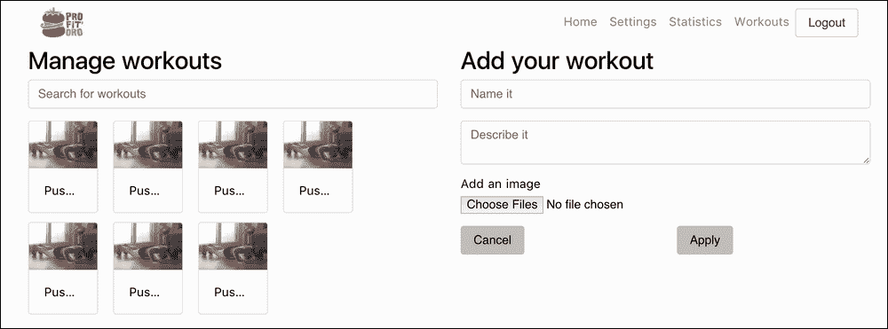
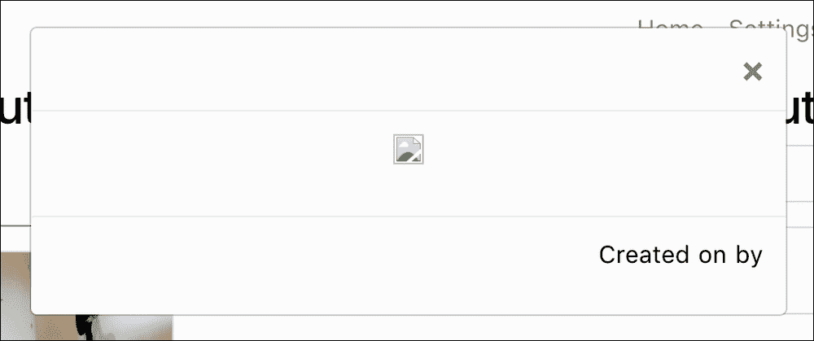
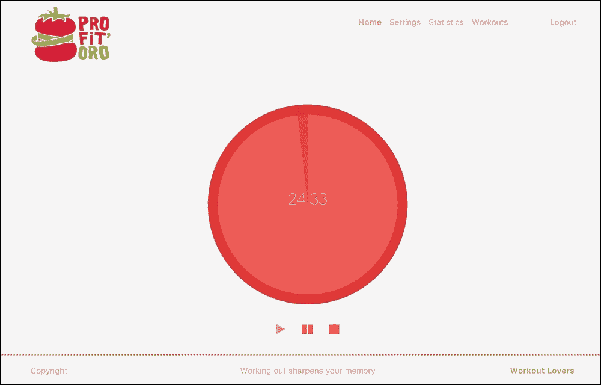

# 第 8 章。让我们合作——使用 Firebase 数据存储和 Vue.js 添加新的训练

在上一章中，我们学习了如何使用`vue-router`和`Nuxt.js`向 Vue 应用程序添加一些基本导航。我们重新设计了 ProFitOro 应用程序，将其转换为基于 Nuxt 的应用程序。现在我们的应用程序可以正常工作了，它有一个身份验证机制，并且可以导航。然而，它仍然缺少最重要的功能之一——锻炼。在本章中，我们将实现“训练管理”页面。您还记得[第 2 章](02.html#MSDG2-449ee41b57ea4c048225480b41c8dbe3 "Chapter 2. Under the Hood – Tutorial Explained")、*引擎盖下的要求吗？教程解释*？

此页面应允许用户查看数据库中的现有训练，选择或取消选择它们以在 Pomodoro 休息期间显示，对它们进行评分，甚至添加新的训练。我们不打算实现所有这些特性。但是，我们将为您实现足够多的资源，以继续此应用程序并圆满完成其实现！因此，在本章中，我们将做以下工作：

*   为“训练管理”页面定义一个响应性布局，该页面由两个基本部分组成——所有训练的可搜索列表以及向列表中添加新训练的可能性
*   使用 Firebase 数据库和数据存储机制存储新训练，以存储训练图像
*   使用引导模式显示每个单独的训练
*   使用快速响应的布局和固定的底部类，使我们的页脚更加美观

# 使用引导类创建布局

在我们开始为我们的训练页面实施布局之前，让我提醒您模型是什么样子的：


这就是我们最初在模型中定义事物的方式

我们将做一些稍微不同的事情——类似于我们在设置页面中所做的事情。让我们创建将堆叠在移动设备上的两列布局。因此，这个模型对于移动屏幕是有效的，但它将在桌面设备上显示两列。

让我们在`components/workouts`文件夹中添加两个组件—`WorkoutsComponent.vue`和`NewWorkoutComponent.vue`。在这些新组件的模板中添加一些虚拟文本，让我们在`workouts.vue`页面中定义我们的两列布局。您当然记得，为了在小型设备上有堆栈列，在其他设备上有不同大小的列，我们必须使用`col-*-<number>`符号，其中`*`表示设备的大小（`sm`表示小型，`md`表示中型，`lg`表示大型，等等），数字表示列的大小，范围可能在`1`到`12`之间。由于我们希望我们的布局堆叠在小型设备上（这意味着列的大小应该是[T11]），而在中型和大型设备上是两个大小相等的列，因此我提出了以下布局定义：[T12]：

```js
// pages/workouts.vue
<template>
  <div class="container">
    <header-component></header-component>
    <div class="row justify-content-center">
      <div class="col-sm-12 col-md-6 col-lg-6">
        <workouts-component></workouts-component>
      </div>
      <div class="col-sm-12 col-md-6 col-lg-6">
        <new-workout-component></new-workout-component>
      </div>
    </div>
    <footer-component></footer-component>
  </div>
</template>
```

不要忘记将`WorkoutsComponent.vue`和`NewWorkoutComponent.vue`组件导入`workouts.vue`页面：

```js
// pages/workouts.vue
<script>
  //...
  import { NewWorkoutComponent, WorkoutComponent, WorkoutsComponent } from '~/components/workouts'
  export default {
    components: {
    /...
      NewWorkoutComponent,
      WorkoutsComponent
    }
  }
</script>
```

现在我们有了两列响应式布局：


“训练管理”页面的双栏响应式布局

在`chapter8/1/profitoro` 文件夹中检查此实现的代码。特别要注意`components/workouts`文件夹的内容和`workouts.vue`页面。

# 使页脚美观

你不厌倦这个硬编码的单词“**页脚**”总是躺在我们的内容下面吗？


丑陋的飞行硬编码页脚总是粘在我们的内容

让我们用它做点什么！如果您查看我们的模型，我们有三列：

*   版权信息一栏
*   另一个是今天的事实
*   最后是作者信息

你已经知道该怎么做了，对吧？同样，我们希望这些列在中型和大型设备上均匀分布，并在移动设备上堆叠。因此，我们的代码如下所示：

```js
// components/common/FooterComponent.vue
<template>
  <div class="footer">
    <div class="container row">
      <div class="copyright col-lg-4 col-md-4 col-sm-12">Copyright</div>
      <div class="fact col-lg-4 col-md-4 col-sm-12">Working out sharpens your memory</div>
      <div class="author col-lg-4 col-md-4 col-sm-12"><span class="bold">Workout Lovers</span></div>
    </div>
  </div>
</template>
```

让我们暂时保留当天事实部分的硬编码。嗯，现在我们的页脚看起来好一点了。至少不仅仅是“页脚”这个词：


我们的页脚不再只是单词页脚，它仍然粘在主要内容上

但是，它仍然停留在主要内容上，这不是很好。如果我们的页脚固定在视口的底部，那就太好了。这是一个常见的问题，你会在互联网上找到很多关于这个问题并提供解决方案的文章：[https://stackoverflow.com/questions/18915550/fix-footer-to-bottom-of-page](https://stackoverflow.com/questions/18915550/fix-footer-to-bottom-of-page) 。幸运的是，我们使用的是 Bootstrap，它附带了一系列用于 Stick top、fixedbottom 等的实用程序类。

### 提示

为了使用引导修复页脚，只需将此类添加到其中：`fixed-bottom`

将此类添加到页脚后，您将看到它是如何粘在视口底部的。尝试调整视口大小，上下移动页面底部，您将看到页脚沿着底部移动。

检查`chapter8/2/profitoro`文件夹中此部分的代码。唯一的变化是在`HeaderComponent.vue`组件中，该组件位于`components/common`文件夹中。

# 使用 Firebase 实时数据库存储新训练

在开始本节之前，请检查`chapter8/3/profitoro`文件夹中的代码。`Workouts`和`NewWorkout`组件都用标记填充。

### 提示

别忘了跑`npm install`和`npm run dev`！

它还不起作用，但它显示了一些东西：



包含一些内容的训练管理页面

在本节中，我们将向 Firebase 数据库中的训练资源添加训练对象。之后，我们终于可以学习如何使用 Firebase 数据存储机制存储图像。

首先，让我们添加Firebase 绑定，就像我们为统计和配置对象所做的那样。打开`action.js`文件，找到`bindFirebaseReferences`方法。在这里，我们应该为`workouts`资源添加绑定。因此，此方法现在包含三个绑定：

```js
// state/actions.js
bindFirebaseReferences: firebaseAction(({state, commit, dispatch}, user) => {
  let db = firebaseApp.database()
  let configRef = db.ref(`/configuration/${user.uid}`)
  let statisticsRef = db.ref(`/statistics/${user.uid}`)
  let workoutsRef = db.ref('/workouts')

  dispatch('bindFirebaseReference', {reference: configRef, toBind: 'config'}).then(() => {
    commit('setConfigRef', configRef)
  })
  dispatch('bindFirebaseReference', {reference: statisticsRef, toBind: 'statistics'}).then(() => {
    commit('setStatisticsRef', statisticsRef)
  })
  dispatch('bindFirebaseReference', {reference: workoutsRef, toBind: 'workouts'}).then(() => {
 commit('setWorkoutsRef', workoutsRef)
 })
})
```

我们还应该在卸载应用程序后解除绑定：

```js
//state/actions.js
unbindFirebaseReferences: firebaseAction(({unbindFirebaseRef, commit}) => {
    commit('setConfigRef', null)
    commit('setStatisticsRef', null)
    commit('setWorkoutsRef', null)
    try {
      unbindFirebaseRef('config')
      unbindFirebaseRef('statistics')
      unbindFirebaseRef('workouts')
    } catch (error) {
      return
    }
  })
```

我们还要为我们的状态添加`workoutsRef`和`workouts`属性。最后但并非最不重要的一点是，别忘了实现名为`setWorkoutsRef`的突变：

```js
// state/mutations.js
setWorkoutsRef (state, value) {
  state.workoutsRef = value
}
```

现在，将和`workoutsRef`存储在我们的状态中，我们可以执行将用新创建的训练更新它的操作。在此之后，我们将能够在`NewWorkout`组件中使用此操作，并填充我们的训练数据库。

查看Firebase 关于读写实时数据库的文档：[https://firebase.google.com/docs/database/web/read-and-write](https://firebase.google.com/docs/database/web/read-and-write) 。向下滚动，直到找到“*新建帖子*”示例：


Firebase 数据库文档中的新后期创建示例

你不觉得这个案子和我们的非常相似吗？用户添加的每项训练都有其名称、描述和一张图片（甚至可能不止一张图片）。训练也属于创建它们的用户。所以，也许我们可以做一些类似的事情。为`user-workouts`提供包含每个用户训练的资源也很有用。如果我们决定实现每个用户删除其训练的可能性，它可能会派上用场。在复制此代码之前，让我们先商定一下训练对象的数据结构。它应该包含什么？由于它来自`NewWorkout`组件，因此它已经带来了训练的名称、描述和图像 URL。我们是否应该在行动中增加其他内容？也许，我们应该添加添加它的用户的名称和 UID、创建它的日期以及 rating 属性。现在这应该足够了。因此，我们的训练数据结构如下所示：

```js
{
  name: 'string',
  description: 'string',
  pictures: ['string'],
  username: 'string',
  uid: 'string',
  rate: 'number',
  date: 'timestamp'
}
```

`name`、`description`、`username`和`uid`属性都是字符串。`pictures`属性应该是一个 URL 字符串数组，`rating`应该是一个数字，让我们以时间戳的形式存储`date`属性。

### 注

很好，我们同时实现了前端和后端部分，因此我们在数据模式上达成了一致。如果您曾经在一个拥有前端和后端开发人员的团队中工作，不要忘记在任何实现之前就数据模式达成一致！

因此，我们知道描述、名称和图片 URL 应该填充在`NewWorkout`组件中。因此，让我们填充`action`方法中的所有其他内容。最后，它看起来与 Firebase 示例非常相似：

```js
// store/actions.js
createNewWorkout ({commit, state}, workout) {
  if (!workout) {
    return
  }

  workout.username = state.user.displayName
 workout.uid = state.user.uid
 workout.date = Date.now()
 workout.rate = 0
  // Get a key for a new Workout.
  let newWorkoutKey = state.workoutsRef.push().key

  // Write the new post's data simultaneously in the posts list and the user's post list.
  let updates = {}
  updates['/workouts/' + newWorkoutKey] = workout
  updates['/user-workouts/' + state.user.uid + '/' + newWorkoutKey] = workout

  return firebaseApp.database().ref().update(updates)
},
```

再次注意，我们正在引入一个名为`user-workouts`的新资源。我们可以像处理统计数据和配置用户数据一样，将此资源绑定到我们的状态。如果我们决定实现用户资源的删除，它可能会变得很方便。

现在，让我们转到我们的`NewWorkout`组件。在这里，我们只需要将一些 Vue 模型绑定到相应的输入，并将单击事件绑定到**提交**按钮。**应用**按钮上的点击事件应该绑定到`createNewWorkout`操作，并与相应的数据一起调用它。暂时不要担心`pictures`，我们将在下一节中处理它们。

此时，我们可以将`Workouts`组件中硬编码的训练数组替换为状态训练对象：

```js
//Components/Workouts.vue
// ...
<script>
  import {mapState} from 'vuex'
  export default {
    computed: {
 ...mapState(['workouts'])
 }
  }
</script>
//...
```

检查您的新创建的训练如何立即出现在训练部分！

检查`chapter8/4/profitoro`文件夹中本节的最终代码。注意存储文件（`actions.js`、`mutations.js`）以及`components/workouts`文件夹中的`NewWorkoutComponent`和`WorkoutsComponent`组件。

# 使用 Firebase 数据存储器存储图像

Firebase 云存储允许您上传和检索不同的内容（文件、视频、图像等）。Firebase 以一种非常类似的方式提供了一种访问和管理数据库的方式，您可以在其中访问和管理存储桶。您可以上载 blob、Base64 中的字符串、文件对象等。

首先，您应该告诉您的 Firebase 应用程序您将使用 Google 云存储。因此，您需要向应用程序配置对象添加一个`storageBucket`属性。在 Google Firebase 控制台上检查应用程序的设置，并将`storageBucket`引用复制到`firebase/index.js`文件：

```js
// Initialize Firebase
import firebase from 'firebase'
//...
let config = {
  apiKey: 'YOUR_API_KEY',
  databaseURL: 'https://profitoro-ad0f0.firebaseio.com',
  authDomain: 'profitoro-ad0f0.firebaseapp.com',
  storageBucket: 'gs://profitoro-ad0f0.appspot.com'
}
//...
```

现在，您的 firebase 应用程序知道要使用哪个存储桶。让我们打开 Firebase 控制台的“数据存储”选项卡，并为我们的训练图像添加一个文件夹。让我们称之为……锻炼：


在 Firebase 数据存储选项卡中创建名为“训练”的文件夹

现在一切都准备就绪，可以开始使用我们的云存储桶了。

首先，我们必须获取对“训练”文件夹的引用，以便对其进行修改。查看 FirebaseAPI 文档中关于桶引用创建的说明：[https://firebase.google.com/docs/storage/web/create-reference](https://firebase.google.com/docs/storage/web/create-reference) 。在我们的例子中，引用将如下所示：

```js
firebaseApp.storage().ref().child('workouts')
```

我们应该在哪里使用它？不知何故，在存储训练之前，我们应该存储图片文件，获取它们的云 URL，并将这些 URL 分配给训练的`pictures`属性。因此，我们的计划如下：

*   创建上载文件并返回这些文件的下载 URL 的方法
*   在调度`createNewWorkout`操作之前，使用此方法将 URL 分配给训练对象的图片属性

让我们创建一个方法，将上载一个文件并返回其`downloadURL`。查看 Firebase 文档，了解如何使用其 API 上载文件：[https://firebase.google.com/docs/storage/web/upload-files](https://firebase.google.com/docs/storage/web/upload-files) 。看一看从 Blob 或文件上传的**部分。您将看到，我们应该在云存储引用上使用方法“【T1]”，为其提供一个文件对象。这将是通过快照对象解决的承诺：**

```js
var file = ... // use the Blob or File API
ref.put(file).then(function(snapshot) {
  console.log('Uploaded a blob or file!');
});
```

这个`snapshot`物体是什么？这是存储在云上的文件的表示。它包含了大量的信息，但对我们来说最重要的是它的`downloadURL`属性。因此，我们的承诺看起来与示例承诺非常相似，但它将返回`snapshot.downloadURL`。因此，打开`actions.js`文件，创建一个名为`uploadImage`的新方法。此方法将接收一个文件对象，在我们的`workout`云文件夹引用上创建一个子引用，使用该文件的名称，然后`put`创建一个文件并使用`downloadURL`解析。所以，它看起来是这样的：

```js
function _uploadImage (file) {
  let ref = firebaseApp.storage().ref().child('workouts')
  return ref.child(file.name).put(file).then(snapshot => {
    return snapshot.downloadURL
  })
}
```

你不觉得这里有点小问题吗？如果两个不同的用户以相同的名称提交不同的图片，会发生什么？然后这些图片将相互覆盖。作为一个小练习，想一个方法来避免这个问题。

### 提示

提示：看看这个 npm 包：

[https://www.npmjs.com/package/uuid](https://www.npmjs.com/package/uuid)

因此，我们承诺上传文件并返回其`downloadURL`。然而，这还不是我们的最后行动。我们最后的`action`方法应该上传一个*文件数组*，因为这是我们从多个文件输入中得到的——一个文件对象数组。因此，我们的最终承诺将只返回所有承诺的结果，它看起来简单如下：

```js
uploadImages ({state}, files) {
  return Promise.all(files.map(_uploadImage))
}
```

在调用`createNewWorkout`操作之前，此操作现在可以在`NewWorkout`组件中使用。

首先，我们需要将[T0]属性绑定到文件输入元素。显而易见的选择是使用`v-model`指令将属性`pictures`绑定到输入：

```js
<input v-model="pictures" type="file" multiple class="form-control-file" id="imageFile">
```

这是不是很明显？`v-model`指令确定*双向数据绑定*，但我们如何为其设置数据？文件输入的数据为`FileObject`或`FileList`。我们将如何设置它？似乎对该元素应用双向数据绑定没有意义。

### 注

实际上，您不能将反应数据绑定到文件输入，但可以在更改事件中设置数据：

T0https://forum.vuejs.org/t/vuejs2-file-input/633/2 T1

因此，我们必须倾听`change`事件，并设置每次更改的数据。让我们将此事件绑定到`filesChange`方法：

```js
// NewWorkoutComponent.vue
<input @change="filesChange($event.target.files)" type="file" multiple class="form-control-file" id="imageFile">
```

现在让我们创建这个方法，并将`this.pictures`分配给我们接收的参数。好的，不是*只是分配*，因为我们收到一个`FileList`对象，它不是一个你可以迭代的数组。因此，我们需要将其转换为一个简单的`File`对象数组。

### 提示

我们可以使用 ES6 spread 运算符进行此操作：

`filesArray = [...fileListObject]`

因此，我们的`filesChange`方法如下：

```js
  // NewWorkoutComponent.vue
  export default {
    methods: {
      //...
      filesChange (files) {
 this.pictures = [...files]
 }
    //...
    }
  }
```

现在我们终于可以更新我们的`onCreateNew`方法了。首先，它应该发送`uploadImages`动作，在承诺解析时发送`createNewWorkout`动作，将承诺的结果分配给`pictures`数组。现在，此方法将如下所示：

```js
// NewWorkoutComponent.vue
onCreateNew (ev) {
  ev.preventDefault()
  ev.stopPropagation()
  this.uploadImages(this.pictures).then(picUrls => {
    this.createNewWorkout({
      name: this.name,
      description: this.description,
      pictures: picUrls
    })
    this.reset()
  })
}
```

别忘了导入`uploadImages`动作。另外，创建一个`reset`方法，将所有数据重置为初始状态。

使用图片创建一些训练，并享受结果！

## 让我们搜索一下！

因此，现在我们可以创建训练，并看到它们显示在训练列表中。然而，我们有一个很好的搜索输入，它什么也没做：（.然而，我们使用 Vue.js，所以实现这个搜索非常容易。我们只需要创建一个`searchTerm`数据属性，并将其绑定到搜索输入，然后通过这个`searchTerm`过滤训练数组。因此，我将添加计算属性，让我们调用它`workoutsToDisplay`，此属性将通过其名称、说明和用户名属性表示已过滤的训练属性（我们从 Vuex 商店的状态导入的属性）。因此，它将为我们提供按所有这些术语进行搜索的可能性：

```js
// WorkoutsComponent.vue
<script>
  //...
  export default {
    //...
    computed: {
      ...mapState(['workouts']),
      workoutsToDisplay () {
 return this.workouts.filter(workout => {
 let name = workout.name.toLowerCase()
 let description = workout.description.toLowerCase()
 let username = workout.username.toLowerCase()
 let term = this.searchTerm.toLowerCase()
 return name.indexOf(term) >= 0 || description.indexOf(term) >= 0 || username.indexOf(term) >= 0
 })
 }
    }
  //...
  }
</script>
```

不要忘记将`searchTerm`属性添加到组件的数据中，并将其绑定到搜索输入元素：

```js
<template>
  <div>
    <div class="form-group">
      <input v-model="searchTerm" class="input" type="search" placeholder="Search for workouts">
    </div>
  </div>
</template>
<script>
  //...
  export default {
    data () {
      return {
        name: '',
        username: '',
        datecreated: '',
        description: '',
        pictures: [],
        rate: 0,
        searchTerm: ''
      }
    }
  }
</script>
```

当然，我们现在应该迭代`workoutsToDisplay`数组，而不是迭代“训练”数组来显示训练卡。所以只需稍微编辑卡片`div`的`v-for`指令：

```js
v-for="workout in workoutsToDisplay"
```

打开页面并尝试搜索！如果我按用户名搜索，则仅显示该用户创建的训练：


这是有道理的，因为到目前为止，我创建了所有现有的训练

如果我按训练名称搜索，比如俯卧撑，列表中只会显示此训练：


按训练名称搜索

我们快完了！我们现在要做的唯一一件事是显示从训练列表中随机选择的训练，而不是在 Pomodoro 休息期间硬编码的数据。试着在`pomodoro.vue`页面中自己做。

您现在可以创建新的训练，它们将立即出现在“训练”部分。他们也出现在我们的主页在波莫多罗休息。

干得好！在`chapter8/5/profitoro`文件夹中检查此部件的代码。特别注意`store/actions.js`文件中的新动作以及`components/workouts`文件夹中的`Workouts`和`NewWorkout`组件。检查如何在`pomodoro.vue`页面中选择和显示随机训练。

# 使用引导模式显示每次训练

现在我们可以在页面上看到所有的现有训练，这非常棒。然而，我们的用户确实希望详细了解每项训练——查看训练的描述、评分、谁创建的以及何时创建的，等等。将所有这些信息放在微小的`card`元素中是不可想象的，因此我们需要有一种方法来放大每个元素，以便能够看到其详细信息。引导模式是提供此功能的一个很好的工具。检查有关模态 API 的引导文档：[https://v4-alpha.getbootstrap.com/components/modal/](https://v4-alpha.getbootstrap.com/components/modal/) 。

### 注

请注意，在撰写本文时，Bootstrap4 正处于 alpha 阶段，这就是为什么在某个时候此链接可能不再有效的原因，所以只需在官方 Bootstrap 网站上搜索相关信息即可。

基本上，我们需要有一个触发模态和模态标记本身的元素。在我们的例子中，每个小锻炼卡都应该用作模式触发器；`WorkoutComponent`将是我们的模态组件。因此，只需将`data-toggle`和`data-target`属性添加到“训练”组件中的`card`元素：

```js
// WorkoutsComponent.vue
<div class="card-columns">
  <div data-toggle="modal" data-target="#workoutModal" v-for="workout in workouts" class="card">
    
    <div class="card-block">
      <p class="card-text">{{ workout.name }}</p>
    </div>
  </div>
</div>
```

现在让我们来研究`WorkoutComponent`组件。假设它将接收以下属性：

*   名称
*   描述
*   用户名
*   查看或修改所创建的每个选定项目的属性
*   速度
*   图片

因此，我们可以为模式构建一个非常简单的标记，如下所示：

```js
<template>
  <div class="modal fade" id="workoutModal" tabindex="-1" role="dialog" aria-hidden="true">
    <div class="modal-dialog" role="document">
      <div class="modal-content">
        <div class="modal-header">
          <h5 class="modal-title">{{ name }}</h5>
          <button type="button" class="close" data-dismiss="modal" aria-label="Close">
            <span aria-hidden="true">&times;</span>
          </button>
        </div>
        <div class="modal-body">
          <div class="text-center">
            
          </div>
          <p>{{ description }}</p>
        </div>
        <div class="modal-footer">
          <p>Created on {{ datecreated }} by {{ username }}</p>
        </div>
      </div>
    </div>
  </div>
</template>
```

请记住，此模式需要具有完全相同的 ID 属性，该属性是切换元素的目标。

不要忘记在`props`属性下指定所需的属性：

```js
// WorkoutComponent.vue
<script>
  export default {
    props: ['name', 'description', 'username', 'datecreated', 'rate', 'pictures']
  }
</script>
```

现在，可以将此组件导入“训练”组件并在其中使用：

```js
// WorkoutsComponent.vue
<template>
  <div>
    <...>
    <div class="card-columns">
      <...>
    </div>
    <workout-component
 :name="name"
 :description="description"
 :username="username"
 :datecreated="datecreated"
 :pictures="pictures"
 :rate="rate">
 </workout-component>
  </div>
</template>
```

如果现在单击一些小卡片，空模式将打开：



模态工程！但它是空的

我们肯定仍然应该做一些事情，因此所选元素的数据被传播到组件的数据中。让我们添加一个方法来完成这项工作，并将其绑定到`card`元素的`click`事件：

```js
// WorkoutsComponent.vue
<div data-toggle="modal" data-target="#workoutModal" v-for="workout in workouts" class="card" @click="onChosenWorkout(workout)">
```

该方法仅将训练数据复制到相应组件的数据：

```js
// WorkoutsComponent.vue – methods section
onChosenWorkout (workout) {
  this.name = workout.name
  this.description = workout.description
  this.username = workout.username
  this.datecreated = workout.date
  this.rate = workout.rate
  this.pictures = workout.pictures
}
```

现在看起来好多了！


数据绑定刚刚好用！

看起来不错，所有的数据都在这里，但仍然不完美。想一想我们该如何改进它。

## 运动

使模式页脚上显示的日期可读。这样做时，页脚显示如下：


具有人类可读数据的训练模式页脚

尝试使用现有的工具，而不是重新发明轮子。

### 提示

想想moment.js 库：

T0https://momentjs.com/ T1

在`chapter8/6/profitoro`文件夹中检查您自己的和最终代码，直到现在。注意`components/workout`文件夹中的`Workouts`和`Workout`组件。

# 是时候运用一些风格了

我们的应用程序现在已经完全可用；它可以马上使用。当然，它仍然不是完美的。它缺乏验证和一些功能，一些需求还没有实现，最重要的是…它缺乏美观！它是灰色的，没有风格…我们是人类，我们喜欢美丽的事物，不是吗？每个人都以自己的方式实现风格。我强烈建议，如果你想使用这个应用程序，请找到你自己的风格和主题，并请实现它和我分享。我很想看。

至于我，因为我不是设计师，我问我的好朋友凡妮莎（[https://www.behance.net/MeegsyWeegsy](https://www.behance.net/MeegsyWeegsy) 为 ProFitOro 应用程序创建一个漂亮的设计。她做得很好！因为我忙于写这本书，我没有时间去实现瓦内萨的设计，所以我问我的好朋友菲利佩（[https://github.com/fil090302](https://github.com/fil090302) ），来帮我。菲利佩也做得很好！凡妮莎实现了这一切。我们已经使用了`scss`，所以您一定很熟悉它，因为我们已经在这个应用程序中使用它作为预处理器。

可以重用现有样式覆盖某些变量，以便创建自己的主题。请检查`chapter8/7/profitoro`文件夹中的最终代码。所有样式都位于`img/styles`目录中。其结构如下：


目录结构

至于的最终外观，以下是它的外观。

这是 Pomodoro 计时器的主页：



包含 Pomodoro 计时器的主页面

以下是设置页面的外观：


设置页面的外观

最后，这里是训练页面的外观：


“训练”页面的外观和感觉

您仍然需要实现统计页面–现在，它只显示完成的 Pomodoros 的总量：


统计页面未完全完成，仅显示已完成的 Pomodoros 的总量

还有一些工作要做，但你不同意我们到目前为止做得很好吗？我们不仅有一个功能齐全的可配置 Pomodoro 定时器，我们还可以在工作日利用它进行小运动。那有多好？

# 总结

在本章中，我们最终实现了训练管理页面。现在，我们可以查看数据库中存储的所有训练，并创建自己的训练。我们已经学习了如何使用 Google Firebase 数据存储系统和 API 来存储静态文件，并且我们能够在 Firebase 实时数据库中存储新创建的训练。我们还学习了如何使用引导模式，并使用它在一个漂亮的模式弹出窗口中显示每个训练。

在下一章中，我们将做每个软件实现过程中最重要的工作——我们将测试到目前为止我们所做的工作。我们将使用笑话（[https://facebook.github.io/jest/](https://facebook.github.io/jest/) 测试我们的应用程序。之后，我们将最终部署应用程序并定义未来的工作。你准备好测试你的工作了吗？那就翻开这一页！