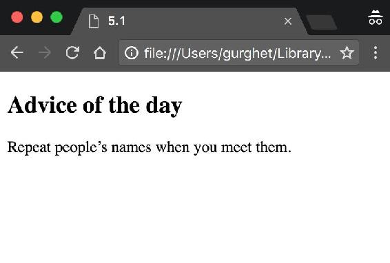
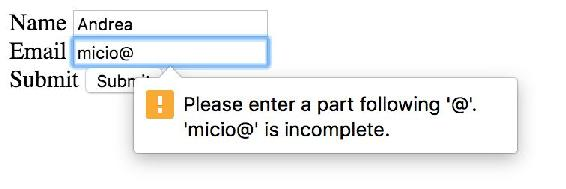
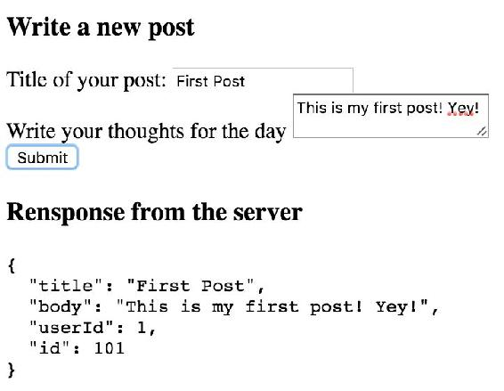
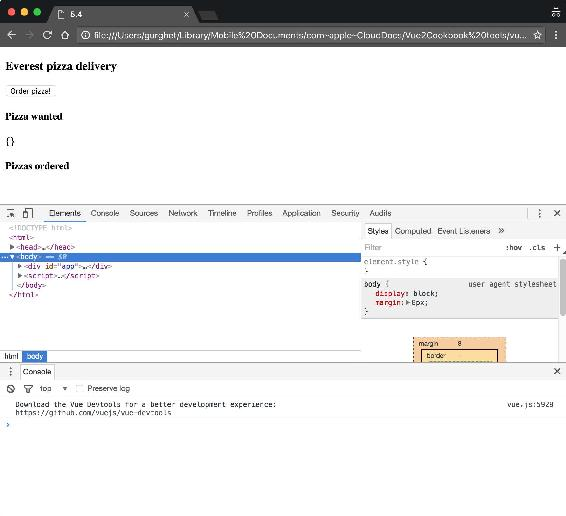
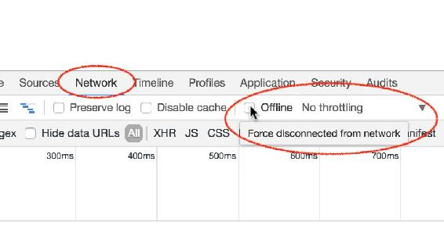
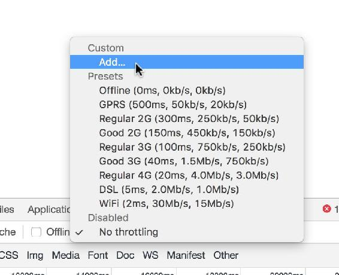
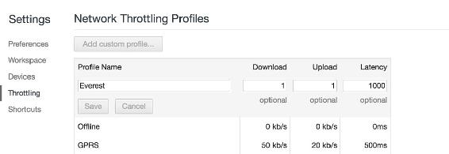
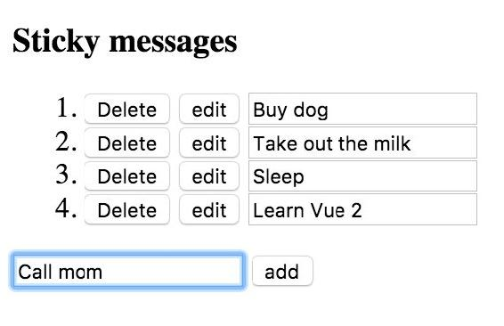
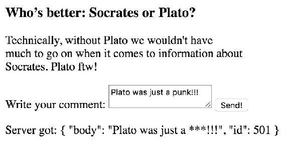

# 五、Vue 与互联网通信

本章将介绍以下配方:

*   用 Axios 发送基本的 AJAX 请求
*   发送之前验证用户数据
*   创建表单并将数据发送到服务器
*   在请求过程中从错误中恢复
*   创建 REST 客户机(和服务器！)
*   实现无限滚动
*   在发出请求之前处理请求
*   防止 XSS 攻击你的应用


# 介绍

Web 应用很少单独工作。它们之所以有趣，实际上是因为它们让我们能够以创新的方式与世界交流，而这在几年前还是不存在的。

Vue 本身不包含任何机制或库来发出 AJAX 请求或打开 web 套接字。因此，在本章中，我们将探讨 Vue 如何与内置机制和外部库交互，以连接到外部服务。

您将从借助外部库发出基本的 AJAX 请求开始。然后，您将探索在表单中发送和获取数据的一些常见模式。最后，还有一些关于现实世界应用以及如何构建 RESTful 客户端的方法。


# 用 Axios 发送基本的 AJAX 请求

**Axios** 是 Vue 进行 HTTP 请求的推荐库。这是一个非常简单的库，但是它有一些内置的特性可以帮助你执行一些常见的操作。它实现了用 HTTP 动词发出请求的 REST 模式，还可以在函数调用中处理并发性(同时生成多个请求)。你可以在 https://github.com/mzabriskie/axios 的[](https://github.com/mzabriskie/axios)找到更多信息。


# 做好准备

对于这个食谱，你不需要任何关于 Vue 的特别知识。我们会使用 Axios，它本身使用 **JavaScript 承诺**。如果你从未听说过承诺，你可以在[https://developers . Google . com/web/fundamentals/getting-started/primers/promises](https://developers.google.com/web/fundamentals/getting-started/primers/promises)有一本入门书。


# 怎么做...

您将构建一个简单的应用，在您每次访问网页时为您提供明智的建议。

您需要做的第一件事是在您的应用中安装 Axios。如果您正在使用 npm，您可以发出以下命令:

```js
    npm install axios

```

如果您正在处理单个页面，您可以在从 CDN 导入以下文件。

Unfortunately, the advise slip service we will use will not work with JSFiddle because while the service runs on HTTP, JSFiddle is on HTTPS and your browser will most likely complain. You can run this recipe on a local HTML file.

我们的 HTML 看起来像这样:

```js
<div id="app"> 
  <h2>Advice of the day</h2> 
  <p>{{advice}}</p> 
</div>

```

我们的 Vue 实例如下:

```js
new Vue({ 
  el: '#app', 
  data: { 
    advice: 'loading...' 
  }, 
  created () { 
    axios.get('http://api.adviceslip.com/advice') 
      .then(response => { 
        this.advice = response.data.slip.advice 
      }) 
      .catch(error => { 
        this.advice = 'There was an error: ' + error.message 
      }) 
  } 
})

```

打开你的应用，获得一条令人耳目一新的明智建议:



# 它是如何工作的...

当我们的应用启动时，由创建的钩子被占用，并将使用 Axios 运行代码。第一行执行对 API 端点的 GET 请求:

```js
axios.get('http://api.adviceslip.com/advice')

```

这会回报一个承诺。如果承诺成功解析，我们可以对任何承诺使用`then`方法来对结果进行操作:

```js
.then(response => { 
  this.advice = response.data.slip.advice 
})

```

响应对象将包含一些关于请求结果的数据。一个可能的响应对象如下:

```js
{ 
  "data": { 
    "slip": { 
      "advice": "Repeat people's name when you meet them.", 
      "slip_id": "132" 
    } 
  }, 
  "status": 200, 
  "statusText": "OK", 
  "headers": { 
    "content-type": "text/html; charset=UTF-8", 
    "cache-control": "max-age=0, no-cache" 
  }, 
  "config": { 
    "transformRequest": {}, 
    "transformResponse": {}, 
    "timeout": 0, 
    "xsrfCookieName": "XSRF-TOKEN", 
    "xsrfHeaderName": "X-XSRF-TOKEN", 
    "maxContentLength": -1, 
    "headers": { 
      "Accept": "application/json, text/plain, */*" 
    }, 
    "method": "get", 
    "url": "http://api.adviceslip.com/advice" 
  }, 
  "request": {} 
}

```

我们导航到想要与之交互的属性；在我们的例子中，我们需要的是字符串`response.data.slip.advice`。我们在实例状态中复制了变量 advice 中的字符串。

最后一部分是当我们的请求或第一个分支中的代码出错时:

```js
.catch(error => { 
  this.advice = 'There was an error: ' + error.message 
})

```

我们将在请求过程中从错误中恢复*中更深入地探讨错误处理。现在，让我们手动触发一个错误，看看会发生什么。*

触发错误的最便宜的方法是在 JSFiddle 上运行应用。由于浏览器在一个安全的连接上检测到 JSFiddle，而我们的 API 在 HTTP 上(这是不安全的)，现代的浏览器会抱怨，会阻塞连接。您应该会看到以下文本:

```js
There was an error: Network Error

```

这只是你可以尝试的许多可能的错误之一。假设您将 GET 端点编辑到某个不存在的页面:

```js
axios.get('http://api.adviceslip.com/non-existent-page')

```

在这种情况下，您将得到一个 404 错误:

```js
There was an error: Request failed with status code 404

```

有趣的是，即使请求进行得很顺利，但是在第一个分支中有一个错误，您也会在错误分支中结束。

将`then`分支改为:

```js
.then(response => { 
  this.advice = undefined.hello 
})

```

众所周知，JavaScript 无法读取未定义对象的“hello”属性:

```js
There was an error: Cannot read property 'hello' of undefined

```

正如我告诉你的那样。


# 发送之前验证用户数据

一般来说，用户讨厌表单。虽然我们无法改变这一点，但我们可以通过提供如何填写的相关说明来减少他们的挫折感。在这个菜谱中，我们将创建一个表单，我们将利用 HTML 标准为用户提供一个关于如何完成它的很好的指导。


# 做好准备

这个食谱不需要以前的知识来完成。虽然我们将构建一个表单(*用 Axios* recipe 发送基本的 AJAX 请求),但我们将假装 AJAX 调用并专注于验证。


# 怎么做...

我们将构建一个非常简单的表单:一个用户名字段和一个用户电子邮件字段，外加一个提交信息的按钮。

在此 HTML 中键入:

```js
<div id="app"> 
  <form @submit.prevent="vueSubmit"> 
    <div> 
      <label>Name</label> 
      <input type="text" required> 
    </div> 
    <div> 
      <label>Email</label> 
      <input type="email" required> 
    </div> 
    <div> 
      <label>Submit</label> 
      <button type="submit">Submit</button> 
    </div> 
  </form> 
</div>

```

Vue 实例很简单，如下所示:

```js
new Vue({ 
  el: '#app', 
  methods: { 
    vueSubmit() { 
      console.info('fake AJAX request') 
    } 
  } 
})

```

运行此应用并尝试提交带有空字段或错误电子邮件的表单。您应该会看到来自浏览器本身的帮助:


然后，如果您尝试输入无效的电子邮件地址，您将看到以下内容:



# 它是如何工作的...

我们使用一个本地 HTML5 验证 API，它在内部使用模式匹配来检查我们输入的内容是否符合某些规则。

考虑下面一行中的属性 required :

```js
<input type="text" required>

```

这确保了当我们提交表单时，字段被实际填充，而在另一个输入元素中使用`type="email"`确保了内容类似于电子邮件格式。

这个 API 非常丰富，你可以在[https://developer . Mozilla . org/en-US/docs/Web/Guide/HTML/Forms/Data _ form _ validation](https://developer.mozilla.org/en-US/docs/Web/Guide/HTML/Forms/Data_form_validation)了解更多。

很多时候，问题是为了利用这个 API，我们需要触发本地验证机制。这意味着我们不允许阻止提交按钮的默认行为:

```js
<button type="submit" @click.prevent="vueSubmit">Submit</button>

```

这不会触发本机验证，表单将始终被提交。另一方面，如果我们做到以下几点:

```js
<button type="submit" @click="vueSubmit">Submit</button>

```

表单将被验证，但是由于我们不阻止提交按钮的默认行为，表单将被发送到另一个页面，这将破坏单页应用的体验。

诀窍是在表单级别拦截提交:

```js
<form @submit.prevent="vueSubmit">

```

这样，我们可以拥有表单原生验证和所有我们真正喜欢的现代浏览体验。


# 创建表单并将数据发送到服务器

HTML 表单是与用户交互的标准方式。你可以收集他们的数据在网站内注册，让他们登录，甚至进行更高级的互动。在这个菜谱中，您将使用 Vue 构建您的第一个表单。


# 做好准备

这个方法非常简单，但是它假设您已经了解 AJAX，并且希望将您的知识应用到 Vue 上。


# 怎么做...

假设我们有一个博客，我们想写一篇新文章。为此，我们需要一个表单。下面是你如何布局 HTML:

```js
<div id="app"> 
  <h3>Write a new post</h3> 
  <form> 
    <div> 
      <label>Title of your post:</label> 
      <input type="text" v-model="title"> 
    </div> 
    <div> 
      <label>Write your thoughts for the day</label> 
      <textarea v-model="body"></textarea> 
    </div> 
    <div> 
      <button @click.prevent="submit">Submit</button> 
    </div> 
  </form> 
</div>

```

我们有一个标题框，一个新帖子的正文框，还有一个发送帖子的按钮。

在我们的 Vue 实例中，这三样东西以及一个用户 ID 将是应用状态的一部分:

```js
new Vue({ 
  el: '#app', 
  data: { 
    userId: 1, 
    title: '', 
    body: '' 
  } 
})

```

此时，我们只需要添加一个方法，当我们单击提交按钮时，该方法将数据发送到我们的服务器。由于我们没有服务器，我们将使用 **Typicode 提供的一个非常有用的服务。**基本上就是一个假的 REST 服务器。我们将发送一个请求，服务器将以现实的方式响应，即使什么也不会发生。

这是我们的方法:

```js
methods: { 
  submit () { 
    const xhr = new XMLHttpRequest() 
    xhr.open('post', 'https://jsonplaceholder.typicode.com/posts') 
    xhr.setRequestHeader('Content-Type',  
                         'application/json;charset=UTF-8') 
    xhr.onreadystatechange = () => { 
    const DONE = 4 
    const CREATED = 201 
    if (xhr.readyState === DONE) { 
      if (xhr.status === CREATED) { 
          this.response = xhr.response 
        } else { 
          this.response = 'Error: ' + xhr.status 
        } 
      } 
    } 
    xhr.send(JSON.stringify({ 
      title: this.title, 
      body: this.body, 
      userId: this.userId 
    })) 
  } 
}

```

为了查看服务器的实际响应，我们将把响应变量添加到我们的状态中:

```js
data: { 
  userId: 1, 
  title: '', 
  body: '', 
 response: '...' 
}

```

在 HTML 中的表单后，添加以下内容:

```js
<h3>Response from the server</h3> 
<pre>{{response}}</pre>

```

当您启动页面时，您应该能够与服务器进行交互。当你写一篇文章时，服务器将回显这篇文章，并用文章 ID 回答:



# 它是如何工作的...

大多数神奇的事情都发生在`submit`方法中。在第一行中，我们创建了一个`XMLHttpRequest`对象，这是一个本地 JavaScript 机制，用于发出 AJAX 请求:

```js
const xhr = new XMLHttpRequest()

```

然后我们使用`open`和`setRequestHeader`方法来配置一个新的连接；我们想发送一个 POST 请求，我们将随它一起发送一些 JSON:

```js
xhr.open('post', 'http://jsonplaceholder.typicode.com/posts') 
xhr.setRequestHeader('Content-Type', 'application/json;charset=UTF-8')

```

由于我们与 RESTful 接口交互，post 方法意味着我们期望我们的请求修改服务器上的数据(特别是创建一个新的 POST)，并且多次发出相同的请求每次都会得到不同的结果(即我们每次都会创建一个新的不同的 post ID)。

这不同于更常见的 GET 请求，GET 请求不会修改服务器上的数据(可能除了日志)，这将总是产生相同的结果(假设服务器上的数据在请求之间不会改变)。

关于 REST 的更多细节，请看一下*创建 REST 客户机(和服务器！)*食谱。

以下几行都是关于响应的:

```js
xhr.onreadystatechange = () => { 
  const DONE = 4 
  const CREATED = 201 
  if (xhr.readyState === DONE) { 
    if (xhr.status === CREATED) { 
      this.response = xhr.response 
    } else { 
      this.response = 'Error: ' + xhr.status 
    } 
  } 
}

```

每当我们的对象发生某种变化时，它就会安装一个处理程序。如果`readyState`被更改为`DONE`,这意味着我们从服务器得到了我们的响应。接下来，我们检查状态代码，它应该是`201`,表示一个新资源(我们的新帖子)已经创建。如果是这种情况，我们将变量放入八字胡中以获得快速反馈。否则，我们将收到的错误消息放在同一个变量中。

在设置了事件处理程序之后，我们需要做的最后一件事是实际发送请求以及我们新发布的数据:

```js
xhr.send(JSON.stringify({ 
  title: this.title, 
  body: this.body, 
  userId: this.userId 
}))

```


# 还有更多...

解决同样问题的另一种方法是使用 Axios 发送 AJAX 请求。如果你需要了解什么是 Axios，看看用 Axios 方法发送基本 AJAX 请求的*。*

`submit`方法的代码将如下所示(记得添加 Axios 作为依赖项):

```js
submit () { 
  axios.post('http://jsonplaceholder.typicode.com/posts', { 
    title: this.title, 
    body: this.body, 
    userId: this.userId 
  }).then(response => { 
    this.response = JSON.stringify(response,null,'  ') 
  }).catch(error => { 
    this.response = 'Error: ' + error.response.status 
  }) 
}

```

这段代码完全等价，但是它比使用原生浏览器对象更有表现力和简洁。


# 在请求过程中从错误中恢复

从计算机的角度来看，对外部服务的请求需要很长时间。用人类的话来说，这就像将一颗卫星发送到木星，然后等待它返回地球。你不能 100%确定旅行将会完成，也不能确定旅行实际需要多少时间。网络是出了名的软弱，最好做好准备，以防我们的请求没有成功完成。


# 做好准备

这个食谱有点复杂，但是，没有使用先进的概念。尽管如此，你还是应该熟悉 Vue 的使用。

我们将使用 Axios 来制作这个食谱。如果您不确定发送基本的 AJAX 请求需要什么，您可以使用 Axios recipe 来完成*。*


# 怎么做...

你将建立一个在珠穆朗玛峰订购比萨饼的网站。该地区的网络连接差是出了名的，所以在放弃我们的披萨之前，我们可能要再试几次。

这就是我们的 HTML 的样子:

```js
<div id="app"> 
  <h3>Everest pizza delivery</h3> 
  <button @click="order"  
          :disabled="inProgress">Order pizza!</button> 
  <span class="spinner" v-show="inProgress"></span> 
  <h4>Pizza wanted</h4> 
  <p>{{requests}}</p> 
  <h4>Pizzas ordered</h4> 
  <span v-for="pizza in responses"> 
    {{pizza.id}}:{{pizza.req}} 
  </span> 
</div>

```

我们有一个下订单的按钮，当订单正在进行时，该按钮将被禁用——一个正在处理的订单列表(目前只包含一个订单)和一个已经订购的披萨列表。

我们可以添加一个旋转器，让等待变得更加愉快。添加这个 CSS 让小披萨旋转起来:

```js
@keyframes spin { 
  100% {transform:rotate(360deg);} 
} 
.spinner { 
  width: 1em; 
  height: 1em; 
  padding-bottom: 12px; 
  display: inline-block; 
  animation: spin 2s linear infinite; 
}

```

我们的 Vue 实例将跟踪一些事情；编写以下代码开始构建实例:

```js
new Vue({ 
  el: '#app', 
  data: { 
    inProgress: false, 
    requests: new Object(null), 
    responses: new Object(null), 
    counter: 0, 
    impatientAxios: undefined 
  } 
})

```

我想使用 JavaScript s et s 进行请求和响应；不幸的是，set在 Vue 中没有反应；我们可以使用的最接近的对象是一个 o 对象，它现在是空的，也就是说，我们正在初始化对一个空对象的请求和响应。

`impatientAxios`变量将在创建时被填充。通常，只要浏览器等待响应，Axios 就会等待。由于我们没有耐心，我们将创建一个 Axios，它将在 3 秒钟后断开连接:

```js
created () { 
  this.impatientAxios = axios.create({ 
    timeout: 3000  
  }) 
}

```

我们需要构建的最后一件事是订单方法。由于我们没有 web 服务器来发出实际的请求，我们将使用`http://httpstat.us/200`端点来简单地回答 200 OK 给我们所有的请求:

```js
methods: { 
  order (event, oldRequest) { 
    let request = undefined 
    if (oldRequest) { 
      request = oldRequest 
    } else { 
      request = { req: '', id: this.counter++} 
   } 
   this.inProgress = true 
   this.requests[request.id] = request 
   this.impatientAxios.get('http://httpstat.us/200') 
    .then(response => { 
      this.inProgress = false 
      this.responses[request.id] = this.requests[request.id] 
      delete this.requests[request.id] 
    }) 
    .catch(e => { 
      this.inProgress = false 
      console.error(e.message) 
      console.error(this.requests.s) 
      setTimeout(this.order(event, request), 1000) 
    }) 
}

```

要按预期运行这个程序，在 Chrome 中打开它，用*Cmd*+*Opt*+*I*(Windows 上的 *F12* )打开开发者工具:



将选项卡切换到网络，打开下拉菜单，您会看到没有节流:

 ****

单击它以显示下拉菜单:



添加一个名为`Everest`的新自定义节流，使用`1kb/s`进行下载和上传，延迟为`1,000`毫秒，如下图所示:



然后，您可以选择节流类型，并尝试订购一些比萨饼。如果幸运的话，由于 Axios 的坚持，你最终应该能够订购一些。

如果你没有获得成功，或者如果你所有的比萨饼都订购正确，尝试调整参数；这个过程的大部分实际上是随机的，并且高度依赖于机器。


# 它是如何工作的...

有许多方法可以处理脆弱的连接，并且有许多库集成了 Axios，具有更高级的重试和重试策略。在这里，我们只看到了一个基本策略，但是像 **Patience JS** 这样的库有更高级的策略，并且使用起来并不困难。


# 创建 REST 客户机(和服务器！)

在这个菜谱中，我们将学习 REST 以及如何构建一个 REST 客户端。要构建 REST 客户机，我们需要一个公开 REST 接口的服务器；我们也会建造它。等一下！一个完整的 REST 服务器是一本关于 Vue 的书里食谱的旁注？跟着做，你不会失望的。


# 做好准备

这种方法相当先进，因为您需要熟悉客户机和服务器的架构，并且至少听说过或读过 REST 接口。您还需要熟悉命令行并安装 npm。你可以在*选择一个开发环境*的菜谱中读到所有相关内容。

Axios 也需要安装；在这一章的第一个食谱中可以读到更多。


# 怎么做...

我记得几年前，构建一个 REST 服务器可能需要几天或几周的时间。可以用`Feather.js`，会很快而且(希望无痛)。打开命令行，使用以下命令通过 npm 进行安装:

```js
    npm install -g feathers-cli

```

之后，创建一个运行服务器的目录，进入该目录并启动 Feathers:

```js
    mkdir my-server
    cd my-server
    feathers generate app

```

用默认值回答所有问题。该过程完成后，键入以下命令创建新资源:

```js
 feathers generate service

```

其中一个问题是资源的名称；称之为`messages`，但除此之外，对所有其他问题使用默认值。

使用`exit`命令退出 feathers-cli，并使用以下命令启动您的新服务器:

```js
    npm start

```

几秒钟后，您的 REST 服务器应该会启动，并且应该会监听端口`3030`。你能诚实地说这很难吗？

The preceding sequence of commands works with Feathers version 2.0.0
It's totally possible that you may be using another version but it should still be easy to get the same result with a later version; check the online install guide at [https://feathersjs.com/](https://feathersjs.com/).

接下来，您将构建一个与服务器无缝通信的 Vue 应用。现在，由于服务器通过 HTTP 运行在您的本地环境中，您将无法使用 JSFiddle，因为它在 HTTPS 上工作，并且认为 HTTP 不安全。您可以使用前面描述的其他方法，也可以使用 HTTP 上的服务，比如 [codepen.io](http://codepen.io) 或其他。

您将编写一个管理粘性消息的应用。我们希望能够查看、添加、编辑和删除它们。

在此 HTML 中键入以下内容:

```js
<div id="app"> 
  <h3>Sticky messages</h3> 
  <ol> 
    <li v-for="message in messages"> 
      <button @click="deleteItem(message._id)">Delete</button> 
      <button @click="edit(message._id, message.text)"> 
        edit 
      </button> 
      <input v-model="message.text"> 
    </li> 
  </ol> 
  <input v-model="toAdd"> 
  <button @click="add">add</button> 
</div>

```

我们的 Vue 实例状态将包含一个记录消息的列表，以及一个要添加到列表中的临时消息:

```js
new Vue({ 
  el: '#app', 
  data: { 
    messages: [], 
    toAdd: '' 
  }, 
})

```

我们要做的第一件事是向服务器请求一个消息列表。为此编写创建的钩子:

```js
created () { 
  axios.get('http://localhost:3030/messages/') 
    .then(response => { 
      this.messages = response.data.data 
    }) 
},

```

要创建新消息，编写一个绑定到 add 按钮的方法，并将输入框中的内容发送到服务器:

```js
methods: { 
  add () { 
    axios.post('http://localhost:3030/messages/', { 
      text: this.toAdd 
    }) 
      .then(response => { 
        if (response.status === 201) { 
          this.messages.push(response.data) 
          this.toAdd = '' 
        } 
      }) 
  } 
}

```

同样，编写一个删除消息和编辑消息的方法:

```js
deleteItem (id) { 
  console.log('delete') 
  axios.delete('http://localhost:3030/messages/' + id) 
    .then(response => { 
      if (response.status < 400) { 
        this.messages.splice( 
          this.messages.findIndex(e => e.id === id), 1) 
      } 
    }) 
}, 
edit (id, text) { 
  axios.put('http://localhost:3030/messages/' + id, { 
    text 
  }) 
    .then(response => { 
      if (response.status < 400) { 
        console.info(response.status) 
      } 
    }) 
}

```

启动您的应用，您将能够管理您的留言板:



为了向自己证明您确实在与服务器通信，您可以刷新页面或关闭并重新打开浏览器，您的笔记仍将在那里。


# 它是如何工作的...

**REST** 的意思是**表示状态转移**，比如你将转移某个资源的状态表示。在实践中，我们使用一组**动词**来传递消息状态的表示。

使用 HTTP 协议，我们拥有以下动词:

| **动词** | **属性** | **描述** |
| `GET` | 幂等，安全 | 用于检索资源的表示形式 |
| `POST` |  | 用于上传新资源 |
| `PUT` | 幂等 | 用于上传现有资源(对其进行修改) |
| `DELETE` | 幂等 | 用于删除资源 |

幂等意味着如果我们两次使用同一个动词，资源不会发生任何事情，安全意味着根本不会发生任何事情。

在我们的应用中，我们只在创建的开始使用 GET 动词。当我们看到列表由于其他动作而改变时，那只是因为我们在前端镜像服务器上的动作。

POST 动词用于向列表中添加新消息。请注意它不是等幂的，因为即使粘性消息中有相同的文本，当按下 add 按钮时，我们仍然会创建一个 ID 不同的新消息。

按下编辑按钮触发一个 PUT 和删除按钮，嗯，你可以想象它使用删除动词。

Axios 通过用动词本身命名其 API 的方法非常清楚地说明了这一点。


# 实现无限滚动

无限滚动是使用 Vue 和 AJAX 的一个很好的例子。它也很受欢迎，可以改善某种内容的交互。您将构建一个随机单词生成器，它支持无限滚动。


# 做好准备

我们将使用 Axios。看看用 Axios 方法发送基本 AJAX 请求的*，了解如何安装它和它的基本功能。除此之外，你不需要知道太多就能跟上。*


# 怎么做...

为了让我们的应用工作，我们将从[http://www.setgetgo.com/randomword/get.php](http://www.setgetgo.com/randomword/get.php)端点随机询问单词。每次你把浏览器指向这个地址，都会得到一个随机的单词。

整个页面将仅由无限的单词列表组成。编写以下 HTML:

```js
<div id="app"> 
  <p v-for="word in words">{{word}}</p> 
</div>

```

随着我们向下滚动，单词列表需要增加。所以我们需要两件事:理解用户何时到达页面底部，以及获取新单词。

为了知道用户何时到达页面底部，我们在 Vue 实例中添加了一个方法:

```js
new Vue({ 
  el: '#app', 
  methods: { 
    bottomVisible () { 
      const visibleHeight = document.documentElement.clientHeight 
      const pageHeight = document.documentElement.scrollHeight 
      const scrolled = window.scrollY 
      const reachedBottom = visibleHeight + scrolled >= pageHeight 
      return reachedBottom || pageHeight < visibleHeight 
    } 
  } 
})

```

如果页面滚动到底部或者页面本身比浏览器小，这将返回`true`。

接下来，我们需要添加一个机制，将这个函数的结果绑定到一个状态变量 bottom ，并在用户每次滚动页面时更新它。我们可以在中创建钩子:

```js
created () { 
  window.addEventListener('scroll', () => { 
    this.bottom = this.bottomVisible() 
  }) 
}

```

状态将由`bottom`变量和随机单词列表组成:

```js
data: { 
  bottom: false, 
  words: [] 
}

```

我们现在需要一个向数组添加单词的方法。将以下方法添加到现有方法中:

```js
addWord () { 
  axios.get('http://www.setgetgo.com/randomword/get.php') 
    .then(response => { 
      this.words.push(response.data) 
      if (this.bottomVisible()) { 
        this.addWord() 
      } 
    }) 
}

```

该方法将递归调用自身，直到页面有足够的单词来填充整个浏览器视图。

因为每次我们到达底部时都需要调用这个方法，所以我们将观察底部的变量，如果是`true.`就触发这个方法，将下面的选项添加到 Vue 实例中，就在数据之后:

```js
watch: { 
  bottom (bottom) { 
    if (bottom) { 
      this.addWord() 
    } 
  } 
}

```

我们还需要在创建的钩子中调用`addWord`方法来启动页面:

```js
created () { 
  window.addEventListener('scroll', () => { 
    this.bottom = this.bottomVisible() 
  }) 
 this.addWord() 
}

```

如果你现在启动页面，你会有一个无限的随机单词流，这在你需要创建新密码的时候很有用！


# 它是如何工作的...

在这个配方中，我们使用了一个名为`watch`的选项，它使用以下语法:

```js
watch: { 
 'name of sate variable' (newValue, oldValue) { 
   ... 
  } 
}

```

当我们对一些反应变量改变后的结果不感兴趣时，这是计算属性的对应物。事实上，我们用它来启动另一个方法。如果我们对某些计算的结果感兴趣，我们会使用计算的属性。


# 在发出请求之前处理请求

这个食谱教你如何使用拦截器在你的请求发布到互联网之前对其进行编辑。这在某些情况下很有用，例如当您需要向服务器提供一个授权令牌以及所有请求时，或者当您需要一个点来编辑 API 调用的执行方式时。


# 做好准备

这个配方使用 Axios(用 Axios 配方发送基本 AJAX 请求的*)；除此之外，完成在发送用户数据之前如何验证用户数据的*方法将是有用的，因为我们将构建一个小表单进行演示。**


# 怎么做...

在这个菜谱中，您将为一个假设的评论系统构建一个诅咒词过滤器。假设我们网站上有一篇文章可能会引发一场战争:

```js
<div id="app"> 
  <h3>Who's better: Socrates or Plato?</h3> 
  <p>Technically, without Plato we wouldn't have<br> 
  much to go on when it comes to information about<br> 
  Socrates. Plato ftw!</p>

```

在那篇文章之后，我们放置一个评论框:

```js
  <form> 
    <label>Write your comment:</label> 
    <textarea v-model="message"></textarea> 
    <button @click.prevent="submit">Send!</button> 
  </form> 
  <p>Server got: {{response}}</p> 
</div>

```

我们还在表单后添加了一行代码来调试我们将从服务器获得的响应。

在我们的 Vue 实例中，我们编写所有的支持代码来将评论发送到我们的服务器，在本例中，服务器将是[【http://jsonplaceholder.typicode.com/comments】](http://www.setgetgo.com/randomword/get.php)，一个假的 REST 接口，其行为将像一个真实的服务器。

以下是按下提交按钮时触发的提交方法:

```js
methods: { 
  submit () { 
    axios.post('http://jsonplaceholder.typicode.com/comments', 
    { 
      body: this.message 
    }).then(response => { 
      this.response = response.data 
    }) 
  } 
}

```

Vue 实例的状态只有两个变量:

```js
data: { 
  message: '', 
  response: '...' 
}

```

像往常一样，我们希望将它安装到`<div>`应用中:

```js
new Vue({ 
  el: '#app', 
...

```

一旦安装了实例，我们就想在 Axios 中安装 word filter 为此，我们利用 Vue 的`mounted`钩子:

```js
mounted () { 
  axios.interceptors.request.use(config => { 
    const body = config.data.body.replace(/punk/i, '***') 
    config.data.body = body 
    return config 
  }) 
}

```

我们现在可以启动我们的应用，并尝试编写我们的评论:



# 它是如何工作的...

在`mounted`钩子中，我们特别安装了一个所谓的`interceptor.`,它是一个请求拦截器，这意味着它将获取我们的请求，并在将请求发送到互联网之前对其进行处理:

```js
axios.interceptors.request.use(config => { 
  const body = config.data.body.replace(/punk/i, '***') 
  config.data.body = body 
  return config 
})

```

对象包含了很多我们可以编辑的东西。它包含头和 URL 参数。它还包含 Axios 配置变量。您可以查看 Axios 文档以获得最新列表。

我们获取与 POST 请求一起发送的数据部分中的内容，并嗅探是否找到了`punk`单词。如果是这种情况，它将被替换为星号。返回的对象将是当前请求的新的配置。


# 防止 XSS 攻击你的应用

不考虑安全性而编写应用将不可避免地导致漏洞，尤其是当它必须在 web 服务器上运行时。**跨站脚本** ( **XSS** )是当今最流行的安全问题之一；即使您不是安全专家，您也应该知道它是如何工作的，以及如何在 Vue 应用中防止它。


# 做好准备

这个食谱除了 Axios，不需要任何之前的知识。你可以在使用 Axios 方法发送基本 AJAX 请求的*中找到更多关于 Axios 以及如何安装它的信息。*


# 怎么做...

你应该做的第一件事是发现你的后端是如何给你 CSRF 令牌的(下一段会有更多)。我们假设服务器将在您的浏览器中放置一个名为 XSRF-TOKEN 的 cookie。

You can simulate your server, setting a cookie with the `document.cookie = 'XSRF-TOKEN=abc123'` command issued in the browser console (in the developer tools).

Axios 会自动读取这样的 cookie，并在下一个请求中传输它。

假设我们在代码中调用一个 Axios `get`请求，如下所示:

```js
methods: { 
  sendAllMoney () { 
    axios.get('/sendTo/'+this.accountNo) 
  } 
}

```

Axios 将获取这个 cookie，并将一个名为 X-XSRF-TOKEN 的新报头添加到请求中。你可以在 Chrome 的开发者工具的网络标签中看到这样的标题，点击请求的名称:


# 它是如何工作的...

为了防止 XSS 攻击，您必须确保没有用户输入可以作为代码出现在您的应用中。这意味着您必须非常小心地使用`v-html`属性(*输出原始 HTML* 配方)。

不幸的是，您无法控制页面之外发生的事情。如果您的某个用户收到一封包含与您的应用中的某个操作相对应的链接的假电子邮件，单击电子邮件中的链接将会触发该操作。

我们来举个具体的例子；你开发了一个银行应用 *VueBank* ，你的应用的一个用户收到了下面的假电子邮件:

```js
Hello user!
Click here to read the latest news.

```

如您所见，邮件甚至与我们的应用无关，并且`here`超链接隐藏在邮件本身的 HTML 中。实际上，它指向的是`http://vuebank.com?give_all_my_money_to_account=754839534`地址。

如果我们登录到 VueBank，链接可能马上就能工作。这对我们的财务状况不利。

为了防止这种攻击，我们应该让我们的后端为我们生成一个 **CSRF** ( **跨站请求伪造**)令牌。我们将获取令牌并随请求一起发送，以证明请求来自用户。前面的链接将变成

`http://vuebank.com?give_all_my_money_to_account=754839534&csrf=s83Rnj`。

由于令牌每次都是随机生成的，所以邮件中的链接无法正确伪造，因为攻击者不知道服务器赋予网页的令牌。

在 Vue 中，我们使用 Axios 来发送令牌。通常，我们不会将它作为链接的一部分发送，而是放在请求的报头中；事实上，Axios 为我们做了这件事，并自动在下一个请求中放入令牌。

您可以通过设置`axios.defaults.xsrfCookieName`变量来更改 Axios 将获取的 cookie 的名称，并且您可以编辑将返回作用于`axios.defaults.xsrfHeaderName`变量的令牌的头的名称。