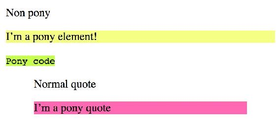
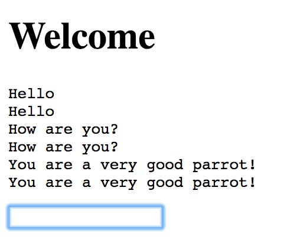
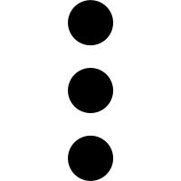
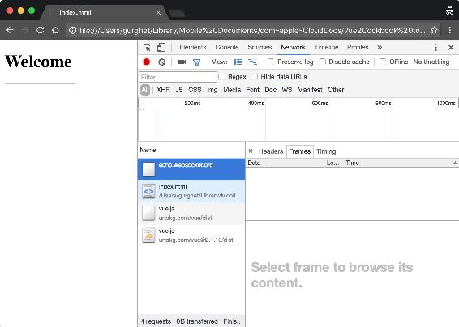
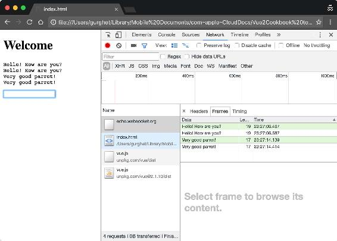
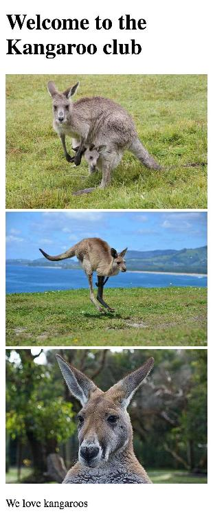
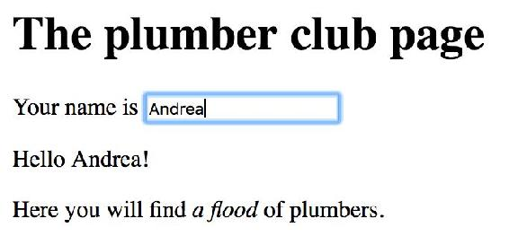
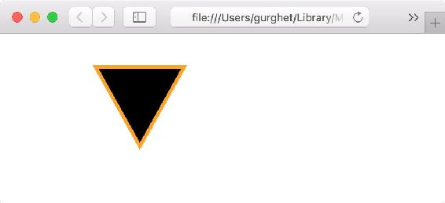

# 九、高级 VueJS——指令、插件和渲染函数

在本章中，我们将讨论以下主题:

*   创建新指令
*   在 Vue 中使用 WebSockets
*   为 Vue 编写插件
*   手动呈现简单组件
*   呈现带有子组件的组件
*   使用 JSX 渲染组件
*   创建功能组件
*   用高阶组件构建响应表


# 介绍

指令和插件是以一种可重用的方式打包功能的方法，也使得它可以在应用和团队之间容易地共享；在本章中，您将构建其中的几个。渲染函数是 Vue 真正的工作原理，它将模板转换成 Vue 语言，然后再转换成 HTML 和 JavaScript 如果你需要优化你的应用的性能，并在一些极端的情况下工作，它们会变得很有用。

一般来说，您应该尽可能避免使用这些高级功能，因为它们在过去已经被过度使用了。通常很多问题只要简单的写一个好的组件，分发组件本身就可以解决；只有在这种情况下，您才应该查看高级功能。

这一章是给稍微有经验的人看的，你可能找不到其他食谱中一步一步的细节，但我还是努力让它们完整。


# 创建新指令

指令就像迷你函数，你可以用它来快速进入你的代码，主要是为了改善用户体验，以及给你的图形界面添加新的底层特性。


# 做好准备

这个食谱虽然是在进阶章节找到的，但是真的很容易完成。指令*高级*的主要原因是因为你通常更喜欢组合来给你的应用增加功能和风格。当组件不能解决问题时，使用指令。


# 怎么做...

我们将构建一个`v-pony`指令，将任何元素转换成 pony 元素。pony 元素是用粉色背景创建的，当您单击它时，它会改变颜色。

pony 元素的 HTML 代码如下:

```js
<div id="app">
  <p v-pony>I'm a pony paragraph!</p>
  <code v-pony>Pony code</code>
  <blockquote>Normal quote</blockquote>
  <blockquote v-pony>I'm a pony quote</blockquote>
</div>

```

为了显示区别，我加入了一个普通的`blockquote`元素。在我们的 JavaScript 部分，编写以下内容:

```js
Vue.directive('pony', {
  bind (el) {
    el.style.backgroundColor = 'hotpink'
  }
})

```

这就是你如何声明一个新的指令。当指令绑定到元素时，调用`bind`钩子。我们现在唯一要做的就是设置背景颜色。我们还想让它在每次点击后改变颜色。为此，您必须添加以下代码:

```js
Vue.directive('pony', {
  bind (el) {
    el.style.backgroundColor = 'hotpink'
    el.onclick = () => {
 const colGen = () => 
 Math.round(Math.random()*255 + 25)
 const cols =
 [colGen() + 100, colGen(), colGen()]
 const randRGB =
 `rgb(${cols[0]}, ${cols[1]}, ${cols[2]})`
 el.style.backgroundColor = randRGB
 }
  }
})

```

这里，我们正在创建一个`onclick`监听器，它将生成一个偏向红色的随机颜色，并将其指定为新的背景色。

在我们的 JavaScript 的最后，记得创建一个`Vue`实例:

```js
new Vue({
  el: '#app'
})

```

您可以启动应用来查看指令的运行情况:



别忘了点击文本来改变背景颜色！


# 它是如何工作的…

声明新指令的语法如下所示:

```js
Vue.directive(<name: String>, {
  // hooks
})

```

这将注册一个新的全局指令。在 hooks 对象中，您可以定义两个重要的函数:`bind`(您在这个配方中使用的函数)和`update`(每次更新配方中包含的组件时都会触发它)。

调用每个钩子函数时至少有三个参数:

*   `el`:HTML 元素
*   `binding`:指令可以接收一个参数；绑定是一个包含参数值的对象
*   `vnode`:该元素的 Vue 内部表示

我们使用了`el`参数来编辑元素的外观，直接操作它。


# 在 Vue 中使用 WebSockets

WebSockets 是一项新技术，可以在用户和托管应用的服务器之间实现双向通信。在此技术之前，只有浏览器可以发起请求，从而建立连接。如果页面需要更新，浏览器必须不断轮询服务器。有了 WebSockets，这就不再需要了；连接建立后，服务器只能在需要时发送更新。


# 做好准备

这个食谱不需要任何准备，只需要 Vue 的基础就可以了。如果你不知道 WebSockets 是什么，你真的不需要知道，只需要把它们想象成一个服务器和浏览器之间持续双向通信的通道。


# 怎么做...

对于这个菜谱，我们需要一个服务器和一个充当客户端的浏览器。我们不会建造服务器；相反，我们将使用一个已经存在的服务器，它只是回显您通过 WebSockets 发送给它的任何内容。因此，如果我们要发送`Hello`消息，服务器将用`Hello`来响应。

您将构建一个聊天应用来与该服务器对话。编写以下 HTML 代码:

```js
<div id="app">
  <h1>Welcome</h1>
  <pre>{{chat}}</pre>
  <input v-model="message" @keyup.enter="send">
</div>

```

标签将帮助我们进行聊天。由于我们不需要使用`<br/>`元素来换行，我们可以只使用表示新行的`n`特殊字符。

为了让我们的聊天工作，我们首先必须在 JavaScript 中声明我们的 WebSocket:

```js
 const ws = new WebSocket('ws://echo.websocket.org')

```

之后，我们声明我们的`Vue`实例，它将包含一个`chat`字符串(包含到目前为止的聊天内容)和一个`message`字符串(包含我们当前正在编写的消息):

```js
new Vue({
  el: '#app',
  data: {
    chat: '',
    message: ''
  }
})

```

我们仍然需要定义`send`方法，该方法在文本框中按下 *Enter* 时被调用:

```js
new Vue({
  el: '#app',
  data: {
    chat: '',
    message: ''
  },
  methods: {
 send () {
 this.appendToChat(this.message)
 ws.send(this.message)
 this.message = ''
 },
 appendToChat (text) {
 this.chat += text + 'n'
 }
 }
}

```

我们去掉了`appendToChat`方法，因为我们将使用它来追加我们将收到的所有消息。为此，我们必须等待组件被实例化。`created`挂钩是一个安全的地方:

```js
...
created () {
  ws.onmessage = event => {
    this.appendToChat(event.data)
  }
}
...

```

现在启动应用与您的个人回音室聊天:



# 它是如何工作的...

要查看你构建的内部，打开 Chrome 开发者工具( |  更多工具|开发者工具或*Opt*+*Cmd*+*I*):



进入网络标签，重新加载页面；您应该会看到`echo.websocket.orl` WebSocket，如截图所示。写点东西，消息就会出现在框架标签里，就像这样:



绿色信息是你发出的，而白色信息是你收到的。您还可以检查消息长度(以字节为单位)以及它们被发送或接收的确切时间。


# 为 Vue 编写插件

插件是一个实用程序的集合，或者是我们希望在应用中使用的全局新行为。vuex 和 vue-router 是 Vue 插件的两个著名例子。插件实际上可以是任何东西，因为编写一个插件意味着在一个非常低的层次上工作。你可以编写不同种类的插件。对于这个菜谱，我们将集中精力构建一个具有全局属性的指令。


# 做好准备

这个配方将基于*创建一个新的指令*，除了我们将增加一些全球协调的特性。


# 怎么做...

对于这个食谱，我们将建立一个袋鼠欣赏俱乐部的网站。主页 HTML 的布局如下所示:

```js
<div id="app">
  <h1>Welcome to the Kangaroo club</h1>
  
  
  
  <p>We love kangaroos</p>
</div>

```

你可以用你喜欢的图片来改变袋鼠图片的链接。

在 JavaScript 部分，我们现在实例化一个空的`Vue`实例:

```js
new Vue({
  el: '#app'
})

```

如果我们现在打开页面，我们会看到:



现在我们想给我们的网站添加一个有趣的注释。我们希望页面的元素，除了标题，以随机的间隔跳转。

为此，您将实现的策略是在一个数组中注册所有需要跳转的元素，然后周期性地获取一个随机元素并让它跳转。

我们首先需要定义的是 CSS 中的跳转动画:

```js
@keyframes generateJump {
  20%{transform: translateY(0);}
  40%{transform: translateY(-30px);}
  50%{transform: translateY(0);}
  60%{transform: translateY(-15px);}
  80%{transform: translateY(0);}
}
.kangaroo {
  animation: generateJump 1.5s ease 0s 2 normal;
}

```

这样做是为了创建一个名为`kangaroo`的类，当应用于一个元素时，通过沿 y 轴平移它来使它跳转两次。

接下来，编写一个函数，将该类添加到 JavaScript 中的指定元素:

```js
const jump = el => {
  el.classList.add('kangaroo')
  el.addEventListener('animationend', () => {
    el.classList.remove('kangaroo')
  })
}

```

`jump`函数添加`kangaroo`类，然后在动画结束时移除它。

我们希望对从注册的元素中随机选取的元素执行此操作:

```js
const doOnRandomElement = (action, collection) => {
  if (collection.length === 0) {
    return
  }
  const el = 
    collection[Math.floor(Math.random()*collection.length)]
  action(el)
}

```

`doOnRandomElement`函数接受一个动作和一个集合，并将该动作应用于一个绘制的元素。然后，我们需要以随机的时间间隔安排它:

```js
const atRandomIntervals = action => {
  setTimeout(() => {
    action()
    atRandomIntervals(action)
  }, Math.round(Math.random() * 6000))
}

```

`atRandomIntervals`函数获取指定的函数，并以短于 6 秒的随机间隔调用它。

我们现在已经拥有了构建一个插件所需的所有函数，这个插件可以让我们的元素跳转:

```js
const Kangaroo = {
  install (vueInstance) {
    vueInstance.kangaroos = []
    vueInstance.directive('kangaroo', {
      bind (el) {
       vueInstance.kangaroos.push(el)
      }
    })
    atRandomIntervals(() => 
      doOnRandomElement(jump, vueInstance.kangaroos))
  }
}

```

Kangaroo 插件在安装时会创建一个空数组；它声明了一个新的指令，`kangaroo`,用它注册数组中的所有元素。

然后以随机的间隔，从数组中随机抽取一个元素，并对其调用跳转函数。

要激活插件，我们需要在声明`Vue`实例之前(但在声明`Kangaroo`之后)一行代码:

```js
Vue.use(Kangaroo)
new Vue({
  el: '#app'
})

```

我们要选择跳转的元素，也就是除了标题以外的一切:

```js
 <div id="app">
   <h1>Welcome to the Kangaroo club</h1>
   
   
   
   <p v-kangaroo>We love kangaroos</p>
 </div>

```

如果你现在运行你的应用，你会看到每隔几秒钟就有一幅图像或文字像袋鼠一样跳跃。


# 它是如何工作的...

本质上，Vue 插件只是一种将一些功能分组的方式。没有太多的限制，你所要做的就是声明一个安装函数来创建一个插件。这样做的一般语法如下:

```js
MyPlugin.install = (vueInstance, option) => {
  // ...
}

```

要使用您刚刚创建的插件，请编写以下代码:

```js
Vue.use(MyPlugin, { /* any option you need */ }) 

```

这里，第二个参数是传递给`install`函数的可选对象。

由于插件是全局实体，你应该稀疏地使用它们，并且只在你预见会影响你的应用的特性上使用。


# 手动呈现简单组件

Vue 把你的 HTML 模板变成渲染函数。通常，您应该坚持使用模板，因为它们简单得多。在一些情况下，渲染函数会派上用场。在这里，我们展示了一个简单的例子，其中渲染函数是有用的。


# 做好准备

这是渲染函数的第一个配方。如果你已经了解了 Vue 的基础，你就什么都明白了。


# 怎么做...

渲染函数的第一个用例是当您想要一个显示另一个组件的`Vue`实例时。

编写一个空的 HTML 布局，如下所示:

```js
 <div id="app"></div>

```

我们在某处有一个欢迎组件，我们希望将其显示为主`Vue`实例。在 JavaScript 部分，添加以下代码:

```js
const Greeter = {
  template: '<p>Hello World</p>'
}

```

在这里，我们必须想象我们正在从其他地方获取`Greeter`组件，由于该组件被很好地打包，我们不想修改它。相反，我们将把它传递给`Vue`主实例:

```js
const Greeter = {
  template: '<p>Hello World</p>'
}
new Vue({
 el: '#app',
 render: h => h(Greeter)
})

```

如果我们现在启动应用，我们将只能看到`Greeter`组件。主`Vue`实例将只充当包装器。


# 它是如何工作的...

render 函数替换了`Vue`实例中的模板。调用 render 时，传递的参数就是所谓的`createElement`函数。为了简单起见，我们将其命名为`h`。这个函数接受三个参数，但是现在，请注意我们传递的第一个参数(我们传递的唯一一个参数)是`Greeter`组件。

In theory, you can write the component inline, inside the `h` function. In a real project, this is not always possible depending on the presence of the Vue template compiler at runtime. When you use the official Webpack template, one of the questions you are asked is whether you want to include the Vue template compiler when distributing your software.

这里列出了`createElement`函数的参数:

1.  作为第一个参数，也是唯一需要的参数，您可以选择传递三个不同的东西:
    *   Vue 组件的选项，就像我们食谱中的一样
    *   代表 HTML 标签的字符串(如`div`、`h1`和`p`)
    *   返回 Vue 组件的 options 对象或代表 HTML 标记的字符串的函数
2.  第二个参数必须是一个名为**的数据对象**。这个物体将在下一个配方中解释。
3.  第三个参数是一个数组或字符串:
    *   数组表示要放入组件中的元素、文本或组件的列表
    *   可以编写将呈现为文本的字符串


# 呈现带有子组件的组件

在这个菜谱中，您将完全使用渲染函数用一些元素和组件构建一个简单的 web 页面。这将让您近距离了解 Vue 如何编译您的模板和组件。如果您想要构建一个高级组件，并且想要一个完整的示例来启动，这可能会很有用。


# 做好准备

这是一个关于如何通过渲染函数来构建组件的完整食谱。通常，在实践中你不需要这样做；它只推荐给高级读者。


# 怎么做...

你将建立一个水管工俱乐部的网页。该页面将如下所示:



每当我们在 name 文本框中写下一个名字时，它就会像`v-model`指令一样被写在问候语中。

对于这个食谱，我们是从末尾而不是从开头开始，因为通常当你不得不求助于`render`函数时，你对你想要得到的东西有一个非常清楚的想法。

在我们应用的 HTML 部分，让我们从一个空标签开始:

```js
<div id="app"></div>

```

在 JavaScript 中，在`render`函数中编写一个空的`<div>`元素:

```js
new Vue({
  el: '#app',
  render: h => h('div')
})

```

我们要放进去的第一件事是标题，就像这样:

```js
new Vue({
  el: '#app',
  render: h => h(
    'div',
    [
 h('h1', 'The plumber club page')
 ]
  )
})

```

所有其他元素和组件都将放入我们刚刚为标题创建的数组中。

我们需要一个接受值并显示问候的`<input>`元素。为此，我们可以构建一个`Vue`组件。

在下面的代码中，我们使用的是常规的 JavaScript 函数，而不是箭头函数；这是因为我们希望引用组件本身。箭头函数不允许你修改`this`的作用域，而`this`取决于函数是如何被调用的，可以随意绑定到常规函数中的任何变量。在我们的例子中，它将被绑定到实例组件。

在页面标题之后，我们在同一个数组中添加以下组件:

```js
h(
  {
    render: function (h) {
      const self = this
      return h('div', [
        'Your name is ',
        h('input', {
          domProps: {
            value: self.name
          },
          on: {
            input (event) {
              self.name = event.target.value
            }
          }
        }),
        h(
          'p',
          'Hello ' + self.name + 
            (self.exclamation ? '!' : ''))
      ])
    },
    data () { return { name: '' } },
    props: ['exclamation']
  },
  {
    props: {
      exclamation: true
    }
  }
)

```

该组件有三个选项:功能`render`、`data`和`props`。

`createElement`函数的第二个参数实际上是给我们的道具赋值:

```js
{
  props: {
    exclamation: true
  }
}

```

这将等同于在声明组件时编写`:exclamation="true"`。

你很容易理解组件的`data`和`props`选项。让我们检查一下我们在`render`函数中写了什么。

在函数的第一行，我们将`self = this`设置为引用组件的一种便捷方式，以便添加任何嵌套函数。然后，我们返回一个`createElement`函数(`h`)的结果，该函数在一个 div 标签内将三样东西放在 DOM 中。首先是原始文本`Your name is`，然后是两个元素:一个输入和一个段落。

当使用渲染函数时，我们没有直接等同于`v-model`的指令。相反，我们手动实现它。我们将值绑定到名称，然后我们向输入事件添加一个侦听器，该侦听器将状态变量`name`的值设置为 textbox 中的任何值。

然后我们插入一个段落元素，它将组成问候短语，并根据`exclamation`属性的值添加一个感叹号。

在组件之后，我们可以在同一个数组中添加以下内容，如图所示:

```js
 'Here you will find ', h('i', 'a flood '), 'of plumbers.'

```

如果你做得对，你应该能够运行应用并看到整个页面。


# 它是如何工作的...

在这个例子中，我们已经看到了当 Vue 编译我们的模板时幕后发生了什么；同样，不建议您对常规组件这样做。大多数情况下，结果只会更加冗长，几乎没有任何好处。另一方面，在一些情况下，编写渲染函数实际上可能会产生更好或更健壮的代码，并覆盖一些难以用模板表达的功能。


# 使用 JSX 渲染组件

JSX 在 React 社区非常受欢迎。在 Vue 中，你不必使用 JSX 为你的组件构建模板；您可以使用更熟悉的 HTML。然而，如果你不得不写很多渲染函数，JSX 是下一个最好的选择。


# 做好准备

在尝试这个方法之前，你最好先玩一下渲染功能。前面的食谱提供了一些练习。


# 怎么做...

JSX 需要一个巴别塔插件来工作。对于这个菜谱，我将假设您正在 webpack 模板中工作。

要安装 babel 插件，您可以运行以下命令:

```js
npm install
 babel-plugin-syntax-jsx
 babel-plugin-transform-vue-jsx
 babel-helper-vue-jsx-merge-props
 --save-dev

```

在`.babelrc`文件中，将以下内容添加到`plugins`数组中:

```js
"plugins": [
 ...
  "transform-vue-jsx" ]

```

照常运行`npm install`来实际安装所有的依赖项。

现在，打开`main.js`并删除里面的所有内容。用以下代码替换它:

```js
import Vue from 'vue'

/* eslint-disable no-new */
new Vue({
  el: '#app',
  render (h) {
    return <div>{this.msg}</div>
  },
  data: {
    msg: 'Hello World'
  }
})

```

如果你从没看过 JSX，高亮显示的那条线就有点奇怪了。请注意，在前面的代码中，我们没有在`render`选项中使用箭头函数。这是因为我们在内部使用了`this`,我们希望它被绑定到组件上。

您已经可以使用`npm run dev`命令看到您的页面正在工作。


# 它是如何工作的...

巴别塔插件将把 JSX 代码转换成 JavaScript 函数。

我不推荐 JSX 和 Vue 一起使用。我认为它唯一有用的时候是当你需要将`render`函数和 JavaScript 混合在一起，并且需要一种快速可读的方式来定义模板的时候。除此之外，使用 JSX 没有太多优势。


# 还有更多...

让我们把代码稍微复杂一点，至少了解一下 JSX 是如何使用道具的。

在主`Vue`实例之前定义一个新组件:

```js
const myComp = {
  render (h) {
    return <p>{this.myProp}</p>
  },
  props: ['myProp']
}

```

让我们在`Vue`实例中使用这个组件，并通过 props 传递`msg`变量:

```js
new Vue({
  el: '#app',
  render (h) {
    return <div>
      <myComp myProp={this.msg}/>
    </div>
  },
  data: {
    msg: 'Hello World'
  },
  components: {
    myComp
  }
})

```

语法与 HTML 模板略有不同。特别要注意道具是如何传递的，以及我们如何使用 camelCase 和自结束标签。


# 创建功能组件

组件的较轻版本是功能组件。功能组件没有实例变量(所以没有`this`)也没有状态。在这个菜谱中，我们将编写一个简单的功能组件，它通过 HTML 获取一些指令，并将它们转换成图形。


# 做好准备

在尝试这个方法之前，你至少应该熟悉 Vue 中的渲染功能。你可以用之前的食谱来做。


# 怎么做...

当你写一个`<svg>`元素时，你通常必须将数据放入元素的属性中，这样才能真正画出形状。例如，如果你想画一个三角形，你必须写下:

```js
<svg>
  <path d="M 100 30 L 200 30 L 150 120 z"/>
</svg>

```

`d`属性中的文本是一系列使虚拟光标移动以进行绘制的指令:`M`将光标移动到`<svg>`中的(100，30)坐标，然后`L`沿着一条线向上直到(200，30)，然后再次移动到(150，120)坐标。最后，`z`关闭我们正在绘制的路径，结果总是一个三角形。

我们想用一个组件来写一个三角形，但是我们不喜欢属性，我们想用我们自己的语言来写，所以我们写下面的代码来得到同样的结果:

```js
<orange-line>
  moveTo 100 30 traceLine 200 30 traceLine 150 120 closePath
</orange-line>

```

对于一个功能组件来说，这是一个完美的工作，因为没有状态需要管理，只有从一个组件到一个元素的转换。

您的 HTML 布局看起来很简单，如下所示:

```js
<div id="app">
  <orange-line>
    moveTo 100 30 traceLine 200 30 traceLine 150 120 closePath
  </orange-line>
</div>

```

然后，布局您的

```js
const OrangeLine = {
  functional: true,
  render (h, context) {
    return h('svg',
      []
    )
  }
}

```

您必须指定组件将使用`functional: true`运行；那么渲染函数就和平时略有不同。第一个参数仍然是`createElement`函数，但是传递的第二个参数是组件的上下文。

我们可以通过`context.children`访问写在组件 HTML 中的文本(绘制命令)。

您可以看到我已经添加了一个空的`<svg>`元素。在这里面，有一个空的子数组；我们将只把`<path>`元素放在那里，如下所示:

```js
render (h, context) {
  return h('svg',
    [
      h('path', {
 attrs: {
 d: context.children.map(c => {
 return c.text
 .replace(/moveTo/g, 'M')
 .replace(/traceLine/g, 'L')
 .replace(/closePath/g, 'z')
 }).join(' ').trim(),
 fill: 'black',
 stroke: 'orange',
 'stroke-width': '4'
 }
 })
    ]
  )
}

```

突出显示的代码创建一个 path 元素，然后设置一些属性，比如`fill`和`stroke`。`d`属性从组件内部获取文本，进行一些替换，然后返回它。

我们只需要在 JavaScript 中创建`Vue`实例:

```js
new Vue({
  el: '#app',
  components: {
    OrangeLine
  }
})

```

现在，加载应用，我们应该会看到一个三角形，如下图所示:



# 它是如何工作的...

Vue 允许你创建非常轻量级的组件，因为它们没有任何内部状态。随之而来的是一些限制，例如，我们可以放置一些逻辑来处理用户输入(以元素或道具的子元素的形式)的唯一地方是在 render 函数中。

我们传递的上下文包含以下属性:

*   `props`:由用户传递。
*   这实际上是一个虚拟节点的数组，是模板中组件的子节点。这里我们没有实际的 HTML 元素，只有 Vue 的一个表示。
*   `slots`:这是一个返回槽的函数(在某些情况下可以代替子项使用)。
*   `data`:这是传递给组件的整个数据对象。
*   `parent`:这是对父组件的引用。

在我们的代码中，我们通过执行以下操作提取了组件内部的文本:

```js
context.children.map(c => {
  return c.text
    .replace(/moveTo/g, 'M')
    .replace(/traceLine/g, 'L')
    .replace(/closePath/g, 'z')
}).join(' ').trim()

```

我们获取子节点中包含的虚拟节点的数组，并将每个节点映射到它的文本。因为我们在 HTML 中只放了一些文本，所以节点数组将是单个的，只有一个节点:我们输入的文本。因此，在这种特殊情况下，做`var a = children.map(c => someFunction(c))`相当于做`var a = [someFunction(children[0])]`。

我们不仅提取了文本，我们还用真正的命令替换了我发明的描述`svg`命令的一些术语。`join`函数将把数组中的所有字符串缝合在一起(在我们的例子中只有一个)，而`trim`将删除所有的空格和换行符。


# 用高阶组件构建响应表

当我们必须决定实际包装哪个组件时，功能组件是非常好的包装器。在这个菜谱中，您将编写一个响应表，根据浏览器的宽度显示不同的列。


# 做好准备

这个食谱是关于功能性成分的。如果你想热身，你可以试着完成前面的食谱。


# 怎么做...

对于这个菜谱，我们将使用优秀的语义 UI CSS 框架。要使用它，你必须包含 CSS 库作为一个依赖项或者一个`<link>`标签。例如，您可以将以下代码放在 HTML 的`<head>`中:

```js
<link rel="stylesheet" href="https://cdnjs.cloudflare.com/ajax/libs/semantic-ui/2.2.7/semantic.css" />

```

如果你用的是 JSFiddle，里面的链接应该就足够了。

为了让你的页面在移动设备上看起来更好，你必须添加的另一个标签是:

```js
<meta name="viewport" content="width=device-width">

```

这告诉移动浏览器页面的宽度等于设备的宽度。如果你不这样做，手机可能会认为页面比手机大得多，并试图显示所有内容，显示你的应用的缩小版。

我们将设计一个猫品种表。您可以在 Vue 实例状态中看到所有数据。用您的 JavaScript 写下来:

```js
new Vue({
  el: '#app',
  data: {
    width: document.body.clientWidth,
  breeds: [
    { name: 'Persian', colour: 'orange', affection: 3, shedding: 5 },
    { name: 'Siberian', colour: 'blue', affection: 5, shedding: 4 },
    { name: 'Bombay', colour: 'black', affection: 4, shedding: 2 }
  ]
  },
  created() {
    window.onresize = event => {
      this.width = document.body.clientWidth
    }
  },
  components: {
    BreedTable
  }
})

```

我们声明了`width`变量来改变页面的布局，由于页面的宽度本质上不是反应式的，我们还在`window.onresize`上安装了一个监听器。对于一个真正的项目，你可能需要一些更复杂的东西，但是对于这个食谱，这就足够了。

另外，请注意我们是如何使用`BreedTable`组件的，我们是这样写的:

```js
const BreedTable = {
  functional: true,
  render(h, context) {
    if (context.parent.width > 400) {
      return h(DesktopTable, context.data, context.children)
    } else {
      return h(MobileTable, context.data, context.children)
    }
  }
}

```

我们的组件所做的只是将所有的`context.data`和`context.children`传递给另一个组件，该组件将是`DesktopTable`或`MobileTable`，这取决于分辨率。

我们的 HTML 布局如下:

```js
<div id="app">
  <h1>Breeds</h1>
  <breed-table :breeds="breeds"></breed-table>
</div>

```

`breeds`道具将被传递给`context.data`中所选的组件。

作为一张桌子，我们的桌面桌子看起来非常规整:

```js
const DesktopTable = {
  template: `
    <table class="ui celled table unstackable">
      <thead>
        <tr>
          <th>Breed</th>
          <th>Coat Colour</th>
          <th>Level of Affection</th>
          <th>Level of Shedding</th>
        </tr>
      </thead>
      <tbody>
        <tr v-for="breed in breeds">
          <td>{{breed.name}}</td>
          <td>{{breed.colour}}</td>
          <td>{{breed.affection}}</td>
          <td>{{breed.shedding}}</td>
        </tr>
      </tbody>
    </table>
  `,
  props: ['breeds']
}

```

顶部的类是语义 UI 的一部分，它们将使我们的表看起来更好。特别是,`unstackable`类禁用了 CSS 执行的自动堆栈。我们将在下一节详细介绍这一点。

对于移动表，我们不仅希望编辑样式，还希望对列本身进行分组。该品种将随着颜色和感情的脱落。此外，我们希望用简洁的风格来表达它们。表格标题将如下所示:

```js
const MobileTable = {
  template: `
    <table class="ui celled table unstackable">
      <thead>
       <tr>
         <th>Breed</th>
         <th>Affection & Shedding</th>
       </tr>
     </thead>
   ...

```

我们不只是拼写毛色，而是画一个该颜色的小圆圈:

```js
...
<tbody>
  <tr v-for="breed in breeds">
    <td>{{breed.name}}
      <div 
        class="ui mini circular image"
        :style="'height:35px;background-color:'+breed.colour"
      ></div>
    </td>
  ...

```

此外，我们没有使用桌面表格中的数字来表示情感和脱落水平，而是给出了心形和星形评级:

```js
      ...
      <td>
        <div class="ui heart rating">
          <i 
            v-for="n in 5"
            class="icon"
            :class="{ active: n <= breed.affection }"
          ></i>
        </div>
        <div class="ui star rating">
          <i 
            v-for="n in 5"
            class="icon"
            :class="{ active: n <= breed.shedding }"
          ></i>
        </div>
      </td>
    </tr>
  </tbody>
</table>

```

另外，不要忘记像在`DesktopTable`组件中一样声明`breeds`属性。

现在在浏览器中启动您的应用。您可以看到表格在充分压缩后是如何对列进行分组的:


下面的屏幕截图显示，数字被替换为心形和星级:


# 它是如何工作的...

响应页面会根据浏览器的宽度改变其布局，当用户使用平板电脑或智能手机浏览网站时，这一点非常重要。

对于一个响应式页面，大多数组件只需开发一次，并且只需根据不同的大小多次进行样式设计。与拥有一个为移动优化的独立网站相比，这可以节省大量的开发时间。

通常，在响应页面表中，从列式变为堆叠式，如下图所示:


我从来不喜欢这种做法，但客观上的缺点是，如果你让你的桌子一边好看，另一边就不那么好看了。这是因为你必须以同样的方式设置单元格的样式，而响应性所做的就是将它们堆叠起来。

我们的`BreedTable`组件做的是在两个组件之间动态切换，而不是简单地依赖 CSS。因为它是一个功能组件，所以与成熟的组件相比，它的优势是非常轻量级。

在实际应用中，使用`onresize`事件是有问题的，主要是因为性能受到影响。在生产系统中，通过 JavaScript 实现响应的解决方案需要更加结构化。比如考虑用定时器或者用`matchMedia`。

最后，注意 Vue 实例从不注册这两个子组件；这是因为它们从不出现在模板中，而是在代码中作为对象被直接引用。