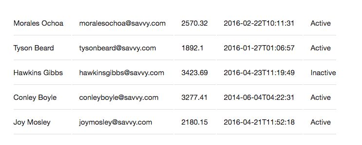
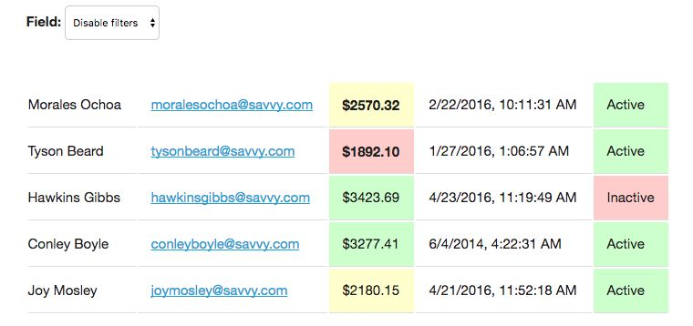

# 二、显示、循环、搜索和过滤数据

在[第 1 章](part0023.html#LTSU0-985bf4ae118d4f62b18ae64204cb251c)、*Vue . js 入门*中，我们介绍了 Vue 中的`data`、`computed`和`method`对象以及如何显示静态数据值。在本章中，我们将介绍:

*   使用`v-if``v-else``v-for`用 Vue 显示列表和更复杂的数据
*   使用表单元素过滤列表
*   基于数据应用条件 CSS 类

我们将要使用的数据将由 JSON 生成器服务([http://www.json-generator.com/](http://www.json-generator.com/))随机生成。这个网站允许我们用虚拟数据来练习。以下模板用于生成我们将使用的数据。将以下内容复制到左侧，生成相同格式的数据，以便属性与代码示例相匹配，如下所示:

```js
      [
        '{{repeat(5)}}',
        {
          index: '{{index()}}',
          guid: '{{guid()}}',
          isActive: '{{bool()}}',
          balance: '{{floating(1000, 4000, 2, "00.00")}}',
          name: '{{firstName()}} {{surname()}}',
          email: '{{email()}}',
          registered: '{{date(new Date(2014, 0, 1), new Date(), "YYYY-            
         MM-ddThh:mm:ss")}}'
        }
      ]
```

在我们开始构建我们的简单应用和显示我们的用户之前，我们将介绍更多的 Vue 特性和在您的视图中可用的 HTML 特定属性。这些范围从动态呈现内容到遍历数组。


# HTML 声明

Vue 允许你使用 HTML 标签和属性来控制和改变应用的视图。这涉及到动态设置属性，比如`alt`和`href`。它还允许您根据应用中的数据呈现标记和组件。这些属性以`v-`开头，正如本书开头提到的，在渲染时从 HTML 中移除。在我们开始输出和过滤数据之前，我们将浏览一些常见的声明。


# 虚拟 html

`v-html`指令允许您在不使用小胡子式花括号语法的情况下输出内容。如果您的输出包含 HTML 标签，也可以使用它-它会将输出呈现为 HTML 而不是纯文本。HTML 属性的值是数据键或计算函数名的值:

**查看**:

在您的视图应用空间中，将`v-html`属性添加到一个元素:

```js
      <div id="app">
        <div v-html="message"></div>
      </div>
```

**JavaScript** :

在 JavaScript 中，将`message`变量设置为包含一些 HTML 元素的字符串:

```js
      const app = new Vue({
        el: '#app',

        data: {
          message: '<h1>Hello!</h1>'
        }
      });
```

你应该试着避免添加 HTML 到你的 Vue 实例中，因为它开始混淆视图模型和我们的 MVVM 结构模型中的视图。还存在这样的危险:在另一个 HTML 标签中输出无效的 HTML 标签。您应该只对您信任的数据使用`v-html`,因为与外部 API 一起使用它可能会有安全问题，因为它会允许 API 控制您的应用。一个潜在的恶意 API 可以使用`v-html`来注入不需要的内容和 HTML。只对你完全信任的数据使用`v-html`。


# 声明性渲染

常规的 HTML 属性，比如``标签的`src`，可以使用`v-bind:`属性用 Vue 动态填充。这允许您用来自 Vue 应用的数据填充任何现有属性。这可能是图像源或元素 ID。

`bind`选项通过预先考虑您希望填充的属性来使用。例如，如果您希望用名为`imageSource`的数据关键字的值填充图像源，您应该执行以下操作:

**查看**:

使用`v-bind`和一个名为`imageSource`的变量，在你的视图应用空间创建一个 img 标签，带有一个动态的`src`属性。

```js
      <div id="app">
        
      </div>
```

**JavaScript** :

在 Vue JavaScript 代码中创建一个名为`imageSource`的变量。将 URL 添加到所需的图像:

```js
      const app = new Vue({
        el: '#app',

        data: {
          imageSource: 'http://via.placeholder.com/350x150'
        }
      });
```

属性`v-bind:`可以缩短为`:`，例如，`v-bind:src`会变成`:src`。


# 条件渲染

使用自定义 HTML 声明，Vue 允许您基于数据属性或 JavaScript 声明有条件地呈现元素和内容。其中包括`v-if`，用于显示一个容器声明是否等于 true，以及`v-else`，用于显示另一种选择。


# 虚拟中频

最基本的例子是`v-if`指令——决定一个值或函数是否应该显示。

创建一个 Vue 实例，在视图中有一个`div`和一个设置为`false`的数据键`isVisible`。

**查看**:

从视图代码开始，如下所示:

```js
      <div id="app">
        <div>Now you see me</div>
      </div>
```

**JavaScript** :

在 JavaScript 中，初始化 Vue 并创建一个`isVisible`数据属性:

```js
      const app = new Vue({
        el: '#app',

        data: {
          isVisible: false
        }
      });
```

现在，您的 Vue 应用将显示您的元素的内容。现在将`v-if`指令添加到值为`isVisible`的 HTML 元素中:

```js
      <div id="app">
        <div v-if="isVisible">Now you see me</div>
      </div>
```

按下保存后，您的文本应该会消失。这是因为标签是基于当前值`false`有条件地呈现的。如果您打开 JavaScript 控制台并运行以下代码，您的元素应该会重新出现:

```js
      app.isVisible = true
```

`v-if`不仅适用于布尔真/假值。您可以检查数据属性是否等于特定字符串:

```js
      <div v-if="selected == 'yes'">Now you see me</div>
```

例如，前面的代码检查选定的数据属性是否等于`yes`的值。`v-if`属性接受 JavaScript 操作符，因此可以检查不等于、大于或小于。

这里的危险是你的逻辑开始从你的视图模型蔓延到你的视图中。为了解决这个问题，该属性还将函数作为一个值。该方法可以根据需要而变得复杂，但是如果您希望显示代码，最终必须返回一个`true`，否则必须返回一个`false`。请记住，如果函数返回的不是假值(如`0`或`false`)，那么结果将被解释为真。

这看起来会像这样:

```js
      <div v-if="isSelected">Now you see me</div>
```

你的方法可以是这样的:

```js
      isSelected() {
        return selected == 'yes';
      }
```

如果您不希望完全删除该元素，而只是隐藏它，有一个更合适的指令，`v-show`。这应用了一个 CSS 显示属性，而不是操作 DOM-`v-show`将在本章后面介绍。


# v-否则

`v-else`允许您根据与`v-if`语句相反的语句来呈现替代元素。如果结果是`true`，将显示第一个元素；否则，包含`v-else`的元素将。

The element with `v-else` needs to directly follow the one containing `v-if`; otherwise, your application will throw an error.

`v-else`没有值，放在元素标签里。

```js
      <div id="app">
        <div v-if="isVisible">
          Now you see me
        </div>
        <div v-else>
          Now you don't
        </div>
      </div>
```

将前面的 HTML 添加到您的应用空间将只显示其中一个`<div>`元素——像我们之前所做的那样在您的控制台中切换值将显示另一个容器。如果您希望链接您的条件，您也可以使用`v-else-if`。`v-else-if`的例子如下:

```js
      <div id="app">
        <div v-if="isVisible">
          Now you see me
        </div>
        <div v-else-if="otherVisible">
          You might see me
        </div>
        <div v-else>
          Now you don't
        </div>
      </div>
```

如果`isVisible`变量等于`false`，而`otherVisible`变量等于`true`，你可能会看到我。

`v-else`应谨慎使用，因为可能会产生歧义，并可能导致假阳性情况。


# v-用于显示我们的数据

下一个 HTML 声明意味着我们可以开始显示我们的数据，并将其中一些属性付诸实践。因为我们的数据是一个数组，所以我们需要遍历它来显示每个元素。为此，我们将使用`v-for`指令。

生成您的 JSON 并将其赋给一个名为`people`的变量。在这些例子中，生成的 JSON 循环将在代码块中显示为`[...]`。您的 Vue 应用应该如下所示:

```js
      const app = new Vue({
        el: '#app',

        data: {
          people: [...]
        }
      });
```

我们现在需要在视图中以项目符号列表的形式显示每个人的名字。这就是`v-for`指令的用武之地:

```js
      <div id="app">
        <ul>
          <li v-for="person in people">
            {{ person }}
          </li>
        </ul>
      </div>
```

`v-for`遍历 JSON 列表，并为每个条目临时分配一个`person`变量。然后，我们可以输出变量的值或属性。

`v-for`循环需要应用于您想要重复的 HTML 元素，在本例中是`<li>`。如果你没有包装元素或者不想使用 HTML，你可以使用 Vue `<template>`元素。这些在运行时被删除，同时仍然为您创建一个容器来输出数据:

```js
      <div id="app">
        <ul>
          <template v-for="person in people">
            <li>
              {{ person }}
            </li>
          </template>
        </ul>
      </div>
```

在应用初始化之前，模板标签还会隐藏内容，如果您的网络很慢或者 JavaScript 需要一段时间才能启动，这可能会很方便。

仅仅让我们的视图输出`{{ person }}`会产生一长串对我们没有任何用处的信息。更新输出以指向`person`对象的`name`属性:

```js
      <li v-for="person in people">
        {{ person.name }}
      </li>
```

在浏览器中查看结果应该会显示一个用户名列表。更新 HTML 以在表格中列出用户，显示他们的姓名、电子邮件地址和余额。将`v-for`应用于`<tr>`元素:

```js
      <table>
        <tr v-for="person in people">
          <td>{{ person.name }}</td>
          <td>{{ person.email }}</td>
          <td>{{ person.balance }}</td>
          <td>{{ person.registered }}</td>
        </tr>
      </table>
```

向表格中添加额外的单元格。这将使用`person`对象上的`isActive`属性，显示活动的，如果它们活动，则显示不活动的。这可以通过两种方式实现——使用`v-if`指令或者使用三元`if`。三元 if 是内嵌的`if`语句，可以放在视图的花括号内。如果我们想使用 HTML 元素来应用一些样式，我们会使用`v-if`。

如果我们使用三进制“If”，单元格将如下所示:

```js
      <td>{{ (person.isActive) ? 'Active' : 'Inactive' }}</td>
```

如果我们选择了带有`v-else`的`v-if`选项，允许我们使用我们想要的 HTML，它将看起来像这样:

```js
      <td>
        <span class="positive" v-if="person.isActive">Active</span>
        <span class="negative" v-else>Inactive</span>
      </td>
```

这个活动元素是 Vue 组件最理想的一个例子——我们将在[第 3 章](part0051.html#1GKCM0-985bf4ae118d4f62b18ae64204cb251c)、*中讨论优化我们的应用和使用组件显示数据*。作为更符合我们的 MVVM 方法的替代方案，我们可以创建一个方法，它返回状态文本。这将整理我们的视图，并将逻辑移至我们的应用:

```js
      <td>{{ activeStatus(person) }}</td>
```

我们的方法将执行与我们的视图相同的逻辑:

```js
activeStatus(person) {
  return (person.isActive) ? 'Active' : 'Inactive';
}
```

我们的表格现在将如下所示:



# 使用 v-html 创建链接

下一步是链接电子邮件地址，以便用户查看人员列表时可以点击它。在这种情况下，我们需要通过在电子邮件地址前添加一个`mailto:`来连接字符串。

第一本能是做以下事情:

```js
      <a href="mailto:{{person.email}}">{{ person.email }}</a>
```

但是 Vue 不允许在属性内部插值。相反，我们必须在`href`属性上使用`v-bind`指令。这会将属性转换为 JavaScript 变量，因此任何原始文本都必须用引号括起来，并与所需的变量连接起来:

```js
<a v-bind:href="'mailto:' + person.email">{{ person.email }}</a>
```

注意添加了`v-bind:`，单引号和连接`+`标识符。


# 格式平衡

在我们继续过滤用户之前，添加一个正确格式化余额的方法，在数据对象中预先定义一个货币符号，并确保小数点后有两个数字。我们可以修改第 1 章、*和 Vue.js* 中的方法来实现这一点。我们的 Vue 应用现在应该是这样的:

```js
      const app = new Vue({
        el: '#app',

        data: {
          people: [...],
          currency: '$'
        },
        methods: {
          activeStatus(person) {
            return (person.isActive) ? 'Active' : 'Inactive';
          },
          formatBalance(balance) {
            return this.currency + balance.toFixed(2);
          }
        }
    });
```

在我们看来，我们可以利用这种新方法:

```js
      <td>{{ formatBalance(person.balance) }}</td>
```


# 登记日期格式

数据中的注册日期字段是计算机友好的，阅读起来不太人性化。创建一个名为`formatDate`的新方法，它接受一个参数——类似于前面的`formatBalance`方法。

如果您想要完全定制日期的显示，有几个库是可用的，比如`moment.js`，它们在任何基于日期和时间的数据的输出方面给您更多的灵活性。对于这个方法，我们将使用一个本地 JavaScript 函数来执行`LocaleString()`:

```js
      formatDate(date) {
        let registered = new Date(date);
        return registered.toLocaleString('en-US');
      }
```

对于注册的日期，我们将其传递给本机`Date()`函数，这样 JavaScript 就知道将字符串解释为日期。一旦存储在注册变量中，我们就用`toLocaleString()`函数将对象作为字符串返回。该函数接受大量选项(如 MDN 上所述)来定制日期的输出。现在，我们将把我们希望显示的地区传递给它，并使用该地区的默认值。我们现在可以在视图中使用我们的方法:

```js
      <td>{{ formatDate(person.registered) }}</td>
```

现在，每个表格行应该如下所示:


# 过滤我们的数据

随着我们的数据被列出，我们现在要建立过滤能力。这将允许用户选择一个字段进行过滤，并选择一个文本字段来输入他们的查询。Vue 应用将在用户输入时过滤这些行。为此，我们将把一些表单输入绑定到`data`对象中的各种值，创建一个新方法，并在表格行上使用一个新指令；`v-show`。


# 构建表单

从在视图中创建 HTML 开始。创建一个`<select>`框，为您想要过滤的每个字段添加一个`<option>`,为查询添加一个`<input>`,以及一对单选按钮——我们将使用它们来过滤活动和非活动用户。确保每个`<option>`的值属性反映用户数据中的键——这将节省所需的代码，并使选择框的目的更加明显。

虽然这里需要考虑用户体验，但是我们的过滤不需要显示您正在过滤的数据。如果显示的表格行中没有您正在筛选的数据，这有意义吗？

创建将用于筛选的表单:

```js
      <form>
        <label for="fiterField">
          Field:
          <select id="filterField">
            <option value="">Disable filters</option>
            <option value="isActive">Active user</option>
            <option value="name">Name</option>
            <option value="email">Email</option>
            <option value="balance">Balance</option>
            <option value="registered">Date registered</option>
          </select>
        </label>

        <label for="filterQuery">
          Query:
          <input type="text" id="filterQuery">
        </label>

        <span>
          Active:
          <label for="userStateActive">
            Yes:
            <input type="radio" value="true" id="userStateActive"                   
          selected>
          </label>
          <label for="userStateInactive">
            No:
            <input type="radio" value="false" id="userStateInactive">
          </label>
        </span>
      </form>
```

这个表单包括一个选择框，用于选择一个字段作为筛选依据，一个输入框，允许用户输入一个查询进行筛选，以及一对单选按钮，用于当我们希望按活动和非活动用户进行筛选时。想象中的用户流是这样的:用户将选择他们希望用来过滤数据的字段，并输入他们的查询或选择单选按钮。当在选择框中选择`isActive`(激活用户)选项时，单选按钮将显示，输入框将隐藏。我们已经确保默认选择第一个单选按钮来提供帮助。

过滤输入不需要包含在表单中就可以工作；然而，即使在 JavaScript 应用中，保留语义 HTML 也是一种很好的做法。


# 绑定输入

要将输入绑定到可以通过 Vue 实例访问的变量，需要将 HTML 属性添加到字段中，并将相应的键添加到`data`对象中。在`data`对象中为每个字段创建一个变量，这样我们就可以将表单元素绑定到它们:

```js
      data: {
        people: [...],

        currency: '$',

        filterField: '',
 filterQuery: '',
 filterUserState: ''
      }
```

数据对象现在有三个额外的键:`filterField`，它将用于存储下拉列表的值；`filterQuery`，文本框中输入数据的占位符；和`filterUserState`，它允许我们存储单选按钮复选框。

现在有了可以利用的数据键，我们能够将表单元素绑定到它们。用数据键值对每个表单字段应用一个`v-model=""`属性。

这里有一个例子:

```js
      <input type="text" id="filterQuery" v-model="filterQuery">
```

确保两个单选按钮具有完全相同的`v-model=""`属性:这样它们可以更新相同的值。为了验证它已经工作，您现在可以输出数据变量并获得字段的值。

尝试输出`filterField`或`filterQuery`并更改字段。

```js
      {{ filterField }}
```

如果您要输出`filterUserState`变量，您可能会注意到的一件事是，它似乎在工作，但是，它并没有得到想要的实际结果。变量的输出将是值属性中设置的`true`和`false`。

仔细观察，这些值实际上是字符串，而不是布尔值。布尔值是一个硬的`true`或`false`、`1`或`0`，你可以很容易地进行比较，而字符串需要对硬编码的字符串进行精确的检查。这可以通过输出`typeof`变量来验证:

```js
      {{ typeof filterUserState }}
```

这可以通过将单选按钮的值与`v-bind:value`属性绑定来解决。该属性允许您指定 Vue 要解释的值，并且可以接受布尔值、字符串或对象值。现在，我们将传递它`true`和`false`，就像我们已经对标准值属性做的那样，但是 Vue 将知道把它解释为布尔值:

```js
      <span>
        Active:
        <label for="userStateActive">
          Yes:
          <input type="radio" v-bind:value="true" id="userStateActive"       
         v-model="filterUserState" selected>
        </label>
        <label for="userStateInactive">
          No:
          <input type="radio" v-bind:value="false"       
         id="userStateInactive" v-model="filterUserState">
        </label>
      </span>
```

下一步是根据这些过滤器显示和隐藏表格行。


# 显示和隐藏 Vue 内容

除了使用`v-if`来显示和隐藏内容，您还可以使用`v-show=""`指令。`v-show`和`v-if`很像；它们都被添加到 HTML 包装器中，并且都可以接受相同的参数，包括一个函数。

两者的区别在于,`v-if`改变标记，根据需要删除和添加 HTML 元素，而`v-show`则不考虑元素，用内联 CSS 样式隐藏和显示元素。`v-if`更适合运行时渲染或者不频繁的用户交互，因为它有可能重构整个页面。`v-show`适用于大量元素快速进出视图的情况，例如过滤时！

当对一个方法使用`v-show`时，该函数只需要返回一个`true`或`false`。这个函数不知道它在哪里被使用，所以我们需要传入当前被渲染的人来计算它是否应该被显示。

在名为`filterRow()`的 Vue 实例上创建一个方法，并在内部将其设置为`return true`:

```js
      filterRow(person) {
         return true;
      }
```

这个函数有一个参数，就是我们要从 HTML 传入的人。在您看来，将`v-show`属性添加到`<tr>`元素，并将`filterRow`作为值，同时传入 person 对象:

```js
      <table>
        <tr v-for="person in people" v-show="filterRow(person)">
          <td>{{ person.name }}</td>
          ...
```

作为一个简单的测试，将`isActive`值返回给这个人。这将立即过滤掉任何不活跃的人，因为他们的值将返回`false`:

```js
      filterRow(person) {
        return person.isActive;
      }
```


# 过滤我们的内容

现在我们已经控制了我们的人员行和视图中的一些过滤器控件，我们需要让我们的过滤器工作。我们已经通过`isActive`键进行了过滤，所以单选按钮将首先被连接。对于单选按钮值和我们将作为筛选依据的键，我们已经有了布尔形式的值。为了让这个过滤器工作，我们需要比较`isActive`键和单选按钮的值。

*   如果`filterUserState`值为`true`，向用户显示`isActive`为`true`
*   然而，如果`filterUserState`值是`false`，也只显示用户的`isActive`值是`false`的地方

这可以通过比较两个变量写成一行:

```js
      filterRow(person) {
        return (this.filterUserState === person.isActive);
      }
```

在页面加载时，不会显示任何用户，因为`filterUserState`键既没有设置为`true`也没有设置为`false`。单击其中一个单选按钮将显示相应的用户。

让我们使过滤器仅在下拉列表中选择了活动用户选项时才工作:

```js
      filterRow(person) {
        let result = true;

        if(this.filterField === 'isActive') {
          result = this.filterUserState === person.isActive;
        }

        return result;
      }
```

这段代码将变量设置为`true`作为默认值。然后，我们可以立即返回变量，我们的行将显示。然而，在返回之前，它检查选择框的值，如果是所需的值，那么将通过我们的单选按钮进行过滤。因为我们的选择框绑定到了`filterField`值，就像`filterUserState`变量一样，当我们与应用交互时，它会更新。尝试在选择框中选择活动用户选项，并更改单选按钮。

下一步是在未选择活动用户选项时使用输入查询框。我们还希望我们的查询是一个*模糊*搜索——例如，匹配包含搜索查询的单词，而不是精确匹配。我们还希望它不区分大小写:

```js
      filterRow(person) {
        let result = true;

        if(this.filterField) {

          if(this.filterField === 'isActive') {
            result = this.filterUserState === person.isActive;
          } else {
 let query = this.filterQuery.toLowerCase(),
 field =  person[this.filterField].toString().toLowerCase(); result = field.includes(query);
 }

        }

        return result;
      }
```

为了工作，我们必须在这个方法中添加一些东西。第一步是检查我们的选择字段是否有开始过滤的值。由于我们的选择字段中的第一个选项有一个`value=""`，这等同于`false`。如果是这种情况，该方法返回默认值`true`。

如果它确实有一个值，那么它就转到我们最初的`if`语句。这将检查特定的值，看它是否与`isActive`匹配——如果匹配，它将运行我们之前编写的代码。如果没有，我们开始我们的交替过滤。建立了一个新的变量`query`，它接受输入的值并将其转换为小写。

第二个变量是我们将要过滤的数据。这使用选择框的值(人员的字段关键字)来提取要过滤的值。这个值被转换成一个字符串(在日期或余额的情况下)，转换成小写并存储为`field`变量。最后，我们使用`includes`函数检查字段是否包含输入的查询。如果是，我们返回`true`并且该行显示为 if；不，行是隐藏的。

我们可以解决的下一个问题是使用数字进行过滤。对于用户来说，输入他们所寻找的用户的准确余额并不直观，更自然的搜索方式是找到余额低于或高于某个金额的用户，例如，`< 2000`。

这样做的第一步是只在它是`balance`字段时应用这种类型的过滤。我们可以用两种方法来处理这个问题——我们可以检查字段名是否为`balance`,就像我们检查`isActive`字段一样，或者我们可以检查我们正在过滤的数据的类型。

根据字段名称进行检查更简单。我们可以在我们的方法中使用一个`else if()`，或者甚至迁移到一个`switch`语句，以便于阅读和扩展。然而，检查字段类型的替代方法更具可伸缩性。这意味着我们可以用更多的数字字段来扩展数据集，而不必扩展或更改代码。然而，这确实意味着在我们的代码中会有更多的`if`语句。

我们首先要做的是改变我们的存储方法，因为我们不希望字段或查询必须小写:

```js
      if(this.filterField === 'isActive') {
        result = this.filterUserState === person.isActive;
      } else {

        let query = this.filterQuery,
 field = person[this.filterField]; 
 }
```

下一步是在字段变量中建立数据类型。这可以通过再次使用`typeof`操作符来建立。这可以在`if`语句中使用，以检查字段的类型是否为数字:

```js
      if(this.filterField === 'isActive') {
        result = this.filterUserState === person.isActive;
      } else {

        let query = this.filterQuery,
            field = person[this.filterField];

        if(typeof field === 'number') {
          // Is a number
 } else {
 // Is not a number
          field = field.toLowerCase();
          result = field.includes(query.toLowerCase());
 }

      }
```

一旦我们的检查完成，我们可以默认回到我们原来的查询代码。如果选择选项*不是* `isActive`并且在*上过滤的数据不是*数字，它将使用该选项。如果是这种情况，那么它将小写该字段，并查看它是否包括像以前一样转换为小写时在查询框中已经写入的内容。

下一步是实际比较我们的编号数据和查询框中的内容。为此，我们将使用原生 JavaScript `eval`函数。

`eval`函数可能是一个有潜在危险的函数，如果没有一些严格的输入净化检查，就不应该在生产代码中使用，另外，它的性能比更长的替代函数差。它以原生 JavaScript 的形式运行内部的所有东西，因此很容易被滥用。然而，由于我们将它用于一个虚拟应用，重点是 Vue 本身，而不是创建一个完全 web 安全的应用，所以在这种情况下是没问题的。你可以通过 24 种方式了解更多关于`eval`的信息:

```js
      if(this.filterField === 'isActive') {
       result = this.filterUserState === person.isActive;
      } else {

        let query = this.filterQuery,
            field = person[this.filterField];

        if(typeof field === 'number') {
          result = eval(field + query);
        } else {
          field = field.toLowerCase();
          result = field.includes(query.toLowerCase());
        }

      }
```

这会将字段和查询传递给`eval()`函数，并将结果(或者是`true`或者是`false`)传递给我们的`result`变量，以确定行的可见性。`eval`函数从字面上评估表达式，并确定它是`true`还是`false`。这里有一个例子:

```js
      eval(500 > 300); // true
      eval(500 < 400); // false
      eval(500 - 500); // false
```

在这个例子中，数字`500`是我们的字段，或者在这个特定的例子中是`balance`。之后的任何东西都是我们的用户写的。您的过滤代码现在已经准备好了。尝试从下拉列表中选择余额，过滤余额高于`2000`的用户。

在我们继续之前，我们需要添加一些错误检查。如果您打开了 JavaScript 控制台，您可能会注意到在键入第一个大于号或小于号时出现了错误。这是因为`eval`函数无法计算`X >`(其中`X`是余额)。你可能也想用货币键入`*$2000*`,但意识到这不起作用。这是因为货币是在呈现视图时应用的，而我们是在呈现之前过滤数据。

为了消除这两个错误，我们必须删除查询中键入的任何货币符号，并在依赖函数返回结果之前测试我们的`eval`函数。用原生 JavaScript `replace()`函数移除货币符号。如果货币符号发生变化，将使用应用中存储的货币符号，而不是对当前使用的货币符号进行硬编码。

```js
      if(typeof field == 'number') {
        query = query.replace(this.currency, '');
        result = eval(field + query);
      }
```

我们现在需要测试`eval`函数，这样它就不会在每次按键时都抛出错误。为此，我们使用了一个`try...catch`语句:

```js
      if(typeof field == 'number') {
        query = query.replace(this.currency, '');

        try {
          result = eval(field + query);
 } catch(e) {}
      }
```

由于我们不想在输入错误时输出任何内容，我们可以将`catch`语句留空。我们可以将`field.includes(query)`语句放在这里，这样它就回到了默认功能。我们完整的`filterRow()`法现在看起来是这样的:

```js
      filterRow(person) {
        let result = true;

        if(this.filterField) {

          if(this.filterField === 'isActive') {

            result = this.filterUserState === person.isActive;

          } else {

            let query = this.filterQuery,
          field = person[this.filterField];

            if(typeof field === 'number') {

              query = query.replace(this.currency, '');        
              try {
                result = eval(field + query);
              } catch (e) {}

            } else {

              field = field.toLowerCase();
              result = field.includes(query.toLowerCase());

            }
          }
        }

        return result;

      }
```


# 过滤我们的过滤器

现在我们已经过滤好了，我们只需要在下拉列表中选择`isActive`选项时显示单选按钮。利用我们所学的知识，这应该是相对简单的。

创建一个新方法来检查选择框的值，并在下拉列表中选择了活动用户时返回`true`:

```js
      isActiveFilterSelected() {
        return (this.filterField === 'isActive');
      }
```

我们现在可以对输入和单选按钮都使用`v-show`，在查询框上反转效果:

```js
      <label for="filterQuery" v-show="!isActiveFilterSelected()">
        Query:
        <input type="text" id="filterQuery" v-model="filterQuery">
      </label>
      <span v-show="isActiveFilterSelected()">
        Active:
        <label for="userStateActive">
          Yes:
          <input type="radio" v-bind:value="true" id="userStateActive"           
         v-model="filterUserState">
        </label>
        <label for="userStateInactive">
          No:
     <input type="radio" v-bind:value="false" id="userStateInactive" v-
      model="filterUserState">
        </label>
      </span>
```

注意输入字段上方法调用前的感叹号。这意味着不，并且有效地反转函数的结果，例如不为真等同于假，反之亦然。

为了改善用户体验，我们还可以在显示任一输入之前检查过滤是否处于活动状态。这可以通过在我们的`v-show`属性中包含一个辅助检查来添加:

```js
      <label for="filterQuery" v-show="this.filterField &&        
      !isActiveFilterSelected()">
        Query:
        <input type="text" id="filterQuery" v-model="filterQuery">
      </label>
```

现在检查`filterField`是否有值，选择框是否没有设置为`isActive`。确保您也将此添加到单选按钮中。

进一步的用户体验增强将确保当选择`isActive`选项时，所有用户不会消失。目前发生这种情况是因为默认值被设置为一个字符串，它与字段的`true`或`false`值都不匹配。在过滤这个字段之前，我们应该检查一下`filterUserState`变量是`true`还是`false`，这是一个布尔值。我们可以通过再次使用`typeof`来做到这一点:

```js
      if(this.filterField === 'isActive') {
        result = (typeof this.filterUserState === 'boolean') ?                  
        (this.filterUserState === person.isActive) : true;
      }
```

我们使用三元运算符来检查要过滤的结果是否为`boolean`。如果是，那么像我们一样过滤；如果不是，则只显示该行。


# 更改 CSS 类

与任何 HTML 属性一样，Vue 能够操作 CSS 类。与 Vue 中的一切一样，这可以通过无数种方式实现，从对象本身的属性到利用方法。如果用户是活动的，我们将开始添加一个类。

绑定 CSS 类类似于其他属性。该值接受一个对象，该对象可以从视图中计算逻辑，或者抽象到我们的 Vue 实例中。这完全取决于操作的复杂程度。

首先，如果用户是活动的，让我们向包含`isActive`变量的单元格添加一个类:

```js
      <td v-bind:class="{ active: person.isActive }">
        {{ activeStatus(person) }}
      </td>
```

class HTML 属性首先由`v-bind:`加在前面，让 Vue 知道它需要处理该属性。然后，该值是一个对象，CSS 类作为键，条件作为值。如果`person.isActive`变量等于`true`，这段代码将切换表格单元格上的`active`类。如果用户不活跃，我们想添加一个`inactive`类，我们可以把它添加到对象中:

```js
      <td v-bind:class="{ active: person.isActive, inactive: 
      !person.isActive }">
        {{ activeStatus(person) }}
      </td>
```

这里我们再次使用感叹号来颠倒状态。如果您运行这个应用，您应该会发现 CSS 类应用如预期。

如果我们只是基于一个条件应用两个类，那么可以在 class 属性中使用一个三元的`if`语句:

```js
      <td v-bind:class="person.isActive ? 'active' : 'inactive'">
        {{ activeStatus(person) }}
      </td>
```

注意类名周围的单引号。然而，再一次地，逻辑开始进入我们的视野，并且，如果我们希望在其他地方也使用这个类，它不是非常可扩展的。

在我们的 Vue 实例上创建一个名为`activeClass`的新方法，并将逻辑抽象到其中——不要忘记传入 person 对象:

```js
      activeClass(person) {
        return person.isActive ? 'active' : 'inactive';
      }
```

我们现在可以在视图中调用该方法:

```js
      <td v-bind:class="activeClass(person)">
        {{ activeStatus(person) }}
      </td>
```

我知道这是一个非常简单的执行过程；让我们试试稍微复杂一点的。我们希望根据值向 balance 单元格添加一个条件类。如果他们的余额低于 2000 美元，我们将添加一个`error`类。如果在 2000 美元到 3000 美元之间，将应用一个`warning`类，如果超过 3000 美元，将添加一个`success`类。

除了`error`、`warning`和`success`职业，如果余额超过 500 美元，还会增加一个`increasing`职业。例如，2600 美元的余额将同时获得`warning`和`increasing`类，而 2400 美元只能获得`warning`类。

由于这包含了一些逻辑，我们将在我们的实例中创建一个 use a 方法。创建一个`balanceClass`方法，并将其绑定到包含余额的单元格的 class HTML 属性。首先，我们将添加`error`、`warning`和`success`类。

```js
      <td v-bind:class="balanceClass(person)">
        {{ formatBalance(person.balance) }}
      </td>
```

在方法中，我们需要访问传入的 person 的`balance`属性，并返回我们希望添加的类的名称。现在，我们将返回一个固定的结果来验证它的工作情况:

```js
      balanceClass(person) {
        return 'warning';
      }
```

我们现在需要评估我们的平衡。因为它已经是一个数字，与我们的标准进行比较不会涉及任何转换:

```js
      balanceClass(person) {
        let balanceLevel = 'success';

        if(person.balance < 2000) {
          balanceLevel = 'error';
        } else if (person.balance < 3000) {
          balanceLevel = 'warning';
        }

        return balanceLevel;
      }
```

在前面的方法中，类输出被默认设置为`success`，因为我们只需要在它小于`3000`时改变输出。第一个`if`检查余额是否低于我们的第一个阈值——如果是，它将输出设置为`error`。如果不是，它尝试第二个条件，即检查余额是否低于`3000`。如果成功，应用的类变为`warning`。最后，它输出选择的类，该类直接应用于元素。

我们现在需要考虑如何实现`increasing`类。为了让它与现有的`balanceLevel`类一起输出，我们需要将输出从单个变量转换成一个数组。为了验证这一点，将额外的类硬编码到输出中:

```js
      balanceClass(person) {
        let balanceLevel = 'success';
        if(person.balance < 2000) {
          balanceLevel = 'error';
        } else if (person.balance < 3000) {
          balanceLevel = 'warning';
        }
        return [balanceLevel, 'increasing'];
      }
```

这将两个类添加到元素中。将字符串转换为变量，默认设置为`false`。Vue 不会为数组中传递的`false`值输出任何东西。

为了确定我们是否需要增加的类，我们需要对余额做一些计算。无论余额在什么范围内，如果余额高于 500，我们都希望得到递增的类别，因此我们需要对数字进行舍入并进行比较:

```js
      let increasing = false,
          balance = person.balance / 1000;

      if(Math.round(balance) == Math.ceil(balance)) {
        increasing = 'increasing';
      }
```

最初，我们默认将`increasing`变量设置为`false`。我们还存储了一个版本的余额除以`1000`。这意味着我们的余额是 2.45643，而不是 2456.42。从这里，我们将 JavaScript 舍入后的数字(例如 2.5 变成 3，而 2.4 变成 2)与强制舍入后的数字(例如 2.1 变成 3，还有 2.9)进行比较。

如果输出的数字相同，`increasing`变量被设置为我们要设置的类的字符串。然后，我们可以将这个变量和`balanceLevel`变量作为数组传递出去。完整的方法现在如下所示:

```js
      balanceClass(person) {
        let balanceLevel = 'success';

        if(person.balance < 2000) {
          balanceLevel = 'error';
        } else if (person.balance < 3000) {
          balanceLevel = 'warning';
        } 

        let increasing = false,
            balance = person.balance / 1000;

        if(Math.round(balance) == Math.ceil(balance)) {
          increasing = 'increasing';
        }

        return [balanceLevel, increasing];
      }
```


# 过滤和自定义类别

我们现在有一个完全成熟的用户列表/注册，根据标准过滤选定的字段和自定义 CSS 类。概括地说，这是我们的视图，现在我们有了过滤器:

```js
      <div id="app">
        <form>
          <label for="fiterField">
            Field:
            <select id="filterField" v-model="filterField">
              <option value="">Disable filters</option>
              <option value="isActive">Active user</option>
              <option value="name">Name</option>
              <option value="email">Email</option>
              <option value="balance">Balance</option>
              <option value="registered">Date registered</option>
            </select>
          </label>

          <label for="filterQuery" v-show="this.filterField &&                  
          !isActiveFilterSelected()">
            Query:
            <input type="text" id="filterQuery" v-model="filterQuery">
          </label>

          <span v-show="isActiveFilterSelected()">
         Active:
        <label for="userStateActive">
        Yes:
        <input type="radio" v-bind:value="true" id="userStateActive" v-
         model="filterUserState">
      </label>
      <label for="userStateInactive">
        No:
        <input type="radio" v-bind:value="false" id="userStateInactive"          
      v-model="filterUserState">
      </label>
          </span>
        </form>

        <table>
          <tr v-for="person in people" v-show="filterRow(person)">
            <td>{{ person.name }}</td>
            <td>
         <a v-bind:href="'mailto:' + person.email">{{ person.email }}            
           </a>
            </td>
            <td v-bind:class="balanceClass(person)">
              {{ formatBalance(person.balance) }}
            </td>
            <td>{{ formatDate(person.registered) }}</td>
            <td v-bind:class="activeClass(person)">
              {{ activeStatus(person) }}
            </td>
          </tr>
        </table>

      </div>
```

我们的 Vue 应用的 JavaScript 应该是这样的:

```js
      const app = new Vue({
        el: '#app',

        data: {
          people: [...],

          currency: '$',

          filterField: '',
          filterQuery: '',
          filterUserState: ''
        },
        methods: {
          activeStatus(person) {
            return (person.isActive) ? 'Active' : 'Inactive';
          },

          activeClass(person) {
            return person.isActive ? 'active' : 'inactive';
          },
          balanceClass(person) {
            let balanceLevel = 'success';

            if(person.balance < 2000) {
              balanceLevel = 'error';
            } else if (person.balance < 3000) {
              balanceLevel = 'warning';
            }

            let increasing = false,
          balance = person.balance / 1000;

            if(Math.round(balance) == Math.ceil(balance)) {
              increasing = 'increasing';
            }

            return [balanceLevel, increasing];
          },

          formatBalance(balance) {
            return this.currency + balance.toFixed(2);
          },
          formatDate(date) {
            let registered = new Date(date);
            return registered.toLocaleString('en-US');
          },

          filterRow(person) {
            let result = true;
            if(this.filterField) {

              if(this.filterField === 'isActive') {

              result = (typeof this.filterUserState === 'boolean') ?       
              (this.filterUserState === person.isActive) : true;
             } else {

          let query = this.filterQuery,
              field = person[this.filterField];

          if(typeof field === 'number') {
            query.replace(this.currency, '');
            try {
              result = eval(field + query);
            } catch(e) {}
          } else {
            field = field.toLowerCase();
            result = field.includes(query.toLowerCase());
            }
          }
        }

            return result;
          },

          isActiveFilterSelected() {
            return (this.filterField === 'isActive');
          }
        }
      });
```

使用少量 CSS，我们的人物筛选应用现在看起来如下所示:



# 摘要

在这一章中，我们看了 Vue HTML 声明，有条件地呈现我们的 HTML，并在需要时显示一个替代。我们也把我们学到的方法付诸实践。最后，我们为我们的表构建了一个过滤组件，允许我们显示活动和非活动用户，查找具有特定名称和电子邮件的用户，并根据余额过滤出行。

现在我们已经在我们的应用中找到了一个好点，这是一个很好的机会来看看我们的代码，看看它是否可以以任何方式进行优化。所谓优化，我指的是减少重复，尽可能使代码更简单，将逻辑抽象成更小的、可读的和可重用的块。

在[第 3 章](part0051.html#1GKCM0-985bf4ae118d4f62b18ae64204cb251c)、*优化我们的应用并使用组件显示数据*中，我们将优化我们的代码，并将 Vue 组件视为将逻辑分离成单独的段和部分的一种方式。