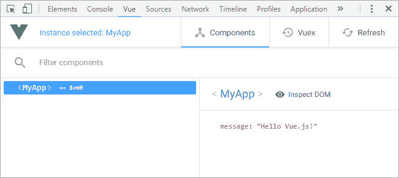
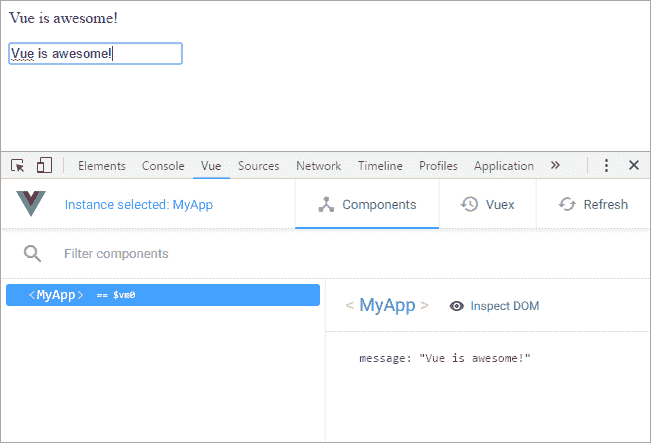

# 一、Vue 入门

Vue（[https://vuejs.org/](https://vuejs.org/) 是一个专注于构建 web 用户界面的 JavaScript 库。在本章中，我们将与图书馆会面，在简要介绍之后，我们将开始创建一个 web 应用程序，为我们将在本书中共同构建的不同项目奠定基础。

# 为什么选择另一个前端框架？

Vue 在 JavaScript 前端领域相对来说是一个新手，但对当前领先的库来说却是一个非常严峻的挑战。它简单、灵活、速度非常快，同时还提供了许多功能和可选工具，可以帮助您高效地构建现代 web 应用程序。它的创建者*埃文·尤*称之为**渐进式框架**：

*   Vue 是可逐步采用的，其核心库侧重于用户界面，可在现有项目中使用
*   您可以制作小型原型，一直到大型复杂的 web 应用程序
*   Vue 是平易近人的——初学者可以很容易地找到这个库，而经过确认的开发人员可以很快提高工作效率

Vue 大致遵循模型-视图-视图-模型体系结构，这意味着视图（用户界面）和模型（数据）是分开的，而视图模型（Vue）是两者之间的中介。它会自动处理更新，并且已经为您进行了优化。因此，您不必指定视图的一部分何时更新，因为 Vue 将选择正确的方式和时间进行更新。

该库还从其他类似库（如 React、Angular 和 Polymer）中获得灵感。以下是其核心功能的概述：

*   需要一个能够自动更新用户界面的反应式数据系统，它具有轻量级的虚拟 DOM 引擎和最小的优化工作
*   灵活的视图声明——艺术家友好的 HTML 模板、JSX（JavaScript 内部的 HTML）或 hyperscript 呈现函数（纯 JavaScript）
*   具有可维护和可重用组件的可组合用户界面
*   提供路由、状态管理、脚手架和更高级功能的官方配套库，使 Vue 成为一个不固执己见但充分充实的前端框架

# 有趋势的项目

*Evan You*于 2013 年开始在谷歌工作时使用 Angular 开发 Vue 的第一个原型。最初的目标是拥有 Angular 的所有酷特性，比如数据绑定和数据驱动的 DOM，但是没有额外的概念，这些概念使得这个框架固执己见，难以学习和使用。

第一次公开发布于 2014 年 2 月，在发布的第一天就立即取得了成功，HackerNews frontpage、`/r/javascript`位居榜首，官方网站上有 10 万次独特访问。

第一个主要版本 1.0 于 2015 年 10 月发布，到那年年底，npm 下载量猛增至 382k ytd，GitHub 存储库获得 11k 星星，官方网站拥有 363k 独立访客，流行的 PHP 框架 Laravel 选择 Vue 作为其官方前端库，而不是 React。

第二个主要版本 2.0 于 2016 年 9 月发布，具有新的基于 DOM 的虚拟渲染器和许多新功能，如服务器端渲染和性能改进。这是我们将在本书中使用的版本。它现在是最快的前端库之一，根据与 React 团队（[的比较，它的性能甚至超过 Reacthttps://vuejs.org/v2/guide/comparison](https://vuejs.org/v2/guide/comparison) ）。在撰写本书时，Vue 是 GitHub 上第二大最受欢迎的前端库，拥有 72k 颗星星，仅次于 React，领先 Angular 1（[https://github.com/showcases/front-end-javascript-frameworks](https://github.com/showcases/front-end-javascript-frameworks) ）。

该库在路线图上的下一个演变包括与 Vue 本机库（如 Weex 和 NativeScript）的更多集成，以使用 Vue 创建本机移动应用程序，以及新功能和改进。

如今，许多公司都在使用 Vue，如微软、Adobe、阿里巴巴、百度、小米、Expedia、任天堂和 GitLab。

# 兼容性要求

Vue 没有任何依赖性，可以在任何符合 ECMAScript 5 最低要求的浏览器中使用。这意味着它与 InternetExplorer8 或更低版本不兼容，因为它需要相对较新的 JavaScript 功能，如[T0]，而在较旧的浏览器上无法进行多填充。

在本书中，我们使用 JavaScript 版本 ES2015（以前的 ES6）编写代码，因此在前几章中，您将需要一个现代浏览器来运行示例（如 Edge、Firefox 或 Chrome）。在某个时候，我们将引入一个名为*Babel*的编译器，它将帮助我们使代码与旧浏览器兼容。

# 一分钟设置

无需更多的麻烦，让我们开始创建我们的第一个 Vue 应用程序，并进行非常快速的设置。Vue 足够灵活，可以用一个简单的[T0]标记包含在任何网页中。让我们创建一个包含库的非常简单的网页，其中包含一个简单的`div`元素和另一个`script`标记：

```js
<html>
<head>
  <meta charset="utf-8">
  <title>Vue Project Guide setup</title>
</head>
<body>

  <!-- Include the library in the page -->
  <script src="https://unpkg.com/vue/dist/vue.js"></script>

  <!-- Some HTML -->
  <div id="root">
    <p>Is this an Hello world?</p>
  </div>

  <!-- Some JavaScript -->
  <script>
  console.log('Yes! We are using Vue version', Vue.version)
  </script>

</body>
</html>
```

在浏览器控制台中，我们应该有如下内容：

```js
Yes! We are using Vue version 2.0.3
```

正如您在前面的代码中所看到的，库公开了一个`Vue`对象，该对象包含我们使用它所需的所有特性。我们现在准备出发了。

# 创建应用程序

目前，我们的网页上没有运行任何 Vue 应用程序。整个库基于**Vue 实例**，它们是视图和数据之间的中介。因此，我们需要创建一个新的 Vue 实例来启动我们的应用程序：

```js
// New Vue instance
var app = new Vue({
  // CSS selector of the root DOM element
  el: '#root',
  // Some data
  data () {
    return {
      message: 'Hello Vue.js!',
    }
  },
})
```

使用[T0]关键字调用 Vue 构造函数以创建新实例。它有一个参数——选项对象。它可以有多个属性（称为选项），我们将在下面的章节中逐步发现。目前，我们只使用其中的两个。

使用`el`选项，我们使用 CSS 选择器告诉 Vue 在网页上的何处添加（或“装载”）实例。在本例中，我们的实例将使用`<div id="root">`DOM 元素作为其根元素。我们也可以使用 Vue 实例的`$mount`方法，而不是`el`选项：

```js
var app = new Vue({
  data () {
    return {
      message: 'Hello Vue.js!',
    }
  },
})
// We add the instance to the page
app.$mount('#root')
```

Most of the special methods and attributes of a Vue instance start with a dollar character.

我们还将使用包含字符串的`message`属性初始化`data`选项中的一些数据。现在 Vue 应用程序正在运行，但它还没有发挥多大作用。

You can add as many Vue apps as you like on a single web page. Just create a new Vue instance for each of them and mount them on different DOM elements. This comes in handy when you want to integrate Vue in an existing project.

# DevTools 视图

Chrome 上有一个官方的 Vue 调试器工具，它是一个名为 Vue.js devtools 的扩展。它可以帮助您查看应用程序的运行情况，以帮助您调试代码。您可以从 Chrome 网络商店（[下载 https://chrome.google.com/webstore/search/vue](https://chrome.google.com/webstore/search/vue) 或从 Firefox 插件注册表（[https://addons.mozilla.org/en-US/firefox/addon/vue-js-devtools/?src=ss](https://addons.mozilla.org/en-US/firefox/addon/vue-js-devtools/?src=ss) ）。

对于 Chrome 版本，您需要设置一个附加设置。在扩展设置中，启用“允许访问文件 URL”，以便在从本地驱动器打开的网页上检测 Vue：


在您的网页上，使用*F12*快捷方式（或 OSX 上的*Shift*+*命令*+*c*打开 Chrome 开发工具）并搜索 Vue 选项卡（它可能隐藏在更多工具……下拉列表中）。一旦打开它，您就可以看到一个树，其中包含按约定命名为 Root 的 Vue 实例。如果单击它，侧栏将显示实例的属性：


You can drag and drop the `devtools` tab to your liking. Don't hesitate to place it among the first tabs, as it will be hidden in the page where Vue is not in development mode or is not running at all.

您可以使用`name`选项更改实例的名称：

```js
var app = new Vue({
  name: 'MyApp',
  // ...
})
```

这将帮助您了解您的实例在 devtools 中的位置，同时您还将拥有更多：



# 模板使您的 DOM 动态化

使用 Vue，我们可以使用多个系统来编写视图。现在，我们将从模板开始。模板是描述视图的最简单的方法，因为它看起来很像 HTML，但是有一些额外的语法使 DOM 可以很容易地动态更新。

# 显示文本

我们将看到的第一个模板特性是**文本插值**，它用于在我们的网页中显示动态文本。文本插值语法是一对双大括号，包含任何类型的 JavaScript 表达式。当 Vue 处理模板时，其结果将替换插值。将`<div id="root">`元件更换为以下部件：

```js
<div id="root">
  <p>{{ message }}</p>
</div>
```

本例中的模板有一个`<p>`元素，其内容是`message`JavaScript 表达式的结果。它将返回实例的 message 属性的值。现在，您的 web 页面上应该显示一个新文本--Hello Vue.js！。看起来不多，但是 Vue 在这里为我们做了很多工作——我们现在有了连接数据的 DOM。

要演示这一点，请打开浏览器控制台并更改[T0]值，然后按键盘上的[T1]回车[T2]：

```js
app.message = 'Awesome!'
```

消息已更改。这称为**数据绑定**。这意味着，只要数据发生更改，Vue 就可以自动更新 DOM，而无需您的部件提供任何信息。该库包括一个非常强大和高效的反应系统，它可以跟踪您的所有数据，并能够在发生变化时更新所需内容。所有这一切确实非常快。

# 使用指令添加基本交互

让我们为原本相当静态的应用程序添加一些交互性，例如，允许用户更改显示的消息的文本输入。我们可以在具有称为**指令**的特殊 HTML 属性的模板中实现这一点。

All the directives in Vue start with `v-` and follow the kebab-case syntax. That means you should separate the words with a dash. Remember that HTML attributes are case insensitive (whether they are uppercase or lowercase doesn't matter).

这里需要的指令是`v-model`，它将`<input>`元素的值与`message`数据属性绑定。在模板中添加一个具有`v-model="message"`属性的新`<input>`元素：

```js
<div id="root">
  <p>{{ message }}</p>
  <!-- New text input -->
  <input v-model="message" />
</div>
```

Vue 现在将在输入值更改时自动更新`message`属性。您可以播放输入内容，以验证文本在键入时是否更新，以及 devtools 中的值是否更改：



Vue 中还有更多可用的指令，您甚至可以创建自己的指令。别担心，我们将在后面的章节中介绍这一点。

# 总结

在本章中，我们快速建立了一个网页，开始使用 Vue，并编写了一个简单的应用程序。我们创建了一个 Vue 实例以在页面上装载 Vue 应用程序，并编写了一个模板以使 DOM 动态化。在这个模板中，由于文本插值，我们使用了一个 JavaScript 表达式来显示文本。最后，我们添加了一些与输入元素的交互，我们使用[T0]指令将其绑定到数据。

在下一章中，我们将使用 Vue 创建第一个真正的 web 应用程序——一个Markdown笔记本。我们将需要更多的 Vue 超级大国将这个应用程序的开发变成一个有趣和快速的体验。