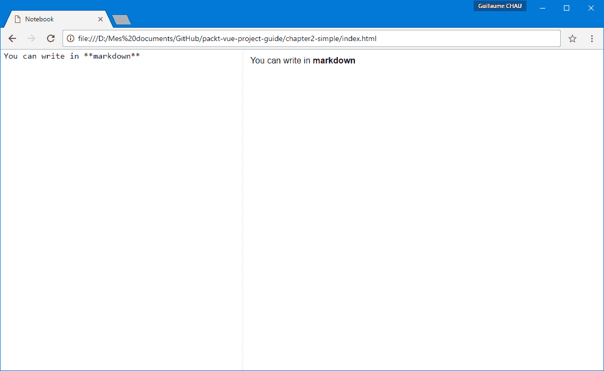
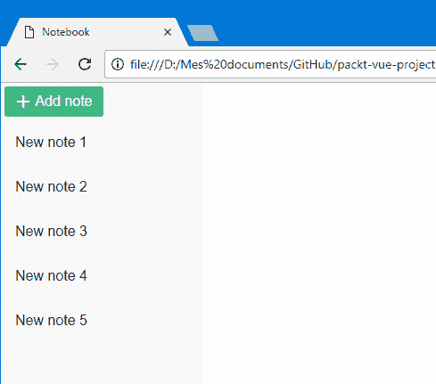
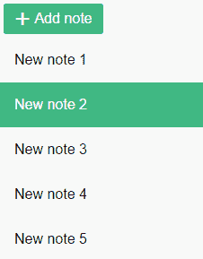
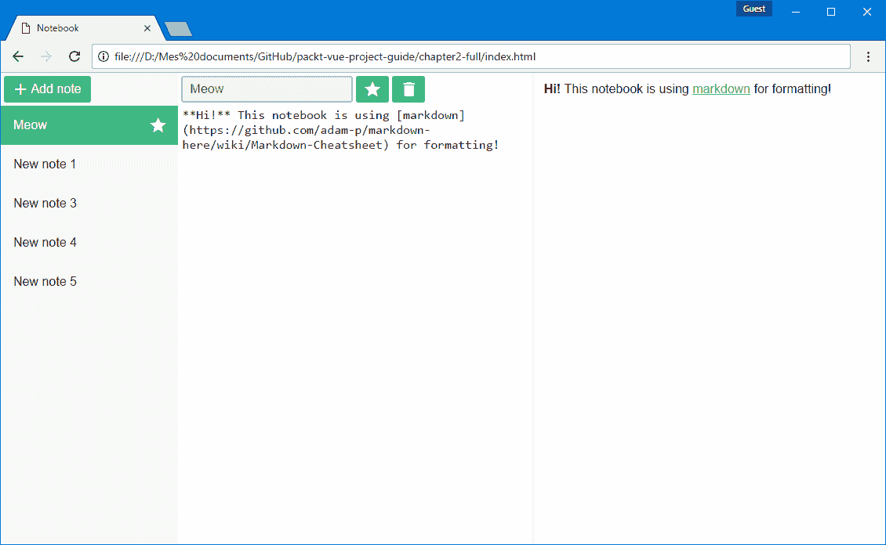
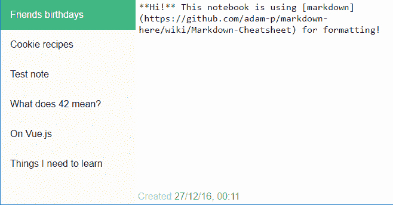

# 项目 1-降价笔记本

我们将创建的第一个应用程序是一个降价笔记本，以逐步的方式使用几个 Vue 功能。我们将重用我们在[第 1 章](1.html)、*Vue 入门*中看到的内容，并在其上添加更多元素，如有用的指令、用户交互事件、更多实例选项和流程值过滤器。

在开始编写代码之前，让我们先谈谈应用程序并回顾一下我们的目标：

*   笔记本应用程序将允许用户以降价方式写笔记
*   降价将实时预览
*   用户可以添加任意数量的注释
*   用户下次访问应用程序时，将恢复笔记

为此，我们将用户界面分为三个部分：

*   中间的主要部分与注释编辑器
*   右窗格，用于预览当前节点的降价
*   左侧窗格，包含注释列表和添加新注释的按钮

以下是本章末尾的内容：


# 基本注释编辑器

我们将从一个非常简单的 markdown note 应用程序开始，它只在左侧显示一个文本编辑器，在右侧显示一个 markdown 预览。然后，我们将把它变成一个支持多笔记的完整笔记本。

# 建立项目

对于本项目，我们将准备好几个文件，以便开始：

1.  首先，下载*简单笔记本*项目文件并将其解压缩到同一文件夹中。打开`index.html`文件，添加一个具有`notebook`ID 的`div`元素和一个具有`main`类的嵌套`section`元素。文件中应包含以下内容：

```js
      <html>
      <head>
        <title>Notebook</title>
        <!-- Icons & Stylesheets -->
        <link href="https://fonts.googleapis.com/icon?                   
        family=Material+Icons" rel="stylesheet">
        <link rel="stylesheet" href="style.css" />
      </head>
      <body>
        <!-- Include the library in the page -->
        <script src="https://unpkg.com/vue/dist/vue.js"></script>

        <!-- Notebook app -->
        <div id="notebook">

          <!-- Main pane -->
          <section class="main">

          </section>

        </div>

        <!-- Some JavaScript -->
        <script src="script.js"></script>
      </body>
      </html>
```

2.  现在，打开`script.js`文件添加一些 JavaScript。正如您在[第 1 章](1.html)*Vue 入门*中所做的，使用 Vue 构造函数在`#notebook`元素上创建一个 Vue 实例：

```js
      // New VueJS instance
      new Vue({
        // CSS selector of the root DOM element
        el: '#notebook',
      })
```

3.  然后，添加一个名为`content`的数据属性，该属性将保存注释的内容：

```js
      new Vue({
        el: '#notebook',

        // Some data
        data () {
          return {
            content: 'This is a note.',
          }
        },
      })
```

现在，您已经准备好创建第一个真正的 Vue 应用程序。

# 笔记编辑

现在我们已经运行了应用程序，让我们添加文本编辑器。我们将使用一个简单的`textarea`元素和[第 1 章](1.html)*中看到的`v-model`指令，开始使用 Vue*。

创建一个`section`元素并将`textarea`放在里面，然后将`v-model`指令绑定到我们的`content`属性：

```js
<!-- Main pane -->
<section class="main">
  <textarea v-model="content"></textarea>
</section>
```

现在，如果你改变文本；在便笺编辑器中，`content`的值应该在 devtools 中自动偶然出现。

The `v-model` directive is not limited to text inputs. You can also use it in other form elements, such as checkboxes, radio buttons, or even custom components, as we will see later in the book.

# 预览窗格

为了将注释标记编译成有效的 HTML，我们需要一个名为 Marked（[的附加库 https://www.npmjs.com/package/marked](https://www.npmjs.com/package/marked) ：

1.  在引用 Vue 的[T0]标记后面的页面中包括库：

```js
      <!-- Include the library in the page -->
      <script src="https://unpkg.com/vue/dist/vue.js"></script>
      <!-- Add the marked library: -->
      <script src="https://unpkg.com/marked"></script>
```

`marked`非常容易使用——只需使用标记文本调用它，它将返回相应的 HTML。

2.  请使用一些标记文字尝试库：

```js
      const html = marked('**Bold** *Italic* [link]   
      (http://vuejs.org/)')
      console.log(html)
```

浏览器控制台中应具有以下输出：

```js
<p><strong>Bold</strong> <em>Italic</em>
<a href="http://vuejs.org/">link</a></p>
```

# 计算属性

Vue 的一个非常强大的功能是**计算属性**。它允许我们定义新的属性，这些属性可以组合任意数量的属性并使用转换，例如将标记字符串转换为 HTML——这就是为什么它的值是由函数定义的。以下特征具有计算属性：

*   缓存该值，以便在不需要时函数不会重新运行，从而防止无用的计算
*   当函数中使用的属性发生更改时，它会根据需要自动更新
*   计算属性可以像任何属性一样使用（并且可以在其他计算属性中使用计算属性）
*   在应用程序中的某个地方真正使用它之前，它不会被计算出来

这将帮助我们自动将注释标记转换为有效的 HTML，以便实时显示预览。我们只需要在`computed`选项中声明我们的计算属性：

```js
// Computed properties
computed: {
  notePreview () {
    // Markdown rendered to HTML
    return marked(this.content)
  },
},
```

# 文本插值转义

让我们尝试使用文本插值在新窗格中显示注释：

1.  使用`preview`类创建一个`<aside>`元素，它显示我们的`notePreview`计算属性：

```js
      <!-- Preview pane -->
      <aside class="preview">
        {{ notePreview }}
      </aside>
```

我们现在应该在应用程序的右侧显示预览窗格。如果在“注释编辑器”中键入一些文本，您应该会看到预览自动更新。但是，我们的应用程序存在一个问题，当您使用降价格式时会出现这个问题。

2.  尝试用[T0]将文本加粗，如下所示：

```js
      I'm in **bold**!
```

我们的 computed 属性应该以有效的 HTML 格式返回，并且应该在预览窗格中呈现一些粗体文本。相反，我们可以看到以下内容：

```js
I'm in <strong>bold</strong>!
```

我们刚刚发现，文本插值自动转义 HTML 标记。这是为了防止注入攻击并提高我们应用程序的安全性。幸运的是，有一种方法可以显示一些 HTML，稍后我们将看到。然而，这迫使您考虑使用它来包含可能有害的动态内容。

例如，您创建了一个评论系统，在该系统中，任何用户都可以编写一些文本在您的应用程序页面上发表评论。如果有人在他们的评论中写了一些 HTML，然后在页面中显示为有效的 HTML，该怎么办？他们可能会添加一些恶意 JavaScript 代码，你的应用程序的所有访问者都会受到攻击。这称为跨站点脚本攻击，或 XSS 攻击。这就是为什么文本插值总是转义 HTML 标记。

It is not recommended to use `v-html` on content created by the users of the application. They could write malicious JavaScript code inside a `<script>` tag that would be executed. However, with normal text interpolation, you would be safe because the HTML would not be executed.

# 显示 HTML

既然我们知道出于安全原因，文本插值不能呈现 HTML，那么我们需要另一种呈现动态 HTML 的方法--`v-html`指令。就像我们在[第 1 章](1.html)中看到的`v-model`指令，*开始使用 Vue*一样，这是一个特殊属性，为我们的模板添加了一个新功能。这个可以将任何有效的 HTML 字符串呈现到我们的应用程序中。只需将字符串作为值传递，如下所示：

```js
<!-- Preview pane -->
<aside class="preview" v-html="notePreview">
</aside>
```

现在，降价预览应该可以正常工作了，HTML 被动态地插入到我们的页面中。

Any content inside our `aside` element will be replaced by the value of the `v-html` directive. You can use this to put placeholder contents inside.

以下是您应该得到的结果：



There is an equivalent directive for text interpolation, `v-text`, which behaves like `v-html`, but escapes the HTML tags just like classic text interpolations.

# 保存便条

现在，如果你关闭或刷新应用程序，你的便笺将丢失。下次我们打开应用程序时，最好保存并加载它。为此，我们将使用大多数浏览器提供的标准`localStorage`API。

# 观察变化

我们希望在便笺内容更改后尽快保存便笺。这就是为什么我们需要在`content`数据属性更改时调用的东西，例如**观察者**。让我们在应用程序中添加一些观察者！

1.  向 Vue 实例添加一个新的`watch`选项。

此选项是一个字典，其中键是监视属性的名称，值是监视选项对象。这个对象必须有一个`handler`属性，它要么是函数，要么是方法的名称。处理程序将接收两个参数——被监视属性的新值和旧值。

下面是一个简单处理程序的示例：

```js
new Vue({
  // ...

  // Change watchers
  watch: {
    // Watching 'content' data property
    content: {
      handler (val, oldVal) {
        console.log('new note:', val, 'old note:', oldVal)
      },
    },
  },
})
```

现在，在“注释编辑器”中键入时，您应该会在浏览器控制台中看到以下消息：

```js
new note: This is a **note**! old note: This is a **note**
```

这将非常有助于在便笺更改时保存便笺。

您可以在`handler`旁边使用另外两个选项：

*   `deep`是一个布尔值，它告诉 Vue 递归地监视嵌套对象内部的更改。这在这里没有用处，因为我们只观察字符串。
*   `immediate`也是一个布尔值，强制立即调用处理程序，而不是等待第一次更改。在我们的例子中，这不会产生有意义的影响，但我们可以尝试记录其影响。

The default value of these options is `false`, so if you don't need them, you can skip them entirely.

2.  将立即选项添加到观察者：

```js
      content: {
        handler (val, oldVal) {
          console.log('new note:', val, 'old note:', oldVal)      
        },
        immediate: true,
      },
```

刷新应用程序后，您应该会在浏览器控制台中看到以下消息弹出：

```js
new note: This is a **note** old note: undefined
```

不出所料，注释的旧值是`undefined`，因为在创建实例时调用了 watcher 处理程序。

3.  我们在这里并不真正需要此选项，因此请继续删除它：

```js
      content: {
        handler (val, oldVal) {
          console.log('new note:', val, 'old note:', oldVal)
        },
      },
```

由于我们没有使用任何选项，我们可以通过跳过包含`handler`选项的对象来使用更短的语法：

```js
content (val, oldVal) {
  console.log('new note:', val, 'old note:', oldVal)
},
```

This is the most common syntax for watchers when you don't need other options, such as `deep` or `immediate`.

4.  让我们保存我们的便条。使用`localStorage.setItem()`API 存储注释内容：

```js
      content (val, oldVal) {
        console.log('new note:', val, 'old note:', oldVal)
        localStorage.setItem('content', val)
      },
```

若要检查此操作是否有效，请编辑注释并在“应用程序”或“存储”选项卡中打开浏览器 devtools（取决于您的浏览器），您应该在“本地存储”部分下找到一个新条目：


# 使用一种方法

有一个很好的编码原则说*不要重复自己*，我们真的应该遵循它。这就是为什么我们可以在名为**方法**的可重用函数中编写一些逻辑。让我们将我们的保存逻辑转换为一个：

1.  在 Vue 实例中添加一个新的`methods`选项，并在那里使用`localStorage`API：

```js
      new Vue({
        // ...

        methods: {
          saveNote (val) {
            console.log('saving note:', val)
            localStorage.setItem('content', val)
          },
        },
      })
```

2.  我们现在可以在观察者的`handler`选项中使用方法名称：

```js
      watch: {
        content: {
          handler: 'saveNote',
        },
      },
```

或者，我们可以将其与较短的语法一起使用：

```js
watch: {
  content: 'saveNote',
},
```

# 访问 Vue 实例

在方法内部，我们可以使用`this`关键字访问 Vue 实例。例如，我们可以调用另一个方法：

```js
methods: {
  saveNote (val) {
    console.log('saving note:', val)
    localStorage.setItem('content', val)
    this.reportOperation('saving')
  },
  reportOperation (opName) {
    console.log('The', opName, 'operation was completed!')
  },
},
```

这里，将从`contentChanged`方法调用`saveNote`方法。

我们还可以通过`this`访问我们的 Vue 实例的其他属性和特殊功能。我们可以删除`saveNote`参数，直接访问`content`数据属性：

```js
methods: {
  saveNote () {
    console.log('saving note:', this.content)
    localStorage.setItem('content', this.content)
  },
},
```

这也适用于我们在*观察变化*部分中创建的观察者处理程序：

```js
watch: {
  content (val, oldVal) {
    console.log('new note:', val, 'old note:', oldVal)
    console.log('saving note:', this.content)
    localStorage.setItem('content', this.content)
  },
},
```

Basically, you can access the Vue instance with `this` in any function bound to it: methods, handlers, and other hooks.

# 加载保存的便笺

既然我们每次更改便笺内容时都会保存它，那么我们需要在应用程序重新打开时恢复它。为此，我们将使用`localStorage.getItem()`API。在 JavaScript 文件末尾添加以下行：

```js
console.log('restored note:', localStorage.getItem('content'))
```

刷新应用程序时，您应该可以在浏览器控制台中看到打印的已保存备忘内容。

# 生命周期挂钩

要将 Notes 内容恢复到 Vue 实例中，首先想到的方法是在创建实例时设置 content data 属性。

每个 Vue 实例都遵循一个精确的生命周期，包括几个步骤——创建、装载到页面上、更新，最后销毁。例如，在创建步骤中，Vue 将使实例数据成为被动的。

Hooks are a specific set of functions that are automatically called at some point in time. They allow us to customize the logic of the framework. For example, we can call a method when a Vue instance is created.

我们有多个钩子可供使用，以在以下每个步骤发生时或之前执行逻辑：

*   `beforeCreate`：在创建 Vue 实例对象（例如，使用`new Vue({})`）时调用，但在 Vue 对其执行任何操作之前调用。
*   `created`：实例准备就绪并完全运行后调用。注意，此时实例还不在 DOM 中。
*   `beforeMount`：在网页上添加（或挂载）实例之前调用。
*   `mounted`：当实例在页面上且在 DOM 中可见时调用。
*   `beforeUpdate`：当实例需要更新时（通常是数据或计算属性发生变化时）调用。
*   `updated`：将数据更改应用到模板后调用。请注意，DOM 可能还不是最新的。
*   `beforeDestroy`：在实例被拆除之前调用。
*   `destroyed`：实例完全移除时调用。

现在，我们将只使用`created`钩子来恢复便笺内容。要添加生命周期挂钩，只需将具有相应名称的函数添加到 Vue 实例选项中：

```js
new Vue({
  // ...

  // This will be called when the instance is ready
  created () {
    // Set the content to the stored value
    // or to a default string if nothing was saved
    this.content = localStorage.getItem('content') || 'You can write in **markdown**'
  },
})
```

现在，当你刷新应用程序时；创建实例时会自动调用`created`钩子。这将把`content`数据属性值设置为恢复的结果，如果结果是错误的，则设置为`'You can write in **markdown**'`，以防我们以前没有保存任何内容。

In JavaScript, a value is falsy when equal to `false`, `0`, an empty string, `null`, `undefined`, or `NaN` (not a number). Here, the `localStorage.getItem()` function will return `null` if the corresponding key doesn't exist in the browser local storage data.

我们设置的观察者也被称为，因此便笺被保存，您应该在浏览器控制台中看到类似的内容：

```js
new note: You can write in **markdown** old note: This is a note
saving note: You can write in **markdown**
The saving operation was completed!
```

我们可以看到，当调用创建的钩子时，Vue 已经设置了数据属性及其初始值（这里，*这是一个注释*。

# 直接在数据中初始化

另一种方式是直接用还原值初始化`content`数据属性：

```js
new Vue({
  // ...

  data () {
    return {
      content: localStorage.getItem('content') || 'You can write in **markdown**',
    }
  },

  // ...
})
```

在前面的代码中，不会调用 watcher 处理程序，因为我们初始化了[T0]值，而不是更改它。

# 多音符

只有一个音符的笔记本没有多大用处，所以让我们把它变成一个多音符的笔记本。我们将在左侧添加一个新的侧面板，其中包含注释列表，以及一些额外的元素，例如用于重命名注释的文本字段和常用切换按钮。

# 注释列表

现在，我们将为包含注释列表的侧窗格奠定基础：

1.  在主节前面添加一个新的`aside`元素，该元素具有`side-bar`类：

```js
      <!-- Notebook app -->
      <div id="notebook">

        <!-- Sidebar -->
        <aside class="side-bar">
          <!-- Here will be the note list -->
        </aside>

        <!-- Main pane -->
        <section class="main">
      ...
```

2.  添加一个名为`notes`的新数据属性——它将是包含所有注释的数组：

```js
      data () {
        return {
          content: ...
          // New! A note array
          notes: [],
        }
      },
```

# 创建新注释的方法

我们的每个笔记都将是一个包含以下数据的对象：

*   `id`：这将是票据唯一标识符
*   `title`：这个；将包含列表中显示的注释的名称
*   `content`：这个；将是注释标记内容
*   `created`：这个；将是创建便笺的日期
*   `favorite`：这个；将是一个布尔值，允许将显示在列表顶部的注释标记为收藏夹

让我们添加一个创建新便笺的方法并将其命名为`addNote`，该方法将创建一个具有默认值的新便笺对象：

```js
methods:{
  // Add a note with some default content and select it
  addNote () {
    const time = Date.now()
    // Default new note
    const note = {
      id: String(time),
      title: 'New note ' + (this.notes.length + 1),
      content: '**Hi!** This notebook is using [markdown](https://github.com/adam-p/markdown-here/wiki/Markdown-Cheatsheet) for formatting!',
      created: time,
      favorite: false,
    }
    // Add to the list
    this.notes.push(note)
  },
}
```

我们采用当前时间（即自 1970 年 1 月 1 日 00:00:00 UTC 以来经过的毫秒数），这将是在每个音符上具有唯一标识符的完美方式。我们还设置了默认值，比如标题和一些内容，加上`created`日期和`favorite`；布尔型。最后，我们将注释添加到 notes 数组属性中。

# 按钮并单击带有 v-on 的事件

现在，我们需要一个按钮来调用这个方法。使用 toolbar 类在`div`元素中创建一个新的按钮元素：

```js
<aside class="side-bar">
  <!-- Toolbar -->
  <div class="toolbar">
    <!-- Add note button -->
    <button><i class="material-icons">add</i> Add note</button>
  </div>
</aside>
```

要在用户单击按钮时调用`addNote`方法，我们需要一个新指令--`v-on`。该值将是捕获事件时调用的函数，但它也希望参数知道要侦听哪个事件。但是，您可能会问，我们如何将参数传递给指令？这很简单！在指令名称后添加一个`:`字符，后跟参数。以下是一个例子：

```js
<button v-directive:argument="value">
```

在我们的例子中，我们使用事件名为参数的`v-on`指令，更具体地说，使用`click`事件。应该是这样的：

```js
<button v-on:click="callback">
```

我们的按钮应该在点击时调用`addNote`方法，所以继续修改我们前面添加的按钮：

```js
<button v-on:click="addNote"><i class="material-icons">add</i> Add note</button>
```

`v-on`指令有一个可选的特殊快捷方式，`@`字符允许您重写前面的指令；代码如下所示：

```js
<button @click="addNote"><i class="material-icons">add</i> Add note</button>
```

现在我们的按钮准备好了，请尝试添加一些注释。我们尚未在应用程序中看到它们，但您可以打开 devtools 并记录注释列表的更改：


# 使用 v-bind 绑定属性

如果工具提示显示“添加便笺”按钮上已有的便笺数量，这会很有帮助，不是吗？至少我们可以引入另一个有用的指令！

工具提示与 title HTML 属性一起添加。以下是一个例子：

```js
<button title="3 note(s) already">
```

但在这里，它只是一个静态文本，我们希望使其成为动态文本。谢天谢地，有一条指令允许我们将 JavaScript 表达式绑定到属性--`v-bind`。与[T1]指令一样，它需要一个参数，即目标属性的名称。

我们可以使用 JavaScript 表达式重写前面的示例，如下所示：

```js
<button v-bind:title="notes.length + ' note(s) already'">
```

现在，如果将鼠标光标停留在按钮上，您将获得注释数：


与`v-on`指令一样，`v-bind`有一个特殊的快捷语法（这两个指令都是最常用的指令）——您可以跳过`v-bind`部分，只将`:`字符与属性名放在一起。示例如下所示：

```js
<button :title="notes.length + ' note(s) already'">
```

JavaScript expressions bound with `v-bind` will re-evaluate automatically when needed and update the value of the corresponding attribute.

我们还可以将表达式移动到计算属性并使用它。计算的属性可以如下所示：

```js
computed: {
  ...

  addButtonTitle () {
    return notes.length + ' note(s) already'
  },
},
```

然后，我们将重写绑定属性，如下所示：

```js
<button :title="addButtonTitle">
```

# 显示带有 v-for 的列表

现在，我们将在工具栏下方显示注释列表。

1.  在工具栏的正下方，添加一个新的[T0]元素，其中；注释类别：

```js
      <aside class="side-bar">
        <div class="toolbar">
          <button @click="addNote"><i class="material-icons">add</i>        
          Add note</button>
        </div>
        <div class="notes">
          <!-- Note list here -->
        </div>
      </aside>
```

现在，我们想显示多个 div 元素的列表，每个注释一个。为了实现这一点，我们需要`v-for`指令。它采用一个特殊的表达式作为值，以`item of items`的形式，它将迭代`items`数组或对象，并为模板的这一部分公开一个`item`值。以下是一个例子：

```js
<div v-for="item of items">{{ item.title }}</div>
```

您也可以使用`in`关键字代替`of`：

```js
<div v-for="item in items">{{ item.title }}</div>
```

假设我们有以下数组：

```js
data () {
  return {
    items: [
      { title: 'Item 1' },
      { title: 'Item 2' },
      { title: 'Item 3' },
    ]
  }
}
```

最终渲染的 DOM 如下所示：

```js
<div>Item 1</div>
<div>Item 2</div>
<div>Item 3</div>
```

As you can see, the element on which you put the `v-for` directive is repeated in the DOM.

2.  让我们回到笔记本，在侧窗格中显示笔记。我们将它们存储在 notes 数据属性中，因此需要对其进行迭代：

```js
      <div class="notes">
        <div class="note" v-for="note of notes">{{note.title}}</div>
      </div>
```

我们现在应该在按钮下方显示注释列表：



使用按钮添加更多注释，您应该会看到列表正在自动更新！

# 选择音符

选择注释后，它将成为应用程序中间窗格和右侧窗格的上下文——文本编辑器修改其内容，预览窗格显示其格式标记。让我们实现这个行为！

1.  添加一个名为`selectedId`的新数据属性，该属性将保存所选便笺的 ID：

```js
      data () {
        return {
          content: localStorage.getItem('content') || 'You can write in         
          **markdown**',
          notes: [],
          // Id of the selected note
          selectedId: null,
        }
      },
```

We could have created a `selectedNote` property instead, holding the note object, but it would have made the saving logic more complex, with no benefit.

2.  我们需要一个新的方法，当我们点击列表中的注释以选择 ID 时将调用该方法。我们将其称为`selectNote`：

```js
      methods: {
        ...

        selectNote (note) {
          this.selectedId = note.id
        },
      }
```

3.  就像我们对 addnote 按钮所做的那样，我们将在列表中的每个 note 项上监听带有[T1]指令的[T0]事件：

```js
      <div class="notes">
        <div class="note" v-for="note of notes"         
        @click="selectNote(note)">{{note.title}}</div>
      </div>
```

现在，你应该看到；点击便笺时更新了`selectedId`数据属性。

# 当前说明

现在我们知道当前选择了哪个音符，我们可以替换我们在开始时创建的旧的`content`数据属性。如果有一个 computed 属性可以轻松访问所选便笺，这将非常有用，因此我们现在将创建一个：

1.  添加一个名为`selectedNote`的新计算属性，该属性返回的便笺 ID 与我们的`selectedId`属性匹配：

```js
      computed: {
        ...

        selectedNote () {
          // We return the matching note with selectedId
          return this.notes.find(note => note.id === this.selectedId)
        },
      }
```

`note => note.id === this.selectedId` is an arrow function from the ES2015 JavaScript version. Here, it takes a `note` argument and returns the result of the `note.id === this.selectedId` expression.

我们需要在代码中将旧的`content`数据属性替换为`selectedNote.content`。

2.  首先在模板中修改编辑器：

```js
      <textarea v-model="selectedNote.content"></textarea>
```

3.  然后，将`notePreview`计算属性更改为现在使用`selectedNote`：

```js
      notePreview () {
        // Markdown rendered to HTML
        return this.selectedNote ? marked(this.selectedNote.content) :          
        ''
      },
```

现在，当您在列表中单击选定注释时，文本编辑器和预览窗格将显示该注释。

您可以安全地删除`content`数据属性、它的观察者和`saveNote`方法，这些在应用程序中不再使用。

# 动态 CSS 类

当注释是注释列表中的选定注释时，最好添加一个`selected`CSS 类（例如，显示不同的背景色）。值得庆幸的是，Vue 有一个非常有用的技巧来帮助我们实现这一点，`v-bind`指令（其缩写为`:`字符）具有一些魔力，可以使 CSS 类的操作更容易。您可以传递字符串数组，而不是传递字符串：

```js
<div :class="['one', 'two', 'three']">
```

我们将在 DOM 中获得以下内容：

```js
<div class="one two three">
```

但是，最有趣的特性是，您可以传递一个对象，该对象的键是类名，其值是布尔值，用于确定是否应应用每个类。以下是一个例子：

```js
<div :class="{ one: true, two: false, three: true }">
```

此对象表示法将生成以下 HTML：

```js
<div class="one three">
```

在我们的例子中，我们希望仅当注释是所选的时才应用所选的类。因此，我们将简单地写如下：

```js
<div :class="{ selected: note === selectedNote }">
```

注释列表现在应如下所示：

```js
<div class="notes">
  <div class="note" v-for="note of notes" @click="selectNote(note)"
  :class="{selected: note === selectedNote}">{{note.title}}</div>
</div>
```

You can combine a static `class` attribute with a dynamic one. It is recommended that you put the nondynamic classes into the static attribute because Vue will optimize the static values.

现在，当您单击列表中的注释以选择它时，其背景将更改颜色：



# 带 v-if 的条件模板

在测试我们的变化之前，我们需要做最后一件事；如果未选择任何注释，则不应显示主窗格和预览窗格——对于用户来说，没有指向任何内容的空编辑器和预览窗格是没有意义的，这会使我们的代码崩溃，因为`selectedNote`将是`null`。谢天谢地，`v-if`指令可以在我们需要时动态地从模板中取出部分。它的工作原理与 JavaScript`if`关键字类似，但有一个条件。

在本例中，`loading`属性为 falsy 时，`div`元素将根本不在 DOM 中：

```js
<div v-if="loading">
  Loading...
</div>
```

还有另外两个有用的指令，`v-else`和`v-else-if`将按照您的预期工作：

```js
<div v-if="loading">
  Loading...
</div>

<div v-else-if="processing">
  Processing
</div>

<div v-else>
  Content here
</div>
```

回到我们的应用程序中，将`v-if="selectedNote"`条件添加到主窗格和预览窗格中，以便在选择注释之前不会将它们添加到 DOM 中：

```js
<!-- Main pane -->
<section class="main" v-if="selectedNote">
  ...
</section>

<!-- Preview pane -->
<aside class="preview" v-if="selectedNote" v-html="notePreview">
</aside>
```

这里的重复有点不幸，但是 Vue 已经涵盖了我们。您可以用一个特殊的`<template>`标记将这两个元素包围起来，该标记的作用类似于 JavaScript 中的大括号：

```js
<template v-if="selectedNote">
  <!-- Main pane -->
  <section class="main">
    ...
  </section>

  <!-- Preview pane -->
  <aside class="preview" v-html="notePreview">
  </aside>
</template>
```

此时，应用程序应如下所示：


The `<template>` tag will not be present in the DOM; it is more like a ghost element that is useful to regroup real elements together.

# 使用 deep 选项保存注释

现在，我们希望在会话之间保存和恢复笔记，就像我们对笔记内容所做的那样：

1.  让我们创建一个新的`saveNotes`方法。由于我们无法将对象数组直接保存到`localStorage`API 中（它只接受字符串），我们需要先用`JSON.stringify`将其转换为 JSON：

```js
      methods: {
        ...

        saveNotes () {
          // Don't forget to stringify to JSON before storing
          localStorage.setItem('notes', JSON.stringify(this.notes))
          console.log('Notes saved!', new Date())
        },
      },
```

就像我们对前面的`content`属性所做的那样，我们将观察`notes`数据属性的变化，以触发`saveNotes`方法。

2.  在“监视”选项中添加监视程序：

```js
      watch: {
        notes: 'saveNotes',
      }
```

现在，如果您尝试添加一些任务，您应该在控制台中看到如下内容：

```js
Notes saved! Mon Apr 42 2042 17:40:23 GMT+0100 (Paris, Madrid)
Notes saved! Mon Apr 42 2016 17:42:51 GMT+0100 (Paris, Madrid)
```

3.  更改`data`钩子中`notes`属性的初始化，从`localStorage`加载存储列表：

```js
      data () {
        return {
          notes: JSON.parse(localStorage.getItem('notes')) || [],
          selectedId: null,
        }
      },
```

刷新页面时，应恢复新添加的注释。但是，如果您尝试更改一个注释的内容，您会注意到它不会触发`notes`观察者，因此注释不会被保存。这是因为，默认情况下，观察者只观察对目标对象的直接更改——简单值的赋值、添加、删除或移动数组中的项。例如，默认情况下将检测以下操作：

```js
// Assignment
this.selectedId = 'abcd'

// Adding or removing an item in an array
this.notes.push({...})
this.notes.splice(index, 1)

// Sorting an array
this.notes.sort(...)
```

但是，所有其他操作（如以下操作）都不会触发观察者：

```js
// Assignment to an attribute or a nested object
this.myObject.someAttribute = 'abcd'
this.myObject.nestedObject.otherAttribute = 42

// Changes made to items in an array
this.notes[0].content = 'new content'
```

在这种情况下，您需要向观察者添加`deep`选项：

```js
watch: {
  notes: {
    // The method name
    handler: 'saveNotes',
    // We need this to watch each note's properties inside the array
    deep: true,
  },
}
```

这样，Vue 还可以递归地观察`notes`数组中的对象和属性。现在，如果您在文本编辑器中键入，则应保存注释列表，`v-model`指令将修改所选注释的`content`属性，并且使用`deep`选项，将触发观察者。

# 保存所选内容

如果我们的应用程序可以选择上次选中的便笺，那将非常方便。我们只需要存储并加载用于存储所选便笺 ID 的`selectedId`数据属性。这是正确的！我们将再次使用监视程序触发保存：

```js
watch: {
  ...

  // Let's save the selection too
  selectedId (val) {
    localStorage.setItem('selected-id', val)
  },
}
```

此外，我们将在初始化属性时恢复该值：

```js
data () {
  return {
    notes: JSON.parse(localStorage.getItem('notes')) || [],
    selectedId: localStorage.getItem('selected-id') || null,
  }
},
```

准备好了！现在，当你刷新应用程序时，它应该与你离开时的样子一模一样，并选择相同的注释。

# “注释”工具栏中包含附加项

我们的应用程序中仍然缺少一些功能，例如删除或重命名所选便笺。我们将把它们添加到一个新的工具栏中，就在注释文本编辑器的上方。继续使用`toolbar`类创建一个新的`div`元素；在主要部分内：

```js
<!-- Main pane -->
<section class="main">
  <div class="toolbar">
    <!-- Our toolbar is here! -->
  </div>
  <textarea v-model="selectedNote.content"></textarea>
</div>
```

我们将在此工具栏中添加三个新功能：

*   重命名便笺
*   删除注释
*   将便笺标记为收藏夹

# 重命名便笺

第一个工具栏功能也是最简单的。它仅由一个文本输入组成，该文本输入通过`v-model`指令绑定到所选注释的`title`属性。

在我们刚刚创建的工具栏`div`元素中，添加这个`input`元素，带有`v-model`指令和`placeholder`通知用户其功能：

```js
<input v-model="selectedNote.title" placeholder="Note title" />
```

您应该在文本编辑器上方有一个功能性重命名字段，并在键入时在注释列表中看到注释名称自动更改：


Since we set the `deep` option on the `notes` watcher, the note list will be saved whenever you change the name of the selected note.

# 删除注释

第二个功能更复杂，因为我们需要一种新方法：

1.  在重命名文本输入后添加一个`button`元素：

```js
      <button @click="removeNote" title="Remove note"><i        
      class="material-icons">delete</i></button>
```

如您所见，我们使用`v-on`速记（即`@`字符）收听`click`事件，该字符调用我们将很快创建的`removeNote`方法。此外，我们将适当的图标作为按钮内容。

2.  添加一个新的`removeNote`方法，要求用户确认，然后使用`splice`标准数组方法从`notes`数组中删除当前选择的便笺：

```js
      removeNote () {
        if (this.selectedNote && confirm('Delete the note?')) {
          // Remove the note in the notes array
          const index = this.notes.indexOf(this.selectedNote)
          if (index !== -1) {
            this.notes.splice(index, 1)
          }
        }
      }
```

现在，如果尝试删除当前便笺，应注意以下三种情况：

*   该注释将从左侧的注释列表中删除
*   文本编辑器和预览窗格将隐藏
*   注释列表已根据浏览器控制台保存

# 喜爱的音符

最后一个工具栏功能是最复杂的。我们想先用最喜欢的笔记对笔记列表重新排序。为此，每个音符都有一个`favorite`布尔属性，可以通过按钮进行切换。除此之外，注释列表中将显示一个星形图标，以显示哪些注释最受欢迎，哪些注释不受欢迎：

1.  首先，在删除注释之前向工具栏添加另一个按钮；按钮：

```js
      <button @click="favoriteNote" title="Favorite note"><i        
      class="material-icons">{{ selectedNote.favorite ? 'star' :               
      'star_border' }}</i></button>
```

再一次，我们使用`v-on`速记来调用下一步创建的`favoriteNote`方法。我们还将显示一个图标，具体取决于所选便笺的`favorite`属性值——如果是`true`，则显示一个全明星，如果不是，则显示一个轮廓。

最终结果如下所示：


在左侧，有一个按钮，用于显示该便笺何时不是收藏夹，在右侧，用于显示该便笺何时是收藏夹，单击该便笺后。

2.  让我们创建一个非常简单的`favoriteNote`方法，只反转`favorite`的值；选定注释上的布尔属性：

```js
      favoriteNote () {
        this.selectedNote.favorite = !this.selectedNote.favorite
      },
```

我们可以用 XOR 运算符重写它：

```js
favoriteNote () {
  this.selectedNote.favorite = this.selectedNote.favorite ^ true
},
```

这可以很好地缩短，如下所示：

```js
favoriteNote () {
  this.selectedNote.favorite ^= true
},
```

现在，您应该能够切换“收藏夹”按钮，但它还没有任何实际效果。

我们需要以两种方式对注释列表进行排序——首先，我们按照它们的创建日期对所有注释进行排序，然后对它们进行排序，以便将最喜欢的注释放在开头。谢天谢地，我们有一个非常方便的标准数组方法--`sort`。它需要一个参数，这是一个具有两个参数的函数——两个要比较的项。结果是一个数字，如下所示：

*   `0`，如果两项处于相同位置
*   `-1`，如果第一项在第二项之前
*   `1`，如果第一项在第二项之后

You are not limited to the `1` number, since you can return any arbitrary number, positive or negative. For example, if you return `-42`, it will be the same as `-1`.

第一个排序操作将通过以下简单的减法代码实现：

```js
sort((a, b) => a.created - b.created)
```

在这里，我们比较两个注释的创建日期，我们将它们存储为毫秒数，这要感谢`Date.now()`。我们只是减去它们，如果`b`是在`a`之后创建的，那么我们得到一个负数；如果`a`是在`b`之后创建的，那么我们得到一个正数。

第二种排序是通过两个三元操作完成的：

```js
sort((a, b) => (a.favorite === b.favorite)? 0 : a.favorite? -1 : 1)
```

如果两个音符都是最喜欢的，我们不会改变它们的位置。如果`a`是最喜欢的，我们返回一个负数，将其置于`b`之前。在另一种情况下，我们返回一个正数，因此在列表中，`b`放在`a`之前。

最好的方法是创建一个名为`sortedNotes`的计算属性，该属性将由 Vue 自动更新和缓存。

3.  创建新的`sortedNotes`计算属性：

```js
      computed: {
        ...

        sortedNotes () {
          return this.notes.slice()
            .sort((a, b) => a.created - b.created)
            .sort((a, b) => (a.favorite === b.favorite)? 0
              : a.favorite? -1    
              : 1)
        },
      }
```

Since `sort` modifies the source array directly, we should create a copy of it with the `slice` method. This will prevent unwanted triggers of the `notes` watcher.

现在，我们可以在用于显示列表的`v-for`指令中简单地将`notes`与`sortedNotes`交换——它现在将按照我们的预期自动对注释进行排序：

```js
<div v-for="note of sortedNotes">
```

我们也可以使用前面介绍的`v-if`指令，仅当便笺是收藏夹时才显示星形图标：

```js
<i class="icon material-icons" v-if="note.favorite">star</i>
```

4.  使用前面的更改修改注释列表：

```js
      <div class="notes">
        <div class="note" v-for="note of sortedNotes"
        :class="{selected: note === selectedNote}"
        @click="selectNote(note)">
          <i class="icon material-icons" v-if="note.favorite">
          star</i> 
          {{note.title}}
        </div>
      </div>
```

该应用程序现在应该如下所示：



# 状态栏

我们将添加到应用程序的最后一个部分是一个状态栏，显示在文本编辑器的底部，其中包含一些有用的信息——便笺的创建日期、行数、字数和字符数。

使用`toolbar`和`status-bar`类创建一个新的`div`元素，并将其放置在`textarea`元素之后：

```js
<!-- Main pane -->
<section class="main">
  <div class="toolbar">
    <!-- ... -->
  </div>
  <textarea v-model="selectedNote.content"></textarea>
  <div class="toolbar status-bar">
    <!-- The new status bar here! -->
  </div>
</section>
```

# 使用筛选器创建日期

现在，我们将在状态栏中显示所选便笺的创建日期。

1.  在状态栏`div`元素中，创建一个新的`span`元素，如下所示：

```js
      <span class="date">
        <span class="label">Created</span>
        <span class="value">{{ selectedNote.created }}</span>
      </span>
```

现在，如果查看浏览器中显示的结果，您应该会看到表示注释创建日期的毫秒数：


这一点都不友好！

我们需要一个新的库来帮助我们将日期格式化为更可读的结果--`momentjs`，这是一个非常流行的时间和日期操纵库。

2.  将其包括在页面中，就像我们为`marked`库所做的那样：

```js
      <script src="https://unpkg.com/moment"></script>
```

要格式化日期，我们将首先创建一个`moment`对象，然后使用如下所示的`format`方法：

```js
      moment(time).format('DD/MM/YY, HH:mm')
```

现在是为本章介绍 Vue 的最后一个功能的时候了，**过滤器**。这些函数在模板中使用，以便在数据显示或传递给属性之前轻松处理数据。例如，我们可以使用大写过滤器将字符串转换为大写字母，或者使用货币过滤器在模板中动态转换货币。函数接受一个参数——过滤器要处理的值。它返回处理后的值。

因此，我们将创建一个新的`date`过滤器，该过滤器将采用日期时间，并将其格式化为人类可读的格式。

3.  使用`Vue.filter`全局方法注册此筛选器（例如，在文件开头的 Vue 实例创建代码之外）：

```js
 Vue.filter('date', time => moment(time)
        .format('DD/MM/YY, HH:mm'))
```

现在，我们可以在模板中使用这个`date`过滤器来显示日期。语法是我们之前使用的 JavaScript 表达式，后跟管道操作符和过滤器名称：

```js
{{ someDate | date }}
```

如果`someDate`包含日期，它将在 DOM 中输出类似的内容，这与我们之前定义的`DD/MM/YY, HH:mm`格式有关：

```js
12/02/17, 12:42
```

4.  将 stat 模板更改为：

```js
      <span class="date">
        <span class="label">Created</span>
        <span class="value">{{ selectedNote.created | date }}</span>
      </span>
```

我们应该在我们的应用程序中很好地格式化和显示日期：



# 文本统计信息

我们可以显示的最后一个统计数据更“面向作者”——行、字和字符计数：

1.  让我们为每个计数器创建三个新的计算属性，并使用一些正则表达式来完成这项工作：

```js
      computed: {
        linesCount () {
          if (this.selectedNote) {
            // Count the number of new line characters
            return this.selectedNote.content.split(/\r\n|\r|\n/).length
          }
        },

        wordsCount () {
          if (this.selectedNote) {
            var s = this.selectedNote.content
            // Turn new line cahracters into white-spaces
            s = s.replace(/\n/g, ' ')
            // Exclude start and end white-spaces
            s = s.replace(/(^\s*)|(\s*$)/gi, '')
            // Turn 2 or more duplicate white-spaces into 1
            s = s.replace(/\s\s+/gi, ' ')
            // Return the number of spaces
            return s.split(' ').length
          }
        },

        charactersCount () {
          if (this.selectedNote) {
            return this.selectedNote.content.split('').length
          }
        },
      }
```

Here, we added some conditions to prevent the code from running if no note is currently selected. This will avoid crashes if you use the Vue devtools to inspect the app in this case, because it will try to compute all the properties.

2.  您现在可以添加三个具有相应计算属性的新 stat`span`元素：

```js
      <span class="lines">
        <span class="label">Lines</span>
        <span class="value">{{ linesCount }}</span>
      </span>
      <span class="words">
        <span class="label">Words</span>
        <span class="value">{{ wordsCount }}</span>
      </span>
      <span class="characters">
        <span class="label">Characters</span>
        <span class="value">{{ charactersCount }}</span>
      </span>
```

最终状态栏应如下所示：


# 总结

在本章中，我们创建了第一个 real Vue 应用程序，它具有几个有用的功能，如实时标记预览、注释列表和注释的本地持久性。我们引入了不同的 Vue 功能，例如根据需要自动更新和缓存的计算属性、函数内部重用逻辑的方法、属性更改时触发代码的监视程序、创建 Vue 实例时执行代码的生命周期挂钩，和过滤器，以方便处理我们的模板中的表达式。我们还在模板中使用了很多 Vue 指令，例如；`v-model`绑定表单输入；`v-html`显示 JavaScript 属性中的动态 HTML；`v-for`重复元素和显示列表；`v-on`（或`@`）监听事件；`v-bind`（或`:`动态绑定 JavaScript 表达式的 HTML 属性或动态应用 CSS 类；`v-if`是否包含模板部分，取决于 JavaScript 表达式。我们看到所有这些功能结合在一起构建了一个功能齐全的 web 应用程序，Vue superpower 帮助我们在不妨碍工作的情况下完成工作。

在下一章中，我们将开始一个新的项目——基于卡片的浏览器游戏。我们将引入一些新的 Vue 功能，并将继续重用我们所知道的一切，继续构建更好、更漂亮的 web 应用程序。