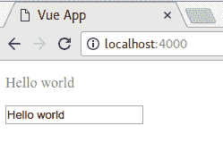
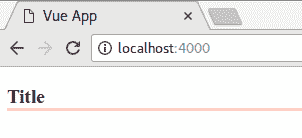

# 高级项目设置

在本章之后，我们将开始构建更复杂的应用程序，并且我们将需要一些额外的工具和库。我们将讨论以下主题：

*   建立我们的发展环境
*   使用 vue cli 构建 vue 应用程序
*   编写和使用单文件组件

# 建立我们的发展环境

要创建更复杂的单页应用程序，建议使用一些工具来简化开发。在本节中，我们将安装它们以准备好良好的开发环境。您需要在计算机上同时安装 Node.js 和 npm。确保您至少有节点 8.x，但建议使用最新的节点版本。

# 安装 vue cli（官方命令行工具）

我们需要的第一个软件包是 vue cli，它是一个命令行工具，可帮助我们创建 vue 应用程序：

1.  在终端中输入此命令，它将安装 vue cli 并将其另存为全局软件包：

```js
 npm install -g vue-cli
```

You may need to run this command as an administrator.

2.  要测试 vue cli 是否正常工作，请使用以下命令打印其版本：

```js
 vue --version
```

# 代码编辑器

任何文本编辑器都可以，但我建议使用 Visual Studio 代码（[https://code.visualstudio.com/](https://code.visualstudio.com/) 或原子（[https://atom.io/](https://atom.io/) ）。对于 Visual Studio 代码，您需要来自 octref（[的`vetur`扩展名 https://github.com/vuejs/vetur](https://github.com/vuejs/vetur) 和 Atom，hedefalk（[的`language-vue`扩展 https://atom.io/packages/language-vue [T9]。](https://atom.io/packages/language-vue)

Jetbrains 最新版本的 WebStorm IDE 支持 Vue 开箱即用。

您还可以安装添加对预处理器语言（如 Sass、Less 或 Stylus）支持的扩展。

# 我们的第一个成熟的 Vue 应用程序

以前的应用程序都是以非常老派的方式开发的，带有`script`标记和简单的 JavaScript。在本节中，我们将发现使用一些强大的功能和工具创建 Vue 应用程序的新方法。在这一部分中，我们将创建一个小项目来演示我们将在前进中使用的新工具。

# 为项目搭建脚手架

vue cli 工具使我们能够创建随时可用的应用程序框架，以帮助我们开始新项目。它与项目模板系统配合使用，该系统可以询问您一些问题，以根据您的需要自定义骨架：

1.  使用以下命令列出正式项目模板：

```js
 vue list
```

以下是终端中显示的列表：


官方模板主要有三种类型：

*   简单：不使用构建工具
*   webpack：使用非常流行的 webpack 捆绑程序（推荐）
*   browserify：使用 browserify 生成工具

The recommended official template is the `webpack` template. It features all you need to create a full-scale SPA with Vue. For the purpose of this book, we will use `webpack-simple` and introduce features progressively.

要使用这些模板之一创建新的应用程序项目，请使用[T0]命令：

```js
vue init <template> <dir>
```

我们将在新的`demo`文件夹中使用`webpack-simple`官方模板：

2.  运行以下命令：

```js
 vue init webpack-simple demo
```

此项目模板具有可随时使用的最小网页包配置。司令部会问几个问题。

3.  回答 vue cli 的以下问题：

```js
      ? Project name demo
      ? Project description Trying out Vue.js!
      ? Author Your Name <your-mail@mail.com>
      ? License MIT
      ? Use sass? No
```

Vue cli 现在应该已经创建了一个`demo`文件夹。已经为我们填写了`package.json`文件和其他配置文件。`package.json`文件非常重要；它保存有关项目的主要信息；例如，它列出了项目所依赖的所有包。

4.  转到新创建的`demo`文件夹，安装`webpack-simple`模板添加的`package.json`文件中已经声明的默认依赖项（如 vue 和 webpack）：

```js
 cd demo
 npm install
```

我们的应用程序现在已设置！

From now on, we will fully use the ECMAScript 2015 syntax and the `import`/`export` keywords to use or expose modules (which means files that export JavaScript elements).

# 创建应用程序

任何 Vue 应用程序都需要一个 JavaScript 条目文件，代码将从该文件开始：

1.  删除`src`文件夹的内容。
2.  创建一个名为`main.js`的新 JavaScript 文件，其内容如下：

```js
      import Vue from 'vue'

      new Vue({
        el: '#app',
        render: h => h('div', 'hello world'),
      })
```

首先，我们将 Vue 核心库导入该文件。然后，我们创建一个新的根 Vue 实例，该实例将附加到页面中`id`应用程序的元素。

A default `index.html` file is provided by vue-cli for the page with an empty `<div id="app"></div>` tag. You can edit it to change the page HTML to your liking.

最后，由于我们将在“渲染函数”部分介绍的`render`选项，我们显示一个包含`'hello world'`文本的`div`元素。

# 运行我们的应用程序

运行 vue cli 生成的`dev`npm 脚本以在开发模式下启动应用程序：

```js
npm run dev
```

这将在 web 服务器端口上启动 web 应用程序。终端应显示编译成功，以及访问应用程序所使用的 URL：


在浏览器中打开此 URL 以查看结果：


# 渲染函数

Vue 使用一个虚拟 DOM 实现，该实现由包含 JavaScript 对象的元素树组成。然后通过计算两者之间的差异，将虚拟 DOM 应用于真实浏览器 DOM。这有助于尽可能避免 DOM 操作，因为它们通常是主要的性能瓶颈。

Actually, when you use templates, Vue will compile them into render functions. If you need the full power and flexibility of JavaScript, you can directly write the render functions yourself, or write JSX, which will be discussed later.

渲染函数返回树的一小部分，该部分特定于其组件。它使用`createElement`方法，该方法作为第一个参数传递。

By convention, `h` is an alias of `createElement`, which is very common and needed to write JSX. It comes from the name of this technique consisting of describing HTML with JavaScript--Hyperscript.

`createElement`（或`h`方法最多使用三个参数：

1.  第一个是元素的类型。它可以是 HTML 标记名（如`'div'`），在应用程序中注册的组件名，也可以直接是组件定义对象。
2.  第二个参数是可选的。它是定义属性、道具、事件侦听器等的数据对象。
3.  第三个参数也是可选的。它可以是一个简单的纯文本，也可以是用[T0]创建的其他元素数组。

考虑下面的函数 T00.函数作为一个例子：

```js
render (h) {
  return h('ul', { 'class': 'movies' }, [
    h('li', { 'class': 'movie' }, 'Star Wars'),
    h('li', { 'class': 'movie' }, 'Blade Runner'),
  ])
}
```

它将在浏览器中输出以下 DOM：

```js
<ul class="movies">
  <li class="movie">Star Wars</li>
  <li class="movie">Blade Runner</li>
</ul>
```

我们将在[第 6 章](6.html)、*项目 4-地理定位博客*中详细介绍渲染功能。

# 配置巴别塔

Babel 是一个非常流行的工具，它编译 JavaScript 代码，这样我们就可以在旧的和当前的浏览器中使用新功能（如 JSX 或箭头函数）。建议在任何严肃的 JavaScript 项目中使用 babel。

默认情况下，`webpack-simple`模板带有默认的巴别塔配置，该配置使用`env`巴别塔预设，该预设支持 ES2015 中所有稳定的 JavaScript 版本。它还包括另一个名为`stage-3`的巴别塔预设，它支持即将推出的 JavaScript 功能，如 Vue 社区中常用的`async/await`关键字和对象扩展操作符。

我们需要添加第三个特定于 Vue 的预设，这将添加对 JSX 的支持（我们将在本章后面的“JSX”部分中需要它）。

我们还需要包括 babel 提供的 PolyFill，以便新功能（如[T0]和生成器）在旧浏览器中工作。

A polyfill is code that checks whether a feature is available in the browser, and if not, it implements this feature so that it works like it is native.

# 巴别塔视图预设

现在，我们将在应用程序的巴别塔配置中安装并使用`babel-preset-vue`。

1.  因此，首先，我们需要在 dev 依赖项中安装此新预设：

```js
 npm i -D babel-preset-vue
```

主要的巴别塔配置在项目根目录中已经存在的`.babelrc`JSON 文件中完成。

This file may be hidden in your file explorer, depending on the system (its name starts with a dot). However, it should be visible in your code editor if it has a file tree view.

2.  打开此`.babelrc`文件，将`vue`预置添加到相应列表中：

```js
      {
        "presets": [
          ["env", { "modules": false }],
          "stage-3",
          "vue"
        ]
      }
```

# 多文件

我们还将添加 Babel 多边形填充，以便在旧浏览器中使用新的 JavaScript 功能。

1.  在您的开发依赖项中安装`babel-polyfill`包：

```js
 npm i -D babel-polyfill
```

2.  在`src/main.js`文件开头导入：

```js
      import 'babel-polyfill'
```

这将为浏览器启用所有必要的多边形填充。

# 更新依赖项

项目搭建完成后，您可能需要更新它使用的包。

# 手动更新

要检查项目中使用的包是否有新版本，请在根文件夹中运行以下命令：

```js
npm outdated
```

如果检测到新版本，将显示一个表格：


`Wanted`列是与`package.json`文件中指定的版本范围兼容的版本号。要了解更多信息，请访问 npm 文档，网址为[http://docs.npmjs.com/getting-started/semantic-versioning](https://docs.npmjs.com/getting-started/semantic-versioning)。

要手动更新包，请打开`package.json`文件并找到相应的行。更改版本范围并保存文件。然后，运行此命令以应用更改：

```js
npm install
```

Don't forget to read the change logs of the packages you update! There might be breaking changes or improvement you will be happy to know about.

# 自动更新

要自动更新包，请在项目的根文件夹中使用以下命令：

```js
npm update
```

This command will only update the versions compatible with those specified in the `package.json` file. If you want to update packages to other versions, you need to do it manually.

# 更新 Vue

更新包含核心库的`vue`包时，还应更新`vue-template-compiler`包。它是使用 webpack（或其他构建工具）时编译所有组件模板的软件包。

Both of these packages must always be at the same version. For example, if you use `vue 2.5.3`, then `vue-template-compiler` should also be at version `2.5.3`.

# 生产性建筑

当您的应用程序在真正的服务器上投入生产时，您需要运行以下命令来编译您的项目：

```js
npm run build
```

默认情况下，使用`webpack-simple`模板时，会将 JavaScript 文件输出到项目中的`/dist`文件夹中。您只需上传此文件夹和根文件夹中的`index.html`文件。您的服务器上应该有以下文件树：

```js
- index.html
- favicon.png
- [dist] - build.js
         ∟ build.map.js
```

# 单文件组件

在本节中，我们将介绍一种重要的格式，该格式广泛用于创建真正的 Vue 应用程序。

Vue 有自己的格式调用**单文件组件**（**SFC**）。此格式由 Vue 团队创建，文件扩展名为`.vue`。它允许您在一个位置为每个文件编写一个组件，包括模板以及该组件的逻辑和样式。这里的主要优点是每个组件都是独立的、更易于维护和共享的。

SFC 使用类似 HTML 的语法描述 Vue 组件。它可以包含三种类型的根块：

*   `<template>`，它使用我们已经使用的模板语法描述组件的模板
*   `<script>`，包含组件的 JavaScript 代码
*   `<style>`，包含组件使用的样式

以下是证监会的一个例子：

```js
<template>
  <div>
    <p>{{ message }}</p>
    <input v-model="message"/>
  </div>
</template>

<script>
export default {
  data () {
    return {
      message: 'Hello world',
    }
  },
}
</script>

<style>
p {
  color: grey;
}
</style>
```

现在让我们试试这个组件！

1.  将上述组件源放入`src`文件夹中的新`Test.vue`文件中。
2.  编辑`main.js`文件，使用`import`关键字导入 SFC：

```js
      import Test from './Test.vue'
```

3.  删除`render`选项，而是使用对象扩展运算符复制`Test`组件的定义：

```js
      new Vue({
        el: '#app',
        ...Test,
      })
```

In the preceding snippet, I demonstrated another way to add the root component to the app--using the JavaScript Spread operator--so the `...App` expression will copy the properties to the app definition object. The main advantage is that we won't have a useless top component in the dev tools anymore; it will be our direct root component now.

4.  继续并打开终端中显示的 URL 以查看结果：



# 样板

`<template>`标签包含组件的模板。和前面一样，它是带有 Vue 特殊语法（指令、文本插值、速记等）的 HTML。

以下是 SFC 中的`<template>`标记示例：

```js
<template>
  <ul class="movies">
    <li v-for="movie of movies" class="movie">
      {{ movie.title }}
    </li>
  </ul>
</template>
```

在本例中，我们组件的模板将由一个`ul`元素组成，其中包含一个显示电影标题的`li`元素列表。

If you don't put a `<template>` tag in your SFC, you will need to write a render function or your component won't be valid.

# 使用哈巴狗

Pug（原名 Jade）是一种编译成 HTML 的语言。我们可以在`<template>`标记中使用它，并将`lang`属性设置为“pug”：

```js
<template lang="pug">
ul.movies
  li.movie Star Wars
  li.movie Blade Runner
</template>
```

要在我们的 SFC 中编译 Pug 代码，我们需要安装以下软件包：

```js
npm install --save-dev pug pug-loader
```

Packages that are needed for the development are called development dependencies and should be installed with the `--save-dev` flag. The direct dependencies that the app requires to run (for example, a package to compile markdown to HTML) should be installed with the `--save` flag.

# 剧本

`<script>`标记包含与组件关联的 JavaScript 代码。它应该导出组件定义对象。

下面是一个`<script>`标记的示例：

```js
<script>
export default {
  data () {
    return {
      movies: [
        { title: 'Star Wars' },
        { title: 'Blade Runner' },
      ],
    }
  },
}
</script>
```

在本例中，组件将有一个使用`movies`数组返回初始状态的`data`钩子。

The `<script>` tag is optional if you don't need any options in the component options, which defaults to an empty object.

# JSX 公司

JSX 是 JavaScript 代码中用于表示 HTML 标记的特殊符号。它使负责描述视图的代码更接近纯 HTML 语法，同时仍然拥有 JavaScript 的全部功能。

下面是一个使用 JSX 编写的渲染函数示例：

```js
<script>
export default {
  data () {
    return {
      movies: [
        { title: 'Star Wars' },
        { title: 'Blade Runner' },
      ],
    }
  },
  render (h) {
    const itemClass = 'movie'
    return <ul class='movies'>
      {this.movies.map(movie =>
        <li class={ itemClass }>{ movie.title }</li>
      )}
    </ul>
  },
}
</script>
```

You can use any JavaScript expression inside single brackets.

正如您在本例中所看到的，我们可以使用任何 JavaScript 代码来组合视图。我们甚至可以使用`movies`数组的`map`方法为每个项目返回一些 JSX。我们还使用了一个变量来动态设置电影元素的 CSS 类。

在编译过程中，真正发生的是`babel-preset-vue`中包含一个名为`babel-plugin-transform-vue-jsx`的特殊模块将 JSX 代码转换为纯 JavaScript 代码。编译后，前面的渲染函数将如下所示：

```js
render (h) {
  const itemClass = 'movie'
  return h('ul', { class: 'movies' },
    this.movies.map(movie =>
      h('li', { class: itemClass }, movie.title)
    )
  )
},
```

如您所见，JSX 是一种帮助编写渲染函数的语法。最终的 JavaScript 代码将非常接近我们使用`h`（或`createElement`手动编写的代码。

我们将在[第 6 章](6.html)、*项目 4-地理定位博客*中详细介绍渲染功能。

# 风格

单个文件组件可以包含多个`<style>`标记，以便将 CSS 添加到与该组件相关的应用程序中。

下面是一个非常简单的组件样式示例，它将一些 CSS 规则应用于`.movies`类：

```js
<style>
.movies {
  list-style: none;
  padding: 12px;
  background: rgba(0, 0, 0, .1);
  border-radius: 3px;
}
</style>
```

# 范围样式

我们可以使用 scoped 属性将`<style>`标记中包含的 CSS 范围限定到当前组件。这意味着此 CSS 将仅应用于此组件模板的元素。

例如，我们可以使用通用类名，如 movie，并确保它不会与应用程序的其余部分冲突：

```js
<style scoped>
.movie:not(:last-child) {
  padding-bottom: 6px;
  margin-bottom: 6px;
  border-bottom: solid 1px rgba(0, 0, 0, .1);
}
</style>
```

结果如下所示：


这是可以实现的，这要归功于一个特殊的属性，该属性应用于模板和带有 postss（一个处理工具）的 CSS。例如，考虑以下范围化的样式组件：

```js
<template>
  <h1 class="title">Hello</h1>
</template>

<style scoped>
.title {
  color: blue;
}
</style>
```

它相当于以下内容：

```js
<template>
  <h1 class="title" data-v-02ad4e58>Hello</h1>
</template>

<style>
.title[data-v-02ad4e58] {
  color: blue;
}
</style>
```

如您所见，所有模板元素和所有 CSS 选择器都添加了一个唯一属性，这样它将只匹配此组件的模板，而不会与其他组件冲突。

Scoped styles don't eliminate the need for classes; due to the way browsers render CSS, there might be performance loss when selecting a plain element with an attribute. For example, `li { color: blue; }` will be many times slower than `.movie { color: blue; }` when scoped to the component.

# 添加预处理器

如今，CSS 很少像现在这样使用。通常使用功能更强大、功能更丰富的预处理器语言编写样式。

在`<style>`标记上，我们可以指定其中一种语言与`lang`属性一起使用。

我们将以此模板作为我们组件的基础：

```js
<template>
  <article class="article">
    <h3 class="title">Title</h3>
  </article>
</template>
```

# 无礼

Sass 是许多科技公司使用的著名 CSS 预处理器：

1.  要在组件中启用 Sass，请安装以下软件包：

```js
 npm install --save-dev node-sass sass-loader
```

2.  然后，在组件中添加一个`<style>`标记，其`lang`属性设置为`"sass"`：

```js
      <style lang="sass" scoped>
      .article
        .title
          border-bottom: solid 3px rgba(red, .2)
      </style>
```

3.  现在，使用[T0]命令测试您的组件。您应该得到与此类似的结果：



If you want to use the SCSS syntax variant of Sass, you need to use `lang="scss"`.

# 较少的

Less 的语法比其他 CSS 预处理语言更简单：

1.  要减少使用，您需要安装以下软件包：

```js
 npm install --save-dev less less-loader
```

2.  然后，在组件中，将`lang`属性设置为`"less"`：

```js
      <style lang="less" scoped>
      .article {
        .title {
          border-bottom: solid 3px fade(red, 20%);
        }
      }
      </style>
```

# 触笔

触控笔比 Less 和 Sass 更新，也非常流行：

1.  最后，对于手写笔，您需要以下软件包：

```js
 npm install --save-dev stylus stylus-loader
```

2.  在`<style>`标签上，将`lang`属性设置为`"stylus"`：

```js
      <style lang="stylus" scoped>
      .article
        .title
          border-bottom solid 3px rgba(red, .2)
      </style>
```

# 组件内部的组件

现在我们知道了如何编写单文件组件，我们希望在其他组件中使用它们来组成应用程序的界面。

要在另一个组件中使用组件，我们需要导入它并将其公开给模板：

1.  首先，创建一个新组件。例如，这里有一个`Movie.vue`组件：

```js
      <template>
        <li class="movie">
          {{ movie.title }}
        </li>
      </template>

      <script>
      export default {
        props: ['movie'],
      }
      </script>

      <style scoped>
      .movie:not(:last-child) {
        padding-bottom: 6px;
        margin-bottom: 6px;
        border-bottom: solid 1px rgba(0, 0, 0, .1);
      }
      </style>
```

如果您尚未创建`Movies.vue`组件，我们还需要它。应该是这样的：

```js
<template>
  <ul class="movies">
    <li v-for="movie of movies" class="movie">
      {{ movie.title }}
    </li>
  </ul>
</template>

<script>
export default {
  data () {
    return {
      movies: [
        { id: 0, title: 'Star Wars' },
        { id: 1, title: 'Blade Runner' },
      ],
    }
  },
}
</script>
```

2.  然后，在`Movies`组件的脚本中导入`Movie`SFC：

```js
      <script>
      import Movie from './Movie.vue'

      export default {
        // ...
      }
      </script>
```

3.  设置`components`选项以向模板公开一些组件，并带有一个对象（键是我们将在模板中使用的名称，值是组件定义）：

```js
      export default {
        components: {
          Movie,
          // Equivalent to `Movie: Movie,`
        },

        // ...
      }
```

4.  我们现在可以在模板中使用带有`Movie`标记的组件：

```js
      <template>
        <ul class="movies">
          <Movie v-for="movie of movies"
            :key="movie.id"
            :movie="movie" />
        </ul>
      </template>
```

如果您使用的是 JSX，则不需要[T0]选项，因为如果组件定义以大写字母开头，则可以直接使用组件定义：

```js
import Movies from './Movies.vue'

export default {
  render (h) {
    return <Movies/>
    // no need to register Movies via components option
  }
}
```

# 总结

在本章中，我们安装了几个工具，这些工具将允许我们使用推荐的方法编写真正的生产就绪应用程序。现在，我们可以构建一个完整的项目框架，开始构建伟大的新应用程序。我们可以以各种方式编写组件，但我们可以使用单个文件组件以一致且可维护的方式编写组件。我们可以在应用程序内部或其他组件内部使用这些组件，用多个可重用组件组成用户界面。

在下一章中，我们将创建我们的第三个应用程序，其中包含到目前为止所学的所有内容，以及一些新主题，例如路由！