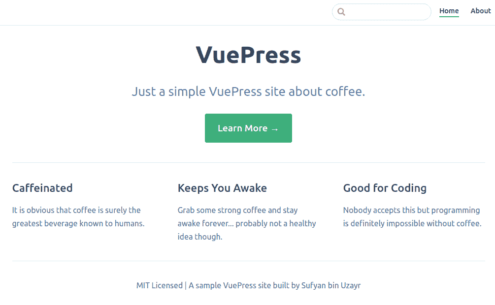

# 六、VuePress 中的主题开发

在上一章中，我们学习了如何通过降价来格式化内容。在此之前，我们已经建立了一个基本的 VuePress 网站。此外，我们还了解 VuePress 提供的大多数配置设置。

然而，web 开发的一个关键方面仍然缺失。

是的，我们正在谈论主题开发。正如您可能知道的，一个好的主题或模板是任何网站或博客的无形部分。

VuePress 有自己的默认主题。在[第 4 章](4.html)*中，在 VuePress*中创建一个站点，当您建立第一个 VuePress 网站时，会向您介绍默认主题以及如何使用它来展示您的内容。

然而，在本章中，我们将回顾 VuePress 世界中与主题开发和配置相关的一切。这意味着我们不仅将讨论配置实体和变量，还将重新讨论默认的 VuePress 主题及其工作方式、其代码的哪些特定部分可用于等。

但除此之外，我们还将关注 VuePress 中主题的定制。我们将在本章后半部分详细讨论自定义主题配置。

在本章中，您将了解以下内容：

*   VuePress 的主题开发
*   为主题开发配置实体和值
*   在 VuePress 中使用默认主题配置
*   VuePress 中的自定义主题开发
*   在 VuePress 中使用 CSS 自定义
*   与 Git 存储库同步

# VuePress 中的主题开发

现在，不要再浪费时间了，让我们开始吧！ 

# 在 VuePress 中使用主题

VuePress 作为一个静态站点生成器，专注于简单性和灵活性。这意味着，与 WordPress 不同，您不会找到过多的主题和插件可供使用。虽然它对某些人来说是一种威慑，但在某些情况下，易于安装的主题是一种实时节省，这种功能性的、以开发人员为中心的方法对许多其他人来说非常有用。

它可以帮助您按照您希望的方式编写主题代码。此外，您还可以只使用默认主题，并在几分钟内快速组合一个站点。在[第 4 章](4.html)*中，我们看到在 VuePress*中创建一个站点，在 VuePress 中设置默认主页就像编辑一个简单的 Markdown 文件一样简单！

# 什么和如何？

本章的布局相当简单，因为我们只讨论 VuePress 主题的一个特定概念。尽管如此，值得记住的是主题开发本身是一个相当广泛的主题。随着 VuePress 的规模和流行度不断扩大，并且随着时间的推移会出现新的版本，您可能需要复习和修改主题开发技能，以确保遵守 VuePress 和 Vue.js 提出的最新编码标准。

此时，我们将讨论，或者更确切地说，剖析 VuePress 的默认主题结构。这意味着我们将涵盖主页、导航、侧栏和所有其他相关实体。您可能已经学习了[第 4 章](4.html)、*在 VuePress*、*中创建网站的基础知识，但现在，我们将更感兴趣地了解代码在这里的工作方式和原因。您已经在[第四章](4.html)*在 VuePress*中看到了默认主题的实际应用。*

 *之后，我们将把注意力转向定制。VuePress 中的自定义主题需要对默认结构进行一些更改，我们很快就会看到这一点。

但在进一步讨论之前，让我们花点时间尝试介绍 VuePress 中的一些基本主题配置值。与我们在前面章节中介绍的降价配置实体或基本配置实体不同，主题配置并没有那么详细。

# 为主题化配置实体

现在，让我们首先了解一些与 VuePress 中主题开发相关的基本配置实体。在前面的章节中，我们已经了解了其他配置实体

# 主题

主题配置值用于指定自定义主题。这意味着，如果在项目中使用自定义主题，则需要调用主题配置来指定它。

它是字符串类型，默认情况下未定义，因为 VuePress 使用自己的默认主题，除非另有指定。

# ThemeSeconfig

顾名思义，`themeConfig`为当前主题提供配置选项。

属于对象类型，默认写为`{ }`。

请注意，`themeConfig`内容和选项会有所不同，这取决于您构建主题的方式。在进行主题定制时，您将经常使用`themeConfig`实体。

这里有一个简单的例子。还记得我们在[第 3 章](3.html)*VuePress 开发–初步步骤*中了解的服务人员吗？这是一个服务级别的站点。但是主题一级呢？

当您使用`themeConfig.serviceWorker`时，您可以自定义它，使其仅适用于主题级别的内容。通过这种方式，您可以在`themeConfig`的帮助下定制 VuePress 开发的几个元素，以满足您主题的需要。

**这有什么用？**

好吧，想象一下。访问者在多个选项卡中打开了 VuePress 站点，并正在浏览您的内容。现在，如果你在那个时候更新你的内容呢？在正常情况下，在所有选项卡关闭然后打开之前，访问者不会看到新内容——换句话说，浏览器端硬刷新或重新加载打开的页面。

当您将服务人员配置为使用`themeConfig`时，您还可以将其用于一些有趣的事情。其中之一就是弹出窗口的 UI。

是的，每个人都知道弹出窗口是什么，它们有多烦人。但我们不是在谈论像垃圾邮件弹出式广告这样的广告。相反，`themeConfig.serviceWorker`元素将添加一个`updatePopup`选项，在新内容可用时通知用户。

换言之，当您更新站点并且用户打开选项卡时，将出现一个弹出窗口，通知用户有关新内容和一个刷新按钮，以便在不关闭客户端的情况下直接显示新内容。

This option is very helpful when you have a site that you update often, such as documentation for a technical project, and so on.

`themeConfig.serviceWorker.updatePopup`选项的基本语法如下（布尔值）：

```js
module.exports = {
  themeConfig: {
    serviceWorker: {
      updatePopup: true //now popup is set to true and will show up
      // default display for frontend is:  
      // updatePopup: { 
      // message: "New content is available.", 
      // buttonText: "Refresh" 
      // }
    }
  }
}
```

Note that the popup feature in VuePress, as of now, is still in beta.

正如您所看到的，`themeConfig`可以用于多种用途，为您的 VuePress 安装添加更多的铃声和口哨。

就目前而言，仅此而已。这是我们需要记住的仅有的两个配置值。因此，我们可以安全地将注意力转向默认的 VuePress 主题，以便更好地理解这一点。

# VuePress 中的默认主题配置

此特定部分完全且仅适用于默认的 VuePress 主题。如果您使用的是自定义主题，则大多数或所有这些设置可能不适用。

在这一阶段，我们强烈建议您转向您在[第 4 章](4.html)中创建的虚拟站点，*在 VuePress*中创建站点。我们介绍了一些概念，如主页、导航、边栏、搜索功能等。现在，我们将更好地了解这些特性，并了解默认 VuePress 主题提供的现成功能（例如与 GitHub repo 的集成）。

# 主页

我们知道默认的 VuePress 主题有自己的主页布局。为了使用它，我们所要做的就是在根目录的`README.md`文件中将 home:值设置为`true`。然后 VuePress 将上述文件解析为`index.html`，并显示默认主页。

我们可以通过`README.md`文件直接向主页添加元数据。在上一章中，我们学习了如何以 YAML 格式编写前端内容。因此，是时候分析主页的代码了。复制[第 4 章](4.html)*中的同一主页首页首页内容，在 VuePress*中创建一个站点，我们得到以下信息：

```js
---
meta:
  - name: description
    content: Just a simple VuePress site about coffee.
  - name: keywords
    content: vuepress coffee
lang: en-US
home: true
navbar: true
actionText: Learn More →
actionLink: /about
features:
- title: Caffeinated
  details: It is obvious that coffee is surely the greatest beverage known to humans.
- title: Keeps You Awake
  details: Grab some strong coffee and stay awake forever... probably not a healthy idea though. 
- title: Good for Coding
  details: Nobody accepts this but programming is definitely impossible without coffee.
footer: MIT Licensed | A sample VuePress site built by Sufyan bin Uzayr
---
```

在前面的代码中，我们首先指定站点的元数据。然后，我们为 CalltoAction 按钮添加链接和锚文本细节。最后，我们输入要显示的其他信息

正如我们在[第 4 章](4.html)中看到的，*在 VuePress*中创建了一个站点，以下是最终结果：



放在首页后面的任何内容也会被解析为简化的降价，它将显示在主页首页的首页下方。

但是，如果您不希望使用默认主页，该怎么办？当然，您可以创建自定义主题，但为什么只为添加新页面而创建新主题呢？

在这种情况下，更好的选择是自定义主页布局。我们可以通过自定义布局来实现这一点。

# 页面的自定义布局

我们知道，VuePress 在 web 浏览器中以 HTML 格式呈现每个 Markdown `.md`文件。通常，VuePress 以 HTML 格式解析`<div class="page">`容器中 Markdown 文件的内容。

这意味着包含主要内容、导航栏和其他链接的默认布局包含在容器中。

因此，这里的任务很简单。如果我们必须添加任何自定义布局或组件，我们只需要确保它包含在默认容器中。

例如，假设我们指定了一个名为`MyLayout`的自定义`layout`。现在，在 YAML 前端，我们只需要添加以下行：

```js
layout: MyLayout
```

这样，将为给定页面呈现新布局。

通过这种方式，您可以为任意数量的页面指定自定义布局。

# 名称栏

VuePress 中的导航栏由一组通用项组成，例如导航菜单、搜索栏、指向 GitHub repo 的链接（如果有）等等。

# 无链接

还记得我们前面讨论的[T0]变量吗？您可以使用它向导航栏添加任意数量的链接。

让我们分析以下代码：

```js
// Goes to .vuepress/config.js
 module.exports = {
  themeConfig: {
    nav: [
      { text: 'Home', link: '/' },
      { text: 'About', link: '/about' },
      { text: 'Coffee', link: '/coffee' },
      { text: 'External', link: 'http://sufyanism.com' },
 ]
 }
 }
```

在前面的示例中，我们正在创建一个简单的导航链接菜单，该菜单提供四个链接：

*   主页
*   关于页面
*   关于咖啡的一页
*   外部链接（GitHub）

相当简单，不是吗？您可以根据需要在此处继续添加链接。以下是它在浏览器中的外观：


那下拉菜单呢？您所需要做的就是将上述链接作为数组提供，而不是独立链接。例如，考虑下面的代码：

```js
module.exports = {
  themeConfig: {
    nav: [
      {
        text: 'Linkz',
        items: [
          { text: 'Home', link: '/' },
          { text: 'About', link: '/about/' }
        ]
      }
    ]
  }
 }
```

这样，链接将显示为下拉菜单。

此外，您还可以拥有高度复杂的菜单，下拉条目下有子组和嵌套项。对于 VuePress 网站来说，这种菜单结构不太可能被使用，而且可能也没什么用处。不过，以下是此类菜单结构的默认语法，您可以根据自己的要求进行修改：

```js
module.exports = {
  themeConfig: {
    nav: [
      {
        text: 'Label',
        items: [
          { text: 'First', items: [/*  */] },
          { text: 'Second', items: [/*  */] }
        ]
      }
    ]
  }
 }
```

# 搜索栏

您可以选择在 VuePress 中使用本机搜索或 Algolia DocSearch。默认的搜索栏位置就在导航菜单链接旁边，正如我们在[第 4 章](4.html)中看到的，*在 VuePress*中创建站点：


# 本机搜索框

VuePress 自带了自己的本机搜索框，您无需对其进行修补。但是，如果您愿意，您可以使用`themeConfig`值完全禁用搜索框，或者限制为搜索词显示的建议数量。

以下是如何禁用本机搜索框：

```js
module.exports = {
  themeConfig: {
    search: false,
  }
 }
```

或者，要限制建议的数量，请尝试以下代码：

```js
module.exports = {
  themeConfig: {
    searchMaxSuggestions: 5
  }
 }
```

VuePress 中本机搜索的一大缺点是，它仅从[T0]、[T1]和[T2]标签构建索引。这意味着它不会扫描搜索词的实际正文内容。

当然，这样的搜索功能可能不足以满足所有人的需要，因为通常在内容中找到正确的关键字，而不是在标题中。

为了克服这个问题，我们可以将外部搜索机制集成到主题中。

# 使用 Algolia 搜索

如果您不熟悉 Algolia DocSearch，请访问他们的网站并在[了解更多信息 https://community.algolia.com/docsearch/](https://community.algolia.com/docsearch/) 。

基本上，Algolia DocSearch 是文档搜索引擎的增强版。它在你的内容中爬行，索引，然后返回更好的搜索结果，覆盖并爬行整个内容，而不仅仅是标题。他们网站的截图如下所示：


Algolia DocSearch 与各种环境完全兼容，包括引导、React，当然还有 Vue.js。此外，它是一种上下文感知搜索机制，可以在键入时进行学习。因此，Algolia DocSearch 可以提供本机搜索方法中可能缺少的一系列功能，例如：

*   自动完成建议
*   自定义分析以查看详细的搜索统计信息

Algolia DocSearch 附带 MIT 许可证，是开源的。话虽如此，为了在 VuePress 网站上使用它，您需要在 Algolia 注册一个帐户。

Detailed documentation for integrating Algolia DocSearch with your site is available at [https://github.com/algolia/docsearch#docsearch-options](https://github.com/algolia/docsearch#docsearch-options).

一旦你注册了 Algolia 帐户，你就可以提交你的站点进行索引和爬网。此后，您只需通知 VuePress 有关 Algolia Doc 搜索引擎的信息。为此，您将再次使用非常方便的`themeConfig`选项，如下所示：

```js
module.exports = {
 themeConfig: {
 algolia: {
 apiKey: '<API>',
 indexName: '<INDEX>'
 }
 }
 }
```

注意，当站点索引完成时，您需要指定自己的 API 键和索引名，如 Algolia DocSearch 提供的那样。如果没有 API 键或索引名，或者其中任何一个的值不正确，搜索功能将无法工作。

# 如何禁用导航栏？

有时，您可能需要或希望完全禁用导航栏。在这种情况下，您可以通过`themeConfig`选项指定，如下所示：

```js
// Goes to .vuepress/config.js
 module.exports = {
  themeConfig: {
    navbar: false
  }
 }
```

导航栏显示值现在设置为 false，因此它不会显示在前端。

但是，前面的选项全局禁用导航栏。要仅针对特定页面禁用它，您最好编辑所述页面的首页，如下所示：

```js
---
 navbar: false
 ---
```

# 上一个和下一个链接

默认情况下，VuePress 将在站点的每个页面末尾添加上一个和下一个导航链接。这些链接根据侧边栏中的标题自动推断，并从活动页面计算。

但是，也可以替代它们的外观和选择。在活动页面的前面，您只需要指定您的选择。例如，对于自定义页面选择，您可以添加以下内容：

```js
---
 prev: ./another-page
 next: ./yet-another-page
 ---
```

您还可以选择禁用这两个选项：

```js
---
 prev: false
 next: false
 ---
```

或者，只需使用以下代码禁用其中一个：

```js
---
 prev: ./some-fancy-page
 next: false
 ---
```

或：

```js
---
 prev: false
 next: ./my-awesome-page
 ---
```

等等

这涵盖了导航本身的部分。现在，是时候把我们的注意力转向侧边栏了。

# 边栏

VuePress 为您的站点提供了一个本机侧边栏，该侧边栏是基于您的页面结构和其中的标题链接构建的。

要为站点启用侧栏，您需要通过`themeConfig.sidebar`选项使用链接数组对其进行配置。请注意，以下代码进入您的`config.js`文件：

```js
// goes to .vuepress/config.js
 module.exports = {
  themeConfig: {
    sidebar: [
      '/',
      '/page-1',
      ['/page-2', 'optional link text']
    ]
  }
 }
```

在此示例中，默认情况下链接指向`README.md`文件。这意味着任何以`/`正斜杠结尾的链接都将转到相关的`README.md`文件。

注意可选的链接文本？如果您在这里指定了某个内容，那么它将在侧边栏中显示为链接文本。或者，如果您在页面的前面指定了一个标题，那么它将作为链接文本显示在侧边栏中。最后，如果两个位置都没有指定标题，VuePress 将自动从相关页面的第一个标题中选择链接文本。

# 修改侧栏中的标题链接

您可以在 VuePress 的侧栏中使用标题链接。这里将讨论一些示例。

# 显示每个页面的标题链接

默认情况下，侧边栏将仅显示活动页面的标题链接。您可以将其更改为直接显示所有页面的标题链接。您只需将相关值设置为`true`，如下所示：

```js
module.exports = {
  themeConfig: {
    displayAllHeaders: true // Default is false
  }
 }
```

# 嵌套头链接

正如您所知，侧边栏将自动显示当前活动页面中标题的链接。因此，当您浏览页面时，将显示相关的标题链接，以便于导航。

这些标题嵌套在活动页面下，默认深度为`1`（这意味着所有`H2`标签都显示为标题，页面标题本身就是`H1`。

您可以使用`themeConfig.sidebarDepth`选项修改此行为以显示更深层的头链接嵌套。例如，如果嵌套深度更改为`0`，则所有标题链接都将隐藏，仅显示`H1`值（页面标题）。类似地，将深度更改为`2`将意味着嵌套在`H2`标题链接下的所有`H3`标题也将显示，以此类推。

您可以在前面的内容中指定相关的深度。例如，要显示`H1`页面标题、`H2`标题链接以及`H3`和`H4`链接，您将指定深度为`3`，如下所示：

```js
 ---
 sidebarDepth: 3
 ---
```

# 活动头链接

当用户向下滚动页面时，侧边栏的活动链接会自动更新。这是几乎所有静态站点生成器的默认行为，这些生成器倾向于作为单页应用程序工作。通过这种方式，根本不需要刷新或重新加载整个页面。

但是，如果需要，您可以在`themeConfig.activeHeaderLinks`选项的帮助下禁用此行为，如下所示：

```js
module.exports = {
 themeConfig: {
 activeHeaderLinks: false, // Default is true
 }
 }
```

请注意，这将意味着在浏览期间不会突出显示活动标题链接，这可能会影响站点的整体用户体验。但是，它也可以稍微提高页面速度，因为相应的脚本将不再被加载。

# 组织侧栏

您可以选择将侧边栏组织或划分为多个组。这是在对象的帮助下完成的。

默认情况下，VuePress 中的边栏组是可折叠的。但是，也可以将可折叠选项指定为 false。创建侧栏组的语法如下所示：

```js
// goes in .vuepress/config.js
 module.exports = {
  themeConfig: {
    sidebar: [
      {
        title: 'A Group',
        children: [
          '/'
        ]
      },
      {
        title: 'B Group',
        children: [ /* ... */ ]
      }
    ]
  }
 }
```

这种语法是不言自明的。我们只是创建具有给定标题的链接组，然后将页面和链接作为子项添加到每个链接组中。

# 使用多个侧边栏

实际上，您可以为内容的不同部分设置多个侧栏。

但是，要使其正常工作，首先需要相应地组织内容。一个好主意是将页面组织到目录和子目录中。

例如，考虑以下目录结构，其中页面按目录组织：

现在，要创建多个侧栏，我们需要在`config.js`文件中添加以下内容：

```js
// goes in .vuepress/config.js
 module.exports = {
  themeConfig: {
    sidebar: {
      '/testx/': [
        '', /* /testx/readme.md */
        'one', /* /testx/one.md */
        ],

      '/testxy/': [
        '', /* /testxy/readme.md */
       'two' /* /testxy/two.md */
      ],

      // fallback
      '/': [
        '',   /* readme.md at / */
        'about'   /* /about.md */
      ]
    }
  }
 }
```

前面的配置将为每个部分声明侧栏。请注意，强烈建议仅在最后声明回退选项，因为 VuePress 从上到下读取侧栏的配置；也就是说，按照申报的时间顺序。

# 向单个页面添加侧栏

您可以生成自定义迷你侧边栏，其中包含给定页面的标题链接，通常仅限于当前活动页面。

要实现这一点，首先需要在相关页面的首页中指定，如下所示：

```js
---
 sidebar: auto
 ---
```

您也可以在所有页面上全局重复此操作。在这种情况下，您可以修改您的`config.js`文件，如下所示：

```js
// goes in .vuepress/config.js
 module.exports = {
  themeConfig: {
    sidebar: 'auto'
  }
 }
```

# 如何禁用侧边栏？

如果您希望禁用特定页面上的侧边栏，可以在首页中指定。这将为页面提供全宽外观，操作如下：

```js
---
 sidebar: false
 ---
```

# 适用于 GitHub 用户

考虑到 VuePress 在其自己的 GitHub 存储库中进行了积极维护，并且很多 Vue.js 用户倾向于选择 GitHub，VuePress 自然会加载一些对 GitHub 的本机支持。

# 同步到 GitHub 存储库

只需指定 repo 名称，就可以轻松地向 GitHub 存储库添加编辑链接和更新

但是，如果您不是 GitHub 用户，并且依赖其他服务，例如 BitBucket 或 GitLab，那么您仍然没有什么可担心的。在这种情况下，您只需在`config.js`文件中提供存储库的完整 URL（我们将在后面的语法中看到），您就会发现 VuePress 可以从中提取相关信息。

因此，概括起来：

*   GitHub 用户只需告诉 VuePress 要使用哪个存储库
*   GitLab 和 BitBucket（或其他基于 Git 的平台用户）需要指定其存储库的完整 URL

要启用此特定功能，您只需要以下代码。请特别注意此代码中的注释，因为您需要将其更改为所需的值以使其正常工作。另外，根据您组织存储库的方式，您可能不需要大部分代码（例如，如果您的文档不在其他存储库中，您可以安全地从以下代码中省略该行）：

```js
// goes in .vuepress/config.js
 module.exports = {
  themeConfig: {
    // GitHub by default, provide full URLs for others.
    repo: 'repo-address-here',
    // Customize the header label that is shown in menu
    repoLabel: 'Contribute!',

    // Further options related to “Edit on Git” link

    // if docs are maintained in a separate repo:
    docsRepo: 'docs-repo-here-full-address',
    // if docs are in a sub-directory of main repo:
    docsDir: 'docs-directory-here',
    // if you do not want to use the Master branch on Git:
    docsBranch: 'master-or-branch-name',
    // do you want people to edit your docs? Boolean value
    editLinks: true,
    // modify the “edit this page” link that is shown
    editLinkText: 'Help me edit this page!'
  }
 }
```

在前面的代码片段中，您需要指定存储库的地址，以及文档存储库（或 VuePress 上托管的任何文献）的地址（如果不同）。然后，您可以调整链接的外观，并选择是否希望人们编辑或贡献给您的存储库。

# 如何隐藏某些页面上的编辑链接？

通常，您希望开放源代码用户对项目或站点上的所有页面进行贡献，但可能需要保护某些页面不受编辑。在涉及许可、法律条款、版权持有人等的页面中尤其如此。

在这种情况下，您只需使用给定页面的首页并关闭[T0]属性，如下所示：

```js
 ---
 editLink: false
 ---
```

# 来自 GitHub 的时间戳

在使用 GitHub 存储库时，开发人员自然会展示或显示时间戳上的*最后一次更新，以便跟踪进度，并告知用户所述项目实际上正在积极开发中。*

这个时间戳来自 Git 提交，在对给定页面进行第一次提交时显示。然后，在进行新的提交时更新它


在 VuePress 中，默认情况下将其关闭。但您可以选择将其打开并显示为上次更新的显示。

您可以使用`themeConfig.lastUpdated`选项来提取每个页面最后一次 Git 提交的时间戳，并将其显示在页面底部。

语法如下。请注意，时间戳是一个字符串值：

```js
module.exports = {
  themeConfig: {
    lastUpdated: 'Last Updated', // timestamp at bottom of page
  }
 }
```

这就是为您的 VuePress 站点使用 GitHub 存储库时的全部内容。

现在，由于我们正在讨论主题开发，我们需要转向使网页看起来像现在这样的东西。

是的，我们谈论的是层叠样式表，或 CSS。

# VuePress 主题开发中的 CSS

在这一点上，我们将看看我们可以在 VuePress 中使用哪些自定义 CSS 覆盖和更改。

Note that you will need a working knowledge of CSS in order to execute any of the tweaks suggested in this section.

# 页面的自定义类

VuePress 通常不需要为您的站点添加特定于 VuePress 的 CSS。在这种情况下，您需要添加一个对给定页面唯一的自定义类。

到目前为止，您可能已经意识到页面特定的内容需要在特定页面的 YAML 前端声明。

因此，我们首先需要在前面的主题容器`div`中添加唯一的页面类：

```js
 ---
 pageClass: custom-page-class-name
 ---
```

此后，我们可以安全地仅为该特定页面编写自定义 CSS，如下所示：

```js
/* this will NOT go to .vuepress/config.js */

 .theme-container.custom-page-class-name {
  /* page-specific custom CSS comes here */
 }
```

但最大的问题是：我们在哪里添加主题容器并编写自定义 CSS？当然，不是在降价文件中。

# CSS 覆盖文件结构

第一步是在`.vuepress/`目录中创建一个`override.styl`文件。这里的总体思路是在这里添加站点范围的常量覆盖，例如颜色、textcolor 等。

例如，要使整个文本颜色为黑色，可以添加以下内容：

```js
$textColor = #000000
```

您可以使用常规 CSS 语法编写。但如果你愿意，使用手写笔也是个好主意。

Stylus is a CSS preprocessor that is famous for making things easier to read and write when working with CSS. It supports multiple iterations, nested operators, and also does away with the need for colons, braces, and other syntactical decorations. Learn more about Stylus at [http://stylus-lang.com/](http://stylus-lang.com/).

但是，`override.styl`文件仅用于手写笔常量。你自己的 CSS 额外样式怎么样？

为此，您需要在`.vuepress/`目录中添加另一个`style.styl`文件。在这个文件中，您可以编写任何您想要的 CSS 样式。同样，您可以使用手写笔或常规 CSS 语法。

如果您不太喜欢手写笔，请记住您也可以使用其他 CSS 预处理器，例如 LESS 或 SASS。还记得您在[第 3 章](3.html)、*VuePress 开发–初步步骤*中学习的构建管道配置值吗？您只需要对相关的加载程序使用正确的加载程序，这取决于您选择的 CSS 预处理器。

At any point, you can turn to the list of config values (build pipeline) and refer to these; this is why this book covered it well in advance in [Chapter 3](3.html), *VuePress Development – Preliminary Steps*.  

# 向后兼容性

此信息与 VuePress 的较新版本不再相关。但是，如果您使用的是旧版本的 VuePress，您甚至可以只使用`override.styl`文件，而不使用第二个`style.styl`文件。考虑下面的例子：

```js
// .vuepress/override.styl
 $textColor = black // stylus constants override.

 #my-style {} // extra CSS styles in the same file.
```

虽然这在实践中适用于较旧的版本，但即使如此，它的处理速度也是原来的两倍。这是因为手写笔要求首先编译所有手写笔常量，然后编译所有用户指定的额外 CSS。

如果您要在`override.styl`文件中编写样式，这意味着同一个文件在导入一次后会重复多次。为了避免这种情况，从 0.12.0 及更高版本开始，VuePress 将 CSS 处理拆分为`override.styl`和`style.styl`文件，如前所述。这是添加自定义 CSS 样式的正确方法。

Learn more about how older VuePress versions worked with the same file in this GitHub issue, available at [https://github.com/vuejs/vuepress/issues/637](https://github.com/vuejs/vuepress/issues/637).

# 弹出主题

有时，不需要从头开始创建自定义主题。原因很多：

*   这需要很多时间，尤其是在像 VuePress 这样仍处于起步阶段的平台上
*   编写自定义主题需要广泛的 JavaScript 知识，并且可能会破坏使用静态站点生成器的目的，而静态站点生成器的目的是节省时间和精力
*   就 bug 修复、定期更新等而言，维护自定义主题并不总是那么容易

话虽如此，您可能也不喜欢使用默认主题，因为它不能帮助您的站点从人群中脱颖而出。在这种情况下，您可以选择使用自定义 CSS 样式和其他类似的措施，如前所述，以使您的站点具有独特的外观，即使在使用默认主题时也是如此。

但是，如果您希望对默认主题进行重大更改，该怎么办？更新 VuePress 后，对默认主题的源代码所做的任何更改都将丢失。

在这些情况下，您可以创建默认主题的副本，然后编辑副本以进行更改，就像它是自定义主题一样。这称为弹出主题。

要弹出主题，需要传递以下命令：

```js
vuepress eject [target-directory-here]
```

此命令将拉取默认主题源代码并将其复制到`.vuepress/theme`子目录中。此特定目录将作为自定义主题的新主页，您可以在其中进行更改。

请注意，一旦弹出主题，您将负责其维护和错误修复。您仍然可以根据需要更新 VuePress，但您将无法再获得与默认主题相关的错误修复或功能更新。

Make sure you eject your VuePress theme only when you know what you're doing and you have a sound knowledge of Vue.js at large. This, of course, is beyond the scope of this quick start guide.

但一旦您确实弹出了主题，就应该转向定制主题开发了！ 

# VuePress 中的自定义主题开发

要创建自定义 VuePress 主题，请使用 Vue 单文件组件。这意味着您需要了解 Vue.js 的功能，才能创建 VuePress 主题。也许您发现自己在这方面缺乏时间或技能，建议您定制默认的 VuePress 主题，如本章前面所述。

话虽如此，创建自定义 VuePress 主题的第一步是在 VuePress`root`文件夹中创建一个`/theme/`目录。

然后，在该`.vuepress/theme/`目录中，创建一个`layout.vue`文件。

此后，您可以像创建自定义 Vue.js 应用程序一样继续创建自定义主题。布局选项和设置完全由您决定。

您还可以从 npm 依赖项中选择使用自定义 VuePress 主题。在这种情况下，您需要使用`config.js`文件中的主题配置选项。只需将以下代码添加到您的`.vuepress/config.js`文件中：

```js
module.exports = {
  theme: 'your-theme-name'
}
```

请注意，您需要事先在 npm 上声明并发布主题，以便将其用作依赖项。

# 自定义默认主题

我们前面讨论过的默认 VuePress 主题可以定制为自定义主题。但是，在这种情况下，您需要弹出默认主题，如本章前面所述。

接下来，您可以自己开始调整自定义主题。请注意，一旦弹出主题，默认主题的任何未来更新或错误修复都不会自动复制。但是，您可以像往常一样更新 VuePress。

# 使用元数据

每个 VuePress 主题都需要元数据来正确显示站点详细信息，正如我们已经了解到的，这最好使用布局组件来完成。

在此阶段，您应该熟悉两个 Vue.js 属性，即[T0]和[T1]。这两者都被注入到每个组件中。

因此，每次调用布局组件时，`$site`和`$page`属性也会被调用。因此，将站点的元数据公开为`this.$site`和`this.$page`是一个合乎逻辑的想法。

我们先来看看`$site`。以下是一个示例值：

```js
{
  "title": "Site-Title",
  "description": "Site description comes here",
  "base": "/",
  "pages": [
    {
      "path": "/",
      "title": "Title",
      "frontmatter": { }
    },
    ...
  ]
}
```

前面的语法非常清楚地表明，`$site`持有与站点范围元数据相关的值。

对于`$page`，我们有以下语法：

```js
{
  "path": "/current/path/to/page",
  "title": "Page Title",
  "headers": [/* ... */],
  "frontmatter": { }
}
```

可以看出，`$page`保存特定于页面的元数据。

对于$site 值，大多数详细信息都是从`.vuepress/config.js`文件复制的。但是 pages 值包含一个数组，该数组包含每个页面的元数据对象。这些元数据对象通常是从相关页面的首页提取的，或者是推断出来的，例如在页面标题的情况下，可以在首页中指定，也可以从页眉标签中获取。

$page 值通常可用于构建主题的自定义行为。您也可以根据您的要求订购页面。这与自定义 Vue.js 应用程序的顺序非常相似。

# 其他可能的增强功能

以下是定制 VuePress 主题时可以使用的其他一些潜在指针。

Note that you will need working knowledge of Vue.js workflow in order to implement most of these enhancements. 

# 应用程序级增强

在主题的根目录中，您可以创建一个`enhanceApp.js`文件来处理应用程序级增强。

此特定文件将导出一个钩子函数。现在，在这个函数中，您应该会收到一个对象值，该值将包含特定于应用程序的详细信息或数据。

然后，您可以非常轻松地使用钩子来注册自定义插件、添加扩展、注册全局组件、自定义其他功能，等等。

此钩子函数的一般语法如下所示：

```js
export default ({
  Vue, // the current Vue.js version 
  options, // specify the options for Vue instance
  router, // the router for our app
  siteData // site metadata
}) => {
  // enter custom enhancements here 
}
```

听起来很困惑？只有当您是一名经验丰富的 Vue.js 开发人员，并且希望使用 VuePress 构建定制的东西时，所有这些才有用。如果您只想让一个简单的站点启动并运行，您可以安全地忽略这些细节。

这些是开始自定义 VuePress 主题开发所需的所有详细信息。同样，VuePress 中的主题需要对 Vue.js 有足够的了解，最好在进入生产级开发之前进行一点实验。

# 总结

这标志着与 VuePress 主题相关的这一章的结束。

在这一章中，我们已经介绍了很多内容。我们现在非常了解默认的 VuePress 主题是什么，如何调整它，如何更改标题链接、导航栏、边栏和其他内容的外观。

此外，对于目标是基于 GitHub 项目构建文档站点的情况，我们还学习了如何将站点与 GitHub 存储库集成。除此之外，我们还学习了如何将 CSS 样式添加到主题中，以改变网站的外观。

不仅如此，我们现在知道如何弹出 VuePress 默认主题并开始创建自己的自定义主题，当然，这也需要 Vue.js 应用程序知识。

目前，您在[第 4 章](4.html)*中构建的本地主机上有一个活动站点，在 VuePress*中创建站点。这是一个好主意，以实验与主题的变化和调整，在这个网站上。本章中有所有语法和代码示例，但为了清晰起见，我没有将它们作为特定的用例。因此，您可以修改这些不可知的代码示例，以满足您的生产和网站特定的需要。

结合我们目前的进展，您现在应该能够安装 VuePress，调整[T0]文件以修改主题和其他项目，以及在降价文件中创建内容并上传这些内容。

剩下的就是让全世界都能看到这个网站！

但在此之前，我们需要学习本地化和国际化的另一个步骤。其中，我们将讨论 VuePress 中对多种语言的支持，以及如何以及何时使用这些支持。下一章将讨论这个问题，接下来，我们将把注意力转向让我们的网站在互联网上直播。*